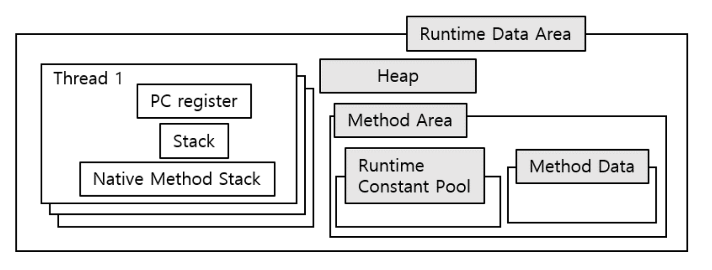

# 2. 자바 메모리 영역과 메모리 오버플로

## 2.2 런타임 데이터 영역

자바 가상 머신은 자바 프로그램을 실행하는 동안 필요한 메모리를 몇 개의 데이터 영역으로 나눠 관리

이 영역들은 각각 목적과 생성/삭제 시점이 있음

어떤 영역은 가상 머신 프로세스의 시작과 동시에 만들어지며, 어떤 영역은 사용자 스레드의 시작과 종료에 맞춰 생성 및 삭제된다.

런타임 데이터 영역은

다음과 같이 구성되어있다.

모든 스레드가 공유하는 데이터 영역

- 메서드 영역(런타임 상수 풀)
- 힙
- 실행 엔진
- 네이티브 라이브러리

스레드별 데이터 영역(스레드 프라이빗)

- 가상 머신 스택
- 네이티브 메서드 스택
- PC 레지스터

### 2.2.1 PC

PC 레지스터는 작은 메모리 영역으로 현재 실행 중인 스레드의 바이트코드 줄 번호 표시기라고 생각하면 쉽다.

바이트코드 인터프리터는 이 카운터의 값을 바꿔 다음에 실행할 바이트코드 명령어를 선택하는 식으로 동작한다.

예외 처리 및 스레드 복원 같은 모든 기본 기능이 바로 로이 표시기를 활용해 이뤄진다.

참고로 PC 영역은 OOM 조건이 명시되지 않은 유일한 영역이다.

### 2.2.2 자바 가상 머신 스택

PC처럼 자바 가상 머신 스택도 스레드 프라이빗

연결된 스레드와 라이프 사이클이 일치한다.

가상 머신 스택은 자바 메서드를 실행하는 스레드의 메모리 모델을 설명하는데, 각 메서드가 호출될 때마다 자바 가상 머신은 스택 프레임을 만들어 지역 변수 테이블, 피연산자 스택, 동적 링크, 메서드 반환값 등의 정보를 저장한다.

자바의 메모리 영역을 힙 메모리와 스택 메모리로 구분하는 사람이 많다.

이 구분법은 전통적인 C,C++ 프로그램의 메모리 구조에서 기인한 것으로, 자바 언어를 설명하기에는 무리가 있음

훨씬 더 복잡하기 때문이다.

자바 메서드는 스택 프레임에서 지역 변수용으로 할당받아야 할 공간의 크기가 이미 완벽하게 결정되어있다.

메서드 실행 중에는 절대 변하지 않는다.

여기서 이야기한 크기는 변수 슬롯 개수이다.

이때 명세서에서는 두 가지 오류를 기술한다.

1. 스택 깊이가 머신이 허용하는 깊이보다 크다면 StackOverFlow
2. 스택 용량을 동적으로 할당할 수 있는 JVM에서는 확장하려는 시점에 여유 메모리가 충분하지 않다면 OOM을 던진다.

### 2.2.3 네이티브 메서드 스택

네이티브 메서드 스택은 JVM과 비슷하지만 차이는 네이티브 메서드를 실행할 때 사용한다.

JVM 명세는 네이티브 메서드 스택에 대한 내용이 없어서 이를 합쳐놓은 가상 머신도 있다.

### 2.2.4 자바 힙

자바 힙은 자바 애플리케이션이 사용할 수 있는 가장 큰 메모리다.

자바 힙은 모든 스레드가 공유하며 가상 머신이 구동될 때 만들어진다.

이 메모리 영역의 유일한 목적은 객체 인스턴스를 저장하는 것이고, 자바 세계의 거의 모든 객체 인스턴스가 이 영역에 할당된다.

일단 명세에는 "모든 객체 인스턴스와 배열은 힙에 할당된다"라고 적혀있다.

자바 힙은 가비지컬렉터가 관리하는 영역이기 때문에 어떤 문헌에서는 GC 힙이라고도 한다.

메모리 회수 관점에서 가비지 컬렉터는 generational collection theory를 기초로 설계됐다.

그래서 자바 힙은 new generation, old generation, 영구 세대, 에덴 공간, from survior space, to survior space와 같은 용어가 자주 등장한다.

여러 문헌에서 힙 메모리가 세대를 나뉜다 설명한다.

한편 JVM 힙 명세에 따르면 물리적으론 떨어져도 되지만 논리적으로는 연속되어야한다고 한다.

### 2.2.5 메서드 영역

메서드 영역은 가상 머신이 읽어 들인 타입 정보, 상수, 정적 변수, 그리고 JIT 컴파일러가 컴파일한 코드 캐시 등을 저장하는데 이용된다.

논리적으로는 힙의 한 부분으로 JVM 명세서에서는 표현하지만 구분을 위해 논힙이라고도 부른다.

GC를 돌릴수도 있고 안 돌릴수도 있다.

### 2.2.6 런타임 상수 풀

런타임 상수풀은 메서드 영역의 일부다.

상수 풀 테이블에 클래스 버전, 필드, 메서드, 인터페이스 등 클래스 파일에 포함된 설명 정보에 더해 컴파일타임에 생성된 다양한 리터럴과 심벌 참조가 저장된다.

가상 머신이 클래스를 로드할 때 이러한 정보를 메서드 영역의 런타임 상수 풀에 저장한다.

클래스 파일의 상수 풀과 비교해 런타임 상수 풀은 동적이라는 차이가 있다.

개발자들이 많이 사용하는 String 클래스의 intern() 메서드가 이러한 특성이 반영되어있다.

메서드 영역에 포함되어있으므로 메서드 영역을 넘을 수 없다 따라서 OOM을 던질 수 있다.

### 2.2.7 다이렉트 메모리

자바 가상 머신 명세에 정의된 영역은 아니지만 NIO가 도압되면서 채널과 버퍼 기반 I/O 메서드가 소개됐다.

이게 네이티브 함수 라이브러리를 이용하는데, 물리 메모리를 직접 할당하면서 OOM이 발생할 수 있다.

(톰캣)

## 2.3 핫스팟 가상 머신에서의 객체 들여다보기

### 2.3.1 객체 생성

자바는 객체지향 프로그래밍 언어다.

보통 단순히 new를 실행한다.

실제로는 어떤 과정을 통해 객체가 생성될까 ?

이 명령의 매개 변수가 상수 풀 안의 클래스를 가리키는 심벌 참조인지 확인 후 이 심벌 참조가 뜻하는 클래스가
로딩, 해석, 초기화되었는지 확인한다.

준비되지 않았다면 로딩부터 해야한다.

로딩이 완료되었으면 새 객체를 담을 메모리를 할당한다. 객체에 필요한 메모리는 로딩하면 완벽하게 알 수 있다.

한편 자바 힙은 완벽하지 않아 사용 중인 메모리에 객체 크기 만큼 추가 할당하지 않다.

따라서 가용 메모리 블록들을 목록으로 따로 관리해서 객체 인스턴스를 담기에 충분한 공간을 찾아 할당한다.
이를 free list라 한다.

이거는 compact를 할 수 있냐에 따라서 실제 구현이 다르다.

### 2.3.2 객체의 메모리 레이아웃

핫스팟 가상 머신은 객체를 세 부분으로 나눠 힙에 저장한다.

바로 객체 헤더, 인스턴스 데이터, 길이 맞추기용 정렬 패딩이다.

#### 객체 헤더

####

####
