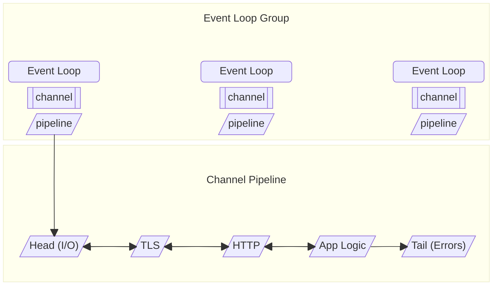

# Netty 위협 모델 (Threat Model)

> 이 문서는 Netty 공식 Wiki의 "Threat Model" 페이지를 한국어로 번역한 것입니다.
> 원본: https://netty.io/wiki/threat-model.html

---

# Netty Threat Model

Netty는 유지보수 가능한 고성능 프로토콜 서버와 클라이언트를 빠르게 개발하기 위한 비동기 이벤트 기반 네트워크 애플리케이션 프레임워크입니다.

## 아키텍처 개요

일반적인 애플리케이션에서 Netty의 역할은 다음과 같이 구성됩니다.

1. 여러 이벤트 루프를 관리하는 이벤트 루프 그룹.
2. 각 이벤트 루프는 여러 채널을 관리.
3. 각 채널은 핸들러로 구성된 파이프라인을 가짐.
4. 핸들러는 입력 데이터를 처리해 출력 데이터를 만들어냄.
5. Netty는 HTTP 파싱/인코딩, 압축, DNS, TLS 등을 위한 표준 핸들러 모음을 포함.
6. 데이터는 Netty 메모리 할당자가 제공하는 버퍼를 통해 네트워크와 주고받음.

위의 주요 컴포넌트 외에도 Netty는 많은 코덱을 포함합니다: HTTP/2, HTTP/3, QUIC, DNS, JBoss Marshalling, MQTT, Protobuf, Redis, SMTP, SOCKS, STOMP, HAProxy, Memcache, JSON, XML, 그리고 길이 또는 구분자 기반 프레이밍 코덱 등입니다.

이벤트 루프는 epoll, kqueue, NIO, io_uring 같은 다양한 전송을 사용해 운영체제와 통신하며 I/O를 수행하고, 이들 중 대부분은 Netty가 유지보수하는 native 코드를 포함합니다.

마지막으로 Netty는 BoringSSL, AWS-LC, OpenSSL 같은 native TLS 구현도 활용할 수 있으며, 이들도 native 코드를 포함합니다.

## 경계와 범위

Netty는 프레임워크로서 두 개의 경계와 함께 동작합니다.

1. 외부 경계: 운영체제로 호출이 들어가 I/O를 수행하고 시스템 프로세스 안팎으로 데이터를 옮기는 곳.
2. 내부 경계: 애플리케이션이 자신의 네트워킹 사용 사례를 위해 Netty와 통합되어 Netty API를 호출하는 곳.

외부 경계를 통해 이동하는 데이터는 일반적으로 신뢰할 수 없으며, 애플리케이션이 처리하기 전에 애플리케이션에 적합한 검증과 인증 단계를 거쳐야 합니다.

내부 경계를 통해 이동하는 데이터는 일반적으로 신뢰할 수 있지만, 가능한 곳에서는 검증을 수행합니다.

저수준 네트워킹 API로서 우리는 통합자가 특정 프로토콜을 따르기로 한 연결에 임의의 데이터를 보내는 것까지 막을 수는 없습니다. 그러나 예를 들어 HTTP API를 통해 지나가는 HTTP 헤더는 검증할 수 있습니다.

## 자산, 위험, 완화 조치

**개인키 자료(Private key material).**

Netty가 서버 모드 또는 인증된 클라이언트 모드에서 TLS를 사용하도록 설정되면, 인증서를 제시할 수 있어야 하고, 그에 대응하는 개인키에 접근하거나 개인키를 관리하는 TPM/HSM에 접근할 수 있어야 합니다.

개인키 자료는 파일, `KeyManager` 인스턴스, 또는 `OpenSslAsyncPrivateKeyMethod` 콜백 형태로 접근됩니다. 이 타입들은 일반적인 채널 메서드를 통해서는 네트워크로 보낼 수 없으며(예: 파일은 `FileRegion` 객체로 보내야 함), 따라서 이 정보의 우발적 유출이 방지됩니다.

**애플리케이션 데이터.**

애플리케이션은 자신의 파이프라인을 임의의 프로토콜(완전히 커스텀 프로토콜 포함)을 처리하도록 구성할 수 있으며, TLS를 동반하든 그렇지 않든 단순히 HTTP에 한정되지 않습니다.

Netty는 어떤 데이터가 민감한지, 그리고 그 데이터가 어떤 피어를 위한 것인지 알 수 없습니다. 우리는 안전한 기본값을 권장하고, 어떤 일을 하는 가장 쉬운 방법이 가장 안전한 방법이 되도록 API를 설계할 수밖에 없습니다.

이를 위해 코덱은 모든 입력을 검증하고 디코딩 시 합리적인 자원 한도를 적용해야 합니다. 자원 한도에는 입력 크기 대비 CPU 사용을 제한하는 것(즉, MadeYouReset 같은 공격 방어)과 메모리 소비를 제한하는 것(즉, zip-bomb 방어) 모두가 포함됩니다. 인코딩 시에는 모든 outbound 객체를 검증해 인젝션이나 파서 desync 공격을 방지해야 합니다. Netty는 또한 `ByteBuf` 타입을 통해 모든 메모리 접근의 offset과 lifetime 경계를 검사해 off-heap 메모리 사용의 메모리 안전성을 보장합니다.

일부 코덱은 Java serialization 같은 권장하지 않는 기술에 의존합니다. 우리는 보안상 부담이 되는 모든 API를 deprecate했으며, downstream 프로젝트도 우리의 deprecation 경고를 읽기를 권장합니다.

다만 데이터 출처(provenance) 추적과 접근 제어는 Netty의 범위 밖입니다.

**프로세스 정보.**

Netty는 애플리케이션 프로세스에 관한 어떤 정보도 어떤 방식으로도 노출하거나 빼내지 않습니다. Netty는 메모리 할당자에 관한 메트릭 같은 것을 노출하기 위해 일부 JMX bean을 제공하지만, 이 bean들을 JMX 메트릭 시스템으로 노출하는 것은 opt-in이며 의도적인 프로그램 코드가 있어야 합니다.

Netty에는 일부 JFR 이벤트도 포함되어 있지만, 이들은 애플리케이션 정보를 포함하지 않으며 기본적으로 비활성화되어 있습니다. 다만 JFR이 기본 프로파일을 사용하면 광범위한 프로세스 정보를 포함하게 되므로 공개적으로 공유하기에 안전하지 않을 수 있다는 점은 유의해야 합니다.

**의존성.**

Netty는 가능한 한 적은 다른 라이브러리에 의존하도록 의도적으로 설계되어 있습니다. 이는 공급망 공격에 대한 노출을 제한합니다. Maven 빌드 도구 바이너리는 `mvnw`가 HTTPS로 다운로드하고 SHA-512 체크섬으로 검증합니다.

주요 의존성은 JCTools, BoringSSL, BouncyCastle입니다.

HTTP/3와 QUIC 구현은 Cloudflare의 Quiche에 의존합니다.

압축 코덱은 각 압축 알고리즘의 의존성을 끌어옵니다.

이 의존성들의 보안 이슈를 적시에 통지받기 위해 Dependabot에 의존합니다.

**네트워크 접근.**

Netty는 본래 네트워크 접근을 수반하며, 그것이 바로 Netty가 애플리케이션을 대신해 관리하는 것입니다. Netty는 애플리케이션의 지시에 따라서만 연결을 수립하고 I/O를 수행합니다. 어떤 규칙을 적용해야 할지 Netty는 알 수 없으므로, 무단 접근 방지는 일반적으로 Netty의 범위 밖입니다. 예를 들어 Server-Side Request Forgery 공격을 방어하고 싶은 애플리케이션은 자신의 파이프라인에 `IpSubnetFilter` 핸들러를 설치해, 네트워크 통신이 해당 애플리케이션에서 기대되는 엔드포인트로만 향하도록 보장할 수 있습니다.

**Netty 빌드 아티팩트.**

Netty는 매우 널리 사용되며 많은 애플리케이션의 핵심 컴포넌트이므로, 우리가 릴리스하는 빌드 아티팩트를 사람들이 신뢰할 수 있는 것이 중요합니다.

이를 위해 다음과 같은 검사와 메커니즘이 마련되어 있습니다.

1. "Owner" GitHub 그룹에 속하지 않은 사람의 PR은 머지 전에 항상 리뷰됩니다.
2. 모든 릴리스 빌드는 서명됩니다.
3. 릴리스 프로세스는 GitHub Actions에서 완전 자동화되어 실행되며, 메인테이너가 수동으로 트리거합니다.
4. Maven Central은 발행 사용자 계정을 인증하고 빌드 아티팩트가 공개되기 전에 검증합니다.
5. 발행 접근 권한은 GitHub Secrets로 보호됩니다.
