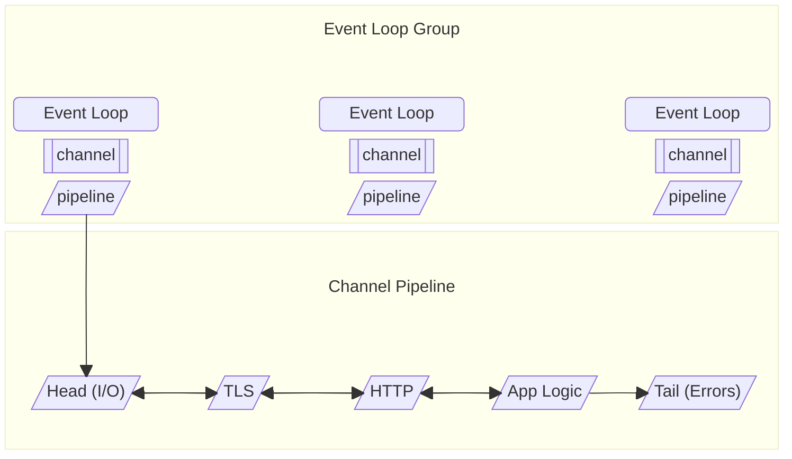

# Netty 벤치마크, 라이브러리 활용, Unsafe, 위협 모델

## Microbenchmarks

> 원본: https://netty.io/wiki/microbenchmarks.html

---

Netty에는 일련의 마이크로벤치마크 테스트를 수행하는 'netty-microbench'라는 모듈이 있습니다. 이 모듈은 HotSpot의 표준 마이크로벤치마킹 솔루션인 [OpenJDK JMH](http://openjdk.java.net/projects/code-tools/jmh/) 위에서 동작합니다. "건전지 포함" 방식이라 별도의 의존성을 추가할 필요 없이 바로 시작할 수 있습니다.

### 벤치마크 실행하기

명령줄에서 maven으로 실행하거나 IDE에서 직접 실행할 수 있습니다. 모든 테스트를 기본 설정으로 실행하려면 `mvn -DskipTests=false test`를 사용합니다. `skipTests=false`를 명시적으로 설정해야 하는 이유는, 일반 테스트 실행에서 (시간이 꽤 걸릴 수 있는) 마이크로벤치마크가 단위 테스트처럼 실행되는 것을 원치 않기 때문입니다.

실행이 정상적으로 진행되면 JMH가 지정된 fork 수만큼 워밍업과 측정 반복을 수행하며 요약을 출력합니다. 일반적인 벤치마크 실행 결과는 다음과 같습니다(출력에서 이런 결과를 여러 번 확인할 수 있습니다).

```
# Fork: 2 of 2
# Warmup: 10 iterations, 1 s each
# Measurement: 10 iterations, 1 s each
# Threads: 1 thread, will synchronize iterations
# Benchmark mode: Throughput, ops/time
# Running: io.netty.microbench.buffer.ByteBufAllocatorBenchmark.pooledDirectAllocAndFree_1_0
# Warmup Iteration   1: 8454.103 ops/ms
# Warmup Iteration   2: 11551.524 ops/ms
# Warmup Iteration   3: 11677.575 ops/ms
# Warmup Iteration   4: 11404.954 ops/ms
# Warmup Iteration   5: 11553.299 ops/ms
# Warmup Iteration   6: 11514.766 ops/ms
# Warmup Iteration   7: 11661.768 ops/ms
# Warmup Iteration   8: 11667.577 ops/ms
# Warmup Iteration   9: 11551.240 ops/ms
# Warmup Iteration  10: 11692.991 ops/ms
Iteration   1: 11633.877 ops/ms
Iteration   2: 11740.063 ops/ms
Iteration   3: 11751.798 ops/ms
Iteration   4: 11260.071 ops/ms
Iteration   5: 11461.010 ops/ms
Iteration   6: 11642.912 ops/ms
Iteration   7: 11808.595 ops/ms
Iteration   8: 11683.780 ops/ms
Iteration   9: 11750.292 ops/ms
Iteration  10: 11769.986 ops/ms

Result : 11650.238 ±(99.9%) 229.698 ops/ms
  Statistics: (min, avg, max) = (11260.071, 11650.238, 11808.595), stdev = 169.080
  Confidence interval (99.9%): [11420.540, 11879.937]
```

마지막으로 테스트 출력은 다음과 비슷한 모습이 됩니다(시스템 설정과 구성에 따라 다름).

```
Benchmark                                                                Mode   Samples         Mean   Mean error    Units
i.n.m.b.ByteBufAllocatorBenchmark.pooledDirectAllocAndFree_1_0          thrpt        20    11658.812      120.728   ops/ms
i.n.m.b.ByteBufAllocatorBenchmark.pooledDirectAllocAndFree_2_256        thrpt        20    10308.626      147.528   ops/ms
i.n.m.b.ByteBufAllocatorBenchmark.pooledDirectAllocAndFree_3_1024       thrpt        20     8855.815       55.933   ops/ms
i.n.m.b.ByteBufAllocatorBenchmark.pooledDirectAllocAndFree_4_4096       thrpt        20     5545.538     1279.721   ops/ms
i.n.m.b.ByteBufAllocatorBenchmark.pooledDirectAllocAndFree_5_16384      thrpt        20     6741.581       75.975   ops/ms
i.n.m.b.ByteBufAllocatorBenchmark.pooledDirectAllocAndFree_6_65536      thrpt        20     7252.869       70.609   ops/ms
i.n.m.b.ByteBufAllocatorBenchmark.pooledHeapAllocAndFree_1_0            thrpt        20     9750.225       73.900   ops/ms
i.n.m.b.ByteBufAllocatorBenchmark.pooledHeapAllocAndFree_2_256          thrpt        20     9936.639      657.818   ops/ms
i.n.m.b.ByteBufAllocatorBenchmark.pooledHeapAllocAndFree_3_1024         thrpt        20     8903.130      197.533   ops/ms
i.n.m.b.ByteBufAllocatorBenchmark.pooledHeapAllocAndFree_4_4096         thrpt        20     6664.157       74.163   ops/ms
i.n.m.b.ByteBufAllocatorBenchmark.pooledHeapAllocAndFree_5_16384        thrpt        20     6374.924      337.869   ops/ms
i.n.m.b.ByteBufAllocatorBenchmark.pooledHeapAllocAndFree_6_65536        thrpt        20     6386.337       44.960   ops/ms
i.n.m.b.ByteBufAllocatorBenchmark.unpooledDirectAllocAndFree_1_0        thrpt        20     2137.241       30.792   ops/ms
i.n.m.b.ByteBufAllocatorBenchmark.unpooledDirectAllocAndFree_2_256      thrpt        20     1873.727       41.843   ops/ms
i.n.m.b.ByteBufAllocatorBenchmark.unpooledDirectAllocAndFree_3_1024     thrpt        20     1902.025       34.473   ops/ms
i.n.m.b.ByteBufAllocatorBenchmark.unpooledDirectAllocAndFree_4_4096     thrpt        20     1534.347       20.509   ops/ms
i.n.m.b.ByteBufAllocatorBenchmark.unpooledDirectAllocAndFree_5_16384    thrpt        20      838.804       12.575   ops/ms
i.n.m.b.ByteBufAllocatorBenchmark.unpooledDirectAllocAndFree_6_65536    thrpt        20      276.976        3.021   ops/ms
i.n.m.b.ByteBufAllocatorBenchmark.unpooledHeapAllocAndFree_1_0          thrpt        20    35820.568      259.187   ops/ms
i.n.m.b.ByteBufAllocatorBenchmark.unpooledHeapAllocAndFree_2_256        thrpt        20    19660.951      295.012   ops/ms
i.n.m.b.ByteBufAllocatorBenchmark.unpooledHeapAllocAndFree_3_1024       thrpt        20     6264.614       77.704   ops/ms
i.n.m.b.ByteBufAllocatorBenchmark.unpooledHeapAllocAndFree_4_4096       thrpt        20     2921.598       95.492   ops/ms
i.n.m.b.ByteBufAllocatorBenchmark.unpooledHeapAllocAndFree_5_16384      thrpt        20      991.631       49.220   ops/ms
i.n.m.b.ByteBufAllocatorBenchmark.unpooledHeapAllocAndFree_6_65536      thrpt        20      261.718       11.108   ops/ms
Tests run: 1, Failures: 0, Errors: 0, Skipped: 0, Time elapsed: 993.382 sec - in io.netty.microbench.buffer.ByteBufAllocatorBenchmark
```

벤치마크는 IDE에서 직접 실행할 수도 있습니다. netty 부모 프로젝트를 임포트한 경우 `microbench` 서브프로젝트를 열고 `src/main/java/io/netty/microbench` 네임스페이스로 이동합니다. `buffer` 네임스페이스의 `ByteBufAllocatorBenchmark`는 다른 JUnit 기반 테스트와 동일한 방식으로 실행할 수 있습니다. 단, 현재는 전체 벤치마크를 한꺼번에만 실행할 수 있으며 개별 서브 벤치마크를 따로 실행할 수는 없습니다. 출력 결과는 `mvn`으로 직접 실행했을 때와 동일합니다.

### 벤치마크 작성하기

벤치마크 자체를 작성하는 일은 어렵지 않지만 올바르게 작성하기는 까다롭습니다. microbench 프로젝트가 복잡해서가 아니라, 벤치마크 작성 시 흔히 빠지는 함정을 피해야 하기 때문입니다. 다행히 JMH는 그런 함정 대부분을 방지할 수 있는 유용한 애너테이션과 기능을 제공합니다. 시작점으로, 벤치마크 클래스가 `AbstractMicrobenchmark`를 상속하도록 합니다. 이를 통해 JUnit으로 테스트가 실행되고 기본값이 설정됩니다.

```java
public class MyBenchmark extends AbstractMicrobenchmark {

}
```

다음으로, `@GenerateMicroBenchmark` 애너테이션을 붙인 메서드를 알아보기 쉬운 이름으로 정의합니다.

```java
@GenerateMicroBenchmark
public void measureSomethingHere() {

}
```

이후에는 [JMH 샘플 코드](http://hg.openjdk.java.net/code-tools/jmh/file/tip/jmh-samples/src/main/java/org/openjdk/jmh/samples/)를 참고해 올바른 벤치마크 작성법을 익히는 것이 좋습니다. JMH 주요 작성자 중 한 명의 [발표 자료](http://shipilev.net/#benchmarking)도 함께 살펴보세요.

### 런타임 조건 커스터마이징

`AbstractMicrobenchmark`의 기본 설정은 다음과 같습니다.

- 워밍업 반복: 10
- 측정 반복: 10
- fork 수: 2

이 설정들은 런타임에 시스템 프로퍼티(`warmupIterations`, `measureIterations`, `forks`)로 변경할 수 있습니다.

```
mvn -DskipTests=false -DwarmupIterations=2 -DmeasureIterations=3 -Dforks=1 test
```

일반적으로 이처럼 적은 반복 횟수는 권장되지 않지만, 벤치마크가 정상적으로 동작하는지 빠르게 확인할 때는 유용합니다.

애노테이션을 통해 테스트 단위로 기본 설정을 커스터마이징할 수도 있습니다.

```java
@Warmup(iterations = 20)
@Fork(1)
public class MyBenchmark extends AbstractMicrobenchmark {

}
```

이 설정은 클래스 단위와 메서드(벤치마크) 단위 모두에 적용할 수 있습니다. 명령줄 인자는 항상 애너테이션 기본값보다 우선합니다.

---

## Netty를 범용 라이브러리로 사용하기

> 원본: https://netty.io/wiki/using-as-a-generic-library.html

---

Netty는 네트워크 애플리케이션을 만들기 위한 프레임워크지만, 소켓 I/O를 수행하지 않는 프로그램에서도 유용한 기반 클래스를 함께 제공합니다.

### Buffer API

`io.netty.buffer`는 `ByteBuf`라는 범용 버퍼 타입을 제공합니다. `java.nio.ByteBuffer`와 비슷하지만 더 빠르고, 더 사용자 친화적이며, 확장 가능합니다.

#### 사용자 친화성

`java.nio.ByteBuffer.flip()` 호출을 빠뜨리고 버퍼가 비어 있는 이유를 의아하게 여겨본 적이 있나요? `ByteBuf`에는 읽기용과 쓰기용 두 개의 인덱스가 있어 그런 일이 일어나지 않습니다.

```java
ByteBuf buf = ...;
buf.writeUnsignedInt(42);
assertThat(buf.readUnsignedInt(), is(42));
```

`ByteBuf`는 버퍼 내용에 더 쉽게 접근할 수 있는 풍부한 접근 메서드 세트를 제공합니다. 예를 들어 부호 있는/없는 정수, 검색, 문자열용 접근 메서드가 있습니다.

#### 확장성

`java.nio.ByteBuffer`는 서브클래싱할 수 없지만 `ByteBuf`는 가능합니다. 편의를 위해 추상 골격(skeletal) 구현도 제공됩니다. 따라서 파일 기반 버퍼, 합성 버퍼, 심지어 하이브리드 같은 자신만의 버퍼 구현을 작성할 수 있습니다.

#### 성능

새 `java.nio.ByteBuffer`가 할당될 때 그 내용은 0으로 채워집니다. 이 "zeroing"은 CPU 사이클과 메모리 대역폭을 소비합니다. 보통 그 직후 어떤 데이터 소스로부터 버퍼가 채워지므로, zeroing은 결국 헛수고가 됩니다.

`java.nio.ByteBuffer`는 회수를 JVM 가비지 컬렉터에 의존합니다. heap 버퍼에는 잘 동작하지만 direct 버퍼에는 그렇지 않습니다. 설계상 direct 버퍼는 오랫동안 유지될 것으로 가정됩니다. 따라서 수명이 짧은 direct NIO 버퍼를 대량으로 할당하면 `OutOfMemoryError`가 발생하기 쉽습니다. 또한 (숨겨진 독점) API로 direct 버퍼를 명시적으로 해제하는 방법도 그다지 빠르지 않습니다.

`ByteBuf`의 라이프사이클은 참조 카운트에 묶여 있습니다. 카운트가 0이 되면, 그 기반 메모리 영역(`byte[]` 또는 direct 버퍼)이 명시적으로 dereferenced/deallocated되거나 풀로 반환됩니다.

Netty는 또한 버퍼를 zeroing하는 데 CPU 사이클이나 메모리 대역폭을 낭비하지 않는 견고한 버퍼 풀 구현을 제공합니다.

```java
ByteBufAllocator alloc = PooledByteBufAllocator.DEFAULT;
ByteBuf buf = alloc.directBuffer(1024);
...
buf.release(); // direct 버퍼가 풀로 반환된다.
```

다만 참조 카운트가 만능은 아닙니다. 풀로 반환되기 전에 JVM이 풀링된 버퍼의 기반 메모리 영역을 가비지 컬렉트해버리면, 누수가 결국 풀을 고갈시킵니다.

누수를 추적하는 데 도움이 되도록 Netty는 누수 검출 메커니즘을 제공하며, 애플리케이션 성능과 누수 보고서의 상세도 사이에서 트레이드오프를 조정할 수 있을 만큼 유연합니다. 자세한 내용은 [참조 카운트 객체](./08_reference_counted.md)를 참고하세요.

### 리스너를 등록할 수 있는 Future와 이벤트 루프

태스크를 비동기로 실행하고 완료 시 알림을 받는 일은 흔하고, 또 쉬워야 합니다. `java.util.concurrent.Future`가 처음 등장했을 때의 기대감은 오래가지 않았습니다. 완료 알림을 받으려면 _블록_ 해야 했기 때문입니다. 비동기 프로그래밍에서는 결과를 기다리는 대신 완료 시 _무엇을 할지_ 를 지정합니다.

`io.netty.util.concurrent.Future`는 JDK `Future`의 서브타입입니다. 리스너를 추가할 수 있고, future가 완료되면 이벤트 루프가 해당 리스너를 호출합니다.

`io.netty.util.concurrent.EventExecutor`는 `java.util.concurrent.ScheduledExecutorService`를 상속하는 단일 스레드 이벤트 루프입니다. 독자적인 이벤트 루프를 만들거나, 기능이 풍부한 태스크 executor로 활용할 수 있습니다. 보통은 병렬성을 활용하기 위해 여러 개의 `EventExecutor`를 생성합니다.

```java
EventExecutorGroup group = new DefaultEventExecutorGroup(4); // 스레드 4개
Future<?> f = group.submit(new Runnable() { ... });
f.addListener(new FutureListener<?> {
  public void operationComplete(Future<?> f) {
    ..
  }
});
...
```

#### 글로벌 이벤트 루프

라이프사이클 관리 없이도 언제든 사용 가능한 단일 executor가 필요할 때가 있습니다. `GlobalEventExecutor`는 단일 스레드 싱글턴 `EventExecutor`로, 스레드를 필요할 때 느리게(lazily) 시작하고 일정 시간 보류 태스크가 없으면 정지합니다.

```java
GlobalEventExecutor.INSTANCE.execute(new Runnable() { ... });
```

내부적으로 Netty는 다른 `EventExecutor`들의 종료를 통지하는 데 이 클래스를 사용합니다.

### 플랫폼 의존 연산

_참고: 이 기능은 내부 전용입니다. 충분한 수요가 있다면 internal 패키지 밖으로 이동하는 것을 검토 중입니다._

`io.netty.util.internal.PlatformDependent`는 플랫폼에 의존적이고 잠재적으로 unsafe한 연산을 제공합니다. `sun.misc.Unsafe`를 비롯한 플랫폼 의존 독점 API 위의 얇은 레이어라고 생각하시면 됩니다.

### 그 외 유틸리티

고성능 네트워크 애플리케이션 프레임워크를 구축하는 과정에서 도입한 유틸리티들이며, 그중 일부가 도움이 될 수 있습니다.

#### 스레드 로컬 객체 풀

스레드가 오래 살면서 같은 타입의 단수명 객체를 대량으로 할당하는 경우, `Recycler`라는 스레드 로컬 객체 풀을 사용할 수 있습니다. 생성되는 가비지 양을 줄여 메모리 대역폭 소비와 가비지 컬렉터 부담을 낮춥니다.

```java
public class MyObject {

  private static final Recycler<MyObject> RECYCLER = new Recycler<MyObject>() {
    protected MyObject newObject(Recycler.Handle<MyObject> handle) {
      return new MyObject(handle);
    }
  }

  public static MyObject newInstance(int a, String b) {
    MyObject obj = RECYCLER.get();
    obj.myFieldA = a;
    obj.myFieldB = b;
    return obj;
  }
    
  private final Recycler.Handle<MyObject> handle;
  private int myFieldA;
  private String myFieldB;

  private MyObject(Handle<MyObject> handle) {
    this.handle = handle;
  }
  
  public boolean recycle() {
    myFieldA = 0;
    myFieldB = null;
    return handle.recycle(this);
  }
}

MyObject obj = MyObject.newInstance(42, "foo");
...
obj.recycle();
```

#### 사용자 확장 가능한 enum

`enum`은 정적인 상수 집합에는 적합하지만 확장할 수 없습니다. 런타임에 상수를 추가하거나 서드파티가 추가 상수를 정의할 수 있게 하려면, 확장 가능한 `io.netty.util.ConstantPool`을 사용하세요.

```java
public final class Foo extends AbstractConstant<Foo> {
  Foo(int id, String name) {
    super(id, name);
  }
}

public final class MyConstants {

  private static final ConstantPool<Foo> pool = new ConstantPool<Foo>() {
    @Override
    protected Foo newConstant(int id, String name) {
      return new Foo(id, name);
    }
  };

  public static Foo valueOf(String name) {
    return pool.valueOf(name);
  }

  public static final Foo A = valueOf("A");
  public static final Foo B = valueOf("B");
}

private final class YourConstants {
  public static final Foo C = MyConstants.valueOf("C");
  public static final Foo D = MyConstants.valueOf("D");
}
```

Netty는 `ChannelOption`을 정의할 때 `ConstantPool`을 사용하여, 코어 외부의 전송 구현도 타입 안전한 방식으로 자체 옵션을 정의할 수 있도록 합니다.

#### 속성 맵 (Attribute map)

빠르고 타입 안전하며 스레드 안전한 키-값 모음을 위해 `io.netty.util.AttributeMap` 인터페이스를 사용할 수 있습니다.

```java
public class Foo extends DefaultAttributeMap {
  ...
}

public static final AttributeKey<String> ATTR_A = AttributeKey.valueOf("A");
public static final AttributeKey<Integer> ATTR_B = AttributeKey.valueOf("B");

Foo o = ...;
o.attr(ATTR_A).set("foo");
o.attr(ATTR_B).set(42);
```

`AttributeKey`는 `Constant`의 일종입니다.

#### Hashed wheel timer

Hashed wheel timer는 `java.util.Timer`와 `java.util.concurrent.ScheduledThreadPoolExecutor`에 대한 확장성 있는 대안입니다. 다음 표에서 보듯이 대량의 스케줄링 작업과 취소를 효율적으로 처리합니다.

| | 새 태스크 스케줄 | 태스크 취소 |
| --- | --- | --- |
| `HashedWheelTimer` | O(1) | O(1) |
| `java.util.Timer`와 `ScheduledThreadPoolExecutor` | O(logN) | O(logN) (N = 보류 중 태스크 수) |

내부적으로는 태스크의 타이밍(timing)을 키로 하는 해시 테이블을 사용하여 대부분의 타이머 연산에서 상수 시간을 제공합니다. (`java.util.Timer`는 이진 힙을 사용합니다.)

자세한 내용은 [이 슬라이드("Hashed and Hierarchical Timing Wheels," Dharmapurikar)](http://www.cse.wustl.edu/~cdgill/courses/cs6874/TimingWheels.ppt)와 [이 논문("Hashed and Hierarchical Timing Wheels: Data Structures for the Efficient Implementation of a Timer Facility," Varghese and Lauck)](http://www.cs.columbia.edu/~nahum/w6998/papers/sosp87-timing-wheels.pdf)을 참고하세요.

#### 그 외 잡다한 유틸리티

다음 클래스들은 유용하지만, Guava 같은 다른 라이브러리에 더 좋은 대안이 있을 수도 있습니다.

* `io.netty.util.CharsetUtil`은 자주 쓰이는 `java.nio.charset.Charset`을 제공합니다.
* `io.netty.util.NetUtil`은 IPv4/IPv6 loopback 주소의 `InetAddress` 같은, 자주 쓰이는 네트워크 관련 상수를 제공합니다.
* `io.netty.util.DefaultThreadFactory`는 executor 스레드를 손쉽게 설정할 수 있게 해주는 범용 `ThreadFactory` 구현입니다.

### Guava 및 JDK8과의 비교

Netty는 의존성을 최소화하려 하기 때문에, 일부 유틸리티 클래스는 [Guava](http://code.google.com/p/guava-libraries/) 같은 인기 라이브러리의 것과 유사합니다.

이런 라이브러리들은 JDK API의 불편함을 줄여주는 다양한 유틸리티 클래스와 대체 자료형을 제공하며, 이를 꽤 잘 해냅니다.

Netty는 다음을 위한 구성 요소 제공에 집중합니다.

* 비동기 프로그래밍
* 다음과 같은 저수준 연산 (이른바 "mechanical sympathy"):
  * Off-heap 접근
  * 독점 intrinsic 연산 접근
  * 플랫폼 의존 동작

자바는 때때로 Netty가 제공하던 구성 요소의 아이디어를 채택하며 발전합니다. 예를 들어 JDK 8은 [`CompletableFuture`](https://docs.oracle.com/javase/8/docs/api/java/util/concurrent/CompletableFuture.html)를 추가했는데, 이는 `io.netty.util.concurrent.Future`와 일부 겹칩니다. 그런 경우 Netty의 구성 요소는 원활한 마이그레이션 경로를 제공합니다. 향후 마이그레이션을 염두에 두고 API를 꾸준히 갱신할 예정입니다.

---

## Java 24와 sun.misc.Unsafe

> 원본: https://netty.io/wiki/java-24-and-sun.misc.unsafe.html

---

Java 24는 [JEP 498](https://openjdk.org/jeps/498)을 통합하면서 `sun.misc.Unsafe`의 메모리 접근 메서드가 처음 사용될 때 콘솔에 경고를 출력하기 시작했습니다.

Netty는 오래전부터 native(off-heap) 메모리를 더 효율적으로 다루기 위해 이 메서드들에 의존해 왔습니다. 따라서 Netty를 사용하는 애플리케이션을 Java 24 이상에서 실행하면 이 경고가 나타날 수 있습니다.

### Netty 4.1과 Unsafe

Netty 4.1을 사용할 때 이 경고를 없애려면 다음 JVM 명령줄 인자로 Unsafe 메모리 접근을 명시적으로 허용해야 합니다.

```
--sun-misc-unsafe-memory-access=allow
```

#### Netty 4.1.120과 4.1.121

Netty 4.1.120과 4.1.121은 사용자에게 이 경고가 보이지 않도록 Java 24 이상에서 실행될 때 `sun.misc.Unsafe` 사용을 기본적으로 비활성화했습니다 ([PR #14943](https://github.com/netty/netty/pull/14943)).

이 변경된 기본값은 Netty 4.1.122에서 되돌려졌고 ([PR #15296](https://github.com/netty/netty/pull/15296)), 동작이 Netty 4.1.119와 같아졌습니다.

이 동작 변경을 되돌린 이유는 1) 성능 회귀가 예상보다 컸고, 2) JNI 사용(예: native 전송이나 native TLS 구현 사용 시)도 비슷한 경고를 유발하지만 Netty 4.x 버전에서는 이를 우회할 방법이 없기 때문입니다.

### Netty 4.2와 Unsafe

Netty 4.2.0과 4.2.1은 별도의 예방 조치를 하지 않으며, Netty 4.1(4.1.120/4.1.121 제외)과 동일한 경고를 출력합니다.

Netty 4.2.2 이상은 `Unsafe`에 대한 의존을 피하기 위해 `MemorySegment` API 사용을 지원합니다. 메모리 세그먼트 지원은 두 가지 변형으로 제공됩니다.

1. **선호되는 방식:** 시스템의 `malloc`/`free` 함수에 직접 링크. ([PR #15366](https://github.com/netty/netty/pull/15366))
   * 이 메커니즘은 Java 24부터 지원되지만 native access가 활성화되어 있어야 합니다.
   * native access를 활성화하려면 다음 명령줄 인자로 JVM을 실행해야 합니다:
   * `--enable-native-access=io.netty.common`
   * 이 메커니즘은 Netty 4.2.3부터 사용할 수 있습니다.
   * 할당과 해제 시 오버헤드가 가장 적기 때문에 선호되는 방식입니다.
2. **Fallback:** 공유 메모리 세그먼트 arena 사용. ([PR #15231](https://github.com/netty/netty/pull/15231))
   * 이 메커니즘은 native access를 요구하지 않습니다.
   * 그러나 JDK 버그로 인해 Java 25부터만 사용할 수 있습니다 ([PR #15338](https://github.com/netty/netty/pull/15338))
   * 이 메커니즘은 Netty 4.2.2부터 사용할 수 있습니다.
   * 이 메커니즘은 native access를 요구하지 않으므로 최후의 fallback입니다. 다만 공유 arena를 해제하는 일은 thread-local handshake(safepoint의 더 저렴한 형태)와 JIT 비최적화를 수반하기 때문에 비쌉니다.

### Netty가 Unsafe를 사용하는 용도

Netty와 그 native 전송은 데이터를 heap에 복사하지 않고 운영체제와 직접 주고받기 위해 native(off-heap) 메모리가 필요합니다.

native 메모리를 효과적으로 다루려면 메모리를 할당할 뿐 아니라 사용이 끝나는 즉시 해제할 수단이 필요합니다. Netty는 direct `ByteBuffer` 내부의 cleaner 인스턴스에 접근하기 위해 `Unsafe`를 사용하며, 이 cleaner가 direct `ByteBuffer`의 메모리를 해제하는 메커니즘입니다.

`Unsafe`를 사용할 수 없는 경우에는 `ByteBuffer` cleaner도 사용할 수 없으므로, Netty는 메모리 해제를 가비지 컬렉터에 의존해야 합니다.

가비지 컬렉터는 heap 메모리 압박에 반응해 동작하는데, direct 버퍼는 heap에 큰 메모리 압박을 만들지 않습니다. 그 결과 native 메모리가 필요 이상으로 늦게 해제되어 메모리 사용량이 늘어납니다. JDK는 이를 완화하기 위해 새 direct `ByteBuffer`를 할당할 때 가끔 명시적으로 GC를 수행하고 100밀리초 동안 sleep합니다.

이러한 동작 — 명시적 GC 증가와 100밀리초 sleep — 은 Netty에서 허용할 수 없습니다. 이벤트 루프 스레드에서는 sleep이든 어떠한 블로킹 연산도 허용되지 않습니다.

이런 이유로, direct `ByteBuffer` cleaner를 사용할 수 없는 경우 Netty는 기본적으로 heap 버퍼를 사용합니다.

결과적으로 `Unsafe`를 사용할 수 없는 환경에서는 heap 사용량이 크게 늘어나고, GC에 소요되는 시간과 CPU 자원도 증가하여 시스템 전반의 성능이 저하됩니다.

---

## Netty 위협 모델 (Threat Model)

> 원본: https://netty.io/wiki/threat-model.html

---

Netty는 유지보수 가능한 고성능 프로토콜 서버와 클라이언트를 빠르게 개발하기 위한 비동기 이벤트 기반 네트워크 애플리케이션 프레임워크입니다.

### 아키텍처 개요

일반적인 애플리케이션에서 Netty의 역할은 다음과 같이 구성됩니다.

1. 여러 이벤트 루프를 관리하는 이벤트 루프 그룹.
2. 각 이벤트 루프는 여러 채널을 관리.
3. 각 채널은 핸들러로 구성된 파이프라인을 가짐.
4. 핸들러는 입력 데이터를 처리해 출력 데이터를 만들어냄.
5. Netty는 HTTP 파싱/인코딩, 압축, DNS, TLS 등을 위한 표준 핸들러 모음을 포함.
6. 데이터는 Netty 메모리 할당자가 제공하는 버퍼를 통해 네트워크와 주고받음.



위의 주요 컴포넌트 외에도 Netty는 많은 코덱을 포함합니다: HTTP/2, HTTP/3, QUIC, DNS, JBoss Marshalling, MQTT, Protobuf, Redis, SMTP, SOCKS, STOMP, HAProxy, Memcache, JSON, XML, 그리고 길이 또는 구분자 기반 프레이밍 코덱 등입니다.

이벤트 루프는 epoll, kqueue, NIO, io_uring 같은 다양한 전송을 사용해 운영체제와 통신하며 I/O를 수행하고, 이들 중 대부분은 Netty가 유지보수하는 native 코드를 포함합니다.

마지막으로 Netty는 BoringSSL, AWS-LC, OpenSSL 같은 native TLS 구현도 활용할 수 있으며, 이들도 native 코드를 포함합니다.

### 경계와 범위

Netty는 프레임워크로서 두 개의 경계와 함께 동작합니다.

1. 외부 경계: 운영체제로 호출이 들어가 I/O를 수행하고 시스템 프로세스 안팎으로 데이터를 옮기는 곳.
2. 내부 경계: 애플리케이션이 자신의 네트워킹 사용 사례를 위해 Netty와 통합되어 Netty API를 호출하는 곳.

외부 경계를 통해 이동하는 데이터는 일반적으로 신뢰할 수 없으며, 애플리케이션이 처리하기 전에 애플리케이션에 적합한 검증과 인증 단계를 거쳐야 합니다.

내부 경계를 통해 이동하는 데이터는 일반적으로 신뢰할 수 있지만, 가능한 곳에서는 검증을 수행합니다.

저수준 네트워킹 API인 특성상, 특정 프로토콜을 사용하기로 한 연결에 통합자가 임의의 데이터를 전송하는 것까지 막을 수는 없습니다. 그러나 예를 들어 HTTP API를 통해 전달되는 HTTP 헤더는 검증할 수 있습니다.

### 자산, 위험, 완화 조치

**개인키 자료(Private key material).**

Netty가 서버 모드 또는 인증된 클라이언트 모드에서 TLS를 사용하도록 설정되면, 인증서를 제시할 수 있어야 하고, 그에 대응하는 개인키에 접근하거나 개인키를 관리하는 TPM/HSM에 접근할 수 있어야 합니다.

개인키 자료는 파일, `KeyManager` 인스턴스, 또는 `OpenSslAsyncPrivateKeyMethod` 콜백 형태로 접근됩니다. 이 타입들은 일반적인 채널 메서드를 통해서는 네트워크로 보낼 수 없으며(예: 파일은 `FileRegion` 객체로 보내야 함), 따라서 이 정보의 우발적 유출이 방지됩니다.

**애플리케이션 데이터.**

애플리케이션은 자신의 파이프라인을 임의의 프로토콜(완전히 커스텀 프로토콜 포함)을 처리하도록 구성할 수 있으며, TLS를 동반하든 그렇지 않든 단순히 HTTP에 한정되지 않습니다.

Netty는 어떤 데이터가 민감한지, 그리고 그 데이터가 어떤 피어를 위한 것인지 알 수 없습니다. 따라서 안전한 기본값을 권장하고, 어떤 작업을 수행하는 가장 쉬운 방법이 가장 안전한 방법이 되도록 API를 설계하는 것이 최선입니다.

이를 위해 코덱은 모든 입력을 검증하고 디코딩 시 합리적인 자원 한도를 적용해야 합니다. 자원 한도에는 입력 크기 대비 CPU 사용 제한(MadeYouReset 같은 공격 방어)과 메모리 소비 제한(zip-bomb 방어)이 모두 포함됩니다. 인코딩 시에는 모든 outbound 객체를 검증해 인젝션 및 파서 desync 공격을 방지해야 합니다. Netty는 `ByteBuf` 타입을 통해 모든 메모리 접근의 offset과 lifetime 경계를 검사하여 off-heap 메모리 사용의 메모리 안전성을 보장합니다.

일부 코덱은 Java serialization 같은 권장하지 않는 기술에 의존합니다. 우리는 보안상 부담이 되는 모든 API를 deprecate했으며, downstream 프로젝트도 우리의 deprecation 경고를 읽기를 권장합니다.

다만 데이터 출처(provenance) 추적과 접근 제어는 Netty의 범위 밖입니다.

**프로세스 정보.**

Netty는 애플리케이션 프로세스에 관한 어떤 정보도 어떤 방식으로도 노출하거나 빼내지 않습니다. Netty는 메모리 할당자에 관한 메트릭 같은 것을 노출하기 위해 일부 JMX bean을 제공하지만, 이 bean들을 JMX 메트릭 시스템으로 노출하는 것은 opt-in이며 의도적인 프로그램 코드가 있어야 합니다.

Netty에는 일부 JFR 이벤트도 포함되어 있지만, 이들은 애플리케이션 정보를 포함하지 않으며 기본적으로 비활성화되어 있습니다. 다만 JFR이 기본 프로파일을 사용하면 광범위한 프로세스 정보를 포함하게 되므로 공개적으로 공유하기에 안전하지 않을 수 있다는 점은 유의해야 합니다.

**의존성.**

Netty는 가능한 한 적은 다른 라이브러리에 의존하도록 의도적으로 설계되어 있습니다. 이는 공급망 공격에 대한 노출을 제한합니다. Maven 빌드 도구 바이너리는 `mvnw`가 HTTPS로 다운로드하고 SHA-512 체크섬으로 검증합니다.

주요 의존성은 JCTools, BoringSSL, BouncyCastle입니다.

HTTP/3와 QUIC 구현은 Cloudflare의 Quiche에 의존합니다.

압축 코덱은 각 압축 알고리즘의 의존성을 끌어옵니다.

이 의존성들의 보안 이슈를 적시에 통지받기 위해 Dependabot에 의존합니다.

**네트워크 접근.**

Netty는 본래 네트워크 접근을 수반하며, 그것이 바로 Netty가 애플리케이션을 대신해 관리하는 것입니다. Netty는 애플리케이션의 지시에 따라서만 연결을 수립하고 I/O를 수행합니다. 어떤 규칙을 적용해야 할지 Netty는 알 수 없으므로, 무단 접근 방지는 일반적으로 Netty의 범위 밖입니다. 예를 들어 Server-Side Request Forgery 공격을 방어하고 싶은 애플리케이션은 자신의 파이프라인에 `IpSubnetFilter` 핸들러를 설치해, 네트워크 통신이 해당 애플리케이션에서 기대되는 엔드포인트로만 향하도록 보장할 수 있습니다.

**Netty 빌드 아티팩트.**

Netty는 매우 널리 사용되며 많은 애플리케이션의 핵심 컴포넌트이므로, 릴리스하는 빌드 아티팩트에 대한 신뢰성을 확보하는 것이 중요합니다.

이를 위해 다음과 같은 검사와 메커니즘이 마련되어 있습니다.

1. "Owner" GitHub 그룹에 속하지 않은 사람의 PR은 머지 전에 항상 리뷰됩니다.
2. 모든 릴리스 빌드는 서명됩니다.
3. 릴리스 프로세스는 GitHub Actions에서 완전 자동화되어 실행되며, 메인테이너가 수동으로 트리거합니다.
4. Maven Central은 발행 사용자 계정을 인증하고 빌드 아티팩트가 공개되기 전에 검증합니다.
5. 발행 접근 권한은 GitHub Secrets로 보호됩니다.
