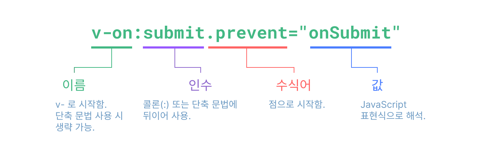
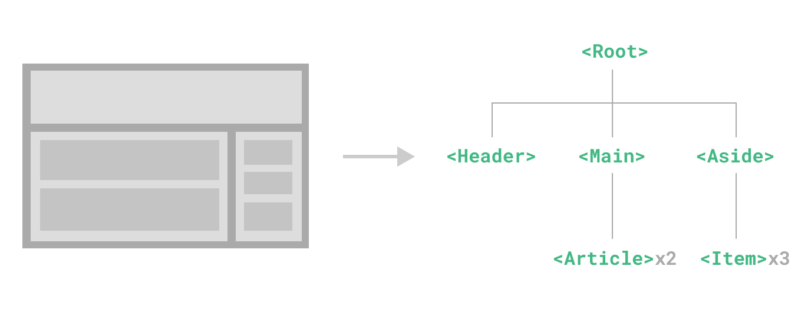
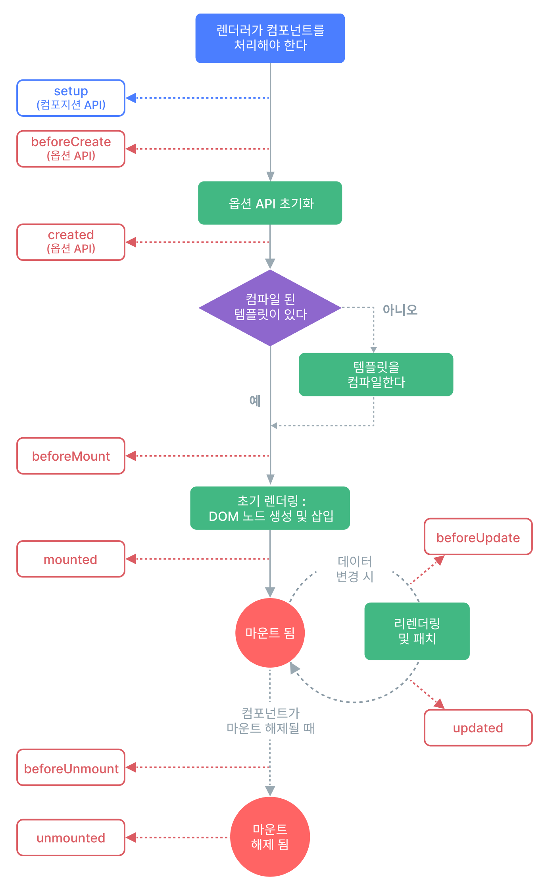

# Vue 3 템플릿과 반응성 기초

애플리케이션을 생성한 뒤에는 상태를 화면에 표시하고 사용자의 입력을 상태에 반영해야 합니다. 템플릿 문법과 반응성을 바탕으로 조건부 렌더링, 목록, 폼, 감시자와 라이프사이클을 차례로 살펴봅니다.

## 목차

- [Vue 애플리케이션 생성하기](#guide-essentials-application)
- [템플릿 문법](#guide-essentials-template-syntax)
- [반응성 기본](#guide-essentials-reactivity-fundamentals)
- [계산된 속성](#guide-essentials-computed)
- [클래스와 스타일 바인딩](#guide-essentials-class-and-style)
- [조건부 렌더링](#guide-essentials-conditional)
- [리스트 렌더링](#guide-essentials-list)
- [이벤트 처리](#guide-essentials-event-handling)
- [폼 입력 바인딩](#guide-essentials-forms)
- [감시자(Watchers)](#guide-essentials-watchers)
- [템플릿(template) ref](#guide-essentials-template-refs)
- [컴포넌트 기본](#guide-essentials-component-basics)
- [라이프사이클 훅](#guide-essentials-lifecycle)

---

<a id="guide-essentials-application"></a>

<a id="guide-essentials-application-creating-a-vue-application"></a>

## Vue 애플리케이션 생성하기

> 원문: https://github.com/vuejs/docs/blob/40aa88af0094f7bab4aaf786e55c748a6a251d88/src/guide/essentials/application.md
> 한국어 번역 기반: https://github.com/vuejs-translations/docs-ko/blob/6e646acb5687510feda533281faa546b26ea243c/src/guide/essentials/application.md

<a id="guide-essentials-application-the-application-instance"></a>

### 애플리케이션 인스턴스
모든 Vue 애플리케이션은 [`createApp`](07_composition_and_reactivity_apis.md#api-application-createapp) 함수로 새로운 **애플리케이션 인스턴스(instance)**를 생성하는 것에서 시작합니다:

```js
import { createApp } from 'vue'

const app = createApp({
  /* 루트 컴포넌트 옵션 */
})
```

<a id="guide-essentials-application-the-root-component"></a>

### 루트 컴포넌트
`createApp`에 전달하는 객체는 사실 컴포넌트(component)입니다. 모든 앱은 자식 컴포넌트를 포함할 수 있는 "루트 컴포넌트"가 필요합니다.

싱글 파일 컴포넌트를 사용하는 경우, 일반적으로 루트 컴포넌트를 다른 파일에서 import합니다:

```js
import { createApp } from 'vue'
// 싱글 파일 컴포넌트에서 루트 컴포넌트 App을 import합니다.
import App from './App.vue'

const app = createApp(App)
```

이 가이드의 많은 예제에서는 단일 컴포넌트만 필요하지만, 대부분의 실제 애플리케이션은 중첩되고 재사용 가능한 컴포넌트 트리로 구성됩니다. 예를 들어, Todo 애플리케이션의 컴포넌트 트리는 다음과 같을 수 있습니다:

```
App (루트 컴포넌트)
├─ TodoList
│  └─ TodoItem
│     ├─ TodoDeleteButton
│     └─ TodoEditButton
└─ TodoFooter
   ├─ TodoClearButton
   └─ TodoStatistics
```

여러 컴포넌트를 정의하고 조합하는 방법은 뒤에서 다룹니다. 먼저 하나의 컴포넌트 안에서 상태와 화면이 어떻게 연결되는지 살펴보겠습니다.

<a id="guide-essentials-application-mounting-the-app"></a>

### 앱 마운트(mount)하기
애플리케이션 인스턴스는 `.mount()` 메서드가 호출되기 전까지 아무것도 렌더링(rendering)하지 않습니다. 이 메서드는 "컨테이너" 인자를 필요로 하는데, 이 인자는 실제 DOM 요소일 수도 있고 선택자 문자열일 수도 있습니다:

```html
<div id="app"></div>
```

```js
app.mount('#app')
```

앱 루트 컴포넌트의 내용은 컨테이너 요소 내부에 렌더링됩니다. 컨테이너 요소 자체는 앱의 일부로 간주되지 않습니다.

`.mount()` 메서드는 모든 앱 설정 및 에셋 등록이 완료된 후에 항상 호출해야 합니다. 또한, 에셋 등록 메서드와 달리 반환값이 애플리케이션 인스턴스가 아니라 루트 컴포넌트 인스턴스라는 점에 유의하세요.

<a id="guide-essentials-application-in-dom-root-component-template"></a>

#### DOM 내 루트 컴포넌트 템플릿
루트 컴포넌트의 템플릿(template)은 보통 컴포넌트 자체의 일부이지만, 마운트 컨테이너 내부에 직접 작성하여 별도로 템플릿을 제공할 수도 있습니다:

```html
<div id="app">
  <button @click="count++">{{ count }}</button>
</div>
```

```js
import { createApp } from 'vue'

const app = createApp({
  data() {
    return {
      count: 0
    }
  }
})

app.mount('#app')
```

루트 컴포넌트에 `template` 옵션이 따로 없다면, Vue는 자동으로 컨테이너의 `innerHTML`을 템플릿으로 사용합니다.

DOM 내 템플릿은 [빌드 단계 없이 Vue를 사용하는](01_getting_started_and_tutorial.md#guide-quick-start-using-vue-from-cdn) 애플리케이션에서 자주 사용됩니다. 또한 서버 사이드 프레임워크와 함께 사용할 수도 있으며, 이 경우 루트 템플릿이 서버에서 동적으로 생성될 수 있습니다.

<a id="guide-essentials-application-app-configurations"></a>

### 앱 설정
애플리케이션 인스턴스는 몇 가지 앱 레벨 옵션을 설정할 수 있는 `.config` 객체를 제공합니다. 예를 들어, 모든 하위 컴포넌트에서 발생하는 오류를 포착하는 앱 레벨 오류 핸들러를 정의할 수 있습니다:

```js
app.config.errorHandler = (err) => {
  /* 오류 처리 */
}
```

애플리케이션 인스턴스는 앱 범위의 에셋을 등록할 수 있는 몇 가지 메서드도 제공합니다. 예를 들어, 컴포넌트를 등록할 수 있습니다:

```js
app.component('TodoDeleteButton', TodoDeleteButton)
```

이렇게 하면 `TodoDeleteButton`을 앱 어디에서나 사용할 수 있습니다. 컴포넌트 및 기타 유형의 에셋 등록에 대해서는 가이드의 뒷부분에서 다룰 예정입니다. 또한 [API 레퍼런스](07_composition_and_reactivity_apis.md#api-application)에서 애플리케이션 인스턴스 API 전체 목록을 확인할 수 있습니다.

앱을 마운트하기 전에 모든 앱 설정을 적용했는지 꼭 확인하세요!

<a id="guide-essentials-application-multiple-application-instances"></a>

### 여러 애플리케이션 인스턴스
동일한 페이지에서 하나의 애플리케이션 인스턴스만 사용할 필요는 없습니다. `createApp` API를 사용하면 여러 Vue 애플리케이션이 같은 페이지 안에서 각자의 설정과 전역 에셋 범위를 가지고 공존할 수 있습니다:

```js
const app1 = createApp({
  /* ... */
})
app1.mount('#container-1')

const app2 = createApp({
  /* ... */
})
app2.mount('#container-2')
```

Vue를 사용하여 서버 렌더링된 HTML을 향상시키고, 큰 페이지의 특정 부분만 Vue로 제어해야 하는 경우, 전체 페이지에 단일 Vue 애플리케이션 인스턴스를 마운트하는 것을 피하세요. 대신, 여러 개의 작은 애플리케이션 인스턴스를 생성하여 각각이 담당하는 요소에 마운트하세요.

---

<a id="guide-essentials-template-syntax"></a>

<a id="guide-essentials-template-syntax-template-syntax"></a>

## 템플릿 문법

> 원문: https://github.com/vuejs/docs/blob/40aa88af0094f7bab4aaf786e55c748a6a251d88/src/guide/essentials/template-syntax.md
> 한국어 번역 기반: https://github.com/vuejs-translations/docs-ko/blob/6e646acb5687510feda533281faa546b26ea243c/src/guide/essentials/template-syntax.md


[Scrimba에서 인터랙티브 비디오 강의 시청하기](https://scrimba.com/links/vue-template-syntax)


Vue는 HTML 기반의 템플릿(template) 문법을 사용하여 렌더링(rendering)된 DOM을 컴포넌트 인스턴스(instance)의 데이터에 선언적으로 바인딩(binding)할 수 있게 해줍니다. 모든 Vue 템플릿은 문법적으로 유효한 HTML이기 때문에, 표준을 준수하는 브라우저와 HTML 파서에서 파싱될 수 있습니다.

내부적으로 Vue는 템플릿을 JavaScript 코드로 컴파일합니다. 이 코드와 반응성(reactivity) 시스템을 통해 상태 변경의 영향을 받는 컴포넌트(component)를 파악하고, 필요한 DOM 조작만 적용합니다.

Virtual DOM 개념에 익숙하고 JavaScript의 강력한 기능을 선호한다면, 템플릿 대신 [렌더 함수](06_reactivity_and_rendering_in_depth.md#guide-extras-render-function)를 직접 작성할 수도 있으며, 선택적으로 JSX도 지원합니다. 하지만, 이 경우 템플릿만큼의 컴파일 타임 최적화는 누릴 수 없다는 점에 유의하세요.

<a id="guide-essentials-template-syntax-text-interpolation"></a>

### 텍스트 보간
데이터 바인딩의 가장 기본적인 형태는 "이중 중괄호(mustache)" 문법을 사용하는 텍스트 보간(interpolation)입니다:

```vue-html
<span>메시지: {{ msg }}</span>
```

이중 중괄호 태그는 [해당 컴포넌트 인스턴스](02_essentials.md#guide-essentials-reactivity-fundamentals-declaring-reactive-state)의 `msg` 속성 값으로 대체됩니다. 또한 `msg` 속성이 변경될 때마다 자동으로 업데이트됩니다.

<a id="guide-essentials-template-syntax-raw-html"></a>

### 원시 HTML
이중 중괄호는 데이터를 일반 텍스트로 해석하며, HTML로 해석하지 않습니다. 실제 HTML을 출력하려면 [`v-html` 디렉티브(directive)](08_component_and_advanced_apis.md#api-built-in-directives-v-html)를 사용해야 합니다:

```vue-html
<p>텍스트 보간 사용: {{ rawHtml }}</p>
<p>v-html 디렉티브 사용: <span v-html="rawHtml"></span></p>
```


**문서 데모 설정 코드**

```vue
<script setup>
  const rawHtml = '<span style="color: red">이것은 빨간색이어야 합니다.</span>'
</script>
```


```vue-html
<div class="demo">
  <p>텍스트 보간 사용: {{ rawHtml }}</p>
  <p>v-html 디렉티브 사용: <span v-html="rawHtml"></span></p>
</div>
```


`v-html`처럼 `v-`로 시작하는 Vue 전용 속성을 **디렉티브**라고 부릅니다. 디렉티브는 렌더링된 DOM에 반응형 동작을 적용합니다. 이 예제의 `v-html`은 요소의 inner HTML을 현재 활성 인스턴스의 `rawHtml` 속성과 동기화합니다.

`span`의 내용은 `rawHtml` 속성의 값으로 대체되며, 일반 HTML로 해석됩니다. 데이터 바인딩은 무시됩니다. `v-html`을 사용하여 템플릿 일부를 조합할 수는 없습니다. Vue는 문자열 기반 템플릿 엔진이 아니기 때문입니다. 대신, UI 재사용과 조합의 기본 단위로 컴포넌트를 사용하는 것이 권장됩니다.

**보안 경고**
웹사이트에서 임의의 HTML을 동적으로 렌더링하는 것은 매우 위험할 수 있습니다. [XSS 취약점](https://en.wikipedia.org/wiki/Cross-site_scripting)으로 쉽게 이어질 수 있기 때문입니다. `v-html`은 신뢰할 수 있는 콘텐츠에만 사용하고, **절대** 사용자로부터 입력받은 콘텐츠에는 사용하지 마세요.


<a id="guide-essentials-template-syntax-attribute-bindings"></a>

### 속성 바인딩
이중 중괄호는 HTML 속성 내부에서는 사용할 수 없습니다. 대신 [`v-bind` 디렉티브](08_component_and_advanced_apis.md#api-built-in-directives-v-bind)를 사용하세요:

```vue-html
<div v-bind:id="dynamicId"></div>
```

`v-bind` 디렉티브는 요소의 `id` 속성을 컴포넌트의 `dynamicId` 속성과 동기화하도록 Vue에 지시합니다. 바인딩된 값이 `null` 또는 `undefined`이면, 해당 속성은 렌더링된 요소에서 제거됩니다.

<a id="guide-essentials-template-syntax-shorthand"></a>

#### 축약 문법
`v-bind`는 매우 자주 사용되기 때문에 전용 축약 문법이 있습니다:

```vue-html
<div :id="dynamicId"></div>
```

`:`로 시작하는 속성은 일반 HTML과는 다르게 보일 수 있지만, `:`는 실제로 속성 이름에 사용할 수 있는 유효한 문자이며, Vue가 지원하는 모든 브라우저에서 올바르게 파싱됩니다. 또한, 최종 렌더링된 마크업에는 나타나지 않습니다. 축약 문법은 선택 사항이지만, 이후 사용법을 더 배우면 그 편리함을 알게 될 것입니다.

> 이후 가이드의 코드 예제에서는 축약 문법을 사용할 것입니다. 이는 Vue 개발자들이 가장 많이 사용하는 방식이기 때문입니다.

<a id="guide-essentials-template-syntax-same-name-shorthand"></a>

#### 동일 이름 축약 문법
- 3.4+에서만 지원

속성 이름이 바인딩하려는 JavaScript 변수 이름과 동일하다면, 속성 값을 생략하여 더 짧게 쓸 수 있습니다:

```vue-html
<!-- :id="id"와 동일 -->
<div :id></div>

<!-- 이것도 동작합니다 -->
<div v-bind:id></div>
```

이는 JavaScript에서 객체 선언 시 프로퍼티(property) 축약 문법과 유사합니다. 이 기능은 Vue 3.4 이상에서만 사용할 수 있습니다.

<a id="guide-essentials-template-syntax-boolean-attributes"></a>

#### 불리언 속성
[불리언 속성](https://html.spec.whatwg.org/multipage/common-microsyntaxes.html#boolean-attributes)은 요소에 존재하는지 여부로 true/false 값을 나타내는 속성입니다. 예를 들어, [`disabled`](https://developer.mozilla.org/ko/docs/Web/HTML/Attributes/disabled)는 가장 많이 사용되는 불리언 속성 중 하나입니다.

이 경우 `v-bind`는 약간 다르게 동작합니다:

```vue-html
<button :disabled="isButtonDisabled">버튼</button>
```

`isButtonDisabled`가 [truthy 값](https://developer.mozilla.org/ko/docs/Glossary/Truthy)이면 `disabled` 속성이 포함됩니다. 값이 빈 문자열이어도 `<button disabled="">`와 일관성을 유지하기 위해 포함됩니다. 그 외의 [falsy 값](https://developer.mozilla.org/ko/docs/Glossary/Falsy)인 경우 속성이 생략됩니다.

<a id="guide-essentials-template-syntax-dynamically-binding-multiple-attributes"></a>

#### 여러 속성 동적 바인딩
다음과 같이 여러 속성을 나타내는 JavaScript 객체가 있다면:


**컴포지션 API**


```js
const objectOfAttrs = {
  id: 'container',
  class: 'wrapper',
  style: 'background-color:green'
}
```


**옵션 API**


```js
data() {
  return {
    objectOfAttrs: {
      id: 'container',
      class: 'wrapper'
    }
  }
}
```


`v-bind`를 인자 없이 사용하면 이 객체를 한 번에 바인딩할 수 있습니다:

```vue-html
<div v-bind="objectOfAttrs"></div>
```

<a id="guide-essentials-template-syntax-using-javascript-expressions"></a>

### JavaScript 표현식 사용하기
지금까지는 템플릿에서 단순한 속성 키에만 바인딩했습니다. 하지만 Vue는 모든 데이터 바인딩에서 JavaScript 표현식의 강력한 기능을 지원합니다:

```vue-html
{{ number + 1 }}

{{ ok ? 'YES' : 'NO' }}

{{ message.split('').reverse().join('') }}

<div :id="`list-${id}`"></div>
```

이러한 표현식은 현재 컴포넌트 인스턴스의 데이터 범위 내에서 JavaScript로 평가됩니다.

Vue 템플릿에서는 다음 위치에서 JavaScript 표현식을 사용할 수 있습니다:

- 텍스트 보간(이중 중괄호) 내부
- 모든 Vue 디렉티브(즉, `v-`로 시작하는 특수 속성)의 속성 값

<a id="guide-essentials-template-syntax-expressions-only"></a>

#### 표현식만 허용
각 바인딩에는 **하나의 표현식**만 포함될 수 있습니다. 표현식이란 값을 평가할 수 있는 코드 조각입니다. 간단히 말해, `return` 뒤에 쓸 수 있는지로 판단할 수 있습니다.

따라서, 다음과 같은 코드는 **동작하지 않습니다**:

```vue-html
<!-- 이건 표현식이 아니라 문장입니다: -->
{{ var a = 1 }}

<!-- 흐름 제어도 동작하지 않습니다. 삼항 연산자를 사용하세요 -->
{{ if (ok) { return message } }}
```

<a id="guide-essentials-template-syntax-calling-functions"></a>

#### 함수 호출하기
바인딩 표현식 내에서 컴포넌트에 노출된 메서드를 호출할 수 있습니다:

```vue-html
<time :title="toTitleDate(date)" :datetime="date">
  {{ formatDate(date) }}
</time>
```

**참고**
바인딩 표현식 내에서 호출하는 함수는 컴포넌트가 업데이트될 때마다 실행되므로, 데이터 변경이나 비동기 작업과 같은 **부수 효과**이 없어야 합니다.


<a id="guide-essentials-template-syntax-restricted-globals-access"></a>

#### 제한된 전역 접근
템플릿 표현식은 샌드박스화되어 있으며, [제한된 전역 목록](https://github.com/vuejs/core/blob/main/packages/shared/src/globalsAllowList.ts#L3)에만 접근할 수 있습니다. 이 목록에는 `Math`와 `Date`와 같은 자주 사용되는 내장 전역 객체가 포함되어 있습니다.

목록에 명시적으로 포함되지 않은 전역, 예를 들어 `window`에 추가한 사용자 속성 등은 템플릿 표현식에서 접근할 수 없습니다. 하지만 [`app.config.globalProperties`](07_composition_and_reactivity_apis.md#api-application-app-config-globalproperties)에 추가하는 방식으로, 모든 Vue 표현식에서 사용할 전역을 명시적으로 정의할 수 있습니다.

<a id="guide-essentials-template-syntax-directives"></a>

### 디렉티브
디렉티브는 `v-` 접두사가 붙은 특수 속성입니다. Vue는 위에서 소개한 `v-html`과 `v-bind`를 포함하여 여러 [내장 디렉티브](08_component_and_advanced_apis.md#api-built-in-directives)를 제공합니다.

디렉티브 속성 값은 단일 JavaScript 표현식이어야 합니다(`v-for`, `v-on`, `v-slot`은 예외이며, 각각의 섹션에서 다룹니다). 디렉티브의 역할은 표현식의 값이 변경될 때 DOM에 반응적으로 업데이트를 적용하는 것입니다. 예를 들어 [`v-if`](08_component_and_advanced_apis.md#api-built-in-directives-v-if)는 다음과 같이 사용합니다:

```vue-html
<p v-if="seen">이제 나를 볼 수 있습니다</p>
```

여기서 `v-if` 디렉티브는 `seen` 표현식의 진위값에 따라 `<p>` 요소를 삽입하거나 제거합니다.

<a id="guide-essentials-template-syntax-arguments"></a>

#### 인자
일부 디렉티브는 콜론으로 표시되는 "인자"를 받을 수 있습니다. 예를 들어, `v-bind` 디렉티브는 HTML 속성을 반응적으로 업데이트하는 데 사용됩니다:

```vue-html
<a v-bind:href="url"> ... </a>

<!-- 축약 문법 -->
<a :href="url"> ... </a>
```

여기서 `href`는 인자이며, `v-bind` 디렉티브에 요소의 `href` 속성을 `url` 표현식의 값에 바인딩하라고 지시합니다. 축약 문법에서는 인자 앞의 모든 부분(즉, `v-bind:`)이 `:` 한 글자로 줄어듭니다.

또 다른 예는 DOM 이벤트를 감지하는 `v-on` 디렉티브입니다:

```vue-html
<a v-on:click="doSomething"> ... </a>

<!-- 축약 문법 -->
<a @click="doSomething"> ... </a>
```

여기서 인자는 감지할 이벤트 이름인 `click`입니다. `v-on`에도 `@`라는 축약 문법이 있습니다. 이벤트 처리에 대해서는 이후에 더 자세히 다룹니다.

<a id="guide-essentials-template-syntax-dynamic-arguments"></a>

#### 동적 인자
디렉티브 인자에 대괄호로 감싼 JavaScript 표현식을 사용할 수도 있습니다:

```vue-html
<!--
인자 표현식에는 아래 "동적 인자 값 제약" 및 "동적 인자 문법 제약"
섹션에서 설명한 몇 가지 제약이 있습니다.
-->
<a v-bind:[attributeName]="url"> ... </a>

<!-- 축약 문법 -->
<a :[attributeName]="url"> ... </a>
```

여기서 `attributeName`은 JavaScript 표현식으로 동적으로 평가되며, 평가된 값이 최종 인자 값으로 사용됩니다. 예를 들어, 컴포넌트 인스턴스에 `attributeName` 데이터 속성이 있고 그 값이 `"href"`라면, 이 바인딩은 `v-bind:href`와 동일하게 동작합니다.

마찬가지로, 동적 인자를 사용하여 동적 이벤트 이름에 핸들러를 바인딩할 수도 있습니다:

```vue-html
<a v-on:[eventName]="doSomething"> ... </a>

<!-- 축약 문법 -->
<a @[eventName]="doSomething"> ... </a>
```

이 예시에서 `eventName`의 값이 `"focus"`라면, `v-on:[eventName]`은 `v-on:focus`와 동일하게 동작합니다.

<a id="guide-essentials-template-syntax-dynamic-argument-value-constraints"></a>

##### 동적 인자 값 제약
동적 인자는 문자열로 평가되어야 하며, `null`은 예외입니다. 특별한 값인 `null`은 바인딩을 명시적으로 제거하는 데 사용할 수 있습니다. 그 외의 비문자열 값은 경고를 발생시킵니다.

<a id="guide-essentials-template-syntax-dynamic-argument-syntax-constraints"></a>

##### 동적 인자 문법 제약
동적 인자 표현식에는 몇 가지 문법 제약이 있습니다. 공백이나 따옴표와 같은 일부 문자는 HTML 속성 이름에 사용할 수 없기 때문입니다. 예를 들어, 다음은 유효하지 않습니다:

```vue-html
<!-- 컴파일러 경고가 발생합니다. -->
<a :['foo' + bar]="value"> ... </a>
```

복잡한 동적 인자를 전달해야 한다면, [계산된 속성(computed property)](02_essentials.md#guide-essentials-computed)을 사용하는 것이 더 좋습니다. 이에 대해서는 곧 다룹니다.

in-DOM 템플릿(HTML 파일에 직접 작성된 템플릿)을 사용할 때는, 브라우저가 속성 이름을 소문자로 변환하므로 대문자가 포함된 키 이름을 피해야 합니다:

```vue-html
<a :[someAttr]="value"> ... </a>
```

위 코드는 in-DOM 템플릿에서 `:[someattr]`로 변환됩니다. 컴포넌트에 `someattr`가 아니라 `someAttr` 속성이 있다면, 이 코드는 동작하지 않습니다. 싱글 파일 컴포넌트 내부의 템플릿은 **이 제약을 받지 않습니다**.

<a id="guide-essentials-template-syntax-modifiers"></a>

#### 수식어
수식어(modifier)는 점(`.`)으로 표시되는 특수 접미사로, 디렉티브가 특별한 방식으로 바인딩되어야 함을 나타냅니다. 예를 들어, `.prevent` 수식어는 `v-on` 디렉티브에 트리거된 이벤트에서 `event.preventDefault()`를 호출하라고 지시합니다:

```vue-html
<form @submit.prevent="onSubmit">...</form>
```

이후 [v-on](02_essentials.md#guide-essentials-event-handling-event-modifiers)과 [v-model](02_essentials.md#guide-essentials-forms-modifiers)에서 수식어의 다른 예시도 살펴볼 것입니다.

마지막으로, 전체 디렉티브 문법을 시각화한 그림입니다:



<!-- https://www.figma.com/file/BGWUknIrtY9HOmbmad0vFr/Directive -->

---

<a id="guide-essentials-reactivity-fundamentals"></a>

<a id="guide-essentials-reactivity-fundamentals-reactivity-fundamentals"></a>

## 반응성 기본

> 원문: https://github.com/vuejs/docs/blob/40aa88af0094f7bab4aaf786e55c748a6a251d88/src/guide/essentials/reactivity-fundamentals.md
> 한국어 번역 기반: https://github.com/vuejs-translations/docs-ko/blob/6e646acb5687510feda533281faa546b26ea243c/src/guide/essentials/reactivity-fundamentals.md

**API Preference**
이 문서는 옵션 API와 컴포지션 API 예제를 함께 제공합니다. 각 예제의 API 표시를 확인하며 사용하는 방식에 맞춰 읽으면 됩니다.


**옵션 API**


<a id="guide-essentials-reactivity-fundamentals-declaring-reactive-state"></a>

### 반응형 상태 선언하기 \*
옵션 API에서는 컴포넌트(component)의 반응형 상태를 선언하기 위해 `data` 옵션을 사용합니다. 이 옵션의 값은 객체를 반환하는 함수여야 합니다. Vue는 새로운 컴포넌트 인스턴스(instance)를 생성할 때 이 함수를 호출하고, 반환된 객체를 반응성(reactivity) 시스템으로 감쌉니다. 이 객체의 최상위 속성들은 컴포넌트 인스턴스(`methods`와 라이프사이클 훅에서의 `this`)에 프록시(proxy)됩니다:

```js{2-6}
export default {
  data() {
    return {
      count: 1
    }
  },

  // `mounted`는 나중에 설명할 라이프사이클 훅입니다
  mounted() {
    // `this`는 컴포넌트 인스턴스를 가리킵니다.
    console.log(this.count) // => 1

    // 데이터도 변경할 수 있습니다
    this.count = 2
  }
}
```

[Playground에서 실행해보기](https://play.vuejs.org/#eNpFUNFqhDAQ/JXBpzsoHu2j3B2U/oYPpnGtoetGkrW2iP/eRFsPApthd2Zndilex7H8mqioimu0wY16r4W+Rx8ULXVmYsVSC9AaNafz/gcC6RTkHwHWT6IVnne85rI+1ZLr5YJmyG1qG7gIA3Yd2R/LhN77T8y9sz1mwuyYkXazcQI2SiHz/7iP3VlQexeb5KKjEKEe2lPyMIxeSBROohqxVO4E6yV6ppL9xykTy83tOQvd7tnzoZtDwhrBO2GYNFloYWLyxrzPPOi44WWLWUt618txvASUhhRCKSHgbZt2scKy7HfCujGOqWL9BVfOgyI=)

이러한 인스턴스 속성들은 인스턴스가 처음 생성될 때만 추가되므로, `data` 함수가 반환하는 객체에 모든 속성이 반드시 포함되어 있어야 합니다. 필요한 경우, 원하는 값이 아직 준비되지 않은 속성에는 `null`, `undefined` 또는 다른 플레이스홀더 값을 사용하세요.

`data`에 포함하지 않고 `this`에 직접 새로운 속성을 추가하는 것도 가능합니다. 하지만 이렇게 추가된 속성은 반응형 업데이트를 트리거할 수 없습니다.

Vue는 컴포넌트 인스턴스를 통해 자체 내장 API를 노출할 때 `$` 접두사를 사용합니다. 또한 내부 속성에는 `_` 접두사를 예약해두었습니다. 최상위 `data` 속성의 이름을 이 두 문자로 시작하지 않도록 하세요.

<a id="guide-essentials-reactivity-fundamentals-reactive-proxy-vs-original"></a>

#### 반응형 프록시 vs. 원본 \*
Vue 3에서는 [JavaScript Proxy](https://developer.mozilla.org/ko/docs/Web/JavaScript/Reference/Global_Objects/Proxy)를 활용해 데이터를 반응형으로 만듭니다. Vue 2를 사용하다 넘어왔다면 다음과 같은 예외 케이스에 주의해야 합니다:

```js
export default {
  data() {
    return {
      someObject: {}
    }
  },
  mounted() {
    const newObject = {}
    this.someObject = newObject

    console.log(newObject === this.someObject) // false
  }
}
```

할당 후 `this.someObject`에 접근하면, 값은 원본 `newObject`의 반응형 프록시입니다. **Vue 2와 달리, 원본 `newObject`는 그대로 남아 있고 반응형이 되지 않습니다: 반응형 상태는 항상 `this`의 속성으로 접근해야 합니다.**


**컴포지션 API**


<a id="guide-essentials-reactivity-fundamentals-declaring-reactive-state-1"></a>

### 반응형 상태 선언하기 \*\*
<a id="guide-essentials-reactivity-fundamentals-ref"></a>

#### `ref()` \*\*
컴포지션 API에서는 [`ref()`](07_composition_and_reactivity_apis.md#api-reactivity-core-ref) 함수를 사용해 반응형 상태를 선언하는 것이 권장됩니다:

```js
import { ref } from 'vue'

const count = ref(0)
```

`ref()`는 인자를 받아 `.value` 속성이 있는 ref 객체로 감싸 반환합니다:

```js
const count = ref(0)

console.log(count) // { value: 0 }
console.log(count.value) // 0

count.value++
console.log(count.value) // 1
```

> 참고: [Ref 타입 지정](05_scaling_typescript_and_best_practices.md#guide-typescript-composition-api-typing-ref)  (TypeScript)

컴포넌트의 템플릿(template)에서 ref에 접근하려면, 컴포넌트의 `setup()` 함수에서 선언하고 반환해야 합니다:

```js{5,9-11}
import { ref } from 'vue'

export default {
  // `setup`은 Composition API를 위한 특별한 훅입니다.
  setup() {
    const count = ref(0)

    // ref를 템플릿에 노출
    return {
      count
    }
  }
}
```

```vue-html
<div>{{ count }}</div>
```

템플릿에서는 ref가 자동으로 언래핑되므로 `.value`를 붙일 필요가 **없습니다**(몇 가지 [주의사항](02_essentials.md#guide-essentials-reactivity-fundamentals-caveat-when-unwrapping-in-templates)이 있습니다).

이벤트 핸들러에서 ref를 직접 변경할 수도 있습니다:

```vue-html{1}
<button @click="count++">
  {{ count }}
</button>
```

더 복잡한 로직의 경우, 같은 스코프에서 ref를 변경하는 함수를 선언하고 상태와 함께 메서드로 노출할 수 있습니다:

```js{7-10,15}
import { ref } from 'vue'

export default {
  setup() {
    const count = ref(0)

    function increment() {
      // JavaScript에서는 .value가 필요합니다
      count.value++
    }

    // 함수도 반드시 노출해야 합니다.
    return {
      count,
      increment
    }
  }
}
```

노출된 메서드는 이벤트 핸들러로 사용할 수 있습니다:

```vue-html{1}
<button @click="increment">
  {{ count }}
</button>
```

이 예제는 빌드 도구 없이 [Codepen](https://codepen.io/vuejs-examples/pen/WNYbaqo)에서 직접 확인할 수 있습니다.

<a id="guide-essentials-reactivity-fundamentals-script-setup"></a>

#### `<script setup>` \*\*
`setup()`을 통해 상태와 메서드를 수동으로 노출하는 것은 다소 장황할 수 있습니다. 다행히 [싱글 파일 컴포넌트(SFC)](01_getting_started_and_tutorial.md#guide-scaling-up-sfc)를 사용한다면 이러한 번거로움을 피할 수 있습니다. `<script setup>`을 쓰면 더 간단하게 작성할 수 있습니다:

```vue{1}
<script setup>
import { ref } from 'vue'

const count = ref(0)

function increment() {
  count.value++
}
</script>

<template>
  <button @click="increment">
    {{ count }}
  </button>
</template>
```

[Playground에서 실행해보기](https://play.vuejs.org/#eNo9jUEKgzAQRa8yZKMiaNcllvYe2dgwQqiZhDhxE3L3jrW4/DPvv1/UK8Zhz6juSm82uciwIef4MOR8DImhQMIFKiwpeGgEbQwZsoE2BhsyMUwH0d66475ksuwCgSOb0CNx20ExBCc77POase8NVUN6PBdlSwKjj+vMKAlAvzOzWJ52dfYzGXXpjPoBAKX856uopDGeFfnq8XKp+gWq4FAi)

`<script setup>`에서 선언된 최상위 import, 변수, 함수는 해당 컴포넌트의 템플릿에서 자동으로 사용할 수 있습니다. 템플릿을 같은 스코프에 선언된 JavaScript 함수라고 생각하면, 자연스럽게 함께 선언된 모든 것에 접근할 수 있습니다.

**참고**
이후 가이드에서는 컴포지션 API 코드 예제에 SFC + `<script setup>` 문법을 주로 사용할 예정입니다. 이는 Vue 개발자들이 가장 많이 사용하는 방식입니다.

SFC를 사용하지 않는 경우에도 [`setup()`](07_composition_and_reactivity_apis.md#api-composition-api-setup) 옵션으로 컴포지션 API를 사용할 수 있습니다.


<a id="guide-essentials-reactivity-fundamentals-why-refs"></a>

#### 왜 Ref를 사용할까요? \*\*
왜 단순 변수 대신 `.value`가 있는 ref가 필요한지 궁금할 수 있습니다. 이를 설명하기 위해 Vue의 반응성 시스템이 어떻게 동작하는지 간단히 살펴보겠습니다.

템플릿에서 ref를 사용하고, 이후 ref의 값을 변경하면, Vue는 변경을 자동으로 감지하고 DOM을 업데이트합니다. 이는 의존성 추적 기반의 반응성 시스템 덕분입니다. 컴포넌트가 처음 렌더링(rendering)될 때, Vue는 렌더링에 사용된 모든 ref를 **추적**합니다. 그 후 ref가 변경되면, 이를 추적 중인 컴포넌트의 **재렌더링**이 트리거됩니다.

일반 JavaScript에서는 단순 변수의 접근이나 변경을 감지할 방법이 없습니다. 하지만 객체의 속성에 대해서는 getter와 setter를 사용해 get/set 연산을 가로챌 수 있습니다.

`.value` 속성은 ref가 접근되거나 변경되는 시점을 Vue가 감지할 수 있게 해줍니다. 내부적으로 Vue는 getter에서 추적을, setter에서 트리거를 수행합니다. 개념적으로 ref는 다음과 같은 객체라고 생각할 수 있습니다:

```js
// 의사 코드, 실제 구현이 아닙니다
const myRef = {
  _value: 0,
  get value() {
    track()
    return this._value
  },
  set value(newValue) {
    this._value = newValue
    trigger()
  }
}
```

ref의 또 다른 장점은, 단순 변수와 달리 ref를 함수에 전달해도 최신 값과 반응성 연결을 유지할 수 있다는 점입니다. 이는 복잡한 로직을 재사용 가능한 코드로 리팩토링할 때 특히 유용합니다.

반응성 시스템에 대한 자세한 내용은 [반응성 심층](06_reactivity_and_rendering_in_depth.md#guide-extras-reactivity-in-depth) 섹션에서 다룹니다.


**옵션 API**


<a id="guide-essentials-reactivity-fundamentals-declaring-methods"></a>

### 메서드 선언하기 \*

참고 강의: https://vueschool.io/lessons/methods-in-vue-3


컴포넌트 인스턴스에 메서드를 추가하려면 `methods` 옵션을 사용합니다. 이 옵션은 원하는 메서드를 포함하는 객체여야 합니다:

```js{7-11}
export default {
  data() {
    return {
      count: 0
    }
  },
  methods: {
    increment() {
      this.count++
    }
  },
  mounted() {
    // 메서드는 라이프사이클 훅이나 다른 메서드에서 호출할 수 있습니다!
    this.increment()
  }
}
```

Vue는 `methods`의 `this` 값을 자동으로 바인딩(binding)하여 항상 컴포넌트 인스턴스를 가리키게 합니다. 덕분에 메서드가 이벤트 리스너(listener)나 콜백(callback)으로 사용될 때도 올바른 `this` 값을 유지합니다. `methods`를 정의할 때는 화살표 함수를 사용하지 마세요. 화살표 함수는 Vue가 적절한 `this` 값을 바인딩하지 못하게 만듭니다:

```js
export default {
  methods: {
    increment: () => {
      // 잘못된 예: 여기서는 `this`에 접근할 수 없습니다!
    }
  }
}
```

컴포넌트 인스턴스의 다른 모든 속성과 마찬가지로, `methods`도 컴포넌트의 템플릿에서 접근할 수 있습니다. 템플릿에서는 주로 이벤트 리스너로 사용됩니다:

```vue-html
<button @click="increment">{{ count }}</button>
```

[Playground에서 실행해보기](https://play.vuejs.org/#eNplj9EKwyAMRX8l+LSx0e65uLL9hy+dZlTWqtg4BuK/z1baDgZicsPJgUR2d656B2QN45P02lErDH6c9QQKn10YCKIwAKqj7nAsPYBHCt6sCUDaYKiBS8lpLuk8/yNSb9XUrKg20uOIhnYXAPV6qhbF6fRvmOeodn6hfzwLKkx+vN5OyIFwdENHmBMAfwQia+AmBy1fV8E2gWBtjOUASInXBcxLvN4MLH0BCe1i4Q==)

위 예제에서 `<button>`이 클릭되면 `increment` 메서드가 호출됩니다.


<a id="guide-essentials-reactivity-fundamentals-deep-reactivity"></a>

#### 깊은 반응성

**옵션 API**


Vue에서 상태는 기본적으로 깊은 반응성을 가집니다. 즉, 중첩된 객체나 배열을 변경해도 변경 사항이 감지됩니다:

```js
export default {
  data() {
    return {
      obj: {
        nested: { count: 0 },
        arr: ['foo', 'bar']
      }
    }
  },
  methods: {
    mutateDeeply() {
      // 아래 코드도 정상적으로 동작합니다.
      this.obj.nested.count++
      this.obj.arr.push('baz')
    }
  }
}
```


**컴포지션 API**


Ref는 깊게 중첩된 객체, 배열, 또는 `Map`과 같은 JavaScript 내장 데이터 구조 등 어떤 값도 담을 수 있습니다.

ref는 자신의 값을 깊게 반응형으로 만듭니다. 즉, 중첩된 객체나 배열을 변경해도 변경 사항이 감지됩니다:

```js
import { ref } from 'vue'

const obj = ref({
  nested: { count: 0 },
  arr: ['foo', 'bar']
})

function mutateDeeply() {
  // 아래 코드도 정상적으로 동작합니다.
  obj.value.nested.count++
  obj.value.arr.push('baz')
}
```

비원시 값은 아래에서 설명할 [`reactive()`](02_essentials.md#guide-essentials-reactivity-fundamentals-reactive)를 통해 반응형 프록시로 변환됩니다.

[shallow ref](07_composition_and_reactivity_apis.md#api-reactivity-advanced-shallowref)를 사용해 깊은 반응성을 비활성화할 수도 있습니다. shallow ref에서는 `.value` 접근만 반응성 추적의 대상이 됩니다. 이는 대용량 객체의 관찰 비용을 피하거나, 내부 상태를 외부 라이브러리가 관리하는 경우의 성능 최적화에 사용할 수 있습니다.

더 읽어보기:

- [대형 불변 구조체의 반응성 오버헤드 줄이기](05_scaling_typescript_and_best_practices.md#guide-best-practices-performance-reduce-reactivity-overhead-for-large-immutable-structures)
- [외부 상태 시스템과의 통합](06_reactivity_and_rendering_in_depth.md#guide-extras-reactivity-in-depth-integration-with-external-state-systems)


<a id="guide-essentials-reactivity-fundamentals-dom-update-timing"></a>

#### DOM 업데이트 타이밍
반응형 상태를 변경하면 DOM이 자동으로 업데이트됩니다. 하지만 DOM 업데이트는 동기적으로 적용되지 않는다는 점에 유의해야 합니다. Vue는 업데이트를 "다음 틱"까지 버퍼링하여, 상태 변경이 몇 번 일어나든 각 컴포넌트가 한 번만 업데이트되도록 보장합니다.

상태 변경 후 DOM 업데이트가 완료될 때까지 기다리려면 [nextTick()](07_composition_and_reactivity_apis.md#api-general-nexttick) 전역 API를 사용할 수 있습니다:


**컴포지션 API**


```js
import { nextTick } from 'vue'

async function increment() {
  count.value++
  await nextTick()
  // 이제 DOM이 업데이트되었습니다
}
```


**옵션 API**


```js
import { nextTick } from 'vue'

export default {
  methods: {
    async increment() {
      this.count++
      await nextTick()
      // 이제 DOM이 업데이트되었습니다
    }
  }
}
```


**컴포지션 API**


<a id="guide-essentials-reactivity-fundamentals-reactive"></a>

### `reactive()` \*\*
반응형 상태를 선언하는 또 다른 방법은 `reactive()` API를 사용하는 것입니다. ref가 내부 값을 특별한 객체로 감싸는 것과 달리, `reactive()`는 객체 자체를 반응형으로 만듭니다:

```js
import { reactive } from 'vue'

const state = reactive({ count: 0 })
```

> 참고: [Reactive 타입 지정](05_scaling_typescript_and_best_practices.md#guide-typescript-composition-api-typing-reactive)  (TypeScript)

템플릿에서 사용 예시:

```vue-html
<button @click="state.count++">
  {{ state.count }}
</button>
```

반응형 객체는 [JavaScript Proxy](https://developer.mozilla.org/ko/docs/Web/JavaScript/Reference/Global_Objects/Proxy)이며, 일반 객체처럼 동작합니다. 차이점은 Vue가 반응성 추적과 트리거를 위해 반응형 객체의 모든 속성 접근과 변경을 가로챌 수 있다는 것입니다.

`reactive()`는 객체를 깊게 변환합니다: 중첩 객체도 접근 시 `reactive()`로 감싸집니다. ref의 값이 객체일 때는 내부적으로 `reactive()`가 호출됩니다. shallow ref와 유사하게, 깊은 반응성을 비활성화할 수 있는 [`shallowReactive()`](07_composition_and_reactivity_apis.md#api-reactivity-advanced-shallowreactive) API도 있습니다.

<a id="guide-essentials-reactivity-fundamentals-reactive-proxy-vs-original-1"></a>

#### 반응형 프록시 vs. 원본 \*\*
`reactive()`가 반환하는 값은 원본 객체의 [Proxy](https://developer.mozilla.org/ko/docs/Web/JavaScript/Reference/Global_Objects/Proxy)이며, 원본 객체와 같지 않다는 점에 유의해야 합니다:

```js
const raw = {}
const proxy = reactive(raw)

// proxy는 원본과 같지 않습니다.
console.log(proxy === raw) // false
```

프록시만 반응형입니다. 원본 객체를 변경해도 업데이트가 트리거되지 않습니다. 따라서 Vue의 반응성 시스템을 사용할 때는 **반드시 프록시 버전의 상태만 사용**하는 것이 모범 사례입니다.

프록시에 일관되게 접근할 수 있도록, 같은 객체에 대해 `reactive()`를 여러 번 호출해도 항상 같은 프록시가 반환되며, 이미 프록시인 객체에 `reactive()`를 호출해도 자기 자신을 반환합니다:

```js
// 같은 객체에 reactive()를 호출하면 같은 프록시를 반환
console.log(reactive(raw) === proxy) // true

// 프록시에 reactive()를 호출하면 자기 자신을 반환
console.log(reactive(proxy) === proxy) // true
```

이 규칙은 중첩 객체에도 적용됩니다. 깊은 반응성 덕분에, 반응형 객체 내부의 중첩 객체도 프록시입니다:

```js
const proxy = reactive({})

const raw = {}
proxy.nested = raw

console.log(proxy.nested === raw) // false
```

<a id="guide-essentials-reactivity-fundamentals-limitations-of-reactive"></a>

#### `reactive()`의 한계 \*\*
`reactive()` API에는 몇 가지 한계가 있습니다:

1. **제한된 값 타입:** 객체 타입(객체, 배열, [`Map`, `Set`](https://developer.mozilla.org/ko/docs/Web/JavaScript/Reference/Global_Objects#keyed_collections) 등 컬렉션 타입)에만 동작합니다. [원시 타입](https://developer.mozilla.org/ko/docs/Glossary/Primitive)(`string`, `number`, `boolean` 등)은 사용할 수 없습니다.

2. **전체 객체 교체 불가:** Vue의 반응성 추적은 속성 접근을 기반으로 하므로, 항상 같은 반응형 객체 참조를 유지해야 합니다. 즉, 반응형 객체를 "교체"하면 첫 번째 참조와의 반응성 연결이 끊깁니다:

   ```js
   let state = reactive({ count: 0 })

   // 위 참조({ count: 0 })는 더 이상 추적되지 않습니다
   // (반응성 연결이 끊어집니다!)
   state = reactive({ count: 1 })
   ```

3. **구조 분해에 불리함:** 반응형 객체의 원시 타입 속성을 로컬 변수로 구조 분해하거나, 해당 속성을 함수에 전달하면 반응성 연결이 끊깁니다:

   ```js
   const state = reactive({ count: 0 })

   // 구조 분해 시 count는 state.count와 연결이 끊깁니다.
   let { count } = state
   // 원본 state에는 영향 없음
   count++

   // 함수에 평범한 숫자가 전달되어
   // state.count의 변경을 추적할 수 없습니다
   // 반응성을 유지하려면 전체 객체를 전달해야 합니다
   callSomeFunction(state.count)
   ```

이러한 한계로 인해, 반응형 상태를 선언할 때는 `ref()`를 기본 API로 사용하는 것을 권장합니다.

<a id="guide-essentials-reactivity-fundamentals-additional-ref-unwrapping-details"></a>

### 추가 Ref 언래핑 세부사항 \*\*
<a id="guide-essentials-reactivity-fundamentals-ref-unwrapping-as-reactive-object-property"></a>

#### 반응형 객체 속성으로서 \*\*
ref는 반응형 객체의 속성으로서 접근되거나 변경될 때 자동으로 언래핑됩니다. 즉, 일반 속성처럼 동작합니다:

```js
const count = ref(0)
const state = reactive({
  count
})

console.log(state.count) // 0

state.count = 1
console.log(count.value) // 1
```

기존 ref에 연결된 속성에 새 ref를 할당하면, 이전 ref가 대체됩니다:

```js
const otherCount = ref(2)

state.count = otherCount
console.log(state.count) // 2
// 기존 ref는 이제 state.count와 연결이 끊어집니다
console.log(count.value) // 1
```

ref 언래핑은 깊은 반응형 객체 내부에 중첩된 경우에만 발생합니다. [shallow 반응형 객체](07_composition_and_reactivity_apis.md#api-reactivity-advanced-shallowreactive)의 속성으로 접근할 때는 적용되지 않습니다.

<a id="guide-essentials-reactivity-fundamentals-caveat-in-arrays-and-collections"></a>

#### 배열 및 컬렉션에서의 주의사항 \*\*
반응형 객체와 달리, 반응형 배열이나 `Map`과 같은 네이티브 컬렉션 타입의 요소로서 ref에 접근할 때는 **언래핑이 일어나지 않습니다**:

```js
const books = reactive([ref('Vue 3 Guide')])
// 여기서는 .value가 필요합니다
console.log(books[0].value)

const map = reactive(new Map([['count', ref(0)]]))
// 여기서도 .value가 필요합니다
console.log(map.get('count').value)
```

<a id="guide-essentials-reactivity-fundamentals-caveat-when-unwrapping-in-templates"></a>

#### 템플릿에서 언래핑 시 주의사항 \*\*
템플릿에서 ref 언래핑은 ref가 템플릿 렌더 컨텍스트의 최상위 속성일 때만 적용됩니다.

아래 예제에서, `count`와 `object`는 최상위 속성이지만, `object.id`는 그렇지 않습니다:

```js
const count = ref(0)
const object = { id: ref(1) }
```

따라서, 이 표현식은 기대한 대로 동작합니다:

```vue-html
{{ count + 1 }}
```

...하지만 이 표현식은 **동작하지 않습니다**:

```vue-html
{{ object.id + 1 }}
```

렌더링 결과는 `[object Object]1`이 됩니다. 이는 `object.id`가 표현식 평가 시 언래핑되지 않고 ref 객체로 남기 때문입니다. 이를 해결하려면, `id`를 최상위 속성으로 구조 분해하면 됩니다:

```js
const { id } = object
```

```vue-html
{{ id + 1 }}
```

이제 렌더링 결과는 `2`가 됩니다.

또 한 가지 주의할 점은, ref가 텍스트 보간(즉, <code v-pre>{{ }}</code> 태그)의 최종 평가 값일 경우에는 언래핑이 일어난다는 것입니다. 따라서 아래 코드는 `1`을 렌더링합니다:

```vue-html
{{ object.id }}
```

이는 텍스트 보간(interpolation)의 편의 기능일 뿐이며, <code v-pre>{{ object.id.value }}</code>와 동일합니다.


**옵션 API**


<a id="guide-essentials-reactivity-fundamentals-stateful-methods"></a>

#### 상태를 가진 메서드 \*
경우에 따라, 예를 들어 디바운스(debounce)된 이벤트 핸들러를 만들 때처럼, 동적으로 메서드 함수를 생성해야 할 수 있습니다:

```js
import { debounce } from 'lodash-es'

export default {
  methods: {
    // Lodash로 디바운스 처리
    click: debounce(function () {
      // ... 클릭에 응답 ...
    }, 500)
  }
}
```

하지만 이 방식에서는 컴포넌트가 재사용될 때 문제가 발생할 수 있습니다. 디바운스 함수는 **상태를 가집니다**: 경과 시간에 대한 내부 상태를 유지합니다. 여러 컴포넌트 인스턴스가 같은 디바운스 함수를 공유하면 서로 간섭하게 됩니다.

각 컴포넌트 인스턴스의 디바운스 함수를 독립적으로 유지하려면, `created` 라이프사이클(lifecycle) 훅(hook)에서 디바운스 버전을 생성할 수 있습니다:

```js
export default {
  created() {
    // 이제 각 인스턴스마다 디바운스 핸들러의 복사본을 가집니다
    this.debouncedClick = debounce(this.click, 500)
  },
  unmounted() {
    // 컴포넌트가 제거될 때
    // 타이머를 취소하는 것도 좋습니다
    this.debouncedClick.cancel()
  },
  methods: {
    click() {
      // ... 클릭에 응답 ...
    }
  }
}
```

---

<a id="guide-essentials-computed"></a>

<a id="guide-essentials-computed-computed-properties"></a>

## 계산된 속성

> 원문: https://github.com/vuejs/docs/blob/40aa88af0094f7bab4aaf786e55c748a6a251d88/src/guide/essentials/computed.md
> 한국어 번역 기반: https://github.com/vuejs-translations/docs-ko/blob/6e646acb5687510feda533281faa546b26ea243c/src/guide/essentials/computed.md

**옵션 API**

  
참고 강의: https://vueschool.io/lessons/computed-properties-in-vue-3


**컴포지션 API**

  
참고 강의: https://vueschool.io/lessons/vue-fundamentals-capi-computed-properties-in-vue-with-the-composition-api


<a id="guide-essentials-computed-basic-example"></a>

### 기본 예제
템플릿(template) 내 표현식은 매우 편리하지만, 단순한 연산을 위한 것입니다. 템플릿에 너무 많은 로직을 넣으면 템플릿이 복잡해지고 유지보수가 어려워질 수 있습니다. 예를 들어, 중첩 배열이 있는 객체가 있다고 가정해봅시다:


**옵션 API**


```js
export default {
  data() {
    return {
      author: {
        name: 'John Doe',
        books: [
          'Vue 2 - 고급 가이드',
          'Vue 3 - 기본 가이드',
          'Vue 4 - 미스터리'
        ]
      }
    }
  }
}
```


**컴포지션 API**


```js
const author = reactive({
  name: 'John Doe',
  books: [
    'Vue 2 - 고급 가이드',
    'Vue 3 - 기본 가이드',
    'Vue 4 - 미스터리'
  ]
})
```


이제 `author`가 출간한 책이 있는지에 따라 서로 다른 메시지를 표시해 보겠습니다:

```vue-html
<p>출판한 책이 있습니까?</p>
<span>{{ author.books.length > 0 ? '예' : '아니오' }}</span>
```

이 표현식은 `author.books`를 읽어 책이 있는지 계산합니다. 같은 결과를 여러 곳에 표시하려면 템플릿마다 계산식을 반복해야 하고, 표현식만 보고는 계산의 의도도 바로 드러나지 않습니다.

이런 이유로, 반응형 데이터를 포함하는 복잡한 로직에는 **계산된 속성(computed property)**을 사용하는 것이 권장됩니다. 다음은 동일한 예제를 리팩토링한 것입니다:


**옵션 API**


```js
export default {
  data() {
    return {
      author: {
        name: 'John Doe',
        books: [
          'Vue 2 - 고급 가이드',
          'Vue 3 - 기본 가이드',
          'Vue 4 - 미스터리'
        ]
      }
    }
  },
  computed: {
    // 계산된 getter
    publishedBooksMessage() {
      // `this`는 컴포넌트 인스턴스를 가리킵니다
      return this.author.books.length > 0 ? '예' : '아니오'
    }
  }
}
```

```vue-html
<p>출판한 책이 있습니까?</p>
<span>{{ publishedBooksMessage }}</span>
```

[Playground에서 실행해보기](https://play.vuejs.org/#eNqFkN1KxDAQhV/l0JsqaFfUq1IquwiKsF6JINaLbDNui20S8rO4lL676c82eCFCIDOZMzkzXxetlUoOjqI0ykypa2XzQtC3ktqC0ydzjUVXCIAzy87OpxjQZJ0WpwxgzlZSp+EBEKylFPGTrATuJcUXobST8sukeA8vQPzqCNe4xJofmCiJ48HV/FfbLLrxog0zdfmn4tYrXirC9mgs6WMcBB+nsJ+C8erHH0rZKmeJL0sot2tqUxHfDONuyRi2p4BggWCr2iQTgGTcLGlI7G2FHFe4Q/xGJoYn8SznQSbTQviTrRboPrHUqoZZ8hmQqfyRmTDFTC1bqalsFBN5183o/3NG33uvoWUwXYyi/gdTEpwK)

여기서는 계산된 속성 `publishedBooksMessage`를 선언했습니다.

애플리케이션의 `data`에 있는 `books` 배열의 값을 변경해보면 `publishedBooksMessage`가 그에 따라 변경되는 것을 볼 수 있습니다.

템플릿에서 계산된 속성에 일반 속성처럼 데이터 바인딩(binding)할 수 있습니다. Vue는 `this.publishedBooksMessage`가 `this.author.books`에 의존한다는 것을 알고 있으므로, `this.author.books`가 변경될 때 `this.publishedBooksMessage`에 의존하는 모든 바인딩을 업데이트합니다.

참고: [계산된 속성 타입 지정](05_scaling_typescript_and_best_practices.md#guide-typescript-options-api-typing-computed-properties)  (TypeScript)


**컴포지션 API**


```vue
<script setup>
import { reactive, computed } from 'vue'

const author = reactive({
  name: 'John Doe',
  books: [
    'Vue 2 - 고급 가이드',
    'Vue 3 - 기본 가이드',
    'Vue 4 - 미스터리'
  ]
})

// 계산된 ref
const publishedBooksMessage = computed(() => {
  return author.books.length > 0 ? '예' : '아니오'
})
</script>

<template>
  <p>출판한 책이 있습니까?</p>
  <span>{{ publishedBooksMessage }}</span>
</template>
```

[Playground에서 실행해보기](https://play.vuejs.org/#eNp1kE9Lw0AQxb/KI5dtoTainkoaaREUoZ5EEONhm0ybYLO77J9CCfnuzta0vdjbzr6Zeb95XbIwZroPlMySzJW2MR6OfDB5oZrWaOvRwZIsfbOnCUrdmuCpQo+N1S0ET4pCFarUynnI4GttMT9PjLpCAUq2NIN41bXCkyYxiZ9rrX/cDF/xDYiPQLjDDRbVXqqSHZ5DUw2tg3zP8lK6pvxHe2DtvSasDs6TPTAT8F2ofhzh0hTygm5pc+I1Yb1rXE3VMsKsyDm5JcY/9Y5GY8xzHI+wnIpVw4nTI/10R2rra+S4xSPEJzkBvvNNs310ztK/RDlLLjy1Zic9cQVkJn+R7gIwxJGlMXiWnZEq77orhH3Pq2NH9DjvTfpfSBSbmA==)

여기서는 계산된 속성 `publishedBooksMessage`를 선언했습니다. `computed()` 함수는 [getter 함수](https://developer.mozilla.org/ko/docs/Web/JavaScript/Reference/Functions/get#description)를 인자로 받으며, 반환값은 **계산된 ref**입니다. 일반 ref와 유사하게, 계산된 결과는 `publishedBooksMessage.value`로 접근할 수 있습니다. 계산된 ref는 템플릿에서 자동으로 언래핑되므로, 템플릿 표현식에서는 `.value` 없이 참조할 수 있습니다.

계산된 속성은 자동으로 자신의 반응형 의존성을 추적합니다. Vue는 `publishedBooksMessage`의 계산이 `author.books`에 의존한다는 것을 알고 있으므로, `author.books`가 변경될 때 `publishedBooksMessage`에 의존하는 모든 바인딩을 업데이트합니다.

참고: [계산된 속성 타입 지정](05_scaling_typescript_and_best_practices.md#guide-typescript-composition-api-typing-computed)  (TypeScript)


<a id="guide-essentials-computed-computed-caching-vs-methods"></a>

### 계산된 속성 캐싱 vs. 메서드
표현식에서 메서드를 호출하여 동일한 결과를 얻을 수 있다는 것을 눈치챘을 수도 있습니다:

```vue-html
<p>{{ calculateBooksMessage() }}</p>
```


**옵션 API**


```js
// 컴포넌트 내에서
methods: {
  calculateBooksMessage() {
    return this.author.books.length > 0 ? '예' : '아니오'
  }
}
```


**컴포지션 API**


```js
// 컴포넌트 내에서
function calculateBooksMessage() {
  return author.books.length > 0 ? '예' : '아니오'
}
```


계산된 속성 대신 동일한 함수를 메서드로 정의할 수 있습니다. 최종 결과만 보면, 두 접근 방식은 실제로 완전히 동일합니다. 그러나 **계산된 속성은 자신의 반응형 의존성에 따라 캐시됩니다.** 계산된 속성은 반응형 의존성 중 일부가 변경될 때만 다시 평가됩니다. 즉, `author.books`가 변경되지 않는 한, `publishedBooksMessage`에 여러 번 접근해도 getter 함수를 다시 실행하지 않고 이전에 계산된 결과를 즉시 반환합니다.

이는 `Date.now()`가 반응형 의존성이 아니기 때문에, 다음과 같은 계산된 속성이 절대 업데이트되지 않는다는 뜻이기도 합니다:


**옵션 API**


```js
computed: {
  now() {
    return Date.now()
  }
}
```


**컴포지션 API**


```js
const now = computed(() => Date.now())
```


반면, 메서드 호출은 리렌더가 발생할 때마다 **항상** 함수를 실행합니다.

왜 캐싱이 필요할까요? 예를 들어, 대용량 배열을 반복하고 많은 계산을 수행해야 하는 비용이 큰 계산된 속성 `list`가 있다고 가정해봅시다. 그리고 또 다른 계산된 속성이 `list`에 의존할 수도 있습니다. 캐싱이 없다면, `list`의 getter를 불필요하게 여러 번 실행하게 됩니다! 캐싱이 필요하지 않은 경우에는 메서드 호출을 대신 사용하세요.

<a id="guide-essentials-computed-writable-computed"></a>

### 쓰기 가능한 계산된 속성
계산된 속성은 기본적으로 getter 전용입니다. 계산된 속성에 새 값을 할당하려고 하면 런타임 경고가 발생합니다. "쓰기 가능한" 계산된 속성이 필요한 드문 경우에는 getter와 setter를 모두 제공하여 만들 수 있습니다:


**옵션 API**


```js
export default {
  data() {
    return {
      firstName: 'John',
      lastName: 'Doe'
    }
  },
  computed: {
    fullName: {
      // getter
      get() {
        return this.firstName + ' ' + this.lastName
      },
      // setter
      set(newValue) {
        // 참고: 여기서는 구조 분해 할당 문법을 사용하고 있습니다.
        [this.firstName, this.lastName] = newValue.split(' ')
      }
    }
  }
}
```

이제 `this.fullName = 'John Doe'`를 실행하면 setter가 호출되어 `this.firstName`과 `this.lastName`이 그에 따라 업데이트됩니다.


**컴포지션 API**


```vue
<script setup>
import { ref, computed } from 'vue'

const firstName = ref('John')
const lastName = ref('Doe')

const fullName = computed({
  // getter
  get() {
    return firstName.value + ' ' + lastName.value
  },
  // setter
  set(newValue) {
    // 참고: 여기서는 구조 분해 할당 문법을 사용하고 있습니다.
    [firstName.value, lastName.value] = newValue.split(' ')
  }
})
</script>
```

이제 `fullName.value = 'John Doe'`를 실행하면 setter가 호출되어 `firstName`과 `lastName`이 그에 따라 업데이트됩니다.


<a id="guide-essentials-computed-previous"></a>

### 이전 값 가져오기
- 3.4+에서만 지원

**옵션 API**

필요한 경우, 계산된 속성 getter의 두 번째 인자를 통해
계산된 속성이 반환한 이전 값을 가져올 수 있습니다:

**컴포지션 API**

필요한 경우, 계산된 속성 getter의 첫 번째 인자를 통해
계산된 속성이 반환한 이전 값을 가져올 수 있습니다:

**옵션 API**


```js
export default {
  data() {
    return {
      count: 2
    }
  },
  computed: {
    // 이 계산된 속성은 count가 3 이하일 때 count 값을 반환합니다.
    // count가 4 이상이 되면, 조건을 만족했던 마지막 값을 대신 반환합니다.
    // count가 다시 3 이하가 될 때까지 이전 값을 반환합니다.
    alwaysSmall(_, previous) {
      if (this.count <= 3) {
        return this.count
      }

      return previous
    }
  }
}
```


**컴포지션 API**


```vue
<script setup>
import { ref, computed } from 'vue'

const count = ref(2)

// 이 계산된 속성은 count가 3 이하일 때 count 값을 반환합니다.
// count가 4 이상이 되면, 조건을 만족했던 마지막 값을 대신 반환합니다.
// count가 다시 3 이하가 될 때까지 이전 값을 반환합니다.
const alwaysSmall = computed((previous) => {
  if (count.value <= 3) {
    return count.value
  }

  return previous
})
</script>
```


쓰기 가능한 계산된 속성을 사용하는 경우:


**옵션 API**


```js
export default {
  data() {
    return {
      count: 2
    }
  },
  computed: {
    alwaysSmall: {
      get(_, previous) {
        if (this.count <= 3) {
          return this.count
        }

        return previous;
      },
      set(newValue) {
        this.count = newValue * 2
      }
    }
  }
}
```


**컴포지션 API**


```vue
<script setup>
import { ref, computed } from 'vue'

const count = ref(2)

const alwaysSmall = computed({
  get(previous) {
    if (count.value <= 3) {
      return count.value
    }

    return previous
  },
  set(newValue) {
    count.value = newValue * 2
  }
})
</script>
```


<a id="guide-essentials-computed-best-practices"></a>

### 모범 사례
<a id="guide-essentials-computed-getters-should-be-side-effect-free"></a>

#### Getter는 부수 효과가 없어야 합니다
계산된 getter는 부수 효과 없이 값을 계산하고 반환하는 역할만 해야 합니다. 예를 들어, **계산된 getter 내부에서 다른 상태를 변경하거나, 비동기 요청을 하거나, DOM을 변경하지 마세요!** 계산된 속성은 다른 값을 기반으로 값을 도출하는 방법을 선언적으로 설명하는 것으로 생각하세요. 그 유일한 책임은 해당 값을 계산하고 반환하는 것입니다. 가이드의 뒷부분에서 [watchers](02_essentials.md#guide-essentials-watchers)를 사용해 상태 변경에 반응하여 부수 효과를 실행하는 방법을 다룹니다.

<a id="guide-essentials-computed-avoid-mutating-computed-value"></a>

#### 계산된 값 변경 피하기
계산된 속성에서 반환된 값은 파생 상태입니다. 이를 임시 스냅샷으로 생각하세요. 소스 상태가 변경될 때마다 새로운 스냅샷이 생성됩니다. 스냅샷을 변경하는 것은 의미가 없으므로, 계산된 반환 값은 읽기 전용으로 취급하고 절대 변경하지 마세요. 대신, 새로운 계산을 트리거하려면 해당 값이 의존하는 소스 상태를 업데이트하세요.

---

<a id="guide-essentials-class-and-style"></a>

<a id="guide-essentials-class-and-style-class-and-style-bindings"></a>

## 클래스와 스타일 바인딩

> 원문: https://github.com/vuejs/docs/blob/40aa88af0094f7bab4aaf786e55c748a6a251d88/src/guide/essentials/class-and-style.md
> 한국어 번역 기반: https://github.com/vuejs-translations/docs-ko/blob/6e646acb5687510feda533281faa546b26ea243c/src/guide/essentials/class-and-style.md

데이터 바인딩(binding)에서는 엘리먼트의 클래스 목록과 인라인 스타일을 조작해야 하는 경우가 흔합니다. `class`와 `style`은 모두 속성이기 때문에, 다른 속성들과 마찬가지로 `v-bind`를 사용해 문자열 값을 동적으로 할당할 수 있습니다. 하지만 이러한 값을 문자열 결합으로 생성하려고 하면 번거롭고 오류가 발생하기 쉽습니다. 이런 이유로 Vue는 `v-bind`를 `class`와 `style`에 사용할 때 특별한 기능을 제공합니다. 문자열뿐만 아니라, 해당 표현식이 객체나 배열로 평가될 수도 있습니다.

<a id="guide-essentials-class-and-style-binding-html-classes"></a>

### HTML 클래스 바인딩

**옵션 API**

  
참고 강의: https://vueschool.io/lessons/dynamic-css-classes-with-vue-3


**컴포지션 API**

  
참고 강의: https://vueschool.io/lessons/vue-fundamentals-capi-dynamic-css-classes-with-vue


<a id="guide-essentials-class-and-style-binding-to-objects"></a>

#### 객체에 바인딩하기
`:class`(즉, `v-bind:class`의 축약형)에 객체를 전달하여 클래스를 동적으로 토글할 수 있습니다:

```vue-html
<div :class="{ active: isActive }"></div>
```

위의 문법은 `active` 클래스의 존재 여부가 데이터 속성 `isActive`의 [truthiness](https://developer.mozilla.org/en-US/docs/Glossary/Truthy)에 의해 결정된다는 뜻입니다.

객체에 더 많은 필드를 추가하여 여러 클래스를 토글할 수 있습니다. 또한, `:class` 디렉티브(directive)는 일반 `class` 속성과 함께 사용할 수도 있습니다. 다음과 같은 상태가 있다고 가정해봅시다:


**컴포지션 API**


```js
const isActive = ref(true)
const hasError = ref(false)
```


**옵션 API**


```js
data() {
  return {
    isActive: true,
    hasError: false
  }
}
```


그리고 다음과 같은 템플릿(template)이 있다고 할 때:

```vue-html
<div
  class="static"
  :class="{ active: isActive, 'text-danger': hasError }"
></div>
```

렌더링(rendering) 결과는 다음과 같습니다:

```vue-html
<div class="static active"></div>
```

`isActive`나 `hasError`가 변경되면 클래스 목록도 그에 맞게 업데이트됩니다. 예를 들어, `hasError`가 `true`가 되면 클래스 목록은 `"static active text-danger"`가 됩니다.

바인딩하는 객체는 반드시 인라인일 필요는 없습니다:


**컴포지션 API**


```js
const classObject = reactive({
  active: true,
  'text-danger': false
})
```


**옵션 API**


```js
data() {
  return {
    classObject: {
      active: true,
      'text-danger': false
    }
  }
}
```


```vue-html
<div :class="classObject"></div>
```

이렇게 렌더링됩니다:

```vue-html
<div class="active"></div>
```

객체를 반환하는 [계산된 속성(computed property)](02_essentials.md#guide-essentials-computed)에 바인딩할 수도 있습니다. 이는 일반적이고 강력한 패턴입니다:


**컴포지션 API**


```js
const isActive = ref(true)
const error = ref(null)

const classObject = computed(() => ({
  active: isActive.value && !error.value,
  'text-danger': error.value && error.value.type === 'fatal'
}))
```


**옵션 API**


```js
data() {
  return {
    isActive: true,
    error: null
  }
},
computed: {
  classObject() {
    return {
      active: this.isActive && !this.error,
      'text-danger': this.error && this.error.type === 'fatal'
    }
  }
}
```


```vue-html
<div :class="classObject"></div>
```

<a id="guide-essentials-class-and-style-binding-to-arrays"></a>

#### 배열에 바인딩하기
`:class`에 배열을 바인딩하여 여러 클래스를 적용할 수 있습니다:


**컴포지션 API**


```js
const activeClass = ref('active')
const errorClass = ref('text-danger')
```


**옵션 API**


```js
data() {
  return {
    activeClass: 'active',
    errorClass: 'text-danger'
  }
}
```


```vue-html
<div :class="[activeClass, errorClass]"></div>
```

이렇게 렌더링됩니다:

```vue-html
<div class="active text-danger"></div>
```

배열 내의 클래스를 조건부로 토글하고 싶다면, 삼항 연산자를 사용할 수 있습니다:

```vue-html
<div :class="[isActive ? activeClass : '', errorClass]"></div>
```

이렇게 하면 항상 `errorClass`는 적용되고, `activeClass`는 `isActive`가 참일 때만 적용됩니다.

하지만 조건부 클래스가 여러 개라면 다소 장황해질 수 있습니다. 그래서 배열 문법 안에 객체 문법을 사용할 수도 있습니다:

```vue-html
<div :class="[{ [activeClass]: isActive }, errorClass]"></div>
```

<a id="guide-essentials-class-and-style-with-components"></a>

#### 컴포넌트와 함께 사용하기
> 이 섹션은 [컴포넌트(component)](02_essentials.md#guide-essentials-component-basics)에 대한 지식을 전제로 합니다. 건너뛰고 나중에 다시 와도 괜찮습니다.

단일 루트 엘리먼트를 가진 컴포넌트에 `class` 속성을 사용하면, 해당 클래스들은 컴포넌트의 루트 엘리먼트에 추가되고 이미 존재하는 클래스와 병합됩니다.

예를 들어 `MyComponent`의 템플릿이 다음과 같다고 가정해 보겠습니다:

```vue-html
<!-- 자식 컴포넌트 템플릿 -->
<p class="foo bar">Hi!</p>
```

이 컴포넌트를 사용할 때 클래스를 추가하면:

```vue-html
<!-- 컴포넌트 사용 시 -->
<MyComponent class="baz boo" />
```

렌더링된 HTML은 다음과 같습니다:

```vue-html
<p class="foo bar baz boo">Hi!</p>
```

클래스 바인딩도 마찬가지입니다:

```vue-html
<MyComponent :class="{ active: isActive }" />
```

`isActive`가 참일 때, 렌더링된 HTML은 다음과 같습니다:

```vue-html
<p class="foo bar active">Hi!</p>
```

컴포넌트에 루트 엘리먼트가 여러 개라면, 어떤 엘리먼트가 이 클래스를 받을지 정의해야 합니다. 이때는 `$attrs` 컴포넌트 속성을 사용합니다:

```vue-html
<!-- $attrs를 사용하는 MyComponent 템플릿 -->
<p :class="$attrs.class">Hi!</p>
<span>이것은 자식 컴포넌트입니다</span>
```

```vue-html
<MyComponent class="baz" />
```

렌더링 결과:

```html
<p class="baz">Hi!</p>
<span>이것은 자식 컴포넌트입니다</span>
```

컴포넌트 속성 상속에 대한 더 자세한 내용은 [속성 전달](03_components_and_reusability.md#guide-components-attrs) 섹션에서 확인할 수 있습니다.

<a id="guide-essentials-class-and-style-binding-inline-styles"></a>

### 인라인 스타일 바인딩
<a id="guide-essentials-class-and-style-binding-to-objects-1"></a>

#### 객체에 바인딩하기
`:style`은 JavaScript 객체 값에 바인딩하는 것을 지원합니다. 이는 [HTML 엘리먼트의 `style` 속성](https://developer.mozilla.org/en-US/docs/Web/API/HTMLElement/style)에 해당합니다:


**컴포지션 API**


```js
const activeColor = ref('red')
const fontSize = ref(30)
```


**옵션 API**


```js
data() {
  return {
    activeColor: 'red',
    fontSize: 30
  }
}
```


```vue-html
<div :style="{ color: activeColor, fontSize: fontSize + 'px' }"></div>
```

카멜케이스 키를 권장하지만, `:style`은 케밥케이스 CSS 속성 키도 지원합니다(실제 CSS에서 사용하는 방식과 동일). 예를 들어:

```vue-html
<div :style="{ 'font-size': fontSize + 'px' }"></div>
```

템플릿을 더 깔끔하게 유지할 수 있도록, 스타일 객체에 직접 바인딩하는 것이 좋을 때가 많습니다:


**컴포지션 API**


```js
const styleObject = reactive({
  color: 'red',
  fontSize: '30px'
})
```


**옵션 API**


```js
data() {
  return {
    styleObject: {
      color: 'red',
      fontSize: '13px'
    }
  }
}
```


```vue-html
<div :style="styleObject"></div>
```

마찬가지로, 객체 스타일 바인딩은 객체를 반환하는 계산된 속성과 함께 자주 사용됩니다.

`:style` 디렉티브도 `:class`처럼 일반 style 속성과 함께 사용할 수 있습니다.

템플릿:

```vue-html
<h1 style="color: red" :style="'font-size: 1em'">hello</h1>
```

렌더링 결과:

```vue-html
<h1 style="color: red; font-size: 1em;">hello</h1>
```

<a id="guide-essentials-class-and-style-binding-to-arrays-1"></a>

#### 배열에 바인딩하기
`:style`에 여러 스타일 객체의 배열을 바인딩할 수 있습니다. 이 객체들은 병합되어 동일한 엘리먼트에 적용됩니다:

```vue-html
<div :style="[baseStyles, overridingStyles]"></div>
```

<a id="guide-essentials-class-and-style-auto-prefixing"></a>

#### 자동 접두사 추가
`:style`에서 [벤더(vendor) 접두사](https://developer.mozilla.org/en-US/docs/Glossary/Vendor_Prefix)가 필요한 CSS 속성을 사용할 때, Vue는 적절한 접두사를 자동으로 추가합니다. Vue는 런타임에 현재 브라우저가 어떤 스타일 속성을 지원하는지 확인하는 방식으로 이 작업을 수행합니다. 브라우저가 특정 속성을 지원하지 않으면 다양한 접두사 버전을 테스트하여 지원되는 속성을 찾으려고 시도합니다.

<a id="guide-essentials-class-and-style-multiple-values"></a>

#### 여러 값
스타일 속성에 여러 개의 (접두사가 붙은) 값을 배열로 제공할 수 있습니다. 예를 들어:

```vue-html
<div :style="{ display: ['-webkit-box', '-ms-flexbox', 'flex'] }"></div>
```

이 경우, 배열에서 브라우저가 지원하는 마지막 값만 렌더링됩니다. 이 예시에서 접두사 없는 flexbox를 지원하는 브라우저라면 `display: flex`가 렌더링됩니다.

---

<a id="guide-essentials-conditional"></a>

<a id="guide-essentials-conditional-conditional-rendering"></a>

## 조건부 렌더링

> 원문: https://github.com/vuejs/docs/blob/40aa88af0094f7bab4aaf786e55c748a6a251d88/src/guide/essentials/conditional.md
> 한국어 번역 기반: https://github.com/vuejs-translations/docs-ko/blob/6e646acb5687510feda533281faa546b26ea243c/src/guide/essentials/conditional.md

**옵션 API**

  
참고 강의: https://vueschool.io/lessons/conditional-rendering-in-vue-3


**컴포지션 API**

  
참고 강의: https://vueschool.io/lessons/vue-fundamentals-capi-conditionals-in-vue


**문서 데모 설정 코드**

```vue
<script setup>
import { ref } from 'vue'
const awesome = ref(true)
</script>
```


<a id="guide-essentials-conditional-v-if"></a>

### `v-if`
디렉티브(directive) `v-if`는 블록을 조건부로 렌더링(rendering)하는 데 사용됩니다. 디렉티브의 표현식이 참(truthy) 값을 반환할 때만 블록이 렌더링됩니다.

```vue-html
<h1 v-if="awesome">Vue는 멋져요!</h1>
```

<a id="guide-essentials-conditional-v-else"></a>

### `v-else`
`v-if`에 대한 "else 블록"을 나타내기 위해 `v-else` 디렉티브를 사용할 수 있습니다:

```vue-html
<button @click="awesome = !awesome">토글</button>

<h1 v-if="awesome">Vue는 멋져요!</h1>
<h1 v-else>오 안돼 😢</h1>
```


```vue-html
<div class="demo">
  <button @click="awesome = !awesome">토글</button>
  <h1 v-if="awesome">Vue는 멋져요!</h1>
  <h1 v-else>오 안돼 😢</h1>
</div>
```


**컴포지션 API**


[Playground에서 직접 해보기](https://play.vuejs.org/#eNpFjkEOgjAQRa8ydIMulLA1hegJ3LnqBskAjdA27RQXhHu4M/GEHsEiKLv5mfdf/sBOxux7j+zAuCutNAQOyZtcKNkZbQkGsFjBCJXVHcQBjYUSqtTKERR3dLpDyCZmQ9bjViiezKKgCIGwM21BGBIAv3oireBYtrK8ZYKtgmg5BctJ13WLPJnhr0YQb1Lod7JaS4G8eATpfjMinjTphC8wtg7zcwNKw/v5eC1fnvwnsfEDwaha7w==)


**옵션 API**


[Playground에서 직접 해보기](https://play.vuejs.org/#eNpFjj0OwjAMha9iMsEAFWuVVnACNqYsoXV/RJpEqVOQqt6DDYkTcgRSWoplWX7y56fXs6O1u84jixlvM1dbSoXGuzWOIMdCekXQCw2QS5LrzbQLckje6VEJglDyhq1pMAZyHidkGG9hhObRYh0EYWOVJAwKgF88kdFwyFSdXRPBZidIYDWvgqVkylIhjyb4ayOIV3votnXxfwrk2SPU7S/PikfVfsRnGFWL6akCbeD9fLzmK4+WSGz4AA5dYQY=)


`v-else` 요소는 반드시 `v-if` 또는 `v-else-if` 요소 바로 뒤에 위치해야 하며, 그렇지 않으면 인식되지 않습니다.

<a id="guide-essentials-conditional-v-else-if"></a>

### `v-else-if`
`v-else-if`는 이름에서 알 수 있듯이 `v-if`에 대한 "else if 블록" 역할을 합니다. 또한 여러 번 연속으로 사용할 수 있습니다:

```vue-html
<div v-if="type === 'A'">
  A
</div>
<div v-else-if="type === 'B'">
  B
</div>
<div v-else-if="type === 'C'">
  C
</div>
<div v-else>
  A/B/C가 아님
</div>
```

`v-else`와 마찬가지로, `v-else-if` 요소도 반드시 `v-if` 또는 `v-else-if` 요소 바로 뒤에 위치해야 합니다.

<a id="guide-essentials-conditional-v-if-on-template"></a>

### `<template>`에서의 `v-if`
`v-if`는 디렉티브이기 때문에 반드시 하나의 요소에만 부착되어야 합니다. 하지만 여러 요소를 토글하고 싶다면 어떻게 해야 할까요? 이 경우 `<template>` 요소에 `v-if`를 사용할 수 있습니다. `<template>`은 보이지 않는 래퍼 역할을 하며, 최종 렌더링 결과에는 `<template>` 요소가 포함되지 않습니다.

```vue-html
<template v-if="ok">
  <h1>제목</h1>
  <p>문단 1</p>
  <p>문단 2</p>
</template>
```

`v-else`와 `v-else-if`도 `<template>`에서 사용할 수 있습니다.

<a id="guide-essentials-conditional-v-show"></a>

### `v-show`
요소를 조건부로 표시하는 또 다른 방법은 `v-show` 디렉티브를 사용하는 것입니다. 사용법은 거의 동일합니다:

```vue-html
<h1 v-show="ok">안녕하세요!</h1>
```

`v-show`를 적용한 요소는 조건과 관계없이 렌더링되어 DOM에 남습니다. 표시 여부를 바꿀 때는 요소의 CSS `display` 속성만 전환합니다.

`v-show`는 `<template>` 요소를 지원하지 않으며, `v-else`와도 함께 사용할 수 없습니다.

<a id="guide-essentials-conditional-v-if-vs-v-show"></a>

### `v-if` vs. `v-show`
`v-if`는 "진짜" 조건부 렌더링입니다. 조건부 블록 내의 이벤트 리스너(listener)와 자식 컴포넌트(component)가 토글 시 적절하게 파괴되고 다시 생성되도록 보장합니다.

`v-if`는 또한 **지연(lazy)** 방식으로 동작합니다. 초기 렌더 시 조건이 거짓이면 아무 작업도 하지 않으며, 조건이 처음으로 참이 될 때까지 조건부 블록이 렌더링되지 않습니다.

반면, `v-show`는 훨씬 단순합니다. 초기 조건과 상관없이 요소가 항상 렌더링되며, CSS 기반 토글만 수행합니다.

일반적으로 `v-if`는 토글 비용이 더 높고, `v-show`는 초기 렌더 비용이 더 높습니다. 매우 자주 토글해야 한다면 `v-show`를, 런타임에 조건이 거의 바뀌지 않는다면 `v-if`를 사용하는 것이 좋습니다.

<a id="guide-essentials-conditional-v-if-with-v-for"></a>

### `v-for`와 함께 사용하는 `v-if`
`v-if`와 `v-for`가 같은 요소에 함께 사용될 때, `v-if`가 먼저 평가됩니다. 자세한 내용은 [리스트 렌더링 가이드](02_essentials.md#guide-essentials-list-v-for-with-v-if)를 참고하세요.

**참고**
암묵적인 우선순위 때문에 같은 요소에 `v-if`와 `v-for`를 함께 사용하는 것은 **권장되지 않습니다**. 자세한 내용은 [리스트 렌더링 가이드](02_essentials.md#guide-essentials-list-v-for-with-v-if)를 참고하세요.

---

<a id="guide-essentials-list"></a>

<a id="guide-essentials-list-list-rendering"></a>

## 리스트 렌더링

> 원문: https://github.com/vuejs/docs/blob/40aa88af0094f7bab4aaf786e55c748a6a251d88/src/guide/essentials/list.md
> 한국어 번역 기반: https://github.com/vuejs-translations/docs-ko/blob/6e646acb5687510feda533281faa546b26ea243c/src/guide/essentials/list.md

**옵션 API**

  
참고 강의: https://vueschool.io/lessons/list-rendering-in-vue-3


**컴포지션 API**

  
참고 강의: https://vueschool.io/lessons/vue-fundamentals-capi-list-rendering-in-vue


<a id="guide-essentials-list-v-for"></a>

### `v-for`
`v-for` 디렉티브(directive)를 사용하여 배열을 기반으로 항목 목록을 렌더링(rendering)할 수 있습니다. 이 디렉티브에는 `item in items` 형태의 특별한 문법이 필요하며, 여기서 `items`는 소스 데이터 배열이고 `item`은 반복되는 배열 요소의 **별칭**입니다:


**컴포지션 API**


```js
const items = ref([{ message: 'Foo' }, { message: 'Bar' }])
```


**옵션 API**


```js
data() {
  return {
    items: [{ message: 'Foo' }, { message: 'Bar' }]
  }
}
```


```vue-html
<li v-for="item in items">
  {{ item.message }}
</li>
```

`v-for`의 스코프 내에서는 템플릿(template) 표현식이 모든 부모 스코프 속성에 접근할 수 있습니다. 또한, `v-for`는 현재 항목의 인덱스를 위한 두 번째 별칭도 지원합니다:


**컴포지션 API**


```js
const parentMessage = ref('Parent')
const items = ref([{ message: 'Foo' }, { message: 'Bar' }])
```


**옵션 API**


```js
data() {
  return {
    parentMessage: 'Parent',
    items: [{ message: 'Foo' }, { message: 'Bar' }]
  }
}
```


```vue-html
<li v-for="(item, index) in items">
  {{ parentMessage }} - {{ index }} - {{ item.message }}
</li>
```


**문서 데모 설정 코드**

```vue
<script setup>
const parentMessage = 'Parent'
const items = [{ message: 'Foo' }, { message: 'Bar' }]
</script>
```


```vue-html
<div class="demo">
  <li v-for="(item, index) in items">
    {{ parentMessage }} - {{ index }} - {{ item.message }}
  </li>
</div>
```


**컴포지션 API**


[플레이그라운드에서 직접 해보기](https://play.vuejs.org/#eNpdTsuqwjAQ/ZVDNlFQu5d64bpwJ7g3LopOJdAmIRlFCPl3p60PcDWcM+eV1X8Iq/uN1FrV6RxtYCTiW/gzzvbBR0ZGpBYFbfQ9tEi1ccadvUuM0ERyvKeUmithMyhn+jCSev4WWaY+vZ7HjH5Sr6F33muUhTR8uW0ThTuJua6mPbJEgGSErmEaENedxX3Z+rgxajbEL2DdhR5zOVOdUSIEDOf8M7IULCHsaPgiMa1eK4QcS6rOSkhdfapVeQLQEWnH)


**옵션 API**


[플레이그라운드에서 직접 해보기](https://play.vuejs.org/#eNpVTssKwjAQ/JUllyr0cS9V0IM3wbvxEOxWAm0a0m0phPy7m1aqhpDsDLMz48XJ2nwaUZSiGp5OWzpKg7PtHUGNjRpbAi8NQK1I7fbrLMkhjc5EJAn4WOXQ0BWHQb2whOS24CSN6qjXhN1Qwt1Dt2kufZ9ASOGXOyvH3GMNCdGdH75VsZVjwGa2VYQRUdVqmLKmdwcpdjEnBW1qnPf8wZIrBQujoff/RSEEyIDZZeGLeCn/dGJyCSlazSZVsUWL8AYme21i)


`v-for`의 변수 스코프는 다음 JavaScript와 유사합니다:

```js
const parentMessage = 'Parent'
const items = [
  /* ... */
]

items.forEach((item, index) => {
  // 외부 스코프의 `parentMessage`에 접근 가능
  // 하지만 `item`과 `index`는 여기서만 사용 가능
  console.log(parentMessage, item.message, index)
})
```

`v-for` 값이 `forEach` 콜백(callback)의 함수 시그니처와 일치하는 것을 볼 수 있습니다. 실제로, 함수 인자 구조 분해와 유사하게 `v-for`의 항목 별칭에서도 구조 분해를 사용할 수 있습니다:

```vue-html
<li v-for="{ message } in items">
  {{ message }}
</li>

<!-- 인덱스 별칭과 함께 -->
<li v-for="({ message }, index) in items">
  {{ message }} {{ index }}
</li>
```

중첩된 `v-for`의 경우, 스코프는 중첩 함수와 유사하게 동작합니다. 각 `v-for` 스코프는 부모 스코프에 접근할 수 있습니다:

```vue-html
<li v-for="item in items">
  <span v-for="childItem in item.children">
    {{ item.message }} {{ childItem }}
  </span>
</li>
```

또한 구분자로 `in` 대신 `of`를 사용할 수도 있습니다. 이렇게 하면 JavaScript의 반복자 문법과 더 유사해집니다:

```vue-html
<div v-for="item of items"></div>
```

<a id="guide-essentials-list-v-for-with-an-object"></a>

### 객체에 대한 `v-for`
`v-for`를 사용하여 객체의 속성을 반복할 수도 있습니다. 반복 순서는 객체에 대해 `Object.values()`를 호출한 결과를 기반으로 합니다:


**컴포지션 API**


```js
const myObject = reactive({
  title: 'How to do lists in Vue',
  author: 'Jane Doe',
  publishedAt: '2016-04-10'
})
```


**옵션 API**


```js
data() {
  return {
    myObject: {
      title: 'How to do lists in Vue',
      author: 'Jane Doe',
      publishedAt: '2016-04-10'
    }
  }
}
```


```vue-html
<ul>
  <li v-for="value in myObject">
    {{ value }}
  </li>
</ul>
```

속성의 이름(즉, 키)에 대한 두 번째 별칭도 제공할 수 있습니다:

```vue-html
<li v-for="(value, key) in myObject">
  {{ key }}: {{ value }}
</li>
```

그리고 인덱스에 대한 또 다른 별칭도 사용할 수 있습니다:

```vue-html
<li v-for="(value, key, index) in myObject">
  {{ index }}. {{ key }}: {{ value }}
</li>
```


**컴포지션 API**


[플레이그라운드에서 직접 해보기](https://play.vuejs.org/#eNo9jjFvgzAQhf/KE0sSCQKpqg7IqRSpQ9WlWycvBC6KW2NbcKaNEP+9B7Tx4nt33917Y3IKYT9ESspE9XVnAqMnjuFZO9MG3zFGdFTVbAbChEvnW2yE32inXe1dz2hv7+dPqhnHO7kdtQPYsKUSm1f/DfZoPKzpuYdx+JAL6cxUka++E+itcoQX/9cO8SzslZoTy+yhODxlxWN2KMR22mmn8jWrpBTB1AZbMc2KVbTyQ56yBkN28d1RJ9uhspFSfNEtFf+GfnZzjP/oOll2NQPjuM4xTftZyIaU5VwuN0SsqMqtWZxUvliq/J4jmX4BTCp08A==)


**옵션 API**


[플레이그라운드에서 직접 해보기](https://play.vuejs.org/#eNo9T8FqwzAM/RWRS1pImnSMHYI3KOwwdtltJ1/cRqXe3Ng4ctYS8u+TbVJjLD3rPelpLg7O7aaARVeI8eS1ozc54M1ZT9DjWQVDMMsBoFekNtucS/JIwQ8RSQI+1/vX8QdP1K2E+EmaDHZQftg/IAu9BaNHGkEP8B2wrFYxgAp0sZ6pn2pAeLepmEuSXDiy7oL9gduXT+3+pW6f631bZoqkJY/kkB6+onnswoDw6owijIhEMByjUBgNU322/lUWm0mZgBX84r1ifz3ettHmupYskjbanedch2XZRcAKTnnvGVIPBpkqGqPTJNGkkaJ5+CiWf4KkfBs=)


<a id="guide-essentials-list-v-for-with-a-range"></a>

### 범위에 대한 `v-for`
`v-for`는 정수도 받을 수 있습니다. 이 경우 `1...n` 범위에 따라 해당 횟수만큼 템플릿을 반복합니다.

```vue-html
<span v-for="n in 10">{{ n }}</span>
```

여기서 `n`은 0이 아닌 1부터 시작한다는 점에 유의하세요.

<a id="guide-essentials-list-v-for-on-template"></a>

### `<template>`에서의 `v-for`
템플릿 `v-if`와 유사하게, 여러 요소의 블록을 렌더링하기 위해 `<template>` 태그와 함께 `v-for`를 사용할 수도 있습니다. 예를 들어:

```vue-html
<ul>
  <template v-for="item in items">
    <li>{{ item.msg }}</li>
    <li class="divider" role="presentation"></li>
  </template>
</ul>
```

<a id="guide-essentials-list-v-for-with-v-if"></a>

### `v-if`와 함께 사용하는 `v-for`
두 디렉티브가 동일한 노드에 존재할 때는 `v-if`가 `v-for`보다 우선순위가 높습니다. 즉, `v-if` 조건은 `v-for`의 스코프 변수에 접근할 수 없습니다:

```vue-html
<!--
이 코드는 "todo" 속성이 인스턴스에 정의되어 있지 않기 때문에
오류가 발생합니다.
-->
<li v-for="todo in todos" v-if="!todo.isComplete">
  {{ todo.name }}
</li>
```

이 문제는 바깥을 감싸는 `<template>` 태그로 `v-for`를 옮겨서 해결할 수 있습니다(이 방법이 더 명확하기도 합니다):

```vue-html
<template v-for="todo in todos">
  <li v-if="!todo.isComplete">
    {{ todo.name }}
  </li>
</template>
```

**참고**
암묵적인 우선순위 때문에 `v-if`와 `v-for`를 동일한 요소에 사용하는 것은 **권장되지 않습니다**.

이렇게 하고 싶어지는 일반적인 두 가지 경우가 있습니다:

- 리스트에서 항목을 필터링할 때(예: `v-for="user in users" v-if="user.isActive"`). 이 경우, 필터링된 리스트(예: `activeUsers`)를 반환하는 새로운 계산된 속성(computed property)으로 `users`를 대체하세요.

- 리스트가 숨겨져야 하는 상황에서 렌더링 자체를 피하고 싶을 때(예: `v-for="user in users" v-if="shouldShowUsers"`). 이 경우, `v-if`를 컨테이너 요소(예: `ul`, `ol`)로 옮기세요.


<a id="guide-essentials-list-maintaining-state-with-key"></a>

### `key`로 상태 유지하기
Vue가 `v-for`로 렌더링된 요소 목록을 업데이트할 때, 기본적으로 "제자리 패치(in-place patch)" 전략을 사용합니다. 데이터 항목의 순서가 변경된 경우, Vue는 DOM 요소를 항목 순서에 맞게 이동시키는 대신 각 요소를 제자리에 패치하여 해당 인덱스에 렌더링되어야 할 내용을 반영합니다.

이 기본 모드는 효율적이지만, **리스트 렌더 출력이 자식 컴포넌트(component) 상태나 임시 DOM 상태(예: 폼 입력 값)에 의존하지 않을 때만 적합합니다**.

Vue가 각 노드의 정체성을 추적하고, 기존 요소를 재사용 및 재정렬할 수 있도록 힌트를 주려면 각 항목에 고유한 `key` 속성을 제공해야 합니다:

```vue-html
<div v-for="item in items" :key="item.id">
  <!-- 내용 -->
</div>
```

`<template v-for>`를 사용할 때는 `key`를 `<template>` 컨테이너에 지정해야 합니다:

```vue-html
<template v-for="todo in todos" :key="todo.name">
  <li>{{ todo.name }}</li>
</template>
```

**참고**
여기서 `key`는 `v-bind`로 바인딩(binding)되는 특별한 속성입니다. [객체에 대한 `v-for` 사용](02_essentials.md#guide-essentials-list-v-for-with-an-object)에서의 속성 키 변수와 혼동하지 마세요.


가능하다면 `v-for`에는 항상 `key` 속성을 제공하는 것이 좋습니다. 다만 반복되는 DOM 콘텐츠가 단순한 경우(즉, 컴포넌트나 상태를 가진 DOM 요소가 없는 경우)나, 성능 향상을 위해 기본 동작에 의존하려는 특별한 경우라면 예외입니다.

`key` 바인딩은 원시 값(즉, 문자열과 숫자)을 기대합니다. 객체를 `v-for`의 키로 사용하지 마세요. `key` 속성의 자세한 사용법은 [`key` API 문서](08_component_and_advanced_apis.md#api-built-in-special-attributes-key)를 참고하세요.

<a id="guide-essentials-list-v-for-with-a-component"></a>

### 컴포넌트와 함께 사용하는 `v-for`
> 이 섹션은 [컴포넌트](02_essentials.md#guide-essentials-component-basics)에 대한 지식을 전제로 합니다. 건너뛰고 나중에 다시 돌아와도 괜찮습니다.

`v-for`를 일반 요소처럼 컴포넌트에 직접 사용할 수 있습니다(꼭 `key`를 제공하세요):

```vue-html
<MyComponent v-for="item in items" :key="item.id" />
```

하지만 이 방법만으로는 컴포넌트에 데이터가 자동으로 전달되지 않습니다. 컴포넌트는 자체적으로 격리된 스코프를 가지기 때문입니다. 반복되는 데이터를 컴포넌트에 전달하려면 props도 함께 사용해야 합니다:

```vue-html
<MyComponent
  v-for="(item, index) in items"
  :item="item"
  :index="index"
  :key="item.id"
/>
```

`item`을 컴포넌트에 자동으로 주입하지 않는 이유는, 그렇게 하면 컴포넌트가 `v-for`의 동작 방식에 강하게 결합되기 때문입니다. 데이터의 출처를 명확히 하면 컴포넌트를 다른 상황에서도 재사용할 수 있습니다.


**컴포지션 API**


[간단한 투두 리스트 예제](https://play.vuejs.org/#eNp1U8Fu2zAM/RXCGGAHTWx02ylwgxZYB+ywYRhyq3dwLGYRYkuCJTsZjPz7KMmK3ay9JBQfH/meKA/Rk1Jp32G0jnJdtVwZ0Gg6tSkEb5RsDQzQ4h4usG9lAzGVxldoK5n8ZrAZsTQLCduRygAKUUmhDQg8WWyLZwMPtmESx4sAGkL0mH6xrMH+AHC2hvuljw03Na4h/iLBHBAY1wfUbsTFVcwoH28o2/KIIDuaQ0TTlvrwNu/TDe+7PDlKXZ6EZxTiN4kuRI3W0dk4u4yUf7bZfScqw6WAkrEf3m+y8AOcw7Qv6w5T1elDMhs7Nbq7e61gdmme60SQAvgfIhExiSSJeeb3SBukAy1D1aVBezL5XrYN9Csp1rrbNdykqsUehXkookl0EVGxlZHX5Q5rIBLhNHFlbRD6xBiUzlOeuZJQz4XqjI+BxjSSYe2pQWwRBZizV01DmsRWeJA1Qzv0Of2TwldE5hZRlVd+FkbuOmOksJLybIwtkmfWqg+7qz47asXpSiaN3lxikSVwwfC8oD+/sEnV+oh/qcxmU85mebepgLjDBD622Mg+oDrVquYVJm7IEu4XoXKTZ1dho3gnmdJhedEymn9ab3ysDPdc4M9WKp28xE5JbB+rzz/Trm3eK3LAu8/E7p2PNzYM/i3ChR7W7L7hsSIvR7L2Aal1EhqTp80vF95sw3WcG7r8A0XaeME=)를 확인하여, `v-for`로 컴포넌트 목록을 렌더링하고 각 인스턴스(instance)에 서로 다른 데이터를 전달하는 방법을 알아보세요.


**옵션 API**


[간단한 투두 리스트 예제](https://play.vuejs.org/#eNqNVE2PmzAQ/SsjVIlEm4C27Qmx0a7UVuqhPVS5lT04eFKsgG2BSVJF+e8d2xhIu10tihR75s2bNx9wiZ60To49RlmUd2UrtNkUUjRatQa2iquvBhvYt6qBOEmDwQbEhQQoJJ4dlOOe9bWBi7WWiuIlStNlcJlYrivr5MywxdIDAVo0fSvDDUDiyeK3eDYZxLGLsI8hI7H9DHeYQuwjeAb3I9gFCFMjUXxSYCoELroKO6fZP17Mf6jev0i1ZQcE1RtHaFrWVW/l+/Ai3zd1clQ1O8k5Uzg+j1HUZePaSFwfvdGhfNIGTaW47bV3Mc6/+zZOfaaslegS18ZE9121mIm0Ep17ynN3N5M8CB4g44AC4Lq8yTFDwAPNcK63kPTL03HR6EKboWtm0N5MvldtA8e1klnX7xphEt3ikTbpoYimsoqIwJY0r9kOa6Ag8lPeta2PvE+cA3M7k6cOEvBC6n7UfVw3imPtQ8eiouAW/IY0mElsiZWqOdqkn5NfCXxB5G6SJRvj05By1xujpJWUp8PZevLUluqP/ajPploLasmk0Re3sJ4VCMnxvKQ//0JMqrID/iaYtSaCz+xudsHjLpPzscVGHYO3SzpdixIXLskK7pcBucnTUdgg3kkmcxhetIrmH4ebr8m/n4jC6FZp+z7HTlLsVx1p4M7odcXPr6+Lnb8YOne5+C2F6/D6DH2Hx5JqOlCJ7yz7IlBTbZsf7vjXVBzjvLDrH5T0lgo=)를 확인하여, `v-for`로 컴포넌트 목록을 렌더링하고 각 인스턴스에 서로 다른 데이터를 전달하는 방법을 알아보세요.


<a id="guide-essentials-list-array-change-detection"></a>

### 배열 변경 감지
<a id="guide-essentials-list-mutation-methods"></a>

#### 변이 메서드
Vue는 반응형 배열의 변이 메서드가 호출될 때 이를 감지하고 필요한 업데이트를 트리거할 수 있습니다. 이러한 변이 메서드는 다음과 같습니다:

- `push()`
- `pop()`
- `shift()`
- `unshift()`
- `splice()`
- `sort()`
- `reverse()`

<a id="guide-essentials-list-replacing-an-array"></a>

#### 배열 교체하기
변이 메서드는 이름에서 알 수 있듯이 호출된 원본 배열을 변경합니다. 반면, `filter()`, `concat()`, `slice()`와 같은 비변이 메서드는 원본 배열을 변경하지 않고 **항상 새로운 배열을 반환**합니다. 비변이 메서드를 사용할 때는 기존 배열을 새 배열로 교체해야 합니다:


**컴포지션 API**


```js
// `items`는 배열 값을 가진 ref입니다
items.value = items.value.filter((item) => item.message.match(/Foo/))
```


**옵션 API**


```js
this.items = this.items.filter((item) => item.message.match(/Foo/))
```


배열을 교체해도 기존 DOM 전체를 버리는 것은 아닙니다. Vue는 기존 배열과 새 배열에 겹치는 객체가 있으면 DOM 요소를 재사용하므로, 배열 교체에 따른 렌더링 작업을 줄일 수 있습니다.

<a id="guide-essentials-list-displaying-filtered-sorted-results"></a>

### 필터링/정렬된 결과 표시하기
원본 데이터를 실제로 변경하거나 재설정하지 않고, 배열의 필터링되거나 정렬된 버전을 표시하고 싶을 때가 있습니다. 이 경우, 필터링되거나 정렬된 배열을 반환하는 계산된 속성을 만들 수 있습니다.

예를 들어:


**컴포지션 API**


```js
const numbers = ref([1, 2, 3, 4, 5])

const evenNumbers = computed(() => {
  return numbers.value.filter((n) => n % 2 === 0)
})
```


**옵션 API**


```js
data() {
  return {
    numbers: [1, 2, 3, 4, 5]
  }
},
computed: {
  evenNumbers() {
    return this.numbers.filter(n => n % 2 === 0)
  }
}
```


```vue-html
<li v-for="n in evenNumbers">{{ n }}</li>
```

계산된 속성을 사용할 수 없는 상황(예: 중첩된 `v-for` 루프 내부)에서는 메서드를 사용할 수 있습니다:


**컴포지션 API**


```js
const sets = ref([
  [1, 2, 3, 4, 5],
  [6, 7, 8, 9, 10]
])

function even(numbers) {
  return numbers.filter((number) => number % 2 === 0)
}
```


**옵션 API**


```js
data() {
  return {
    sets: [[ 1, 2, 3, 4, 5 ], [6, 7, 8, 9, 10]]
  }
},
methods: {
  even(numbers) {
    return numbers.filter(number => number % 2 === 0)
  }
}
```


```vue-html
<ul v-for="numbers in sets">
  <li v-for="n in even(numbers)">{{ n }}</li>
</ul>
```

계산된 속성에서 `reverse()`와 `sort()`를 사용할 때는 주의하세요! 이 두 메서드는 원본 배열을 변경하므로, 계산 getter에서 사용하는 것은 피해야 합니다. 이러한 메서드를 호출하기 전에 원본 배열의 복사본을 만드세요:

```diff
- return numbers.reverse()
+ return [...numbers].reverse()
```

---

<a id="guide-essentials-event-handling"></a>

<a id="guide-essentials-event-handling-event-handling"></a>

## 이벤트 처리

> 원문: https://github.com/vuejs/docs/blob/40aa88af0094f7bab4aaf786e55c748a6a251d88/src/guide/essentials/event-handling.md
> 한국어 번역 기반: https://github.com/vuejs-translations/docs-ko/blob/6e646acb5687510feda533281faa546b26ea243c/src/guide/essentials/event-handling.md

**옵션 API**

  
참고 강의: https://vueschool.io/lessons/user-events-in-vue-3


**컴포지션 API**

  
참고 강의: https://vueschool.io/lessons/vue-fundamentals-capi-user-events-in-vue-3


<a id="guide-essentials-event-handling-listening-to-events"></a>

### 이벤트 리스닝
`v-on` 디렉티브(일반적으로 `@` 기호로 축약)를 사용하면 DOM 이벤트를 리스닝하고, 이벤트가 발생할 때 JavaScript를 실행할 수 있습니다. 사용법은 `v-on:click="handler"` 또는 축약형인 `@click="handler"`입니다.

핸들러 값은 다음 중 하나일 수 있습니다:

1. **인라인 핸들러:** 이벤트가 발생할 때 실행될 인라인 JavaScript(네이티브 `onclick` 속성과 유사).

2. **메서드 핸들러:** 컴포넌트(component)에 정의된 메서드를 가리키는 속성 이름 또는 경로.

<a id="guide-essentials-event-handling-inline-handlers"></a>

### 인라인 핸들러
인라인 핸들러는 일반적으로 간단한 경우에 사용됩니다. 예를 들어:


**컴포지션 API**


```js
const count = ref(0)
```


**옵션 API**


```js
data() {
  return {
    count: 0
  }
}
```


```vue-html
<button @click="count++">Add 1</button>
<p>Count is: {{ count }}</p>
```


**컴포지션 API**


[Playground에서 실행해보기](https://play.vuejs.org/#eNo9jssKgzAURH/lko0tgrbbEqX+Q5fZaLxiqHmQ3LgJ+fdqFZcD58xMYp1z1RqRvRgP0itHEJCia4VR2llPkMDjBBkmbzUUG1oII4y0JhBIGw2hh2Znbo+7MLw+WjZ/C4TaLT3hnogPkcgaeMtFyW8j2GmXpWBtN47w5PWBHLhrPzPCKfWDXRHmPsCAaOBfgSOkdH3IGUhpDBWv9/e8vsZZ/gFFhFJN)


**옵션 API**


[Playground에서 실행해보기](https://play.vuejs.org/#eNo9jcEKgzAQRH9lyKlF0PYqqdR/6DGXaLYo1RjiRgrivzepIizLzu7sm1XUzuVLIFEKObe+d1wpS183eYahtw4DY1UWMJr15ZpmxYAnDt7uF0BxOwXL5Evc0kbxlmyxxZLFyY2CaXSDZkqKZROYJ4tnO/Tt56HEgckyJaraGNxlsVt2u6teHeF40s20EDo9oyGy+CPIYF1xULBt4H6kOZeFiwBZnOFi+wH0B1hk)


<a id="guide-essentials-event-handling-method-handlers"></a>

### 메서드 핸들러
많은 이벤트 핸들러는 로직이 더 복잡할 수 있으며, 인라인 핸들러로 작성하기에는 적합하지 않을 수 있습니다. 그래서 `v-on`은 호출하고자 하는 컴포넌트 메서드의 이름이나 경로도 받을 수 있습니다.

예를 들어:


**컴포지션 API**


```js
const name = ref('Vue.js')

function greet(event) {
  alert(`Hello ${name.value}!`)
  // `event`는 네이티브 DOM 이벤트입니다
  if (event) {
    alert(event.target.tagName)
  }
}
```


**옵션 API**


```js
data() {
  return {
    name: 'Vue.js'
  }
},
methods: {
  greet(event) {
    // 메서드 내부의 `this`는 현재 활성 인스턴스를 가리킵니다
    alert(`Hello ${this.name}!`)
    // `event`는 네이티브 DOM 이벤트입니다
    if (event) {
      alert(event.target.tagName)
    }
  }
}
```


```vue-html
<!-- `greet`는 위에 정의된 메서드의 이름입니다 -->
<button @click="greet">Greet</button>
```


**컴포지션 API**


[Playground에서 실행해보기](https://play.vuejs.org/#eNpVj0FLxDAQhf/KMwjtXtq7dBcFQS/qzVMOrWFao2kSkkkvpf/dJIuCEBgm771vZnbx4H23JRJ3YogqaM+IxMlfpNWrd4GxI9CMA3NwK5psbaSVVjkbGXZaCediaJv3RN1XbE5FnZNVrJ3FEoi4pY0sn7BLC0yGArfjMxnjcLsXQrdNJtFxM+Ys0PcYa2CEjuBPylNYb4THtxdUobj0jH/YX3D963gKC5WyvGZ+xR7S5jf01yPzeblhWr2ZmErHw0dizivfK6PV91mKursUl6dSh/4qZ+vQ/+XE8QODonDi)


**옵션 API**


[Playground에서 실행해보기](https://play.vuejs.org/#eNplUE1LxDAQ/StjEbYL0t5LXRQEvag3Tz00prNtNE1CMilC6X83SUkRhJDJfLz3Jm8tHo2pFo9FU7SOW2Ho0in8MdoSDHhlXhKsnQIYGLHyvL8BLJK3KmcAis3YwOnDY/XlTnt1i2G7i/eMNOnBNRkwWkQqcUFFByVAXUNPk3A9COXEgBkGRgtFDkgDTQjcWxuAwDiJBeMsMcUxszCJlsr+BaXUcLtGwiqut930579KST1IBd5Aqlgie3p/hdTIk+IK//bMGqleEbMjxjC+BZVDIv0+m9CpcNr6MDgkhLORjDBm1H56Iq3ggUvBv++7IhnUFZfnGNt6b4fRtj5wxfYL9p+Sjw==)


메서드 핸들러는 자동으로 해당 이벤트를 발생시킨 네이티브 DOM Event 객체를 전달받습니다. 위 예제에서는 `event.target`을 통해 이벤트를 발생시킨 엘리먼트에 접근할 수 있습니다.


**컴포지션 API**


참고: [이벤트 핸들러 타입 지정](05_scaling_typescript_and_best_practices.md#guide-typescript-composition-api-typing-event-handlers)  (TypeScript)


**옵션 API**


참고: [이벤트 핸들러 타입 지정](05_scaling_typescript_and_best_practices.md#guide-typescript-options-api-typing-event-handlers)  (TypeScript)


<a id="guide-essentials-event-handling-method-vs-inline-detection"></a>

#### 메서드 vs. 인라인 감지
템플릿(template) 컴파일러는 `v-on` 값 문자열이 유효한 JavaScript 식별자 또는 속성 접근 경로인지 확인하여 메서드 핸들러를 감지합니다. 예를 들어, `foo`, `foo.bar`, `foo['bar']`는 메서드 핸들러로 처리되고, `foo()`와 `count++`는 인라인 핸들러로 처리됩니다.

<a id="guide-essentials-event-handling-calling-methods-in-inline-handlers"></a>

### 인라인 핸들러에서 메서드 호출하기
메서드 이름에 직접 바인딩(binding)하는 대신, 인라인 핸들러에서 메서드를 호출할 수도 있습니다. 이를 통해 네이티브 이벤트 대신 메서드에 커스텀 인자를 전달할 수 있습니다:


**컴포지션 API**


```js
function say(message) {
  alert(message)
}
```


**옵션 API**


```js
methods: {
  say(message) {
    alert(message)
  }
}
```


```vue-html
<button @click="say('hello')">Say hello</button>
<button @click="say('bye')">Say bye</button>
```


**컴포지션 API**


[Playground에서 실행해보기](https://play.vuejs.org/#eNp9jTEOwjAMRa8SeSld6I5CBWdg9ZJGBiJSN2ocpKjq3UmpFDGx+Vn//b/ANYTjOxGcQEc7uyAqkqTQI98TW3ETq2jyYaQYzYNatSArZTzNUn/IK7Ludr2IBYTG4I3QRqKHJFJ6LtY7+zojbIXNk7yfmhahv5msvqS7PfnHGjJVp9w/hu7qKKwfEd1NSg==)


**옵션 API**


[Playground에서 실행해보기](https://play.vuejs.org/#eNptjUEKwjAQRa8yZFO7sfsSi57B7WzGdjTBtA3NVC2ldzehEFwIw8D7vM9f1cX742tmVSsd2sl6aXDgjx8ngY7vNDuBFQeAnsWMXagToQAEWg49h0APLncDAIUcT5LzlKJsqRBfPF3ljQjCvXcknEj0bRYZBzi3zrbPE6o0UBhblKiaKy1grK52J/oA//23IcmNBD8dXeVBtX0BF0pXsg==)


<a id="guide-essentials-event-handling-accessing-event-argument-in-inline-handlers"></a>

### 인라인 핸들러에서 이벤트 인자 접근하기
인라인 핸들러에서 원래의 DOM 이벤트에 접근해야 할 때가 있습니다. 이럴 때는 특별한 `$event` 변수를 사용하거나, 인라인 화살표 함수를 사용할 수 있습니다:

```vue-html
<!-- $event 특수 변수를 사용 -->
<button @click="warn('Form cannot be submitted yet.', $event)">
  Submit
</button>

<!-- 인라인 화살표 함수 사용 -->
<button @click="(event) => warn('Form cannot be submitted yet.', event)">
  Submit
</button>
```


**컴포지션 API**


```js
function warn(message, event) {
  // 이제 네이티브 이벤트에 접근할 수 있습니다
  if (event) {
    event.preventDefault()
  }
  alert(message)
}
```


**옵션 API**


```js
methods: {
  warn(message, event) {
    // 이제 네이티브 이벤트에 접근할 수 있습니다
    if (event) {
      event.preventDefault()
    }
    alert(message)
  }
}
```


<a id="guide-essentials-event-handling-event-modifiers"></a>

### 이벤트 수식어
이벤트 핸들러 내부에서 `event.preventDefault()`나 `event.stopPropagation()`을 호출해야 하는 경우가 매우 흔합니다. 이 호출을 메서드 안에 넣을 수도 있지만, DOM 이벤트 처리를 분리하면 메서드는 데이터 로직에 집중할 수 있습니다.

이 문제를 해결하기 위해 Vue는 `v-on`에 **이벤트 수식어**를 제공합니다. 수식어는 점으로 표시되는 디렉티브(directive) 접미사입니다.

- `.stop`
- `.prevent`
- `.self`
- `.capture`
- `.once`
- `.passive`

```vue-html
<!-- 클릭 이벤트의 전파가 중단됩니다 -->
<a @click.stop="doThis"></a>

<!-- submit 이벤트가 더 이상 페이지를 새로고침하지 않습니다 -->
<form @submit.prevent="onSubmit"></form>

<!-- 수식어는 체이닝할 수 있습니다 -->
<a @click.stop.prevent="doThat"></a>

<!-- 수식어만 사용 -->
<form @submit.prevent></form>

<!-- event.target이 해당 엘리먼트일 때만 핸들러가 실행됩니다 -->
<!-- 즉, 자식 엘리먼트에서 발생한 이벤트는 제외 -->
<div @click.self="doThat">...</div>
```

**참고**
수식어를 사용할 때는 순서가 중요합니다. 관련 코드는 같은 순서로 생성되기 때문입니다. 따라서 `@click.prevent.self`는 **해당 엘리먼트와 자식 모두에서 클릭의 기본 동작을 막고**, `@click.self.prevent`는 해당 엘리먼트에서만 클릭의 기본 동작을 막습니다.


`.capture`, `.once`, `.passive` 수식어는 [네이티브 `addEventListener` 메서드의 옵션](https://developer.mozilla.org/en-US/docs/Web/API/EventTarget/addEventListener#options)과 동일하게 동작합니다:

```vue-html
<!-- 이벤트 리스너를 추가할 때 캡처 모드 사용     -->
<!-- 즉, 내부 엘리먼트를 타겟팅한 이벤트가        -->
<!-- 해당 엘리먼트에서 먼저 처리됩니다            -->
<div @click.capture="doThis">...</div>

<!-- 클릭 이벤트는 최대 한 번만 트리거됩니다 -->
<a @click.once="doThis"></a>

<!-- 스크롤 이벤트의 기본 동작(스크롤링)은 `onScroll`이 완료될 때까지 기다리지 않고    -->
<!-- 즉시 발생합니다. `event.preventDefault()`가  -->
<!-- 포함되어 있을 경우에도 마찬가지입니다.      -->
<div @scroll.passive="onScroll">...</div>
```

`.passive` 수식어는 일반적으로 [모바일 기기에서 성능 향상을 위해](https://developer.mozilla.org/en-US/docs/Web/API/EventTarget/addEventListener#improving_scroll_performance_using_passive_listeners) 터치 이벤트 리스너(listener)와 함께 사용됩니다.

**참고**
`.passive`와 `.prevent`를 함께 사용하지 마세요. `.passive`는 이미 브라우저에 이벤트의 기본 동작을 막지 않을 것임을 알리므로, 함께 사용하면 브라우저에서 경고가 발생할 수 있습니다.


<a id="guide-essentials-event-handling-key-modifiers"></a>

### 키 수식어
키보드 이벤트를 리스닝할 때, 특정 키를 확인해야 하는 경우가 많습니다. 키 이벤트를 리스닝할 때는 `v-on` 또는 `@`에 키 수식어를 추가할 수 있습니다:

```vue-html
<!-- `key`가 `Enter`일 때만 `submit` 호출 -->
<input @keyup.enter="submit" />
```

[`KeyboardEvent.key`](https://developer.mozilla.org/en-US/docs/Web/API/UI_Events/Keyboard_event_key_values)에서 노출되는 유효한 키 이름을 케밥 케이스로 변환하여 수식어로 직접 사용할 수 있습니다.

```vue-html
<input @keyup.page-down="onPageDown" />
```

위 예제에서 핸들러는 `$event.key`가 `'PageDown'`일 때만 호출됩니다.

<a id="guide-essentials-event-handling-key-aliases"></a>

#### 키 별칭
Vue는 자주 사용되는 키에 대해 별칭을 제공합니다:

- `.enter`
- `.tab`
- `.delete` ("Delete"와 "Backspace" 키 모두 캡처)
- `.esc`
- `.space`
- `.up`
- `.down`
- `.left`
- `.right`

<a id="guide-essentials-event-handling-system-modifier-keys"></a>

#### 시스템 수정 키
다음 수식어를 사용하여 해당 수정 키가 눌렸을 때만 마우스 또는 키보드 이벤트 리스너가 트리거되도록 할 수 있습니다:

- `.ctrl`
- `.alt`
- `.shift`
- `.meta`

**참고**
Macintosh 키보드에서 meta는 command 키(⌘)입니다. Windows 키보드에서는 meta가 Windows 키(⊞)입니다. Sun Microsystems 키보드에서는 meta가 실선 다이아몬드(◆)로 표시됩니다. MIT 및 Lisp 머신 키보드와 그 후속 키보드(예: Knight 키보드, space-cadet 키보드)에서는 meta가 “META”로 표시됩니다. Symbolics 키보드에서는 meta가 “META” 또는 “Meta”로 표시됩니다.


예를 들어:

```vue-html
<!-- Alt + Enter -->
<input @keyup.alt.enter="clear" />

<!-- Ctrl + Click -->
<div @click.ctrl="doSomething">Do something</div>
```

**참고**
수정 키는 일반 키와 다르며, `keyup` 이벤트와 함께 사용할 때는 이벤트가 발생할 때 반드시 눌려 있어야 합니다. 즉, `keyup.ctrl`은 ctrl을 누른 상태에서 다른 키를 뗄 때만 트리거됩니다. ctrl 키만 뗄 때는 트리거되지 않습니다.


<a id="guide-essentials-event-handling-exact-modifier"></a>

#### `.exact` 수식어
`.exact` 수식어를 사용하면 이벤트를 트리거하는 데 필요한 시스템 수정 키의 정확한 조합을 제어할 수 있습니다.

```vue-html
<!-- Alt 또는 Shift가 함께 눌려도 실행됩니다 -->
<button @click.ctrl="onClick">A</button>

<!-- Ctrl만 눌렸을 때만 실행됩니다 -->
<button @click.ctrl.exact="onCtrlClick">A</button>

<!-- 시스템 수정 키가 아무것도 눌리지 않았을 때만 실행됩니다 -->
<button @click.exact="onClick">A</button>
```

<a id="guide-essentials-event-handling-mouse-button-modifiers"></a>

### 마우스 버튼 수식어
- `.left`
- `.right`
- `.middle`

이 수식어들은 특정 마우스 버튼으로 트리거된 이벤트에서만 핸들러가 실행되도록 제한합니다.

단, `.left`, `.right`, `.middle` 수식어 이름은 일반적인 오른손잡이 마우스 레이아웃을 기준으로 하지만, 실제로는 각각 "주", "보조", "보조2" 포인팅 장치 이벤트 트리거를 의미하며, 물리적 버튼과는 다를 수 있습니다. 예를 들어, 왼손잡이 마우스 레이아웃에서는 "주" 버튼이 실제로 오른쪽 버튼일 수 있지만 `.left` 수식어 핸들러가 트리거됩니다. 트랙패드의 경우 한 손가락 탭은 `.left`, 두 손가락 탭은 `.right`, 세 손가락 탭은 `.middle` 핸들러를 트리거할 수 있습니다. 이와 같이, "마우스" 이벤트를 생성하는 다른 장치나 이벤트 소스도 "left"와 "right"와는 무관한 트리거 모드를 가질 수 있습니다.

---

<a id="guide-essentials-forms"></a>

**문서 데모 설정 코드**

```vue
<script setup>
import { ref } from 'vue'
const message = ref('')
const multilineText = ref('')
const checked = ref(false)
const checkedNames = ref([])
const picked = ref('')
const selected = ref('')
const multiSelected = ref([])
const dynamicSelected = ref('A')
const options = ref([
  { text: 'One', value: 'A' },
  { text: 'Two', value: 'B' },
  { text: 'Three', value: 'C' }
])
</script>
```


<a id="guide-essentials-forms-form-input-bindings"></a>

## 폼 입력 바인딩

> 원문: https://github.com/vuejs/docs/blob/40aa88af0094f7bab4aaf786e55c748a6a251d88/src/guide/essentials/forms.md
> 한국어 번역 기반: https://github.com/vuejs-translations/docs-ko/blob/6e646acb5687510feda533281faa546b26ea243c/src/guide/essentials/forms.md

**옵션 API**

  
참고 강의: https://vueschool.io/lessons/user-inputs-vue-devtools-in-vue-3


**컴포지션 API**

  
참고 강의: https://vueschool.io/lessons/vue-fundamentals-capi-user-inputs-in-vue


프론트엔드에서 폼을 다룰 때는 폼 입력 요소의 상태를 JavaScript 쪽의 대응하는 상태와 동기화해야 하는 경우가 많습니다. 값을 바인딩(binding)하고 변경 이벤트 리스너(listener)를 수동으로 연결하는 것은 번거로울 수 있습니다:

```vue-html
<input
  :value="text"
  @input="event => text = event.target.value">
```

`v-model` 디렉티브(directive)를 사용하면 위의 코드를 다음과 같이 간단하게 만들 수 있습니다:

```vue-html
<input v-model="text">
```

또한, `v-model`은 다양한 타입의 입력, `<textarea>`, `<select>` 요소에도 사용할 수 있습니다. 사용되는 요소에 따라 서로 다른 DOM 속성과 이벤트 쌍으로 자동 확장됩니다:

- 텍스트 타입의 `<input>`과 `<textarea>` 요소는 `value` 속성과 `input` 이벤트를 사용합니다.
- `<input type="checkbox">`와 `<input type="radio">`는 `checked` 속성과 `change` 이벤트를 사용합니다.
- `<select>`는 `value`를 prop으로, `change`를 이벤트로 사용합니다.

**참고**
`v-model`은 폼 요소의 초기 `value`, `checked`, `selected` 속성 대신 바인딩된 JavaScript 상태를 기준으로 값을 설정합니다. 따라서 초기 값도 JavaScript 쪽에 선언해야 합니다. 옵션 API에서는 [`data`](08_component_and_advanced_apis.md#api-options-state-data) 옵션을, 컴포지션 API에서는 [반응성 API](07_composition_and_reactivity_apis.md#api-reactivity-core-reactivity-api-core)를 사용합니다.


<a id="guide-essentials-forms-basic-usage"></a>

### 기본 사용법
<a id="guide-essentials-forms-text"></a>

#### 텍스트

```vue-html
<p>메시지: {{ message }}</p>
<input v-model="message" placeholder="수정하세요" />
```


```vue-html
<div class="demo">
  <p>메시지: {{ message }}</p>
  <input v-model="message" placeholder="수정하세요" />
</div>
```


**컴포지션 API**


[플레이그라운드에서 실행해보기](https://play.vuejs.org/#eNo9jUEOgyAQRa8yYUO7aNkbNOkBegM2RseWRGACoxvC3TumxuX/+f+9ql5Ez31D1SlbpuyJoSBvNLjoA6XMUCHjAg2WnAJomWoXXZxSLAwBSxk/CP2xuWl9d9GaP0YAEhgDrSOjJABLw/s8+NJBrde/NWsOpWPrI20M+yOkGdfeqXPiFAhowm9aZ8zS4+wPv/RGjtZcJtV+YpNK1g==)


**옵션 API**


[플레이그라운드에서 실행해보기](https://play.vuejs.org/#eNo9jdEKwjAMRX8l9EV90L2POvAD/IO+lDVqoetCmw6h9N/NmBuEJPeSc1PVg+i2FFS90nlMnngwEb80JwaHL1sCQzURwFm258u2AyTkkuKuACbM2b6xh9Nps9o6pEnp7ggWwThRsIyiADQNz40En3uodQ+C1nRHK8HaRyoMy3WaHYa7Uf8To0CCRvzMwWESH51n4cXvBNTd8Um1H0FuTq0=)


<span id="guide-essentials-forms-vmodel-ime-tip"></span>
**참고**
[IME](https://ko.wikipedia.org/wiki/%EC%9E%85%EB%A0%A5_%EB%B0%A9%EC%8B%9D) (중국어, 일본어, 한국어 등)이 필요한 언어의 경우, IME 조합 중에는 `v-model`이 업데이트되지 않는다는 것을 알 수 있습니다. 이러한 업데이트에도 반응하고 싶다면, `v-model` 대신 직접 `input` 이벤트 리스너와 `value` 바인딩을 사용하세요.


<a id="guide-essentials-forms-multiline-text"></a>

#### 여러 줄 텍스트

```vue-html
<span>여러 줄 메시지:</span>
<p style="white-space: pre-line;">{{ message }}</p>
<textarea v-model="message" placeholder="여러 줄을 추가하세요"></textarea>
```


```vue-html
<div class="demo">
  <span>여러 줄 메시지:</span>
  <p style="white-space: pre-line;">{{ multilineText }}</p>
  <textarea v-model="multilineText" placeholder="여러 줄을 추가하세요"></textarea>
</div>
```


**컴포지션 API**


[플레이그라운드에서 실행해보기](https://play.vuejs.org/#eNo9jktuwzAMRK9CaON24XrvKgZ6gN5AG8FmGgH6ECKdJjB891D5LYec9zCb+SH6Oq9oRmN5roEEGGWlyeWQqFSBDSoeYYdjLQk6rXYuuzyXzAIJmf0fwqF1Prru02U7PDQq0CCYKHrBlsQy+Tz9rlFCDBnfdOBRqfa7twhYrhEPzvyfgmCvnxlHoIp9w76dmbbtDe+7HdpaBQUv4it6OPepLBjV8Gw5AzpjxlOJC1a9+2WB1IZQRGhWVqsdXgb1tfDcbvYbJDRqLQ==)


**옵션 API**


[플레이그라운드에서 실행해보기](https://play.vuejs.org/#eNo9jk2OwyAMha9isenMIpN9hok0B+gN2FjBbZEIscDpj6LcvaZpKiHg2X6f32L+mX+uM5nO2DLkwNK7RHeesoCnE85RYHEJwKPg1/f2B8gkc067AhipFDxTB4fDVlrro5ce237AKoRGjihUldjCmPqjLgkxJNoxEEqnrtp7TTEUeUT6c+Z2CUKNdgbdxZmaavt1pl+Wj3ldbcubUegumAnh2oyTp6iE95QzoDEGukzRU9Y6eg9jDcKRoFKLUm27E5RXxTu7WZ89/G4E)


`<textarea>` 내부에서 보간(interpolation)은 동작하지 않습니다. 대신 `v-model`을 사용하세요.

```vue-html
<!-- 잘못된 예 -->
<textarea>{{ text }}</textarea>

<!-- 올바른 예 -->
<textarea v-model="text"></textarea>
```

<a id="guide-essentials-forms-checkbox"></a>

#### 체크박스
단일 체크박스, 불리언 값:

```vue-html
<input type="checkbox" id="checkbox" v-model="checked" />
<label for="checkbox">{{ checked }}</label>
```


```vue-html
<div class="demo">
  <input type="checkbox" id="guide-essentials-forms-checkbox-demo" v-model="checked" />
  <label for="checkbox-demo">{{ checked }}</label>
</div>
```


**컴포지션 API**


[플레이그라운드에서 실행해보기](https://play.vuejs.org/#eNpVjssKgzAURH/lko3tonVfotD/yEaTKw3Ni3gjLSH/3qhUcDnDnMNk9gzhviRkD8ZnGXUgmJFS6IXTNvhIkCHiBAWm6C00ddoIJ5z0biaQL5RvVNCtmwvFhFfheLuLqqIGQhvMQLgm4tqFREDfgJ1gGz36j2Cg1TkvN+sVmn+JqnbtrjDDiAYmH09En/PxphTebqsK8PY4wMoPslBUxQ==)


**옵션 API**


[플레이그라운드에서 실행해보기](https://play.vuejs.org/#eNpVjtEKgzAMRX8l9Gl72Po+OmH/0ZdqI5PVNnSpOEr/fVVREEKSc0kuN4sX0X1KKB5Cfbs4EDfa40whMljsTXIMWXsAa9hcrtsOEJFT9DsBdG/sPmgfwDHhJpZl1FZLycO6AuNIzjAuxGrwlBj4R/jUYrVpw6wFDPbM020MFt0uoq2a3CycadFBH+Lpo8l5jwWlKLle1QcljwCi/AH7gFic)


여러 개의 체크박스를 동일한 배열 또는 [Set](https://developer.mozilla.org/ko/docs/Web/JavaScript/Reference/Global_Objects/Set) 값에 바인딩할 수도 있습니다:


**컴포지션 API**


```js
const checkedNames = ref([])
```


**옵션 API**


```js
export default {
  data() {
    return {
      checkedNames: []
    }
  }
}
```


```vue-html
<div>선택된 이름: {{ checkedNames }}</div>

<input type="checkbox" id="jack" value="Jack" v-model="checkedNames" />
<label for="jack">Jack</label>

<input type="checkbox" id="john" value="John" v-model="checkedNames" />
<label for="john">John</label>

<input type="checkbox" id="mike" value="Mike" v-model="checkedNames" />
<label for="mike">Mike</label>
```


```vue-html
<div class="demo">
  <div>선택된 이름: {{ checkedNames }}</div>

  <input type="checkbox" id="guide-essentials-forms-demo-jack" value="Jack" v-model="checkedNames" />
  <label for="demo-jack">Jack</label>

  <input type="checkbox" id="guide-essentials-forms-demo-john" value="John" v-model="checkedNames" />
  <label for="demo-john">John</label>

  <input type="checkbox" id="guide-essentials-forms-demo-mike" value="Mike" v-model="checkedNames" />
  <label for="demo-mike">Mike</label>
</div>
```


이 경우, `checkedNames` 배열에는 현재 체크된 박스의 값들이 항상 포함됩니다.


**컴포지션 API**


[플레이그라운드에서 실행해보기](https://play.vuejs.org/#eNqVkUtqwzAURbfy0CTtoNU8KILSWaHdQNWBIj8T1fohyybBeO+RbOc3i2e+vHvuMWggHyG89x2SLWGtijokaDF1gQunbfAxwQARaxihjt7CJlc3wgmnvGsTqAOqBqsfabGFXSm+/P69CsfovJVXckhog5EJcwJgle7558yBK+AWhuFxaRwZLbVCZ0K70CVIp4A7Qabi3h8FAV3l/C9Vk797abpy/lrim/UVmkt/Gc4HOv+EkXs0UPt4XeCFZHQ6lM4TZn9w9+YlrjFPCC/kKrPVDd6Zv5e4wjwv8ELezIxeX4qMZwHduAs=)


**옵션 API**


[플레이그라운드에서 실행해보기](https://play.vuejs.org/#eNqVUc1qxCAQfpXBU3tovS9WKL0V2hdoenDjLGtjVNwxbAl592rMpru3DYjO5/cnOLLXEJ6HhGzHxKmNJpBsHJ6DjwQaDypZgrFxAFqRenisM0BEStFdEEB7xLZD/al6PO3g67veT+XIW16Cr+kZEPbBKsKMAIQ2g3yrAeBqwjjeRMI0CV5kxZ0dxoVEQL8BXxo2C/f+3DAwOuMf1XZ5HpRNhX5f4FPvNdqLfgnOBK+PsGqPFg4+rgmyOAWfiaK5o9kf3XXzArc0zxZZnJuae9PhVfPHAjc01wRZnP/Ngq8/xaY/yMW74g==)


<a id="guide-essentials-forms-radio"></a>

#### 라디오

```vue-html
<div>선택됨: {{ picked }}</div>

<input type="radio" id="one" value="One" v-model="picked" />
<label for="one">One</label>

<input type="radio" id="two" value="Two" v-model="picked" />
<label for="two">Two</label>
```


```vue-html
<div class="demo">
  <div>선택됨: {{ picked }}</div>

  <input type="radio" id="guide-essentials-forms-one" value="One" v-model="picked" />
  <label for="one">One</label>

  <input type="radio" id="guide-essentials-forms-two" value="Two" v-model="picked" />
  <label for="two">Two</label>
</div>
```


**컴포지션 API**


[플레이그라운드에서 실행해보기](https://play.vuejs.org/#eNqFkDFuwzAMRa9CaHE7tNoDxUBP0A4dtTgWDQiRJUKmHQSG7x7KhpMMAbLxk3z/g5zVD9H3NKI6KDO02RPDgDxSbaPvKWWGGTJ2sECXUw+VrFY22timODCQb8/o4FhWPqrfiNWnjUZvRmIhgrGn0DCKAjDOT/XfCh1gnnd+WYwukwJYNj7SyMBXwqNVuXE+WQXeiUgRpZyaMJaR5BX11SeHQfTmJi1dnNiE5oQBupR3shbC6LX9Posvpdyz/jf1OksOe85ayVqIR5bR9z+o5Qbc6oCk)


**옵션 API**


[플레이그라운드에서 실행해보기](https://play.vuejs.org/#eNqNkEEOAiEMRa/SsFEXyt7gJJ5AFy5ng1ITIgLBMmomc3eLOONSEwJ9Lf//pL3YxrjqMoq1ULdTspGa1uMjhkRg8KyzI+hbD2A06fmi1gAJKSc/EkC0pwuaNcx2Hme1OZSHLz5KTtYMhNfoNGEhUsZ2zf6j7vuPEQyDkmVSBPzJ+pgJ6Blx04qkjQ2tAGsYgkcuO+1yGXF6oeU1GHTM1Y1bsoY5fUQH55BGZcMKJd/t31l0L+WYdaj0V9Zb2bDim6XktAcxvADR+YWb)


<a id="guide-essentials-forms-select"></a>

#### 셀렉트
단일 선택:

```vue-html
<div>선택됨: {{ selected }}</div>

<select v-model="selected">
  <option disabled value="">하나를 선택하세요</option>
  <option>A</option>
  <option>B</option>
  <option>C</option>
</select>
```


```vue-html
<div class="demo">
  <div>선택됨: {{ selected }}</div>
  <select v-model="selected">
    <option disabled value="">하나를 선택하세요</option>
    <option>A</option>
    <option>B</option>
    <option>C</option>
  </select>
</div>
```


**컴포지션 API**


[플레이그라운드에서 실행해보기](https://play.vuejs.org/#eNp1j7EOgyAQhl/lwmI7tO4Nmti+QJOuLFTPxASBALoQ3r2H2jYOjvff939wkTXWXucJ2Y1x37rBBvAYJlsLPYzWuAARHPaQoHdmhILQQmihW6N9RhW2ATuoMnQqirPQvFw9ZKAh4GiVDEgTAPdW6hpeW+sGMf4VKVEz73Mvs8sC5stoOlSVYF9SsEVGiLFhMBq6wcu3IsUs1YREEvFUKD1udjAaebnS+27dHOT3g/yxy+nHywM08PJ3KksfXwJ2dA==)


**옵션 API**


[플레이그라운드에서 실행해보기](https://play.vuejs.org/#eNp1j1ELgyAUhf/KxZe2h633cEHbHxjstReXdxCYSt5iEP333XIJPQSinuN3jjqJyvvrOKAohAxN33oqa4tf73oCjR81GIKptgBakTqd4x6gRxp6uymAgAYbQl1AlkVvXhaeeMg8NbMg7LxRhKwAZPDKlvBK8WlKXTDPnFzOI7naMF46p9HcarFxtVgBRpyn1lnQbVBvwwWjMgMyycTToAr47wZnUeaR3mfL6sC/H/iPnc/vXS9gIfP0UTH/ACgWeYE=)


**참고**
`v-model` 표현식의 초기 값이 옵션 중 어떤 것과도 일치하지 않으면, `<select>` 요소는 "선택되지 않음" 상태로 렌더링(rendering)됩니다. iOS에서는 이 경우 사용자가 첫 번째 항목을 선택할 수 없는데, iOS가 이때 change 이벤트를 발생시키지 않기 때문입니다. 따라서 위 예시처럼 값이 비어 있는 비활성화된 옵션을 제공하는 것이 좋습니다.


다중 선택(배열에 바인딩):

```vue-html
<div>선택됨: {{ selected }}</div>

<select v-model="selected" multiple>
  <option>A</option>
  <option>B</option>
  <option>C</option>
</select>
```


```vue-html
<div class="demo">
  <div>선택됨: {{ multiSelected }}</div>

  <select v-model="multiSelected" multiple>
    <option>A</option>
    <option>B</option>
    <option>C</option>
  </select>
</div>
```


**컴포지션 API**


[플레이그라운드에서 실행해보기](https://play.vuejs.org/#eNp1kL2OwjAQhF9l5Ya74i7QBhMJeARKTIESIyz5Z5VsAsjyu7NOQEBB5xl/M7vaKNaI/0OvRSlkV7cGCTpNPVbKG4ehJYjQ6hMkOLXBwYzRmfLK18F3GbW6Jt3AKkM/+8Ov8rKYeriBBWmH9kiaFYBszFDtHpkSYnwVpCSL/JtDDE4+DH8uNNqulHiCSoDrLRm0UyWzAckEX61l8Xh9+psv/vbD563HCSxk8bY0y45u47AJ2D/HHyDm4MU0dC5hMZ/jdal8Gg8wJkS6A3nRew4=)


**옵션 API**


[플레이그라운드에서 실행해보기](https://play.vuejs.org/#eNp1UEEOgjAQ/MqmJz0oeMVKgj7BI3AgdI1NCjSwIIbwdxcqRA4mTbsznd2Z7CAia49diyIQsslrbSlMSuxtVRMofGStIRiSEkBllO32rgaokdq6XBBAgwZzQhVAnDpunB6++EhvncyAsLAmI2QEIJXuwvvaPAzrJBhH6U2/UxMLHQ/doagUmksiFmEioOCU2ho3krWVJV2VYSS9b7Xlr3/424bn1LMDA+n9hGbY0Hs2c4J4sU/dPl5a0TOAk+/b/rwsYO4Q4wdtRX7l)


셀렉트 옵션은 `v-for`로 동적으로 렌더링할 수 있습니다:


**컴포지션 API**


```js
const selected = ref('A')

const options = ref([
  { text: 'One', value: 'A' },
  { text: 'Two', value: 'B' },
  { text: 'Three', value: 'C' }
])
```


**옵션 API**


```js
export default {
  data() {
    return {
      selected: 'A',
      options: [
        { text: 'One', value: 'A' },
        { text: 'Two', value: 'B' },
        { text: 'Three', value: 'C' }
      ]
    }
  }
}
```


```vue-html
<div>선택됨: {{ selected }}</div>

<select v-model="selected">
  <option v-for="option in options" :value="option.value">
    {{ option.text }}
  </option>
</select>
```


```vue-html
<div class="demo">
  <div>선택됨: {{ dynamicSelected }}</div>
  
  <select v-model="dynamicSelected">
    <option v-for="option in options" :value="option.value">
      {{ option.text }}
    </option>
  </select>
</div>
```


**컴포지션 API**


[플레이그라운드에서 실행해보기](https://play.vuejs.org/#eNp9kj9vwjAQxb/KyUtaiYahGwpIgBjaoVSFre6AkguEOnZkOwEpynfv2flDqlZkyt37+fye7ZotiyKsSmQzFplYZ4UFg7YsFlxmeaG0hRo0ptBAqlUOAaEBl1zGShqHCowtJjB30EOwDB5voipsRj+d9skl0CyLVzuDYCsxmEB1ECVStQygmfzS9xc10ld/9ZPG8YQ1EVx+0e7RtI1BAaiwmBfiYNFVNkqyarHrLM+grm/+myaaOtUtAojaPlRPuUpQzDnrQc4IAfqiNh0hqdIEdGUm+9icwcy7G8TQl8MESlN3cOhSkYdu9LTteo7i+K2piKZDGjZh1tApp9kxPBsl6fZqR3MWq7zIBOpt74JytmM5OwihLq++Z3WJ/kT9mhPG3//0z+bqepy9azSoK/I+aPagj2hbebN7I/8jkU6tFETfET/QKFE6jy22KmVCtkecd/vi32Amj3uzuVqUpg/ljDqyfRec0btc34l+s/scPvt1XDas+QENov3B)


**옵션 API**


[플레이그라운드에서 실행해보기](https://play.vuejs.org/#eNp9ksFuwjAMhl/FyoVNYuWwG+omAeKwHcY0uC07VK2BspBUiVuQKt59Tkq6Hjakqortz87/J2nFrKqSpkYxFanLbVnRs9R4rowlKHCb1YqglRqgyCi7u+/WABaptjpGAA4V5oTFFEaz0ThmTUWl0W4KnzED0ALhmZhbaRyNoclUjaELLn3fgNqczICa/0ftLQ6nLZiL2Fe3CDH/+EsnvVMOCI+Vygh9RGlRNs/r3kzb9s7gckknvuqbANIuD83D0RSonqSIoBSM+B3Tzj4jW2MZuIaljuciBUyD4r6YhLCfwA7bK5x4p6zhOnrSZQPHdsLWHKST3o0YC3K50dtylxyc0XzB4bakyM2xKhXaVVTBPruxUmRKmdNryJGt8XrW3LPH/PuP/MGdfU6Kd4sObcPa+xpldofUlZfrN9Y/KPKp1YrpG8UPdEbVXmOHzWtdsOwBF9S+HP1jLfVu45ZnQu2iKS80XHrgpeBXvrhh/VfuY/IYH4u4/AD+8ADR)


<a id="guide-essentials-forms-value-bindings"></a>

### 값 바인딩
라디오, 체크박스, 셀렉트 옵션에서 `v-model` 바인딩 값은 보통 정적인 문자열(체크박스의 경우 불리언)입니다:

```vue-html
<!-- 체크되면 `picked`는 문자열 "a"가 됩니다 -->
<input type="radio" v-model="picked" value="a" />

<!-- `toggle`은 true 또는 false입니다 -->
<input type="checkbox" v-model="toggle" />

<!-- 첫 번째 옵션이 선택되면 `selected`는 문자열 "abc"가 됩니다 -->
<select v-model="selected">
  <option value="abc">ABC</option>
</select>
```

하지만 때로는 현재 활성 인스턴스(instance)의 동적 속성에 값을 바인딩하고 싶을 수 있습니다. 그럴 때는 `v-bind`를 사용하면 됩니다. 또한 `v-bind`를 쓰면 문자열이 아닌 값도 입력에 바인딩할 수 있습니다.

<a id="guide-essentials-forms-checkbox-1"></a>

#### 체크박스

```vue-html
<input
  type="checkbox"
  v-model="toggle"
  true-value="yes"
  false-value="no" />
```

`true-value`와 `false-value`는 `v-model`에서만 동작하는 Vue 전용 속성입니다. 여기서 체크박스가 체크되면 `toggle` 속성의 값이 `'yes'`로, 체크 해제되면 `'no'`로 설정됩니다. 동적 값에 바인딩하려면 `v-bind`를 사용할 수도 있습니다:

```vue-html
<input
  type="checkbox"
  v-model="toggle"
  :true-value="dynamicTrueValue"
  :false-value="dynamicFalseValue" />
```

**팁**
`true-value`와 `false-value` 속성은 입력의 `value` 속성에 영향을 주지 않습니다. 브라우저는 체크되지 않은 박스를 폼 제출에 포함하지 않기 때문입니다. 폼에서 두 값 중 하나(예: "yes" 또는 "no")가 반드시 제출되도록 하려면, 라디오 입력을 사용하세요.


<a id="guide-essentials-forms-radio-1"></a>

#### 라디오

```vue-html
<input type="radio" v-model="pick" :value="first" />
<input type="radio" v-model="pick" :value="second" />
```

첫 번째 라디오 입력이 체크되면 `pick`은 `first`의 값으로, 두 번째가 체크되면 `second`의 값으로 설정됩니다.

<a id="guide-essentials-forms-select-options"></a>

#### 셀렉트 옵션

```vue-html
<select v-model="selected">
  <!-- 인라인 객체 리터럴 -->
  <option :value="{ number: 123 }">123</option>
</select>
```

`v-model`은 문자열이 아닌 값의 바인딩도 지원합니다! 위 예시에서 옵션이 선택되면, `selected`는 `{ number: 123 }` 객체 리터럴 값으로 설정됩니다.

<a id="guide-essentials-forms-modifiers"></a>

### 수식어
<a id="guide-essentials-forms-lazy"></a>

#### `.lazy`
기본적으로, `v-model`은 각 `input` 이벤트 후에 입력과 데이터를 동기화합니다([위에서 언급한 IME 조합 제외](02_essentials.md#guide-essentials-forms-vmodel-ime-tip)). 대신 `change` 이벤트 후에 동기화하려면 `lazy` 수식어(modifier)를 추가할 수 있습니다:

```vue-html
<!-- "input" 대신 "change" 후에 동기화됨 -->
<input v-model.lazy="msg" />
```

<a id="guide-essentials-forms-number"></a>

#### `.number`
사용자 입력을 자동으로 숫자 타입으로 변환하려면, `v-model`이 적용된 입력에 `number` 수식어를 추가할 수 있습니다:

```vue-html
<input v-model.number="age" />
```

값이 `parseFloat()`로 파싱될 수 없으면, 원래(문자열) 값이 대신 사용됩니다. 특히 입력이 비어 있으면(예: 사용자가 입력 필드를 지운 경우), 빈 문자열이 반환됩니다. 이 동작은 [DOM 속성 `valueAsNumber`](https://developer.mozilla.org/ko/docs/Web/API/HTMLInputElement#valueasnumber)와 다릅니다.

입력에 `type="number"`가 있으면 `number` 수식어가 자동으로 적용됩니다.

<a id="guide-essentials-forms-trim"></a>

#### `.trim`
사용자 입력의 공백을 자동으로 제거하려면, `v-model`이 적용된 입력에 `trim` 수식어를 추가할 수 있습니다:

```vue-html
<input v-model.trim="msg" />
```

<a id="guide-essentials-forms-v-model-with-components"></a>

### 컴포넌트에서의 `v-model`
> Vue의 컴포넌트(component)에 익숙하지 않다면, 이 부분은 지금은 건너뛰어도 됩니다.

HTML의 내장 입력 타입으로 원하는 동작을 구현하기 어렵다면 Vue 컴포넌트로 입력을 만들 수 있습니다. 이렇게 만든 입력도 `v-model`과 연결해 재사용할 수 있습니다. 구현 방법은 컴포넌트 가이드의 [v-model과 함께 사용하기](03_components_and_reusability.md#guide-components-v-model)를 참고하세요.

---

<a id="guide-essentials-watchers"></a>

<a id="guide-essentials-watchers-watchers"></a>

## 감시자(Watchers)

> 원문: https://github.com/vuejs/docs/blob/40aa88af0094f7bab4aaf786e55c748a6a251d88/src/guide/essentials/watchers.md
> 한국어 번역 기반: https://github.com/vuejs-translations/docs-ko/blob/6e646acb5687510feda533281faa546b26ea243c/src/guide/essentials/watchers.md

<a id="guide-essentials-watchers-basic-example"></a>

### 기본 예제
계산된 속성(computed property)은 파생 값을 선언적으로 계산할 수 있게 해줍니다. 하지만 상태 변화에 반응하여 "부수 효과"를 수행해야 하는 경우가 있습니다. 예를 들어, DOM을 변경해야 하거나 비동기 작업의 결과에 따라 다른 상태를 변경해야 할 때가 그렇습니다.


**옵션 API**


옵션 API에서는 [`watch` 옵션](08_component_and_advanced_apis.md#api-options-state-watch)을 사용하여 반응형 속성이 변경될 때마다 함수를 실행할 수 있습니다:

```js
export default {
  data() {
    return {
      question: '',
      answer: '질문에는 보통 물음표가 들어 있습니다. ;-)',
      loading: false
    }
  },
  watch: {
    // question이 변경될 때마다 이 함수가 실행됩니다
    question(newQuestion, oldQuestion) {
      if (newQuestion.includes('?')) {
        this.getAnswer()
      }
    }
  },
  methods: {
    async getAnswer() {
      this.loading = true
      this.answer = '생각 중...'
      try {
        const res = await fetch('https://yesno.wtf/api')
        this.answer = (await res.json()).answer
      } catch (error) {
        this.answer = '오류! API에 접근할 수 없습니다. ' + error
      } finally {
        this.loading = false
      }
    }
  }
}
```

```vue-html
<p>
  예/아니오로 대답할 수 있는 질문을 해보세요:
  <input v-model="question" :disabled="loading" />
</p>
<p>{{ answer }}</p>
```

[플레이그라운드에서 실행해보기](https://play.vuejs.org/#eNp9VE1v2zAM/SucLnaw1D70lqUbsiKH7rB1W4++aDYdq5ElTx9xgiD/fbT8lXZFAQO2+Mgn8pH0mW2aJjl4ZCu2trkRjfucKTw22jgosOReOjhnCqDgjseL/hvAoPNGjSeAvx6tE1qtIIqWo5Er26Ih088BteCt51KeINfKcaGAT5FQc7NP4NPNYiaQmhdC7VZQcmlxMF+61yUcWu7yajVmkabQVqjwgGZmzSuudmiX4CphofQqD+ZWSAnGqz5y9I4VtmOuS9CyGA9T3QCihGu3RKhc+gJtHH2JFld+EG5Mdug2QYZ4MSKhgBd11OgqXdipEm5PKoer0Jk2kA66wB044/EF1GtOSPRUCbUnryRJosnFnK4zpC5YR7205M9bLhyUSIrGUeVcY1dpekKrdNK6MuWNiKYKXt8V98FElDxbknGxGLCpZMi7VkGMxmjzv0pz1tvO4QPcay8LULoj5RToKoTN40MCEXyEQDJTl0KFmXpNOqsUxudN+TNFzzqdJp8ODutGcod0Alg34QWwsXsaVtIjVXqe9h5bC9V4B4ebWhco7zI24hmDVSEs/yOxIPOQEFnTnjzt2emS83nYFrhcevM6nRJhS+Ys9aoUu6Av7WqoNWO5rhsh0fxownplbBqhjJEmuv0WbN2UDNtDMRXm+zfsz/bY2TL2SH1Ec8CMTZjjhqaxh7e/v+ORvieQqvaSvN8Bf6HV0veSdG5fvSoo7Su/kO1D3f13SKInuz06VHYsahzzfl0yRj+s+3dKn9O9TW7HPrPLP624lFU=)

`watch` 옵션은 점(.)으로 구분된 경로를 키로 사용할 수도 있습니다:

```js
export default {
  watch: {
    // 참고: 단순 경로만 지원합니다. 표현식은 지원되지 않습니다.
    'some.nested.key'(newValue) {
      // ...
    }
  }
}
```


**컴포지션 API**


컴포지션 API에서는 [`watch` 함수](07_composition_and_reactivity_apis.md#api-reactivity-core-watch)를 사용하여 반응형 상태가 변경될 때마다 콜백(callback)을 실행할 수 있습니다:

```vue
<script setup>
import { ref, watch } from 'vue'

const question = ref('')
const answer = ref('질문에는 보통 물음표가 들어 있습니다. ;-)')
const loading = ref(false)

// watch는 ref에 직접 사용할 수 있습니다
watch(question, async (newQuestion, oldQuestion) => {
  if (newQuestion.includes('?')) {
    loading.value = true
    answer.value = '생각 중...'
    try {
      const res = await fetch('https://yesno.wtf/api')
      answer.value = (await res.json()).answer
    } catch (error) {
      answer.value = '오류! API에 접근할 수 없습니다. ' + error
    } finally {
      loading.value = false
    }
  }
})
</script>

<template>
  <p>
    예/아니오로 대답할 수 있는 질문을 해보세요:
    <input v-model="question" :disabled="loading" />
  </p>
  <p>{{ answer }}</p>
</template>
```

[플레이그라운드에서 실행해보기](https://play.vuejs.org/#eNp9U8Fy0zAQ/ZVFF9tDah96C2mZ0umhHKBAj7oIe52oUSQjyXEyGf87KytyoDC9JPa+p+e3b1cndtd15b5HtmQrV1vZeXDo++6Wa7nrjPVwAovtAgbh6w2M0Fqzg4xOZFxzXRvtPPzq0XlpNNwEbp5lRUKEdgPaVP925jnoXS+UOgKxvJAaxEVjJ+y2hA9XxUVFGdFIvT7LtEI5JIzrqjrbGozdOmikxdqTKqmIQOV6gvOkvQDhjrqGXOOQvCzAqCa9FHBzCyeuAWT7F6uUulZ9gy7PPmZFETmQjJV7oXoke972GJHY+Axkzxupt4FalhRcYHh7TDIQcqA+LTriikFIDy0G59nG+84tq+qITpty8G0lOhmSiedefSaPZ0mnfHFG50VRRkbkj1BPceVorbFzF/+6fQj4O7g3vWpAm6Ao6JzfINw9PZaQwXuYNJJuK/U0z1nxdTLT0M7s8Ec/I3WxquLS0brRi8ddp4RHegNYhR0M/Du3pXFSAJU285osI7aSuus97K92pkF1w1nCOYNlI534qbCh8tkOVasoXkV1+sjplLZ0HGN5Vc1G2IJ5R8Np5XpKlK7J1CJntdl1UqH92k0bzdkyNc8ZRWGGz1MtbMQi1esN1tv/1F/cIdQ4e6LJod0jZzPmhV2jj/DDjy94oOcZpK57Rew3wO/ojOpjJIH2qdcN2f6DN7l9nC47RfTsHg4etUtNpZUeJz5ndPPv32j9Yve6vE6DZuNvu1R2Tg==)

<a id="guide-essentials-watchers-watch-source-types"></a>

#### Watch 소스 타입
`watch`의 첫 번째 인자는 다양한 타입의 반응형 "소스"가 될 수 있습니다. ref(계산된 ref 포함), 반응형 객체, [getter 함수](https://developer.mozilla.org/en-US/docs/Web/JavaScript/Reference/Functions/get#description), 여러 소스의 배열이 모두 가능합니다:

```js
const x = ref(0)
const y = ref(0)

// 단일 ref
watch(x, (newX) => {
  console.log(`x는 ${newX}입니다`)
})

// getter
watch(
  () => x.value + y.value,
  (sum) => {
    console.log(`x + y의 합은: ${sum}`)
  }
)

// 여러 소스의 배열
watch([x, () => y.value], ([newX, newY]) => {
  console.log(`x는 ${newX}이고 y는 ${newY}입니다`)
})
```

반응형 객체의 속성을 아래와 같이 감시할 수는 없습니다:

```js
const obj = reactive({ count: 0 })

// 이렇게 하면 동작하지 않습니다. watch()에 숫자를 전달하기 때문입니다.
watch(obj.count, (count) => {
  console.log(`Count는: ${count}`)
})
```

대신 getter를 사용하세요:

```js
// 대신 getter를 사용하세요:
watch(
  () => obj.count,
  (count) => {
    console.log(`Count는: ${count}`)
  }
)
```


<a id="guide-essentials-watchers-deep-watchers"></a>

### 깊은 감시자(Deep Watchers)

**옵션 API**


`watch`는 기본적으로 얕게 동작합니다: 감시하는 속성에 새 값이 할당될 때만 콜백이 실행되며, 중첩된 속성 변경에는 반응하지 않습니다. 모든 중첩된 변경에도 콜백이 실행되길 원한다면, 깊은 감시자를 사용해야 합니다:

```js
export default {
  watch: {
    someObject: {
      handler(newValue, oldValue) {
        // 참고: 객체 자체가 교체되지 않는 한,
        // 중첩된 변경에서는 `newValue`와 `oldValue`가
        // 동일합니다.
      },
      deep: true
    }
  }
}
```


**컴포지션 API**


`watch()`를 반응형 객체에 직접 호출하면 암묵적으로 깊은 감시자가 생성되어, 콜백이 모든 중첩된 변경에 대해 실행됩니다:

```js
const obj = reactive({ count: 0 })

watch(obj, (newValue, oldValue) => {
  // 중첩된 속성 변경에도 실행됩니다
  // 참고: `newValue`와 `oldValue`는
  // 동일한 객체를 가리키므로 같습니다!
})

obj.count++
```

반응형 객체를 반환하는 getter와는 구분해야 합니다. 이 경우에는 getter가 다른 객체를 반환할 때만 콜백이 실행됩니다:

```js
watch(
  () => state.someObject,
  () => {
    // state.someObject가 교체될 때만 실행됩니다
  }
)
```

하지만, 두 번째 경우에도 `deep` 옵션을 명시적으로 사용하여 깊은 감시자로 만들 수 있습니다:

```js
watch(
  () => state.someObject,
  (newValue, oldValue) => {
    // 참고: state.someObject가 교체되지 않는 한,
    // `newValue`와 `oldValue`는 동일합니다
  },
  { deep: true }
)
```


Vue 3.5+에서는 `deep` 옵션에 최대 탐색 깊이를 나타내는 숫자를 지정할 수도 있습니다. 즉, Vue가 객체의 중첩 속성을 몇 단계까지 탐색할지 정할 수 있습니다.

**주의해서 사용하세요**
깊은 감시는 감시하는 객체의 모든 중첩 속성을 순회해야 하므로, 대용량 데이터 구조에 사용하면 비용이 많이 들 수 있습니다. 꼭 필요한 경우에만 사용하고, 성능에 주의하세요.


<a id="guide-essentials-watchers-eager-watchers"></a>

### 즉시 실행 감시자(Eager Watchers)
`watch`는 기본적으로 지연(lazy) 실행됩니다: 감시하는 소스가 변경되기 전까지 콜백이 호출되지 않습니다. 하지만 경우에 따라 동일한 콜백 로직을 즉시 실행하고 싶을 수 있습니다. 예를 들어, 초기 데이터를 가져온 뒤 관련 상태가 변경될 때마다 다시 가져오고 싶을 때가 있습니다.


**옵션 API**


객체 형태로 `handler` 함수와 `immediate: true` 옵션을 선언하면 감시자의 콜백을 즉시 실행할 수 있습니다:

```js
export default {
  // ...
  watch: {
    question: {
      handler(newQuestion) {
        // 이 코드는 컴포넌트 생성 시 즉시 실행됩니다.
      },
      // 콜백 즉시 실행 강제
      immediate: true
    }
  }
  // ...
}
```

핸들러 함수의 최초 실행은 `created` 훅(hook) 직전에 발생합니다. Vue는 이미 `data`, `computed`, `methods` 옵션을 처리했으므로, 첫 번째 호출 시 해당 속성들을 사용할 수 있습니다.


**컴포지션 API**


`immediate: true` 옵션을 전달하여 감시자의 콜백을 즉시 실행할 수 있습니다:

```js
watch(
  source,
  (newValue, oldValue) => {
    // 즉시 실행되고, 이후 `source`가 변경될 때마다 다시 실행됨
  },
  { immediate: true }
)
```


<a id="guide-essentials-watchers-once-watchers"></a>

### 1회성 감시자(Once Watchers)
- 3.4+에서만 지원

감시자의 콜백은 감시하는 소스가 변경될 때마다 실행됩니다. 만약 소스가 변경될 때 단 한 번만 콜백이 실행되길 원한다면, `once: true` 옵션을 사용하세요.


**옵션 API**


```js
export default {
  watch: {
    source: {
      handler(newValue, oldValue) {
        // `source`가 변경될 때 단 한 번만 실행됨
      },
      once: true
    }
  }
}
```


**컴포지션 API**


```js
watch(
  source,
  (newValue, oldValue) => {
    // `source`가 변경될 때 단 한 번만 실행됨
  },
  { once: true }
)
```


**컴포지션 API**


<a id="guide-essentials-watchers-watcheffect"></a>

### `watchEffect()` \*\*
감시자 콜백이 소스와 정확히 동일한 반응형 상태를 사용할 때가 많습니다. 예를 들어, 아래 코드는 `todoId` ref가 변경될 때마다 원격 리소스를 로드하기 위해 감시자를 사용합니다:

```js
const todoId = ref(1)
const data = ref(null)

watch(
  todoId,
  async () => {
    const response = await fetch(
      `https://jsonplaceholder.typicode.com/todos/${todoId.value}`
    )
    data.value = await response.json()
  },
  { immediate: true }
)
```

이 예제에서는 `todoId`를 감시 소스로 지정하고, 콜백 안에서도 다시 사용합니다.

이 코드는 [`watchEffect()`](07_composition_and_reactivity_apis.md#api-reactivity-core-watcheffect)로 더 간단하게 만들 수 있습니다. `watchEffect()`는 콜백의 반응형 의존성을 자동으로 추적합니다. 위의 감시자는 다음과 같이 다시 쓸 수 있습니다:

```js
watchEffect(async () => {
  const response = await fetch(
    `https://jsonplaceholder.typicode.com/todos/${todoId.value}`
  )
  data.value = await response.json()
})
```

여기서 콜백은 즉시 실행되며, `immediate: true`를 명시할 필요가 없습니다. 실행 중에 `todoId.value`가 의존성으로 자동 추적됩니다(계산된 속성과 유사). `todoId.value`가 변경될 때마다 콜백이 다시 실행됩니다. `watchEffect()`를 사용하면 소스 값을 더 이상 명시적으로 전달하지 않아도 됩니다.

`watchEffect()`와 반응형 데이터 패칭이 실제로 동작하는 [이 예제](09_style_guide_examples_and_reference.md#examples-index-fetching-data)를 확인해보세요.

이처럼 의존성이 하나뿐인 경우에는 `watchEffect()`의 이점이 크지 않습니다. 하지만 여러 의존성을 가진 감시자에서는 `watchEffect()`를 사용하면 의존성 목록을 직접 관리할 필요가 없어집니다. 또한, 중첩 데이터 구조에서 여러 속성을 감시해야 할 때, `watchEffect()`는 콜백에서 실제로 사용된 속성만 추적하므로, 모든 속성을 재귀적으로 추적하는 깊은 감시자보다 더 효율적일 수 있습니다.

**참고**
`watchEffect`는 **동기** 실행 중에만 의존성을 추적합니다. 비동기 콜백과 함께 사용할 때는, 첫 번째 `await` 이전에 접근한 속성만 추적됩니다.


<a id="guide-essentials-watchers-watch-vs-watcheffect"></a>

#### `watch` vs. `watchEffect`
`watch`와 `watchEffect` 모두 반응적으로 부수 효과를 수행할 수 있게 해줍니다. 두 함수의 주요 차이점은 반응형 의존성을 추적하는 방식에 있습니다:

- `watch`는 명시적으로 감시하는 소스만 추적합니다. 콜백 내부에서 접근한 값은 추적하지 않습니다. 또한, 소스가 실제로 변경될 때만 콜백이 실행됩니다. `watch`는 의존성 추적과 부수 효과를 분리하여, 콜백이 언제 실행될지 더 정밀하게 제어할 수 있습니다.

- 반면, `watchEffect`는 의존성 추적과 부수 효과를 하나의 단계로 결합합니다. 동기 실행 중에 접근한 모든 반응형 속성을 자동으로 추적합니다. 더 편리하고 코드가 간결해지지만, 반응형 의존성이 명시적이지 않게 됩니다.


<a id="guide-essentials-watchers-side-effect-cleanup"></a>

### 부수 효과 정리(Side Effect Cleanup)
때때로 감시자에서 비동기 요청 등 부수 효과를 수행할 수 있습니다:


**컴포지션 API**


```js
watch(id, (newId) => {
  fetch(`/api/${newId}`).then(() => {
    // 콜백 로직
  })
})
```


**옵션 API**


```js
export default {
  watch: {
    id(newId) {
      fetch(`/api/${newId}`).then(() => {
        // 콜백 로직
      })
    }
  }
}
```


요청이 완료되기 전에 `id`가 변경되면, 이전 요청의 콜백은 이미 오래된 ID에 대한 결과를 처리하게 됩니다. 이를 막으려면 `id`가 바뀔 때 이전 요청을 취소해야 합니다.

[`onWatcherCleanup()`](07_composition_and_reactivity_apis.md#api-reactivity-core-onwatchercleanup)  (3.5+) API를 사용하면 감시자가 무효화되어 다시 실행되기 직전에 호출될 정리 함수를 등록할 수 있습니다:


**컴포지션 API**


```js {10-13}
import { watch, onWatcherCleanup } from 'vue'

watch(id, (newId) => {
  const controller = new AbortController()

  fetch(`/api/${newId}`, { signal: controller.signal }).then(() => {
    // 콜백 로직
  })

  onWatcherCleanup(() => {
    // 오래된 요청 중단
    controller.abort()
  })
})
```


**옵션 API**


```js {12-15}
import { onWatcherCleanup } from 'vue'

export default {
  watch: {
    id(newId) {
      const controller = new AbortController()

      fetch(`/api/${newId}`, { signal: controller.signal }).then(() => {
        // 콜백 로직
      })

      onWatcherCleanup(() => {
        // 오래된 요청 중단
        controller.abort()
      })
    }
  }
}
```


`onWatcherCleanup`은 Vue 3.5+에서만 지원되며, 반드시 `watchEffect` 효과 함수나 `watch` 콜백 함수의 동기 실행 중에 호출해야 합니다. 비동기 함수에서 `await` 이후에 호출할 수 없습니다.

콜백 인자로 전달되는 `onCleanup` 함수를 사용할 수도 있습니다. 이 함수는 감시자 콜백의 세 번째 인자로 전달되며, 컴포지션 API의 `watchEffect`에서는 효과 함수의 첫 번째 인자로 전달됩니다:


**컴포지션 API**


```js
watch(id, (newId, oldId, onCleanup) => {
  // ...
  onCleanup(() => {
    // 정리 로직
  })
})

watchEffect((onCleanup) => {
  // ...
  onCleanup(() => {
    // 정리 로직
  })
})
```


**옵션 API**


```js
export default {
  watch: {
    id(newId, oldId, onCleanup) {
      // ...
      onCleanup(() => {
        // 정리 로직
      })
    }
  }
}
```


함수 인자로 전달된 `onCleanup`은 감시자 인스턴스(instance)에 바인딩(binding)되어 있으므로, `onWatcherCleanup`의 동기 실행 제약을 받지 않습니다.

<a id="guide-essentials-watchers-callback-flush-timing"></a>

### 콜백 실행 타이밍(Callback Flush Timing)
반응형 상태를 변경하면, Vue 컴포넌트(component) 업데이트와 사용자가 만든 감시자 콜백이 모두 트리거될 수 있습니다.

컴포넌트 업데이트처럼 감시자 콜백도 중복 호출을 막기 위해 배치 처리됩니다. 감시 중인 배열에 동기적으로 항목 1,000개를 추가했다고 해서 콜백까지 1,000번 실행할 필요는 없기 때문입니다.

기본적으로 감시자 콜백은 **상위 컴포넌트 업데이트 이후**(있다면), 그리고 **소유 컴포넌트의 DOM 업데이트 이전**에 호출됩니다. 즉, 감시자 콜백에서 소유 컴포넌트의 DOM에 접근하면, 그 DOM은 업데이트되기 전 상태입니다.

<a id="guide-essentials-watchers-post-watchers"></a>

#### 후처리 감시자(Post Watchers)
감시자 콜백에서 **Vue가 DOM을 업데이트한 후** 소유 컴포넌트의 DOM에 접근하고 싶다면, `flush: 'post'` 옵션을 지정해야 합니다:


**옵션 API**


```js{6}
export default {
  // ...
  watch: {
    key: {
      handler() {},
      flush: 'post'
    }
  }
}
```


**컴포지션 API**


```js{2,6}
watch(source, callback, {
  flush: 'post'
})

watchEffect(callback, {
  flush: 'post'
})
```

후처리 `watchEffect()`에는 편의상 `watchPostEffect()`라는 별칭도 있습니다:

```js
import { watchPostEffect } from 'vue'

watchPostEffect(() => {
  /* Vue 업데이트 이후에 실행됨 */
})
```


<a id="guide-essentials-watchers-sync-watchers"></a>

#### 동기 감시자(Sync Watchers)
Vue가 관리하는 업데이트보다 먼저, 동기적으로 실행되는 감시자를 만들 수도 있습니다:


**옵션 API**


```js{6}
export default {
  // ...
  watch: {
    key: {
      handler() {},
      flush: 'sync'
    }
  }
}
```


**컴포지션 API**


```js{2,6}
watch(source, callback, {
  flush: 'sync'
})

watchEffect(callback, {
  flush: 'sync'
})
```

동기 `watchEffect()`에는 편의상 `watchSyncEffect()`라는 별칭도 있습니다:

```js
import { watchSyncEffect } from 'vue'

watchSyncEffect(() => {
  /* 반응형 데이터 변경 시 동기적으로 실행됨 */
})
```


**주의해서 사용하세요**
동기 감시자는 배치 처리가 없으며, 반응형 변경이 감지될 때마다 매번 실행됩니다. 단순한 불리언 값을 감시할 때는 괜찮지만, 배열 등 동기적으로 여러 번 변경될 수 있는 데이터 소스에는 사용을 피하세요.


**옵션 API**


<a id="guide-essentials-watchers-this-watch"></a>

### `this.$watch()` \*
[`$watch()` 인스턴스 메서드](08_component_and_advanced_apis.md#api-component-instance-watch)를 사용하여 명령형으로 감시자를 생성할 수도 있습니다:

```js
export default {
  created() {
    this.$watch('question', (newQuestion) => {
      // ...
    })
  }
}
```

이 방법은 감시자를 조건부로 설정해야 하거나, 사용자 상호작용에 따라 무언가를 감시해야 할 때 유용합니다. 또한 감시자를 조기에 중단할 수도 있습니다.


<a id="guide-essentials-watchers-stopping-a-watcher"></a>

### 감시자 중단하기(Stopping a Watcher)

**옵션 API**


`watch` 옵션이나 `$watch()` 인스턴스 메서드로 선언한 감시자는 소유 컴포넌트가 언마운트(unmount)될 때 자동으로 중단되므로, 대부분의 경우 감시자를 직접 중단할 필요가 없습니다.

드물게 소유 컴포넌트가 언마운트되기 전에 감시자를 중단해야 하는 경우, `$watch()` API는 이를 위한 함수를 반환합니다:

```js
const unwatch = this.$watch('foo', callback)

// ...감시자가 더 이상 필요 없을 때:
unwatch()
```


**컴포지션 API**


`setup()` 또는 `<script setup>` 내부에서 동기적으로 선언한 감시자는 소유 컴포넌트 인스턴스에 바인딩되며, 소유 컴포넌트가 언마운트될 때 자동으로 중단됩니다. 대부분의 경우 감시자를 직접 중단할 필요가 없습니다.

여기서 중요한 점은 감시자가 **동기적으로** 생성되어야 한다는 것입니다: 감시자가 비동기 콜백에서 생성되면 소유 컴포넌트에 바인딩되지 않으므로, 메모리 누수를 방지하려면 직접 중단해야 합니다. 예시는 다음과 같습니다:

```vue
<script setup>
import { watchEffect } from 'vue'

// 이 감시자는 자동으로 중단됩니다
watchEffect(() => {})

// ...이 감시자는 자동으로 중단되지 않습니다!
setTimeout(() => {
  watchEffect(() => {})
}, 100)
</script>
```

감시자를 수동으로 중단하려면 반환된 핸들 함수를 사용하세요. 이는 `watch`와 `watchEffect` 모두에 적용됩니다:

```js
const unwatch = watchEffect(() => {})

// ...나중에 더 이상 필요 없을 때
unwatch()
```

비동기적으로 감시자를 생성해야 하는 경우는 매우 드물며, 가능하면 동기적으로 생성하는 것이 좋습니다. 비동기 데이터를 기다려야 한다면, 감시 로직을 조건부로 만들 수 있습니다:

```js
// 비동기로 로드될 데이터
const data = ref(null)

watchEffect(() => {
  if (data.value) {
    // 데이터가 로드되었을 때 실행
  }
})
```

---

<a id="guide-essentials-template-refs"></a>

<a id="guide-essentials-template-refs-template-refs"></a>

## 템플릿(template) ref

> 원문: https://github.com/vuejs/docs/blob/40aa88af0094f7bab4aaf786e55c748a6a251d88/src/guide/essentials/template-refs.md
> 한국어 번역 기반: https://github.com/vuejs-translations/docs-ko/blob/6e646acb5687510feda533281faa546b26ea243c/src/guide/essentials/template-refs.md

Vue의 선언적 렌더링(rendering) 모델은 대부분의 직접적인 DOM 조작을 추상화해주지만, 여전히 기본 DOM 요소에 직접 접근해야 하는 경우가 있을 수 있습니다. 이를 위해 특별한 `ref` 속성을 사용할 수 있습니다:

```vue-html
<input ref="input">
```

`ref`는 `v-for` 챕터에서 다룬 `key` 속성과 유사한 특별한 속성입니다. 이 속성을 사용하면 마운트(mount)된 후에 특정 DOM 요소나 자식 컴포넌트 인스턴스(instance)의 참조를 직접 얻을 수 있습니다. 예를 들어, 컴포넌트(component)가 마운트될 때 프로그래밍 방식으로 input에 포커스를 주거나, 요소에 서드파티 라이브러리를 초기화할 때 유용할 수 있습니다.

<a id="guide-essentials-template-refs-accessing-the-refs"></a>

### ref 접근하기

**컴포지션 API**


컴포지션 API에서 참조를 얻으려면 [`useTemplateRef()`](07_composition_and_reactivity_apis.md#api-composition-api-helpers-usetemplateref)  (3.5+) 헬퍼를 사용할 수 있습니다:

```vue
<script setup>
import { useTemplateRef, onMounted } from 'vue'

// 첫 번째 인자는 템플릿의 ref 값과 일치해야 합니다
const input = useTemplateRef('my-input')

onMounted(() => {
  input.value.focus()
})
</script>

<template>
  <input ref="my-input" />
</template>
```

TypeScript를 사용할 때, Vue의 IDE 지원과 `vue-tsc`는 일치하는 `ref` 속성이 어떤 요소나 컴포넌트에 사용되었는지에 따라 `input.value`의 타입을 자동으로 추론합니다.

<details>
<summary>3.5 이전 버전에서의 사용법</summary>

`useTemplateRef()`가 도입되지 않은 3.5 이전 버전에서는, 템플릿 ref 속성의 값과 일치하는 이름으로 ref를 선언해야 합니다:

```vue
<script setup>
import { ref, onMounted } from 'vue'

// 요소 참조를 저장할 ref를 선언합니다
// 이름은 템플릿 ref 값과 일치해야 합니다
const input = ref(null)

onMounted(() => {
  input.value.focus()
})
</script>

<template>
  <input ref="input" />
</template>
```

`<script setup>`을 사용하지 않는 경우, `setup()`에서 ref를 반환해야 합니다:

```js{6}
export default {
  setup() {
    const input = ref(null)
    // ...
    return {
      input
    }
  }
}
```

</details>


**옵션 API**


결과 ref는 `this.$refs`에 노출됩니다:

```vue
<script>
export default {
  mounted() {
    this.$refs.input.focus()
  }
}
</script>

<template>
  <input ref="input" />
</template>
```


ref가 가리키는 요소에는 **컴포넌트가 마운트된 후에만** 접근할 수 있습니다. 첫 렌더의 템플릿 표현식에서 옵션 API의 `$refs.input`은 `undefined`이고, 컴포지션 API의 `input`은 `null`입니다. 이 시점에는 참조할 요소가 아직 존재하지 않기 때문입니다.


**컴포지션 API**


템플릿 ref의 변화를 감시하려는 경우, ref가 `null` 값을 가질 수 있는 상황을 반드시 고려해야 합니다:

```js
watchEffect(() => {
  if (input.value) {
    input.value.focus()
  } else {
    // 아직 마운트되지 않았거나, 요소가 언마운트됨 (예: v-if에 의해)
  }
})
```

참고: [템플릿 ref 타입 지정](05_scaling_typescript_and_best_practices.md#guide-typescript-composition-api-typing-template-refs)  (TypeScript)


<a id="guide-essentials-template-refs-ref-on-component"></a>

### 컴포넌트에 ref 사용하기
> 이 섹션은 [컴포넌트](02_essentials.md#guide-essentials-component-basics)에 대한 지식을 전제로 합니다. 필요하다면 건너뛰고 나중에 다시 오세요.

`ref`는 자식 컴포넌트에도 사용할 수 있습니다. 이 경우 참조는 컴포넌트 인스턴스가 됩니다:


**컴포지션 API**


```vue
<script setup>
import { useTemplateRef, onMounted } from 'vue'
import Child from './Child.vue'

const childRef = useTemplateRef('child')

onMounted(() => {
  // childRef.value는 <Child />의 인스턴스를 가집니다
})
</script>

<template>
  <Child ref="child" />
</template>
```

<details>
<summary>3.5 이전 버전에서의 사용법</summary>

```vue
<script setup>
import { ref, onMounted } from 'vue'
import Child from './Child.vue'

const child = ref(null)

onMounted(() => {
  // child.value는 <Child />의 인스턴스를 가집니다
})
</script>

<template>
  <Child ref="child" />
</template>
```

</details>


**옵션 API**


```vue
<script>
import Child from './Child.vue'

export default {
  components: {
    Child
  },
  mounted() {
    // this.$refs.child는 <Child />의 인스턴스를 가집니다
  }
}
</script>

<template>
  <Child ref="child" />
</template>
```


자식 컴포넌트가 옵션 API를 사용하거나 `<script setup>`을 사용하지 않는 경우, 참조된 인스턴스는 자식 컴포넌트의 `this`와 동일합니다. 부모가 자식의 속성과 메서드에 직접 접근하면 두 컴포넌트가 서로의 구현에 의존하기 쉬워집니다. 그래서 컴포넌트 ref는 직접 접근이 필요한 경우에 사용하고, 일반적인 부모와 자식의 상호작용은 props와 emit 인터페이스로 구현하는 것이 좋습니다.


**컴포지션 API**


예외적으로, `<script setup>`을 사용하는 컴포넌트는 **기본적으로 비공개**입니다: 부모 컴포넌트가 `<script setup>`을 사용하는 자식 컴포넌트를 참조할 경우, 자식 컴포넌트가 `defineExpose` 매크로를 사용해 공개 인터페이스를 노출하지 않는 한 아무것에도 접근할 수 없습니다:

```vue
<script setup>
import { ref } from 'vue'

const a = 1
const b = ref(2)

// defineExpose와 같은 컴파일러 매크로는 import가 필요하지 않습니다
defineExpose({
  a,
  b
})
</script>
```

부모가 템플릿 ref를 통해 이 컴포넌트의 인스턴스를 얻으면, 반환된 인스턴스는 `{ a: number, b: number }` 형태가 됩니다 (ref는 일반 인스턴스처럼 자동으로 언래핑됩니다).

defineExpose는 반드시 await 연산 이전에 호출되어야 합니다. 그렇지 않으면 await 이후에 노출한 속성과 메서드에는 접근할 수 없습니다.

참고: [컴포넌트 템플릿 ref 타입 지정](05_scaling_typescript_and_best_practices.md#guide-typescript-composition-api-typing-component-template-refs)  (TypeScript)


**옵션 API**


`expose` 옵션을 사용하여 자식 인스턴스에 대한 접근을 제한할 수 있습니다:

```js
export default {
  expose: ['publicData', 'publicMethod'],
  data() {
    return {
      publicData: 'foo',
      privateData: 'bar'
    }
  },
  methods: {
    publicMethod() {
      /* ... */
    },
    privateMethod() {
      /* ... */
    }
  }
}
```

위 예시에서, 부모가 템플릿 ref를 통해 이 컴포넌트를 참조할 경우 `publicData`와 `publicMethod`만 접근할 수 있습니다.


<a id="guide-essentials-template-refs-refs-inside-v-for"></a>

### `v-for` 내부의 ref
> v3.5 이상 필요


**컴포지션 API**


`v-for` 내부에서 `ref`를 사용할 때, 해당 ref는 배열 값을 가져야 하며, 마운트 후 요소들로 채워집니다:

```vue
<script setup>
import { ref, useTemplateRef, onMounted } from 'vue'

const list = ref([
  /* ... */
])

const itemRefs = useTemplateRef('items')

onMounted(() => console.log(itemRefs.value))
</script>

<template>
  <ul>
    <li v-for="item in list" ref="items">
      {{ item }}
    </li>
  </ul>
</template>
```

[Playground에서 실행해보기](https://play.vuejs.org/#eNp9UsluwjAQ/ZWRLwQpDepyQoDUIg6t1EWUW91DFAZq6tiWF4oU5d87dtgqVRyyzLw3b+aN3bB7Y4ptQDZkI1dZYTw49MFMuBK10dZDAxZXOQSHC6yNLD3OY6zVsw7K4xJaWFldQ49UelxxVWnlPEhBr3GszT6uc7jJ4fazf4KFx5p0HFH+Kme9CLle4h6bZFkfxhNouAIoJVqfHQSKbSkDFnVpMhEpovC481NNVcr3SaWlZzTovJErCqgydaMIYBRk+tKfFLC9Wmk75iyqg1DJBWfRxT7pONvTAZom2YC23QsMpOg0B0l0NDh2YjnzjpyvxLrYOK1o3ckLZ5WujSBHr8YL2gxnw85lxEop9c9TynkbMD/kqy+svv/Jb9wu5jh7s+jQbpGzI+ZLu0byEuHZ+wvt6Ays9TJIYl8A5+i0DHHGjvYQ1JLGPuOlaR/TpRFqvXCzHR2BO5iKg0Zmm/ic0W2ZXrB+Gve2uEt1dJKs/QXbwePE)

<details>
<summary>3.5 이전 버전에서의 사용법</summary>

`useTemplateRef()`가 도입되지 않은 3.5 이전 버전에서는, 템플릿 ref 속성의 값과 일치하는 이름으로 ref를 선언해야 하며, ref는 배열 값을 가져야 합니다:

```vue
<script setup>
import { ref, onMounted } from 'vue'

const list = ref([
  /* ... */
])

const itemRefs = ref([])

onMounted(() => console.log(itemRefs.value))
</script>

<template>
  <ul>
    <li v-for="item in list" ref="itemRefs">
      {{ item }}
    </li>
  </ul>
</template>
```

</details>


**옵션 API**


`v-for` 내부에서 `ref`를 사용할 때, 결과 ref 값은 해당 요소들을 담은 배열이 됩니다:

```vue
<script>
export default {
  data() {
    return {
      list: [
        /* ... */
      ]
    }
  },
  mounted() {
    console.log(this.$refs.items)
  }
}
</script>

<template>
  <ul>
    <li v-for="item in list" ref="items">
      {{ item }}
    </li>
  </ul>
</template>
```

[Playground에서 실행해보기](https://play.vuejs.org/#eNpFjk0KwjAQha/yCC4Uaou6kyp4DuOi2KkGYhKSiQildzdNa4WQmTc/37xeXJwr35HEUdTh7pXjszT0cdYzWuqaqBm9NEDbcLPeTDngiaM3PwVoFfiI667AvsDhNpWHMQzF+L9sNEztH3C3JlhNpbaPNT9VKFeeulAqplfY5D1p0qurxVQSqel0w5QUUEedY8q0wnvbWX+SYgRAmWxIiuSzm4tBinkc6HvkuSE7TIBKq4lZZWhdLZfE8AWp4l3T)


ref 배열은 소스 배열과 **동일한 순서를 보장하지 않는다**는 점에 유의해야 합니다.

<a id="guide-essentials-template-refs-function-refs"></a>

### 함수 ref
문자열 키 대신, `ref` 속성은 함수에 바인딩(binding)할 수도 있습니다. 이 함수는 컴포넌트가 업데이트될 때마다 호출되며, 요소 참조를 어디에 저장할지는 완전히 자유롭게 결정할 수 있습니다. 함수는 첫 번째 인자로 요소 참조를 받습니다:

```vue-html
<input :ref="(el) => { /* el을 속성이나 ref에 할당 */ }">
```

여기서는 동적 `:ref` 바인딩을 사용하고 있으므로, ref 이름 문자열 대신 함수를 전달할 수 있다는 점에 유의하세요. 요소가 언마운트(unmount)될 때 인자는 `null`이 됩니다. 물론, 인라인 함수 대신 메서드를 사용할 수도 있습니다.

---

<a id="guide-essentials-component-basics"></a>

<a id="guide-essentials-component-basics-components-basics"></a>

## 컴포넌트 기본

> 원문: https://github.com/vuejs/docs/blob/40aa88af0094f7bab4aaf786e55c748a6a251d88/src/guide/essentials/component-basics.md
> 한국어 번역 기반: https://github.com/vuejs-translations/docs-ko/blob/6e646acb5687510feda533281faa546b26ea243c/src/guide/essentials/component-basics.md


[Scrimba에서 인터랙티브 비디오 강의를 시청하세요](https://scrimba.com/links/vue-component-basics)


컴포넌트(component)를 사용하면 UI를 독립적이고 재사용 가능한 조각으로 분할하고, 각 조각을 개별적으로 생각할 수 있습니다. 앱이 중첩된 컴포넌트의 트리 구조로 구성되는 것이 일반적입니다:



<!-- https://www.figma.com/file/qa7WHDQRWuEZNRs7iZRZSI/components -->

이는 우리가 네이티브 HTML 요소를 중첩하는 방식과 매우 유사하지만, Vue는 각 컴포넌트에 맞춤형 콘텐츠와 로직을 캡슐화할 수 있는 자체 컴포넌트 모델을 구현합니다. Vue는 네이티브 웹 컴포넌트와도 잘 호환됩니다. Vue 컴포넌트와 네이티브 웹 컴포넌트의 관계가 궁금하다면, [여기에서 더 읽어보세요](06_reactivity_and_rendering_in_depth.md#guide-extras-web-components).

<a id="guide-essentials-component-basics-defining-a-component"></a>

### 컴포넌트 정의하기
빌드 단계를 사용할 때, 일반적으로 각 Vue 컴포넌트를 `.vue` 확장자를 사용하는 전용 파일에 정의합니다. 이를 [싱글 파일 컴포넌트](01_getting_started_and_tutorial.md#guide-scaling-up-sfc) (SFC)라고 합니다:


**옵션 API**


```vue
<script>
export default {
  data() {
    return {
      count: 0
    }
  }
}
</script>

<template>
  <button @click="count++">You clicked me {{ count }} times.</button>
</template>
```


**컴포지션 API**


```vue
<script setup>
import { ref } from 'vue'

const count = ref(0)
</script>

<template>
  <button @click="count++">You clicked me {{ count }} times.</button>
</template>
```


빌드 단계를 사용하지 않을 때는, Vue 컴포넌트를 Vue 전용 옵션을 포함하는 일반 JavaScript 객체로 정의할 수 있습니다:


**옵션 API**


```js
export default {
  data() {
    return {
      count: 0
    }
  },
  template: `
    <button @click="count++">
      You clicked me {{ count }} times.
    </button>`
}
```


**컴포지션 API**


```js
import { ref } from 'vue'

export default {
  setup() {
    const count = ref(0)
    return { count }
  },
  template: `
    <button @click="count++">
      You clicked me {{ count }} times.
    </button>`
  // DOM 내 템플릿을 대상으로 할 수도 있습니다:
  // template: '#my-template-element'
}
```


여기서는 템플릿(template)이 JavaScript 문자열로 인라인되어 있으며, Vue가 이를 즉석에서 컴파일합니다. 또한 ID 선택자를 사용하여 요소(일반적으로 네이티브 `<template>` 요소)를 지정할 수도 있습니다. Vue는 해당 요소의 내용을 템플릿 소스로 사용합니다.

위 예제는 하나의 컴포넌트를 정의하고 `.js` 파일의 기본 내보내기로 내보내지만, 명명된 내보내기를 사용하여 동일한 파일에서 여러 컴포넌트를 내보낼 수도 있습니다.

<a id="guide-essentials-component-basics-using-a-component"></a>

### 컴포넌트 사용하기
**참고**
이 가이드의 나머지 부분에서는 SFC 문법을 사용할 것입니다. 빌드 단계를 사용하든 아니든 컴포넌트에 대한 개념은 동일합니다. [예제](09_style_guide_examples_and_reference.md#examples-index) 섹션에서는 두 가지 시나리오 모두에서 컴포넌트 사용법을 보여줍니다.


자식 컴포넌트를 사용하려면, 부모 컴포넌트에서 이를 import해야 합니다. 카운터 컴포넌트를 `ButtonCounter.vue`라는 파일에 넣었다고 가정하면, 해당 컴포넌트는 파일의 기본 내보내기로 노출됩니다:


**옵션 API**


```vue
<script>
import ButtonCounter from './ButtonCounter.vue'

export default {
  components: {
    ButtonCounter
  }
}
</script>

<template>
  <h1>Here is a child component!</h1>
  <ButtonCounter />
</template>
```

import한 컴포넌트를 템플릿에서 사용하려면, `components` 옵션으로 [등록](03_components_and_reusability.md#guide-components-registration)해야 합니다. 그러면 등록된 키를 태그 이름으로 삼아 컴포넌트를 사용할 수 있습니다.


**컴포지션 API**


```vue
<script setup>
import ButtonCounter from './ButtonCounter.vue'
</script>

<template>
  <h1>Here is a child component!</h1>
  <ButtonCounter />
</template>
```

`<script setup>`을 사용하면, import한 컴포넌트를 템플릿에서 자동으로 사용할 수 있게 됩니다.


컴포넌트를 전역으로 등록하여, 앱 내 모든 컴포넌트에서 import 없이 사용할 수도 있습니다. 전역 등록과 지역 등록의 장단점은 [컴포넌트 등록](03_components_and_reusability.md#guide-components-registration) 섹션에서 다룹니다.

컴포넌트는 원하는 만큼 여러 번 재사용할 수 있습니다:

```vue-html
<h1>Here are many child components!</h1>
<ButtonCounter />
<ButtonCounter />
<ButtonCounter />
```


**옵션 API**


[Playground에서 실행해보기](https://play.vuejs.org/#eNqVUE1LxDAQ/StjLqusNHotcfHj4l8QcontLBtsJiGdiFL6301SdrEqyEJyeG9m3ps3k3gIoXlPKFqhxi7awDtN1gUfGR4Ts6cnn4gxwj56B5tGrtgyutEEoAk/6lCPe5MGhqmwnc9KhMRjuxCwFi3UrCk/JU/uGTC6MBjGglgdbnfPGBFM/s7QJ3QHO/TfxC+UzD21d72zPItU8uQrrsWvnKsT/ZW2N2wur45BI3KKdETlFlmphZsF58j/RgdQr3UJuO8G273daVFFtlstahngxSeoNezBIUzTYgPzDGwdjk1VkYvMj4jzF0nwsyQ=)


**컴포지션 API**


[Playground에서 실행해보기](https://play.vuejs.org/#eNqVj91KAzEQhV/lmJsqlY3eSlr8ufEVhNys6ZQGNz8kE0GWfXez2SJUsdCLuZiZM9+ZM4qnGLvPQuJBqGySjYxMXOJWe+tiSIznwhz8SyieKWGfgsOqkyfTGbDSXsmFUG9rw+Ti0DPNHavD/faVEqGv5Xr/BXOwww4mVBNPnvOVklXTtKeO8qKhkj++4lb8+fL/mCMS7TEdAy6BtDfBZ65fVgA2s+L67uZMUEC9N0s8msGaj40W7Xa91qKtgbdQ0Ha0gyOM45E+TWDrKHeNIhfMr0DTN4U0me8=)


각 버튼을 클릭해 보면 `count` 값이 서로 독립적으로 바뀝니다. 컴포넌트를 사용할 때마다 별도의 **인스턴스(instance)**가 생성되기 때문입니다.

SFC에서는 자식 컴포넌트의 태그 이름에 `PascalCase`를 사용하는 것이 권장됩니다. 이는 네이티브 HTML 요소와 구분하기 위함입니다. 네이티브 HTML 태그 이름은 대소문자를 구분하지 않지만, Vue SFC는 컴파일된 포맷이므로 대소문자를 구분하는 태그 이름을 사용할 수 있습니다. 또한 태그를 `/>`로 닫을 수도 있습니다.

템플릿을 DOM에 직접 작성하는 경우(예: 네이티브 `<template>` 요소의 내용으로), 템플릿은 브라우저의 네이티브 HTML 파싱 동작을 따릅니다. 이때는 컴포넌트에 `kebab-case`와 명시적 닫는 태그를 사용해야 합니다:

```vue-html
<!-- 이 템플릿이 DOM에 작성된 경우 -->
<button-counter></button-counter>
<button-counter></button-counter>
<button-counter></button-counter>
```

자세한 내용은 [in-DOM 템플릿 파싱 주의사항](02_essentials.md#guide-essentials-component-basics-in-dom-template-parsing-caveats)을 참고하세요.

<a id="guide-essentials-component-basics-passing-props"></a>

### Props 전달하기
블로그의 포스트 컴포넌트를 생각해 보겠습니다. 포스트마다 레이아웃은 같아도 제목과 본문은 달라야 합니다. 같은 컴포넌트에 포스트별 데이터를 전달하려면 props가 필요합니다.

Props는 컴포넌트에 등록할 수 있는 사용자 지정 속성입니다. 블로그 포스트 컴포넌트에 제목을 전달하려면, 이 컴포넌트가 허용하는 props 목록에 제목을 선언해야 합니다.  (옵션 API: [`props`](08_component_and_advanced_apis.md#api-options-state-props) 옵션) (컴포지션 API: [`defineProps`](08_component_and_advanced_apis.md#api-sfc-script-setup-defineprops-defineemits) 매크로)를 사용합니다:


**옵션 API**


```vue [BlogPost.vue]
<script>
export default {
  props: ['title']
}
</script>

<template>
  <h4>{{ title }}</h4>
</template>
```

prop 속성에 값을 전달하면, 해당 값이 컴포넌트 인스턴스의 속성이 됩니다. 이 속성의 값에는 템플릿 내에서든 컴포넌트의 `this` 컨텍스트에서든, 다른 컴포넌트 속성과 마찬가지로 접근할 수 있습니다.


**컴포지션 API**


```vue [BlogPost.vue]
<script setup>
defineProps(['title'])
</script>

<template>
  <h4>{{ title }}</h4>
</template>
```

`defineProps`는 `<script setup>` 내부에서만 사용할 수 있는 컴파일 타임 매크로이며, 명시적으로 import할 필요가 없습니다. 선언된 props는 자동으로 템플릿에 노출됩니다. `defineProps`는 또한 컴포넌트에 전달된 모든 props를 포함하는 객체를 반환하므로, 필요하다면 JavaScript에서 접근할 수 있습니다:

```js
const props = defineProps(['title'])
console.log(props.title)
```

참고: [컴포넌트 Props 타입 지정](05_scaling_typescript_and_best_practices.md#guide-typescript-composition-api-typing-component-props)  (TypeScript)

`<script setup>`을 사용하지 않는 경우, props는 `props` 옵션을 사용해 선언해야 하며, props 객체는 `setup()`의 첫 번째 인수로 전달됩니다:

```js
export default {
  props: ['title'],
  setup(props) {
    console.log(props.title)
  }
}
```


컴포넌트는 원하는 만큼 많은 props를 가질 수 있으며, 기본적으로 어떤 값이든 어떤 prop에든 전달할 수 있습니다.

prop이 등록되면, 다음과 같이 사용자 지정 속성으로 데이터를 전달할 수 있습니다:

```vue-html
<BlogPost title="My journey with Vue" />
<BlogPost title="Blogging with Vue" />
<BlogPost title="Why Vue is so fun" />
```

일반적인 앱에서는 부모 컴포넌트가 포스트 배열을 관리합니다:


**옵션 API**


```js
export default {
  // ...
  data() {
    return {
      posts: [
        { id: 1, title: 'My journey with Vue' },
        { id: 2, title: 'Blogging with Vue' },
        { id: 3, title: 'Why Vue is so fun' }
      ]
    }
  }
}
```


**컴포지션 API**


```js
const posts = ref([
  { id: 1, title: 'My journey with Vue' },
  { id: 2, title: 'Blogging with Vue' },
  { id: 3, title: 'Why Vue is so fun' }
])
```


이 배열을 `v-for`로 순회하면서 포스트마다 컴포넌트를 렌더링(rendering)할 수 있습니다:

```vue-html
<BlogPost
  v-for="post in posts"
  :key="post.id"
  :title="post.title"
 />
```


**옵션 API**


[Playground에서 실행해보기](https://play.vuejs.org/#eNp9UU1rhDAU/CtDLrawVfpxklRo74We2kPtQdaoaTUJ8bmtiP+9ia6uC2VBgjOZeXnz3sCejAkPnWAx4+3eSkNJqmRjtCU817p81S2hsLpBEEYL4Q1BqoBUid9Jmosi62rC4Nm9dn4lFLXxTGAt5dG482eeUXZ1vdxbQZ1VCwKM0zr3x4KBATKPcbsDSapFjOClx5d2JtHjR1KFN9fTsfbWcXdy+CZKqcqL+vuT/r3qvQqyRatRdMrpF/nn/DNhd7iPR+v8HCDRmDoj4RHxbfyUDjeFto8p8yEh1Rw2ZV4JxN+iP96FMvest8RTTws/gdmQ8HUr7ikere+yHduu62y//y3NWG38xIOpeODyXcoE8OohGYZ5VhhHHjl83sD4B3XgyGI=)


**컴포지션 API**


[Playground에서 실행해보기](https://play.vuejs.org/#eNp9kU9PhDAUxL/KpBfWBCH+OZEuid5N9qSHrQezFKhC27RlDSF8d1tYQBP1+N78OpN5HciD1sm54yQj1J6M0A6Wu07nTIpWK+MwwPASI0qjWkQejVbpsVHVQVl30ZJ0WQRHjwFMnpT0gPZLi32w2h2DMEAUGW5iOOEaniF66vGuOiN5j0/hajx7B4zxxt5ubIiphKz+IO828qXugw5hYRXKTnqSydcrJmk61/VF/eB4q5s3x8Pk6FJjauDO16Uye0ZCBwg5d2EkkED2wfuLlogibMOTbMpf9tMwP8jpeiMfRdM1l8Tk+/F++Y6Cl0Lyg1Ha7o7R5Bn9WwSg9X0+DPMxMI409fPP1PELlVmwdQ==)


동적 prop 값을 전달할 때 [`v-bind` 문법](08_component_and_advanced_apis.md#api-built-in-directives-v-bind) (`:title="post.title"`)을 사용했다는 점에 주목하세요. 이는 미리 렌더링할 내용을 알 수 없을 때 특히 유용합니다.

지금은 props에 대해 이 정도만 알면 충분하지만, 이 페이지를 다 읽고 내용을 익힌 후에는 [Props](03_components_and_reusability.md#guide-components-props) 전체 가이드를 다시 읽어보시길 권장합니다.

<a id="guide-essentials-component-basics-listening-to-events"></a>

### 이벤트 리스닝
`<BlogPost>` 컴포넌트를 개발하다 보면, 일부 기능은 부모와 다시 소통해야 할 수도 있습니다. 예를 들어, 블로그 포스트의 텍스트를 확대하는 접근성 기능을 추가하고 싶을 수 있습니다. 이때 페이지의 나머지 부분은 기본 크기를 유지합니다.

부모에서는 `postFontSize`  (옵션 API: data 속성) (컴포지션 API: ref)을 추가하여 이 기능을 지원할 수 있습니다:


**옵션 API**


```js{6}
data() {
  return {
    posts: [
      /* ... */
    ],
    postFontSize: 1
  }
}
```


**컴포지션 API**


```js{5}
const posts = ref([
  /* ... */
])

const postFontSize = ref(1)
```


이 값을 템플릿에서 사용하여 모든 블로그 포스트의 글꼴 크기를 제어할 수 있습니다:

```vue-html{1,7}
<div :style="{ fontSize: postFontSize + 'em' }">
  <BlogPost
    v-for="post in posts"
    :key="post.id"
    :title="post.title"
   />
</div>
```

이제 `<BlogPost>` 컴포넌트의 템플릿에 버튼을 추가해봅시다:

```vue{5} [BlogPost.vue]
<!-- <script> 생략 -->
<template>
  <div class="blog-post">
    <h4>{{ title }}</h4>
    <button>Enlarge text</button>
  </div>
</template>
```

버튼은 아직 아무 동작도 하지 않습니다. 버튼을 클릭하면 부모에게 모든 포스트의 텍스트를 확대하라고 알려야 합니다. 이 문제를 해결하기 위해, 컴포넌트는 커스텀 이벤트 시스템을 제공합니다. 부모는 자식 컴포넌트 인스턴스의 어떤 이벤트든 `v-on` 또는 `@`로 리스닝할 수 있습니다. 이는 네이티브 DOM 이벤트를 리스닝할 때와 동일합니다:

```vue-html{3}
<BlogPost
  ...
  @enlarge-text="postFontSize += 0.1"
 />
```

그런 다음 자식 컴포넌트는 내장 [**`$emit`** 메서드](08_component_and_advanced_apis.md#api-component-instance-emit)를 호출하여 자신에게 이벤트를 발생시킬 수 있습니다. 이때 이벤트 이름을 전달합니다:

```vue{5} [BlogPost.vue]
<!-- omitting <script> -->
<template>
  <div class="blog-post">
    <h4>{{ title }}</h4>
    <button @click="$emit('enlarge-text')">Enlarge text</button>
  </div>
</template>
```

`@enlarge-text="postFontSize += 0.1"` 리스너(listener) 덕분에, 부모는 이벤트를 받아 `postFontSize` 값을 업데이트합니다.


**옵션 API**


[Playground에서 실행해보기](https://play.vuejs.org/#eNqNUsFOg0AQ/ZUJMaGNbbHqidCmmujNxMRED9IDhYWuhV0CQy0S/t1ZYIEmaiRkw8y8N/vmMZVxl6aLY8EM23ByP+Mprl3Bk1RmCPexjJ5ljhBmMgFzYemEIpiuAHAFOzXQgIVeESNUKutL4gsmMLfbBPStVFTP1Bl46E2mup4xLDKhI4CUsMR+1zFABTywYTkD5BgzG8ynEj4kkVgJnxz38Eqaut5jxvXAUCIiLqI/8TcD/m1fKhTwHHIJYSEIr+HbnqikPkqBL/yLSMs23eDooNexel8pQJaksYeMIgAn4EewcyxjtnKNCsK+zbgpXILJEnW30bCIN7ZTPcd5KDNqoWjARWufa+iyfWBlV13wYJRvJtWVJhiKGyZiL4vYHNkJO8wgaQVXi6UGr51+Ndq5LBqMvhyrH9eYGePtOVu3n3YozWSqFsBsVJmt3SzhzVaYY2nm9l82+7GX5zTGjlTM1SyNmy5SeX+7rqr2r0NdOxbFXWVXIEoBGz/m/oHIF0rB5Pz6KTV6aBOgEo7Vsn51ov4GgAAf2A==)


**컴포지션 API**


[Playground에서 실행해보기](https://play.vuejs.org/#eNp1Uk1PwkAQ/SuTxqQYgYp6ahaiJngzITHRA/UAZQor7W7TnaK16X93th8UEuHEvPdm5s3bls5Tmo4POTq+I0yYyZTAIOXpLFAySXVGUEKGEVQQZToBl6XukXqO9XahDbXc2OsAO5FlAIEKtWJByqCBqR01WFqiBLnxYTIEkhSjD+5rAV86zxQW8C1pB+88Aaphr73rtXbNVqrtBeV9r/zYFZYHacBoiHLFykB9Xgfq1NmLVvQmf7E1OGFaeE0anAMXhEkarwhtRWIjD+AbKmKcBk4JUdvtn8+6ARcTu87hLuCf6NJpSoDDKNIZj7BtIFUTUuB0tL/HomXHcnOC18d1TF305COqeJVtcUT4Q62mtzSF2/GkE8/E8b1qh8Ljw/if8I7nOkPn9En/+Ug2GEmFi0ynZrB0azOujbfB54kki5+aqumL8bING28Yr4xh+2vePrI39CnuHmZl2TwwVJXwuG6ZdU6kFTyGsQz33HyFvH5wvvyaB80bACwgvKbrYgLVH979DQc=)


컴포넌트가 발생시키는 이벤트를  (옵션 API: [`emits`](08_component_and_advanced_apis.md#api-options-state-emits) 옵션) (컴포지션 API: [`defineEmits`](08_component_and_advanced_apis.md#api-sfc-script-setup-defineprops-defineemits) 매크로)로 선언할 수도 있습니다:


**옵션 API**


```vue{4} [BlogPost.vue]
<script>
export default {
  props: ['title'],
  emits: ['enlarge-text']
}
</script>
```


**컴포지션 API**


```vue{3} [BlogPost.vue]
<script setup>
defineProps(['title'])
defineEmits(['enlarge-text'])
</script>
```


이렇게 하면 컴포넌트가 발생시키는 모든 이벤트를 문서화하고, [유효성 검사](03_components_and_reusability.md#guide-components-events-events-validation)를 선택적으로 수행할 수 있습니다. 또한 Vue가 해당 이벤트를 자식 컴포넌트의 루트 요소에 네이티브 리스너로 암묵적으로 적용하는 것을 방지할 수 있습니다.


**컴포지션 API**


`defineProps`와 마찬가지로, `defineEmits`는 `<script setup>`에서만 사용할 수 있으며 import할 필요가 없습니다. 이 함수는 `$emit` 메서드와 동등한 `emit` 함수를 반환합니다. `<script setup>` 섹션에서는 `$emit`에 직접 접근할 수 없으므로, 반환된 `emit` 함수를 사용해 이벤트를 발생시킬 수 있습니다:

```vue
<script setup>
const emit = defineEmits(['enlarge-text'])

emit('enlarge-text')
</script>
```

참고: [컴포넌트 Emits 타입 지정](05_scaling_typescript_and_best_practices.md#guide-typescript-composition-api-typing-component-emits)  (TypeScript)

`<script setup>`을 사용하지 않는 경우, `emits` 옵션을 사용해 발생시키는 이벤트를 선언할 수 있습니다. `emit` 함수는 setup 컨텍스트의 속성으로 접근할 수 있습니다(두 번째 인수로 전달됨):

```js
export default {
  emits: ['enlarge-text'],
  setup(props, ctx) {
    ctx.emit('enlarge-text')
  }
}
```


지금은 커스텀 컴포넌트 이벤트에 대해 이 정도만 알면 충분하지만, 이 페이지를 다 읽고 내용을 익힌 후에는 [커스텀 이벤트](03_components_and_reusability.md#guide-components-events) 전체 가이드를 다시 읽어보시길 권장합니다.

<a id="guide-essentials-component-basics-content-distribution-with-slots"></a>

### 슬롯(slot)을 이용한 콘텐츠 분배
HTML 요소와 마찬가지로, 컴포넌트에 콘텐츠를 전달할 수 있으면 유용할 때가 많습니다. 예를 들어:

```vue-html
<AlertBox>
  Something bad happened.
</AlertBox>
```

이렇게 렌더링될 수 있습니다:

**이것은 데모용 오류입니다**
Something bad happened.


이것은 Vue의 커스텀 `<slot>` 요소를 사용해 구현할 수 있습니다:

```vue{4} [AlertBox.vue]
<template>
  <div class="alert-box">
    <strong>이것은 데모용 오류입니다</strong>
    <slot />
  </div>
</template>

<style scoped>
.alert-box {
  /* ... */
}
</style>
```

위에서 볼 수 있듯이, `<slot>`을 콘텐츠가 들어갈 자리의 플레이스홀더로 사용합니다. 이게 전부입니다!


**옵션 API**


[Playground에서 실행해보기](https://play.vuejs.org/#eNpVUcFOwzAM/RUTDruwFhCaUCmThsQXcO0lbbKtIo0jx52Kpv07TreWouTynl+en52z2oWQnXqrClXGhtrA28q3XUBi2DlL/IED7Ak7WGX5RKQHq8oDVN4Oo9TYve4dwzmxDcp7bz3HAs5/LpfKyy3zuY0Atl1wmm1CXE5SQeLNX9hZPrb+ALU2cNQhWG9NNkrnLKIt89lGPahlyDTVogVAadoTNE7H+F4pnZTrGodKjUUpRyb0h+0nEdKdRL3CW7GmfNY5ZLiiMhfP/ynG0SL/OAuxwWCNMNncbVqSQyrgfrPZvCVcIxkrxFMYIKJrDZA1i8qatGl72ehLGEY6aGNkNwU8P96YWjffB8Lem/Xkvn9NR6qy+fRd14FSgopvmtQmzTT9Toq9VZdfIpa5jQ==)


**컴포지션 API**


[Playground에서 실행해보기](https://play.vuejs.org/#eNpVUEtOwzAQvcpgFt3QBBCqUAiRisQJ2GbjxG4a4Xis8aQKqnp37PyUyqv3mZn3fBVH55JLr0Umcl9T6xi85t4VpW07h8RwNJr4Cwc4EXawS9KFiGO70ubpNBcmAmDdOSNZR8T5Yg0IoOQf7DSfW9tAJRWcpXPaapWM1nVt8ObpukY8ie29GHNzAiBX7QVqI73/LIWMzn2FQylGMcieCW1TfBMhPYSoE5zFitLVZ5BhQnkadt6nGKt5/jMafI1Oq8Ak6zW4xrEaDVIGj4fD4SPiCknpQLy4ATyaVgFptVH2JFXb+wze3DDSTioV/iaD1+eZqWT92xD2Vu2X7af3+IJ6G7/UToVigpJnTzwTO42eWDnELsTtH/wUqH4=)


지금은 슬롯에 대해 이 정도만 알면 충분하지만, 이 페이지를 다 읽고 내용을 익힌 후에는 [슬롯](03_components_and_reusability.md#guide-components-slots) 전체 가이드를 다시 읽어보시길 권장합니다.

<a id="guide-essentials-component-basics-dynamic-components"></a>

### 동적 컴포넌트
탭 인터페이스에서처럼, 컴포넌트를 동적으로 전환해야 할 때가 있습니다:


**옵션 API**


[Playground에서 예제 열기](https://play.vuejs.org/#eNqNVE2PmzAQ/Ssj9kArLSHbrXpwk1X31mMPvS17cIxJrICNbJMmivLfO/7AEG2jRiDkefP85sNmztlr3y8OA89ItjJMi96+VFJ0vdIWfqqOQ6NVB/midIYj5sn9Sxlrkt9b14RXzXbiMElEO5IAKsmPnljzhg6thbNDmcLdkktrSADAJ/IYlj5MXEc9Z1w8VFNLP30ed2luBy1HC4UHrVH2N90QyJ1kHnUALN1gtLeIQu6juEUMkb8H5sXHqiS+qzK1Cw3Lu76llqMFsKrFAVhLjVlXWc07VWUeR89msFbhhhAWDkWjNJIwPgjp06iy5CV7fgrOOTgKv+XoKIIgpnoGyiymSmZ1wnq9dqJweZ8p/GCtYHtUmBMdLXFitgDnc9ju68b0yxDO1WzRTEcFRLiUJsEqSw3wwi+rMpFDj0psEq5W5ax1aBp7at1y4foWzq5R0hYN7UR7ImCoNIXhWjTfnW+jdM01gaf+CEa1ooYHzvnMVWhaiwEP90t/9HBP61rILQJL3POMHw93VG+FLKzqUYx3c2yjsOaOwNeRO2B8zKHlzBKQWJNH1YHrplV/iiMBOliFILYNK5mOKdSTMviGCTyNojFdTKBoeWNT3s8f/Vpsd7cIV61gjHkXnotR6OqVkJbrQKdsv9VqkDWBh2bpnn8VXaDcHPexE4wFzsojO9eDUOSVPF+65wN/EW7sHRsi5XaFqaexn+EH9Xcpe8zG2eWG3O0/NVzUaeJMk+jGhUXlNPXulw5j8w7t2bi8X32cuf/Vv/wF/SL98A==)


**컴포지션 API**


[Playground에서 예제 열기](https://play.vuejs.org/#eNqNVMGOmzAQ/ZURe2BXCiHbrXpwk1X31mMPvS1V5RiTWAEb2SZNhPLvHdvggLZRE6TIM/P8/N5gpk/e2nZ57HhCkrVhWrQWDLdd+1pI0bRKW/iuGg6VVg2ky9wFDp7G8g9lrIl1H80Bb5rtxfFKMcRzUA+aV3AZQKEEhWRKGgus05pL+5NuYeNwj6mTkT4VckRYujVY63GT17twC6/Fr4YjC3kp5DoPNtEgBpY3bU0txwhgXYojsJoasymSkjeqSHweK9vOWoUbXIC/Y1YpjaDH3wt39hMI6TUUSYSQAz8jArPT5Mj+nmIhC6zpAu1TZlEhmXndbBwpXH5NGL6xWrADMsyaMj1lkAzQ92E7mvYe8nCcM24xZApbL5ECiHCSnP73KyseGnvh6V/XedwS2pVjv3C1ziddxNDYc+2WS9fC8E4qJW1W0UbUZwKGSpMZrkX11dW2SpdcE3huT2BULUp44JxPSpmmpegMgU/tyadbWpZC7jCxwj0v+OfTDdU7ITOrWiTjzTS3Vei8IfB5xHZ4PmqoObMEJHryWXXkuqrVn+xEgHZWYRKbh06uLyv4iQq+oIDnkXSQiwKymlc26n75WNdit78FmLWCMeZL+GKMwlKrhLRcBzhlh51WnSwJPFQr9/zLdIZ007w/O6bR4MQe2bseBJMzer5yzwf8MtzbOzYMkNsOY0+HfoZv1d+lZJGMg8fNqdsfbbio4b77uRVv7I0Li8xxZN1PHWbeHdyTWXc/+zgw/8t/+QsROe9h)


위 예제는 Vue의 `<component>` 요소와 특별한 `is` 속성으로 가능합니다:


**옵션 API**


```vue-html
<!-- currentTab이 변경되면 컴포넌트가 변경됩니다 -->
<component :is="currentTab"></component>
```


**컴포지션 API**


```vue-html
<!-- currentTab이 변경되면 컴포넌트가 변경됩니다 -->
<component :is="tabs[currentTab]"></component>
```


위 예제에서 `:is`에 전달되는 값은 다음 중 하나일 수 있습니다:

- 등록된 컴포넌트의 이름 문자열, 또는
- 실제 import한 컴포넌트 객체

`is` 속성을 사용해 일반 HTML 요소를 생성할 수도 있습니다.

`<component :is="...">`로 여러 컴포넌트 간에 전환할 때, 다른 컴포넌트로 바뀌어 화면에서 사라지는 컴포넌트는 언마운트(unmount)됩니다. 비활성 컴포넌트를 "살려두려면" 내장 [`<KeepAlive>` 컴포넌트](04_built_ins_and_animation.md#guide-built-ins-keep-alive)를 사용할 수 있습니다.

<a id="guide-essentials-component-basics-in-dom-template-parsing-caveats"></a>

### in-DOM 템플릿 파싱 주의사항
Vue 템플릿을 DOM에 직접 작성하는 경우, Vue는 DOM에서 템플릿 문자열을 가져와야 합니다. 이 때문에 브라우저의 네이티브 HTML 파싱 동작으로 인한 몇 가지 주의사항이 생깁니다.

**참고**
아래에서 논의하는 제한 사항은 템플릿을 DOM에 직접 작성하는 경우에만 적용됩니다. 다음 소스의 문자열 템플릿에는 적용되지 않습니다:

- 싱글 파일 컴포넌트
- 인라인 템플릿 문자열(예: `template: '...'`)
- `<script type="text/x-template">`


<a id="guide-essentials-component-basics-case-insensitivity"></a>

#### 대소문자 구분 없음
HTML 태그와 속성 이름은 대소문자를 구분하지 않으므로, 브라우저는 모든 대문자를 소문자로 해석합니다. 즉, in-DOM 템플릿을 사용할 때는 PascalCase 컴포넌트 이름, camelCased prop 이름, `v-on` 이벤트 이름 모두 kebab-case(하이픈 구분)로 사용해야 합니다:

```js
// JavaScript에서는 camelCase
const BlogPost = {
  props: ['postTitle'],
  emits: ['updatePost'],
  template: `
    <h3>{{ postTitle }}</h3>
  `
}
```

```vue-html
<!-- HTML에서는 kebab-case -->
<blog-post post-title="hello!" @update-post="onUpdatePost"></blog-post>
```

<a id="guide-essentials-component-basics-self-closing-tags"></a>

#### 셀프 클로징 태그
이전 코드 샘플에서는 컴포넌트에 셀프 클로징 태그를 사용했습니다:

```vue-html
<MyComponent />
```

이는 Vue의 템플릿 파서가 태그 종류와 상관없이 `/>`를 태그 종료로 인식하기 때문입니다.

하지만 in-DOM 템플릿에서는 항상 명시적으로 닫는 태그를 포함해야 합니다:

```vue-html
<my-component></my-component>
```

HTML 명세상 [일부 특정 요소](https://html.spec.whatwg.org/multipage/syntax.html#void-elements)만 닫는 태그를 생략할 수 있습니다. 가장 흔한 예는 `<input>`, ``입니다. 그 외 모든 요소에서 닫는 태그를 생략하면, 네이티브 HTML 파서는 여는 태그가 끝나지 않았다고 생각합니다. 예를 들어, 다음 코드는:

```vue-html
<my-component /> <!-- 여기서 태그를 닫으려 했지만... -->
<span>hello</span>
```

다음과 같이 파싱됩니다:

```vue-html
<my-component>
  <span>hello</span>
</my-component> <!-- 브라우저는 여기서 닫습니다. -->
```

<a id="guide-essentials-component-basics-element-placement-restrictions"></a>

#### 요소 배치 제한
`<ul>`, `<ol>`, `<table>`, `<select>` 등 일부 HTML 요소는 내부에 올 수 있는 요소가 제한되어 있습니다. `<li>`, `<tr>`, `<option>` 등 일부 요소는 특정 요소 내부에만 올 수 있습니다.

이런 제한이 있는 요소와 함께 컴포넌트를 사용할 때 문제가 발생할 수 있습니다. 예를 들어:

```vue-html
<table>
  <blog-post-row></blog-post-row>
</table>
```

커스텀 컴포넌트 `<blog-post-row>`는 잘못된 콘텐츠로 간주되어 밖으로 이동되며, 렌더링 결과에 오류가 발생합니다. 이럴 때는 특별한 [`is` 속성](08_component_and_advanced_apis.md#api-built-in-special-attributes-is)을 사용할 수 있습니다:

```vue-html
<table>
  <tr is="vue:blog-post-row"></tr>
</table>
```

**참고**
네이티브 HTML 요소에서 `is`를 사용할 때는, 값 앞에 `vue:`를 붙여야 Vue 컴포넌트로 인식됩니다. 이는 네이티브 [커스텀 빌트인 요소](https://html.spec.whatwg.org/multipage/custom-elements.html#custom-elements-customized-builtin-example)와 혼동을 피하기 위함입니다.


지금은 in-DOM 템플릿 파싱 주의사항에 대해 이 정도만 알면 충분합니다.

---

<a id="guide-essentials-lifecycle"></a>

<a id="guide-essentials-lifecycle-lifecycle-hooks"></a>

## 라이프사이클 훅

> 원문: https://github.com/vuejs/docs/blob/40aa88af0094f7bab4aaf786e55c748a6a251d88/src/guide/essentials/lifecycle.md
> 한국어 번역 기반: https://github.com/vuejs-translations/docs-ko/blob/6e646acb5687510feda533281faa546b26ea243c/src/guide/essentials/lifecycle.md

각 Vue 컴포넌트 인스턴스는 생성될 때 일련의 초기화 단계를 거칩니다. 예를 들어, 데이터 관찰을 설정하고, 템플릿(template)을 컴파일하며, 인스턴스(instance)를 DOM에 마운트(mount)하고, 데이터가 변경될 때 DOM을 업데이트해야 합니다. 이 과정에서 라이프사이클(lifecycle) 훅(hook)이라고 불리는 함수들이 실행되며, 사용자는 특정 단계에서 자신만의 코드를 추가할 수 있습니다.

<a id="guide-essentials-lifecycle-registering-lifecycle-hooks"></a>

### 라이프사이클 훅 등록하기
가령  (컴포지션 API: `onMounted`) (옵션 API: `mounted`) 훅을 사용하면, 컴포넌트(component)가 초기 렌더링(rendering)을 마치고 DOM 노드를 생성한 후에 코드를 실행할 수 있습니다:


**컴포지션 API**


```vue
<script setup>
import { onMounted } from 'vue'

onMounted(() => {
  console.log(`컴포넌트가 이제 마운트되었습니다.`)
})
</script>
```


**옵션 API**


```js
export default {
  mounted() {
    console.log(`컴포넌트가 이제 마운트되었습니다.`)
  }
}
```


인스턴스의 라이프사이클에서 각기 다른 단계에 호출되는 훅들도 있으며, 가장 일반적으로 사용되는 것은  (컴포지션 API: [`onMounted`](07_composition_and_reactivity_apis.md#api-composition-api-lifecycle-onmounted), [`onUpdated`](07_composition_and_reactivity_apis.md#api-composition-api-lifecycle-onupdated), 그리고 [`onUnmounted`](07_composition_and_reactivity_apis.md#api-composition-api-lifecycle-onunmounted)) (옵션 API: [`mounted`](08_component_and_advanced_apis.md#api-options-lifecycle-mounted), [`updated`](08_component_and_advanced_apis.md#api-options-lifecycle-updated), 그리고 [`unmounted`](08_component_and_advanced_apis.md#api-options-lifecycle-unmounted))입니다.


**옵션 API**


모든 라이프사이클 훅은 해당 훅을 호출하는 현재 활성 인스턴스를 가리키는 `this` 컨텍스트로 호출됩니다. 즉, 라이프사이클 훅을 화살표 함수로 선언하면 `this`를 통해 컴포넌트 인스턴스에 접근할 수 없으므로, 화살표 함수 사용은 피해야 합니다.


**컴포지션 API**


`onMounted`를 호출할 때, Vue는 등록된 콜백(callback) 함수를 현재 활성 컴포넌트 인스턴스와 자동으로 연결합니다. 따라서 이러한 훅들은 컴포넌트 setup 중에 **동기적으로** 등록되어야 합니다. 예를 들어, 이렇게 하면 안 됩니다:

```js
setTimeout(() => {
  onMounted(() => {
    // 이 코드는 동작하지 않습니다.
  })
}, 100)
```

그렇다고 훅 호출 코드가 반드시 `setup()` 또는 `<script setup>` 내부에 문법적으로 위치해야 한다는 의미는 아닙니다. `onMounted()`는 호출 스택이 동기적이고 `setup()` 내부에서 시작된다면 외부 함수에서 호출할 수도 있습니다.


<a id="guide-essentials-lifecycle-lifecycle-diagram"></a>

### 라이프사이클 다이어그램
아래는 인스턴스 라이프사이클에 대한 다이어그램입니다. 지금 당장 모든 내용을 완전히 이해할 필요는 없지만, 더 많이 배우고 개발할수록 유용한 참고 자료가 될 것입니다.



<!-- https://www.figma.com/file/Xw3UeNMOralY6NV7gSjWdS/Vue-Lifecycle -->

모든 라이프사이클 훅과 각각의 사용 사례에 대한 자세한 내용은  (컴포지션 API: [라이프사이클 훅 API 레퍼런스](07_composition_and_reactivity_apis.md#api-composition-api-lifecycle)) (옵션 API: [라이프사이클 훅 API 레퍼런스](08_component_and_advanced_apis.md#api-options-lifecycle))를 참고하세요.

여기까지가 Vue 기초 가이드의 끝입니다. 수고하셨습니다! 아직 배울 내용이 더 있지만, 우선 잠시 쉬면서 Vue로 직접 재미있는 것을 만들어보세요. 아직 보지 않았다면 [예제](09_style_guide_examples_and_reference.md#examples-index)를 살펴보셔도 좋습니다.

방금 익힌 내용에 익숙해졌다면, 가이드의 다음 장으로 넘어가 컴포넌트를 더 깊이 배워보세요.
