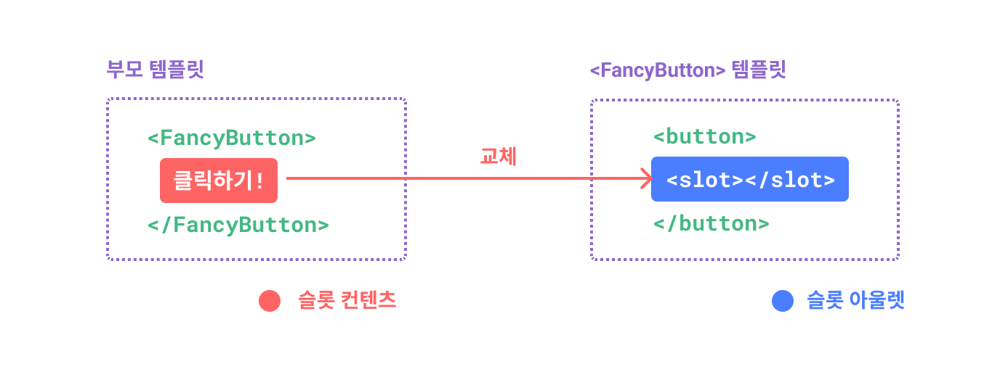
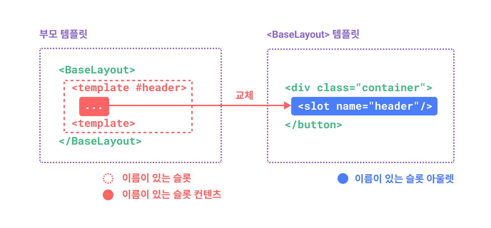
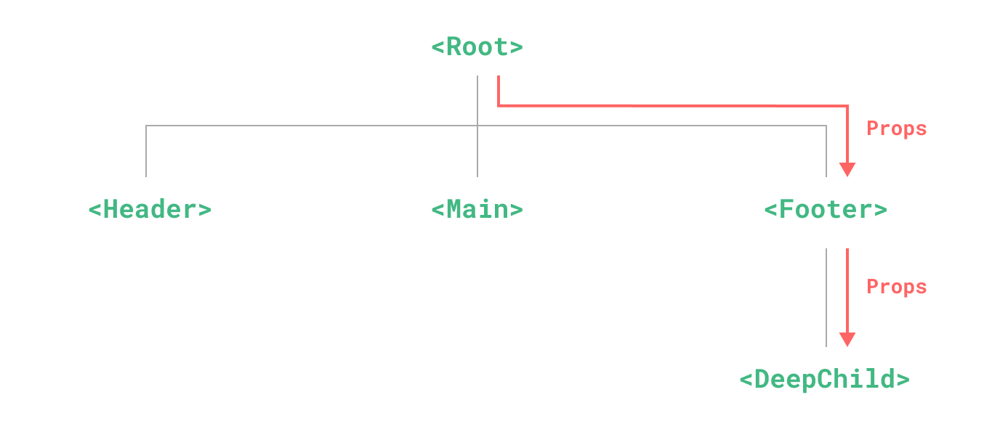
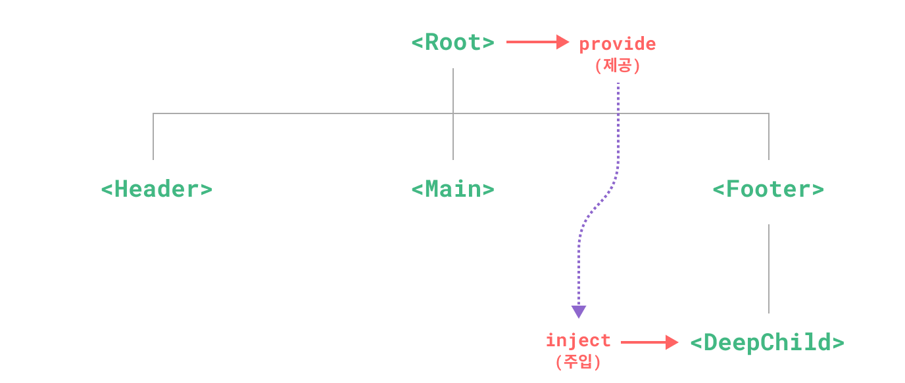

# Vue 3 컴포넌트와 로직 재사용

화면을 여러 컴포넌트로 나누면 데이터와 이벤트를 어디에서 관리할지 정해야 합니다. props와 이벤트로 부모와 자식을 연결하고, 슬롯과 의존성 주입으로 구성 방식을 확장합니다. 반복되는 로직은 컴포저블, 디렉티브, 플러그인으로 분리합니다.

## 목차

- [컴포넌트 등록](#guide-components-registration)
- [Props](#guide-components-props)
- [컴포넌트 이벤트](#guide-components-events)
- [컴포넌트 v-model](#guide-components-v-model)
- [폴스루 속성](#guide-components-attrs)
- [슬롯(slot)](#guide-components-slots)
- [Provide / Inject](#guide-components-provide-inject)
- [비동기 컴포넌트](#guide-components-async)
- [컴포저블(Composables)](#guide-reusability-composables)
- [커스텀 디렉티브](#guide-reusability-custom-directives)
- [플러그인](#guide-reusability-plugins)

---

<a id="guide-components-registration"></a>

<a id="guide-components-registration-component-registration"></a>

## 컴포넌트 등록

> 원문: https://github.com/vuejs/docs/blob/40aa88af0094f7bab4aaf786e55c748a6a251d88/src/guide/components/registration.md
> 한국어 번역 기반: https://github.com/vuejs-translations/docs-ko/blob/6e646acb5687510feda533281faa546b26ea243c/src/guide/components/registration.md

> 이 페이지는 이미 [컴포넌트 기본](02_essentials.md#guide-essentials-component-basics)을 읽었다고 가정합니다. 컴포넌트(component)가 처음이라면 먼저 해당 내용을 읽어보세요.


참고 강의: https://vueschool.io/lessons/vue-3-global-vs-local-vue-components


Vue 컴포넌트는 템플릿(template)에서 Vue가 해당 구현체를 찾을 수 있도록 "등록"되어야 합니다. 컴포넌트를 등록하는 방법에는 전역 등록과 지역 등록, 두 가지가 있습니다.

<a id="guide-components-registration-global-registration"></a>

### 전역 등록
현재 [Vue 애플리케이션](02_essentials.md#guide-essentials-application)에서 `.component()` 메서드를 이용하면 컴포넌트를 전역적으로 사용할 수 있습니다:

```js
import { createApp } from 'vue'

const app = createApp({})

app.component(
  // 등록할 이름
  'MyComponent',
  // 구현체
  {
    /* ... */
  }
)
```

SFC를 사용하는 경우, 가져온 `.vue` 파일을 등록하게 됩니다:

```js
import MyComponent from './App.vue'

app.component('MyComponent', MyComponent)
```

`.component()` 메서드는 체이닝이 가능합니다:

```js
app
  .component('ComponentA', ComponentA)
  .component('ComponentB', ComponentB)
  .component('ComponentC', ComponentC)
```

전역으로 등록된 컴포넌트는 이 애플리케이션 내의 모든 컴포넌트의 템플릿에서 사용할 수 있습니다:

```vue-html
<!-- 이 코드는 앱 내의 어떤 컴포넌트에서도 동작합니다 -->
<ComponentA/>
<ComponentB/>
<ComponentC/>
```

이 규칙은 모든 하위 컴포넌트에도 적용되므로, 이 세 컴포넌트는 _서로의 내부에서도_ 사용할 수 있습니다.

<a id="guide-components-registration-local-registration"></a>

### 지역 등록
전역 등록은 편리하지만 몇 가지 단점이 있습니다:

1. 전역 등록은 사용하지 않는 컴포넌트를 빌드 시스템이 제거(일명 "트리 셰이킹(tree-shaking)")하지 못하게 합니다. 컴포넌트를 전역으로 등록했지만 앱 어디에서도 사용하지 않는다면, 최종 번들에 여전히 포함됩니다.

2. 전역 등록은 대규모 애플리케이션에서 의존성 관계를 덜 명확하게 만듭니다. 부모 컴포넌트에서 자식 컴포넌트의 구현체를 찾기 어렵게 하여, 너무 많은 전역 변수를 사용하는 것과 비슷하게 장기적인 유지보수에 영향을 줄 수 있습니다.

지역 등록은 등록된 컴포넌트의 사용 범위를 현재 컴포넌트로만 제한합니다. 의존성 관계를 더 명확하게 만들고, 트리 셰이킹에도 더 적합합니다.


**컴포지션 API**


`<script setup>`이 있는 SFC를 사용할 때는, 가져온 컴포넌트를 별도의 등록 없이 지역적으로 사용할 수 있습니다:

```vue
<script setup>
import ComponentA from './ComponentA.vue'
</script>

<template>
  <ComponentA />
</template>
```

`<script setup>`이 아닌 경우에는 `components` 옵션을 사용해야 합니다:

```js
import ComponentA from './ComponentA.js'

export default {
  components: {
    ComponentA
  },
  setup() {
    // ...
  }
}
```


**옵션 API**


지역 등록에는 `components` 옵션을 사용합니다:

```vue
<script>
import ComponentA from './ComponentA.vue'

export default {
  components: {
    ComponentA
  }
}
</script>

<template>
  <ComponentA />
</template>
```


`components` 객체의 각 속성에서, 키는 컴포넌트의 등록 이름이 되고, 값은 컴포넌트의 구현체가 됩니다. 위 예시는 ES2015 속성 단축 표기를 사용한 것으로, 다음과 동일합니다:

```js
export default {
  components: {
    ComponentA: ComponentA
  }
  // ...
}
```

**지역 등록된 컴포넌트는 하위 컴포넌트에서 _사용할 수 없습니다_**. 이 경우, `ComponentA`는 현재 컴포넌트에서만 사용할 수 있고, 자식이나 하위 컴포넌트에서는 사용할 수 없습니다.

<a id="guide-components-registration-component-name-casing"></a>

### 컴포넌트 이름 표기법
이 가이드 전반에서 컴포넌트를 등록할 때 PascalCase 이름을 사용하고 있습니다. 그 이유는 다음과 같습니다:

1. PascalCase 이름은 유효한 JavaScript 식별자입니다. 이를 통해 JavaScript에서 컴포넌트를 더 쉽게 가져오고 등록할 수 있습니다. 또한 IDE의 자동 완성 기능에도 도움이 됩니다.

2. `<PascalCase />`는 템플릿에서 이것이 네이티브 HTML 요소가 아니라 Vue 컴포넌트임을 더 명확하게 보여줍니다. 또한 Vue 컴포넌트와 커스텀 엘리먼트(웹 컴포넌트)를 구분해줍니다.

SFC나 문자열 템플릿을 사용할 때는 이 스타일을 권장합니다. 하지만 [in-DOM 템플릿 파싱 주의사항](02_essentials.md#guide-essentials-component-basics-in-dom-template-parsing-caveats)에서 논의한 것처럼, in-DOM 템플릿에서는 PascalCase 태그를 사용할 수 없습니다.

다행히도, Vue는 케밥-케이스 태그를 PascalCase로 등록된 컴포넌트로 해석할 수 있습니다. 즉, `MyComponent`로 등록된 컴포넌트는 Vue 템플릿(또는 Vue가 렌더링(rendering)한 HTML 요소) 내에서 `<MyComponent>`와 `<my-component>` 모두로 참조할 수 있습니다. 이를 통해 템플릿 소스에 상관없이 동일한 JavaScript 컴포넌트 등록 코드를 사용할 수 있습니다.

---

<a id="guide-components-props"></a>

<a id="guide-components-props-props"></a>

## Props

> 원문: https://github.com/vuejs/docs/blob/40aa88af0094f7bab4aaf786e55c748a6a251d88/src/guide/components/props.md
> 한국어 번역 기반: https://github.com/vuejs-translations/docs-ko/blob/6e646acb5687510feda533281faa546b26ea243c/src/guide/components/props.md

> 이 페이지는 이미 [컴포넌트 기본](02_essentials.md#guide-essentials-component-basics)을 읽었다고 가정합니다. 컴포넌트(component)가 처음이라면 먼저 해당 내용을 읽어보세요.


**옵션 API**

  
참고 강의: https://vueschool.io/lessons/vue-3-reusable-components-with-props


<a id="guide-components-props-props-declaration"></a>

### Props 선언
Vue 컴포넌트는 명시적인 props 선언이 필요합니다. 그래야 Vue가 컴포넌트에 전달된 외부 props 중 어떤 것을 폴스루 속성(fallthrough attributes)으로 처리해야 하는지 알 수 있습니다(이 내용은 [별도의 섹션](03_components_and_reusability.md#guide-components-attrs)에서 다룹니다).


**컴포지션 API**


SFC에서 `<script setup>`을 사용할 때는 `defineProps()` 매크로를 사용하여 props를 선언할 수 있습니다:

```vue
<script setup>
const props = defineProps(['foo'])

console.log(props.foo)
</script>
```

`<script setup>`이 아닌 컴포넌트에서는 [`props`](08_component_and_advanced_apis.md#api-options-state-props) 옵션을 사용하여 props를 선언합니다:

```js
export default {
  props: ['foo'],
  setup(props) {
    // setup()은 props를 첫 번째 인자로 받습니다.
    console.log(props.foo)
  }
}
```

`defineProps()`에 전달된 인자는 `props` 옵션에 제공된 값과 동일합니다. 두 선언 방식 모두 동일한 props 옵션 API를 공유합니다.


**옵션 API**


Props는 [`props`](08_component_and_advanced_apis.md#api-options-state-props) 옵션을 사용하여 선언합니다:

```js
export default {
  props: ['foo'],
  created() {
    // props는 `this`에 노출됩니다
    console.log(this.foo)
  }
}
```


문자열 배열을 사용하여 props를 선언하는 것 외에도, 객체 문법을 사용할 수도 있습니다:


**옵션 API**


```js
export default {
  props: {
    title: String,
    likes: Number
  }
}
```


**컴포지션 API**


```js
// <script setup>에서
defineProps({
  title: String,
  likes: Number
})
```

```js
// <script setup>이 아닌 경우
export default {
  props: {
    title: String,
    likes: Number
  }
}
```


객체 선언 문법에서 각 속성의 키는 prop의 이름이고, 값은 기대하는 타입의 생성자 함수여야 합니다.

이렇게 하면 컴포넌트가 문서화될 뿐만 아니라, 잘못된 타입이 전달될 경우 브라우저 콘솔에서 다른 개발자에게 경고도 표시됩니다. [prop 검증](03_components_and_reusability.md#guide-components-props-prop-validation)에 대한 자세한 내용은 이 페이지 아래에서 다룹니다.


**옵션 API**


참고: [컴포넌트 Props 타입 지정](05_scaling_typescript_and_best_practices.md#guide-typescript-options-api-typing-component-props)  (TypeScript)


**컴포지션 API**


TypeScript와 `<script setup>`을 함께 사용하는 경우, 순수 타입 주석만으로도 props를 선언할 수 있습니다:

```vue
<script setup lang="ts">
defineProps<{
  title?: string
  likes?: number
}>()
</script>
```

자세한 내용: [컴포넌트 Props 타입 지정](05_scaling_typescript_and_best_practices.md#guide-typescript-composition-api-typing-component-props)  (TypeScript)


**컴포지션 API**


<a id="guide-components-props-reactive-props-destructure"></a>

### 반응형 Props 구조 분해  (3.5+) \*\*
Vue의 반응성(reactivity) 시스템은 속성 접근을 기반으로 상태 사용을 추적합니다. 예를 들어, 계산된 getter나 watcher에서 `props.foo`에 접근하면, `foo` prop이 의존성으로 추적됩니다.

따라서 다음과 같은 코드가 있다고 가정해봅시다:

```js
const { foo } = defineProps(['foo'])

watchEffect(() => {
  // 3.5 이전에는 한 번만 실행됨
  // 3.5+에서는 "foo" prop이 변경될 때마다 다시 실행됨
  console.log(foo)
})
```

3.4 버전 이하에서는 `foo`가 실제 상수이기 때문에 절대 변경되지 않습니다. 3.5 버전 이상에서는, Vue의 컴파일러가 동일한 `<script setup>` 블록 내에서 `defineProps`에서 구조 분해된 변수에 접근할 때 자동으로 `props.`를 앞에 붙입니다. 따라서 위 코드는 다음과 동일하게 변환됩니다:

```js {5}
const props = defineProps(['foo'])

watchEffect(() => {
  // 컴파일러가 `foo`를 `props.foo`로 변환
  console.log(props.foo)
})
```

또한, JavaScript의 기본값 문법을 사용하여 props의 기본값을 선언할 수 있습니다. 이는 타입 기반 props 선언을 사용할 때 특히 유용합니다:

```ts
const { foo = 'hello' } = defineProps<{ foo?: string }>()
```

IDE에서 구조 분해된 props와 일반 변수를 시각적으로 구분하고 싶다면, Vue의 VSCode 확장 프로그램에서 구조 분해된 props에 대한 인레이 힌트(inlay-hints)를 활성화하는 설정을 사용할 수 있습니다.

<a id="guide-components-props-passing-destructured-props-into-functions"></a>

#### 구조 분해된 Props를 함수에 전달하기
구조 분해된 prop을 함수에 전달할 때, 예를 들어:

```js
const { foo } = defineProps(['foo'])

watch(foo, /* ... */)
```

이 코드는 기대한 대로 동작하지 않습니다. `watch(props.foo, ...)`와 동일해서, 반응형 데이터 소스가 아닌 값을 전달하는 셈이기 때문입니다. 실제로 Vue의 컴파일러는 이러한 경우를 감지하여 경고를 발생시킵니다.

일반 prop을 `watch(() => props.foo, ...)`로 감시할 수 있는 것처럼, 구조 분해된 prop도 getter로 감싸서 감시할 수 있습니다:

```js
watch(() => foo, /* ... */)
```

또한, 구조 분해된 prop을 외부 함수에 전달하면서 반응성을 유지해야 할 때도 이 방법이 권장됩니다:

```js
useComposable(() => foo)
```

외부 함수는 getter를 호출하거나 [toValue](07_composition_and_reactivity_apis.md#api-reactivity-utilities-tovalue)로 정규화하여, 예를 들어 계산된 값이나 watcher getter에서 전달된 prop의 변화를 추적할 수 있습니다.


<a id="guide-components-props-prop-passing-details"></a>

### Prop 전달 세부사항
<a id="guide-components-props-prop-name-casing"></a>

#### Prop 이름 표기법
긴 prop 이름은 camelCase로 선언합니다. 이렇게 하면 속성 키로 사용할 때 따옴표를 붙일 필요가 없고, 템플릿(template) 표현식에서 직접 참조할 수 있습니다. camelCase는 유효한 JavaScript 식별자이기 때문입니다:


**컴포지션 API**


```js
defineProps({
  greetingMessage: String
})
```


**옵션 API**


```js
export default {
  props: {
    greetingMessage: String
  }
}
```


```vue-html
<span>{{ greetingMessage }}</span>
```

기술적으로는 자식 컴포넌트에 props를 전달할 때도 camelCase를 사용할 수 있습니다([in-DOM 템플릿](02_essentials.md#guide-essentials-component-basics-in-dom-template-parsing-caveats)에서는 예외). 하지만 HTML 속성과 일치시키기 위해 모든 경우에 kebab-case를 사용하는 것이 관례입니다:

```vue-html
<MyComponent greeting-message="hello" />
```

가능하다면 [컴포넌트 태그에는 PascalCase를 사용](03_components_and_reusability.md#guide-components-registration-component-name-casing)하는 것이 권장됩니다. 이렇게 하면 Vue 컴포넌트와 네이티브 요소를 구분하여 템플릿 가독성이 향상됩니다. 하지만 props를 전달할 때 camelCase를 사용하는 실질적인 이점은 크지 않으므로, 각 언어의 관례를 따릅니다.

<a id="guide-components-props-static-vs-dynamic-props"></a>

#### 정적 vs. 동적 Props
지금까지는 다음과 같이 props를 정적 값으로 전달하는 예시를 보았습니다:

```vue-html
<BlogPost title="My journey with Vue" />
```

또한 `v-bind` 또는 `:` 단축키를 사용하여 props를 동적으로 할당하는 예시도 보았습니다:

```vue-html
<!-- 변수의 값을 동적으로 할당 -->
<BlogPost :title="post.title" />

<!-- 복잡한 표현식의 값을 동적으로 할당 -->
<BlogPost :title="post.title + ' by ' + post.author.name" />
```

<a id="guide-components-props-passing-different-value-types"></a>

#### 다양한 값 타입 전달하기
위 두 예시에서는 문자열 값을 전달했지만, _어떤_ 타입의 값도 prop으로 전달할 수 있습니다.

<a id="guide-components-props-number"></a>

##### 숫자

```vue-html
<!-- `42`가 정적이지만, v-bind를 사용해 -->
<!-- 이것이 문자열이 아닌 JavaScript 표현식임을 Vue에 알려야 합니다. -->
<BlogPost :likes="42" />

<!-- 변수의 값을 동적으로 할당 -->
<BlogPost :likes="post.likes" />
```

<a id="guide-components-props-boolean"></a>

##### 불리언

```vue-html
<!-- 값을 지정하지 않고 prop만 포함하면 `true`로 간주됩니다. -->
<BlogPost is-published />

<!-- `false`가 정적이지만, v-bind를 사용해 -->
<!-- 이것이 문자열이 아닌 JavaScript 표현식임을 Vue에 알려야 합니다. -->
<BlogPost :is-published="false" />

<!-- 변수의 값을 동적으로 할당 -->
<BlogPost :is-published="post.isPublished" />
```

<a id="guide-components-props-array"></a>

##### 배열

```vue-html
<!-- 배열이 정적이지만, v-bind를 사용해 -->
<!-- 이것이 문자열이 아닌 JavaScript 표현식임을 Vue에 알려야 합니다. -->
<BlogPost :comment-ids="[234, 266, 273]" />

<!-- 변수의 값을 동적으로 할당 -->
<BlogPost :comment-ids="post.commentIds" />
```

<a id="guide-components-props-object"></a>

##### 객체

```vue-html
<!-- 객체가 정적이지만, v-bind를 사용해 -->
<!-- 이것이 문자열이 아닌 JavaScript 표현식임을 Vue에 알려야 합니다. -->
<BlogPost
  :author="{
    name: 'Veronica',
    company: 'Veridian Dynamics'
  }"
 />

<!-- 변수의 값을 동적으로 할당 -->
<BlogPost :author="post.author" />
```

<a id="guide-components-props-binding-multiple-properties-using-an-object"></a>

#### 객체를 사용하여 여러 속성 바인딩하기
객체의 모든 속성을 props로 전달하고 싶다면, [`v-bind`를 인자 없이](02_essentials.md#guide-essentials-template-syntax-dynamically-binding-multiple-attributes) 사용할 수 있습니다(`:prop-name` 대신 `v-bind`). 예를 들어, `post` 객체가 있다고 가정해봅시다:


**옵션 API**


```js
export default {
  data() {
    return {
      post: {
        id: 1,
        title: 'My Journey with Vue'
      }
    }
  }
}
```


**컴포지션 API**


```js
const post = {
  id: 1,
  title: 'My Journey with Vue'
}
```


다음 템플릿은:

```vue-html
<BlogPost v-bind="post" />
```

다음과 동일하게 동작합니다:

```vue-html
<BlogPost :id="post.id" :title="post.title" />
```

<a id="guide-components-props-merge-behavior-when-combining-bindings"></a>

#### 바인딩을 함께 사용할 때의 병합 동작
동일한 컴포넌트에 `v-bind`와 명시적인 바인딩(binding)을 함께 사용하면, Vue는 내부적으로 `mergeProps()`를 호출하여 두 바인딩을 병합합니다. 병합 전략은 키의 타입에 따라 달라집니다:

- **일반 prop**: 마지막 값이 우선합니다:

```vue-html
<!-- title === 'bar' -->
<BlogPost title="foo" v-bind="{ title: 'bar' }" />
```

- **이벤트 리스너(listener)**: `v-bind` 객체로 리스너를 전달할 때는 [`onEventName` 키 규칙을 사용해야 합니다](06_reactivity_and_rendering_in_depth.md#guide-extras-render-function-v-on). 동일한 이벤트에 등록된 모든 핸들러가 호출됩니다([`v-on` 리스너 상속](03_components_and_reusability.md#guide-components-attrs-v-on-listener-inheritance) 참고):

```vue-html
<!-- 1과 2가 모두 출력됨 -->
<BlogPost @click="console.log(1)" v-bind="{ onClick: () => console.log(2) }" />
```

- **`class`와 `style`**은 이와 유사한 병합 전략을 따릅니다([`class`와 `style` 병합](03_components_and_reusability.md#guide-components-attrs-class-and-style-merging) 참고).

**참고**
전체 병합 규칙은 [`mergeProps()`](08_component_and_advanced_apis.md#api-render-function-mergeprops) API 레퍼런스에 설명되어 있습니다.


<a id="guide-components-props-one-way-data-flow"></a>

### 단방향 데이터 흐름
모든 prop은 자식 속성과 부모 속성 간에 **하향식 단방향 바인딩**을 형성합니다. 즉, 부모 속성이 업데이트되면 자식에게 전달되지만, 반대 방향은 아닙니다. 이렇게 하면 자식 컴포넌트가 실수로 부모의 상태를 변경하는 일이 방지되어, 앱의 데이터 흐름을 이해하기가 더 쉬워집니다.

또한, 부모 컴포넌트가 업데이트될 때마다 자식 컴포넌트의 모든 prop이 최신 값으로 갱신됩니다. 따라서 자식 컴포넌트 내부에서 prop을 **변경하려고 시도해서는 안 됩니다**. 만약 그렇게 하면, Vue는 콘솔에 경고를 표시합니다:


**컴포지션 API**


```js
const props = defineProps(['foo'])

// ❌ 경고, props는 읽기 전용입니다!
props.foo = 'bar'
```


**옵션 API**


```js
export default {
  props: ['foo'],
  created() {
    // ❌ 경고, props는 읽기 전용입니다!
    this.foo = 'bar'
  }
}
```


자식에서 prop과 다른 값을 사용하려는 경우는 보통 두 가지입니다:

1. **prop이 초기값을 전달하는 용도로 사용되고, 자식 컴포넌트가 이후에 이를 로컬 데이터 속성으로 사용하고 싶을 때.** 이 경우, prop을 초기값으로 삼는 로컬 데이터 속성을 정의하는 것이 가장 좋습니다:


**컴포지션 API**


   ```js
   const props = defineProps(['initialCounter'])

   // counter는 props.initialCounter를 초기값으로만 사용;
   // 이후 prop 업데이트와는 연결되지 않습니다.
   const counter = ref(props.initialCounter)
   ```


**옵션 API**


   ```js
   export default {
     props: ['initialCounter'],
     data() {
       return {
         // counter는 this.initialCounter를 초기값으로만 사용;
         // 이후 prop 업데이트와는 연결되지 않습니다.
         counter: this.initialCounter
       }
     }
   }
   ```


2. **prop이 변환이 필요한 원시 값으로 전달될 때.** 이 경우, prop 값을 사용하는 계산된 속성(computed property)을 정의하는 것이 가장 좋습니다:


**컴포지션 API**


   ```js
   const props = defineProps(['size'])

   // prop이 변경될 때 자동으로 업데이트되는 계산된 속성
   const normalizedSize = computed(() => props.size.trim().toLowerCase())
   ```


**옵션 API**


   ```js
   export default {
     props: ['size'],
     computed: {
       // prop이 변경될 때 자동으로 업데이트되는 계산된 속성
       normalizedSize() {
         return this.size.trim().toLowerCase()
       }
     }
   }
   ```


<a id="guide-components-props-mutating-object-array-props"></a>

#### 객체/배열 Props 변경하기
객체와 배열이 prop으로 전달될 때, 자식 컴포넌트는 prop 바인딩 자체를 변경할 수는 없지만, 객체나 배열의 중첩 속성은 **변경할 수 있습니다**. 이는 JavaScript에서 객체와 배열이 참조로 전달되기 때문이며, Vue가 이러한 변경을 막는 것은 비효율적이기 때문입니다.

이러한 변경의 주요 단점은 자식 컴포넌트가 부모 상태에 영향을 줄 수 있다는 점입니다. 이는 부모 컴포넌트 입장에서는 명확하지 않아, 향후 데이터 흐름을 이해하기 어렵게 만들 수 있습니다. 모범 사례로, 부모와 자식이 설계상 밀접하게 결합되어 있지 않다면 이러한 변경을 피해야 합니다. 대부분의 경우, 자식이 [이벤트를 발생시켜](03_components_and_reusability.md#guide-components-events) 부모가 변경을 수행하도록 하는 것이 좋습니다.

<a id="guide-components-props-prop-validation"></a>

### Prop 검증
컴포넌트는 props에 대한 요구사항(이미 본 타입 등)을 지정할 수 있습니다. 요구사항이 충족되지 않으면, Vue는 브라우저의 JavaScript 콘솔에 경고를 표시합니다. 이는 다른 사람이 사용할 컴포넌트를 개발할 때 특히 유용합니다.

prop을 검증하려면 이름만 담은 문자열 배열 대신 검증 조건을 담은 객체를 전달합니다. 컴포지션 API에서는 `defineProps()` 매크로에, 옵션 API에서는 `props` 옵션에 지정합니다:


**컴포지션 API**


```js
defineProps({
  // 기본 타입 체크
  //  (`null` 및 `undefined` 값은 모든 타입 허용)
  propA: Number,
  // 여러 타입 허용
  propB: [String, Number],
  // 필수 문자열
  propC: {
    type: String,
    required: true
  },
  // 필수이지만 null 허용 문자열
  propD: {
    type: [String, null],
    required: true
  },
  // 기본값이 있는 숫자
  propE: {
    type: Number,
    default: 100
  },
  // 기본값이 있는 객체
  propF: {
    type: Object,
    // 객체나 배열의 기본값은 반드시
    // 팩토리 함수에서 반환해야 합니다. 이 함수는
    // 컴포넌트가 받은 원시 props를 인자로 받습니다.
    default(rawProps) {
      return { message: 'hello' }
    }
  },
  // 커스텀 검증 함수
  // 3.4+에서는 전체 props가 두 번째 인자로 전달됨
  propG: {
    validator(value, props) {
      // 값이 아래 문자열 중 하나와 일치해야 함
      return ['success', 'warning', 'danger'].includes(value)
    }
  },
  // 기본값이 있는 함수
  propH: {
    type: Function,
    // 객체나 배열의 기본값과 달리, 이 함수는 팩토리
    // 함수가 아니라 기본값으로 사용할 함수입니다
    default() {
      return 'Default function'
    }
  }
})
```

**참고**
`defineProps()` 인자 내부의 코드는 **`<script setup>`에서 선언된 다른 변수에 접근할 수 없습니다**. 전체 표현식이 컴파일 시 외부 함수 스코프로 이동되기 때문입니다.


**옵션 API**


```js
export default {
  props: {
    // 기본 타입 체크
    //  (`null` 및 `undefined` 값은 모든 타입 허용)
    propA: Number,
    // 여러 타입 허용
    propB: [String, Number],
    // 필수 문자열
    propC: {
      type: String,
      required: true
    },
    // 필수이지만 null 허용 문자열
    propD: {
      type: [String, null],
      required: true
    },
    // 기본값이 있는 숫자
    propE: {
      type: Number,
      default: 100
    },
    // 기본값이 있는 객체
    propF: {
      type: Object,
      // 객체나 배열의 기본값은 반드시
      // 팩토리 함수에서 반환해야 합니다. 이 함수는
      // 컴포넌트가 받은 원시 props를 인자로 받습니다.
      default(rawProps) {
        return { message: 'hello' }
      }
    },
    // 커스텀 검증 함수
    // 3.4+에서는 전체 props가 두 번째 인자로 전달됨
    propG: {
      validator(value, props) {
        // 값이 아래 문자열 중 하나와 일치해야 함
        return ['success', 'warning', 'danger'].includes(value)
      }
    },
    // 기본값이 있는 함수
    propH: {
      type: Function,
      // 객체나 배열의 기본값과 달리, 이 함수는 팩토리
      // 함수가 아니라 기본값으로 사용할 함수입니다
      default() {
        return 'Default function'
      }
    }
  }
}
```


추가 세부사항:

- 모든 prop은 기본적으로 선택 사항이며, `required: true`가 지정된 경우에만 필수입니다.

- `Boolean`이 아닌 선택적 prop은 전달되지 않으면 값이 `undefined`가 됩니다.

- `Boolean` prop은 전달되지 않으면 `false`로 변환됩니다. 이를 변경하려면 `default`를 설정할 수 있습니다. 예: `default: undefined`로 설정하면 Boolean이 아닌 prop처럼 동작합니다.

- `default` 값이 지정된 경우, prop 값이 `undefined`로 해석되면(즉, prop이 없거나 명시적으로 `undefined`가 전달된 경우) 지정된 기본값이 사용됩니다.

prop 검증에 실패하면, Vue는 콘솔에 경고를 출력합니다(개발 빌드 사용 시).


**컴포지션 API**


[타입 기반 props 선언](08_component_and_advanced_apis.md#api-sfc-script-setup-type-only-props-emit-declarations)  (TypeScript)을 사용하는 경우, Vue는 타입 주석을 동등한 런타임 prop 선언으로 컴파일하려고 시도합니다. 예를 들어, `defineProps<{ msg: string }>`는 `{ msg: { type: String, required: true }}`로 컴파일됩니다.


**옵션 API**


**참고**
props는 컴포넌트 인스턴스(instance)가 생성되기 **전에** 검증되므로, 인스턴스 속성(예: `data`, `computed` 등)은 `default`나 `validator` 함수 내부에서 사용할 수 없습니다.


<a id="guide-components-props-runtime-type-checks"></a>

#### 런타임 타입 체크
`type`은 다음과 같은 네이티브 생성자 중 하나일 수 있습니다:

- `String`
- `Number`
- `Boolean`
- `Array`
- `Object`
- `Date`
- `Function`
- `Symbol`
- `Error`

또한, `type`은 커스텀 클래스나 생성자 함수도 될 수 있으며, 이 경우 `instanceof` 체크로 검증합니다. 예를 들어, 다음과 같은 클래스가 있다고 가정해봅시다:

```js
class Person {
  constructor(firstName, lastName) {
    this.firstName = firstName
    this.lastName = lastName
  }
}
```

이를 prop의 타입으로 사용할 수 있습니다:


**컴포지션 API**


```js
defineProps({
  author: Person
})
```


**옵션 API**


```js
export default {
  props: {
    author: Person
  }
}
```


Vue는 `author` prop의 값이 실제로 `Person` 클래스의 인스턴스인지 확인하기 위해 `instanceof Person`을 사용합니다.

<a id="guide-components-props-nullable-type"></a>

#### Nullable 타입
타입이 필수이지만 null을 허용해야 한다면, `null`을 포함한 배열 문법을 사용할 수 있습니다:


**컴포지션 API**


```js
defineProps({
  id: {
    type: [String, null],
    required: true
  }
})
```


**옵션 API**


```js
export default {
  props: {
    id: {
      type: [String, null],
      required: true
    }
  }
}
```


`type`이 배열 문법 없이 단순히 `null`인 경우, 모든 타입을 허용합니다.

<a id="guide-components-props-boolean-casting"></a>

### Boolean 변환
`Boolean` 타입의 prop은 네이티브 불리언 속성의 동작을 모방하기 위해 특별한 변환 규칙을 따릅니다. 다음과 같이 선언된 `<MyComponent>`가 있다고 가정해봅시다:


**컴포지션 API**


```js
defineProps({
  disabled: Boolean
})
```


**옵션 API**


```js
export default {
  props: {
    disabled: Boolean
  }
}
```


컴포넌트는 다음과 같이 사용할 수 있습니다:

```vue-html
<!-- :disabled="true"를 전달한 것과 동일 -->
<MyComponent disabled />

<!-- :disabled="false"를 전달한 것과 동일 -->
<MyComponent />
```

prop이 여러 타입을 허용하도록 선언된 경우에도, `Boolean`에 대한 변환 규칙이 적용됩니다. 하지만 `String`과 `Boolean`이 모두 허용되는 경우에는 예외가 있습니다. 이때 Boolean 변환 규칙은 Boolean이 String보다 먼저 나올 때만 적용됩니다:


**컴포지션 API**


```js
// disabled는 true로 변환됨
defineProps({
  disabled: [Boolean, Number]
})

// disabled는 true로 변환됨
defineProps({
  disabled: [Boolean, String]
})

// disabled는 true로 변환됨
defineProps({
  disabled: [Number, Boolean]
})

// disabled는 빈 문자열로 파싱됨 (disabled="")
defineProps({
  disabled: [String, Boolean]
})
```


**옵션 API**


```js
// disabled는 true로 변환됨
export default {
  props: {
    disabled: [Boolean, Number]
  }
}

// disabled는 true로 변환됨
export default {
  props: {
    disabled: [Boolean, String]
  }
}

// disabled는 true로 변환됨
export default {
  props: {
    disabled: [Number, Boolean]
  }
}

// disabled는 빈 문자열로 파싱됨 (disabled="")
export default {
  props: {
    disabled: [String, Boolean]
  }
}
```

---

<a id="guide-components-events"></a>

**문서 데모 설정 코드**

```vue
<script setup>
import { onMounted } from 'vue'

if (typeof window !== 'undefined') {
  const hash = window.location.hash

  // v-model에 대한 문서가 예전에 이 페이지의 일부였습니다. 오래된 링크를 리디렉션하려고 시도합니다.
  if ([
    '#usage-with-v-model',
    '#v-model-arguments',
    '#multiple-v-model-bindings',
    '#handling-v-model-modifiers'
  ].includes(hash)) {
    onMounted(() => {
      window.location = './v-model.html' + hash
    })
  }
}
</script>
```


<a id="guide-components-events-component-events"></a>

## 컴포넌트 이벤트

> 원문: https://github.com/vuejs/docs/blob/40aa88af0094f7bab4aaf786e55c748a6a251d88/src/guide/components/events.md
> 한국어 번역 기반: https://github.com/vuejs-translations/docs-ko/blob/6e646acb5687510feda533281faa546b26ea243c/src/guide/components/events.md

> 이 페이지는 이미 [컴포넌트 기본](02_essentials.md#guide-essentials-component-basics)을 읽었다고 가정합니다. 컴포넌트(component)가 처음이라면 먼저 해당 내용을 읽으세요.


**옵션 API**

  
참고 강의: https://vueschool.io/lessons/defining-custom-events-emits


<a id="guide-components-events-emitting-and-listening-to-events"></a>

### 이벤트 발생 및 리스닝
컴포넌트는 내장된 `$emit` 메서드를 사용하여 템플릿(template) 표현식(예: `v-on` 핸들러)에서 직접 커스텀 이벤트를 발생시킬 수 있습니다:

```vue-html
<!-- MyComponent -->
<button @click="$emit('someEvent')">Click Me</button>
```


**옵션 API**


`$emit()` 메서드는 컴포넌트 인스턴스(instance)에서 `this.$emit()`으로도 사용할 수 있습니다:

```js
export default {
  methods: {
    submit() {
      this.$emit('someEvent')
    }
  }
}
```


부모는 `v-on`을 사용하여 해당 이벤트를 리스닝할 수 있습니다:

```vue-html
<MyComponent @some-event="callback" />
```

컴포넌트 이벤트 리스너(listener)에서도 `.once` 수식어(modifier)를 사용할 수 있습니다:

```vue-html
<MyComponent @some-event.once="callback" />
```

컴포넌트와 props처럼, 이벤트 이름도 자동으로 케이스 변환이 적용됩니다. 위에서는 camelCase 이벤트를 발생시켰지만, 부모에서는 kebab-case 리스너로 리스닝할 수 있습니다. [props 케이스](03_components_and_reusability.md#guide-components-props-prop-name-casing)와 마찬가지로, 템플릿에서는 kebab-case 이벤트 리스너 사용을 권장합니다.

**참고**
네이티브 DOM 이벤트와 달리, 컴포넌트에서 발생한 이벤트는 **버블링되지 않습니다**. 직접적인 자식 컴포넌트가 발생시킨 이벤트만 리스닝할 수 있습니다. 형제 또는 깊게 중첩된 컴포넌트 간에 통신이 필요하다면 외부 이벤트 버스나 [글로벌 상태 관리 솔루션](05_scaling_typescript_and_best_practices.md#guide-scaling-up-state-management)을 사용하세요.


<a id="guide-components-events-event-arguments"></a>

### 이벤트 인자
이벤트와 함께 특정 값을 발생시키는 것이 유용할 때가 있습니다. 예를 들어, `<BlogPost>` 컴포넌트가 텍스트를 얼마나 확대할지 결정하도록 하고 싶을 수 있습니다. 이런 경우, `$emit`에 추가 인자를 전달하여 값을 제공할 수 있습니다:

```vue-html
<button @click="$emit('increaseBy', 1)">
  1만큼 증가
</button>
```

그런 다음, 부모에서 이벤트를 리스닝할 때 인라인 화살표 함수를 리스너로 사용하면 이벤트 인자에 접근할 수 있습니다:

```vue-html
<MyButton @increase-by="(n) => count += n" />
```

또는, 이벤트 핸들러가 메서드인 경우:

```vue-html
<MyButton @increase-by="increaseCount" />
```

그러면 그 값이 해당 메서드의 첫 번째 매개변수로 전달됩니다:


**옵션 API**


```js
methods: {
  increaseCount(n) {
    this.count += n
  }
}
```


**컴포지션 API**


```js
function increaseCount(n) {
  count.value += n
}
```


**참고**
`$emit()`을 호출할 때 이벤트 이름 뒤에 전달한 모든 추가 인자는 리스너로 전달됩니다. 예를 들어, `$emit('foo', 1, 2, 3)`의 경우 리스너 함수는 세 개의 인자를 받게 됩니다.


<a id="guide-components-events-declaring-emitted-events"></a>

### 발생시킬 이벤트 선언하기
컴포넌트는  (컴포지션 API: [`defineEmits()`](08_component_and_advanced_apis.md#api-sfc-script-setup-defineprops-defineemits) 매크로) (옵션 API: [`emits`](08_component_and_advanced_apis.md#api-options-state-emits) 옵션)을 사용하여 발생시킬 이벤트를 명시적으로 선언할 수 있습니다:


**컴포지션 API**


```vue
<script setup>
defineEmits(['inFocus', 'submit'])
</script>
```

`<template>`에서 사용한 `$emit` 메서드는 컴포넌트의 `<script setup>` 섹션 내에서는 접근할 수 없지만, `defineEmits()`는 대신 사용할 수 있는 동등한 함수를 반환합니다:

```vue
<script setup>
const emit = defineEmits(['inFocus', 'submit'])

function buttonClick() {
  emit('submit')
}
</script>
```

`defineEmits()` 매크로는 **함수 내부에서 사용할 수 없으며**, 위 예시처럼 반드시 `<script setup>` 내에 직접 위치해야 합니다.

명시적인 `setup` 함수를 `<script setup>` 대신 사용하는 경우, 이벤트는 [`emits`](08_component_and_advanced_apis.md#api-options-state-emits) 옵션을 사용해 선언해야 하며, `emit` 함수는 `setup()` 컨텍스트에 노출됩니다:

```js
export default {
  emits: ['inFocus', 'submit'],
  setup(props, ctx) {
    ctx.emit('submit')
  }
}
```

`setup()` 컨텍스트의 다른 속성과 마찬가지로, `emit`도 안전하게 구조 분해 할당할 수 있습니다:

```js
export default {
  emits: ['inFocus', 'submit'],
  setup(props, { emit }) {
    emit('submit')
  }
}
```


**옵션 API**


```js
export default {
  emits: ['inFocus', 'submit']
}
```


`emits` 옵션과 `defineEmits()` 매크로는 객체 문법도 지원합니다. TypeScript를 사용하는 경우 인자에 타입을 지정할 수 있어, 발생시킨 이벤트의 페이로드에 대한 런타임 유효성 검사가 가능합니다:


**컴포지션 API**


```vue
<script setup lang="ts">
const emit = defineEmits({
  submit(payload: { email: string, password: string }) {
    // 유효성 검사 통과/실패를 나타내기 위해
    // `true` 또는 `false`를 반환합니다.
  }
})
</script>
```

`<script setup>`에서 TypeScript를 사용하는 경우, 순수 타입 주석만으로도 발생시킬 이벤트를 선언할 수 있습니다:

```vue
<script setup lang="ts">
const emit = defineEmits<{
  (e: 'change', id: number): void
  (e: 'update', value: string): void
}>()
</script>
```

자세한 내용: [컴포넌트 Emits 타입 지정](05_scaling_typescript_and_best_practices.md#guide-typescript-composition-api-typing-component-emits)  (TypeScript)


**옵션 API**


```ts
export default {
  emits: {
    submit(payload: { email: string, password: string }) {
      // 유효성 검사 통과/실패를 나타내기 위해
      // `true` 또는 `false`를 반환합니다.
    }
  }
}
```

참고: [컴포넌트 Emits 타입 지정](05_scaling_typescript_and_best_practices.md#guide-typescript-options-api-typing-component-emits)  (TypeScript)


선택 사항이지만, 컴포넌트가 어떻게 동작해야 하는지 더 잘 문서화하기 위해 발생시킬 모든 이벤트를 정의하는 것이 좋습니다. 또한 Vue가 [폴스루 속성(fallthrough attributes)](03_components_and_reusability.md#guide-components-attrs-v-on-listener-inheritance)에서 알려진 리스너를 제외할 수 있게 하여, 서드파티 코드가 수동으로 디스패치한 DOM 이벤트로 인한 예외적인 상황을 방지할 수 있습니다.

**참고**
네이티브 이벤트(예: `click`)가 `emits` 옵션에 정의되어 있으면, 리스너는 이제 컴포넌트에서 발생시킨 `click` 이벤트만 리스닝하며, 더 이상 네이티브 `click` 이벤트에는 반응하지 않습니다.


<a id="guide-components-events-events-validation"></a>

### 이벤트 유효성 검사
props 타입 유효성 검사와 유사하게, 발생시킬 이벤트가 배열 문법이 아닌 객체 문법으로 정의된 경우 유효성 검사를 할 수 있습니다.

유효성 검사를 추가하려면, 이벤트에  (옵션 API: `this.$emit`) (컴포지션 API: `emit`) 호출 시 전달된 인자를 받아 이벤트가 유효한지 여부를 boolean으로 반환하는 함수를 할당합니다.


**컴포지션 API**


```vue
<script setup>
const emit = defineEmits({
  // 유효성 검사 없음
  click: null,

  // submit 이벤트 유효성 검사
  submit: ({ email, password }) => {
    if (email && password) {
      return true
    } else {
      console.warn('유효하지 않은 submit 이벤트 페이로드입니다!')
      return false
    }
  }
})

function submitForm(email, password) {
  emit('submit', { email, password })
}
</script>
```


**옵션 API**


```js
export default {
  emits: {
    // 유효성 검사 없음
    click: null,

    // submit 이벤트 유효성 검사
    submit: ({ email, password }) => {
      if (email && password) {
        return true
      } else {
        console.warn('유효하지 않은 submit 이벤트 페이로드입니다!')
        return false
      }
    }
  },
  methods: {
    submitForm(email, password) {
      this.$emit('submit', { email, password })
    }
  }
}
```

---

<a id="guide-components-v-model"></a>

<a id="guide-components-v-model-component-v-model"></a>

## 컴포넌트 v-model

> 원문: https://github.com/vuejs/docs/blob/40aa88af0094f7bab4aaf786e55c748a6a251d88/src/guide/components/v-model.md
> 한국어 번역 기반: https://github.com/vuejs-translations/docs-ko/blob/6e646acb5687510feda533281faa546b26ea243c/src/guide/components/v-model.md


[Scrimba에서 인터랙티브 비디오 강의 시청하기](https://scrimba.com/links/vue-component-v-model)


<a id="guide-components-v-model-basic-usage"></a>

### 기본 사용법
`v-model`은 컴포넌트(component)에서 양방향 바인딩(binding)을 구현하는 데 사용할 수 있습니다.


**컴포지션 API**


Vue 3.4부터는 [`defineModel()`](08_component_and_advanced_apis.md#api-sfc-script-setup-definemodel) 매크로 사용을 권장합니다:

```vue [Child.vue]
<script setup>
const model = defineModel()

function update() {
  model.value++
}
</script>

<template>
  <div>부모에 바인딩된 v-model 값: {{ model }}</div>
  <button @click="update">증가</button>
</template>
```

부모는 `v-model`로 값을 바인딩할 수 있습니다:

```vue-html [Parent.vue]
<Child v-model="countModel" />
```

`defineModel()`이 반환하는 값은 ref입니다. 이 ref는 다른 ref와 마찬가지로 접근하고 변경할 수 있지만, 부모 값과 로컬 값 사이의 양방향 바인딩 역할을 합니다:

- `.value`는 부모 `v-model`에 바인딩된 값과 동기화됩니다;
- 자식에서 변경되면, 부모에 바인딩된 값도 업데이트됩니다.

즉, 이 ref를 네이티브 input 요소에 `v-model`로 바인딩할 수도 있으므로, 이러한 요소를 감싸면서 동일한 `v-model` 사용법을 제공하는 것이 간단해집니다:

```vue
<script setup>
const model = defineModel()
</script>

<template>
  <input v-model="model" />
</template>
```

[플레이그라운드에서 직접 해보기](https://play.vuejs.org/#eNqFUtFKwzAU/ZWYl06YLbK30Q10DFSYigq+5KW0t11mmoQknZPSf/cm3eqEsT0l555zuefmpKV3WsfbBuiUpjY3XDtiwTV6ziSvtTKOLNZcFKQ0qiZRnATkG6JB0BIDJen2kp5iMlfSOlLbisw8P4oeQAhFPpURxVV0zWSa9PNwEgIHtRaZA0SEpOvbeduG5q5LE0Sh2jvZ3tSqADFjFHlGSYJkmhz10zF1FseXvIo3VklcrfX9jOaq1lyAedGOoz1GpyQwnsvQ3fdTqDnTwPhQz9eQf52ob+zO1xh9NWDBbIHRgXOZqcD19PL9GXZ4H0h03whUnyHfwCrReI+97L6RBdo+0gW3j+H9uaw+7HLnQNrDUt6oV3ZBzyhmsjiz+p/dSTwJfUx2+IpD1ic+xz5enwQGXEDJJaw8Gl2I1upMzlc/hEvdOBR6SNKAjqP1J6P/o6XdL11L5h4=)

<a id="guide-components-v-model-under-the-hood"></a>

#### 내부 동작 방식
`defineModel`은 편의 매크로입니다. 컴파일러는 이를 다음과 같이 확장합니다:

- 로컬 ref의 값과 동기화되는 `modelValue`라는 prop;
- 로컬 ref의 값이 변경될 때 발생하는 `update:modelValue`라는 이벤트.

아래는 3.4 이전에 동일한 자식 컴포넌트를 구현하는 방법입니다:

```vue [Child.vue]
<script setup>
const props = defineProps(['modelValue'])
const emit = defineEmits(['update:modelValue'])
</script>

<template>
  <input
    :value="props.modelValue"
    @input="emit('update:modelValue', $event.target.value)"
  />
</template>
```

그런 다음, 부모 컴포넌트에서 `v-model="foo"`는 다음과 같이 컴파일됩니다:

```vue-html [Parent.vue]
<Child
  :modelValue="foo"
  @update:modelValue="$event => (foo = $event)"
/>
```

이 코드를 보면 자식의 `update:modelValue` 이벤트가 부모의 `foo`를 바꾸고, 바뀐 값이 다시 prop으로 전달되는 흐름을 확인할 수 있습니다.

`defineModel`이 prop을 선언하기 때문에, 해당 prop의 옵션을 `defineModel`에 전달하여 선언할 수 있습니다:

```js
// v-model을 필수로 만들기
const model = defineModel({ required: true })

// 기본값 제공
const model = defineModel({ default: 0 })
```

**주의**
`defineModel` prop에 `default` 값을 지정하고 부모 컴포넌트에서 이 prop에 값을 제공하지 않으면, 부모와 자식 컴포넌트 간에 동기화가 깨질 수 있습니다. 아래 예시에서, 부모의 `myRef`는 undefined이지만, 자식의 `model`은 1입니다:

```vue [Child.vue]
<script setup>
const model = defineModel({ default: 1 })
</script>
```

```vue [Parent.vue]
<script setup>
const myRef = ref()
</script>

<template>
  <Child v-model="myRef"></Child>
</template>
```

또한 `defineProps`에 `withDefaults`를 사용할 때와 마찬가지로, `defineModel`에서도 배열이나 객체 같은 변경 가능한 참조 타입의 기본값은 의도하지 않은 수정과 외부 부수 효과를 방지하기 위해 함수로 감싸서 지정해야 합니다.


**옵션 API**


먼저, 네이티브 요소에서 `v-model`이 어떻게 사용되는지 다시 살펴보겠습니다:

```vue-html
<input v-model="searchText" />
```

내부적으로, 템플릿(template) 컴파일러는 `v-model`을 더 장황하지만 동등한 코드로 확장합니다. 따라서 위 코드는 다음과 동일합니다:

```vue-html
<input
  :value="searchText"
  @input="searchText = $event.target.value"
/>
```

컴포넌트에서 사용될 때, `v-model`은 대신 다음과 같이 확장됩니다:

```vue-html
<CustomInput
  :model-value="searchText"
  @update:model-value="newValue => searchText = newValue"
/>
```

이것이 실제로 동작하려면, `<CustomInput>` 컴포넌트는 두 가지를 해야 합니다:

1. 네이티브 `<input>` 요소의 `value` 속성을 `modelValue` prop에 바인딩
2. 네이티브 `input` 이벤트가 발생하면, 새로운 값으로 `update:modelValue` 커스텀 이벤트를 emit

아래는 그 예시입니다:

```vue [CustomInput.vue]
<script>
export default {
  props: ['modelValue'],
  emits: ['update:modelValue']
}
</script>

<template>
  <input
    :value="modelValue"
    @input="$emit('update:modelValue', $event.target.value)"
  />
</template>
```

이제 `v-model`이 이 컴포넌트에서 완벽하게 동작합니다:

```vue-html
<CustomInput v-model="searchText" />
```

[플레이그라운드에서 직접 해보기](https://play.vuejs.org/#eNqFkctqwzAQRX9lEAEn4Np744aWrvoD3URdiHiSGvRCHpmC8b93JDfGKYGCkJjXvTrSJF69r8aIohHtcA69p6O0vfEuELzFgZx5tz4SXIIzUFT1JpfGCmmlxe/c3uFFRU0wSQtwdqxh0dLQwHSnNJep3ilS+8PSCxCQYrC3CMDgMKgrNlB8odaOXVJ2TgdvvNp6vSwHhMZrRcgRQLs1G5+M61A/S/ErKQXUR5immwXMWW1VEKX4g3j3Mo9QfXCeKU9FtvpQmp/lM0Oi6RP/qYieebHZNvyL0acLLODNmGYSxCogxVJ6yW1c2iWz/QOnEnY48kdUpMIVGSllD8t8zVZb+PkHqPG4iw==)

이 컴포넌트 내에서 `v-model`을 구현하는 또 다른 방법은 getter와 setter가 모두 있는 쓰기 가능한 `computed` 속성을 사용하는 것입니다. `get` 메서드는 `modelValue` 속성을 반환하고, `set` 메서드는 해당 이벤트를 emit해야 합니다:

```vue [CustomInput.vue]
<script>
export default {
  props: ['modelValue'],
  emits: ['update:modelValue'],
  computed: {
    value: {
      get() {
        return this.modelValue
      },
      set(value) {
        this.$emit('update:modelValue', value)
      }
    }
  }
}
</script>

<template>
  <input v-model="value" />
</template>
```


<a id="guide-components-v-model-v-model-arguments"></a>

### `v-model` 인자
컴포넌트의 `v-model`은 인자도 받을 수 있습니다:

```vue-html
<MyComponent v-model:title="bookTitle" />
```


**컴포지션 API**


자식 컴포넌트에서는, `defineModel()`의 첫 번째 인자로 문자열을 전달하여 해당 인자를 지원할 수 있습니다:

```vue [MyComponent.vue]
<script setup>
const title = defineModel('title')
</script>

<template>
  <input type="text" v-model="title" />
</template>
```

[플레이그라운드에서 직접 해보기](https://play.vuejs.org/#eNqFklFPwjAUhf9K05dhgiyGNzJI1PCgCWqUx77McQeFrW3aOxxZ9t+9LTAXA/q2nnN6+t12Db83ZrSvgE944jIrDTIHWJmZULI02iJrmIWctSy3umQRRaPOWhweNX0pUHiyR3FP870UZkyoTCuH7FPr3VJiAWzqSwfR/rbUKyhYatdV6VugTktTQHQjVBIfeYiEFgikpwi0YizZ3M2aplfXtklMWvD6UKf+CfrUVPBuh+AspngSd718yH+hX7iS4xihjUZYQS4VLPwJgyiI/3FLZSrafzAeBqFG4jgxeuEqGTo6OZfr0dZpRVxNuFWeEa4swL4alEQm+IQFx3tpUeiv56ChrWB41rMNZLsL+tbVXhP8zYIDuyeQzkN6HyBWb88/XgJ3ZxJ95bH/MN/B6aLyjMfYQ6VWhN3LBdqn8FdJtV66eY2g3HkoD+qTbcgLTo/jX+ra6D+449E47BOq5e039mr+gA==)

prop 옵션도 필요하다면, 모델 이름 뒤에 전달해야 합니다:

```js
const title = defineModel('title', { required: true })
```

<details>
<summary>3.4 이전 사용법</summary>

```vue [MyComponent.vue]
<script setup>
defineProps({
  title: {
    required: true
  }
})
defineEmits(['update:title'])
</script>

<template>
  <input
    type="text"
    :value="title"
    @input="$emit('update:title', $event.target.value)"
  />
</template>
```

[플레이그라운드에서 직접 해보기](https://play.vuejs.org/#eNp9kE1rwzAMhv+KMIW00DXsGtKyMXYc7D7vEBplM8QfOHJoCfnvk+1QsjJ2svVKevRKk3h27jAGFJWoh7NXjmBACu4kjdLOeoIJPHYwQ+ethoJLi1vq7fpi+WfQ0JI+lCstcrkYQJqzNQMBKeoRjhG4LcYHbVvsofFfQUcCXhrteix20tRl9sIuOCBkvSHkCKD+fjxN04Ka57rkOOlrMwu7SlVHKdIrBZRcWpc3ntiLO7t/nKHFThl899YN248ikYpP9pj1V60o6sG1TMwDU/q/FZRxgeIPgK4uGcQLSZGlamz6sHKd1afUxOoGeeT298A9bHCMKxBfE3mTSNjl1vud5x8qNa76)

</details>


**옵션 API**


이 경우, 기본 `modelValue` prop과 `update:modelValue` 이벤트 대신, 자식 컴포넌트는 `title` prop을 기대하고, 부모 값을 업데이트하기 위해 `update:title` 이벤트를 emit해야 합니다:

```vue [MyComponent.vue]
<script>
export default {
  props: ['title'],
  emits: ['update:title']
}
</script>

<template>
  <input
    type="text"
    :value="title"
    @input="$emit('update:title', $event.target.value)"
  />
</template>
```

[플레이그라운드에서 직접 해보기](https://play.vuejs.org/#eNqFUNFqwzAM/BVhCm6ha9hryMrGnvcFdR9Mo26B2DGuHFJC/n2yvZakDAohtuTTne5G8eHcrg8oSlFdTr5xtFe2Ma7zBF/Xz45vFi3B2XcG5K6Y9eKYVFZZHBK8xrMOLcGoLMDphrqUMC6Ypm18rzXp9SZjATxS8PZWAVBDLZYg+xfT1diC9t/BxGEctHFtlI2wKR78468q7ttzQcgoTcgVQPXzuh/HzAnTVBVcp/58qz+lMqHelEinElAwtCrufGIrHhJYBPdfEs53jkM4yEQpj8k+miYmc5DBcRKYZeXxqZXGukDZPF1dWhQHUiK3yl63YbZ97r6nIe6uoup6KbmFFfbRCnHGyI4iwyaPPnqffgGMlsEM)


<a id="guide-components-v-model-multiple-v-model-bindings"></a>

### 다중 `v-model` 바인딩
[`v-model` 인자](03_components_and_reusability.md#guide-components-v-model-v-model-arguments)에서 배운 대로, 특정 prop과 이벤트를 지정하는 기능을 활용하여, 이제 하나의 컴포넌트 인스턴스(instance)에 여러 개의 `v-model` 바인딩을 만들 수 있습니다.

각 `v-model`은 별도의 prop과 동기화되며, 컴포넌트에 추가 옵션이 필요하지 않습니다:

```vue-html
<UserName
  v-model:first-name="first"
  v-model:last-name="last"
/>
```


**컴포지션 API**


```vue
<script setup>
const firstName = defineModel('firstName')
const lastName = defineModel('lastName')
</script>

<template>
  <input type="text" v-model="firstName" />
  <input type="text" v-model="lastName" />
</template>
```

[플레이그라운드에서 직접 해보기](https://play.vuejs.org/#eNqFkstuwjAQRX/F8iZUAqKKHQpIfbAoUmnVx86bKEzANLEt26FUkf+9Y4MDSAg2UWbu9fjckVv6oNRw2wAd08wUmitLDNhGTZngtZLakpZoKIkjpZY1SdCadNK3Ab3IazhowzQ2/ES0MVFIYSwpucbvxA/qJXO5FsldlKr8qDxL8EKW7kEQAQsLtapyC1gRkq3vp217mOccwf8wwLksRSlYIoMvCNkOarmEahyODAT2J4yGgtFzhx8UDf5/r6c4NEs7CNqnpxkvbO0kcVjNhCyh5AJe/SW9pBPOV3DJGvu3dsKFaiyxf8qTW9gheQwVs4Z90BDm5oF47cF/Ht4aZC75argxUmD61g9ktJC14hXoN2U5ZmJ0TILitbyq5O889KxuoB/7xRqKnwv9jdn5HqPvGnDVWwTpNJvrFSCul2efi4DeiRigqdB9RfwAI6vGM+5tj41YIvaJL9C+hOfNxerLzHYWhImhPKh3uuBnFJ/A05XoR9zRcBTOMeGo+wcs+yse)

<details>
<summary>3.4 이전 사용법</summary>

```vue
<script setup>
defineProps({
  firstName: String,
  lastName: String
})

defineEmits(['update:firstName', 'update:lastName'])
</script>

<template>
  <input
    type="text"
    :value="firstName"
    @input="$emit('update:firstName', $event.target.value)"
  />
  <input
    type="text"
    :value="lastName"
    @input="$emit('update:lastName', $event.target.value)"
  />
</template>
```

[플레이그라운드에서 직접 해보기](https://play.vuejs.org/#eNqNUc1qwzAMfhVjCk6hTdg1pGWD7bLDGIydlh1Cq7SGxDaOEjaC332yU6cdFNpLsPRJ348y8idj0qEHnvOi21lpkHWAvdmWSrZGW2Qjs1Azx2qrWyZoVMzQZwf2rWrhhKVZbHhGGivVTqsOWS0tfTeeKBGv+qjEMkJNdUaeNXigyCYjZIEKhNY0FQJVjBXHh+04nvicY/QOBM4VGUFhJHrwBWPDutV7aPKwslbU35Q8FCX/P+GJ4oB/T3hGpEU2m+ArfpnxytX2UEsF71abLhk9QxDzCzn7QCvVYeW7XuGyWSpH0eP6SyuxS75Eb/akOpn302LFYi8SiO8bJ5PK9DhFxV/j0yH8zOnzoWr6+SbhbifkMSwSsgByk1zzsoABFKZY2QNgGpiW57Pdrx2z3JCeI99Svvxh7g8muf2x)

</details>


**옵션 API**


```vue
<script>
export default {
  props: {
    firstName: String,
    lastName: String
  },
  emits: ['update:firstName', 'update:lastName']
}
</script>

<template>
  <input
    type="text"
    :value="firstName"
    @input="$emit('update:firstName', $event.target.value)"
  />
  <input
    type="text"
    :value="lastName"
    @input="$emit('update:lastName', $event.target.value)"
  />
</template>
```

[플레이그라운드에서 직접 해보기](https://play.vuejs.org/#eNqNkk1rg0AQhv/KIAETSJRexYYWeuqhl9JTt4clmSSC7i7rKCnif+/ObtYkELAiujPzztejQ/JqTNZ3mBRJ2e5sZWgrVNUYbQm+WrQfskE4WN1AmuXRwQmpUELh2Qv3eJBdTTAIBbDTLluhoraA4VpjXHNwL0kuV0EIYJE6q6IFcKhsSwWk7/qkUq/nq5be+aa5JztGfrmHu8t8GtoZhI2pJaGzAMrT03YYQk0YR3BnruSOZe5CXhKnC3X7TaP3WBc+ZaOc/1kk3hDJvYILRQGfQzx3Rct8GiJZJ7fA7gg/AmesNszMrUIXFpxbwCfZSh09D0Hc7tbN6sAWm4qZf6edcZgxrMHSdA3RF7PTn1l8lTIdhbXp1/CmhOeJRNHLupv4eIaXyItPdJEFD7R8NM0Ce/d/ZCTtESnzlVZXhP/vHbeZaT0tPdf59uONfx7mDVM=)


<a id="guide-components-v-model-handling-v-model-modifiers"></a>

### `v-model` 수식어(modifiers) 처리
폼 입력 바인딩에 대해 배울 때, `v-model`에는 [내장 수식어](02_essentials.md#guide-essentials-forms-modifiers)인 `.trim`, `.number`, `.lazy`가 있다는 것을 보았습니다. 경우에 따라, 커스텀 입력 컴포넌트의 `v-model`도 커스텀 수식어를 지원하길 원할 수 있습니다.

예시로, `v-model` 바인딩으로 전달된 문자열의 첫 글자를 대문자로 만드는 커스텀 수식어 `capitalize`를 만들어봅시다:

```vue-html
<MyComponent v-model.capitalize="myText" />
```


**컴포지션 API**


컴포넌트 `v-model`에 추가된 수식어는 자식 컴포넌트에서 `defineModel()` 반환값을 구조 분해 할당하여 접근할 수 있습니다:

```vue{4}
<script setup>
const [model, modifiers] = defineModel()

console.log(modifiers) // { capitalize: true }
</script>

<template>
  <input type="text" v-model="model" />
</template>
```

수식어에 따라 값을 읽거나 쓸 때 조건부로 조정하려면, `defineModel()`에 `get`과 `set` 옵션을 전달할 수 있습니다. 이 두 옵션은 모델 ref의 get/set 시점에 현재 값을 받아, 변환된 값을 반환해야 합니다. 아래는 `set` 옵션을 사용해 `capitalize` 수식어를 구현하는 방법입니다:

```vue{4-6}
<script setup>
const [model, modifiers] = defineModel({
  set(value) {
    if (modifiers.capitalize) {
      return value.charAt(0).toUpperCase() + value.slice(1)
    }
    return value
  }
})
</script>

<template>
  <input type="text" v-model="model" />
</template>
```

[플레이그라운드에서 직접 해보기](https://play.vuejs.org/#eNp9UsFu2zAM/RVClzhY5mzoLUgHdEUPG9Bt2LLTtIPh0Ik6WRIkKksa5N9LybFrFG1OkvgeyccnHsWNc+UuoliIZai9cgQBKbpP0qjWWU9wBI8NnKDxtoUJUycDdH+4tXwzaOgMl/NRLNVlMoA0tTWBoD2scE9wnSoWk8lUmuW8a8rt+EHYOl0R8gtgtVUBlHGRoK6cokqrRwxAW4RGea6mkQg9HGwEboZ+kbKWY027961doy6f86+l6ERIAXNus5wPPcVMvNB+yZOaiZFw/cKYftI/ufEM+FCNQh/+8tRrbJTB+4QUxySWqxa7SkecQn4DqAaKIWekeyAAe0fRG8h5Zb2t/A0VH6Yl2d/Oob+tAhZTeHfGg1Y1Fh/Z6ZR66o5xhRTh8OnyXyy7f6CDSw5S59/Z3WRpOl91lAL70ahN+RCsYT/zFFIk95RG/92RYr+kWPTzSVFpbf9/zTHyEWd9vN5i/e+V+EPYp5gUPzwG9DuUYsCo8htkrQm++/Ut6x5AVh01sy+APzFYHZPGjvY5mjXLHvGy2i95K5TZrMLdntCEfqgkNDuc+VLwkqQNe2v0Z7lX5VX/M+L0BFEuPdc=)

<details>
<summary>3.4 이전 사용법</summary>

```vue{11-13}
<script setup>
const props = defineProps({
  modelValue: String,
  modelModifiers: { default: () => ({}) }
})

const emit = defineEmits(['update:modelValue'])

function emitValue(e) {
  let value = e.target.value
  if (props.modelModifiers.capitalize) {
    value = value.charAt(0).toUpperCase() + value.slice(1)
  }
  emit('update:modelValue', value)
}
</script>

<template>
  <input type="text" :value="props.modelValue" @input="emitValue" />
</template>
```

[플레이그라운드에서 직접 해보기](https://play.vuejs.org/#eNp9Us1Og0AQfpUJF5ZYqV4JNTaNxyYmVi/igdCh3QR2N7tDIza8u7NLpdU0nmB+v5/ZY7Q0Jj10GGVR7iorDYFD6sxDoWRrtCU4gsUaBqitbiHm1ngqrfuV5j+Fik7ldH6R83u5GaBQlVaOoO03+Emw8BtFHCeFyucjKMNxQNiapiTkCGCzlw6kMh1BVRpJZSO/0AEe0Pa0l2oHve6AYdBmvj+/ZHO4bfUWm/Q8uSiiEb6IYM4A+XxCi2bRH9ZX3BgVGKuNYwFbrKXCZx+Jo0cPcG9l02EGL2SZ3mxKr/VW1hKty9hMniy7hjIQCSweQByHBIZCDWzGDwi20ps0Yjxx4MR73Jktc83OOPFHGKk7VZHUKkyFgsAEAqcG2Qif4WWYUml3yOp8wldlDSLISX+TvPDstAemLeGbVvvSLkncJSnpV2PQrkqHLOfmVHeNrFDcMz3w0iBQE1cUzMYBbuS2f55CPj4D6o0/I41HzMKsP+u0kLOPoZWzkx1X7j18A8s0DEY=)

</details>


**옵션 API**


컴포넌트 `v-model`에 추가된 수식어는 `modelModifiers` prop을 통해 컴포넌트에 전달됩니다. 아래 예시에서는, 기본값이 빈 객체인 `modelModifiers` prop을 가진 컴포넌트를 만들었습니다:

```vue{11}
<script>
export default {
  props: {
    modelValue: String,
    modelModifiers: {
      default: () => ({})
    }
  },
  emits: ['update:modelValue'],
  created() {
    console.log(this.modelModifiers) // { capitalize: true }
  }
}
</script>

<template>
  <input
    type="text"
    :value="modelValue"
    @input="$emit('update:modelValue', $event.target.value)"
  />
</template>
```

컴포넌트의 `modelModifiers` prop에는 `capitalize`가 포함되어 있고, 값은 true입니다. 이는 `v-model.capitalize="myText"` 바인딩에 의해 설정된 것입니다.

prop이 준비되었으니, 이제 `modelModifiers` 객체의 키를 확인하고, emit되는 값을 변경하는 핸들러를 작성할 수 있습니다. 아래 코드에서는 `<input />` 요소가 `input` 이벤트를 발생시킬 때마다 문자열을 대문자로 만듭니다.

```vue{13-15}
<script>
export default {
  props: {
    modelValue: String,
    modelModifiers: {
      default: () => ({})
    }
  },
  emits: ['update:modelValue'],
  methods: {
    emitValue(e) {
      let value = e.target.value
      if (this.modelModifiers.capitalize) {
        value = value.charAt(0).toUpperCase() + value.slice(1)
      }
      this.$emit('update:modelValue', value)
    }
  }
}
</script>

<template>
  <input type="text" :value="modelValue" @input="emitValue" />
</template>
```

[플레이그라운드에서 직접 해보기](https://play.vuejs.org/#eNqFks1qg0AQgF9lkIKGpqa9iikNOefUtJfaw6KTZEHdZR1DbPDdO7saf0qgIq47//PNXL2N1uG5Ri/y4io1UtNrUspCK0Owa7aK/0osCQ5GFeCHq4nMuvlJCZCUeHEOGR5EnRNcrTS92VURXGex2qXVZ4JEsOhsAQxSbcrbDaBo9nihCHyXAaC1B3/4jVdDoXwhLHQuCPkGsD/JCmSpa4JUaEkilz9YAZ7RNHSS5REaVQPXgCay9vG0rPNToTLMw9FznXhdHYkHK04Qr4Zs3tL7g2JG8B4QbZS2LLqGXK5PkdcYwTsZrs1R6RU7lcmDRDPaM7AuWARMbf0KwbVdTNk4dyyk5f3l15r5YjRm8b+dQYF0UtkY1jo4fYDDLAByZBxWCmvAkIQ5IvdoBTcLeYCAiVbhvNwJvEk4GIK5M0xPwmwoeF6EpD60RrMVFXJXj72+ymWKwUvfXt+gfVzGB1tzcKfDZec+o/LfxsTdtlCj7bSpm3Xk4tjpD8FZ+uZMWTowu7MW7S+CWR77)


<a id="guide-components-v-model-modifiers-for-v-model-with-arguments"></a>

#### 인자가 있는 `v-model`의 수식어

**옵션 API**


인자와 수식어가 모두 있는 `v-model` 바인딩의 경우, 생성되는 prop 이름은 `arg + "Modifiers"`가 됩니다. 예를 들어:

```vue-html
<MyComponent v-model:title.capitalize="myText" />
```

해당 선언은 다음과 같아야 합니다:

```js
export default {
  props: ['title', 'titleModifiers'],
  emits: ['update:title'],
  created() {
    console.log(this.titleModifiers) // { capitalize: true }
  }
}
```


다음은 인자마다 서로 다른 수식어를 사용하는 다중 `v-model`의 또 다른 예시입니다:

```vue-html
<UserName
  v-model:first-name.capitalize="first"
  v-model:last-name.uppercase="last"
/>
```


**컴포지션 API**


```vue
<script setup>
const [firstName, firstNameModifiers] = defineModel('firstName')
const [lastName, lastNameModifiers] = defineModel('lastName')

console.log(firstNameModifiers) // { capitalize: true }
console.log(lastNameModifiers) // { uppercase: true }
</script>
```

<details>
<summary>3.4 이전 사용법</summary>

```vue{5,6,10,11}
<script setup>
const props = defineProps({
  firstName: String,
  lastName: String,
  firstNameModifiers: { default: () => ({}) },
  lastNameModifiers: { default: () => ({}) }
})
defineEmits(['update:firstName', 'update:lastName'])

console.log(props.firstNameModifiers) // { capitalize: true }
console.log(props.lastNameModifiers) // { uppercase: true }
</script>
```

</details>


**옵션 API**


```vue{15,16}
<script>
export default {
  props: {
    firstName: String,
    lastName: String,
    firstNameModifiers: {
      default: () => ({})
    },
    lastNameModifiers: {
      default: () => ({})
    }
  },
  emits: ['update:firstName', 'update:lastName'],
  created() {
    console.log(this.firstNameModifiers) // { capitalize: true }
    console.log(this.lastNameModifiers) // { uppercase: true }
  }
}
</script>
```

---

<a id="guide-components-attrs"></a>

<a id="guide-components-attrs-fallthrough-attributes"></a>

## 폴스루 속성

> 원문: https://github.com/vuejs/docs/blob/40aa88af0094f7bab4aaf786e55c748a6a251d88/src/guide/components/attrs.md
> 한국어 번역 기반: https://github.com/vuejs-translations/docs-ko/blob/6e646acb5687510feda533281faa546b26ea243c/src/guide/components/attrs.md

> 이 페이지는 이미 [컴포넌트 기본](02_essentials.md#guide-essentials-component-basics)을 읽었다고 가정합니다. 컴포넌트(component)가 처음이라면 먼저 해당 내용을 읽어보세요.

<a id="guide-components-attrs-attribute-inheritance"></a>

### 속성 상속
"폴스루 속성(fallthrough attributes)"이란 컴포넌트에 전달되었지만, 해당 컴포넌트의 [props](03_components_and_reusability.md#guide-components-props)나 [emits](03_components_and_reusability.md#guide-components-events-declaring-emitted-events)에 명시적으로 선언되지 않은 속성이나 `v-on` 이벤트 리스너(listener)를 의미합니다. 일반적인 예로는 `class`, `style`, `id` 속성이 있습니다.

컴포넌트가 하나의 루트 엘리먼트만 렌더링(rendering)할 때, 폴스루 속성은 자동으로 루트 엘리먼트의 속성에 추가됩니다. 예를 들어, 다음과 같은 템플릿(template)을 가진 `<MyButton>` 컴포넌트가 있다고 가정해봅시다:

```vue-html
<!-- <MyButton>의 템플릿 -->
<button>Click Me</button>
```

그리고 부모가 이 컴포넌트를 다음과 같이 사용할 때:

```vue-html
<MyButton class="large" />
```

최종적으로 렌더링되는 DOM은 다음과 같습니다:

```html
<button class="large">Click Me</button>
```

여기서 `<MyButton>`은 `class`를 허용되는 prop으로 선언하지 않았습니다. 따라서 `class`는 폴스루 속성으로 간주되어 `<MyButton>`의 루트 엘리먼트에 자동으로 추가됩니다.

<a id="guide-components-attrs-class-and-style-merging"></a>

#### `class`와 `style` 병합
자식 컴포넌트의 루트 엘리먼트에 이미 `class`나 `style` 속성이 있다면, 부모로부터 상속받은 `class` 및 `style` 값과 병합됩니다. 이전 예시에서 `<MyButton>`의 템플릿을 다음과 같이 변경한다고 가정해봅시다:

```vue-html
<!-- <MyButton>의 템플릿 -->
<button class="btn">Click Me</button>
```

그러면 최종적으로 렌더링되는 DOM은 다음과 같이 됩니다:

```html
<button class="btn large">Click Me</button>
```

<a id="guide-components-attrs-v-on-listener-inheritance"></a>

#### `v-on` 리스너 상속
동일한 규칙이 `v-on` 이벤트 리스너에도 적용됩니다:

```vue-html
<MyButton @click="onClick" />
```

`click` 리스너는 `<MyButton>`의 루트 엘리먼트, 즉 네이티브 `<button>` 엘리먼트에 추가됩니다. 네이티브 `<button>`이 클릭되면 부모 컴포넌트의 `onClick` 메서드가 실행됩니다. 만약 네이티브 `<button>`에 이미 `v-on`으로 바인딩(binding)된 `click` 리스너가 있다면, 두 리스너가 모두 실행됩니다.

<a id="guide-components-attrs-nested-component-inheritance"></a>

#### 중첩 컴포넌트 상속
컴포넌트가 루트 노드로 또 다른 컴포넌트를 렌더링하는 경우가 있습니다. 예를 들어, `<MyButton>`을 리팩토링하여 루트로 `<BaseButton>`을 렌더링한다고 가정해봅시다:

```vue-html
<!-- 또 다른 컴포넌트를 단순히 렌더링하는 <MyButton/>의 템플릿 -->
<BaseButton />
```

그러면 `<MyButton>`이 받은 폴스루 속성은 자동으로 `<BaseButton>`으로 전달됩니다.

참고할 점:

1. 전달된 속성에는 prop으로 선언된 속성이나, `<MyButton>`에서 선언된 이벤트의 `v-on` 리스너는 포함되지 않습니다. 즉, 선언된 prop과 리스너는 `<MyButton>`에서 "소비"됩니다.

2. 전달된 속성이 `<BaseButton>`에 prop으로 선언되어 있다면, `<BaseButton>`은 이를 prop으로 받을 수 있습니다.

<a id="guide-components-attrs-disabling-attribute-inheritance"></a>

### 속성 상속 비활성화
컴포넌트가 속성을 자동으로 상속받지 않도록 하려면, 컴포넌트 옵션에서 `inheritAttrs: false`를 설정할 수 있습니다.


**컴포지션 API**


 3.3 버전부터는 `<script setup>`에서 [`defineOptions`](08_component_and_advanced_apis.md#api-sfc-script-setup-defineoptions)를 직접 사용할 수도 있습니다:

```vue
<script setup>
defineOptions({
  inheritAttrs: false
})
// ...setup 로직
</script>
```


속성 상속을 비활성화하는 일반적인 경우는, 속성을 루트 노드가 아닌 다른 엘리먼트에 적용해야 할 때입니다. `inheritAttrs` 옵션을 `false`로 설정하면 폴스루 속성을 어디에 적용할지 완전히 제어할 수 있습니다.

이 폴스루 속성들은 템플릿 표현식에서 `$attrs`로 직접 접근할 수 있습니다:

```vue-html
<span>폴스루 속성: {{ $attrs }}</span>
```

`$attrs` 객체에는 컴포넌트의 `props`나 `emits` 옵션에 선언되지 않은 모든 속성(예: `class`, `style`, `v-on` 리스너 등)이 포함됩니다.

몇 가지 참고 사항:

- prop과 달리, 폴스루 속성은 JavaScript에서 원래의 케이싱을 유지하므로, `foo-bar`와 같은 속성은 `$attrs['foo-bar']`로 접근해야 합니다.

- `@click`과 같은 `v-on` 이벤트 리스너는 `$attrs.onClick`과 같이 함수 형태로 객체에 노출됩니다.

[이전 섹션](03_components_and_reusability.md#guide-components-attrs-attribute-inheritance)의 `<MyButton>` 컴포넌트 예시를 사용해보면, 스타일링을 위해 실제 `<button>` 엘리먼트를 추가적인 `<div>`로 감싸야 할 때가 있습니다:

```vue-html
<div class="btn-wrapper">
  <button class="btn">Click Me</button>
</div>
```

`class`나 `v-on` 리스너와 같은 모든 폴스루 속성을 바깥쪽 `<div>`가 아니라 내부 `<button>`에 적용하고 싶습니다. 이를 위해 `inheritAttrs: false`와 `v-bind="$attrs"`를 사용할 수 있습니다:

```vue-html{2}
<div class="btn-wrapper">
  <button class="btn" v-bind="$attrs">Click Me</button>
</div>
```

[`v-bind`에 인자가 없을 때](02_essentials.md#guide-essentials-template-syntax-dynamically-binding-multiple-attributes)는 객체의 모든 속성을 대상 엘리먼트의 속성으로 바인딩합니다.

<a id="guide-components-attrs-attribute-inheritance-on-multiple-root-nodes"></a>

### 다중 루트 노드에서의 속성 상속
하나의 루트 노드를 가진 컴포넌트와 달리, 여러 루트 노드를 가진 컴포넌트는 자동 폴스루 속성 동작이 없습니다. `$attrs`가 명시적으로 바인딩되지 않으면 런타임 경고가 발생합니다.

```vue-html
<CustomLayout id="custom-layout" @click="changeValue" />
```

`<CustomLayout>`이 다음과 같은 다중 루트 템플릿을 가진 경우, Vue는 폴스루 속성을 어디에 적용해야 할지 확신할 수 없으므로 경고가 발생합니다:

```vue-html
<header>...</header>
<main>...</main>
<footer>...</footer>
```

`$attrs`가 명시적으로 바인딩되면 경고가 사라집니다:

```vue-html{2}
<header>...</header>
<main v-bind="$attrs">...</main>
<footer>...</footer>
```

<a id="guide-components-attrs-accessing-fallthrough-attributes-in-javascript"></a>

### JavaScript에서 폴스루 속성 접근하기

**컴포지션 API**


필요하다면, `<script setup>`에서 `useAttrs()` API를 사용하여 컴포넌트의 폴스루 속성에 접근할 수 있습니다:

```vue
<script setup>
import { useAttrs } from 'vue'

const attrs = useAttrs()
</script>
```

`<script setup>`을 사용하지 않는 경우, `attrs`는 `setup()` 컨텍스트의 속성으로 노출됩니다:

```js
export default {
  setup(props, ctx) {
    // 폴스루 속성은 ctx.attrs로 노출됩니다
    console.log(ctx.attrs)
  }
}
```

여기서 `attrs` 객체는 항상 최신 폴스루 속성을 반영하지만(성능상의 이유로) 반응형이 아닙니다. 변경 사항을 감지하기 위해 감시자(watcher)를 사용할 수는 없습니다. 반응성(reactivity)이 필요하다면 prop을 사용하세요. 또는, 업데이트될 때마다 최신 `attrs`로 부수 효과를 수행하려면 `onUpdated()`를 사용할 수 있습니다.


**옵션 API**


필요하다면, `$attrs` 인스턴스(instance) 속성을 통해 컴포넌트의 폴스루 속성에 접근할 수 있습니다:

```js
export default {
  created() {
    console.log(this.$attrs)
  }
}
```

---

<a id="guide-components-slots"></a>

<a id="guide-components-slots-slots"></a>

## 슬롯(slot)

> 원문: https://github.com/vuejs/docs/blob/40aa88af0094f7bab4aaf786e55c748a6a251d88/src/guide/components/slots.md
> 한국어 번역 기반: https://github.com/vuejs-translations/docs-ko/blob/6e646acb5687510feda533281faa546b26ea243c/src/guide/components/slots.md

> 이 페이지는 이미 [컴포넌트 기본](02_essentials.md#guide-essentials-component-basics)을 읽었다고 가정합니다. 컴포넌트(component)가 처음이라면 먼저 해당 내용을 읽어보세요.


참고 강의: https://vueschool.io/lessons/vue-3-component-slots


<a id="guide-components-slots-slot-content-and-outlet"></a>

### 슬롯 콘텐츠와 아웃렛
컴포넌트가 props를 받아들일 수 있다는 것은 이미 배웠습니다. props는 어떤 타입의 JavaScript 값도 될 수 있습니다. 그렇다면 템플릿(template) 콘텐츠는 어떨까요? 어떤 경우에는 템플릿 조각을 자식 컴포넌트에 전달하고, 자식 컴포넌트가 자신의 템플릿 내에서 해당 조각을 렌더링(rendering)하도록 하고 싶을 수 있습니다.

예를 들어, 다음과 같이 사용할 수 있는 `<FancyButton>` 컴포넌트가 있다고 가정해봅시다:

```vue-html{2}
<FancyButton>
  Click me! <!-- 슬롯 콘텐츠 -->
</FancyButton>
```

`<FancyButton>`의 템플릿은 다음과 같습니다:

```vue-html{2}
<button class="fancy-btn">
  <slot></slot> <!-- 슬롯 아웃렛 -->
</button>
```

`<slot>` 요소는 **슬롯 아웃렛**으로, 부모에서 제공한 **슬롯 콘텐츠**가 렌더링될 위치를 나타냅니다.



<!-- https://www.figma.com/file/LjKTYVL97Ck6TEmBbstavX/slot -->

그리고 최종적으로 렌더링된 DOM은 다음과 같습니다:

```html
<button class="fancy-btn">Click me!</button>
```


**컴포지션 API**


[플레이그라운드에서 실행해보기](https://play.vuejs.org/#eNpdUdlqAyEU/ZVbQ0kLMdNsXabTQFvoV8yLcRkkjopLSQj596oTwqRvnuM9y9UT+rR2/hs5qlHjqZM2gOch2m2rZW+NC/BDND1+xRCMBuFMD9N5NeKyeNrqphrUSZdA4L1VJPCEAJrRdCEAvpWke+g5NHcYg1cmADU6cB0A4zzThmYckqimupqiGfpXILe/zdwNhaki3n+0SOR5vAu6ReU++efUajtqYGJQ/FIg5w8Wt9FlOx+OKh/nV1c4ZVNqlHE1TIQQ7xnvCN13zkTNalBSc+Jw5wiTac2H1WLDeDeDyXrJVm9LWG7uE3hev3AhHge1cYwnO200L4QljEnd1bCxB1g82UNhe+I6qQs5kuGcE30NrxeaRudzOWtkemeXuHP5tLIKOv8BN+mw3w==)


**옵션 API**


[플레이그라운드에서 실행해보기](https://play.vuejs.org/#eNpdUdtOwzAM/RUThAbSurIbl1ImARJf0ZesSapoqROlKdo07d9x0jF1SHmIT+xzcY7sw7nZTy9Zwcqu9tqFTYW6ddYH+OZYHz77ECyC8raFySwfYXFsUiFAhXKfBoRUvDcBjhGtLbGgxNAVcLziOlVIp8wvelQE2TrDg6QKoBx1JwDgy+h6B62E8ibLoDM2kAAGoocsiz1VKMfmCCrzCymbsn/GY95rze1grja8694rpmJ/tg1YsfRO/FE134wc2D4YeTYQ9QeKa+mUrgsHE6+zC+vfjoz1Bdwqpd5iveX1rvG2R1GA0Si5zxrPhaaY98v5WshmCrerhVi+LmCxvqPiafUslXoYpq0XkuiQ1p4Ax4XQ2BSwdnuYP7p9QlvuG40JHI1lUaenv3o5w3Xvu2jOWU179oQNn5aisNMvLBvDOg==)


슬롯을 사용하면 `<FancyButton>`이 바깥쪽 `<button>`(및 그 화려한 스타일링)을 렌더링하는 역할을 하며, 내부 콘텐츠는 부모 컴포넌트에서 제공합니다.

슬롯을 이해하는 또 다른 방법은 JavaScript 함수와 비교하는 것입니다:

```js
// 부모 컴포넌트가 슬롯 콘텐츠를 전달
FancyButton('Click me!')

// FancyButton이 자신의 템플릿에서 슬롯 콘텐츠를 렌더링
function FancyButton(slotContent) {
  return `<button class="fancy-btn">
      ${slotContent}
    </button>`
}
```

슬롯 콘텐츠는 텍스트에만 국한되지 않습니다. 유효한 템플릿 콘텐츠라면 무엇이든 될 수 있습니다. 예를 들어, 여러 요소나 다른 컴포넌트도 전달할 수 있습니다:

```vue-html
<FancyButton>
  <span style="color:red">Click me!</span>
  <AwesomeIcon name="plus" />
</FancyButton>
```


**컴포지션 API**


[플레이그라운드에서 실행해보기](https://play.vuejs.org/#eNp1UmtOwkAQvspQYtCEgrx81EqCJibeoX+W7bRZaHc3+1AI4QyewH8ewvN4Aa/gbgtNIfFf5+vMfI/ZXbCQcvBmMYiCWFPFpAGNxsp5wlkphTLwQjjdPlljBIdMiRJ6g2EL88O9pnnxjlqU+EpbzS3s0BwPaypH4gqDpSyIQVcBxK3VFQDwXDC6hhJdlZi4zf3fRKwl4aDNtsDHJKCiECqiW8KTYH5c1gEnwnUdJ9rCh/XeM6Z42AgN+sFZAj6+Ux/LOjFaEK2diMz3h0vjNfj/zokuhPFU3lTdfcpShVOZcJ+DZgHs/HxtCrpZlj34eknoOlfC8jSCgnEkKswVSRlyczkZzVLM+9CdjtPJ/RjGswtX3ExvMcuu6mmhUnTruOBYAZKkKeN5BDO5gdG13FRoSVTOeAW2xkLPY3UEdweYWqW9OCkYN6gctq9uXllx2Z09CJ9dJwzBascI7nBYihWDldUGMqEgdTVIq6TQqCEMfUpNSD+fX7/fH+3b7P8AdGP6wA==)


**옵션 API**


[플레이그라운드에서 실행해보기](https://play.vuejs.org/#eNptUltu2zAQvMpGQZEWsOzGiftQ1QBpgQK9g35oaikwkUiCj9aGkTPkBPnLIXKeXCBXyJKKBdoIoA/tYGd3doa74tqY+b+ARVXUjltp/FWj5GC09fCHKb79FbzXCoTVA5zNFxkWaWdT8/V/dHrAvzxrzrC3ZoBG4SYRWhQs9B52EeWapihU3lWwyxfPDgbfNYq+ejEppcLjYHrmkSqAOqMmAOB3L/ktDEhV4+v8gMR/l1M7wxQ4v+3xZ1Nw3Wtb8S1TTXG1H3cCJIO69oxc5mLUcrSrXkxSi1lxZGT0//CS9Wg875lzJELE/nLto4bko69dr31cFc8auw+3JHvSEfQ7nwbsHY9HwakQ4kes14zfdlYH1VbQS4XMlp1lraRMPl6cr1rsZnB6uWwvvi9hufpAxZfLryjEp5GtbYs0TlGICTCsbaXqKliZDZx/NpuEDsx2UiUwo5VxT6Dkv73BPFgXxRktlUdL2Jh6OoW8O3pX0buTsoTgaCNQcDjoGwk3wXkQ2tJLGzSYYI126KAso0uTSc8Pjy9P93k2d6+NyRKa)


슬롯을 사용함으로써 `<FancyButton>`은 더 유연하고 재사용 가능해집니다. 이제 다양한 위치에서 서로 다른 내부 콘텐츠와 함께 사용할 수 있지만, 모두 동일한 화려한 스타일이 적용됩니다.

Vue 컴포넌트의 슬롯 메커니즘은 [네이티브 웹 컴포넌트 `<slot>` 요소](https://developer.mozilla.org/en-US/docs/Web/HTML/Element/slot)에서 영감을 받았지만, 이후에 살펴볼 추가적인 기능들이 있습니다.

<a id="guide-components-slots-render-scope"></a>

### 렌더 스코프
슬롯 콘텐츠는 부모에서 정의되므로, 부모 컴포넌트의 데이터 스코프에 접근할 수 있습니다. 예를 들어:

```vue-html
<span>{{ message }}</span>
<FancyButton>{{ message }}</FancyButton>
```

여기서 두 <span v-pre>`{{ message }}`</span> 보간(interpolation)은 동일한 내용을 렌더링합니다.

슬롯 콘텐츠는 자식 컴포넌트의 데이터에는 **접근할 수 없습니다**. Vue 템플릿의 표현식은 자신이 정의된 스코프에만 접근할 수 있는데, 이는 JavaScript의 렉시컬 스코프와 일치합니다. 다시 말해:

> 부모 템플릿의 표현식은 부모 스코프에만 접근할 수 있고, 자식 템플릿의 표현식은 자식 스코프에만 접근할 수 있습니다.

**참고**
슬롯 콘텐츠는 부모의 렌더 스코프에 속하므로, 자식 컴포넌트에 선언한 `<style scoped>` 블록은 슬롯 콘텐츠에 **적용되지 않습니다**. 슬롯 콘텐츠에 스타일을 적용하려면 부모 컴포넌트에서 지정하거나 자식의 scoped 스타일시트에서 `:deep()` 수식어를 사용하세요. 자세한 내용은 [Scoped CSS](08_component_and_advanced_apis.md#api-sfc-css-features-scoped-css)를 참고하세요.


<a id="guide-components-slots-fallback-content"></a>

### 폴백(fallback) 콘텐츠
경우에 따라 슬롯에 대해 폴백(즉, 기본) 콘텐츠를 지정하는 것이 유용할 수 있습니다. 이는 슬롯에 아무런 콘텐츠가 제공되지 않았을 때만 렌더링됩니다. 예를 들어, `<SubmitButton>` 컴포넌트에서:

```vue-html
<button type="submit">
  <slot></slot>
</button>
```

부모가 슬롯 콘텐츠를 제공하지 않은 경우 `<button>` 내부에 "Submit"이라는 텍스트가 렌더링되길 원할 수 있습니다. "Submit"을 폴백 콘텐츠로 만들려면 `<slot>` 태그 사이에 넣으면 됩니다:

```vue-html{3}
<button type="submit">
  <slot>
    Submit <!-- 폴백 콘텐츠 -->
  </slot>
</button>
```

이제 부모 컴포넌트에서 `<SubmitButton>`을 사용할 때 슬롯에 아무런 콘텐츠도 제공하지 않으면:

```vue-html
<SubmitButton />
```

폴백 콘텐츠인 "Submit"이 렌더링됩니다:

```html
<button type="submit">Submit</button>
```

하지만 콘텐츠를 제공하면:

```vue-html
<SubmitButton>Save</SubmitButton>
```

제공된 콘텐츠가 대신 렌더링됩니다:

```html
<button type="submit">Save</button>
```


**컴포지션 API**


[플레이그라운드에서 실행해보기](https://play.vuejs.org/#eNp1kMsKwjAQRX9lzMaNbfcSC/oL3WbT1ikU8yKZFEX8d5MGgi2YVeZxZ86dN7taWy8B2ZlxP7rZEnikYFuhZ2WNI+jCoGa6BSKjYXJGwbFufpNJfhSaN1kflTEgVFb2hDEC4IeqguARpl7KoR8fQPgkqKpc3Wxo1lxRWWeW+Y4wBk9x9V9d2/UL8g1XbOJN4WAntodOnrecQ2agl8WLYH7tFyw5olj10iR3EJ+gPCxDFluj0YS6EAqKR8mi9M3Td1ifLxWShcU=)


**옵션 API**


[플레이그라운드에서 실행해보기](https://play.vuejs.org/#eNp1UEEOwiAQ/MrKxYu1d4Mm+gWvXChuk0YKpCyNxvh3lxIb28SEA8zuDDPzEucQ9mNCcRAymqELdFKu64MfCK6p6Tu6JCLvoB18D9t9/Qtm4lY5AOXwMVFu2OpkCV4ZNZ51HDqKhwLAQjIjb+X4yHr+mh+EfbCakF8AclNVkCJCq61ttLkD4YOgqsp0YbGesJkVBj92NwSTIrH3v7zTVY8oF8F4SdazD7ET69S5rqXPpnigZ8CjEnHaVyInIp5G63O6XIGiIlZMzrGMd8RVfR0q4lIKKV+L+srW+wNTTZq3)


<a id="guide-components-slots-named-slots"></a>

### 명명된 슬롯(Named Slots)
하나의 컴포넌트에 여러 슬롯 아웃렛이 필요할 때가 있습니다. 예를 들어, 다음과 같은 템플릿을 가진 `<BaseLayout>` 컴포넌트가 있다고 가정해봅시다:

```vue-html
<div class="container">
  <header>
    <!-- 여기에 헤더 콘텐츠가 필요합니다 -->
  </header>
  <main>
    <!-- 여기에 메인 콘텐츠가 필요합니다 -->
  </main>
  <footer>
    <!-- 여기에 푸터 콘텐츠가 필요합니다 -->
  </footer>
</div>
```

이런 경우 `<slot>` 요소에는 특별한 속성인 `name`이 있습니다. 이를 사용해 서로 다른 슬롯에 고유한 ID를 할당할 수 있으므로, 콘텐츠가 어디에 렌더링될지 결정할 수 있습니다:

```vue-html
<div class="container">
  <header>
    <slot name="header"></slot>
  </header>
  <main>
    <slot></slot>
  </main>
  <footer>
    <slot name="footer"></slot>
  </footer>
</div>
```

`name`이 없는 `<slot>` 아웃렛의 이름은 암묵적으로 "default"가 됩니다.

`<BaseLayout>`을 사용하는 부모 컴포넌트에서는, 서로 다른 슬롯 아웃렛을 대상으로 하는 여러 슬롯 콘텐츠 조각을 전달할 방법이 필요합니다. 이때 **명명된 슬롯**이 사용됩니다.

명명된 슬롯을 전달하려면, `v-slot` 디렉티브(directive)가 있는 `<template>` 요소를 사용하고, `v-slot`에 슬롯 이름을 인자로 전달해야 합니다:

```vue-html
<BaseLayout>
  <template v-slot:header>
    <!-- header 슬롯을 위한 콘텐츠 -->
  </template>
</BaseLayout>
```

`v-slot`에는 전용 축약형 `#`이 있으므로, `<template v-slot:header>`는 `<template #header>`로 줄일 수 있습니다. 이는 "이 템플릿 조각을 자식 컴포넌트의 'header' 슬롯에 렌더링하라"는 의미로 생각할 수 있습니다.



<!-- https://www.figma.com/file/2BhP8gVZevttBu9oUmUUyz/named-slot -->

다음은 축약형 문법을 사용해 세 개의 슬롯 모두에 콘텐츠를 전달하는 코드입니다:

```vue-html
<BaseLayout>
  <template #header>
    <h1>Here might be a page title</h1>
  </template>

  <template #default>
    <p>A paragraph for the main content.</p>
    <p>And another one.</p>
  </template>

  <template #footer>
    <p>Here's some contact info</p>
  </template>
</BaseLayout>
```

컴포넌트가 기본 슬롯과 명명된 슬롯을 모두 허용할 때, `<template>`이 아닌 모든 최상위 노드는 암묵적으로 기본 슬롯의 콘텐츠로 처리됩니다. 따라서 위 코드는 다음과 같이 쓸 수도 있습니다:

```vue-html
<BaseLayout>
  <template #header>
    <h1>Here might be a page title</h1>
  </template>

  <!-- 암묵적 기본 슬롯 -->
  <p>A paragraph for the main content.</p>
  <p>And another one.</p>

  <template #footer>
    <p>Here's some contact info</p>
  </template>
</BaseLayout>
```

이제 `<template>` 요소 안의 모든 내용이 해당 슬롯에 전달됩니다. 최종적으로 렌더링되는 HTML은 다음과 같습니다:

```html
<div class="container">
  <header>
    <h1>Here might be a page title</h1>
  </header>
  <main>
    <p>A paragraph for the main content.</p>
    <p>And another one.</p>
  </main>
  <footer>
    <p>Here's some contact info</p>
  </footer>
</div>
```


**컴포지션 API**


[플레이그라운드에서 실행해보기](https://play.vuejs.org/#eNp9UsFuwjAM/RWrHLgMOi5o6jIkdtphn9BLSF0aKU2ixEVjiH+fm8JoQdvRfu/5xS8+ZVvvl4cOsyITUQXtCSJS5zel1a13geBdRvyUR9cR1MG1MF/mt1YvnZdW5IOWVVwQtt5IQq4AxI2cau5ccZg1KCsMlz4jzWrzgQGh1fuGYIcgwcs9AmkyKHKGLyPykcfD1Apr2ZmrHUN+s+U5Qe6D9A3ULgA1bCK1BeUsoaWlyPuVb3xbgbSOaQGcxRH8v3XtHI0X8mmfeYToWkxmUhFoW7s/JvblJLERmj1l0+T7T5tqK30AZWSMb2WW3LTFUGZXp/u8o3EEVrbI9AFjLn8mt38fN9GIPrSp/p4/Yoj7OMZ+A/boN9KInPeZZpAOLNLRDAsPZDgN4p0L/NQFOV/Ayn9x6EZXMFNKvQ4E5YwLBczW6/WlU3NIi6i/sYDn5Qu2qX1OF51MsvMPkrIEHg==)


**옵션 API**


[플레이그라운드에서 실행해보기](https://play.vuejs.org/#eNp9UkFuwjAQ/MoqHLiUpFxQlaZI9NRDn5CLSTbEkmNb9oKgiL934wRwQK3ky87O7njGPicba9PDHpM8KXzlpKV1qWVnjSP4FB6/xcnsCRpnOpin2R3qh+alBig1HgO9xkbsFcG5RyvDOzRq8vkAQLSury+l5lNkN1EuCDurBCFXAMWdH2pGrn2YtShqdCPOnXa5/kKH0MldS7BFEGDFDoEkKSwybo8rskjjaevo4L7Wrje8x4mdE7aFxjiglkWE1GxQE9tLi8xO+LoGoQ3THLD/qP2/dGMMxYZs8DP34E2HQUxUBFI35o+NfTlJLOomL8n04frXns7W8gCVEt5/lElQkxpdmVyVHvP2yhBo0SHThx5z+TEZvl1uMlP0oU3nH/kRo3iMI9Ybes960UyRsZ9pBuGDeTqpwfBAvn7NrXF81QUZm8PSHjl0JWuYVVX1PhAqo4zLYbZarUak4ZAWXv5gDq/pG3YBHn50EEkuv5irGBk=)


다시 한 번, 명명된 슬롯을 JavaScript 함수에 비유하면 더 잘 이해할 수 있습니다:

```js
// 서로 다른 이름의 여러 슬롯 조각을 전달
BaseLayout({
  header: `...`,
  default: `...`,
  footer: `...`
})

// <BaseLayout>이 이를 서로 다른 위치에 렌더링
function BaseLayout(slots) {
  return `<div class="container">
      <header>${slots.header}</header>
      <main>${slots.default}</main>
      <footer>${slots.footer}</footer>
    </div>`
}
```

<a id="guide-components-slots-conditional-slots"></a>

### 조건부 슬롯
때로는 슬롯에 콘텐츠가 전달되었는지 여부에 따라 무언가를 렌더링하고 싶을 수 있습니다.

이럴 때는 [$slots](08_component_and_advanced_apis.md#api-component-instance-slots) 속성과 [v-if](02_essentials.md#guide-essentials-conditional-v-if)를 조합해 사용할 수 있습니다.

아래 Card 컴포넌트에는 `header`, `footer`, `default` 슬롯이 있습니다. 각 슬롯에 콘텐츠가 있을 때만 스타일을 적용할 래퍼를 렌더링하도록 `v-if`로 감쌉니다:

```vue-html
<template>
  <div class="card">
    <div v-if="$slots.header" class="card-header">
      <slot name="header" />
    </div>
    
    <div v-if="$slots.default" class="card-content">
      <slot />
    </div>
    
    <div v-if="$slots.footer" class="card-footer">
      <slot name="footer" />
    </div>
  </div>
</template>
```

[플레이그라운드에서 실행해보기](https://play.vuejs.org/#eNqVVMtu2zAQ/BWCLZBLIjVoTq4aoA1yaA9t0eaoCy2tJcYUSZCUKyPwv2dJioplOw4C+EDuzM4+ONYT/aZ1tumBLmhhK8O1IxZcr29LyTutjCN3zNRkZVRHLrLcXzz9opRFHvnIxIuDTgvmAG+EFJ4WTnhOCPnQAqvBjHFE2uvbh5Zbgj/XAolwkWN4TM33VI/UalixXvjyo5yeqVVKOpCuyP0ob6utlHL7vUE3U4twkWP4hJq/jiPP4vSSOouNrHiTPVolcclPnl3SSnWaCzC/teNK2pIuSEA8xoRQ/3+GmDM9XKZ41UK1PhF/tIOPlfSPAQtmAyWdMMdMAy7C9/9+wYDnCexU3QtknwH/glWi9z1G2vde1tj2Hi90+yNYhcvmwd4PuHabhvKNeuYu8EuK1rk7M/pLu5+zm5BXyh1uMdnOu3S+95pvSCWYtV9xQcgqaXogj2yu+AqBj1YoZ7NosJLOEq5S9OXtPZtI1gFSppx8engUHs+vVhq9eVhq9ORRrXdpRyseSqfo6SmmnONK6XTw9yis24q448wXSG+0VAb3sSDXeiBoDV6TpWDV+ktENatrdMGCfAoBfL1JYNzzpINJjVFoJ9yKUKho19ul6OFQ6UYPx1rjIpPYeXIc/vXCgjetawzbni0dPnhhJ3T3DMVSruI=)

<a id="guide-components-slots-dynamic-slot-names"></a>

### 동적 슬롯 이름
[동적 디렉티브 인자](02_essentials.md#guide-essentials-template-syntax-dynamic-arguments)는 `v-slot`에서도 동작하므로, 동적으로 슬롯 이름을 정의할 수 있습니다:

```vue-html
<base-layout>
  <template v-slot:[dynamicSlotName]>
    ...
  </template>

  <!-- 축약형 사용 -->
  <template #[dynamicSlotName]>
    ...
  </template>
</base-layout>
```

이때 표현식은 [동적 디렉티브 인자의 문법 제약](02_essentials.md#guide-essentials-template-syntax-dynamic-argument-syntax-constraints)을 따릅니다.

<a id="guide-components-slots-scoped-slots"></a>

### 스코프드 슬롯(scoped slots)
[렌더 스코프](03_components_and_reusability.md#guide-components-slots-render-scope)에서 논의한 것처럼, 슬롯 콘텐츠는 자식 컴포넌트의 상태에 접근할 수 없습니다.

하지만 슬롯 콘텐츠가 부모 스코프와 자식 스코프의 데이터를 모두 사용할 수 있으면 유용한 경우가 있습니다. 이를 위해서는 자식이 슬롯을 렌더링할 때 데이터를 슬롯에 전달할 방법이 필요합니다.

컴포넌트에 props를 전달하듯 슬롯 아웃렛에도 속성을 전달하면 됩니다. 자식은 렌더링할 때 슬롯 아웃렛에 props를 전달하고, 부모 템플릿은 `v-slot`으로 그 값을 받습니다:

```vue-html
<!-- 부모 템플릿 (사용처) -->
<ChildComponent v-slot="receivedProps">
  {{ receivedProps.text }} {{ receivedProps.count }}
</ChildComponent>
```

```vue-html
<!-- 자식 템플릿 (슬롯 정의) -->
<!-- props와 함께 렌더링! -->
<slot
  text="hello"
  :count="1"
/>
```

슬롯 props를 받는 방법은 단일 기본 슬롯을 사용할 때와 명명된 슬롯을 사용할 때 약간 다릅니다. 위의 예제는 `ChildComponent` 태그에 직접 `v-slot`을 사용하여, 단일 기본 슬롯으로 props를 받는 방법을 보여줍니다.



<!-- https://www.figma.com/file/QRneoj8eIdL1kw3WQaaEyc/scoped-slot -->


**컴포지션 API**


[플레이그라운드에서 실행해보기](https://play.vuejs.org/#eNplj8EKgzAQRH9l2UsvrdKrWKH4A/2AXIpuMRCzIVmlIP57EwMF9TgzyczbBZ/OFfNEWGEdOq+dQCCZXKOsHh17gXbQpm85CktW4ON5hEtR7u1UcVG2LnNH/B2F0OjMWygqgPrQM9+CYXko9NSRnql/eXZB4fYYYFlgFxRCX4F1PQcdTzYl28gBq0lIfwy84pk6Hb4HTVwZIm1GwoGMYYXZq7a96N6zUx421h9AQHet)


**옵션 API**


[플레이그라운드에서 실행해보기](https://play.vuejs.org/#eNplkEEKhDAMRa8SunEzo8xWnMLgBeYA3YhGLNS21ChC8e7TWkZQoZv8n/S/xLOPtfkyIytZNbVOWuJCy9EaR1APUnW1CYVGTdA7M0KWF2c5DmdCC43rPtRh38yKwAsN0P67pjIJcPk0apvQ4VXFER8KwtGqhpDHhuoCsjwnZegtmMMW5YLd1xk7CcZTgvdwMnLClWDb7kZrZh2dPeSyF49IBwZ7sPva8WZn0MiVIGJmIBxQKSNY0so9L6ivpBSXjO0HDQ2NBg==)


자식이 슬롯에 전달한 props는 해당 `v-slot` 디렉티브의 값으로 사용할 수 있으며, 슬롯 내부의 표현식에서 접근할 수 있습니다.

스코프드 슬롯을 자식 컴포넌트에 전달되는 함수로 생각할 수 있습니다. 자식 컴포넌트는 이를 호출하면서 props를 인자로 전달합니다:

```js
ChildComponent({
  // 기본 슬롯을 함수로 전달
  default: (receivedProps) => {
    return `${receivedProps.text} ${receivedProps.count}`
  }
})

function ChildComponent(slots) {
  // 슬롯 함수를 props와 함께 호출!
  return slots.default({ text: 'hello', count: 1 })
}
```

실제로, 이것은 스코프드 슬롯이 컴파일되는 방식이나 수동 [렌더 함수](06_reactivity_and_rendering_in_depth.md#guide-extras-render-function)에서 스코프드 슬롯을 사용하는 방식과 매우 유사합니다.

`v-slot="receivedProps"`는 슬롯 함수의 매개변수에 대응합니다. 따라서 함수 인자처럼 `v-slot`에서도 구조 분해 할당을 사용할 수 있습니다:

```vue-html
<ChildComponent v-slot="{ text, count }">
  {{ text }} {{ count }}
</ChildComponent>
```

<a id="guide-components-slots-named-scoped-slots"></a>

#### 명명된 스코프드 슬롯
네임드 스코프드 슬롯도 비슷하게 동작합니다. 슬롯 props는 `v-slot` 디렉티브의 값으로 접근할 수 있습니다: `v-slot:name="receivedProps"`. 축약형을 사용할 때는 다음과 같습니다:

```vue-html
<MyComponent>
  <template #header="headerProps">
    {{ headerProps }}
  </template>

  <template #default="defaultProps">
    {{ defaultProps }}
  </template>

  <template #footer="footerProps">
    {{ footerProps }}
  </template>
</MyComponent>
```

명명된 슬롯에 props를 전달하는 방법은 다음과 같습니다:

```vue-html
<slot name="header" message="hello" />
```

슬롯의 `name`은 예약어이므로 props에 포함되지 않는다는 점에 유의하세요. 따라서 `headerProps`는 `{ message: 'hello' }`가 됩니다.

명명된 슬롯과 기본 스코프드 슬롯을 혼합해서 사용할 경우, 기본 슬롯에는 명시적으로 `<template>` 태그를 사용해야 합니다. 컴포넌트에 직접 `v-slot` 디렉티브를 배치하면 컴파일 오류가 발생합니다. 이는 기본 슬롯의 props 스코프에 대한 모호성을 방지하기 위함입니다. 예를 들어:

```vue-html
<!-- <MyComponent> 템플릿 -->
<div>
  <slot message="hello" />
  <slot name="footer" />
</div>
```

```vue-html
<!-- 이 템플릿은 컴파일되지 않습니다 -->
<MyComponent v-slot="{ message }">
  <p>{{ message }}</p>
  <template #footer>
    <!-- message는 기본 슬롯에 속하며, 여기서는 사용할 수 없습니다 -->
    <p>{{ message }}</p>
  </template>
</MyComponent>
```

기본 슬롯에 명시적인 `<template>` 태그를 사용하면, `message` prop을 다른 슬롯 내부에서는 사용할 수 없다는 점이 명확해집니다:

```vue-html
<MyComponent>
  <!-- 명시적 기본 슬롯 사용 -->
  <template #default="{ message }">
    <p>{{ message }}</p>
  </template>

  <template #footer>
    <p>Here's some contact info</p>
  </template>
</MyComponent>
```

<a id="guide-components-slots-fancy-list-example"></a>

#### 화려한 리스트 예제
스코프드 슬롯의 좋은 사용 사례가 무엇일지 궁금할 수 있습니다. 예를 들어, `<FancyList>` 컴포넌트가 아이템 목록을 렌더링한다고 가정해봅시다. 이 컴포넌트는 원격 데이터 로딩, 데이터를 사용한 목록 표시, 심지어 페이지네이션이나 무한 스크롤 같은 고급 기능의 로직까지 캡슐화할 수 있습니다. 하지만 각 아이템의 스타일링은 이 컴포넌트를 사용하는 부모에게 맡기고 싶습니다. 원하는 사용법은 다음과 같을 수 있습니다:

```vue-html
<FancyList :api-url="url" :per-page="10">
  <template #item="{ body, username, likes }">
    <div class="item">
      <p>{{ body }}</p>
      <p>by {{ username }} | {{ likes }} likes</p>
    </div>
  </template>
</FancyList>
```

`<FancyList>` 내부에서는, 서로 다른 아이템 데이터를 사용해 동일한 `<slot>`을 여러 번 렌더링할 수 있습니다(객체를 슬롯 props로 전달하기 위해 `v-bind`를 사용하는 것에 주목하세요):

```vue-html
<ul>
  <li v-for="item in items">
    <slot name="item" v-bind="item" />
  </li>
</ul>
```


**컴포지션 API**


[플레이그라운드에서 실행해보기](https://play.vuejs.org/#eNqFU2Fv0zAQ/StHJtROapNuZTBCNwnQQKBpTGxCQss+uMml8+bYlu2UlZL/zjlp0lQa40sU3/nd3Xv3vA7eax0uSwziYGZTw7UDi67Up4nkhVbGwScm09U5tw5yowoYhFEX8cBBImdRgyQMHRwWWjCHdAKYbdFM83FpxEkS0DcJINZoxpotkCIHkySo7xOixcMep19KrmGustUISotGsgJHIPgDWqg6DKEyvoRUMGsJ4HG9HGX16bqpAlU1izy5baqDFegYweYroMttMwLAHx/Y9Kyan36RWUTN2+mjXfpbrei8k6SjdSuBYFOlMaNI6AeAtcflSrqx5b8xhkl4jMU7H0yVUCaGvVeH8+PjKYWqWnpf5DQYBTtb+fc612Awh2qzzGaBiUyVpBVpo7SFE8gw5xIv/Wl4M9gsbjCCQbuywe3+FuXl9iiqO7xpElEEhUofKFQo2mTGiFiOLr3jcpFImuiaF6hKNxzuw8lpw7kuEy6ZKJGK3TR6NluLYXBVqwRXQjkLn0ueIc3TLonyZ0sm4acqKVovKIbDCVQjGsb1qvyg2telU4Yzz6eHv6ARBWdwjVqUNCbbFjqgQn6aW1J8RKfJhDg+5/lStG4QHJZjnpO5XjT0BMqFu+uZ81yxjEQJw7A1kOA76FyZjaWBy0akvu8tCQKeQ+d7wsy5zLpz1FlzU3kW1QP+x40ApWgWAySEJTv6/NitNMkllcTakwCaZZ5ADEf6cROas/RhYVQps5igEpkZLwzRROmG04OjDBcj7+Js+vYQDo9e0uH1qzeY5/s1vtaaqG969+vTTrsmBTMLLv12nuy7l+d5W673SBzxkzlfhPdWSXokdZMkSFWhuUDzTTtOnk6CuG2fBEwI9etrHXOmRLJUE0/vMH14In5vH30sCS4Nkr+WmARdztHQ6Jr02dUFPtJ/lyxUVgq6/UzyO1olSj9jc+0DcaWxe/fqab/UT51Uu7Znjw6lbUn5QWtR6vtJQM//4zPUt+NOw+lGzCqo/gLm1QS8)


**옵션 API**


[플레이그라운드에서 실행해보기](https://play.vuejs.org/#eNqNVNtq20AQ/ZWpQnECujhO0qaqY+hD25fQl4RCifKwllbKktXushcT1/W/d1bSSnYJNCCEZmbPmcuZ1S76olS6cTTKo6UpNVN2VQjWKqktfCOi3N4yY6HWsoVZmo0eD5kVAqAQ9KU7XNGaOG5h572lRAZBhTV574CJzJv7QuCzzMaMaFjaKk4sRQtgOeUmiiVO85siwncRQa6oThRpKHrO50XUnUdEwMMJw08M7mAtq20MzlAtSEtj4OyZGkweMIiq2AZKToxBgMcdxDCqVrueBfb7ZaaOQiOspZYgbL0FPBySIQD+eMeQc99/HJIsM0weqs+O258mjfZREE1jt5yCKaWiFXpSX0A/5loKmxj2m+YwT69p+7kXg0udw8nlYn19fYGufvSeZBXF0ZGmR2vwmrJKS4WiPswGWWYxzIIgs8fYH6mIJadnQXdNrdMiWAB+yJ7gsXdgLfjqcK10wtJqgmYZ+spnpGgl6up5oaa2fGKi6U8Yau9ZS6Wzpwi7WU1p7BMzaZcLbuBh0q2XM4fZXTc+uOPSGvjuWEWxlaAexr9uiIBf0qG3Uy6HxXwo9B+mn47CvbNSM+LHccDxAyvmjMA9Vdxh1WQiO0eywBVGEaN3Pj972wVxPKwOZ7BJWI2b+K5rOOVUNPbpYJNvJalwZmmahm3j7AhdSz3sPzDRS3R4SQwOCXxP4yVBzJqJarSzcY8H5mXWFfif1QVwPGjGcQWTLp7YrcLxCfyDdAuMW0cq30AOV+plcK1J+dxoXJkqR6igRCeNxjbxp3N6cX5V0Sb2K19dfFrA4uo9Gh8uP9K6Puvw3eyx9SH3IT/qPCZpiW6Y8Gq9mvekrutAN96o/V99ALPj)


<a id="guide-components-slots-renderless-components"></a>

#### 렌더리스 컴포넌트
위에서 논의한 `<FancyList>` 사용 사례는 재사용 가능한 로직(데이터 페칭, 페이지네이션 등)과 시각적 출력 모두를 캡슐화하면서, 시각적 출력의 일부는 스코프드 슬롯을 통해 소비자 컴포넌트에 위임합니다.

이 개념을 조금 더 확장하면, 로직만 캡슐화하고 자체적으로 아무것도 렌더링하지 않는 컴포넌트를 만들 수 있습니다. 시각적 출력은 전적으로 스코프드 슬롯을 통해 소비자 컴포넌트에 위임됩니다. 이러한 유형의 컴포넌트를 **렌더리스 컴포넌트**라고 부릅니다.

예를 들어, 현재 마우스 위치를 추적하는 로직을 캡슐화한 렌더리스 컴포넌트는 다음과 같을 수 있습니다:

```vue-html
<MouseTracker v-slot="{ x, y }">
  Mouse is at: {{ x }}, {{ y }}
</MouseTracker>
```


**컴포지션 API**


[플레이그라운드에서 실행해보기](https://play.vuejs.org/#eNqNUcFqhDAQ/ZUhF12w2rO4Cz301t5aaCEX0dki1SQko6uI/96J7i4qLPQQmHmZ9+Y9ZhQvxsRdiyIVmStsZQgcUmtOUlWN0ZbgXbcOP2xe/KKFs9UNBHGyBj09kCpLFj4zuSFsTJ0T+o6yjUb35GpNRylG6CMYYJKCpwAkzWNQOcgphZG/YZoiX/DQNAttFjMrS+6LRCT2rh6HGsHiOQKtmKIIS19+qmZpYLrmXIKxM1Vo5Yj9HD0vfD7ckGGF3LDWlOyHP/idYPQCfdzldTtjscl/8MuDww78lsqHVHdTYXjwCpdKlfoS52X52qGit8oRKrRhwHYdNrrDILouPbCNVZCtgJ1n/6Xx8JYAmT8epD3fr5cC0oGLQYpkd4zpD27R0vA=)


**옵션 API**


[플레이그라운드에서 실행해보기](https://play.vuejs.org/#eNqVUU1rwzAM/SvCl7SQJTuHdLDDbttthw18MbW6hjW2seU0oeS/T0lounQfUDBGepaenvxO4tG5rIkoClGGra8cPUhT1c56ghcbA756tf1EDztva0iy/Ds4NCbSAEiD7diicafigeA0oFvLPAYNhWICYEE5IL00fMp8Hs0JYe0OinDIqFyIaO7CwdJGihO0KXTcLriK59NYBlUARTyMn6Hv0yHgIp7ARAvl3FXm8yCRiuu1Fv/x23JakVqtz3t5pOjNOQNoC7hPz0nHyRSzEr7Ghxppb/XlZ6JjRlzhTAlA+ypkLWwAM6c+8G2BdzP+/pPbRkOoL/KOldH2mCmtnxr247kKhAb9KuHKgLVtMEkn2knG+sIVzV9sfmy8hfB/swHKwV0oWja4lQKKjoNOivzKrf4L/JPqaQ==)


흥미로운 패턴이긴 하지만, 렌더리스 컴포넌트로 달성할 수 있는 대부분의 기능은 컴포지션 API를 사용하면 더 효율적으로 구현할 수 있으며, 불필요한 컴포넌트 중첩의 오버헤드도 피할 수 있습니다. 이후에 동일한 마우스 추적 기능을 [컴포저블(composable)](03_components_and_reusability.md#guide-reusability-composables)로 구현하는 방법을 살펴볼 것입니다.

그렇다고 해도, `<FancyList>` 예제처럼 로직을 캡슐화하면서 **시각적 출력도 조합**해야 하는 경우에는 여전히 스코프드 슬롯이 유용합니다.

---

<a id="guide-components-provide-inject"></a>

<a id="guide-components-provide-inject-provide-inject"></a>

## Provide / Inject

> 원문: https://github.com/vuejs/docs/blob/40aa88af0094f7bab4aaf786e55c748a6a251d88/src/guide/components/provide-inject.md
> 한국어 번역 기반: https://github.com/vuejs-translations/docs-ko/blob/6e646acb5687510feda533281faa546b26ea243c/src/guide/components/provide-inject.md

> 이 페이지는 이미 [컴포넌트 기본](02_essentials.md#guide-essentials-component-basics)을 읽었다고 가정합니다. 컴포넌트(component)가 처음이라면 먼저 해당 내용을 읽어보세요.

<a id="guide-components-provide-inject-prop-drilling"></a>

### Prop Drilling
일반적으로 부모에서 자식 컴포넌트로 데이터를 전달할 때는 [props](03_components_and_reusability.md#guide-components-props)를 사용합니다. 하지만 큰 컴포넌트 트리에서, 깊이 중첩된 컴포넌트에 먼 조상 컴포넌트의 무언가가 필요한 상황을 상상해보세요. props만으로는 동일한 prop을 전체 부모 체인에 걸쳐 전달해야 합니다:



<!-- https://www.figma.com/file/yNDTtReM2xVgjcGVRzChss/prop-drilling -->

`<Footer>`는 이 prop을 사용하지 않지만, `<DeepChild>`에 전달하려면 prop을 선언해야 합니다. 컴포넌트 계층이 깊어지면 값을 전달하기만 하는 중간 컴포넌트도 늘어납니다. 이렇게 여러 계층을 거쳐 props를 전달하는 문제를 "props drilling"이라고 합니다.

`provide`와 `inject`를 사용하면 props drilling 문제를 해결할 수 있습니다. 부모 컴포넌트는 모든 자손을 위한 **의존성 제공자** 역할을 할 수 있습니다. 자손 트리 내의 어떤 컴포넌트든, 깊이에 상관없이 부모 체인 상단의 컴포넌트가 제공한 의존성을 **주입**할 수 있습니다.



<!-- https://www.figma.com/file/PbTJ9oXis5KUawEOWdy2cE/provide-inject -->

<a id="guide-components-provide-inject-provide"></a>

### Provide

**컴포지션 API**


컴포넌트의 자손에게 데이터를 제공하려면 [`provide()`](07_composition_and_reactivity_apis.md#api-composition-api-dependency-injection-provide) 함수를 사용하세요:

```vue
<script setup>
import { provide } from 'vue'

provide(/* key */ 'message', /* value */ 'hello!')
</script>
```

`<script setup>`을 사용하지 않는 경우, `provide()`는 반드시 `setup()` 내부에서 동기적으로 호출되어야 합니다:

```js
import { provide } from 'vue'

export default {
  setup() {
    provide(/* key */ 'message', /* value */ 'hello!')
  }
}
```

`provide()` 함수는 두 개의 인자를 받습니다. 첫 번째 인자는 **주입 키**(injection key)로, 문자열 또는 `Symbol`이 될 수 있습니다. 주입 키는 자손 컴포넌트가 주입할 값을 찾는 데 사용됩니다. 하나의 컴포넌트는 서로 다른 주입 키로 여러 번 `provide()`를 호출하여 다양한 값을 제공할 수 있습니다.

두 번째 인자는 제공할 값입니다. 값은 ref와 같은 반응형 상태를 포함하여 어떤 타입이든 될 수 있습니다:

```js
import { ref, provide } from 'vue'

const count = ref(0)
provide('key', count)
```

반응형 값을 제공하면, 그 값을 사용하는 자손 컴포넌트가 제공자 컴포넌트와 반응형 연결을 맺을 수 있습니다.


**옵션 API**


컴포넌트의 자손에게 데이터를 제공하려면 [`provide`](08_component_and_advanced_apis.md#api-options-composition-provide) 옵션을 사용하세요:

```js
export default {
  provide: {
    message: 'hello!'
  }
}
```

`provide` 객체의 각 프로퍼티(property)에서, 키는 자식 컴포넌트가 올바른 값을 주입받는 데 사용되며, 값은 실제로 주입되는 값입니다.

인스턴스(instance)별 상태(예: `data()`로 선언된 데이터)를 제공해야 하는 경우, `provide`는 함수 값을 사용해야 합니다:

```js{7-12}
export default {
  data() {
    return {
      message: 'hello!'
    }
  },
  provide() {
    // `this`에 접근할 수 있도록 함수 문법을 사용합니다
    return {
      message: this.message
    }
  }
}
```

하지만, 이렇게 해도 주입이 **반응형이 되지는 않습니다**. 아래에서 [주입을 반응형으로 만드는 방법](03_components_and_reusability.md#guide-components-provide-inject-working-with-reactivity)을 다루겠습니다.


<a id="guide-components-provide-inject-app-level-provide"></a>

### App-level Provide
컴포넌트에서 데이터를 제공하는 것 외에도, 앱 레벨에서 제공할 수도 있습니다:

```js
import { createApp } from 'vue'

const app = createApp({})

app.provide(/* key */ 'message', /* value */ 'hello!')
```

앱 레벨에서 제공한 값은 앱에서 렌더링(rendering)되는 모든 컴포넌트에서 사용할 수 있습니다. 이는 [플러그인(plugin)](03_components_and_reusability.md#guide-reusability-plugins)을 작성할 때 특히 유용합니다. 플러그인은 일반적으로 컴포넌트를 통해 값을 제공할 수 없기 때문입니다.

<a id="guide-components-provide-inject-inject"></a>

### Inject

**컴포지션 API**


조상 컴포넌트가 제공한 데이터를 주입하려면 [`inject()`](07_composition_and_reactivity_apis.md#api-composition-api-dependency-injection-inject) 함수를 사용하세요:

```vue
<script setup>
import { inject } from 'vue'

const message = inject('message')
</script>
```

여러 부모가 동일한 키로 데이터를 제공하는 경우, inject는 컴포넌트의 부모 체인에서 가장 가까운 부모의 값을 사용합니다.

제공된 값이 ref인 경우, 해당 값은 그대로 주입되며 **자동으로 언래핑되지 않습니다**. 이를 통해 주입자 컴포넌트가 제공자 컴포넌트와의 반응형 연결을 유지할 수 있습니다.

[반응형을 포함한 provide + inject 전체 예제](https://play.vuejs.org/#eNqFUUFugzAQ/MrKF1IpxfeIVKp66Kk/8MWFDXYFtmUbpArx967BhURRU9/WOzO7MzuxV+fKcUB2YlWovXYRAsbBvQije2d9hAk8Xo7gvB11gzDDxdseCuIUG+ZN6a7JjZIvVRIlgDCcw+d3pmvTglz1okJ499I0C3qB1dJQT9YRooVaSdNiACWdQ5OICj2WwtTWhAg9hiBbhHNSOxQKu84WT8LkNQ9FBhTHXyg1K75aJHNUROxdJyNSBVBp44YI43NvG+zOgmWWYGt7dcipqPhGZEe2ef07wN3lltD+lWN6tNkV/37+rdKjK2rzhRTt7f3u41xhe37/xJZGAL2PLECXa9NKdD/a6QTTtGnP88LgiXJtYv4BaLHhvg==)

마찬가지로, `<script setup>`을 사용하지 않는 경우 `inject()`는 반드시 `setup()` 내부에서 동기적으로 호출되어야 합니다:

```js
import { inject } from 'vue'

export default {
  setup() {
    const message = inject('message')
    return { message }
  }
}
```


**옵션 API**


조상 컴포넌트가 제공한 데이터를 주입하려면 [`inject`](08_component_and_advanced_apis.md#api-options-composition-inject) 옵션을 사용하세요:

```js
export default {
  inject: ['message'],
  created() {
    console.log(this.message) // 주입된 값
  }
}
```

주입은 컴포넌트의 자체 상태보다 **먼저** 해결되므로, `data()`에서 주입된 프로퍼티에 접근할 수 있습니다:

```js
export default {
  inject: ['message'],
  data() {
    return {
      // 주입된 값을 기반으로 초기 데이터 설정
      fullMessage: this.message
    }
  }
}
```

여러 부모가 동일한 키로 데이터를 제공하는 경우, inject는 컴포넌트의 부모 체인에서 가장 가까운 부모의 값을 사용합니다.

[provide + inject 전체 예제](https://play.vuejs.org/#eNqNkcFqwzAQRH9l0EUthOhuRKH00FO/oO7B2JtERZaEvA4F43+vZCdOTAIJCImRdpi32kG8h7A99iQKobs6msBvpTNt8JHxcTC2wS76FnKrJpVLZelKR39TSUO7qreMoXRA7ZPPkeOuwHByj5v8EqI/moZeXudCIBL30Z0V0FLXVXsqIA9krU8R+XbMR9rS0mqhS4KpDbZiSgrQc5JKQqvlRWzEQnyvuc9YuWbd4eXq+TZn0IvzOeKr8FvsNcaK/R6Ocb9Uc4FvefpE+fMwP0wH8DU7wB77nIo6x6a2hvNEME5D0CpbrjnHf+8excI=)

<a id="guide-components-provide-inject-injection-aliasing"></a>

#### Injection Aliasing \*
`inject`의 배열 문법을 사용할 때, 주입된 프로퍼티는 동일한 키로 컴포넌트 인스턴스에 노출됩니다. 위 예제에서는 `"message"`라는 키로 제공된 프로퍼티가 `this.message`로 주입되었습니다. 로컬 키와 주입 키가 동일합니다.

다른 로컬 키로 프로퍼티를 주입하고 싶다면, `inject` 옵션에 객체 문법을 사용해야 합니다:

```js
export default {
  inject: {
    /* 로컬 키 */ localMessage: {
      from: /* 주입 키 */ 'message'
    }
  }
}
```

여기서 컴포넌트는 `"message"`라는 키로 제공된 프로퍼티를 찾아 `this.localMessage`로 노출합니다.


<a id="guide-components-provide-inject-injection-default-values"></a>

#### Injection Default Values
기본적으로, `inject`는 주입 키가 부모 체인 어딘가에서 제공된다고 가정합니다. 키가 제공되지 않으면 런타임 경고가 발생합니다.

주입된 프로퍼티가 선택적 제공자와 함께 동작하도록 하려면, props와 유사하게 기본값을 선언해야 합니다:


**컴포지션 API**


```js
// "message"에 해당하는 데이터가 제공되지 않았다면
// `value`는 "default value"가 됩니다
const value = inject('message', 'default value')
```

경우에 따라 기본값을 함수 호출이나 새 클래스 인스턴스화로 생성해야 할 수도 있습니다. 선택적 값이 사용되지 않을 때 불필요한 연산이나 부수 효과를 피하려면, 기본값 생성에 팩토리 함수를 사용할 수 있습니다:

```js
const value = inject('key', () => new ExpensiveClass(), true)
```

세 번째 인자는 기본값을 팩토리 함수로 처리해야 함을 나타냅니다.


**옵션 API**


```js
export default {
  // 주입에 기본값을 선언할 때는
  // 객체 문법이 필요합니다
  inject: {
    message: {
      from: 'message', // 주입 키가 동일하다면 생략 가능
      default: 'default value'
    },
    user: {
      // 생성 비용이 크거나, 컴포넌트 인스턴스마다 고유해야 하는
      // 비원시값에는 팩토리 함수를 사용하세요.
      default: () => ({ name: 'John' })
    }
  }
}
```


<a id="guide-components-provide-inject-working-with-reactivity"></a>

### Working with Reactivity

**컴포지션 API**


반응형 provide / inject 값을 사용할 때는, **가능하다면 반응형 상태의 모든 변경을 _제공자_ 내부에서만 처리하는 것이 좋습니다**. 이렇게 하면 제공된 상태와 그 변경 로직이 동일 컴포넌트에 위치하게 되어, 향후 유지보수가 쉬워집니다.

주입자 컴포넌트에서 데이터를 업데이트해야 할 때도 있습니다. 이런 경우, 상태 변경을 담당하는 함수를 함께 제공하는 것을 권장합니다:

```vue{7-9,13}
<!-- 제공자 컴포넌트 내부 -->
<script setup>
import { provide, ref } from 'vue'

const location = ref('North Pole')

function updateLocation() {
  location.value = 'South Pole'
}

provide('location', {
  location,
  updateLocation
})
</script>
```

```vue{5}
<!-- 주입자 컴포넌트에서 -->
<script setup>
import { inject } from 'vue'

const { location, updateLocation } = inject('location')
</script>

<template>
  <button @click="updateLocation">{{ location }}</button>
</template>
```

마지막으로, `provide`를 통해 전달되는 데이터가 주입자 컴포넌트에서 변경되지 않도록 하려면 [`readonly()`](07_composition_and_reactivity_apis.md#api-reactivity-core-readonly)로 감쌀 수 있습니다.

```vue
<script setup>
import { ref, provide, readonly } from 'vue'

const count = ref(0)
provide('read-only-count', readonly(count))
</script>
```


**옵션 API**


주입이 제공자와 반응형으로 연결되도록 하려면, [computed()](07_composition_and_reactivity_apis.md#api-reactivity-core-computed) 함수를 사용해 계산된 속성(computed property)을 제공해야 합니다:

```js{12}
import { computed } from 'vue'

export default {
  data() {
    return {
      message: 'hello!'
    }
  },
  provide() {
    return {
      // 계산 속성을 명시적으로 제공
      message: computed(() => this.message)
    }
  }
}
```

[반응형을 포함한 provide + inject 전체 예제](https://play.vuejs.org/#eNqNUctqwzAQ/JVFFyeQxnfjBEoPPfULqh6EtYlV9EKWTcH43ytZtmPTQA0CsdqZ2dlRT16tPXctkoKUTeWE9VeqhbLGeXirheRwc0ZBds7HKkKzBdBDZZRtPXIYJlzqU40/I4LjjbUyIKmGEWw0at8UgZrUh1PscObZ4ZhQAA596/RcAShsGnbHArIapTRBP74O8Up060wnOO5QmP0eAvZyBV+L5jw1j2tZqsMp8yWRUHhUVjKPoQIohQ460L0ow1FeKJlEKEnttFweijJfiORElhCf5f3umObb0B9PU/I7kk17PJj7FloN/2t7a2Pj/Zkdob+x8gV8ZlMs2de/8+14AXwkBngD9zgVqjg2rNXPvwjD+EdlHilrn8MvtvD1+Q==)

`computed()` 함수는 주로 컴포지션 API 컴포넌트에서 사용되지만, 옵션 API의 특정 용례를 보완하는 데도 사용할 수 있습니다. [반응성(reactivity) 기초](02_essentials.md#guide-essentials-reactivity-fundamentals)와 [계산된 속성](02_essentials.md#guide-essentials-computed)에서 API 선호도를 컴포지션 API로 설정해 더 자세히 배울 수 있습니다.


<a id="guide-components-provide-inject-working-with-symbol-keys"></a>

### Symbol 키 사용하기
지금까지 예제에서는 문자열 주입 키를 사용했습니다. 많은 의존성 제공자가 있는 대규모 애플리케이션을 개발하거나, 다른 개발자가 사용할 컴포넌트를 작성하는 경우, 잠재적 충돌을 피하기 위해 [Symbol](https://developer.mozilla.org/ko/docs/Web/JavaScript/Reference/Global_Objects/Symbol) 주입 키를 사용하는 것이 가장 좋습니다.

Symbol을 별도의 파일에 export하는 것이 권장됩니다:

```js [keys.js]
export const myInjectionKey = Symbol()
```


**컴포지션 API**


```js
// 제공자 컴포넌트에서
import { provide } from 'vue'
import { myInjectionKey } from './keys.js'

provide(myInjectionKey, {
  /* 제공할 데이터 */
})
```

```js
// 주입자 컴포넌트에서
import { inject } from 'vue'
import { myInjectionKey } from './keys.js'

const injected = inject(myInjectionKey)
```

참고: [Provide / Inject 타입 지정](05_scaling_typescript_and_best_practices.md#guide-typescript-composition-api-typing-provide-inject)  (TypeScript)


**옵션 API**


```js
// 제공자 컴포넌트에서
import { myInjectionKey } from './keys.js'

export default {
  provide() {
    return {
      [myInjectionKey]: {
        /* 제공할 데이터 */
      }
    }
  }
}
```

```js
// 주입자 컴포넌트에서
import { myInjectionKey } from './keys.js'

export default {
  inject: {
    injected: { from: myInjectionKey }
  }
}
```

---

<a id="guide-components-async"></a>

<a id="guide-components-async-async-components"></a>

## 비동기 컴포넌트

> 원문: https://github.com/vuejs/docs/blob/40aa88af0094f7bab4aaf786e55c748a6a251d88/src/guide/components/async.md
> 한국어 번역 기반: https://github.com/vuejs-translations/docs-ko/blob/6e646acb5687510feda533281faa546b26ea243c/src/guide/components/async.md

<a id="guide-components-async-basic-usage"></a>

### 기본 사용법
대형 애플리케이션에서는 앱을 더 작은 청크로 나누고, 필요할 때만 서버에서 컴포넌트(component)를 로드해야 할 수 있습니다. 이를 위해 Vue는 [`defineAsyncComponent`](07_composition_and_reactivity_apis.md#api-general-defineasynccomponent) 함수를 제공합니다:

```js
import { defineAsyncComponent } from 'vue'

const AsyncComp = defineAsyncComponent(() => {
  return new Promise((resolve, reject) => {
    // ...서버에서 컴포넌트 로드
    resolve(/* 로드된 컴포넌트 */)
  })
})
// ... `AsyncComp`을 일반 컴포넌트처럼 사용
```

보시다시피, `defineAsyncComponent`는 Promise를 반환하는 로더 함수를 인자로 받습니다. 서버에서 컴포넌트 정의를 가져왔을 때 Promise의 `resolve` 콜백(callback)을 호출해야 합니다. 로드에 실패했음을 나타내려면 `reject(reason)`을 호출할 수도 있습니다.

[ES 모듈 동적 import](https://developer.mozilla.org/en-US/docs/Web/JavaScript/Reference/Operators/import)도 Promise를 반환하므로, 대부분의 경우 `defineAsyncComponent`와 함께 사용합니다. Vite와 webpack 같은 번들러(bundler)도 이 문법을 지원하며(번들 분할 지점으로 사용), 이 문법으로 Vue SFC를 import할 수 있습니다:

```js
import { defineAsyncComponent } from 'vue'

const AsyncComp = defineAsyncComponent(() =>
  import('./components/MyComponent.vue')
)
```

결과로 생성된 `AsyncComp`는 실제로 페이지에 렌더링(rendering)될 때만 로더 함수를 호출하는 래퍼 컴포넌트입니다. 또한, 모든 props와 slot을 내부 컴포넌트로 전달하므로, 비동기 래퍼를 사용해 원래 컴포넌트를 무리 없이 대체하면서 지연 로딩(lazy loading)을 구현할 수 있습니다.

일반 컴포넌트와 마찬가지로, 비동기 컴포넌트도 `app.component()`를 사용해 [전역 등록](03_components_and_reusability.md#guide-components-registration-global-registration)할 수 있습니다:

```js
app.component('MyComponent', defineAsyncComponent(() =>
  import('./components/MyComponent.vue')
))
```


**옵션 API**


[로컬 컴포넌트 등록](03_components_and_reusability.md#guide-components-registration-local-registration) 시에도 `defineAsyncComponent`를 사용할 수 있습니다:

```vue
<script>
import { defineAsyncComponent } from 'vue'

export default {
  components: {
    AdminPage: defineAsyncComponent(() =>
      import('./components/AdminPageComponent.vue')
    )
  }
}
</script>

<template>
  <AdminPage />
</template>
```


**컴포지션 API**


부모 컴포넌트 내부에서 직접 정의할 수도 있습니다:

```vue
<script setup>
import { defineAsyncComponent } from 'vue'

const AdminPage = defineAsyncComponent(() =>
  import('./components/AdminPageComponent.vue')
)
</script>

<template>
  <AdminPage />
</template>
```


<a id="guide-components-async-loading-and-error-states"></a>

### 로딩 및 에러 상태
비동기 작업에는 불가피하게 로딩 및 에러 상태가 수반됩니다. `defineAsyncComponent()`는 고급 옵션을 통해 이러한 상태를 처리할 수 있습니다:

```js
const AsyncComp = defineAsyncComponent({
  // 로더 함수
  loader: () => import('./Foo.vue'),

  // 비동기 컴포넌트가 로딩 중일 때 사용할 컴포넌트
  loadingComponent: LoadingComponent,
  // 로딩 컴포넌트를 표시하기 전의 지연 시간. 기본값: 200ms.
  delay: 200,

  // 로드에 실패했을 때 사용할 컴포넌트
  errorComponent: ErrorComponent,
  // 타임아웃이 지정되고 초과되면 에러 컴포넌트가 표시됩니다.
  // 기본값: Infinity.
  timeout: 3000
})
```

로딩 컴포넌트가 제공되면, 내부 컴포넌트가 로드되는 동안 먼저 표시됩니다. 로딩 컴포넌트가 표시되기 전 기본 200ms의 지연이 있는데, 이는 빠른 네트워크에서는 즉시 표시된 로딩 상태가 너무 빨리 대체되어 깜빡임처럼 보일 수 있기 때문입니다.

에러 컴포넌트가 제공되면, 로더 함수가 반환한 Promise가 거부(reject)될 때 표시됩니다. 요청이 너무 오래 걸릴 때 에러 컴포넌트를 표시하도록 타임아웃을 지정할 수도 있습니다.

<a id="guide-components-async-lazy-hydration"></a>

### 지연 하이드레이션  (3.5+)
> 이 섹션은 [서버 사이드 렌더링](05_scaling_typescript_and_best_practices.md#guide-scaling-up-ssr)을 사용하는 경우에만 적용됩니다.

Vue 3.5+에서는 비동기 컴포넌트가 하이드레이션(hydration) 전략을 제공하여 언제 하이드레이션할지 제어할 수 있습니다.

- Vue는 여러 내장 하이드레이션 전략을 제공합니다. 이 내장 전략들은 사용하지 않을 경우 트리 셰이킹(tree-shaking)이 가능하도록 개별적으로 import해야 합니다.

- 설계는 유연성을 위해 의도적으로 저수준으로 되어 있습니다. 향후 코어 또는 [Vue 프레임워크](01_getting_started_and_tutorial.md#guide-quick-start-frameworks)와 같은 상위 레벨 솔루션에서 컴파일러 문법 설탕이 추가될 수 있습니다.

<a id="guide-components-async-hydrate-on-idle"></a>

#### Idle 시 하이드레이션
`requestIdleCallback`을 통해 하이드레이션합니다:

```js
import { defineAsyncComponent, hydrateOnIdle } from 'vue'

const AsyncComp = defineAsyncComponent({
  loader: () => import('./Comp.vue'),
  hydrate: hydrateOnIdle(/* 선택적으로 최대 타임아웃 전달 가능 */)
})
```

<a id="guide-components-async-hydrate-on-visible"></a>

#### 보일 때 하이드레이션
`IntersectionObserver`를 통해 요소가 보일 때 하이드레이션합니다.

```js
import { defineAsyncComponent, hydrateOnVisible } from 'vue'

const AsyncComp = defineAsyncComponent({
  loader: () => import('./Comp.vue'),
  hydrate: hydrateOnVisible()
})
```

옵저버를 위한 옵션 객체 값을 선택적으로 전달할 수 있습니다:

```js
hydrateOnVisible({ rootMargin: '100px' })
```

<a id="guide-components-async-hydrate-on-media-query"></a>

#### 미디어 쿼리로 하이드레이션
지정한 미디어 쿼리가 일치할 때 하이드레이션합니다.

```js
import { defineAsyncComponent, hydrateOnMediaQuery } from 'vue'

const AsyncComp = defineAsyncComponent({
  loader: () => import('./Comp.vue'),
  hydrate: hydrateOnMediaQuery('(max-width:500px)')
})
```

<a id="guide-components-async-hydrate-on-interaction"></a>

#### 상호작용 시 하이드레이션
지정한 이벤트가 컴포넌트 요소에서 발생할 때 하이드레이션합니다. 하이드레이션이 완료되면 트리거된 이벤트도 재생됩니다.

```js
import { defineAsyncComponent, hydrateOnInteraction } from 'vue'

const AsyncComp = defineAsyncComponent({
  loader: () => import('./Comp.vue'),
  hydrate: hydrateOnInteraction('click')
})
```

여러 이벤트 타입을 목록으로 전달할 수도 있습니다:

```js
hydrateOnInteraction(['wheel', 'mouseover'])
```

<a id="guide-components-async-custom-strategy"></a>

#### 커스텀 전략

```ts
import { defineAsyncComponent, type HydrationStrategy } from 'vue'

const myStrategy: HydrationStrategy = (hydrate, forEachElement) => {
  // forEachElement는 컴포넌트의 비하이드레이션 DOM의
  // 모든 루트 요소를 순회하는 헬퍼입니다.
  // 루트가 단일 요소가 아닌 프래그먼트일 수 있기 때문입니다.
  forEachElement(el => {
    // ...
  })
  // 준비가 되면 `hydrate`를 호출
  hydrate()
  return () => {
    // 필요하다면 정리 함수 반환
  }
}

const AsyncComp = defineAsyncComponent({
  loader: () => import('./Comp.vue'),
  hydrate: myStrategy
})
```

<a id="guide-components-async-using-with-suspense"></a>

### Suspense와 함께 사용하기
비동기 컴포넌트는 내장 컴포넌트인 `<Suspense>`와 함께 사용할 수 있습니다. `<Suspense>`와 비동기 컴포넌트 간의 상호작용은 [`<Suspense>` 전용 챕터](04_built_ins_and_animation.md#guide-built-ins-suspense)에 문서화되어 있습니다.

---

<a id="guide-reusability-composables"></a>

<a id="guide-reusability-composables-composables"></a>

## 컴포저블(Composables)

> 원문: https://github.com/vuejs/docs/blob/40aa88af0094f7bab4aaf786e55c748a6a251d88/src/guide/reusability/composables.md
> 한국어 번역 기반: https://github.com/vuejs-translations/docs-ko/blob/6e646acb5687510feda533281faa546b26ea243c/src/guide/reusability/composables.md


**문서 데모 설정 코드**

```vue
<script setup>
import { useMouse } from './mouse'
const { x, y } = useMouse()
</script>
```


**참고**
이 섹션은 컴포지션 API에 대한 기본 지식을 전제로 합니다. 만약 옵션 API만으로 Vue를 학습해왔다면, 왼쪽 사이드바 상단의 토글을 사용해 API Preference를 컴포지션 API로 설정하고 [반응성(reactivity)의 기초](02_essentials.md#guide-essentials-reactivity-fundamentals) 및 [라이프사이클(lifecycle) 훅](02_essentials.md#guide-essentials-lifecycle) 챕터를 다시 읽어보세요.


<a id="guide-reusability-composables-what-is-a-composable"></a>

### "컴포저블"이란?
Vue 애플리케이션의 맥락에서 "컴포저블"이란 Vue의 컴포지션 API를 활용하여 **상태를 가진 로직**을 캡슐화하고 재사용하는 함수입니다.

프론트엔드 애플리케이션을 개발하다 보면 공통 작업을 위한 로직을 재사용해야 할 때가 많습니다. 예를 들어, 여러 곳에서 날짜를 포맷해야 할 때, 이를 위한 재사용 가능한 함수를 추출할 수 있습니다. 이 포매터 함수는 **상태가 없는 로직**을 캡슐화합니다: 입력을 받아 예상되는 출력을 즉시 반환합니다. 상태가 없는 로직을 재사용하기 위한 라이브러리는 [lodash](https://lodash.com/)나 [date-fns](https://date-fns.org/)처럼 많이 존재합니다.

반면, 상태를 가진 로직에는 시간이 지남에 따라 변하는 상태를 관리하는 일이 포함됩니다. 간단한 예로는 페이지에서 마우스의 현재 위치를 추적하는 것이 있습니다. 실제 시나리오에서는 터치 제스처나 데이터베이스 연결 상태와 같은 더 복잡한 로직일 수도 있습니다.

<a id="guide-reusability-composables-mouse-tracker-example"></a>

### 마우스 트래커 예제
만약 컴포지션 API를 사용하여 마우스 추적 기능을 컴포넌트(component) 내부에 직접 구현한다면, 다음과 같이 작성할 수 있습니다:

```vue [MouseComponent.vue]
<script setup>
import { ref, onMounted, onUnmounted } from 'vue'

const x = ref(0)
const y = ref(0)

function update(event) {
  x.value = event.pageX
  y.value = event.pageY
}

onMounted(() => window.addEventListener('mousemove', update))
onUnmounted(() => window.removeEventListener('mousemove', update))
</script>

<template>Mouse position is at: {{ x }}, {{ y }}</template>
```

하지만 동일한 로직을 여러 컴포넌트에서 재사용하고 싶다면, 로직을 외부 파일의 컴포저블 함수로 추출할 수 있습니다:

```js [mouse.js]
import { ref, onMounted, onUnmounted } from 'vue'

// 관례상, 컴포저블 함수 이름은 "use"로 시작합니다.
export function useMouse() {
  // 컴포저블이 캡슐화하고 관리하는 상태
  const x = ref(0)
  const y = ref(0)

  // 컴포저블은 시간이 지남에 따라 관리하는 상태를 업데이트할 수 있습니다.
  function update(event) {
    x.value = event.pageX
    y.value = event.pageY
  }

  // 컴포저블은 소유 컴포넌트의
  // 생명주기에 훅을 걸어 부수 효과를 설정 및 해제할 수 있습니다.
  onMounted(() => window.addEventListener('mousemove', update))
  onUnmounted(() => window.removeEventListener('mousemove', update))

  // 관리하는 상태를 반환값으로 노출
  return { x, y }
}
```

그리고 컴포넌트에서는 다음과 같이 사용할 수 있습니다:

```vue [MouseComponent.vue]
<script setup>
import { useMouse } from './mouse.js'

const { x, y } = useMouse()
</script>

<template>Mouse position is at: {{ x }}, {{ y }}</template>
```


```vue-html
<div class="demo">
  Mouse position is at: {{ x }}, {{ y }}
</div>
```


[Playground에서 직접 실행해보기](https://play.vuejs.org/#eNqNkj1rwzAQhv/KocUOGKVzSAIdurVjoQUvJj4XlfgkJNmxMfrvPcmJkkKHLrbu69H7SlrEszFyHFDsxN6drDIeHPrBHGtSvdHWwwKDwzfNHwjQWd1DIbd9jOW3K2qq6aTJxb6pgpl7Dnmg3NS0365YBnLgsTfnxiNHACvUaKe80gTKQeN3sDAIQqjignEhIvKYqMRta1acFVrsKtDEQPLYxuU7cV8Msmg2mdTilIa6gU5p27tYWKKq1c3ENphaPrGFW25+yMXsHWFaFlfiiOSvFIBJjs15QJ5JeWmaL/xYS/Mfpc9YYrPxl52ULOpwhIuiVl9k07Yvsf9VOY+EtizSWfR6xKK6itgkvQ/+fyNs6v4XJXIsPwVL+WprCiL8AEUxw5s=)

마우스 추적 로직을 외부 함수로 옮기고 `x`, `y`를 반환하면, 각 컴포넌트는 `useMouse()`를 호출해 같은 기능을 사용할 수 있습니다. 컴포저블 안에서도 [컴포지션 API 함수](07_composition_and_reactivity_apis.md#api-index-composition-api)를 사용할 수 있으므로, 이벤트 리스너의 등록과 해제까지 함께 옮겼습니다.

컴포저블 안에서 다른 컴포저블을 호출할 수도 있습니다. 작은 컴포넌트를 조합해 애플리케이션을 만들듯, 작고 독립적인 컴포저블을 조합해 복잡한 로직을 구성하는 방식입니다. 이런 조합을 지원한다는 점에서 컴포지션 API라는 이름이 붙었습니다.

예를 들어, DOM 이벤트 리스너(listener)를 추가하고 제거하는 로직을 별도의 컴포저블로 추출할 수 있습니다:

```js [event.js]
import { onMounted, onUnmounted } from 'vue'

export function useEventListener(target, event, callback) {
  // 원한다면, target을
  // 셀렉터 문자열로도 지원할 수 있습니다.
  onMounted(() => target.addEventListener(event, callback))
  onUnmounted(() => target.removeEventListener(event, callback))
}
```

이제 `useMouse()` 컴포저블은 다음과 같이 더 간단해질 수 있습니다:

```js{2,8-11} [mouse.js]
import { ref } from 'vue'
import { useEventListener } from './event'

export function useMouse() {
  const x = ref(0)
  const y = ref(0)

  useEventListener(window, 'mousemove', (event) => {
    x.value = event.pageX
    y.value = event.pageY
  })

  return { x, y }
}
```

**참고**
각 컴포넌트 인스턴스(instance)가 `useMouse()`를 호출하면 `x`와 `y` 상태의 자체 복사본이 생성되므로 서로 간섭하지 않습니다. 컴포넌트 간에 상태를 공유하고 싶다면 [상태 관리](05_scaling_typescript_and_best_practices.md#guide-scaling-up-state-management) 챕터를 읽어보세요.


<a id="guide-reusability-composables-async-state-example"></a>

### 비동기 상태 예제
`useMouse()` 컴포저블은 인자를 받지 않으므로, 인자를 사용하는 또 다른 예제를 살펴보겠습니다. 비동기 데이터 패칭을 할 때는 로딩, 성공, 에러 등 다양한 상태를 처리해야 합니다:

```vue
<script setup>
import { ref } from 'vue'

const data = ref(null)
const error = ref(null)

fetch('...')
  .then((res) => res.json())
  .then((json) => (data.value = json))
  .catch((err) => (error.value = err))
</script>

<template>
  <div v-if="error">Oops! Error encountered: {{ error.message }}</div>
  <div v-else-if="data">
    Data loaded:
    <pre>{{ data }}</pre>
  </div>
  <div v-else>Loading...</div>
</template>
```

이 패턴을 데이터를 패칭해야 하는 모든 컴포넌트에서 반복하는 것은 번거롭습니다. 이를 컴포저블로 추출해봅시다:

```js [fetch.js]
import { ref } from 'vue'

export function useFetch(url) {
  const data = ref(null)
  const error = ref(null)

  fetch(url)
    .then((res) => res.json())
    .then((json) => (data.value = json))
    .catch((err) => (error.value = err))

  return { data, error }
}
```

이제 컴포넌트에서는 다음과 같이 간단히 사용할 수 있습니다:

```vue
<script setup>
import { useFetch } from './fetch.js'

const { data, error } = useFetch('...')
</script>
```

<a id="guide-reusability-composables-accepting-reactive-state"></a>

#### 반응형 상태 받기
`useFetch()`는 정적인 URL 문자열을 입력으로 받으므로, 한 번만 패칭을 수행하고 끝납니다. 만약 URL이 변경될 때마다 다시 패칭하고 싶다면 어떻게 해야 할까요? 이를 위해서는 반응형 상태를 컴포저블 함수에 전달하고, 컴포저블이 그 상태를 사용해 동작을 수행하는 watcher를 생성해야 합니다.

예를 들어, `useFetch()`는 ref를 받을 수 있어야 합니다:

```js
const url = ref('/initial-url')

const { data, error } = useFetch(url)

// 이 코드는 다시 패칭을 트리거해야 합니다.
url.value = '/new-url'
```

또는, [getter 함수](https://developer.mozilla.org/en-US/docs/Web/JavaScript/Reference/Functions/get#description)를 받을 수도 있습니다:

```js
// props.id가 변경될 때마다 다시 패칭
const { data, error } = useFetch(() => `/posts/${props.id}`)
```

기존 구현을 [`watchEffect()`](07_composition_and_reactivity_apis.md#api-reactivity-core-watcheffect)와 [`toValue()`](07_composition_and_reactivity_apis.md#api-reactivity-utilities-tovalue) API로 리팩터링할 수 있습니다:

```js{7,12} [fetch.js]
import { ref, watchEffect, toValue } from 'vue'

export function useFetch(url) {
  const data = ref(null)
  const error = ref(null)

  const fetchData = () => {
    // 패칭 전에 상태를 초기화합니다.
    data.value = null
    error.value = null

    fetch(toValue(url))
      .then((res) => res.json())
      .then((json) => (data.value = json))
      .catch((err) => (error.value = err))
  }

  watchEffect(() => {
    fetchData()
  })

  return { data, error }
}
```

`toValue()`는 3.3에 추가된 API입니다. ref나 getter를 값으로 정규화하기 위해 설계되었습니다. 인자가 ref라면 그 값을 반환하고, 함수라면 함수를 호출한 결과를 돌려줍니다. 둘 다 아니라면 인자를 그대로 반환합니다. [`unref()`](07_composition_and_reactivity_apis.md#api-reactivity-utilities-unref)와 유사하지만, 함수에 대해 특별히 처리합니다.

`toValue(url)`은 **watchEffect 콜백(callback) 내부**에서 호출합니다. 그래야 `toValue()`가 값을 정규화하면서 접근한 반응형 의존성을 감시자가 모두 추적합니다.

이 버전의 `useFetch()`는 이제 정적 URL 문자열, ref, getter를 모두 받아들일 수 있어 훨씬 유연해졌습니다. watch effect는 즉시 실행되며, `toValue(url)`에서 접근한 모든 의존성을 추적합니다. 만약 추적된 의존성이 없다면(예: url이 이미 문자열인 경우), effect는 한 번만 실행되고, 그렇지 않으면 추적된 의존성이 변경될 때마다 다시 실행됩니다.

[업데이트된 `useFetch()` 버전](https://play.vuejs.org/#eNp9Vdtu20YQ/ZUpUUA0qpAOjL4YktCbC7Rom8BN8sSHrMihtfZql9iLZEHgv2dml6SpxMiDIWkuZ+acmR2fs1+7rjgEzG6zlaut7Dw49KHbVFruO2M9nMFiu4Ta7LvgsYEeWmv2sKCkxSwoOPwTfb2b/EU5mopHR5GVro12HrbC4UerYA2Lnfeduy3LR2d0p0SNO6MatIU/dbI2DRZUtPSmMa4kgJQuG8qkjvLF28XVaAwRb2wxz69gvZkK/UQ5xUGogBQ/ZpyhEV4sAa01lnpeTwRyApsFWvT2RO6Eea40THBMgfq6NLwlS1/pVZnUJB3ph8c98fNIvwD+MaKBzkQut2xYbYP3RsPhTWvsusokSA0/Vxn8UitZP7GFSX/+8Sz7z1W2OZ9BQt+vypQXS1R+1cgDQciW4iMrimR0wu8270znfoC7SBaJWdAeLTa3QFgxuNijc+IBIy5PPyYOjU19RDEI954/Z/UptKTy6VvqA5XD1AwLTTl/0Aco4s5lV51F5sG+VJJ+v4qxYbmkfiiKYvSvyknPbJnNtoyW+HJpj4Icd22LtV+CN5/ikC4XuNL4HFPaoGsvie3FIqSJp1WIzabl00HxkoyetEVfufhv1kAu3EnX8z0CKEtKofcGzhMb2CItAELL1SPlFMV1pwVj+GROc/vWPoc26oDgdxhfSArlLnbWaBOcOoEzIP3CgbeifqLXLRyICaDBDnVD+3KC7emCSyQ4sifspOx61Hh4Qy/d8BsaOEdkYb1sZS2FoiJKnIC6FbqhsaTVZfk8gDgK6cHLPZowFGUzAQTNWl/BUSrFbzRYHXmSdeAp28RMsI0fyFDaUJg9Spd0SbERZcvZDBRleCPdQMCPh8ARwdRRnBCTjGz5WkT0i0GlSMqixTR6VKyHmmWEHIfV+naSOETyRx8vEYwMv7pa8dJU+hU9Kz2t86ReqjcgaTzCe3oGpEOeD4uyJOcjTXe+obScHwaAi82lo9dC/q/wuyINjrwbuC5uZrS4WAQeyTN9ftOXIVwy537iecoX92kR4q/F1UvqIMsSbq6vo5XF6ekCeEcTauVDFJpuQESvMv53IBXadx3r4KqMrt0w0kwoZY5/R5u3AZejvd5h/fSK/dE9s63K3vN7tQesssnnhX1An9x3//+Hz/R9cu5NExRFf8d5zyIF7jGF/RZ0Q23P4mK3f8XLRmfhg7t79qjdSIobjXLE+Cqju/b7d6i/tHtT3MQ8VrH/Ahstp5A=)에는 데모를 위해 인위적인 지연과 무작위 에러가 추가되어 있습니다.

<a id="guide-reusability-composables-conventions-and-best-practices"></a>

### 관례와 모범 사례
<a id="guide-reusability-composables-naming"></a>

#### 네이밍
컴포저블 함수는 camelCase로 작성하며 "use"로 시작하는 것이 관례입니다.

<a id="guide-reusability-composables-input-arguments"></a>

#### 입력 인자
컴포저블은 반응성을 위해 ref나 getter에 의존하지 않더라도 이를 인자로 받을 수 있습니다. 다른 개발자가 사용할 수 있는 컴포저블을 작성할 때는 입력 인자가 원시 값이 아닌 ref나 getter일 수도 있음을 처리하는 것이 좋습니다. 이를 위해 [`toValue()`](07_composition_and_reactivity_apis.md#api-reactivity-utilities-tovalue) 유틸리티 함수를 사용할 수 있습니다:

```js
import { toValue } from 'vue'

function useFeature(maybeRefOrGetter) {
  // maybeRefOrGetter가 ref나 getter라면,
  // 정규화된 값이 반환됩니다.
  // 그렇지 않으면 그대로 반환됩니다.
  const value = toValue(maybeRefOrGetter)
}
```

입력값이 ref나 getter일 때 컴포저블이 반응형 효과를 생성한다면, 반드시 `watch()`로 ref/getter를 명시적으로 감시하거나, `watchEffect()` 내부에서 `toValue()`를 호출하여 제대로 추적되도록 하세요.

[앞서 논의한 useFetch() 구현](03_components_and_reusability.md#guide-reusability-composables-accepting-reactive-state)은 ref, getter, 일반 값을 모두 입력 인자로 받는 컴포저블의 구체적인 예시입니다.

<a id="guide-reusability-composables-return-values"></a>

#### 반환값
지금까지 컴포저블에서는 `reactive()` 대신 `ref()`를 사용했습니다. 컴포저블의 반환값은 여러 ref를 담은 일반적인 비반응형 객체로 만드는 것을 권장합니다. 그러면 컴포넌트에서 반환값을 구조 분해해도 각 ref의 반응성이 유지됩니다:

```js
// x와 y는 ref입니다.
const { x, y } = useMouse()
```

컴포저블에서 반응형 객체를 반환하면 구조 분해 할당 시 컴포저블 내부 상태와의 반응성 연결이 끊기지만, ref는 그 연결을 유지합니다.

컴포저블에서 반환된 상태를 객체 속성으로 사용하고 싶다면, 반환 객체를 `reactive()`로 감싸 ref가 언랩되도록 할 수 있습니다. 예를 들어:

```js
const mouse = reactive(useMouse())
// mouse.x는 원래 ref와 연결되어 있습니다.
console.log(mouse.x)
```

```vue-html
Mouse position is at: {{ mouse.x }}, {{ mouse.y }}
```

<a id="guide-reusability-composables-side-effects"></a>

#### 부수 효과
컴포저블에서 부수 효과(예: DOM 이벤트 리스너 추가, 데이터 패칭)를 수행해도 괜찮지만, 다음 규칙에 유의하세요:

- [서버 사이드 렌더링](05_scaling_typescript_and_best_practices.md#guide-scaling-up-ssr) (SSR)을 사용하는 애플리케이션이라면, DOM 관련 부수 효과는 반드시 post-mount 라이프사이클 훅(예: `onMounted()`)에서 수행하세요. 이 훅들은 브라우저에서만 호출되므로, 내부 코드가 DOM에 접근할 수 있음이 보장됩니다.

- `onUnmounted()`에서 부수 효과를 반드시 정리하세요. 예를 들어, 컴포저블이 DOM 이벤트 리스너를 설정했다면, `useMouse()` 예제에서처럼 `onUnmounted()`에서 해당 리스너를 제거해야 합니다. `useEventListener()` 예제처럼 자동으로 정리해주는 컴포저블을 사용하는 것도 좋은 방법입니다.

<a id="guide-reusability-composables-usage-restrictions"></a>

#### 사용 제한
컴포저블은 `<script setup>` 또는 `setup()` 훅(hook)에서만 호출해야 합니다. 또한 이들 컨텍스트에서 **동기적으로** 호출해야 합니다. 경우에 따라 `onMounted()`와 같은 라이프사이클 훅에서도 호출할 수 있습니다.

이러한 제한이 중요한 이유는, 이들 컨텍스트가 Vue가 현재 활성 컴포넌트 인스턴스를 결정할 수 있는 곳이기 때문입니다. 활성 컴포넌트 인스턴스에 접근해야 하는 이유는 다음과 같습니다:

1. 라이프사이클 훅을 등록할 수 있습니다.

2. watcher를 인스턴스에 연결하여, 인스턴스가 언마운트(unmount)될 때 watcher가 해제되어 메모리 누수를 방지할 수 있습니다.

**참고**
`<script setup>`은 `await` 사용 **이후**에도 컴포저블을 호출할 수 있는 유일한 곳입니다. 컴파일러가 비동기 작업 이후에도 활성 인스턴스 컨텍스트를 자동으로 복원해줍니다.


<a id="guide-reusability-composables-extracting-composables-for-code-organization"></a>

### 코드 조직화를 위한 컴포저블 추출
컴포저블은 재사용뿐만 아니라 코드 조직화를 위해서도 추출할 수 있습니다. 컴포넌트가 점점 복잡해지다 보면, 탐색하거나 이해하기 어려울 만큼 커진 컴포넌트가 생길 수 있습니다. 컴포지션 API는 논리적 관심사에 따라 컴포넌트 코드를 더 작은 함수로 자유롭게 조직할 수 있게 해줍니다:

```vue
<script setup>
import { useFeatureA } from './featureA.js'
import { useFeatureB } from './featureB.js'
import { useFeatureC } from './featureC.js'

const { foo, bar } = useFeatureA()
const { baz } = useFeatureB(foo)
const { qux } = useFeatureC(baz)
</script>
```

어느 정도까지는, 이렇게 추출된 컴포저블을 서로 통신할 수 있는 컴포넌트 범위의 서비스로 생각할 수 있습니다.

<a id="guide-reusability-composables-using-composables-in-options-api"></a>

### Options API에서 컴포저블 사용하기
옵션 API를 사용하는 경우, 컴포저블은 반드시 `setup()` 내부에서 호출해야 하며, 호출로 얻은 바인딩(binding)은 `setup()`에서 반환해야 `this`와 템플릿(template)에 노출됩니다:

```js
import { useMouse } from './mouse.js'
import { useFetch } from './fetch.js'

export default {
  setup() {
    const { x, y } = useMouse()
    const { data, error } = useFetch('...')
    return { x, y, data, error }
  },
  mounted() {
    // setup()에서 노출된 속성은 `this`에서 접근할 수 있습니다.
    console.log(this.x)
  }
  // ...기타 옵션
}
```

<a id="guide-reusability-composables-comparisons-with-other-techniques"></a>

### 다른 기법과의 비교
<a id="guide-reusability-composables-vs-mixins"></a>

#### 믹스인과의 비교
Vue 2에서 온 사용자라면 [믹스인(mixin)](08_component_and_advanced_apis.md#api-options-composition-mixins) 옵션에 익숙할 수 있습니다. 믹스인 역시 컴포넌트 로직을 재사용 가능한 단위로 추출할 수 있게 해줍니다. 하지만 믹스인에는 세 가지 주요 단점이 있습니다:

1. **속성의 출처가 불분명함**: 여러 믹스인을 사용할 때, 어떤 인스턴스 속성이 어느 믹스인에서 주입된 것인지 불분명해져 구현을 추적하고 컴포넌트의 동작을 이해하기 어려워집니다. 이것이 컴포저블에서 ref + 구조 분해 패턴을 권장하는 이유이기도 합니다: 소비하는 컴포넌트에서 속성의 출처가 명확해집니다.

2. **네임스페이스 충돌**: 서로 다른 작성자의 여러 믹스인이 동일한 속성 키를 등록할 수 있어 네임스페이스 충돌이 발생할 수 있습니다. 컴포저블에서는 서로 다른 컴포저블의 키가 충돌할 경우 구조 분해 변수명을 변경할 수 있습니다.

3. **암묵적 믹스인 간 통신**: 서로 상호작용해야 하는 여러 믹스인은 공유 속성 키에 의존해야 하므로 암묵적으로 결합됩니다. 컴포저블에서는 한 컴포저블에서 반환된 값을 인자로 다른 컴포저블에 전달할 수 있으므로, 일반 함수처럼 명시적으로 연결할 수 있습니다.

이러한 이유로, Vue 3에서는 믹스인 사용을 더 이상 권장하지 않습니다. 이 기능은 마이그레이션과 익숙함을 위해서만 유지됩니다.

<a id="guide-reusability-composables-vs-renderless-components"></a>

#### 렌더리스 컴포넌트와의 비교
컴포넌트 슬롯 챕터에서, 스코프 슬롯(scoped slots)을 기반으로 한 [렌더리스 컴포넌트](03_components_and_reusability.md#guide-components-slots-renderless-components) 패턴을 논의했습니다. 마우스 추적 데모도 렌더리스 컴포넌트로 구현한 바 있습니다.

컴포저블이 렌더리스 컴포넌트보다 가지는 주요 이점은, 컴포저블은 추가적인 컴포넌트 인스턴스 오버헤드가 없다는 점입니다. 전체 애플리케이션에서 렌더리스 컴포넌트 패턴을 사용할 경우, 추가로 생성되는 컴포넌트 인스턴스의 수가 성능 오버헤드로 이어질 수 있습니다.

순수 로직을 재사용할 때는 컴포저블을, 로직과 시각적 레이아웃을 모두 재사용할 때는 컴포넌트를 사용하는 것이 권장됩니다.

<a id="guide-reusability-composables-vs-react-hooks"></a>

#### React 훅과의 비교
React 경험이 있다면, 이 패턴이 커스텀 React 훅과 매우 유사하다는 것을 알 수 있습니다. 컴포지션 API는 부분적으로 React 훅에서 영감을 받았으며, Vue 컴포저블도 로직을 조합하는 능력 면에서는 React 훅과 매우 비슷합니다. 하지만 Vue 컴포저블은 Vue의 세밀한 반응성 시스템을 기반으로 하며, 이는 React 훅의 실행 모델과 근본적으로 다릅니다. 이에 대한 자세한 내용은 [Composition API FAQ](06_reactivity_and_rendering_in_depth.md#guide-extras-composition-api-faq-comparison-with-react-hooks)에서 다룹니다.

<a id="guide-reusability-composables-further-reading"></a>

### 추가 읽을거리
- [반응성 심층 분석](06_reactivity_and_rendering_in_depth.md#guide-extras-reactivity-in-depth): Vue의 반응성 시스템이 어떻게 동작하는지 저수준에서 이해할 수 있습니다.
- [상태 관리](05_scaling_typescript_and_best_practices.md#guide-scaling-up-state-management): 여러 컴포넌트에서 공유하는 상태를 관리하는 패턴을 다룹니다.
- [컴포저블 테스트하기](05_scaling_typescript_and_best_practices.md#guide-scaling-up-testing-testing-composables): 컴포저블의 단위 테스트 팁을 제공합니다.
- [VueUse](https://vueuse.org/): 계속 성장하는 Vue 컴포저블 모음집입니다. 소스 코드도 훌륭한 학습 자료입니다.

---

<a id="guide-reusability-custom-directives"></a>

<a id="guide-reusability-custom-directives-custom-directives"></a>

## 커스텀 디렉티브

> 원문: https://github.com/vuejs/docs/blob/40aa88af0094f7bab4aaf786e55c748a6a251d88/src/guide/reusability/custom-directives.md
> 한국어 번역 기반: https://github.com/vuejs-translations/docs-ko/blob/6e646acb5687510feda533281faa546b26ea243c/src/guide/reusability/custom-directives.md


**문서 데모 설정 코드**

```vue
<script setup>
const vHighlight = {
  mounted: el => {
    el.classList.add('is-highlight')
  }
}
</script>
```


```vue
<style>
.vt-doc p.is-highlight {
  margin-bottom: 0;
}

.is-highlight {
  background-color: yellow;
  color: black;
}
</style>
```


<a id="guide-reusability-custom-directives-introduction"></a>

### 소개
코어에 기본적으로 포함된 디렉티브(directive) 집합(예: `v-model` 또는 `v-show`) 외에도, Vue는 커스텀 디렉티브를 직접 정의해 등록하는 것도 지원합니다.

Vue에서는 두 가지 형태의 코드 재사용을 도입했습니다: [컴포넌트(component)](02_essentials.md#guide-essentials-component-basics)와 [컴포저블(composable)](03_components_and_reusability.md#guide-reusability-composables)입니다. 컴포넌트는 주요 빌딩 블록이며, 컴포저블은 상태 기반 로직의 재사용에 중점을 둡니다. 반면, 커스텀 디렉티브는 일반 엘리먼트에서 저수준 DOM 접근이 필요한 로직을 재사용할 때 주로 사용됩니다.

커스텀 디렉티브는 컴포넌트의 것과 유사한 라이프사이클(lifecycle) 훅들을 담은 객체로 정의됩니다. 훅(hook)은 디렉티브가 바인딩(binding)된 엘리먼트를 인자로 받습니다. 다음은 Vue가 DOM에 엘리먼트를 삽입할 때 클래스가 추가되는 디렉티브의 예시입니다:


**컴포지션 API**


```vue
<script setup>
// 템플릿에서 v-highlight를 사용할 수 있게 함
const vHighlight = {
  mounted: (el) => {
    el.classList.add('is-highlight')
  }
}
</script>

<template>
  <p v-highlight>이 문장은 중요합니다!</p>
</template>
```


**옵션 API**


```js
const highlight = {
  mounted: (el) => el.classList.add('is-highlight')
}

export default {
  directives: {
    // 템플릿에서 v-highlight를 사용할 수 있게 함
    highlight
  }
}
```

```vue-html
<p v-highlight>이 문장은 중요합니다!</p>
```


```vue-html
<div class="demo">
  <p v-highlight>이 문장은 중요합니다!</p>
</div>
```


**컴포지션 API**


`<script setup>`에서는 `v` 접두사로 시작하는 카멜케이스 변수를 커스텀 디렉티브로 사용할 수 있습니다. 위 예시에서 `vHighlight`는 템플릿(template)에서 `v-highlight`로 사용할 수 있습니다.

`<script setup>`을 사용하지 않는 경우, 커스텀 디렉티브는 `directives` 옵션을 사용하여 등록할 수 있습니다:

```js
export default {
  setup() {
    /*...*/
  },
  directives: {
    // 템플릿에서 v-highlight를 사용할 수 있게 함
    highlight: {
      /* ... */
    }
  }
}
```


**옵션 API**


컴포넌트와 마찬가지로, 커스텀 디렉티브도 템플릿에서 사용하려면 등록해야 합니다. 위 예시에서는 `directives` 옵션을 통한 지역 등록을 사용하고 있습니다.


앱 레벨에서 커스텀 디렉티브를 전역 등록하는 것도 일반적입니다:

```js
const app = createApp({})

// 모든 컴포넌트에서 v-highlight를 사용할 수 있게 함
app.directive('highlight', {
  /* ... */
})
```

`vue`에서 제공하는 `GlobalDirectives` 인터페이스를 확장하면 전역 커스텀 디렉티브에 타입을 지정할 수 있습니다.

자세한 내용: [전역 커스텀 디렉티브 타입 지정하기](05_scaling_typescript_and_best_practices.md#guide-typescript-composition-api-typing-global-custom-directives)  (TypeScript)

<a id="guide-reusability-custom-directives-when-to-use"></a>

### 커스텀 디렉티브를 사용할 때
커스텀 디렉티브는, 원하는 기능을 직접적인 DOM 조작으로만 달성할 수 있을 때에 한해 사용해야 합니다.

흔히 드는 예로는 엘리먼트에 포커스를 주는 `v-focus` 커스텀 디렉티브가 있습니다.


**컴포지션 API**


```vue
<script setup>
// 템플릿에서 v-focus를 사용할 수 있게 함
const vFocus = {
  mounted: (el) => el.focus()
}
</script>

<template>
  <input v-focus />
</template>
```


**옵션 API**


```js
const focus = {
  mounted: (el) => el.focus()
}

export default {
  directives: {
    // 템플릿에서 v-focus를 사용할 수 있게 함
    focus
  }
}
```

```vue-html
<input v-focus />
```


이 디렉티브는 페이지 로드 시뿐만 아니라 Vue가 엘리먼트를 동적으로 삽입할 때도 동작하므로, `autofocus` 속성보다 더 유용합니다!

내장 디렉티브(예: `v-bind`)를 사용한 선언적 템플릿 작성이 가능하다면, 그 방식이 더 효율적이고 서버 렌더링(rendering)에도 친화적이므로 권장됩니다.

<a id="guide-reusability-custom-directives-directive-hooks"></a>

### 디렉티브 훅
디렉티브 정의 객체는 여러 훅 함수(모두 선택 사항)를 제공할 수 있습니다:

```js
const myDirective = {
  // 바인딩된 엘리먼트의 속성이나
  // 이벤트 리스너가 적용되기 전에 호출됨
  created(el, binding, vnode) {
    // 인자에 대한 자세한 내용은 아래 참고
  },
  // 엘리먼트가 DOM에 삽입되기 직전에 호출됨
  beforeMount(el, binding, vnode) {},
  // 바인딩된 엘리먼트의 부모 컴포넌트와
  // 모든 자식이 마운트된 후 호출됨
  mounted(el, binding, vnode) {},
  // 부모 컴포넌트가 업데이트되기 전에 호출됨
  beforeUpdate(el, binding, vnode, prevVnode) {},
  // 부모 컴포넌트와 모든 자식이
  // 업데이트된 후 호출됨
  updated(el, binding, vnode, prevVnode) {},
  // 부모 컴포넌트가 언마운트되기 전에 호출됨
  beforeUnmount(el, binding, vnode) {},
  // 부모 컴포넌트가 언마운트될 때 호출됨
  unmounted(el, binding, vnode) {}
}
```

<a id="guide-reusability-custom-directives-hook-arguments"></a>

#### 훅 인자
디렉티브 훅에는 다음과 같은 인자가 전달됩니다:

- `el`: 디렉티브가 바인딩된 엘리먼트. 이 엘리먼트를 통해 직접 DOM을 조작할 수 있습니다.

- `binding`: 다음 속성을 포함하는 객체입니다.

  - `value`: 디렉티브에 전달된 값. 예를 들어 `v-my-directive="1 + 1"`에서 값은 `2`입니다.
  - `oldValue`: 이전 값으로, `beforeUpdate`와 `updated`에서만 사용 가능합니다. 값이 변경되지 않았더라도 항상 제공됩니다.
  - `arg`: 디렉티브에 전달된 인자(있는 경우). 예를 들어 `v-my-directive:foo`에서 arg는 `"foo"`입니다.
  - `modifiers`: 수정자가 있는 경우, 이를 포함하는 객체입니다. 예를 들어 `v-my-directive.foo.bar`에서 modifiers 객체는 `{ foo: true, bar: true }`입니다.
  - `instance`: 디렉티브가 사용된 컴포넌트의 인스턴스(instance)입니다.
  - `dir`: 디렉티브 정의 객체입니다.

- `vnode`: 바인딩된 엘리먼트를 나타내는 내부 VNode입니다.
- `prevVnode`: 이전 렌더에서 바인딩된 엘리먼트를 나타내는 VNode입니다. `beforeUpdate`와 `updated` 훅에서만 사용 가능합니다.

예시로, 다음과 같은 디렉티브 사용을 생각해봅시다:

```vue-html
<div v-example:foo.bar="baz">
```

`binding` 인자는 다음과 같은 형태의 객체가 됩니다:

```js
{
  arg: 'foo',
  modifiers: { bar: true },
  value: /* `baz`의 값 */,
  oldValue: /* 이전 업데이트에서의 `baz` 값 */
}
```

내장 디렉티브와 마찬가지로, 커스텀 디렉티브의 인자도 동적으로 사용할 수 있습니다. 예를 들어:

```vue-html
<div v-example:[arg]="value"></div>
```

여기서 디렉티브 인자는 컴포넌트 상태의 `arg` 속성에 따라 반응적으로 업데이트됩니다.

**참고**
`el`을 제외한 이 인자들은 읽기 전용으로 취급해야 하며, 절대 수정해서는 안 됩니다. 훅 간에 정보를 공유해야 한다면, 엘리먼트의 [dataset](https://developer.mozilla.org/en-US/docs/Web/API/HTMLElement/dataset)을 통해 공유하는 것이 좋습니다.


<a id="guide-reusability-custom-directives-function-shorthand"></a>

### 함수 단축 표기
커스텀 디렉티브가 `mounted`와 `updated`에서 동일한 동작을 하고, 다른 훅이 필요 없는 경우가 많습니다. 이런 경우 디렉티브를 함수로 정의할 수 있습니다:

```vue-html
<div v-color="color"></div>
```

```js
app.directive('color', (el, binding) => {
  // 이 함수는 `mounted`와 `updated` 모두에서 호출됩니다
  el.style.color = binding.value
})
```

<a id="guide-reusability-custom-directives-object-literals"></a>

### 객체 리터럴
디렉티브에 여러 값을 전달해야 한다면, JavaScript 객체 리터럴을 넘길 수도 있습니다. 디렉티브는 유효한 JavaScript 표현식이라면 무엇이든 받을 수 있다는 점을 기억하세요.

```vue-html
<div v-demo="{ color: 'white', text: 'hello!' }"></div>
```

```js
app.directive('demo', (el, binding) => {
  console.log(binding.value.color) // => "white"
  console.log(binding.value.text) // => "hello!"
})
```

<a id="guide-reusability-custom-directives-usage-on-components"></a>

### 컴포넌트에서의 사용
**권장하지 않음**
컴포넌트에서 커스텀 디렉티브를 사용하는 것은 권장하지 않습니다. 컴포넌트에 여러 루트 노드가 있을 경우 예기치 않은 동작이 발생할 수 있습니다.


컴포넌트에서 사용될 때, 커스텀 디렉티브는 항상 컴포넌트의 루트 노드에 적용됩니다. 이는 [폴스루 속성(Fallthrough Attributes)](03_components_and_reusability.md#guide-components-attrs)과 유사합니다.

```vue-html
<MyComponent v-demo="test" />
```

```vue-html
<!-- MyComponent의 템플릿 -->

<div> <!-- v-demo 디렉티브가 여기에 적용됩니다 -->
  <span>My component content</span>
</div>
```

컴포넌트는 여러 개의 루트 노드를 가질 수 있다는 점에 유의하세요. 다중 루트 컴포넌트에 디렉티브를 적용하면, 디렉티브는 무시되고 경고가 발생합니다. 속성과 달리, 디렉티브는 `v-bind="$attrs"`로 다른 엘리먼트에 전달할 수 없습니다.

---

<a id="guide-reusability-plugins"></a>

<a id="guide-reusability-plugins-plugins"></a>

## 플러그인

> 원문: https://github.com/vuejs/docs/blob/40aa88af0094f7bab4aaf786e55c748a6a251d88/src/guide/reusability/plugins.md
> 한국어 번역 기반: https://github.com/vuejs-translations/docs-ko/blob/6e646acb5687510feda533281faa546b26ea243c/src/guide/reusability/plugins.md

<a id="guide-reusability-plugins-introduction"></a>

### 소개
플러그인(plugin)은 일반적으로 Vue에 앱 수준의 기능을 추가하는 독립적인 코드입니다. 플러그인을 설치하는 방법은 다음과 같습니다:

```js
import { createApp } from 'vue'

const app = createApp({})

app.use(myPlugin, {
  /* 선택적 옵션 */
})
```

플러그인은 `install()` 메서드를 노출하는 객체이거나, 설치 함수 자체로 동작하는 함수로 정의됩니다. 설치 함수는 [앱 인스턴스(instance)](07_composition_and_reactivity_apis.md#api-application)와 함께, `app.use()`에 전달된 추가 옵션(있을 경우)을 받습니다:

```js
const myPlugin = {
  install(app, options) {
    // 앱을 구성합니다
  }
}
```

플러그인에 엄격하게 정의된 범위는 없지만, 플러그인이 유용한 일반적인 시나리오는 다음과 같습니다:

1. 하나 이상의 전역 컴포넌트(component) 또는 커스텀 디렉티브(directive)를 [`app.component()`](07_composition_and_reactivity_apis.md#api-application-app-component) 및 [`app.directive()`](07_composition_and_reactivity_apis.md#api-application-app-directive)로 등록합니다.

2. [`app.provide()`](07_composition_and_reactivity_apis.md#api-application-app-provide)를 호출하여 앱 전체에서 [주입 가능한](03_components_and_reusability.md#guide-components-provide-inject) 리소스를 만듭니다.

3. [`app.config.globalProperties`](07_composition_and_reactivity_apis.md#api-application-app-config-globalproperties)에 속성이나 메서드를 추가하여, 전역 인스턴스 속성 또는 메서드로 사용할 수 있게 만듭니다.

4. 위의 조합이 필요한 라이브러리(예: [vue-router](https://github.com/vuejs/vue-router-next)).

<a id="guide-reusability-plugins-writing-a-plugin"></a>

### 플러그인 작성하기
자신만의 Vue.js 플러그인을 작성하는 방법을 더 잘 이해하기 위해, `i18n`([국제화](https://en.wikipedia.org/wiki/Internationalization_and_localization)의 약자) 문자열을 표시하는 매우 단순화된 버전의 플러그인을 만들어보겠습니다.

먼저 플러그인 객체를 설정해봅시다. 아래와 같이 별도의 파일에 만들어 내보내면 로직을 분리된 상태로 유지할 수 있으므로, 이 방식이 권장됩니다.

```js [plugins/i18n.js]
export default {
  install: (app, options) => {
    // 플러그인 코드는 여기에 작성합니다
  }
}
```

번역 함수를 만들고자 합니다. 이 함수는 점으로 구분된 `key` 문자열을 받아, 사용자로부터 제공받은 옵션에서 번역된 문자열을 찾아 반환합니다. 템플릿(template)에서의 사용 예시는 다음과 같습니다:

```vue-html
<h1>{{ $translate('greetings.hello') }}</h1>
```

이 함수는 모든 템플릿에서 전역적으로 사용할 수 있어야 하므로, 플러그인에서 `app.config.globalProperties`에 추가해줍니다:

```js{3-10} [plugins/i18n.js]
export default {
  install: (app, options) => {
    // 전역적으로 사용 가능한 $translate() 메서드를 주입합니다
    app.config.globalProperties.$translate = (key) => {
      // `key`를 경로로 사용하여
      // `options`에서 중첩된 속성을 가져옵니다
      return key.split('.').reduce((o, i) => {
        if (o) return o[i]
      }, options)
    }
  }
}
```

이 `$translate` 함수는 `greetings.hello`와 같은 문자열을 받아, 사용자가 제공한 설정에서 해당 번역 값을 찾아 반환합니다.

번역 키가 포함된 객체는 플러그인을 설치할 때 `app.use()`의 추가 매개변수로 전달해야 합니다:

```js
import i18nPlugin from './plugins/i18n'

app.use(i18nPlugin, {
  greetings: {
    hello: 'Bonjour!'
  }
})
```

이제 앞서 작성한 표현식 `$translate('greetings.hello')`는 런타임에 `Bonjour!`로 대체됩니다.

참고: [전역 속성 확장하기](05_scaling_typescript_and_best_practices.md#guide-typescript-options-api-augmenting-global-properties)  (TypeScript)

**참고**
전역 속성은 가능한 한 적게 사용하세요. 여러 플러그인에서 주입된 전역 속성이 많아지면 앱 전체에서 혼란스러워질 수 있습니다.


<a id="guide-reusability-plugins-provide-inject-with-plugins"></a>

#### 플러그인에서 Provide / Inject 사용하기
플러그인에서는 `provide`를 사용해 플러그인 사용자가 함수나 속성에 접근할 수 있게 만들 수도 있습니다. 예를 들어, 애플리케이션이 번역 객체를 사용할 수 있도록 `options` 매개변수에 대한 접근을 허용할 수 있습니다.

```js{3} [plugins/i18n.js]
export default {
  install: (app, options) => {
    app.provide('i18n', options)
  }
}
```

이제 플러그인 사용자는 `i18n` 키를 사용하여 컴포넌트에서 플러그인 옵션을 주입할 수 있습니다:


**컴포지션 API**


```vue{4}
<script setup>
import { inject } from 'vue'

const i18n = inject('i18n')

console.log(i18n.greetings.hello)
</script>
```


**옵션 API**


```js{2}
export default {
  inject: ['i18n'],
  created() {
    console.log(this.i18n.greetings.hello)
  }
}
```


<a id="guide-reusability-plugins-bundle-for-npm"></a>

#### NPM용 번들링(bundling)
플러그인을 빌드하여 다른 사람들이 사용할 수 있도록 배포하고 싶다면, [Vite의 라이브러리 모드 섹션](https://vite.dev/guide/build.html#library-mode)을 참고하세요.
