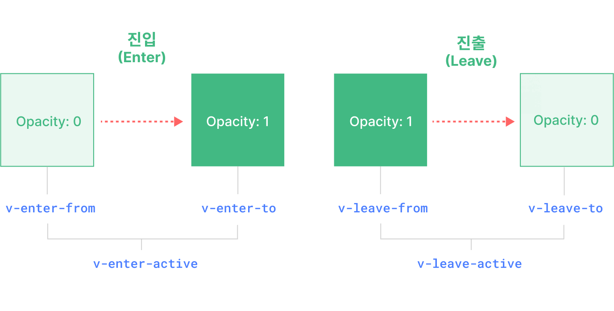

# Vue 3 내장 컴포넌트와 애니메이션

컴포넌트의 구조가 잡히면 화면 전환과 상태 보존 같은 동작을 추가할 수 있습니다. Vue의 내장 컴포넌트가 각각 어떤 문제를 해결하는지, 애니메이션과 비동기 렌더링에는 어떤 조건이 필요한지 살펴봅니다.

## 목차

- [트랜지션(transition)](#guide-built-ins-transition)
- [TransitionGroup](#guide-built-ins-transition-group)
- [KeepAlive](#guide-built-ins-keep-alive)
- [텔레포트](#guide-built-ins-teleport)
- [Suspense](#guide-built-ins-suspense)
- [애니메이션 기법](#guide-extras-animation)

---

<a id="guide-built-ins-transition"></a>

**문서 데모 설정 코드**

```vue
<script setup>
import Basic from './transition-demos/Basic.vue'
import SlideFade from './transition-demos/SlideFade.vue'
import CssAnimation from './transition-demos/CssAnimation.vue'
import NestedTransitions from './transition-demos/NestedTransitions.vue'
import JsHooks from './transition-demos/JsHooks.vue'
import BetweenElements from './transition-demos/BetweenElements.vue'
import BetweenComponents from './transition-demos/BetweenComponents.vue'
</script>
```


<a id="guide-built-ins-transition-transition"></a>

## 트랜지션(transition)

> 원문: https://github.com/vuejs/docs/blob/40aa88af0094f7bab4aaf786e55c748a6a251d88/src/guide/built-ins/transition.md
> 한국어 번역 기반: https://github.com/vuejs-translations/docs-ko/blob/6e646acb5687510feda533281faa546b26ea243c/src/guide/built-ins/transition.md

Vue는 상태 변화에 따라 트랜지션과 애니메이션을 다루는 데 도움이 되는 두 개의 내장 컴포넌트(component)를 제공합니다:

- `<Transition>`: 요소나 컴포넌트가 DOM에 진입하거나 퇴장할 때 애니메이션을 적용합니다. 이 페이지에서 다룹니다.

- `<TransitionGroup>`: `v-for` 리스트에서 요소나 컴포넌트가 삽입, 제거, 이동될 때 애니메이션을 적용합니다. [다음 장](04_built_ins_and_animation.md#guide-built-ins-transition-group)에서 다룹니다.

이 두 컴포넌트 외에도, CSS 클래스 토글이나 스타일 바인딩(binding)을 통한 상태 기반 애니메이션 등 다른 기법을 사용하여 Vue에서 애니메이션을 적용할 수 있습니다. 이러한 추가 기법들은 [애니메이션 기법](04_built_ins_and_animation.md#guide-extras-animation) 장에서 다룹니다.

<a id="guide-built-ins-transition-the-transition-component"></a>

### `<Transition>` 컴포넌트
`<Transition>`은 내장 컴포넌트입니다. 즉, 어떤 컴포넌트의 템플릿(template)에서도 별도의 등록 없이 사용할 수 있습니다. 기본 슬롯(slot)을 통해 전달된 요소나 컴포넌트에 진입 및 퇴장 애니메이션을 적용할 수 있습니다. 진입 또는 퇴장은 다음 중 하나에 의해 트리거될 수 있습니다:

- `v-if`를 통한 조건부 렌더링(rendering)
- `v-show`를 통한 조건부 표시
- `<component>` 특수 요소를 통한 동적 컴포넌트 토글
- 특수 `key` 속성 변경

가장 기본적인 사용 예시는 다음과 같습니다:

```vue-html
<button @click="show = !show">토글</button>
<Transition>
  <p v-if="show">hello</p>
</Transition>
```

```css
/* 다음에서 이 클래스들이 무엇을 하는지 설명하겠습니다! */
.v-enter-active,
.v-leave-active {
  transition: opacity 0.5s ease;
}

.v-enter-from,
.v-leave-to {
  opacity: 0;
}
```


[데모 소스](assets/guide/built-ins/transition-demos/Basic.vue)


**컴포지션 API**


[플레이그라운드에서 실행해보기](https://play.vuejs.org/#eNpVkEFuwyAQRa8yZZNWqu1sunFJ1N4hSzYUjRNUDAjGVJHluxcCipIV/OG/pxEr+/a+TwuykfGogvYEEWnxR2H17F0gWCHgBBtMwc2wy9WdsMIqZ2OuXtwfHErhlcKCb8LyoVoynwPh7I0kzAmA/yxEzsKXMlr9HgRr9Es5BTue3PlskA+1VpFTkDZq0i3niYfU6anRmbqgMY4PZeH8OjwBfHhYIMdIV1OuferQEoZOKtIJ328TgzJhm8BabHR3jeC8VJqusO8/IqCM+CnsVqR3V/mfRxO5amnkCPuK5B+6rcG2fydshks=)


**옵션 API**


[플레이그라운드에서 실행해보기](https://play.vuejs.org/#eNpVkMFuAiEQhl9lyqlNuouXXrZo2nfwuBeKs0qKQGBAjfHdZZfVrAmB+f/M/2WGK/v1vs0JWcdEVEF72vQWz94Fgh0OMhmCa28BdpLk+0etAQJSCvahAOLBnTqgkLA6t/EpVzmCP7lFEB69kYRFAYi/ROQs/Cij1f+6ZyMG1vA2vj3bbN1+b1Dw2lYj2yBt1KRnXRwPudHDnC6pAxrjBPe1n78EBF8MUGSkixnLNjdoCUMjFemMn5NjUGacnboqPVkdOC+Vpgus2q8IKCN+T+suWENwxyWJXKXMyQ5WNVJ+aBqD3e6VSYoi)


**참고**
`<Transition>`은 슬롯 콘텐츠로 단일 요소 또는 컴포넌트만 지원합니다. 콘텐츠가 컴포넌트인 경우, 해당 컴포넌트 역시 단일 루트 요소만 가져야 합니다.


`<Transition>` 컴포넌트 내의 요소가 삽입되거나 제거될 때 다음과 같은 일이 발생합니다:

1. Vue는 대상 요소에 CSS 트랜지션 또는 애니메이션이 적용되어 있는지 자동으로 감지합니다. 적용되어 있다면, [CSS 트랜지션 클래스](04_built_ins_and_animation.md#guide-built-ins-transition-transition-classes)들이 적절한 타이밍에 추가/제거됩니다.

2. [JavaScript 훅(hook)](04_built_ins_and_animation.md#guide-built-ins-transition-javascript-hooks)에 대한 리스너(listener)가 있다면, 이 훅들이 적절한 타이밍에 호출됩니다.

3. CSS 트랜지션/애니메이션이 감지되지 않고 JavaScript 훅도 제공되지 않은 경우, 삽입 및/또는 제거에 대한 DOM 조작이 브라우저의 다음 애니메이션 프레임에 실행됩니다.

<a id="guide-built-ins-transition-css-based-transitions"></a>

### CSS 기반 트랜지션
<a id="guide-built-ins-transition-transition-classes"></a>

#### 트랜지션 클래스
진입/퇴장 트랜지션에는 여섯 개의 클래스가 적용됩니다.



<!-- https://www.figma.com/file/rlOv0ZKJFFNA9hYmzdZv3S/Transition-Classes -->

1. `v-enter-from`: 진입의 시작 상태. 요소가 삽입되기 전에 추가되고, 요소가 삽입된 한 프레임 후에 제거됩니다.

2. `v-enter-active`: 진입의 활성 상태. 전체 진입 단계 동안 적용됩니다. 요소가 삽입되기 전에 추가되고, 트랜지션/애니메이션이 끝나면 제거됩니다. 이 클래스는 진입 트랜지션의 지속 시간, 지연, 이징 곡선을 정의하는 데 사용할 수 있습니다.

3. `v-enter-to`: 진입의 종료 상태. 요소가 삽입된 한 프레임 후(`v-enter-from`이 제거되는 시점) 추가되고, 트랜지션/애니메이션이 끝나면 제거됩니다.

4. `v-leave-from`: 퇴장의 시작 상태. 퇴장 트랜지션이 트리거되자마자 추가되고, 한 프레임 후에 제거됩니다.

5. `v-leave-active`: 퇴장의 활성 상태. 전체 퇴장 단계 동안 적용됩니다. 퇴장 트랜지션이 트리거되자마자 추가되고, 트랜지션/애니메이션이 끝나면 제거됩니다. 이 클래스는 퇴장 트랜지션의 지속 시간, 지연, 이징 곡선을 정의하는 데 사용할 수 있습니다.

6. `v-leave-to`: 퇴장의 종료 상태. 퇴장 트랜지션이 트리거된 한 프레임 후(`v-leave-from`이 제거되는 시점) 추가되고, 트랜지션/애니메이션이 끝나면 제거됩니다.

`v-enter-active`와 `v-leave-active`를 사용하면 진입/퇴장 트랜지션에 서로 다른 이징 곡선을 지정할 수 있습니다. 다음 섹션에서 예시를 확인할 수 있습니다.

<a id="guide-built-ins-transition-named-transitions"></a>

#### 네임드 트랜지션
트랜지션은 `name` prop을 통해 이름을 지정할 수 있습니다:

```vue-html
<Transition name="fade">
  ...
</Transition>
```

네임드 트랜지션에서는 트랜지션 클래스에 `v` 대신 해당 이름이 접두사로 붙습니다. 예를 들어, 위 트랜지션에 적용되는 클래스는 `v-enter-active` 대신 `fade-enter-active`가 됩니다. 페이드 트랜지션의 CSS는 다음과 같습니다:

```css
.fade-enter-active,
.fade-leave-active {
  transition: opacity 0.5s ease;
}

.fade-enter-from,
.fade-leave-to {
  opacity: 0;
}
```

<a id="guide-built-ins-transition-css-transitions"></a>

#### CSS 트랜지션
위의 기본 예시에서 보았듯이, `<Transition>`은 [네이티브 CSS 트랜지션](https://developer.mozilla.org/ko/docs/Web/CSS/CSS_Transitions/Using_CSS_transitions)과 함께 가장 자주 사용됩니다. `transition` CSS 속성은 트랜지션의 여러 측면(애니메이션할 속성, 트랜지션 지속 시간, [이징 곡선](https://developer.mozilla.org/ko/docs/Web/CSS/easing-function) 등)을 지정할 수 있는 단축 속성입니다.

다음은 여러 속성을 트랜지션하고, 진입과 퇴장에 서로 다른 지속 시간과 이징 곡선을 사용하는 좀 더 고급 예시입니다:

```vue-html
<Transition name="slide-fade">
  <p v-if="show">hello</p>
</Transition>
```

```css
/*
  진입과 퇴장 애니메이션에
  서로 다른 지속 시간과 타이밍 함수를 사용할 수 있습니다.
*/
.slide-fade-enter-active {
  transition: all 0.3s ease-out;
}

.slide-fade-leave-active {
  transition: all 0.8s cubic-bezier(1, 0.5, 0.8, 1);
}

.slide-fade-enter-from,
.slide-fade-leave-to {
  transform: translateX(20px);
  opacity: 0;
}
```


[데모 소스](assets/guide/built-ins/transition-demos/SlideFade.vue)


**컴포지션 API**


[플레이그라운드에서 실행해보기](https://play.vuejs.org/#eNqFkc9uwjAMxl/F6wXQKIVNk1AX0HbZC4zDDr2E4EK0NIkStxtDvPviFQ0OSFzyx/m+n+34kL16P+lazMpMRBW0J4hIrV9WVjfeBYIDBKzhCHVwDQySdFDZyipnY5Lu3BcsWDCk0OKosqLoKcmfLoSNN5KQbyTWLZGz8KKMVp+LKju573ivsuXKbbcG4d3oDcI9vMkNiqL3JD+AWAVpoyadGFY2yATW5nVSJj9rkspDl+v6hE/hHRrjRMEdpdfiDEkBUVxWaEWkveHj5AzO0RKGXCrSHcKBIfSPKEEaA9PJYwSUEXPX0nNlj8y6RBiUHd5AzCOodq1VvsYfjWE4G6fgEy/zMcxG17B9ZTyX8bV85C5y1S40ZX/kdj+GD1P/zVQA56XStC9h2idJI/z7huz4CxoVvE4=)


**옵션 API**


[플레이그라운드에서 실행해보기](https://play.vuejs.org/#eNqFkc1uwjAMgF/F6wk0SmHTJNQFtF32AuOwQy+hdSFamkSJ08EQ776EbMAkJKTIf7I/O/Y+ezVm3HvMyoy52gpDi0rh1mhL0GDLvSTYVwqg4cQHw2QDWCRv1Z8H4Db6qwSyHlPkEFUQ4bHixA0OYWckJ4wesZUn0gpeainqz3mVRQzM4S7qKlss9XotEd6laBDu4Y03yIpUE+oB2NJy5QSJwFC8w0iIuXkbMkN9moUZ6HPR/uJDeINSalaYxCjOkBBgxeWEijnayWiOz+AcFaHNeU2ix7QCOiFK4FLCZPzoALnDXHt6Pq7hP0Ii7/EGYuag9itR5yv8FmgH01EIPkUxG8F0eA2bJmut7kbX+pG+6NVq28WTBTN+92PwMDHbSAXQhteCdiVMUpNwwuMassMP8kfAJQ==)


<a id="guide-built-ins-transition-css-animations"></a>

#### CSS 애니메이션
[네이티브 CSS 애니메이션](https://developer.mozilla.org/ko/docs/Web/CSS/CSS_Animations/Using_CSS_animations)은 CSS 트랜지션과 동일한 방식으로 적용되지만, `*-enter-from`이 요소가 삽입된 직후 바로 제거되는 것이 아니라 `animationend` 이벤트에서 제거된다는 차이점이 있습니다.

대부분의 CSS 애니메이션은 `*-enter-active`와 `*-leave-active` 클래스 아래에 선언하기만 하면 됩니다. 예시는 다음과 같습니다:

```vue-html
<Transition name="bounce">
  <p v-if="show" style="text-align: center;">
    Hello here is some bouncy text!
  </p>
</Transition>
```

```css
.bounce-enter-active {
  animation: bounce-in 0.5s;
}
.bounce-leave-active {
  animation: bounce-in 0.5s reverse;
}
@keyframes bounce-in {
  0% {
    transform: scale(0);
  }
  50% {
    transform: scale(1.25);
  }
  100% {
    transform: scale(1);
  }
}
```


[데모 소스](assets/guide/built-ins/transition-demos/CssAnimation.vue)


**컴포지션 API**


[플레이그라운드에서 실행해보기](https://play.vuejs.org/#eNqNksGOgjAQhl9lJNmoBwRNvCAa97YP4JFLbQZsLG3TDqzG+O47BaOezCYkpfB9/0wHbsm3c4u+w6RIyiC9cgQBqXO7yqjWWU9wA4813KH2toUpo9PKVEZaExg92V/YRmBGvsN5ZcpsTGGfN4St04Iw7qg8dkTWwF5qJc/bKnnYk7hWye5gm0ZjmY0YKwDlwQsTFCnWjGiRpaPtjETG43smHPSpqh9pVQKBrjpyrfCNMilZV8Aqd5cNEF4oFVo1pgCJhtBvnjEAP6i1hRN6BBUg2BZhKHUdvMmjWhYHE9dXY/ygzN4PasqhB75djM2mQ7FUSFI9wi0GCJ6uiHYxVsFUGcgX67CpzP0lahQ9/k/kj9CjDzgG7M94rT1PLLxhQ0D+Na4AFI9QW98WEKTQOMvnLAOwDrD+wC0Xq/Ubusw/sU+QL/45hskk9z8Bddbn)


**옵션 API**


[플레이그라운드에서 실행해보기](https://play.vuejs.org/#eNqNUs2OwiAQfpWxySZ66I8mXioa97YP4LEXrNNKpEBg2tUY330pqOvJmBBgyPczP1yTb2OyocekTJirrTC0qRSejbYEB2x4LwmulQI4cOLTWbwDWKTeqkcE4I76twSyPcaX23j4zS+WP3V9QNgZyQnHiNi+J9IKtrUU9WldJaMMrGEynlWy2em2lcjyCPMUALazXDlBwtMU79CT9rpXNXp4tGYGhlQ0d7UqAUcXOeI6bluhUtKmhEVhzisgPFPKpWhVCTUqQrt6ygD8oJQajmgRhAOnO4RgdQm8yd0tNzGv/D8x/8Dy10IVCzn4axaTTYNZymsSA8YuciU6PrLL6IKpUFBkS7cKXXwQJfIBPyP6IQ1oHUaB7QkvjfUdcy+wIFB8PeZIYwmNtl0JruYSp8XMk+/TXL7BzbPF8gU6L95hn8D4OUJnktsfM1vavg==)


<a id="guide-built-ins-transition-custom-transition-classes"></a>

#### 커스텀 트랜지션 클래스
다음과 같은 prop을 `<Transition>`에 전달하여 커스텀 트랜지션 클래스를 지정할 수도 있습니다:

- `enter-from-class`
- `enter-active-class`
- `enter-to-class`
- `leave-from-class`
- `leave-active-class`
- `leave-to-class`

이 prop들은 관례적인 클래스 이름을 덮어씁니다. 이는 [Animate.css](https://daneden.github.io/animate.css/)와 같은 기존 CSS 애니메이션 라이브러리와 Vue의 트랜지션 시스템을 결합하고 싶을 때 특히 유용합니다:

```vue-html
<!-- Animate.css가 페이지에 포함되어 있다고 가정 -->
<Transition
  name="custom-classes"
  enter-active-class="animate__animated animate__tada"
  leave-active-class="animate__animated animate__bounceOutRight"
>
  <p v-if="show">hello</p>
</Transition>
```


**컴포지션 API**


[플레이그라운드에서 실행해보기](https://play.vuejs.org/#eNqNUctuwjAQ/BXXF9oDsZB6ogbRL6hUcbSEjLMhpn7JXtNWiH/vhqS0R3zxPmbWM+szf02pOVXgSy6LyTYhK4A1rVWwPsWM7MwydOzCuhw9mxF0poIKJoZC0D5+stUAeMRc4UkFKcYpxKcEwSenEYYM5b4ixsA2xlnzsVJ8Yj8Mt+LrbTwcHEgxwojCmNxmHYpFG2kaoxO0B2KaWjD6uXG6FCiKj00ICHmuDdoTjD2CavJBCna7KWjZrYK61b9cB5pI93P3sQYDbxXf7aHHccpVMolO7DS33WSQjPXgXJRi2Cl1xZ8nKkjxf0dBFvx2Q7iZtq94j5jKUgjThmNpjIu17ZzO0JjohT7qL+HsvohJWWNKEc/NolncKt6Goar4y/V7rg/wyw9zrLOy)


**옵션 API**


[플레이그라운드에서 실행해보기](https://play.vuejs.org/#eNqNUcFuwjAM/RUvp+1Ao0k7sYDYF0yaOFZCJjU0LE2ixGFMiH9f2gDbcVKU2M9+tl98Fm8hNMdMYi5U0tEEXraOTsFHho52mC3DuXUAHTI+PlUbIBLn6G4eQOr91xw4ZqrIZXzKVY6S97rFYRqCRabRY7XNzN7BSlujPxetGMvAAh7GtxXLtd/vLSlZ0woFQK0jumTY+FJt7ORwoMLUObEfZtpiSpRaUYPkmOIMNZsj1VhJRWeGMsFmczU6uCOMHd64lrCQ/s/d+uw0vWf+MPuea5Vp5DJ0gOPM7K4Ci7CerPVKhipJ/moqgJJ//8ipxN92NFdmmLbSip45pLmUunOH1Gjrc7ezGKnRfpB4wJO0ZpvkdbJGpyRfmufm+Y4Mxo1oK16n9UwNxOUHwaK3iQ==)


<a id="guide-built-ins-transition-using-transitions-and-animations-together"></a>

#### 트랜지션과 애니메이션을 함께 사용하기
Vue는 트랜지션이 끝났는지 알기 위해 이벤트 리스너를 등록해야 합니다. 리스닝할 이벤트는 적용된 CSS 규칙의 종류에 따라 `transitionend` 또는 `animationend`가 될 수 있습니다. 둘 중 하나만 사용하는 경우, Vue가 자동으로 올바른 타입을 감지할 수 있습니다.

하지만, 같은 요소에 둘 다 사용하고 싶을 때가 있습니다. 예를 들어, Vue가 트리거하는 CSS 애니메이션과 hover 시의 CSS 트랜지션 효과를 함께 쓰는 경우가 그렇습니다. 이런 경우, Vue가 신경 써야 할 타입을 `type` prop을 통해 명시적으로 선언해야 하며, 값은 `animation` 또는 `transition` 중 하나입니다:

```vue-html
<Transition type="animation">...</Transition>
```

<a id="guide-built-ins-transition-nested-transitions-and-explicit-transition-durations"></a>

#### 중첩 트랜지션과 명시적 트랜지션 지속 시간
트랜지션 클래스는 `<Transition>`의 직접 자식 요소에만 적용되지만, 중첩된 CSS 선택자를 사용하여 중첩 요소에도 트랜지션을 적용할 수 있습니다:

```vue-html
<Transition name="nested">
  <div v-if="show" class="outer">
    <div class="inner">
      Hello
    </div>
  </div>
</Transition>
```

```css
/* 중첩 요소를 타겟팅하는 규칙 */
.nested-enter-active .inner,
.nested-leave-active .inner {
  transition: all 0.3s ease-in-out;
}

.nested-enter-from .inner,
.nested-leave-to .inner {
  transform: translateX(30px);
  opacity: 0;
}

/* ... 필요한 다른 CSS는 생략 */
```

진입 시 중첩 요소에 트랜지션 지연을 추가하여, 계단식 진입 애니메이션 시퀀스를 만들 수도 있습니다:

```css{3}
/* 계단식 효과를 위해 중첩 요소의 진입을 지연 */
.nested-enter-active .inner {
  transition-delay: 0.25s;
}
```

하지만, 이로 인해 작은 문제가 발생합니다. 기본적으로 `<Transition>` 컴포넌트는 루트 트랜지션 요소에서 **첫 번째** `transitionend` 또는 `animationend` 이벤트를 감지하여 트랜지션이 끝났는지 자동으로 판단합니다. 중첩 트랜지션의 경우, 모든 내부 요소의 트랜지션이 끝날 때까지 기다리는 것이 바람직합니다.

이런 경우 `<Transition>` 컴포넌트의 `duration` prop을 사용하여 명시적으로 트랜지션 지속 시간(밀리초 단위)을 지정할 수 있습니다. 전체 지속 시간은 내부 요소의 지연 시간과 트랜지션 지속 시간을 합한 값이어야 합니다:

```vue-html
<Transition :duration="550">...</Transition>
```


[데모 소스](assets/guide/built-ins/transition-demos/NestedTransitions.vue)


[플레이그라운드에서 실행해보기](https://play.vuejs.org/#eNqVVd9v0zAQ/leO8LAfrE3HNKSFbgKmSYMHQNAHkPLiOtfEm2NHttN2mvq/c7bTNi1jgFop9t13d9995ziPyfumGc5bTLJkbLkRjQOLrm2uciXqRhsHj2BwBiuYGV3DAUEPcpUrrpUlaKUXcOkBh860eJSrcRqzUDxtHNaNZA5pBzCets5pBe+4FPz+Mk+66Bf+mSdXE12WEsdphMWQiWHKCicoLCtaw/yKIs/PR3kCitVIG4XWYUEJfATFFGIO84GYdRUIyCWzlra6dWg2wA66dgqlts7c+d8tSqk34JTQ6xqb9TjdUiTDOO21TFvrHqRfDkPpExiGKvBITjdl/L40ulVFBi8R8a3P17CiEKrM4GzULIOlFmpQoSgrl8HpKFpX3kFZu2y0BNhJxznvwaJCA1TEYcC4E3MkKp1VIptjZ43E3KajDJiUMBqeWUBmcUBUqJGYOT2GAiV7gJAA9Iy4GyoBKLH2z+N0W3q/CMC2yCCkyajM63Mbc+9z9mfvZD+b071MM23qLC69+j8PvX5HQUDdMC6cL7BOTtQXCJwpas/qHhWIBdYtWGgtDWNttWTmThu701pf1W6+v1Hd8Xbz+k+VQxmv8i7Fv1HZn+g/iv2nRkjzbd6npf/Rkz49DifQ3dLZBBYOJzC4rqgCwsUbmLYlCAUVU4XsCd1NrCeRHcYXb1IJC/RX2hEYCwJTvHYVMZoavbBI09FmU+LiFSzIh0AIXy1mqZiFKaKCmVhiEVJ7GftHZTganUZ56EYLL3FykjhL195MlMM7qxXdmEGDPOG6boRE86UJVPMki+p4H01WLz4Fm78hSdBo5xXy+yfsd3bpbXny1SA1M8c82fgcMyW66L75/hmXtN44a120ktDPOL+h1bL1HCPsA42DaPdwge3HcO/TOCb2ZumQJtA15Yl65Crg84S+BdfPtL6lezY8C3GkZ7L6Bc1zNR0=)

필요하다면, 진입과 퇴장 지속 시간을 객체로 각각 지정할 수도 있습니다:

```vue-html
<Transition :duration="{ enter: 500, leave: 800 }">...</Transition>
```

<a id="guide-built-ins-transition-performance-considerations"></a>

#### 성능 고려사항
위에서 보여준 애니메이션들은 주로 `transform`과 `opacity`와 같은 속성을 사용합니다. 이 속성들은 애니메이션에 효율적인데, 그 이유는 다음과 같습니다:

1. 애니메이션 중 문서 레이아웃에 영향을 주지 않으므로, 매 프레임마다 비싼 CSS 레이아웃 계산이 발생하지 않습니다.

2. 대부분의 최신 브라우저는 `transform` 애니메이션 시 GPU 하드웨어 가속을 활용할 수 있습니다.

반면, `height`나 `margin`과 같은 속성은 CSS 레이아웃을 트리거하므로 애니메이션 비용이 훨씬 크며, 주의해서 사용해야 합니다.

<a id="guide-built-ins-transition-javascript-hooks"></a>

### JavaScript 훅
`<Transition>` 컴포넌트에서 이벤트를 리스닝하여 트랜지션 과정에 JavaScript로 개입할 수 있습니다:

```vue-html
<Transition
  @before-enter="onBeforeEnter"
  @enter="onEnter"
  @after-enter="onAfterEnter"
  @enter-cancelled="onEnterCancelled"
  @before-leave="onBeforeLeave"
  @leave="onLeave"
  @after-leave="onAfterLeave"
  @leave-cancelled="onLeaveCancelled"
>
  <!-- ... -->
</Transition>
```


**컴포지션 API**


```js
// 요소가 DOM에 삽입되기 전에 호출됩니다.
// 이곳에서 요소의 "enter-from" 상태를 설정할 수 있습니다.
function onBeforeEnter(el) {}

// 요소가 삽입된 한 프레임 후에 호출됩니다.
// 이곳에서 진입 애니메이션을 시작할 수 있습니다.
function onEnter(el, done) {
  // done 콜백을 호출하여 트랜지션 종료를 알립니다.
  // CSS와 함께 사용할 경우 선택 사항입니다.
  done()
}

// 진입 트랜지션이 끝났을 때 호출됩니다.
function onAfterEnter(el) {}

// 진입 트랜지션이 완료되기 전에 취소되었을 때 호출됩니다.
function onEnterCancelled(el) {}

// 퇴장 훅 전에 호출됩니다.
// 대부분의 경우 leave 훅만 사용하면 됩니다.
function onBeforeLeave(el) {}

// 퇴장 트랜지션이 시작될 때 호출됩니다.
// 이곳에서 퇴장 애니메이션을 시작할 수 있습니다.
function onLeave(el, done) {
  // done 콜백을 호출하여 트랜지션 종료를 알립니다.
  // CSS와 함께 사용할 경우 선택 사항입니다.
  done()
}

// 퇴장 트랜지션이 끝나고
// 요소가 DOM에서 제거되었을 때 호출됩니다.
function onAfterLeave(el) {}

// v-show 트랜지션에서만 사용 가능합니다.
function onLeaveCancelled(el) {}
```


**옵션 API**


```js
export default {
  // ...
  methods: {
    // 요소가 DOM에 삽입되기 전에 호출됩니다.
    // 이곳에서 요소의 "enter-from" 상태를 설정할 수 있습니다.
    onBeforeEnter(el) {},

    // 요소가 삽입된 한 프레임 후에 호출됩니다.
    // 이곳에서 애니메이션을 시작할 수 있습니다.
    onEnter(el, done) {
      // done 콜백을 호출하여 트랜지션 종료를 알립니다.
      // CSS와 함께 사용할 경우 선택 사항입니다.
      done()
    },

    // 진입 트랜지션이 끝났을 때 호출됩니다.
    onAfterEnter(el) {},

    // 진입 트랜지션이 완료되기 전에 취소되었을 때 호출됩니다.
    onEnterCancelled(el) {},

    // 퇴장 훅 전에 호출됩니다.
    // 대부분의 경우 leave 훅만 사용하면 됩니다.
    onBeforeLeave(el) {},

    // 퇴장 트랜지션이 시작될 때 호출됩니다.
    // 이곳에서 퇴장 애니메이션을 시작할 수 있습니다.
    onLeave(el, done) {
      // done 콜백을 호출하여 트랜지션 종료를 알립니다.
      // CSS와 함께 사용할 경우 선택 사항입니다.
      done()
    },

    // 퇴장 트랜지션이 끝나고
    // 요소가 DOM에서 제거되었을 때 호출됩니다.
    onAfterLeave(el) {},

    // v-show 트랜지션에서만 사용 가능합니다.
    onLeaveCancelled(el) {}
  }
}
```


이 훅들은 CSS 트랜지션/애니메이션과 함께 또는 단독으로 사용할 수 있습니다.

JavaScript 전용 트랜지션을 사용할 때는 `:css="false"` prop을 추가하는 것이 좋습니다. 이는 Vue에게 자동 CSS 트랜지션 감지를 건너뛰라고 명시적으로 알립니다. 이렇게 하면 성능이 약간 더 좋아질 뿐만 아니라, CSS 규칙이 트랜지션에 실수로 간섭하는 것도 방지할 수 있습니다:

```vue-html{3}
<Transition
  ...
  :css="false"
>
  ...
</Transition>
```

`:css="false"`를 사용하면 트랜지션 종료 시점을 완전히 직접 제어해야 합니다. 이 경우, `@enter`와 `@leave` 훅에서 `done` 콜백(callback)이 필수입니다. 그렇지 않으면 훅이 동기적으로 호출되어 트랜지션이 즉시 끝나게 됩니다.

아래는 [GSAP 라이브러리](https://gsap.com/)를 사용하여 애니메이션을 수행하는 데모입니다. 물론 [Anime.js](https://animejs.com/)나 [Motion One](https://motion.dev/) 등 다른 애니메이션 라이브러리도 사용할 수 있습니다:


[데모 소스](assets/guide/built-ins/transition-demos/JsHooks.vue)


**컴포지션 API**


[플레이그라운드에서 실행해보기](https://play.vuejs.org/#eNqNVMtu2zAQ/JUti8I2YD3i1GigKmnaorcCveTQArpQFCWzlkiCpBwHhv+9Sz1qKYckJ3FnlzvD2YVO5KvW4aHlJCGpZUZoB5a7Vt9lUjRaGQcnMLyEM5RGNbDA0sX/VGWpHnB/xEQmmZIWe+zUI9z6m0tnWr7ymbKVzAklQclvvFSG/5COmyWvV3DKJHTdQiRHZN0jAJbRmv9OIA432/UE+jODlKZMuKcErnx8RrazP8woR7I1FEryKaVTU8aiNdRfwWZTQtQwi1HAGF/YB4BTyxNY8JpaJ1go5K/WLTfhdg1Xq8V4SX5Xja65w0ovaCJ8Jvsnpwc+l525F2XH4ac3Cj8mcB3HbxE9qnvFMRzJ0K3APuhIjPefmTTyvWBAGvWbiDuIgeNYRh3HCCDNW+fQmHtWC7a/zciwaO/8NyN3D6qqap5GfVnXAC89GCqt8Bp77vu827+A+53AJrOFzMhQdMnO8dqPpMO74Yx4wqxFtKS1HbBOMdIX4gAMffVp71+Qq2NG4BCIcngBKk8jLOvfGF30IpBGEwcwtO6p9sdwbNXPIadsXxnVyiKB9x83+c3N9WePN9RUQgZO6QQ2sT524KMo3M5Pf4h3XFQ7NwFyZQpuAkML0doEtvEHhPvRDPRkTfq/QNDgRvy1SuIvpFOSDQmbkWTckf7hHsjIzjltkyhqpd5XIVNN5HNfGlW09eAcMp3J+R+pEn7L)


**옵션 API**


[플레이그라운드에서 실행해보기](https://play.vuejs.org/#eNqNVFFvmzAQ/is3pimNlABNF61iaddt2tukvfRhk/xiwIAXsJF9pKmq/PedDTSwh7ZSFLjvzvd9/nz4KfjatuGhE0ES7GxmZIu3TMmm1QahtLyFwugGFu51wRQAU+Lok7koeFcjPDk058gvlv07gBHYGTVGALbSDwmg6USPnNzjtHL/jcBK5zZxxQwZavVNFNqIHwqF8RUAWs2jn4IffCfqQz+mik5lKLWi3GT1hagHRU58aAUSshpV2YzX4ncCcbjZDp099GcG6ZZnEh8TuPR8S0/oTJhQjmQryLUSU0rUU8a8M9wtoWZTQtIwi0nAGJ/ZB0BwKxJYiJpblFko1a8OLzbhdgWXy8WzP99109YCqdIJmgifyfYuzmUzfFF2HH56o/BjAldx/BbRo7pXHKMjGbrl1IcciWn9fyaNfC8YsIueR5wCFFTGUVAEsEs7pOmDu6yW2f6GBW5o4QbeuScLbu91WdZiF/VlvgEtujdcWek09tx3qZ+/tXAzQU1mA8mCoeicneO1OxKP9yM+4ElmLaEFr+2AecVEn8sDZOSrSzv/1qk+sgAOa1kMOyDlu4jK+j1GZ70E7KKJAxRafKzdazi26s8h5dm+NLpTeQLvP27S6+urz/7T5aaUao26TWATt0cPPsgcK3f6Q1wJWVY4AVJtcmHWhueyo89+G38guD+agT5YBf39s25oIv5arehu8krYkLAs8BeG86DfuANYUCG2NomiTrX7Msx0E7ncl0bnXT04566M4PQPykWaWw==)


<a id="guide-built-ins-transition-reusable-transitions"></a>

### 재사용 가능한 트랜지션
트랜지션은 Vue의 컴포넌트 시스템을 통해 재사용할 수 있습니다. 재사용 가능한 트랜지션을 만들려면, `<Transition>` 컴포넌트를 감싸고 슬롯 콘텐츠를 전달하는 컴포넌트를 작성하면 됩니다:

```vue{6} [MyTransition.vue]
<script>
// 자바스크립트 훅 로직...
</script>

<template>
  <!-- 내장 Transition 컴포넌트를 감쌉니다 -->
  <Transition
    name="my-transition"
    @enter="onEnter"
    @leave="onLeave">
    <slot></slot> <!-- 슬롯 콘텐츠 전달 -->
  </Transition>
</template>

<style>
/*
  필요한 CSS...
  참고: 여기서 <style scoped>를 사용하지 마세요.
  슬롯 콘텐츠에는 적용되지 않습니다.
*/
</style>
```

이제 `MyTransition`을 내장 버전처럼 import하여 사용할 수 있습니다:

```vue-html
<MyTransition>
  <div v-if="show">Hello</div>
</MyTransition>
```

<a id="guide-built-ins-transition-transition-on-appear"></a>

### 등장 시 트랜지션
노드의 초기 렌더링 시에도 트랜지션을 적용하고 싶다면, `appear` prop을 추가할 수 있습니다:

```vue-html
<Transition appear>
  ...
</Transition>
```

<a id="guide-built-ins-transition-transition-between-elements"></a>

### 요소 간 트랜지션
`v-if` / `v-show`로 요소를 토글하는 것 외에도, `v-if` / `v-else` / `v-else-if`를 사용하여 두 요소 간에 트랜지션할 수 있습니다. 단, 한 번에 하나의 요소만 표시되도록 해야 합니다:

```vue-html
<Transition>
  <button v-if="docState === 'saved'">Edit</button>
  <button v-else-if="docState === 'edited'">Save</button>
  <button v-else-if="docState === 'editing'">Cancel</button>
</Transition>
```


[데모 소스](assets/guide/built-ins/transition-demos/BetweenElements.vue)


[플레이그라운드에서 실행해보기](https://play.vuejs.org/#eNqdk8tu2zAQRX9loI0SoLLcFN2ostEi6BekmwLa0NTYJkKRBDkSYhj+9wxJO3ZegBGu+Lhz7syQ3Bd/nJtNIxZN0QbplSMISKNbdkYNznqCPXhcwwHW3g5QsrTsTGekNYGgt/KBBCEsouimDGLCvrztTFtnGGN4QTg4zbK4ojY4YSDQTuOiKwbhN8pUXm221MDd3D11xfJeK/kIZEHupEagrbfjZssxzAgNs5nALIC2VxNILUJg1IpMxWmRUAY9U6IZ2/3zwgRFyhowYoieQaseq9ElDaTRrkYiVkyVWrPiXNdiAcequuIkPo3fMub5Sg4l9oqSevmXZ22dwR8YoQ74kdsL4Go7ZTbR74HT/KJfJlxleGrG8l4YifqNYVuf251vqOYr4llbXz4C06b75+ns1a3BPsb0KrBy14Aymnerlbby8Vc8cTajG35uzFITpu0t5ufzHQdeH6LBsezEO0eJVbB6pBiVVLPTU6jQEPpKyMj8dnmgkQs+HmQcvVTIQK1hPrv7GQAFt9eO9Bk6fZ8Ub52Qiri8eUo+4dbWD02exh79v/nBP+H2PStnwz/jelJ1geKvk/peHJ4BoRZYow==)

<a id="guide-built-ins-transition-transition-modes"></a>

### 트랜지션 모드
이전 예시에서는 진입 및 퇴장 요소가 동시에 애니메이션되었고, 두 요소가 DOM에 동시에 존재할 때 레이아웃 문제를 피하기 위해 `position: absolute`를 사용해야 했습니다.

하지만, 어떤 경우에는 이것이 불가능하거나 원하지 않는 동작일 수 있습니다. 퇴장 요소가 먼저 애니메이션되고, 진입 요소는 퇴장 애니메이션이 끝난 **후**에만 삽입되길 원할 수 있습니다. 이런 애니메이션을 수동으로 조율하는 것은 매우 복잡하지만, `<Transition>`에 `mode` prop을 전달하여 이 동작을 쉽게 활성화할 수 있습니다:

```vue-html
<Transition mode="out-in">
  ...
</Transition>
```

아래는 `mode="out-in"`을 적용한 이전 데모입니다:


[데모 소스 (mode="out-in")](assets/guide/built-ins/transition-demos/BetweenElements.vue)


`<Transition>`은 `mode="in-out"`도 지원하지만, 이 모드는 훨씬 드물게 사용됩니다.

<a id="guide-built-ins-transition-transition-between-components"></a>

### 컴포넌트 간 트랜지션
`<Transition>`은 [동적 컴포넌트](02_essentials.md#guide-essentials-component-basics-dynamic-components)에도 사용할 수 있습니다:

```vue-html
<Transition name="fade" mode="out-in">
  <component :is="activeComponent"></component>
</Transition>
```


[데모 소스](assets/guide/built-ins/transition-demos/BetweenComponents.vue)


**컴포지션 API**


[플레이그라운드에서 실행해보기](https://play.vuejs.org/#eNqtksFugzAMhl/F4tJNKtDLLoxWKnuDacdcUnC3SCGJiMmEqr77EkgLbXfYYZyI8/v77dinZG9M5npMiqS0dScMgUXqzY4p0RrdEZzAfnEp9fc7HuEMx063sPIZq6viTbdmHy+yfDwF5K2guhFUUcBUnkNvcelBGrjTooHaC7VCRXBAoT6hQTRyAH2w2DlsmKq1sgS8JuEwUCfxdgF7Gqt5ZqrMp+58X/5A2BrJCcOJSskPKP0v+K8UyvQENBjcsqTjjdAsAZe2ukHpI3dm/q5wXPZBPFqxZAf7gCrzGfufDlVwqB4cPjqurCChFSjeBvGRN+iTA9afdE+pUD43FjG/bSHsb667Mr9qJot89vCBMl8+oiotDTL8ZsE39UnYpRN0fQlK5A5jEE6BSVdiAdrwWtAAm+zFAnKLr0ydA3pJDDt0x/PrMrJifgGbKdFPfCwpWU+TuWz5omzfVCNcfJJ5geL8pqtFn5E07u7fSHFOj6TzDyUDNEM=)


**옵션 API**


[플레이그라운드에서 실행해보기](https://play.vuejs.org/#eNqtks9ugzAMxl/F4tJNamGXXVhWqewVduSSgStFCkkUDFpV9d0XJyn9t8MOkxBg5/Pvi+Mci51z5TxhURdi7LxytG2NGpz1BB92cDvYezvAqqxixNLVjaC5ETRZ0Br8jpIe93LSBMfWAHRBYQ0aGms4Jvw6Q05rFvSS5NNzEgN4pMmbcwQgO1Izsj5CalhFRLDj1RN/wis8olpaCQHh4LQk5IiEll+owy+XCGXcREAHh+9t4WWvbFvAvBlsjzpk7gx5TeqJtdG4LbawY5KoLtR/NGjYoHkw+PTSjIqUNWDkwOK97DHUMjVEdqKNMqE272E5dajV+JvpVlSLJllUF4+QENX1ERox0kHzb8m+m1CEfpOgYYgpqVHOmJNpgLQQa7BOdooO8FK+joByxLc4tlsiX6s7HtnEyvU1vKTCMO+4pWKdBnO+0FfbDk31as5HsvR+Hl9auuozk+J1/hspz+mRdPoBYtonzg==)


<a id="guide-built-ins-transition-dynamic-transitions"></a>

### 동적 트랜지션
`<Transition>`의 `name`과 같은 prop도 동적으로 지정할 수 있습니다! 이를 통해 상태 변화에 따라 서로 다른 트랜지션을 동적으로 적용할 수 있습니다:

```vue-html
<Transition :name="transitionName">
  <!-- ... -->
</Transition>
```

이 방식은 Vue의 트랜지션 클래스 규칙을 사용해 CSS 트랜지션/애니메이션을 정의해 두고, 이를 서로 전환하고 싶을 때 유용합니다.

CSS 클래스 전환만으로 부족하다면 JavaScript 트랜지션 훅에서 컴포넌트의 현재 상태에 따라 동작을 나눌 수 있습니다. 여러 곳에서 같은 방식을 사용한다면 [재사용 가능한 트랜지션 컴포넌트](04_built_ins_and_animation.md#guide-built-ins-transition-reusable-transitions)로 묶고, prop으로 트랜지션을 조정할 수 있습니다.

<a id="guide-built-ins-transition-transitions-with-the-key-attribute"></a>

### key 속성을 사용한 트랜지션
때로는 트랜지션이 발생하도록 DOM 요소를 강제로 리렌더링해야 할 때가 있습니다.

예를 들어, 다음 카운터 컴포넌트를 보세요:


**컴포지션 API**


```vue
<script setup>
import { ref } from 'vue';
const count = ref(0);

setInterval(() => count.value++, 1000);
</script>

<template>
  <Transition>
    <span :key="count">{{ count }}</span>
  </Transition>
</template>
```


**옵션 API**


```vue
<script>
export default {
  data() {
    return {
      count: 1,
      interval: null 
    }
  },
  mounted() {
    this.interval = setInterval(() => {
      this.count++;
    }, 1000)
  },
  beforeDestroy() {
    clearInterval(this.interval)
  }
}
</script>

<template>
  <Transition>
    <span :key="count">{{ count }}</span>
  </Transition>
</template>
```


`key` 속성을 생략했다면, 텍스트 노드만 업데이트되어 트랜지션이 발생하지 않습니다. 하지만 `key` 속성이 있으면, `count`가 변경될 때마다 Vue는 새로운 `span` 요소를 생성하므로 `Transition` 컴포넌트가 트랜지션할 두 개의 서로 다른 요소를 갖게 됩니다.


**컴포지션 API**


[플레이그라운드에서 실행해보기](https://play.vuejs.org/#eNp9UsFu2zAM/RVCl6Zo4nhYd/GcAtvQQ3fYhq1HXTSFydTKkiDJbjLD/z5KMrKgLXoTHx/5+CiO7JNz1dAja1gbpFcuQsDYuxtuVOesjzCCxx1MsPO2gwuiXnzkhhtpTYggbW8ibBJlUV/mBJXfmYh+EHqxuITNDYzcQGFWBPZ4dUXEaQnv6jrXtOuiTJoUROycFhEpAmi3agCpRQgbzp68cA49ZyV174UJKiprckxIcMJA84hHImc9oo7jPOQ0kQ4RSvH6WXW7JiV6teszfQpDPGqEIK3DLSGpQbazsyaugvqLDVx77JIhbqp5wsxwtrRvPFI7NWDhEGtYYVrQSsgELzOiUQw4I2Vh8TRgA9YJqeIR6upDABQh9TpTAPE7WN3HlxLp084Foi3N54YN1KWEVpOMkkO2ZJHsmp3aVw/BGjqMXJE22jml0X93STRw1pReKSe0tk9fMxZ9nzwVXP5B+fgK/hAOCePsh8dAt4KcnXJR+D3S16X07a9veKD3KdnZba+J/UbyJ+Zl0IyF9rk3Wxr7jJenvcvnrcz+PtweItKuZ1Np0MScMp8zOvkvb1j/P+776jrX0UbZ9A+fYSTP)


**옵션 API**


[플레이그라운드에서 실행해보기](https://play.vuejs.org/#eNp9U8tu2zAQ/JUFTwkSyw6aXlQ7QB85pIe2aHPUhZHWDhOKJMiVYtfwv3dJSpbbBgEMWJydndkdUXvx0bmi71CUYhlqrxzdVAa3znqCBtey0wT7ygA0kuTZeX4G8EidN+MJoLadoRKuLkdAGULfS12C6bSGDB/i3yFx2tiAzaRIjyoUYxesICDdDaczZq1uJrNETY4XFx8G5Uu4WiwW55PBA66txy8YyNvdZFNrlP4o/Jdpbq4M/5bzYxZ8IGydloR8Alg2qmcVGcKqEi9eOoe+EqnExXsvTVCkrBkQxoKTBspn3HFDmprp+32ODA4H9mLCKDD/R2E5Zz9+Ws5PpuBjoJ1GCLV12DASJdKGa2toFtRvLOHaY8vx8DrFMGdiOJvlS48sp3rMHGb1M4xRzGQdYU6REY6rxwHJGdJxwBKsk7WiHSyK9wFQhqh14gDyIVjd0f8Wa2/bUwOyWXwQLGGRWzicuChvKC4F8bpmrTbFU7CGL2zqiJm2Tmn03100DZUox5ddCam1ffmaMPJd3Cnj9SPWz6/gT2EbsUr88Bj4VmAljjWSfoP88mL59tc33PLzsdjaptPMfqP4E1MYPGOmfepMw2Of8NK0d238+JTZ3IfbLSFnPSwVB53udyX4q/38xurTuO+K6/Fqi8MffqhR/A==)


---

**관련 문서**

- [`<Transition>` API 레퍼런스](08_component_and_advanced_apis.md#api-built-in-components-transition)

---

<a id="guide-built-ins-transition-group"></a>

**문서 데모 설정 코드**

```vue
<script setup>
import ListBasic from './transition-demos/ListBasic.vue'
import ListMove from './transition-demos/ListMove.vue'
import ListStagger from './transition-demos/ListStagger.vue'
</script>
```


<a id="guide-built-ins-transition-group-transitiongroup"></a>

## TransitionGroup

> 원문: https://github.com/vuejs/docs/blob/40aa88af0094f7bab4aaf786e55c748a6a251d88/src/guide/built-ins/transition-group.md
> 한국어 번역 기반: https://github.com/vuejs-translations/docs-ko/blob/6e646acb5687510feda533281faa546b26ea243c/src/guide/built-ins/transition-group.md

`<TransitionGroup>`은 리스트로 렌더링(rendering)되는 요소 또는 컴포넌트(component)의 삽입, 제거, 순서 변경에 애니메이션을 적용하도록 설계된 내장 컴포넌트입니다.

<a id="guide-built-ins-transition-group-differences-from-transition"></a>

### `<Transition>`과의 차이점
`<TransitionGroup>`은 `<Transition>`과 동일한 props, CSS 트랜지션(transition) 클래스, JavaScript 훅(hook) 리스너(listener)를 지원하지만, 다음과 같은 차이점이 있습니다:

- 리스트를 감싸는 래퍼 요소를 지정하는 `tag` prop을 받습니다. 기본적으로는 `<Transition>`과 마찬가지로 래퍼 요소를 렌더링하지 않습니다.

- [트랜지션 모드](04_built_ins_and_animation.md#guide-built-ins-transition-transition-modes)는 사용할 수 없습니다. 더 이상 상호 배타적인 요소 간에 전환하지 않기 때문입니다.

- 내부의 요소들은 **항상** 고유한 `key` 속성을 가져야 합니다.

- CSS 트랜지션 클래스는 그룹/컨테이너 자체가 아니라 리스트의 개별 요소에 적용됩니다.

**참고**
[DOM 내 템플릿(template)](02_essentials.md#guide-essentials-component-basics-in-dom-template-parsing-caveats)에서 사용할 때는 `<transition-group>`으로 참조해야 합니다.


<a id="guide-built-ins-transition-group-enter-leave-transitions"></a>

### 진입 / 퇴장 트랜지션
다음은 `<TransitionGroup>`을 사용하여 `v-for` 리스트에 진입/퇴장 트랜지션을 적용하는 예시입니다:

```vue-html
<TransitionGroup name="list" tag="ul">
  <li v-for="item in items" :key="item">
    {{ item }}
  </li>
</TransitionGroup>
```

```css
.list-enter-active,
.list-leave-active {
  transition: all 0.5s ease;
}
.list-enter-from,
.list-leave-to {
  opacity: 0;
  transform: translateX(30px);
}
```


[데모 소스](assets/guide/built-ins/transition-demos/ListBasic.vue)


<a id="guide-built-ins-transition-group-move-transitions"></a>

### 이동 트랜지션
위의 데모에는 몇 가지 명백한 결함이 있습니다: 항목이 삽입되거나 제거될 때, 주변 항목들이 부드럽게 이동하지 않고 즉시 "점프"합니다. CSS 규칙을 몇 개 더 추가하면 이를 개선할 수 있습니다:

```css{1,13-17}
.list-move, /* 이동하는 요소에 트랜지션 적용 */
.list-enter-active,
.list-leave-active {
  transition: all 0.5s ease;
}

.list-enter-from,
.list-leave-to {
  opacity: 0;
  transform: translateX(30px);
}

/* 퇴장하는 항목이 레이아웃 흐름에서 제거되어
   이동 애니메이션이 올바르게 계산될 수 있도록 합니다. */
.list-leave-active {
  position: absolute;
}
```

이제 훨씬 더 부드럽게 보입니다. 전체 리스트가 섞일 때도 자연스럽게 애니메이션이 적용됩니다:


[데모 소스](assets/guide/built-ins/transition-demos/ListMove.vue)


[전체 예제](09_style_guide_examples_and_reference.md#examples-index-list-transition)

<a id="guide-built-ins-transition-group-custom-transitiongroup-classes"></a>

#### 커스텀 TransitionGroup 클래스
`<TransitionGroup>`에 `moveClass` prop을 전달하여 이동하는 요소에 대한 커스텀 트랜지션 클래스를 지정할 수도 있습니다. 이는 [`<Transition>`에서의 커스텀 트랜지션 클래스](04_built_ins_and_animation.md#guide-built-ins-transition-custom-transition-classes)와 동일한 방식입니다.

<a id="guide-built-ins-transition-group-staggering-list-transitions"></a>

### 리스트 트랜지션의 스태거링
데이터 속성을 통해 JavaScript 트랜지션과 통신하면, 리스트 내 트랜지션을 스태거(순차적으로 지연)할 수도 있습니다. 먼저, 항목의 인덱스를 DOM 요소의 데이터 속성으로 렌더링합니다:

```vue-html{11}
<TransitionGroup
  tag="ul"
  :css="false"
  @before-enter="onBeforeEnter"
  @enter="onEnter"
  @leave="onLeave"
>
  <li
    v-for="(item, index) in computedList"
    :key="item.msg"
    :data-index="index"
  >
    {{ item.msg }}
  </li>
</TransitionGroup>
```

그런 다음, JavaScript 훅에서 데이터 속성을 기반으로 지연을 주어 요소에 애니메이션을 적용합니다. 이 예제에서는 [GSAP 라이브러리](https://gsap.com/)를 사용하여 애니메이션을 수행합니다:

```js{5}
function onEnter(el, done) {
  gsap.to(el, {
    opacity: 1,
    height: '1.6em',
    delay: el.dataset.index * 0.15,
    onComplete: done
  })
}
```


[데모 소스](assets/guide/built-ins/transition-demos/ListStagger.vue)


**컴포지션 API**


[플레이그라운드에서 전체 예제 보기](https://play.vuejs.org/#eNqlVMuu0zAQ/ZVRNklRm7QLWETtBW4FSFCxYkdYmGSSmjp28KNQVfl3xk7SFyvEponPGc+cOTPNOXrbdenRYZRHa1Nq3lkwaF33VEjedkpbOIPGeg6lajtnsYIeaq1aiOlSfAlqDOtG3L8SUchSSWNBcPrZwNdCAqVqTZND/KxdibBDjKGf3xIfWXngCNs9k4/Udu/KA3xWWnPz1zW0sOOP6CcnG3jv9ImIQn67SvrpUJ9IE/WVxPHsSkw97gbN0zFJZrB5grNPrskcLUNXac2FRZ0k3GIbIvxLSsVTq3bqF+otM5jMUi5L4So0SSicHplwOKOyfShdO1lariQo+Yy10vhO+qwoZkNFFKmxJ4Gp6ljJrRe+vMP3yJu910swNXqXcco1h0pJHDP6CZHEAAcAYMydwypYCDAkJRdX6Sts4xGtUDAKotIVs9Scpd4q/A0vYJmuXo5BSm7JOIEW81DVo77VR207ZEf8F23LB23T+X9VrbNh82nn6UAz7ASzSCeANZe0AnBctIqqbIoojLCIIBvoL5pJw31DH7Ry3VDKsoYinSii4ZyXxhBQM2Fwwt58D7NeoB8QkXfDvwRd2XtceOsCHkwc8KCINAk+vADJppQUFjZ0DsGVGT3uFn1KSjoPeKLoaYtvCO/rIlz3vH9O5FiU/nXny/pDT6YGKZngg0/Zg1GErrMbp6N5NHxJFi3N/4dRkj5IYf5ULxCmiPJpI4rIr4kHimhvbWfyLHOyOzQpNZZ57jXNy4nRGFLTR/0fWBqe7w==)


**옵션 API**


[플레이그라운드에서 전체 예제 보기](https://play.vuejs.org/#eNqtVE2P0zAQ/SujXNqgNmkPcIjaBbYCJKg4cSMcTDJNTB07+KNsVfW/M3aabNpyQltViT1vPPP8Zian6H3bJgeHURatTKF5ax9yyZtWaQuVYS3stGpg4peTXOayUNJYEJwea/ieS4ATNKbKYPKoXYGwRZzAeTYGPrNizxE2NZO30KZ2xR6+Kq25uTuGFrb81vrFyQo+On0kIJc/PCV8CmxL3DEnLJy8e8ksm8bdGkCjdVr2O4DfDvWRgtGN/JYC0SOkKVTTOotl1jv3hi3d+DngENILkey4sKinU26xiWH9AH6REN/Eqq36g3rDDE7jhMtCuBLN1NbcJIFEHN9RaNDWqjQDAyUfcac0fpA+CYoRCRSJsUeBiWpZwe2RSrK4w2rkVe2rdYG6LD5uH3EGpZI4iuurTdwDNBjpRJclg+UlhP914UnMZfIGm8kIKVEwciYivhoGLQlQ4hO8gkWyfD1yVHJDKgu0mAUmPXLuxRkYb5Ed8H8YL/7BeGx7Oa6hkLmk/yodBoo21BKtYBZpB7DikroKDvNGUeZ1HoVmyCNIO/ibZtJwy5X8pJVru9CWVeTpRB51+6wwhgw7Jgz2tnc/Q6/M0ZeWwKvmGZye0Wu78PIGexC6swdGxEnw/q6HOYUkt9DwMwhKxfS6GpY+KPHc45G8+6EYAV7reTjucf/uwUtSmvvTME1wDuISlVTwTqf0RiiyrtKR0tEs6r5l84b645dRkr5zoT8oXwBMHg2Tlke+jbwhj2prW5OlqZPtvkroYqnH3lK9nLgI46scnf8Cn22kBA==)


---

**관련 문서**

- [`<TransitionGroup>` API 레퍼런스](08_component_and_advanced_apis.md#api-built-in-components-transitiongroup)

---

<a id="guide-built-ins-keep-alive"></a>

**문서 데모 설정 코드**

```vue
<script setup>
import SwitchComponent from './keep-alive-demos/SwitchComponent.vue'
</script>
```


<a id="guide-built-ins-keep-alive-keepalive"></a>

## KeepAlive

> 원문: https://github.com/vuejs/docs/blob/40aa88af0094f7bab4aaf786e55c748a6a251d88/src/guide/built-ins/keep-alive.md
> 한국어 번역 기반: https://github.com/vuejs-translations/docs-ko/blob/6e646acb5687510feda533281faa546b26ea243c/src/guide/built-ins/keep-alive.md

`<KeepAlive>`는 여러 컴포넌트(component) 사이를 동적으로 전환할 때 컴포넌트 인스턴스(instance)를 조건부로 캐시할 수 있게 해주는 내장 컴포넌트입니다.

<a id="guide-built-ins-keep-alive-basic-usage"></a>

### 기본 사용법
컴포넌트 기본 챕터에서 [동적 컴포넌트](02_essentials.md#guide-essentials-component-basics-dynamic-components)에 대한 문법을 소개한 바 있습니다. `<component>` 특수 엘리먼트를 사용하는 방식입니다:

```vue-html
<component :is="activeComponent" />
```

기본적으로 다른 컴포넌트로 전환하면 기존 인스턴스는 언마운트(unmount)되며, 그 안에서 변경한 상태도 사라집니다. 다시 같은 컴포넌트를 표시해도 새 인스턴스를 생성하므로 초기 상태부터 시작합니다.

아래 예제에서 컴포넌트 A는 카운터를, B는 `v-model`로 입력값과 동기화하는 메시지를 관리합니다. 둘 중 하나의 값을 바꾼 다음 다른 컴포넌트로 전환했다가 돌아오면 상태가 어떻게 되는지 확인할 수 있습니다:


[데모 소스](assets/guide/built-ins/keep-alive-demos/SwitchComponent.vue)


다시 전환해 돌아오면, 이전에 변경했던 상태가 초기화된 것을 확인할 수 있습니다.

전환 시마다 새로운 컴포넌트 인스턴스를 생성하는 것은 일반적으로 유용한 동작이지만, 이 경우에는 두 컴포넌트 인스턴스를 비활성 상태에서도 보존하고 싶을 수 있습니다. 이 문제를 해결하려면 동적 컴포넌트를 `<KeepAlive>` 내장 컴포넌트로 감싸주면 됩니다:

```vue-html
<!-- 비활성 컴포넌트가 캐시됩니다! -->
<KeepAlive>
  <component :is="activeComponent" />
</KeepAlive>
```

이제 컴포넌트 전환 시에도 상태가 유지됩니다:


[데모 소스 (use-KeepAlive)](assets/guide/built-ins/keep-alive-demos/SwitchComponent.vue)


**컴포지션 API**


[Playground에서 직접 실행해보기](https://play.vuejs.org/#eNqtUsFOwzAM/RWrl4IGC+cqq2h3RFw495K12YhIk6hJi1DVf8dJSllBaAJxi+2XZz8/j0lhzHboeZIl1NadMA4sd73JKyVaozsHI9hnJqV+feJHmODY6RZS/JEuiL1uTTEXtiREnnINKFeAcgZUqtbKOqj7ruPKwe6s2VVguq4UJXEynAkDx1sjmeMYAdBGDFBLZu2uShre6ioJeaxIduAyp0KZ3oF7MxwRHWsEQmC4bXXDJWbmxpjLBiZ7DwptMUFyKCiJNP/BWUbO8gvnA+emkGKIgkKqRrRWfh+Z8MIWwpySpfbxn6wJKMGV4IuSs0UlN1HVJae7bxYvBuk+2IOIq7sLnph8P9u5DJv5VfpWWLaGqTzwZTCOM/M0IaMvBMihd04ruK+lqF/8Ajxms8EFbCiJxR8khsP6ncQosLWnWV6a/kUf2nqu75Fby04chA0iPftaYryhz6NBRLjdtajpHZTWPio=)


**옵션 API**


[Playground에서 직접 실행해보기](https://play.vuejs.org/#eNqtU8tugzAQ/JUVl7RKWveMXFTIseofcHHAiawasPxArRD/3rVNSEhbpVUrIWB3x7PM7jAkuVL3veNJmlBTaaFsVraiUZ22sO0alcNedw2s7kmIPHS1ABQLQDEBAMqWvwVQzffMSQuDz1aI6VreWpPCEBtsJppx4wE1s+zmNoIBNLdOt8cIjzut8XAKq3A0NAIY/QNveFEyi8DA8kZJZjlGALQWPVSSGfNYJjVvujIJeaxItuMyo6JVzoJ9VxwRmtUCIdDfNV3NJWam5j7HpPOY8BEYkwxySiLLP1AWkbK4oHzmXOVS9FFOSM3jhFR4WTNfRslcO54nSwJKcCD4RsnZmJJNFPXJEl8t88quOuc39fCrHalsGyWcnJL62apYNoq12UQ8DLEFjCMy+kKA7Jy1XQtPlRTVqx+Jx6zXOJI1JbH4jejg3T+KbswBzXnFlz9Tjes/V/3CjWEHDsL/OYNvdCE8Wu3kLUQEhy+ljh+brFFu)


**참고**
[DOM 내 템플릿(template)](02_essentials.md#guide-essentials-component-basics-in-dom-template-parsing-caveats)에서 사용할 때는 `<keep-alive>`로 참조해야 합니다.


<a id="guide-built-ins-keep-alive-include-exclude"></a>

### 포함 / 제외
기본적으로 `<KeepAlive>`는 내부의 모든 컴포넌트 인스턴스를 캐시합니다. `include`와 `exclude` prop을 통해 이 동작을 커스터마이즈할 수 있습니다. 두 prop 모두 쉼표로 구분된 문자열, `RegExp`, 또는 이 타입들을 포함하는 배열이 될 수 있습니다:

```vue-html
<!-- 쉼표로 구분된 문자열 -->
<KeepAlive include="a,b">
  <component :is="view" />
</KeepAlive>

<!-- 정규식 (v-bind 사용) -->
<KeepAlive :include="/a|b/">
  <component :is="view" />
</KeepAlive>

<!-- 배열 (v-bind 사용) -->
<KeepAlive :include="['a', 'b']">
  <component :is="view" />
</KeepAlive>
```

매칭은 컴포넌트의 [`name`](08_component_and_advanced_apis.md#api-options-misc-name) 옵션을 기준으로 이루어지므로, `KeepAlive`로 조건부 캐시가 필요한 컴포넌트는 반드시 `name` 옵션을 명시적으로 선언해야 합니다.

**참고**
3.2.34 버전부터는 `<script setup>`을 사용하는 단일 파일 컴포넌트의 경우 파일명을 기반으로 `name` 옵션이 자동으로 추론되므로, 직접 이름을 선언할 필요가 없습니다.


<a id="guide-built-ins-keep-alive-max-cached-instances"></a>

### 최대 캐시 인스턴스 수
`max` prop을 통해 캐시할 수 있는 컴포넌트 인스턴스의 최대 개수를 제한할 수 있습니다. `max`가 지정되면, `<KeepAlive>`는 [LRU 캐시](<https://ko.wikipedia.org/wiki/%EC%BA%90%EC%8B%9C_%EA%B5%90%EC%B2%B4_%EC%A0%95%EC%B1%85#%EC%B5%9C%EA%B7%BC_%EC%B5%9C%EC%86%8C_%EC%82%AC%EC%9A%A9_(LRU)>)처럼 동작합니다. 캐시된 인스턴스의 수가 지정한 최대 개수를 초과하려고 하면, 가장 오랫동안 접근하지 않은 캐시 인스턴스가 파괴되어 새로운 인스턴스를 위한 공간이 확보됩니다.

```vue-html
<KeepAlive :max="10">
  <component :is="activeComponent" />
</KeepAlive>
```

<a id="guide-built-ins-keep-alive-lifecycle-of-cached-instance"></a>

### 캐시된 인스턴스의 라이프사이클(lifecycle)
컴포넌트 인스턴스가 DOM에서 제거될 때, `<KeepAlive>`로 캐시된 컴포넌트 트리의 일부라면 언마운트되는 대신 **비활성화(deactivated)** 상태로 전환됩니다. 캐시된 트리의 일부로 DOM에 다시 삽입되면 **활성화(activated)** 됩니다.


**컴포지션 API**


캐시된 컴포넌트는 [`onActivated()`](07_composition_and_reactivity_apis.md#api-composition-api-lifecycle-onactivated)와 [`onDeactivated()`](07_composition_and_reactivity_apis.md#api-composition-api-lifecycle-ondeactivated)를 사용해 이 두 상태에 대한 라이프사이클 훅(hook)을 등록할 수 있습니다:

```vue
<script setup>
import { onActivated, onDeactivated } from 'vue'

onActivated(() => {
  // 최초 마운트 시 호출됨
  // 그리고 캐시에서 다시 삽입될 때마다 호출됨
})

onDeactivated(() => {
  // DOM에서 캐시로 이동할 때 호출됨
  // 그리고 언마운트될 때도 호출됨
})
</script>
```


**옵션 API**


캐시된 컴포넌트는 [`activated`](08_component_and_advanced_apis.md#api-options-lifecycle-activated)와 [`deactivated`](08_component_and_advanced_apis.md#api-options-lifecycle-deactivated) 훅을 사용해 이 두 상태에 대한 라이프사이클 훅을 등록할 수 있습니다:

```js
export default {
  activated() {
    // 최초 마운트 시 호출됨
    // 그리고 캐시에서 다시 삽입될 때마다 호출됨
  },
  deactivated() {
    // DOM에서 캐시로 이동할 때 호출됨
    // 그리고 언마운트될 때도 호출됨
  }
}
```


다음 사항에 유의하세요:

-  (컴포지션 API: `onActivated`) (옵션 API: `activated`)는 마운트(mount) 시에도 호출되며,  (컴포지션 API: `onDeactivated`) (옵션 API: `deactivated`)는 언마운트 시에도 호출됩니다.

- 두 훅 모두 `<KeepAlive>`로 캐시된 루트 컴포넌트뿐만 아니라, 캐시된 트리 내의 하위 컴포넌트에도 적용됩니다.
---

**관련 문서**

- [`<KeepAlive>` API 레퍼런스](08_component_and_advanced_apis.md#api-built-in-components-keepalive)

---

<a id="guide-built-ins-teleport"></a>

<a id="guide-built-ins-teleport-teleport"></a>

## 텔레포트

> 원문: https://github.com/vuejs/docs/blob/40aa88af0094f7bab4aaf786e55c748a6a251d88/src/guide/built-ins/teleport.md
> 한국어 번역 기반: https://github.com/vuejs-translations/docs-ko/blob/6e646acb5687510feda533281faa546b26ea243c/src/guide/built-ins/teleport.md

`<Teleport>`는 컴포넌트(component)의 템플릿(template) 일부를 해당 컴포넌트의 DOM 계층 외부에 존재하는 DOM 노드로 "텔레포트"할 수 있게 해주는 내장 컴포넌트입니다.

<a id="guide-built-ins-teleport-basic-usage"></a>

### 기본 사용법
컴포넌트의 템플릿 일부가 논리적으로는 해당 컴포넌트에 속하지만, 시각적으로는 DOM의 다른 위치, 심지어 Vue 애플리케이션 외부에 표시되어야 할 때가 있습니다.

이런 경우의 가장 일반적인 예는 전체 화면 모달을 만들 때입니다. 이상적으로는 모달의 버튼과 모달 자체의 코드를 동일한 싱글 파일 컴포넌트 내에 작성하고 싶습니다. 둘 다 모달의 열림/닫힘 상태와 관련이 있기 때문입니다. 하지만 이렇게 하면 모달이 버튼과 함께 렌더링(rendering)되어 애플리케이션의 DOM 계층에 깊이 중첩됩니다. 이는 CSS로 모달의 위치를 지정할 때 까다로운 문제를 일으킬 수 있습니다.

다음 HTML 구조를 살펴보세요.

```vue-html
<div class="outer">
  <h3>Vue 텔레포트 예제</h3>
  <div>
    <MyModal />
  </div>
</div>
```

그리고 `<MyModal>`의 구현은 다음과 같습니다:


**컴포지션 API**


```vue
<script setup>
import { ref } from 'vue'

const open = ref(false)
</script>

<template>
  <button @click="open = true">모달 열기</button>

  <div v-if="open" class="modal">
    <p>모달에서 인사합니다!</p>
    <button @click="open = false">닫기</button>
  </div>
</template>

<style scoped>
.modal {
  position: fixed;
  z-index: 999;
  top: 20%;
  left: 50%;
  width: 300px;
  margin-left: -150px;
}
</style>
```


**옵션 API**


```vue
<script>
export default {
  data() {
    return {
      open: false
    }
  }
}
</script>

<template>
  <button @click="open = true">모달 열기</button>

  <div v-if="open" class="modal">
    <p>모달에서 인사합니다!</p>
    <button @click="open = false">닫기</button>
  </div>
</template>

<style scoped>
.modal {
  position: fixed;
  z-index: 999;
  top: 20%;
  left: 50%;
  width: 300px;
  margin-left: -150px;
}
</style>
```


이 컴포넌트에는 모달을 여는 `<button>`이 있고, `.modal` 클래스를 가진 `<div>`에는 모달의 내용과 모달을 닫는 버튼이 들어 있습니다.

이 컴포넌트를 초기 HTML 구조 내에서 사용할 때 다음과 같은 잠재적 문제가 있습니다:

- `position: fixed`는 조상 요소 중에 `transform`, `perspective` 또는 `filter` 속성이 설정되어 있지 않을 때만 뷰포트 기준으로 요소를 배치합니다. 예를 들어, 조상 `<div class="outer">`에 CSS transform으로 애니메이션을 주려고 한다면, 모달 레이아웃이 깨질 수 있습니다!

- 모달의 `z-index`는 포함하는 요소에 의해 제한됩니다. `<div class="outer">`를 덮는 다른 요소가 더 높은 `z-index`를 가지고 있다면, 그 요소가 모달을 가릴 수 있습니다.

`<Teleport>`는 중첩된 DOM 구조에서 벗어날 수 있는 깔끔한 방법을 제공합니다. `<MyModal>`을 `<Teleport>`를 사용하도록 수정해봅시다:

```vue-html{3,8}
<button @click="open = true">모달 열기</button>

<Teleport to="body">
  <div v-if="open" class="modal">
    <p>모달에서 인사합니다!</p>
    <button @click="open = false">닫기</button>
  </div>
</Teleport>
```

`<Teleport>`의 `to` 대상으로는 CSS 선택자 문자열이나 실제 DOM 노드를 지정할 수 있습니다. 여기서는 Vue에게 "**이 템플릿 조각을 `body` 태그로 텔레포트하라**"라고 말하는 셈입니다.

아래 버튼을 클릭하고 브라우저의 개발자 도구로 `<body>` 태그를 확인해보세요:


**문서 데모 설정 코드**

```vue
<script setup>
import { ref } from 'vue'
const open = ref(false)
</script>
```


```vue-html
<div class="demo">
  <button @click="open = true">모달 열기</button>
  <ClientOnly>
    <Teleport to="body">
      <div v-if="open" class="demo modal-demo">
        <p style="margin-bottom:20px">모달에서 인사합니다!</p>
        <button @click="open = false">닫기</button>
      </div>
    </Teleport>
  </ClientOnly>
</div>
```


```vue
<style>
.modal-demo {
  position: fixed;
  z-index: 999;
  top: 20%;
  left: 50%;
  width: 300px;
  margin-left: -150px;
  background-color: var(--vt-c-bg);
  padding: 30px;
  border-radius: 8px;
  box-shadow: 0 4px 16px rgba(0, 0, 0, 0.15);
}
</style>
```


`<Teleport>`와 [`<Transition>`](04_built_ins_and_animation.md#guide-built-ins-transition)을 결합하면 애니메이션 모달을 만들 수 있습니다([예제 보기](09_style_guide_examples_and_reference.md#examples-index-modal)).

**참고**
텔레포트의 `to` 대상은 `<Teleport>` 컴포넌트가 마운트(mount)될 때 이미 DOM에 존재해야 합니다. 이상적으로는 전체 Vue 애플리케이션 외부의 요소여야 합니다. 만약 Vue가 렌더링한 다른 요소를 대상으로 한다면, 해당 요소가 `<Teleport>`보다 먼저 마운트되었는지 확인해야 합니다. SSR을 사용하고 있다면 [SSR에서 텔레포트 다루기](05_scaling_typescript_and_best_practices.md#guide-scaling-up-ssr-teleports)를 참고하세요.


<a id="guide-built-ins-teleport-using-with-components"></a>

### 컴포넌트와 함께 사용하기
`<Teleport>`는 렌더링된 DOM 구조만 변경할 뿐, 컴포넌트의 논리적 계층에는 영향을 주지 않습니다. 즉, `<Teleport>`가 컴포넌트를 포함하고 있다면, 그 컴포넌트는 여전히 `<Teleport>`를 포함한 부모 컴포넌트의 논리적 자식으로 남아 있습니다. props 전달과 이벤트 발생은 동일하게 동작합니다.

또한 부모 컴포넌트로부터의 주입도 정상적으로 동작하며, 자식 컴포넌트는 Vue Devtools에서 실제 내용이 이동된 위치가 아니라 부모 컴포넌트 아래에 중첩되어 표시됩니다.

<a id="guide-built-ins-teleport-disabling-teleport"></a>

### 텔레포트 비활성화하기
경우에 따라 `<Teleport>`를 조건부로 비활성화하고 싶을 수 있습니다. 예를 들어, 데스크톱에서는 오버레이로, 모바일에서는 인라인으로 컴포넌트를 렌더링하는 경우가 그렇습니다. `<Teleport>`는 동적으로 토글할 수 있는 `disabled` prop을 지원합니다:

```vue-html
<Teleport :disabled="isMobile">
  ...
</Teleport>
```

이제 `isMobile` 값을 동적으로 업데이트할 수 있습니다.

<a id="guide-built-ins-teleport-multiple-teleports-on-the-same-target"></a>

### 동일한 대상에 여러 텔레포트 사용하기
일반적인 사용 사례는 재사용 가능한 `<Modal>` 컴포넌트처럼, 여러 인스턴스(instance)가 동시에 활성화될 수 있는 경우입니다. 이런 시나리오에서는 여러 `<Teleport>` 컴포넌트가 동일한 대상 요소에 콘텐츠를 마운트할 수 있습니다. 순서는 단순히 append 방식으로, 나중에 마운트된 것이 앞선 것 뒤에 위치하지만 모두 대상 요소 내에 있게 됩니다.

다음과 같이 사용하면:

```vue-html
<Teleport to="#modals">
  <div>A</div>
</Teleport>
<Teleport to="#modals">
  <div>B</div>
</Teleport>
```

렌더링 결과는 다음과 같습니다:

```html
<div id="modals">
  <div>A</div>
  <div>B</div>
</div>
```

<a id="guide-built-ins-teleport-deferred-teleport"></a>

### 지연된 텔레포트  (3.5+)
Vue 3.5 이상에서는 `defer` prop을 사용하여 텔레포트의 대상 해석을 애플리케이션의 다른 부분이 마운트될 때까지 지연할 수 있습니다. 이를 통해, Vue가 렌더링하지만 컴포넌트 트리에서 더 뒤쪽에 위치한 컨테이너 요소를 텔레포트의 대상으로 삼을 수 있습니다:

```vue-html
<Teleport defer to="#late-div">...</Teleport>

<!-- 템플릿의 더 뒤쪽 어딘가에 -->
<div id="late-div"></div>
```

대상 요소는 텔레포트와 동일한 마운트/업데이트 틱 내에 렌더링되어야 한다는 점에 유의하세요. 즉, `<div>`가 1초 뒤에야 마운트된다면 텔레포트는 여전히 오류를 보고합니다. defer는 `mounted` 라이프사이클(lifecycle) 훅(hook)과 유사하게 동작합니다.

---

**관련 문서**

- [`<Teleport>` API 레퍼런스](08_component_and_advanced_apis.md#api-built-in-components-teleport)
- [SSR에서 텔레포트 다루기](05_scaling_typescript_and_best_practices.md#guide-scaling-up-ssr-teleports)

---

<a id="guide-built-ins-suspense"></a>

<a id="guide-built-ins-suspense-suspense"></a>

## Suspense

> 원문: https://github.com/vuejs/docs/blob/40aa88af0094f7bab4aaf786e55c748a6a251d88/src/guide/built-ins/suspense.md
> 한국어 번역 기반: https://github.com/vuejs-translations/docs-ko/blob/6e646acb5687510feda533281faa546b26ea243c/src/guide/built-ins/suspense.md

**실험적 기능**
`<Suspense>`는 실험적 기능입니다. 안정적인 상태에 도달할 것이라는 보장이 없으며, 그 전에 API가 변경될 수 있습니다.


`<Suspense>`는 컴포넌트 트리에서 비동기 의존성을 조율하기 위한 내장 컴포넌트(component)입니다. 컴포넌트 트리 아래에 중첩된 여러 비동기 의존성이 해결될 때까지 로딩 상태를 렌더링(rendering)할 수 있습니다.

<a id="guide-built-ins-suspense-async-dependencies"></a>

### 비동기 의존성
`<Suspense>`가 해결하려는 문제가 무엇이고 `<Suspense>`가 이러한 비동기 의존성과 어떻게 상호작용하는지 설명하기 위해, 다음과 같은 컴포넌트 계층 구조를 상상해봅시다:

```
<Suspense>
└─ <Dashboard>
   ├─ <Profile>
   │  └─ <FriendStatus> (비동기 setup()을 가진 컴포넌트)
   └─ <Content>
      ├─ <ActivityFeed> (비동기 컴포넌트)
      └─ <Stats> (비동기 컴포넌트)
```

컴포넌트 트리에는, 렌더링하려면 비동기 리소스가 먼저 해결되어야 하는 중첩 컴포넌트가 여럿 있습니다. `<Suspense>` 없이 각 컴포넌트는 자체적으로 로딩/에러 및 로드 완료 상태를 처리해야 합니다. 최악의 경우, 페이지에 세 개의 로딩 스피너가 표시되고, 콘텐츠가 서로 다른 시점에 표시될 수 있습니다.

`<Suspense>` 컴포넌트를 사용하면 이러한 중첩된 비동기 의존성이 해결될 때까지 상위 수준의 로딩/에러 상태를 표시할 수 있습니다.

`<Suspense>`가 대기할 수 있는 비동기 의존성에는 두 가지 유형이 있습니다:

1. 비동기 `setup()` 훅(hook)을 가진 컴포넌트. 여기에는 최상위 `await` 표현식을 사용하는 `<script setup>` 컴포넌트도 포함됩니다.

2. [비동기 컴포넌트](03_components_and_reusability.md#guide-components-async).

<a id="guide-built-ins-suspense-async-setup"></a>

#### `async setup()`
컴포지션 API 컴포넌트의 `setup()` 훅은 비동기로 만들 수 있습니다:

```js
export default {
  async setup() {
    const res = await fetch(...)
    const posts = await res.json()
    return {
      posts
    }
  }
}
```

`<script setup>`을 사용하는 경우, 최상위 `await` 표현식이 있으면 해당 컴포넌트는 자동으로 비동기 의존성이 됩니다:

```vue
<script setup>
const res = await fetch(...)
const posts = await res.json()
</script>

<template>
  {{ posts }}
</template>
```

<a id="guide-built-ins-suspense-async-components"></a>

#### 비동기 컴포넌트
비동기 컴포넌트는 기본적으로 **"suspensible"** 합니다. 즉, 부모 체인에 `<Suspense>`가 있으면 해당 `<Suspense>`의 비동기 의존성으로 처리됩니다. 이 경우, 로딩 상태는 `<Suspense>`가 제어하며, 컴포넌트 자체의 로딩, 에러, 지연 및 타임아웃 옵션은 무시됩니다.

비동기 컴포넌트는 옵션에 `suspensible: false`를 지정하면 `Suspense`의 제어를 받지 않고 항상 자체적으로 로딩 상태를 제어할 수 있습니다.

<a id="guide-built-ins-suspense-loading-state"></a>

### 로딩 상태
`<Suspense>` 컴포넌트에는 `#default`와 `#fallback`이라는 두 개의 슬롯(slot)이 있습니다. 두 슬롯 모두 **하나의** 직계 자식 노드만 허용합니다. 기본 슬롯의 노드는 가능하다면 표시됩니다. 그렇지 않으면 fallback 슬롯의 노드가 대신 표시됩니다.

```vue-html
<Suspense>
  <!-- 중첩된 비동기 의존성을 가진 컴포넌트 -->
  <Dashboard />

  <!-- #fallback 슬롯을 통한 로딩 상태 -->
  <template #fallback>
    로딩 중...
  </template>
</Suspense>
```

초기 렌더링 시, `<Suspense>`는 기본 슬롯 콘텐츠를 메모리에서 렌더링합니다. 이 과정에서 비동기 의존성이 발견되면 **대기(pending)** 상태로 진입합니다. 대기 상태에서는 fallback 콘텐츠가 표시됩니다. 모든 비동기 의존성이 해결되면 `<Suspense>`는 **해결(resolved)** 상태로 진입하고, 해결된 기본 슬롯 콘텐츠가 표시됩니다.

초기 렌더링 중 비동기 의존성이 발견되지 않으면 `<Suspense>`는 바로 해결 상태로 진입합니다.

한 번 해결 상태에 들어가면, `<Suspense>`는 `#default` 슬롯의 루트 노드가 교체될 때만 다시 대기 상태로 돌아갑니다. 트리에서 더 깊이 중첩된 새로운 비동기 의존성은 `<Suspense>`가 다시 대기 상태로 돌아가게 하지 **않습니다**.

되돌림이 발생하면, fallback 콘텐츠가 즉시 표시되지 않습니다. 대신, `<Suspense>`는 새 콘텐츠와 그 비동기 의존성이 해결될 때까지 이전 `#default` 콘텐츠를 표시합니다. 이 동작은 `timeout` prop으로 설정할 수 있습니다: 새 기본 콘텐츠 렌더링에 `timeout` 밀리초보다 오래 걸리면 `<Suspense>`는 fallback 콘텐츠로 전환합니다. `timeout` 값이 `0`이면 기본 콘텐츠가 교체될 때 fallback 콘텐츠가 즉시 표시됩니다.

<a id="guide-built-ins-suspense-events"></a>

### 이벤트
`<Suspense>` 컴포넌트는 3개의 이벤트를 발생시킵니다: `pending`, `resolve`, `fallback`. `pending` 이벤트는 대기 상태로 진입할 때, `resolve` 이벤트는 `default` 슬롯의 새 콘텐츠가 해결되었을 때, `fallback` 이벤트는 fallback 슬롯의 내용이 표시될 때 발생합니다.

이 이벤트들은 예를 들어, 새 컴포넌트가 로드되는 동안 이전 DOM 앞에 로딩 인디케이터를 표시하는 데 사용할 수 있습니다.

<a id="guide-built-ins-suspense-error-handling"></a>

### 에러 처리
`<Suspense>`는 현재로서는 컴포넌트 자체를 통한 에러 처리를 제공하지 않습니다. 하지만, [`errorCaptured`](08_component_and_advanced_apis.md#api-options-lifecycle-errorcaptured) 옵션이나 [`onErrorCaptured()`](07_composition_and_reactivity_apis.md#api-composition-api-lifecycle-onerrorcaptured) 훅을 사용하여 `<Suspense>`의 부모 컴포넌트에서 비동기 에러를 포착하고 처리할 수 있습니다.

<a id="guide-built-ins-suspense-combining-with-other-components"></a>

### 다른 컴포넌트와의 조합
[`<Transition>`](04_built_ins_and_animation.md#guide-built-ins-transition) 및 [`<KeepAlive>`](04_built_ins_and_animation.md#guide-built-ins-keep-alive) 컴포넌트와 `<Suspense>`를 함께 사용하는 경우가 많습니다. 이 컴포넌트들이 모두 올바르게 동작하려면 중첩 순서가 중요합니다.

또한, 이 컴포넌트들은 [Vue Router](https://router.vuejs.org/)의 `<RouterView>` 컴포넌트와 함께 자주 사용됩니다.

다음 예시는 이 컴포넌트들을 중첩하여 모두 기대한 대로 동작하도록 하는 방법을 보여줍니다. 더 간단한 조합을 원한다면, 쓰지 않는 컴포넌트는 제거할 수 있습니다:

```vue-html
<RouterView v-slot="{ Component }">
  <template v-if="Component">
    <Transition mode="out-in">
      <KeepAlive>
        <Suspense>
          <!-- 메인 콘텐츠 -->
          <component :is="Component"></component>

          <!-- 로딩 상태 -->
          <template #fallback>
            로딩 중...
          </template>
        </Suspense>
      </KeepAlive>
    </Transition>
  </template>
</RouterView>
```

Vue Router는 동적 import를 사용하여 [컴포넌트 지연 로딩(lazy loading)](https://router.vuejs.org/guide/advanced/lazy-loading.html)을 기본적으로 지원합니다. 이는 비동기 컴포넌트와는 다르며, 현재로서는 `<Suspense>`를 트리거하지 않습니다. 하지만, 이렇게 지연 로딩되는 컴포넌트도 하위에 비동기 컴포넌트를 가질 수 있고, 이 경우에는 평소와 같이 `<Suspense>`를 트리거할 수 있습니다.

<a id="guide-built-ins-suspense-nested-suspense"></a>

### 중첩 Suspense
- 3.3+에서만 지원

다음과 같이 여러 비동기 컴포넌트(중첩 또는 레이아웃 기반 라우트에서 흔함)가 있을 때:

```vue-html
<Suspense>
  <component :is="DynamicAsyncOuter">
    <component :is="DynamicAsyncInner" />
  </component>
</Suspense>
```

`<Suspense>`는 예상대로 트리 아래의 모든 비동기 컴포넌트를 해결하는 경계를 만듭니다. 그런데 `DynamicAsyncOuter`를 변경하면 `<Suspense>`가 올바르게 대기하지만, `DynamicAsyncInner`를 변경하면 중첩된 `DynamicAsyncInner`가 해결될 때까지 빈 노드를 렌더링합니다(이전 노드나 fallback 슬롯 대신).

이를 해결하기 위해, 중첩된 컴포넌트의 패치를 처리할 중첩 suspense를 둘 수 있습니다. 예를 들면:

```vue-html
<Suspense>
  <component :is="DynamicAsyncOuter">
    <Suspense suspensible> <!-- 이 부분 -->
      <component :is="DynamicAsyncInner" />
    </Suspense>
  </component>
</Suspense>
```

`suspensible` prop을 설정하지 않으면, 내부 `<Suspense>`는 부모 `<Suspense>`에 의해 동기 컴포넌트로 처리됩니다. 즉, 자체 fallback 슬롯이 있으며, 두 `Dynamic` 컴포넌트가 동시에 변경되면 자식 `<Suspense>`가 자체 의존성 트리를 로딩하는 동안 빈 노드와 여러 패치 사이클이 발생할 수 있습니다. 이는 바람직하지 않을 수 있습니다. `suspensible`을 설정하면, 모든 비동기 의존성 처리는 부모 `<Suspense>`에 위임되고(이벤트 발생 포함), 내부 `<Suspense>`는 의존성 해결 및 패칭을 위한 또 다른 경계 역할만 하게 됩니다.

---

**관련 문서**

- [`<Suspense>` API 레퍼런스](08_component_and_advanced_apis.md#api-built-in-components-suspense)

---

<a id="guide-extras-animation"></a>

**문서 데모 설정 코드**

```vue
<script setup>
import ElasticHeader from './demos/ElasticHeader.vue'
import DisabledButton from './demos/DisabledButton.vue'
import Colors from './demos/Colors.vue'
import AnimateWatcher from './demos/AnimateWatcher.vue'
</script>
```


<a id="guide-extras-animation-animation-techniques"></a>

## 애니메이션 기법

> 원문: https://github.com/vuejs/docs/blob/40aa88af0094f7bab4aaf786e55c748a6a251d88/src/guide/extras/animation.md
> 한국어 번역 기반: https://github.com/vuejs-translations/docs-ko/blob/6e646acb5687510feda533281faa546b26ea243c/src/guide/extras/animation.md

Vue는 진입/퇴장 및 리스트 전환을 처리하기 위해 [`<Transition>`](04_built_ins_and_animation.md#guide-built-ins-transition) 및 [`<TransitionGroup>`](04_built_ins_and_animation.md#guide-built-ins-transition-group) 컴포넌트(component)를 제공합니다. 하지만 웹에서 애니메이션을 활용하는 다른 방법들도 많으며, Vue 애플리케이션에서도 사용할 수 있습니다. 여기에서는 몇 가지 추가적인 기법을 살펴보겠습니다.

<a id="guide-extras-animation-class-based-animations"></a>

### 클래스 기반 애니메이션
DOM에 진입/퇴장하지 않는 요소의 경우, CSS 클래스를 동적으로 추가하여 애니메이션을 트리거할 수 있습니다:


**컴포지션 API**


```js
const disabled = ref(false)

function warnDisabled() {
  disabled.value = true
  setTimeout(() => {
    disabled.value = false
  }, 1500)
}
```


**옵션 API**


```js
export default {
  data() {
    return {
      disabled: false
    }
  },
  methods: {
    warnDisabled() {
      this.disabled = true
      setTimeout(() => {
        this.disabled = false
      }, 1500)
    }
  }
}
```


```vue-html
<div :class="{ shake: disabled }">
  <button @click="warnDisabled">Click me</button>
  <span v-if="disabled">This feature is disabled!</span>
</div>
```

```css
.shake {
  animation: shake 0.82s cubic-bezier(0.36, 0.07, 0.19, 0.97) both;
  transform: translate3d(0, 0, 0);
}

@keyframes shake {
  10%,
  90% {
    transform: translate3d(-1px, 0, 0);
  }

  20%,
  80% {
    transform: translate3d(2px, 0, 0);
  }

  30%,
  50%,
  70% {
    transform: translate3d(-4px, 0, 0);
  }

  40%,
  60% {
    transform: translate3d(4px, 0, 0);
  }
}
```


[데모 소스](assets/guide/extras/demos/DisabledButton.vue)


<a id="guide-extras-animation-state-driven-animations"></a>

### 상태 기반 애니메이션
일부 전환 효과는 값을 보간(interpolation)하여 적용할 수 있습니다. 예를 들어, 상호작용이 발생하는 동안 스타일을 요소에 바인딩(binding)하는 방식입니다. 다음 예시를 보겠습니다:


**컴포지션 API**


```js
const x = ref(0)

function onMousemove(e) {
  x.value = e.clientX
}
```


**옵션 API**


```js
export default {
  data() {
    return {
      x: 0
    }
  },
  methods: {
    onMousemove(e) {
      this.x = e.clientX
    }
  }
}
```


```vue-html
<div
  @mousemove="onMousemove"
  :style="{ backgroundColor: `hsl(${x}, 80%, 50%)` }"
  class="movearea"
>
  <p>Move your mouse across this div...</p>
  <p>x: {{ x }}</p>
</div>
```

```css
.movearea {
  transition: 0.3s background-color ease;
}
```


[데모 소스](assets/guide/extras/demos/Colors.vue)


색상 외에도 스타일 바인딩을 사용하여 transform, width, height 등을 애니메이션할 수 있습니다. 심지어 스프링 물리 효과를 사용해 SVG 경로를 애니메이션하는 것도 가능합니다. 결국 이들 모두는 속성 데이터 바인딩이기 때문입니다:


[데모 소스](assets/guide/extras/demos/ElasticHeader.vue)


<a id="guide-extras-animation-animating-with-watchers"></a>

### Watcher를 이용한 애니메이션
스타일뿐 아니라 화면에 표시하는 숫자도 애니메이션할 수 있습니다. 아래에서는 watcher가 입력값의 변화를 감지하면 GSAP으로 표시할 값을 0.5초에 걸쳐 바꿉니다.


**컴포지션 API**


```js
import { ref, reactive, watch } from 'vue'
import gsap from 'gsap'

const number = ref(0)
const tweened = reactive({
  number: 0
})

// 참고: Number.MAX_SAFE_INTEGER(9007199254740991)보다 큰 입력의 경우,
// JavaScript 숫자 정밀도의 한계로 인해 결과가 부정확할 수 있습니다.
watch(number, (n) => {
  gsap.to(tweened, { duration: 0.5, number: Number(n) || 0 })
})
```

```vue-html
숫자를 입력하세요: <input v-model.number="number" />
<p>{{ tweened.number.toFixed(0) }}</p>
```


**옵션 API**


```js
import gsap from 'gsap'

export default {
  data() {
    return {
      number: 0,
      tweened: 0
    }
  },
  // 참고: Number.MAX_SAFE_INTEGER(9007199254740991)보다 큰 입력의 경우,
  // JavaScript 숫자 정밀도의 한계로 인해 결과가 부정확할 수 있습니다.
  watch: {
    number(n) {
      gsap.to(this, { duration: 0.5, tweened: Number(n) || 0 })
    }
  }
}
```

```vue-html
숫자를 입력하세요: <input v-model.number="number" />
<p>{{ tweened.toFixed(0) }}</p>
```


[데모 소스](assets/guide/extras/demos/AnimateWatcher.vue)


**컴포지션 API**


[Playground에서 직접 실행해보기](https://play.vuejs.org/#eNpNUstygzAM/BWNLyEzBDKd6YWSdHrpsacefSGgJG7xY7BImhL+vTKv9ILllXYlr+jEm3PJpUWRidyXjXIEHql1e2mUdrYh6KDBY8yfoiR1wRiuBZVn6OHYWA0r5q6W2pMv3ISHkBPSlNZ4AtPqAzawC2LRdj3DdEU0WA34qB910sBUnsFWmp6LpRmaRo9UHMLIrGG3h4EBQ/OEbDRpxjx51TYFKWtYKHmOF9WP4Qzs+x22EDoA9NLwmaejC/x+vhBqVxeEfAPIK3WBsi6830lRobZSDDjA580hFIt8roxrCS4bbSuskxFmzhhIAenEy92id1CnzZzfd91szETmZ72rH6zYOej7PA3rYXrKE3GUp//m5KunWx3C5CE6enS0hjZXVKczZXCwdfWyoF79YgZPqBliJ9iGSUTEYlzuRrO9X94a/lUGNTklvBTZvAMpwhYCIMWZyPksTVvjvk9JaXUacq9sSlujFJPnvej/AElH3FQ=)


**옵션 API**


[Playground에서 직접 실행해보기](https://play.vuejs.org/#eNpNUctugzAQ/JWVLyESj6hSL5Sm6qXHnnr0xYENuAXbwus8Svj3GlxIJEvendHMvgb2bkx6cshyVtiyl4b2XMnO6J6gtsLAsdcdbKZwwxVXeJmpCo/CtQQDVwCVIBFtQwzQI7leLRmAct0B+xx28YLQGVFh5aGAjNM3zvRZUNnkizhII7V6w9xTSjqiRtoYBqhcL0hq5c3S5/hu/blKbzfYwbh9LMWVf0W2zusTws60gnDK6OtqEMTaeSGVcQSnpNMVtmmAXzkLAWeQzarCQNkKaz1zkHWysPthWNryjX/IC1bRbgvjWGTG64rssbQqLF3bKUzvHmH6o1aUnFHWDeVw0G31sqJW/mIOT9h5KEw2m7CYhUsmnV/at9XKX3n24v+E5WxdNmfTbieAs4bI2DzLnDI/dVrqLpu4Nz+/a5GzZYls/AM3dcFx)
