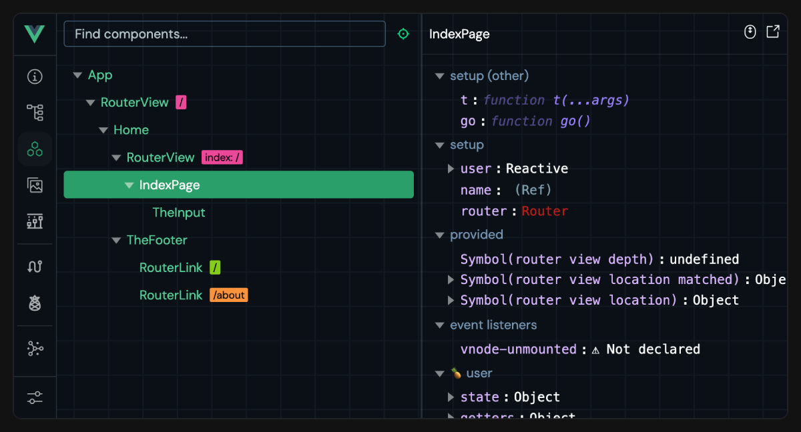
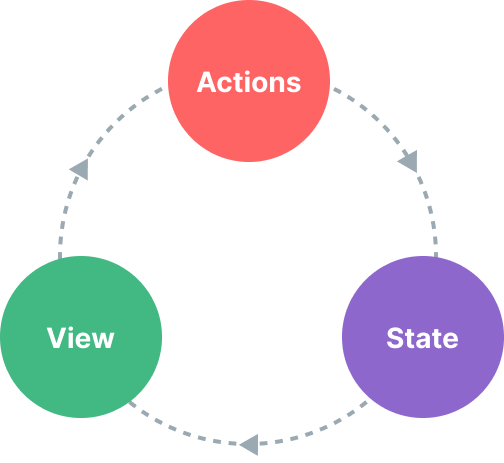
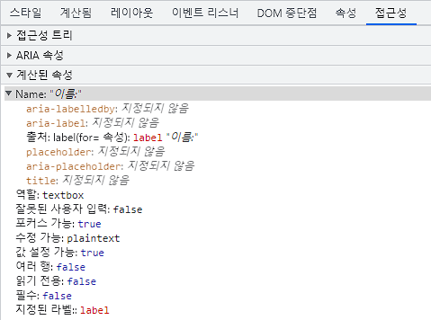
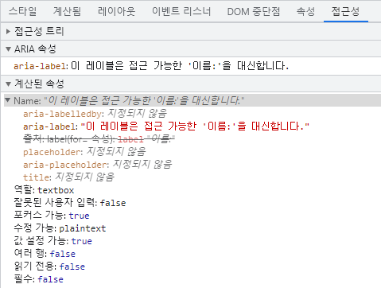
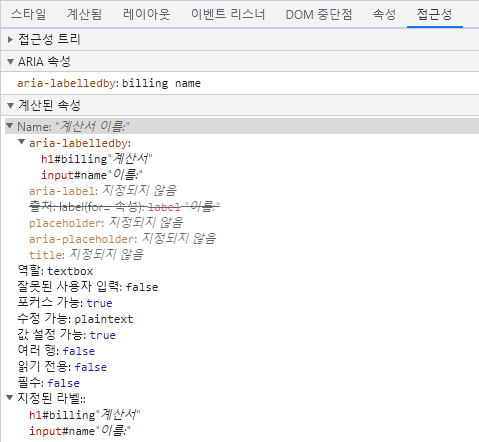
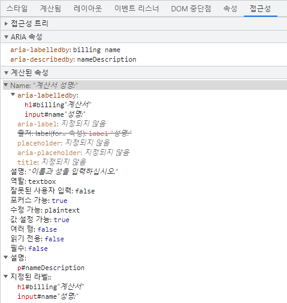
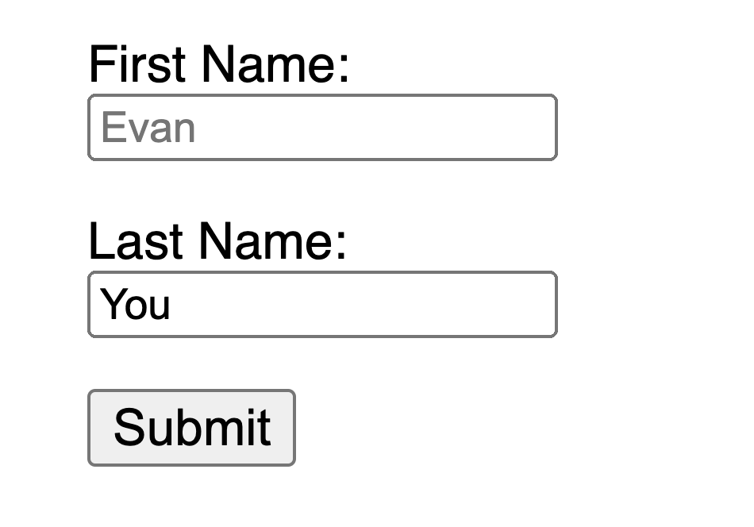

# Vue 3 애플리케이션 확장과 운영

애플리케이션이 커지면 개발 도구, 라우팅, 공유 상태와 테스트를 함께 고려해야 합니다. 서버 렌더링과 TypeScript를 연결하는 방법에 이어 접근성, 성능, 배포와 보안에서 지켜야 할 조건을 다룹니다.

## 목차

- [도구](#guide-scaling-up-tooling)
- [라우팅(routing)](#guide-scaling-up-routing)
- [상태 관리](#guide-scaling-up-state-management)
- [테스트](#guide-scaling-up-testing)
- [서버 사이드 렌더링(SSR)](#guide-scaling-up-ssr)
- [컴포지션 API와 TypeScript](#guide-typescript-composition-api)
- [옵션 API에서 TypeScript 사용하기](#guide-typescript-options-api)
- [Vue와 TypeScript 함께 사용하기](#guide-typescript-overview)
- [접근성](#guide-best-practices-accessibility)
- [성능](#guide-best-practices-performance)
- [프로덕션 배포](#guide-best-practices-production-deployment)
- [보안](#guide-best-practices-security)

---

<a id="guide-scaling-up-tooling"></a>

**문서 데모 설정 코드**

```vue
<script setup>
import { VTCodeGroup, VTCodeGroupTab } from '@vue/theme'
</script>
```


<a id="guide-scaling-up-tooling-tooling"></a>

## 도구

> 원문: https://github.com/vuejs/docs/blob/40aa88af0094f7bab4aaf786e55c748a6a251d88/src/guide/scaling-up/tooling.md
> 한국어 번역 기반: https://github.com/vuejs-translations/docs-ko/blob/6e646acb5687510feda533281faa546b26ea243c/src/guide/scaling-up/tooling.md

<a id="guide-scaling-up-tooling-try-it-online"></a>

### 온라인에서 사용해보기
Vue SFC를 사용해보려면 컴퓨터에 아무것도 설치할 필요가 없습니다. 브라우저에서 바로 사용할 수 있는 온라인 플레이그라운드가 있습니다:

- [Vue SFC Playground](https://play.vuejs.org)
  - 항상 최신 커밋에서 배포됨
  - 컴포넌트(component) 컴파일 결과를 확인하는 데 최적화됨
- [Vue + Vite on StackBlitz](https://vite.new/vue)
  - 실제 Vite 개발 서버가 브라우저에서 실행되는 IDE와 유사한 환경
  - 로컬 환경과 가장 유사함

버그를 신고할 때 재현 예시를 제공하기 위해서도 이러한 온라인 플레이그라운드를 사용하는 것이 좋습니다.

<a id="guide-scaling-up-tooling-project-scaffolding"></a>

### 프로젝트 스캐폴딩(scaffolding)
<a id="guide-scaling-up-tooling-vite"></a>

#### Vite
[Vite](https://vite.dev/)는 Vue SFC를 1급으로 지원하는 가볍고 빠른 빌드 도구입니다. Vue의 저자인 Evan You가 만들었습니다!

Vite + Vue로 시작하려면 다음 명령어를 실행하세요:


```sh [npm]
$ npm create vue@latest
```

```sh [pnpm]
$ pnpm create vue@latest
```
  
```sh [yarn]
# Yarn Modern (v2+)용
$ yarn create vue@latest
  
# Yarn ^v4.11 용
$ yarn dlx create-vue@latest
```
  
```sh [bun]
$ bun create vue@latest
```


이 명령어는 공식 Vue 프로젝트 스캐폴딩 도구인 [create-vue](https://github.com/vuejs/create-vue)를 설치하고 실행합니다.

- Vite에 대해 더 알아보려면 [Vite 문서](https://vite.dev/)를 참고하세요.
- Vite 프로젝트에서 Vue 관련 동작(예: Vue 컴파일러에 옵션 전달 등)을 설정하려면 [@vitejs/plugin-vue](https://github.com/vitejs/vite-plugin-vue/tree/main/packages/plugin-vue#readme) 문서를 참고하세요.

위에서 언급한 온라인 플레이그라운드는 모두 파일을 Vite 프로젝트로 다운로드하는 기능을 지원합니다.

<a id="guide-scaling-up-tooling-vue-cli"></a>

#### Vue CLI
[Vue CLI](https://cli.vuejs.org/)는 Vue를 위한 공식 webpack 기반 도구 체인입니다. 현재는 유지보수 모드에 있으며, webpack 전용 기능이 꼭 필요하지 않다면 새로운 프로젝트는 Vite로 시작하는 것을 권장합니다. 대부분의 경우 Vite가 더 나은 개발 경험을 제공합니다.

Vue CLI에서 Vite로 마이그레이션하는 방법:

- [VueSchool.io의 Vue CLI -> Vite 마이그레이션 가이드](https://vueschool.io/articles/vuejs-tutorials/how-to-migrate-from-vue-cli-to-vite/)
- [자동 마이그레이션을 도와주는 도구/플러그인(plugin)](https://github.com/vitejs/awesome-vite#vue-cli)

<a id="guide-scaling-up-tooling-note-on-in-browser-template-compilation"></a>

#### 브라우저 내 템플릿(template) 컴파일에 대한 참고 사항
빌드 단계를 거치지 않고 Vue를 사용할 때는 컴포넌트 템플릿을 페이지의 HTML에 직접 작성하거나 인라인 JavaScript 문자열로 작성합니다. 이런 경우, Vue는 브라우저에서 즉석으로 템플릿을 컴파일하기 위해 템플릿 컴파일러를 함께 제공해야 합니다. 반면, 빌드 단계에서 미리 템플릿을 컴파일하면 컴파일러가 필요하지 않습니다. 클라이언트 번들 크기를 줄이기 위해 Vue는 각 용도에 맞게 최적화된 [다양한 "빌드"](https://unpkg.com/browse/vue@3/dist/)를 제공합니다.

- `vue.runtime.*`로 시작하는 빌드 파일은 **런타임 전용 빌드**입니다. 컴파일러가 포함되어 있지 않습니다. 이 빌드를 사용할 때는 모든 템플릿이 빌드 단계에서 미리 컴파일되어야 합니다.

- `.runtime`이 포함되지 않은 빌드 파일은 **풀 빌드**입니다. 컴파일러가 포함되어 있어 브라우저에서 직접 템플릿을 컴파일할 수 있습니다. 하지만 페이로드가 약 14kb 증가합니다.

기본 도구 설정에서는 SFC의 모든 템플릿이 미리 컴파일되므로, 런타임 전용 빌드를 사용합니다. 어떤 이유로든 빌드 단계를 거치더라도 브라우저 내 템플릿 컴파일이 필요하다면, 빌드 도구에서 `vue`를 `vue/dist/vue.esm-bundler.js`로 별칭(alias) 설정하면 됩니다.

빌드 단계 없이 더 가벼운 대안을 찾고 있다면 [petite-vue](https://github.com/vuejs/petite-vue)를 참고하세요.

<a id="guide-scaling-up-tooling-ide-support"></a>

### IDE 지원
- 권장 IDE 설정은 [VS Code](https://code.visualstudio.com/) + [Vue - Official 확장](https://marketplace.visualstudio.com/items?itemName=Vue.volar) (이전 명칭: Volar)입니다. 이 확장은 템플릿 표현식 및 컴포넌트 props에 대한 구문 강조, TypeScript 지원, 인텔리센스를 제공합니다.

  **참고**
  Vue - Official은 Vue 2용 공식 VS Code 확장이었던 [Vetur](https://marketplace.visualstudio.com/items?itemName=octref.vetur)를 대체합니다. Vetur가 설치되어 있다면 Vue 3 프로젝트에서는 반드시 비활성화하세요.


- [WebStorm](https://www.jetbrains.com/webstorm/)도 Vue SFC에 대한 훌륭한 내장 지원을 제공합니다.

- [Language Service Protocol](https://microsoft.github.io/language-server-protocol/) (LSP)을 지원하는 다른 IDE들도 LSP를 통해 Volar의 핵심 기능을 활용할 수 있습니다:

  - [LSP-Volar](https://github.com/sublimelsp/LSP-volar)를 통한 Sublime Text 지원.

  - [coc-volar](https://github.com/yaegassy/coc-volar)를 통한 vim / Neovim 지원.

  - [lsp-mode](https://emacs-lsp.github.io/lsp-mode/page/lsp-volar/)를 통한 emacs 지원.

<a id="guide-scaling-up-tooling-browser-devtools"></a>

### 브라우저 개발자 도구
Vue 브라우저 개발자 도구 확장 프로그램을 사용하면 Vue 앱의 컴포넌트 트리를 탐색하고, 개별 컴포넌트의 상태를 검사하며, 상태 관리 이벤트를 추적하고, 성능을 프로파일링할 수 있습니다.



- [문서](https://devtools.vuejs.org/)
- [Chrome 확장 프로그램](https://chromewebstore.google.com/detail/vuejs-devtools/nhdogjmejiglipccpnnnanhbledajbpd)
- [Vite 플러그인](https://devtools.vuejs.org/guide/vite-plugin)
- [독립 실행형 Electron 앱](https://devtools.vuejs.org/guide/standalone)

<a id="guide-scaling-up-tooling-typescript"></a>

### TypeScript
주요 문서: [Vue와 TypeScript 사용하기](05_scaling_typescript_and_best_practices.md#guide-typescript-overview).

- [Vue - Official 확장](https://github.com/vuejs/language-tools)은 `<script lang="ts">` 블록을 사용하는 SFC에 대해 템플릿 표현식과 컴포넌트 간 props 검증을 포함한 타입 검사를 제공합니다.

- [`vue-tsc`](https://github.com/vuejs/language-tools/tree/master/packages/tsc)를 사용하면 커맨드라인에서 동일한 타입 검사를 수행하거나 SFC용 `d.ts` 파일을 생성할 수 있습니다.

<a id="guide-scaling-up-tooling-testing"></a>

### 테스트
주요 문서: [테스트 가이드](05_scaling_typescript_and_best_practices.md#guide-scaling-up-testing).

- [Cypress](https://www.cypress.io/)는 E2E 테스트에 권장됩니다. [Cypress Component Test Runner](https://docs.cypress.io/guides/component-testing/introduction)를 통해 Vue SFC의 컴포넌트 테스트에도 사용할 수 있습니다.

- [Vitest](https://vitest.dev/)는 Vue / Vite 팀원이 만든 테스트 러너로, 속도에 중점을 두고 있습니다. Vite 기반 애플리케이션에서 단위/컴포넌트 테스트에 즉각적인 피드백 루프를 제공합니다.

- [Jest](https://jestjs.io/)는 [vite-jest](https://github.com/sodatea/vite-jest)를 통해 Vite와 함께 사용할 수 있습니다. 하지만 기존 Jest 기반 테스트 스위트를 Vite 기반 환경으로 마이그레이션해야 하는 경우에만 권장합니다. Vitest가 유사한 기능을 훨씬 효율적으로 제공합니다.

<a id="guide-scaling-up-tooling-linting"></a>

### 린팅
Vue 팀은 SFC 전용 린팅 규칙을 지원하는 [ESLint](https://eslint.org/) 플러그인인 [eslint-plugin-vue](https://github.com/vuejs/eslint-plugin-vue)를 유지 관리하고 있습니다.

이전에 Vue CLI를 사용했던 사용자는 webpack 로더를 통해 린터가 설정되는 것에 익숙할 수 있습니다. 하지만 Vite 기반 빌드 환경에서는 다음을 권장합니다:

1. `npm install -D eslint eslint-plugin-vue`를 실행한 후, `eslint-plugin-vue`의 [설정 가이드](https://eslint.vuejs.org/user-guide/#usage)를 따르세요.

2. [VS Code용 ESLint](https://marketplace.visualstudio.com/items?itemName=dbaeumer.vscode-eslint)와 같은 ESLint IDE 확장 프로그램을 설정하여 개발 중 에디터에서 바로 린터 피드백을 받을 수 있습니다. 이렇게 하면 개발 서버를 시작할 때 불필요한 린팅 비용도 줄일 수 있습니다.

3. 프로덕션 빌드 명령의 일부로 ESLint를 실행하여, 배포 전에 전체 린터 피드백을 받을 수 있습니다.

4. (선택 사항) [lint-staged](https://github.com/okonet/lint-staged)와 같은 도구를 설정하여 git 커밋 시 수정된 파일을 자동으로 린트할 수 있습니다.

<a id="guide-scaling-up-tooling-formatting"></a>

### 포매팅
- [Vue - Official](https://github.com/vuejs/language-tools) VS Code 확장은 Vue SFC에 대한 포매팅을 기본적으로 제공합니다.

- [Prettier](https://prettier.io/)도 Vue SFC 포매팅을 기본 지원합니다.

<a id="guide-scaling-up-tooling-sfc-custom-block-integrations"></a>

### SFC 커스텀 블록 통합
커스텀 블록은 동일한 Vue 파일에 서로 다른 요청 쿼리로 import되는 형태로 컴파일됩니다. 이러한 import 요청을 처리하는 것은 하위 빌드 도구의 몫입니다.

- Vite를 사용하는 경우, 매칭되는 커스텀 블록을 실행 가능한 JavaScript로 변환하는 커스텀 Vite 플러그인이 필요합니다. [예시](https://github.com/vitejs/vite-plugin-vue/tree/main/packages/plugin-vue#example-for-transforming-custom-blocks)

- Vue CLI 또는 일반 webpack을 사용하는 경우, 매칭되는 블록을 변환하도록 webpack 로더를 설정해야 합니다. [예시](https://vue-loader.vuejs.org/guide/custom-blocks.html)

<a id="guide-scaling-up-tooling-lower-level-packages"></a>

### 하위 레벨 패키지
<a id="guide-scaling-up-tooling-vue-compiler-sfc"></a>

#### `@vue/compiler-sfc`
- [문서](https://github.com/vuejs/core/tree/main/packages/compiler-sfc)

이 패키지는 Vue 코어 모노레포의 일부이며, 항상 메인 `vue` 패키지와 동일한 버전으로 배포됩니다. 메인 `vue` 패키지의 의존성으로 포함되어 있으며, `vue/compiler-sfc`로 프록시(proxy)되어 별도로 설치할 필요가 없습니다.

Vue SFC를 처리하기 위한 하위 레벨 유틸리티를 제공하며, 커스텀 도구에서 Vue SFC를 지원해야 하는 도구 제작자를 위한 것입니다.

**참고**
항상 `vue/compiler-sfc` 딥 임포트를 통해 이 패키지를 사용하는 것이 좋습니다. 이렇게 하면 Vue 런타임과 버전이 동기화됩니다.


<a id="guide-scaling-up-tooling-vitejs-plugin-vue"></a>

#### `@vitejs/plugin-vue`
- [문서](https://github.com/vitejs/vite-plugin-vue/tree/main/packages/plugin-vue)

Vite에서 Vue SFC 지원을 제공하는 공식 플러그인입니다.

<a id="guide-scaling-up-tooling-vue-loader"></a>

#### `vue-loader`
- [문서](https://vue-loader.vuejs.org/)

webpack에서 Vue SFC 지원을 제공하는 공식 로더입니다. Vue CLI를 사용하는 경우 [Vue CLI에서 `vue-loader` 옵션 수정 문서](https://cli.vuejs.org/guide/webpack.html#modifying-options-of-a-loader)도 참고하세요.

<a id="guide-scaling-up-tooling-other-online-playgrounds"></a>

### 기타 온라인 플레이그라운드
- [VueUse Playground](https://play.vueuse.org)
- [Vue + Vite on Repl.it](https://replit.com/@templates/VueJS-with-Vite)
- [Vue on CodeSandbox](https://codesandbox.io/p/devbox/github/codesandbox/sandbox-templates/tree/main/vue-vite)
- [Vue on Codepen](https://codepen.io/pen/editor/vue)
- [Vue on WebComponents.dev](https://webcomponents.dev/create/cevue)

<a id="guide-scaling-up-tooling-backend-framework-integrations"></a>

### 백엔드 프레임워크 통합
Vue를 [Laravel](https://laravel.com/)과 함께 사용한다면, Laravel이 공식 [Vite 플러그인](https://laravel.com/docs/vite)을 제공하므로 에셋 번들링(bundling)과 핫 모듈 교체(HMR)를 별도 설정 없이 바로 사용할 수 있습니다.

다른 백엔드를 사용한다면, Vite의 [백엔드 통합 가이드](https://vite.dev/guide/backend-integration.html)를 참고하여 직접 연동을 설정하세요.

---

<a id="guide-scaling-up-routing"></a>

<a id="guide-scaling-up-routing-routing"></a>

## 라우팅(routing)

> 원문: https://github.com/vuejs/docs/blob/40aa88af0094f7bab4aaf786e55c748a6a251d88/src/guide/scaling-up/routing.md
> 한국어 번역 기반: https://github.com/vuejs-translations/docs-ko/blob/6e646acb5687510feda533281faa546b26ea243c/src/guide/scaling-up/routing.md

<a id="guide-scaling-up-routing-client-side-vs-server-side-routing"></a>

### 클라이언트 사이드 vs. 서버 사이드 라우팅
서버 사이드 라우팅이란 사용자가 방문하는 URL 경로에 따라 서버가 응답을 보내는 것을 의미합니다. 전통적인 서버 렌더링 웹 앱에서 링크를 클릭하면, 브라우저는 서버로부터 HTML 응답을 받아 전체 페이지를 새로운 HTML로 다시 로드합니다.

하지만 [싱글 페이지 애플리케이션](https://developer.mozilla.org/ko/docs/Glossary/SPA) (SPA)에서는 클라이언트 사이드 JavaScript가 내비게이션을 가로채고, 동적으로 새로운 데이터를 가져와 전체 페이지를 새로 고침하지 않고 현재 페이지를 업데이트할 수 있습니다. 특히 사용자가 오랜 시간 동안 여러 상호작용을 수행하는 실제 "애플리케이션" 같은 사용 사례에서는, 이 방식이 더욱 빠른 사용자 경험을 제공합니다.

이러한 SPA에서 "라우팅"은 브라우저, 즉 클라이언트 사이드에서 이루어집니다. 클라이언트 사이드 라우터(router)는 [History API](https://developer.mozilla.org/ko/docs/Web/API/History)나 [`hashchange` 이벤트](https://developer.mozilla.org/ko/docs/Web/API/Window/hashchange_event)와 같은 브라우저 API를 사용하여 애플리케이션의 렌더링(rendering)된 뷰를 관리하는 역할을 합니다.

<a id="guide-scaling-up-routing-official-router"></a>

### 공식 라우터
<!-- TODO update links -->

[Vue School에서 무료 비디오 강좌 시청하기](https://vueschool.io/courses/vue-router-4-for-everyone)


Vue는 SPA를 구축하는 데 매우 적합합니다. 대부분의 SPA에서는 공식적으로 지원되는 [Vue Router 라이브러리](https://github.com/vuejs/router)를 사용하는 것이 권장됩니다. 자세한 내용은 Vue Router의 [문서](https://router.vuejs.org/)를 참고하세요.

<a id="guide-scaling-up-routing-simple-routing-from-scratch"></a>

### 간단한 라우팅 직접 구현하기
아주 간단한 라우팅만 필요하고 기능이 풍부한 라우터 라이브러리를 도입하고 싶지 않다면, [동적 컴포넌트(component)](02_essentials.md#guide-essentials-component-basics-dynamic-components)로 직접 구현할 수 있습니다. 브라우저의 [`hashchange` 이벤트](https://developer.mozilla.org/ko/docs/Web/API/Window/hashchange_event)를 감지하거나 [History API](https://developer.mozilla.org/ko/docs/Web/API/History)를 이용해 현재 컴포넌트 상태를 업데이트하는 방식입니다.

다음은 최소한의 예시입니다:


**컴포지션 API**


```vue
<script setup>
import { ref, computed } from 'vue'
import Home from './Home.vue'
import About from './About.vue'
import NotFound from './NotFound.vue'

const routes = {
  '/': Home,
  '/about': About
}

const currentPath = ref(window.location.hash)

window.addEventListener('hashchange', () => {
  currentPath.value = window.location.hash
})

const currentView = computed(() => {
  return routes[currentPath.value.slice(1) || '/'] || NotFound
})
</script>

<template>
  <a href="#/">Home</a> |
  <a href="#/about">About</a> |
  <a href="#/non-existent-path">Broken Link</a>
  <component :is="currentView" />
</template>
```

[Playground에서 실행해보기](https://play.vuejs.org/#eNptUk1vgkAQ/SsTegAThZp4MmhikzY9mKanXkoPWxjLRpgly6JN1P/eWb5Eywlm572ZN2/m5GyKwj9U6CydsIy1LAyUaKpiHZHMC6UNnEDjbgqxyovKYAIX2GmVg8sktwe9qhzbdz+wga15TW++VWX6fB3dAt6UeVEVJT2me2hhEcWKSgOamVjCCk4RAbiBu6xbT5tI2ML8VDeI6HLlxZXWSOZdmJTJPJB3lJSoo5+pWBipyE9FmU4soU2IJHk+MGUrS4OE2nMtIk4F/aA7BW8Cq3WjYlDbP4isQu4wVp0F1Q1uFH1IPDK+c9cb1NW8B03tyJ//uvhlJmP05hM4n60TX/bb2db0CoNmpbxMDgzmRSYMcgQQCkjZhlXkPASRs7YmhoFYw/k+WXvKiNrTcQgpmuFv7ZOZFSyQ4U9a7ZFgK2lvSTXFDqmIQbCUJTMHFkQOBAwKg16kM3W6O7K3eSs+nbeK+eee1V/XKK0dY4Q3vLhR6uJxMUK8/AFKaB6k)


**옵션 API**


```vue
<script>
import Home from './Home.vue'
import About from './About.vue'
import NotFound from './NotFound.vue'

const routes = {
  '/': Home,
  '/about': About
}

export default {
  data() {
    return {
      currentPath: window.location.hash
    }
  },
  computed: {
    currentView() {
      return routes[this.currentPath.slice(1) || '/'] || NotFound
    }
  },
  mounted() {
    window.addEventListener('hashchange', () => {
		  this.currentPath = window.location.hash
		})
  }
}
</script>

<template>
  <a href="#/">Home</a> |
  <a href="#/about">About</a> |
  <a href="#/non-existent-path">Broken Link</a>
  <component :is="currentView" />
</template>
```

[Playground에서 실행해보기](https://play.vuejs.org/#eNptUstO6zAQ/ZVR7iKtVJKLxCpKK3Gli1ggxIoNZmGSKbFoxpEzoUi0/87YeVBKNonHPmfOmcdndN00yXuHURblbeFMwxtFpm6sY7i1NcLW2RriJPWBB8bT8/WL7Xh6D9FPwL3lG9tROWHGiwGmqLDUMjhhYgtr+FQEEKdxFqRXfaR9YrkKAoqOnocfQaDEre523PNKzXqx7M8ADrlzNEYAReccEj9orjLYGyrtPtnZQrOxlFS6rXqgZJdPUC5s3YivMhuTDCkeDe6/dSalvognrkybnIgl7c4UuLhcwuHgS3v2/7EPvzRruRXJ7/SDU12W/98l451pGQndIvaWi0rTK8YrEPx64ymKFQOce5DOzlfs4cdlkA+NzdNpBSRgrJudZpQIINdQOdyuVfQnVdHGzydP9QYO549hXIII45qHkKUL/Ail8EUjBgX+z9k3JLgz9OZJgeInYElAkJlWmCcDUBGkAsrTyWS0isYV9bv803x1OTiWwzlrWtxZ2lDGDO90mWepV3+vZojHL3QQKQE=)

---

<a id="guide-scaling-up-state-management"></a>

<a id="guide-scaling-up-state-management-state-management"></a>

## 상태 관리

> 원문: https://github.com/vuejs/docs/blob/40aa88af0094f7bab4aaf786e55c748a6a251d88/src/guide/scaling-up/state-management.md
> 한국어 번역 기반: https://github.com/vuejs-translations/docs-ko/blob/6e646acb5687510feda533281faa546b26ea243c/src/guide/scaling-up/state-management.md

<a id="guide-scaling-up-state-management-what-is-state-management"></a>

### 상태 관리란?
기술적으로, 모든 Vue 컴포넌트(component) 인스턴스(instance)는 이미 자신의 반응형 상태를 "관리"하고 있습니다. 간단한 카운터 컴포넌트를 예로 들어보겠습니다:


**컴포지션 API**


```vue
<script setup>
import { ref } from 'vue'

// 상태
const count = ref(0)

// 액션
function increment() {
  count.value++
}
</script>

<!-- 뷰 -->
<template>{{ count }}</template>
```


**옵션 API**


```vue
<script>
export default {
  // 상태
  data() {
    return {
      count: 0
    }
  },
  // 액션
  methods: {
    increment() {
      this.count++
    }
  }
}
</script>

<!-- 뷰 -->
<template>{{ count }}</template>
```


이 카운터에서 `count`는 상태이고, 템플릿은 그 상태를 화면에 표시하는 뷰입니다. `increment`는 상태를 변경하는 액션입니다. 액션이 상태를 바꾸면 뷰가 새 값을 표시하는 이 흐름을 "단방향 데이터 흐름"이라고 합니다.

<p style="text-align: center">
  

하지만, **공통 상태를 공유하는 여러 컴포넌트**가 있을 때 이 단순함은 무너지기 시작합니다:

1. 여러 뷰가 동일한 상태 조각에 의존할 수 있습니다.
2. 서로 다른 뷰의 액션이 동일한 상태 조각을 변경해야 할 수 있습니다.

첫 번째 경우, 가능한 해결책은 공유 상태를 공통 조상 컴포넌트로 "끌어올리고", 그 후 props로 하위 컴포넌트에 전달하는 것입니다. 하지만, 이는 계층 구조가 깊은 컴포넌트 트리에서는 금방 번거로워지며, [Prop Drilling](03_components_and_reusability.md#guide-components-provide-inject-prop-drilling)이라는 또 다른 문제로 이어집니다.

두 번째 경우, 종종 템플릿(template) ref로 부모/자식 인스턴스에 직접 접근하거나, 이벤트를 통해 여러 상태 복사본을 변경하고 동기화하려는 해결책에 의존하게 됩니다. 이 두 패턴 모두 취약하며 금방 유지보수하기 어려운 코드로 이어집니다.

공유 상태를 컴포넌트에서 분리해 전역 싱글턴에서 관리하면 이런 동기화 문제를 줄일 수 있습니다. 컴포넌트 트리는 같은 상태를 표시하는 하나의 뷰가 되고, 각 컴포넌트는 트리의 위치와 관계없이 상태에 접근하거나 액션을 호출합니다.

<a id="guide-scaling-up-state-management-simple-state-management-with-reactivity-api"></a>

### 반응성 API를 이용한 간단한 상태 관리

**옵션 API**


옵션 API에서는 반응형 데이터를 `data()` 옵션을 사용해 선언합니다. 내부적으로, `data()`가 반환하는 객체는 [`reactive()`](07_composition_and_reactivity_apis.md#api-reactivity-core-reactive) 함수를 통해 반응형으로 만들어지며, 이 함수는 공개 API로도 제공됩니다.


여러 인스턴스에서 공유되어야 하는 상태가 있다면, [`reactive()`](07_composition_and_reactivity_apis.md#api-reactivity-core-reactive)를 사용해 반응형 객체를 만들고, 이를 여러 컴포넌트에 import할 수 있습니다:

```js [store.js]
import { reactive } from 'vue'

export const store = reactive({
  count: 0
})
```


**컴포지션 API**


```vue [ComponentA.vue]
<script setup>
import { store } from './store.js'
</script>

<template>From A: {{ store.count }}</template>
```

```vue [ComponentB.vue]
<script setup>
import { store } from './store.js'
</script>

<template>From B: {{ store.count }}</template>
```


**옵션 API**


```vue [ComponentA.vue]
<script>
import { store } from './store.js'

export default {
  data() {
    return {
      store
    }
  }
}
</script>

<template>From A: {{ store.count }}</template>
```

```vue [ComponentB.vue]
<script>
import { store } from './store.js'

export default {
  data() {
    return {
      store
    }
  }
}
</script>

<template>From B: {{ store.count }}</template>
```


이제 `store` 객체를 변경하면 `<ComponentA>`와 `<ComponentB>`의 뷰가 함께 갱신됩니다. 두 컴포넌트가 같은 상태를 기준으로 화면을 그리게 된 것입니다.

하지만 이는 `store`를 import하는 어떤 컴포넌트든 원하는 대로 상태를 변경할 수 있다는 의미이기도 합니다:

```vue-html{2}
<template>
  <button @click="store.count++">
    From B: {{ store.count }}
  </button>
</template>
```

이 방식이 간단한 경우에는 동작하지만, 모든 컴포넌트가 전역 상태를 임의로 변경할 수 있다면 장기적으로 유지보수가 어려워집니다. 상태 변경 로직도 상태 자체처럼 중앙 집중화하려면, store에 액션의 의도를 표현하는 이름의 메서드를 정의하는 것이 좋습니다:

```js{5-7} [store.js]
import { reactive } from 'vue'

export const store = reactive({
  count: 0,
  increment() {
    this.count++
  }
})
```

```vue-html{2}
<template>
  <button @click="store.increment()">
    From B: {{ store.count }}
  </button>
</template>
```


**컴포지션 API**


[Playground에서 실행해보기](https://play.vuejs.org/#eNrNkk1uwyAQha8yYpNEiUzXllPVrtRTeJNSqtLGgGBsVbK4ewdwnT9FWWSTFczwmPc+xMhqa4uhl6xklRdOWQQvsbfPrVadNQ7h1dCqpcYaPp3pYFHwQyteXVxKm0tpM0krnm3IgAqUnd3vUFIFUB1Z8bNOkzoVny+wDTuNcZ1gBI/GSQhzqlQX3/5Gng81pA1t33tEo+FF7JX42bYsT1BaONlRguWqZZMU4C261CWMk3EhTK8RQphm8Twse/BscoUsvdqDkTX3kP3nI6aZwcmdQDUcMPJPabX8TQphtCf0RLqd1csxuqQAJTxtYnEUGtIpAH4pn1Ou17FDScOKhT+QNAVM)


**옵션 API**


[Playground에서 실행해보기](https://play.vuejs.org/#eNrdU8FqhDAU/JVHLruyi+lZ3FIt9Cu82JilaTWR5CkF8d8bE5O1u1so9FYQzAyTvJnRTKTo+3QcOMlIbpgWPT5WUnS90gjPyr4ll1jAWasOdim9UMum3a20vJWWqxSgkvzTyRt+rocWYVpYFoQm8wRsJh+viHLBcyXtk9No2ALkXd/WyC0CyDfW6RVTOiancQM5ku+x7nUxgUGlOcwxn8Ppu7HJ7udqaqz3SYikOQ5aBgT+OA9slt9kasToFnb5OiAqCU+sFezjVBHvRUimeWdT7JOKrFKAl8VvYatdI6RMDRJhdlPtWdQf5mdQP+SHdtyX/IftlH9pJyS1vcQ2NK8ZivFSiL8BsQmmpMG1s1NU79frYA1k8OD+/I3pUA6+CeNdHg6hmoTMX9pPSnk=)


**참고**
클릭 핸들러에서 `store.increment()`와 같이 괄호를 사용하는 것에 주의하세요. 이 메서드는 컴포넌트 메서드가 아니기 때문에, 올바른 `this` 컨텍스트로 호출하려면 괄호가 필요합니다.


여기서는 하나의 반응형 객체를 store로 사용하고 있지만, `ref()`나 `computed()` 등 다른 [반응성(reactivity) API](07_composition_and_reactivity_apis.md#api-reactivity-core)로 생성한 반응형 상태를 공유하거나, [Composable](03_components_and_reusability.md#guide-reusability-composables)에서 전역 상태를 반환할 수도 있습니다:

```js
import { ref } from 'vue'

// 전역 상태, 모듈 스코프에서 생성
const globalCount = ref(1)

export function useCount() {
  // 로컬 상태, 컴포넌트별로 생성
  const localCount = ref(1)

  return {
    globalCount,
    localCount
  }
}
```

Vue의 반응성 시스템은 컴포넌트 모델과 분리되어 있기 때문에, 매우 유연하게 활용할 수 있습니다.

<a id="guide-scaling-up-state-management-ssr-considerations"></a>

### SSR 고려사항
[서버 사이드 렌더링(SSR)](05_scaling_typescript_and_best_practices.md#guide-scaling-up-ssr)을 활용하는 애플리케이션을 구축하는 경우, 위 패턴은 store가 여러 요청에 걸쳐 공유되는 싱글턴이기 때문에 문제가 발생할 수 있습니다. 이에 대한 자세한 내용은 SSR 가이드의 [요청 간 상태 오염](05_scaling_typescript_and_best_practices.md#guide-scaling-up-ssr-cross-request-state-pollution)에서 다루고 있습니다.

<a id="guide-scaling-up-state-management-pinia"></a>

### Pinia
직접 만든 상태 관리 솔루션이 간단한 시나리오에서는 충분하지만, 대규모 프로덕션 애플리케이션에서는 더 많은 사항을 고려해야 합니다:

- 팀 협업을 위한 더 강력한 컨벤션
- Vue DevTools와의 통합(타임라인, 컴포넌트 내 검사, 타임 트래블 디버깅 등)
- 핫 모듈 교체
- 서버 사이드 렌더링 지원

[Pinia](https://pinia.vuejs.org)는 위의 모든 기능을 구현한 상태 관리 라이브러리입니다. Vue 핵심 팀에서 관리하며, Vue 2와 Vue 3 모두에서 동작합니다.

기존 사용자라면 Vue의 이전 공식 상태 관리 라이브러리인 [Vuex](https://vuex.vuejs.org/)에 익숙할 수 있습니다. Pinia가 생태계에서 같은 역할을 하게 되면서, Vuex는 이제 유지보수 모드에 들어갔습니다. 여전히 동작하지만, 더 이상 새로운 기능이 추가되지 않습니다. 새로운 애플리케이션에는 Pinia 사용을 권장합니다.

Pinia는 Vuex의 다음 버전이 어떤 모습일지 탐구하는 과정에서 시작되었으며, Vuex 5를 위한 핵심 팀 논의에서 나온 많은 아이디어를 통합했습니다. 결국, Vuex 5에서 원했던 것 대부분을 Pinia가 이미 구현하고 있다는 사실을 깨닫고, Pinia를 새로운 공식 권장 사항으로 삼기로 결정했습니다.

Vuex와 비교했을 때, Pinia는 API가 더 간단하고 형식적인 절차가 적으며, 컴포지션 API 스타일의 API를 제공합니다. 그리고 가장 중요하게는, TypeScript 사용 시 강력한 타입 추론을 지원합니다.

---

<a id="guide-scaling-up-testing"></a>

**문서 데모 설정 코드**

```vue
<script setup>
import { VTCodeGroup, VTCodeGroupTab } from '@vue/theme'
</script>
```


```vue
<style>
.lambdatest {
  background-color: var(--vt-c-bg-soft);
  border-radius: 8px;
  padding: 12px 16px 12px 12px;
  font-size: 13px;
  a {
    display: flex;
    color: var(--vt-c-text-2);
  }
  img {
    background-color: #fff;
    padding: 12px 16px;
    border-radius: 6px;
    margin-right: 24px;
  }
  .testing-partner {
    color: var(--vt-c-text-1);
    font-size: 15px;
    font-weight: 600;
  }
}
</style>
```


<a id="guide-scaling-up-testing-testing"></a>

## 테스트

> 원문: https://github.com/vuejs/docs/blob/40aa88af0094f7bab4aaf786e55c748a6a251d88/src/guide/scaling-up/testing.md
> 한국어 번역 기반: https://github.com/vuejs-translations/docs-ko/blob/6e646acb5687510feda533281faa546b26ea243c/src/guide/scaling-up/testing.md

<a id="guide-scaling-up-testing-why-test"></a>

### 왜 테스트를 해야 하나요?
자동화된 테스트는 변경 후에 기존 기능이 깨지는 회귀를 방지하고, 코드를 테스트 가능한 함수, 모듈, 클래스, 컴포넌트(component)로 나누도록 유도합니다. 덕분에 팀은 복잡한 Vue 애플리케이션도 더 빠르고 자신 있게 개발할 수 있습니다. 새 Vue 앱에서도 여러 문제가 생길 수 있으므로 출시 전에 발견하고 수정하는 과정이 중요합니다.

이 가이드에서는 기본 용어를 다루고, Vue 3 애플리케이션에 사용할 도구에 대한 권장 사항을 제공합니다.

이 가이드에는 컴포저블(composable)을 다루는 Vue 특화 섹션도 있습니다. 자세한 내용은 아래 [컴포저블 테스트하기](05_scaling_typescript_and_best_practices.md#guide-scaling-up-testing-testing-composables)를 참고하세요.

<a id="guide-scaling-up-testing-when-to-test"></a>

### 언제 테스트해야 하나요?
테스트는 일찍 시작하세요! 가능한 한 빨리 테스트를 작성하기를 권장합니다. 애플리케이션에 테스트 추가를 미루면 미룰수록 의존성이 많아지고, 시작하기가 더 어려워집니다.

<a id="guide-scaling-up-testing-testing-types"></a>

### 테스트 유형
Vue 애플리케이션의 테스트 전략을 설계할 때, 다음과 같은 테스트 유형을 활용해야 합니다:

- **단위(Unit)**: 주어진 함수, 클래스, 또는 컴포저블에 대한 입력이 예상한 출력이나 부수 효과를 내는지 확인합니다.
- **컴포넌트(Component)**: 컴포넌트가 마운트(mount)되고, 렌더링(rendering)되며, 상호작용이 가능하고, 기대한 대로 동작하는지 확인합니다. 이 테스트는 단위 테스트보다 더 많은 코드를 가져오고, 더 복잡하며, 실행 시간이 더 오래 걸립니다.
- **엔드 투 엔드(End-to-end)**: 여러 페이지에 걸친 기능을 확인하고, 프로덕션 빌드된 Vue 애플리케이션에 대해 실제 네트워크 요청을 수행합니다. 이 테스트는 종종 데이터베이스나 기타 백엔드를 준비해야 합니다.

각 테스트 유형은 애플리케이션의 테스트 전략에서 역할을 하며, 각각 다른 유형의 문제로부터 여러분을 보호합니다.

<a id="guide-scaling-up-testing-overview"></a>

### 개요
각 테스트 유형이 무엇인지, Vue 애플리케이션에서 어떻게 구현할 수 있는지 간단히 설명하고, 일반적인 권장 사항을 제공합니다.

<a id="guide-scaling-up-testing-unit-testing"></a>

### 단위 테스트
단위 테스트는 작고 독립적인 코드 단위가 예상대로 동작하는지 확인하기 위해 작성됩니다. 보통 하나의 함수, 클래스, 컴포저블, 또는 모듈을 다룹니다. 논리적 정확성에 집중하며, 애플리케이션 전체 기능 중 일부만을 대상으로 합니다. 애플리케이션 환경의 많은 부분(예: 초기 상태, 복잡한 클래스, 서드파티 모듈, 네트워크 요청 등)을 모킹할 수 있습니다.

일반적으로, 단위 테스트는 함수의 비즈니스 로직과 논리적 정확성에 관한 문제를 잡아냅니다.

예를 들어, 다음과 같은 `increment` 함수가 있습니다:

```js [helpers.js]
export function increment(current, max = 10) {
  if (current < max) {
    return current + 1
  }
  return current
}
```

`increment`의 결과는 인자만으로 결정되므로 UI나 네트워크를 준비할 필요가 없습니다. 아래 테스트는 값이 증가하는 경우, 최대값에 도달한 경우, 기본 최대값을 사용하는 경우를 각각 확인합니다. 검증이 실패하면 `increment` 내부로 원인을 좁힐 수 있습니다.

```js{3-15} [helpers.spec.js]
import { increment } from './helpers'

describe('increment', () => {
  test('현재 숫자를 1 증가시킨다', () => {
    expect(increment(0, 10)).toBe(1)
  })

  test('최대값을 넘어서 현재 숫자를 증가시키지 않는다', () => {
    expect(increment(10, 10)).toBe(10)
  })

  test('기본 최대값이 10이다', () => {
    expect(increment(10)).toBe(10)
  })
})
```

앞서 언급했듯이, 단위 테스트는 일반적으로 UI 렌더링, 네트워크 요청, 기타 환경적 요소와 관련 없는 독립적인 비즈니스 로직, 컴포넌트, 클래스, 모듈, 함수에 적용됩니다.

이들은 일반적으로 Vue와 관련 없는 순수 JavaScript / TypeScript 모듈입니다. Vue 애플리케이션에서 비즈니스 로직에 대한 단위 테스트를 작성하는 것은 다른 프레임워크를 사용하는 애플리케이션과 크게 다르지 않습니다.

Vue에 특화된 기능을 단위 테스트해야 하는 경우는 두 가지가 있습니다:

1. 컴포저블
2. 컴포넌트

<a id="guide-scaling-up-testing-composables"></a>

#### 컴포저블
Vue 애플리케이션에 특화된 함수의 한 범주는 [컴포저블](03_components_and_reusability.md#guide-reusability-composables)로, 테스트 시 특별한 처리가 필요할 수 있습니다.
자세한 내용은 아래 [컴포저블 테스트하기](05_scaling_typescript_and_best_practices.md#guide-scaling-up-testing-testing-composables)를 참고하세요.

<a id="guide-scaling-up-testing-unit-testing-components"></a>

#### 컴포넌트 단위 테스트
컴포넌트는 두 가지 방식으로 테스트할 수 있습니다:

1. 화이트박스: 단위 테스트

   "화이트박스 테스트"는 컴포넌트의 구현 세부사항과 의존성을 알고 있습니다. 이 테스트는 **테스트 대상 컴포넌트의 격리**에 집중합니다. 보통 컴포넌트의 자식 중 일부 또는 전부를 모킹하고, 플러그인(plugin) 상태와 의존성(예: Pinia)을 설정합니다.

2. 블랙박스: 컴포넌트 테스트

   "블랙박스 테스트"는 컴포넌트의 구현 세부사항을 알지 못합니다. 이 테스트는 컴포넌트와 전체 시스템의 통합을 검증하기 위해 가능한 한 적게 모킹합니다. 보통 모든 자식 컴포넌트를 렌더링하며, "통합 테스트"에 더 가깝다고 볼 수 있습니다. 아래 [컴포넌트 테스트 권장 사항](05_scaling_typescript_and_best_practices.md#guide-scaling-up-testing-component-testing)을 참고하세요.

<a id="guide-scaling-up-testing-recommendation"></a>

#### 권장 사항
- [Vitest](https://vitest.dev/)

  공식적으로 `create-vue`로 생성된 프로젝트는 [Vite](https://vite.dev/)를 기반으로 하므로, 동일한 설정과 변환 파이프라인을 직접 활용할 수 있는 단위 테스트 프레임워크를 사용하는 것이 좋습니다. [Vitest](https://vitest.dev/)는 바로 이 목적을 위해 Vue / Vite 팀 멤버들이 만든 단위 테스트 프레임워크입니다. Vite 기반 프로젝트에 최소한의 노력으로 통합할 수 있으며, 매우 빠릅니다.

<a id="guide-scaling-up-testing-other-options"></a>

#### 기타 옵션
- [Jest](https://jestjs.io/)는 인기 있는 단위 테스트 프레임워크입니다. 하지만 기존 Jest 테스트 스위트를 Vite 기반 프로젝트로 마이그레이션해야 하는 경우에만 Jest를 추천합니다. Vitest가 더 원활한 통합과 더 나은 성능을 제공합니다.

<a id="guide-scaling-up-testing-component-testing"></a>

### 컴포넌트 테스트
Vue 애플리케이션에서 컴포넌트는 UI의 주요 빌딩 블록입니다. 따라서 애플리케이션의 동작을 검증할 때 컴포넌트는 자연스러운 격리 단위가 됩니다. 세분화 관점에서 컴포넌트 테스트는 단위 테스트보다 상위에 위치하며, 일종의 통합 테스트로 볼 수 있습니다. Vue 애플리케이션의 많은 부분이 컴포넌트 테스트로 커버되어야 하며, 각 Vue 컴포넌트마다 자체적인 spec 파일을 두는 것을 권장합니다.

컴포넌트 테스트는 컴포넌트의 props, 이벤트, 제공하는 슬롯(slot), 스타일, 클래스, 라이프사이클(lifecycle) 훅(hook) 등과 관련된 문제를 잡아내야 합니다.

컴포넌트 테스트는 자식 컴포넌트를 모킹하지 않고, 사용자가 컴포넌트와 상호작용하듯이 컴포넌트와 자식 간의 상호작용을 테스트해야 합니다. 예를 들어, 사용자가 클릭하듯이 요소를 클릭해야 하며, 프로그램적으로 컴포넌트와 상호작용해서는 안 됩니다.

컴포넌트 테스트는 내부 구현 세부사항보다는 컴포넌트의 공개 인터페이스에 집중해야 합니다. 대부분의 컴포넌트에서 공개 인터페이스는 이벤트 발생, props, 슬롯에 한정됩니다. **컴포넌트가 어떻게 동작하는지가 아니라, 무엇을 하는지 테스트**해야 함을 기억하세요.

**해야 할 것**

- **시각적(Visual)** 로직: 입력된 props와 슬롯에 따라 올바른 렌더링 결과를 검증합니다.
- **행동(Behavioral)** 로직: 사용자 입력 이벤트에 대한 올바른 렌더링 업데이트나 이벤트 발생을 검증합니다.

  아래 예제는 클릭할 수 있는 "increment" DOM 요소가 있는 Stepper 컴포넌트를 보여줍니다. `max`라는 prop을 전달하여 Stepper가 `2`를 넘어서 증가하지 못하게 하므로, 버튼을 3번 클릭해도 UI에는 여전히 `2`가 표시되어야 합니다.

  Stepper의 구현에 대해서는 아무것도 알지 못합니다. 다만 "입력"은 `max` prop이고, "출력"은 사용자가 보게 될 DOM의 상태라는 것만 알 뿐입니다.


```js [Vue Test Utils]
const valueSelector = '[data-testid=stepper-value]'
const buttonSelector = '[data-testid=increment]'

const wrapper = mount(Stepper, {
  props: {
    max: 1
  }
})

expect(wrapper.find(valueSelector).text()).toContain('0')

await wrapper.find(buttonSelector).trigger('click')

expect(wrapper.find(valueSelector).text()).toContain('1')
```

```js [Cypress]
const valueSelector = '[data-testid=stepper-value]'
const buttonSelector = '[data-testid=increment]'

mount(Stepper, {
  props: {
    max: 1
  }
})

cy.get(valueSelector)
  .should('be.visible')
  .and('contain.text', '0')
  .get(buttonSelector)
  .click()
  .get(valueSelector)
  .should('contain.text', '1')
```

```js [Testing Library]
const { getByText } = render(Stepper, {
  props: {
    max: 1
  }
})

getByText('0') // "0"이 컴포넌트 내에 있다는 암시적 검증

const button = getByRole('button', { name: /increment/i })

// 증가 버튼에 클릭 이벤트를 디스패치합니다.
await fireEvent.click(button)

getByText('1')

await fireEvent.click(button)
```


**하지 말아야 할 것**

- 컴포넌트 인스턴스(instance)의 비공개 상태를 검증하거나, 컴포넌트의 비공개 메서드를 테스트하지 마세요. 구현 세부사항을 테스트하면 테스트가 취약해지며, 구현이 변경될 때 더 자주 깨지고 수정이 필요해집니다.

  컴포넌트의 궁극적인 역할은 올바른 DOM 출력을 렌더링하는 것이므로, DOM 출력에 집중한 테스트가 동일한 수준(혹은 그 이상)의 정확성 보장을 제공하면서도 더 견고하고 변화에 강합니다.

  스냅샷 테스트에만 의존하지 마세요. HTML 문자열을 검증하는 것은 정확성을 말해주지 않습니다. 의도를 가지고 테스트를 작성하세요.

  어떤 메서드를 철저히 테스트해야 한다면, 별도의 유틸리티 함수로 추출하여 전용 단위 테스트를 작성하는 것을 고려하세요. 깔끔하게 추출할 수 없다면, 해당 메서드를 포함하는 컴포넌트, 통합, 또는 엔드 투 엔드 테스트의 일부로 테스트할 수 있습니다.

<a id="guide-scaling-up-testing-recommendation-1"></a>

#### 권장 사항
- [Vitest](https://vitest.dev/)는 헤드리스로 렌더링되는 컴포넌트나 컴포저블(예: VueUse의 [`useFavicon`](https://vueuse.org/core/useFavicon/#usefavicon) 함수)에 적합합니다. 컴포넌트와 DOM은 [`@vue/test-utils`](https://github.com/vuejs/test-utils)를 사용해 테스트할 수 있습니다.

- [Cypress Component Testing](https://on.cypress.io/component)은 스타일이 제대로 렌더링되거나 네이티브 DOM 이벤트 트리거에 따라 기대 동작이 달라지는 컴포넌트에 적합합니다. [@testing-library/cypress](https://testing-library.com/docs/cypress-testing-library/intro)를 통해 Testing Library와 함께 사용할 수 있습니다.

Vitest와 브라우저 기반 러너의 주요 차이점은 속도와 실행 컨텍스트입니다. 간단히 말해, Cypress와 같은 브라우저 기반 러너는 Vitest와 같은 Node 기반 러너가 잡지 못하는 문제(예: 스타일 문제, 실제 네이티브 DOM 이벤트, 쿠키, 로컬 스토리지, 네트워크 실패 등)를 잡을 수 있지만, 브라우저를 열고 스타일시트를 컴파일하는 등으로 인해 _Vitest보다 훨씬 느립니다_. Cypress는 컴포넌트 테스트를 지원하는 브라우저 기반 러너입니다. Vitest와 Cypress의 최신 비교 정보는 [Vitest의 비교 페이지](https://vitest.dev/guide/comparisons.html#cypress)를 참고하세요.

<a id="guide-scaling-up-testing-mounting-libraries"></a>

#### 마운트 라이브러리
컴포넌트 테스트는 보통 테스트 대상 컴포넌트를 독립적으로 마운트하고, 사용자 입력 이벤트를 시뮬레이션하며, 렌더링된 DOM 출력을 검증하는 과정을 포함합니다. 이러한 작업을 더 쉽게 해주는 전용 유틸리티 라이브러리가 있습니다.

- [`@vue/test-utils`](https://github.com/vuejs/test-utils)는 Vue 전용 API에 접근할 수 있도록 작성된 공식 저수준 컴포넌트 테스트 라이브러리입니다. `@testing-library/vue`도 이 라이브러리 위에 구축되어 있습니다.

- [`@testing-library/vue`](https://github.com/testing-library/vue-testing-library)는 구현 세부사항에 의존하지 않고 컴포넌트를 테스트하는 데 중점을 둔 Vue 테스트 라이브러리입니다. "테스트가 소프트웨어 사용 방식과 비슷할수록 더 많은 신뢰를 줄 수 있다"는 원칙을 따릅니다.

애플리케이션의 컴포넌트를 테스트할 때는 `@vue/test-utils` 사용을 권장합니다. `@testing-library/vue`는 Suspense가 있는 비동기 컴포넌트 테스트에 문제가 있으므로 주의해서 사용해야 합니다.

<a id="guide-scaling-up-testing-other-options-1"></a>

#### 기타 옵션
- [Nightwatch](https://nightwatchjs.org/)는 Vue 컴포넌트 테스트를 지원하는 E2E 테스트 러너입니다. ([예제 프로젝트](https://github.com/nightwatchjs-community/todo-vue))

- [WebdriverIO](https://webdriver.io/docs/component-testing/vue)는 표준화된 자동화 기반 네이티브 사용자 상호작용을 활용한 크로스 브라우저 컴포넌트 테스트에 적합합니다. Testing Library와 함께 사용할 수도 있습니다.

<a id="guide-scaling-up-testing-e2e-testing"></a>

### E2E 테스트
단위 테스트가 개발자에게 어느 정도의 신뢰를 제공하긴 하지만, 단위 및 컴포넌트 테스트만으로는 프로덕션에 배포된 애플리케이션의 전체적인 커버리지를 확보하는 데 한계가 있습니다. 그 결과, 엔드 투 엔드(E2E) 테스트는 애플리케이션에서 아마도 가장 중요한 측면, 즉 실제 사용자가 애플리케이션을 사용할 때 발생하는 일을 커버합니다.

엔드 투 엔드 테스트는 프로덕션 빌드된 Vue 애플리케이션에 대해 네트워크 요청을 수행하는, 여러 페이지에 걸친 애플리케이션 동작에 집중합니다. 종종 데이터베이스나 기타 백엔드를 준비해야 하며, 실제 스테이징 환경에서 실행될 수도 있습니다.

엔드 투 엔드 테스트는 라우터(router), 상태 관리 라이브러리, 최상위 컴포넌트(예: App 또는 Layout), 공개 자산, 요청 처리 등과 관련된 문제를 자주 잡아냅니다. 앞서 언급했듯이, E2E 테스트는 단위 테스트나 컴포넌트 테스트로는 잡기 힘든 중요한 문제를 찾아냅니다.

엔드 투 엔드 테스트는 Vue 애플리케이션의 코드를 가져오지 않고, 실제 브라우저에서 전체 페이지를 탐색하여 애플리케이션을 테스트하는 데 전적으로 의존합니다.

이러한 테스트는 애플리케이션의 여러 계층을 검증합니다. 로컬로 빌드된 애플리케이션이나 실제 스테이징 환경을 대상으로 할 수 있습니다. 스테이징 환경을 대상으로 테스트하면 프론트엔드 코드와 정적 서버뿐만 아니라 모든 백엔드 서비스와 인프라까지 포함됩니다.

> 테스트가 소프트웨어 사용 방식과 비슷할수록 더 많은 신뢰를 줄 수 있습니다. - [Kent C. Dodds](https://x.com/kentcdodds/status/977018512689455106) - Testing Library 저자

사용자 행동이 애플리케이션에 미치는 영향을 테스트함으로써, E2E 테스트는 애플리케이션이 제대로 동작하는지에 대한 신뢰도를 높이는 핵심이 되는 경우가 많습니다.

<a id="guide-scaling-up-testing-choosing-an-e2e-testing-solution"></a>

#### E2E 테스트 솔루션 선택하기
웹에서의 엔드 투 엔드(E2E) 테스트는 신뢰할 수 없는(불안정한) 테스트와 개발 프로세스 지연으로 인해 부정적인 평판을 얻었지만, 최신 E2E 도구는 더 신뢰할 수 있고, 상호작용적이며, 유용한 테스트를 만들기 위해 발전해 왔습니다. 다음 섹션에서는 애플리케이션에 적합한 E2E 테스트 프레임워크를 선택할 때 고려해야 할 사항을 안내합니다.

<a id="guide-scaling-up-testing-cross-browser-testing"></a>

##### 크로스 브라우저 테스트
엔드 투 엔드(E2E) 테스트의 주요 이점 중 하나는 여러 브라우저에서 애플리케이션을 테스트할 수 있다는 점입니다. 100% 크로스 브라우저 커버리지가 바람직해 보일 수 있지만, 크로스 브라우저 테스트는 일관되게 실행하는 데 추가 시간과 컴퓨터 자원이 필요하므로, 투입하는 팀 자원 대비 얻는 효과는 점점 줄어듭니다. 따라서 애플리케이션에 필요한 크로스 브라우저 테스트의 양을 선택할 때 이 트레이드오프를 염두에 두는 것이 중요합니다.

<a id="guide-scaling-up-testing-faster-feedback-loops"></a>

##### 더 빠른 피드백 루프
엔드 투 엔드(E2E) 테스트와 개발의 주요 문제 중 하나는 전체 테스트 스위트를 실행하는 데 시간이 오래 걸린다는 점입니다. 일반적으로 이는 CI/CD 파이프라인에서만 수행됩니다. 최신 E2E 테스트 프레임워크는 병렬화와 같은 기능을 추가하여 CI/CD 파이프라인이 이전보다 훨씬 빠르게 실행될 수 있도록 도왔습니다. 또한, 로컬 개발 시 작업 중인 페이지에 대한 단일 테스트만 선택적으로 실행하고, 테스트의 핫 리로딩을 제공하는 기능은 개발자의 워크플로우와 생산성을 높이는 데 도움이 됩니다.

<a id="guide-scaling-up-testing-first-class-debugging-experience"></a>

##### 일류 디버깅 경험
개발자들은 전통적으로 터미널 창에서 로그를 스캔하여 테스트에서 무엇이 잘못되었는지 파악했지만, 최신 엔드 투 엔드(E2E) 테스트 프레임워크는 개발자가 이미 익숙한 도구(예: 브라우저 개발자 도구)를 활용할 수 있도록 해줍니다.

<a id="guide-scaling-up-testing-visibility-in-headless-mode"></a>

##### 헤드리스 모드에서의 가시성
엔드 투 엔드(E2E) 테스트는 CI/CD 파이프라인에서 종종 헤드리스 브라우저(즉, 사용자가 볼 수 있는 브라우저가 열리지 않음)에서 실행됩니다. 최신 E2E 테스트 프레임워크의 중요한 기능은 테스트 중 애플리케이션의 스냅샷이나 비디오를 볼 수 있게 해주는 것으로, 오류가 발생하는 이유에 대한 통찰을 제공합니다. 과거에는 이러한 통합을 유지하는 것이 번거로웠습니다.

<a id="guide-scaling-up-testing-recommendation-2"></a>

#### 권장 사항
- [Playwright](https://playwright.dev/)는 Chromium, WebKit, Firefox를 지원하는 훌륭한 E2E 테스트 솔루션입니다. Windows, Linux, macOS에서, 로컬 또는 CI에서, 헤드리스 또는 헤디드로, Google Chrome for Android와 Mobile Safari의 네이티브 모바일 에뮬레이션까지 지원합니다. 정보가 풍부한 UI, 뛰어난 디버깅, 내장된 검증, 병렬화, 트레이스, 불안정한 테스트 제거를 위한 설계가 특징입니다. [컴포넌트 테스트](https://playwright.dev/docs/test-components)도 지원하지만, 실험적입니다. Playwright는 오픈 소스이며 Microsoft에서 유지 관리합니다.

- [Cypress](https://www.cypress.io/)는 정보가 풍부한 그래픽 인터페이스, 뛰어난 디버깅, 내장된 검증, 스텁, 불안정성 저항, 스냅샷을 제공합니다. 위에서 언급했듯이, [컴포넌트 테스트](https://docs.cypress.io/guides/component-testing/introduction)를 안정적으로 지원합니다. Cypress는 Chromium 기반 브라우저, Firefox, Electron을 지원합니다. WebKit 지원도 있지만, 실험적입니다. Cypress는 MIT 라이선스이지만, 병렬화와 같은 일부 기능은 Cypress Cloud 구독이 필요합니다.

  <a href="https://lambdatest.com" target="_blank">
    

      <div class="testing-partner">테스트 스폰서</div>
      <div>Lambdatest는 모든 주요 브라우저와 실제 기기에서 E2E, 접근성, 시각적 회귀 테스트를 실행할 수 있는 클라우드 플랫폼으로, AI 기반 테스트 생성도 지원합니다!</div>

  </a>


<a id="guide-scaling-up-testing-other-options-2"></a>

#### 기타 옵션
- [Nightwatch](https://nightwatchjs.org/)는 [Selenium WebDriver](https://www.npmjs.com/package/selenium-webdriver)를 기반으로 한 E2E 테스트 솔루션입니다. 이로 인해 브라우저 지원 범위(네이티브 모바일 테스트 포함)가 가장 넓습니다. Selenium 기반 솔루션은 Playwright나 Cypress보다 느릴 수 있습니다.

- [WebdriverIO](https://webdriver.io/)는 WebDriver 프로토콜을 기반으로 한 웹 및 모바일 테스트 자동화 프레임워크입니다.

<a id="guide-scaling-up-testing-recipes"></a>

### 레시피
<a id="guide-scaling-up-testing-adding-vitest-to-a-project"></a>

#### 프로젝트에 Vitest 추가하기
Vite 기반 Vue 프로젝트에서 다음을 실행하세요:

```sh
> npm install -D vitest happy-dom @testing-library/vue
```

다음으로, Vite 설정에 `test` 옵션 블록을 추가하세요:

```js{5-11} [vite.config.js]
import { defineConfig } from 'vite'

export default defineConfig({
  // ...
  test: {
    // jest와 유사한 전역 테스트 API 활성화
    globals: true,
    // happy-dom으로 DOM 시뮬레이션
    // (happy-dom을 peer dependency로 설치해야 함)
    environment: 'happy-dom'
  }
})
```

**참고**
TypeScript를 사용하는 경우, `tsconfig.json`의 `types` 필드에 `vitest/globals`를 추가하세요.

```json [tsconfig.json]
{
  "compilerOptions": {
    "types": ["vitest/globals"]
  }
}
```


그런 다음, 프로젝트에 `*.test.js`로 끝나는 파일을 만드세요. 모든 테스트 파일을 프로젝트 루트의 test 디렉터리나 소스 파일 옆의 test 디렉터리에 둘 수 있습니다. Vitest는 네이밍 규칙에 따라 테스트 파일을 자동으로 찾아냅니다.

```js [MyComponent.test.js]
import { render } from '@testing-library/vue'
import MyComponent from './MyComponent.vue'

test('정상 동작해야 한다', () => {
  const { getByText } = render(MyComponent, {
    props: {
      /* ... */
    }
  })

  // 출력 검증
  getByText('...')
})
```

마지막으로, `package.json`에 테스트 스크립트를 추가하고 실행하세요:

```json{4} [package.json]
{
  // ...
  "scripts": {
    "test": "vitest"
  }
}
```

```sh
> npm test
```

<a id="guide-scaling-up-testing-testing-composables"></a>

#### 컴포저블 테스트하기
> 이 섹션은 [컴포저블](03_components_and_reusability.md#guide-reusability-composables) 섹션을 읽었다고 가정합니다.

컴포저블을 테스트할 때는, 호스트 컴포넌트 인스턴스에 의존하지 않는 것과 의존하는 것으로 나눌 수 있습니다.

다음 API를 사용하는 컴포저블은 호스트 컴포넌트 인스턴스에 의존합니다:

- 라이프사이클 훅
- Provide / Inject

컴포저블이 반응성(reactivity) API만 사용한다면, 직접 호출하고 반환된 상태/메서드를 검증하여 테스트할 수 있습니다:

```js [counter.js]
import { ref } from 'vue'

export function useCounter() {
  const count = ref(0)
  const increment = () => count.value++

  return {
    count,
    increment
  }
}
```

```js [counter.test.js]
import { useCounter } from './counter.js'

test('useCounter', () => {
  const { count, increment } = useCounter()
  expect(count.value).toBe(0)

  increment()
  expect(count.value).toBe(1)
})
```

라이프사이클 훅이나 Provide / Inject에 의존하는 컴포저블은 테스트를 위해 호스트 컴포넌트로 감싸야 합니다. 다음과 같은 헬퍼를 만들 수 있습니다:

```js [test-utils.js]
import { createApp } from 'vue'

export function withSetup(composable) {
  let result
  const app = createApp({
    setup() {
      result = composable()
      // 템플릿 누락 경고 억제
      return () => {}
    }
  })
  app.mount(document.createElement('div'))
  // 결과와 app 인스턴스를 반환
  // provide/unmount 테스트용
  return [result, app]
}
```

```js [foo.test.js]
import { withSetup } from './test-utils'
import { useFoo } from './foo'

test('useFoo', () => {
  const [result, app] = withSetup(() => useFoo(123))
  // 주입 테스트를 위한 provide 모킹
  app.provide(...)
  // 검증 실행
  expect(result.foo.value).toBe(1)
  // 필요하다면 onUnmounted 훅 트리거
  app.unmount()
})
```

더 복잡한 컴포저블의 경우, [컴포넌트 테스트](05_scaling_typescript_and_best_practices.md#guide-scaling-up-testing-component-testing) 기법을 사용해 래퍼 컴포넌트에 대한 테스트를 작성하는 것이 더 쉬울 수도 있습니다.

<!--
TODO 더 많은 테스트 레시피는 추후 추가될 수 있습니다. 예:
- GitHub actions로 CI 설정하는 방법
- 컴포넌트 테스트에서 모킹하는 방법
-->

---

<a id="guide-scaling-up-ssr"></a>

<a id="guide-scaling-up-ssr-server-side-rendering-ssr"></a>

## 서버 사이드 렌더링(SSR)

> 원문: https://github.com/vuejs/docs/blob/40aa88af0094f7bab4aaf786e55c748a6a251d88/src/guide/scaling-up/ssr.md
> 한국어 번역 기반: https://github.com/vuejs-translations/docs-ko/blob/6e646acb5687510feda533281faa546b26ea243c/src/guide/scaling-up/ssr.md

<a id="guide-scaling-up-ssr-overview"></a>

### 개요
<a id="guide-scaling-up-ssr-what-is-ssr"></a>

#### SSR이란?
Vue.js는 클라이언트 사이드 애플리케이션을 구축하기 위한 프레임워크입니다. 기본적으로 Vue 컴포넌트(component)는 브라우저에서 DOM을 생성하고 조작합니다. 하지만 동일한 컴포넌트를 서버에서 HTML 문자열로 렌더링(rendering)하고, 이를 브라우저로 직접 전송한 뒤, 클라이언트에서 정적 마크업을 완전히 상호작용 가능한 앱으로 "하이드레이트"할 수도 있습니다.

서버에서 렌더링된 Vue.js 앱은 "isomorphic" 또는 "universal" 앱이라고도 할 수 있습니다. 즉, 앱 코드의 대부분이 서버 **와** 클라이언트 모두에서 실행된다는 의미입니다.

<a id="guide-scaling-up-ssr-why-ssr"></a>

#### 왜 SSR을 사용할까?
클라이언트 사이드 싱글 페이지 애플리케이션(SPA)과 비교했을 때, SSR의 주요 장점은 다음과 같습니다:

- **더 빠른 콘텐츠 표시 시간**: 느린 인터넷이나 느린 기기에서 더욱 두드러집니다. 서버에서 렌더링된 마크업은 모든 JavaScript가 다운로드되고 실행될 때까지 기다릴 필요 없이 바로 표시되므로, 사용자는 더 빨리 완전히 렌더링된 페이지를 볼 수 있습니다. 또한, 초기 방문 시 데이터 페칭이 서버에서 이루어지므로, 클라이언트보다 데이터베이스에 더 빠르게 접근할 수 있습니다. 이는 일반적으로 [Core Web Vitals](https://web.dev/vitals/) 지표를 개선하고 더 나은 사용자 경험을 제공하며, 콘텐츠 표시 시간이 전환율과 직접적으로 연관된 애플리케이션에서는 매우 중요할 수 있습니다.

- **통합된 사고 모델**: 백엔드 템플릿(template) 시스템과 프론트엔드 프레임워크를 오가며 개발하는 대신, 전체 앱 개발에 동일한 언어와 선언적, 컴포넌트 지향적 사고 모델을 사용할 수 있습니다.

- **더 나은 SEO**: 검색 엔진 크롤러가 완전히 렌더링된 페이지를 직접 볼 수 있습니다.

  **참고**
  현재 Google과 Bing은 동기식 JavaScript 애플리케이션을 잘 인덱싱할 수 있습니다. 여기서 "동기식"이 핵심입니다. 만약 앱이 로딩 스피너로 시작한 뒤 Ajax로 콘텐츠를 가져온다면, 크롤러는 기다려주지 않습니다. 즉, SEO가 중요한 페이지에서 비동기적으로 콘텐츠를 가져온다면 SSR이 필요할 수 있습니다.


SSR을 사용할 때 고려해야 할 트레이드오프도 있습니다:

- 개발 제약. 브라우저 전용 코드는 특정 라이프사이클(lifecycle) 훅(hook) 내에서만 사용할 수 있습니다. 일부 외부 라이브러리는 서버 렌더링 앱에서 실행되도록 별도의 처리가 필요할 수 있습니다.

- 더 복잡한 빌드 설정 및 배포 요구사항. 완전히 정적인 SPA는 어떤 정적 파일 서버에도 배포할 수 있지만, 서버 렌더링 앱은 Node.js 서버가 실행될 수 있는 환경이 필요합니다.

- 더 많은 서버 부하. Node.js에서 전체 앱을 렌더링하는 것은 단순히 정적 파일을 제공하는 것보다 CPU를 더 많이 사용하므로, 트래픽이 많을 것으로 예상된다면 이에 맞는 서버 부하에 대비하고 캐싱 전략을 현명하게 활용해야 합니다.

앱에 SSR을 도입하기 전에, 가장 먼저 스스로에게 물어야 할 질문은 "정말로 SSR이 필요한가?"입니다. 이는 주로 앱에서 콘텐츠 표시 시간이 얼마나 중요한지에 달려 있습니다. 예를 들어, 초기 로딩에 몇 백 밀리초가 더 걸려도 상관없는 내부 대시보드를 만든다면 SSR은 과할 수 있습니다. 하지만 콘텐츠 표시 시간이 매우 중요한 경우, SSR은 최고의 초기 로딩 성능을 달성하는 데 도움이 될 수 있습니다.

<a id="guide-scaling-up-ssr-ssr-vs-ssg"></a>

#### SSR vs. SSG
**정적 사이트 생성(SSG)**, 즉 프리렌더링은 빠른 웹사이트를 구축하기 위한 또 다른 인기 있는 기법입니다. 페이지를 서버에서 렌더링하는 데 필요한 데이터가 모든 사용자에게 동일하다면, 요청이 들어올 때마다 페이지를 렌더링하는 대신 빌드 과정에서 한 번만 렌더링할 수 있습니다. 프리렌더링된 페이지는 정적 HTML 파일로 생성되어 제공됩니다.

SSG는 SSR 앱과 동일한 성능 특성을 유지합니다. 즉, 뛰어난 콘텐츠 표시 성능을 제공합니다. 동시에, 출력물이 정적 HTML과 에셋이기 때문에 SSR 앱보다 더 저렴하고 쉽게 배포할 수 있습니다. 여기서 핵심은 **정적**이라는 점입니다: SSG는 빌드 시점에 알 수 있고, 요청마다 변하지 않는 정적 데이터를 제공하는 페이지에만 적용할 수 있습니다. 데이터가 변경될 때마다 새로 배포해야 합니다.

SSR을 도입하려는 이유가 마케팅 페이지 몇 개(예: `/`, `/about`, `/contact` 등)의 SEO를 개선하기 위함이라면, SSR 대신 SSG를 사용하는 것이 더 적합할 수 있습니다. SSG는 문서 사이트나 블로그와 같은 콘텐츠 기반 웹사이트에도 매우 적합합니다. 실제로, 지금 읽고 있는 이 웹사이트도 [VitePress](https://vitepress.dev/)라는 Vue 기반 정적 사이트 생성기를 사용해 정적으로 생성되었습니다.

<a id="guide-scaling-up-ssr-basic-tutorial"></a>

### 기본 튜토리얼
<a id="guide-scaling-up-ssr-rendering-an-app"></a>

#### 앱 렌더링하기
Vue SSR의 가장 기본적인 예제를 살펴보겠습니다.

1. 새 디렉터리를 만들고 `cd`로 이동합니다.
2. `npm init -y`를 실행합니다.
3. `package.json`에 `"type": "module"`을 추가하여 Node.js가 [ES 모듈 모드](https://nodejs.org/api/esm.html#modules-ecmascript-modules)로 실행되도록 합니다.
4. `npm install vue`를 실행합니다.
5. `example.js` 파일을 생성합니다:

```js
// 이 코드는 서버의 Node.js에서 실행됩니다.
import { createSSRApp } from 'vue'
// Vue의 서버 렌더링 API는 `vue/server-renderer`에 있습니다.
import { renderToString } from 'vue/server-renderer'

const app = createSSRApp({
  data: () => ({ count: 1 }),
  template: `<button @click="count++">{{ count }}</button>`
})

renderToString(app).then((html) => {
  console.log(html)
})
```

이제 다음을 실행합니다:

```sh
> node example.js
```

명령줄에 다음과 같이 출력되어야 합니다:

```
<button>1</button>
```

[`renderToString()`](08_component_and_advanced_apis.md#api-ssr-rendertostring)은 Vue 앱 인스턴스(instance)를 받아 앱의 렌더링된 HTML로 resolve되는 Promise를 반환합니다. [Node.js Stream API](https://nodejs.org/api/stream.html)나 [Web Streams API](https://developer.mozilla.org/en-US/docs/Web/API/Streams_API)를 사용해 스트림 렌더링도 가능합니다. 자세한 내용은 [SSR API 레퍼런스](08_component_and_advanced_apis.md#api-ssr)를 참고하세요.

이제 Vue SSR 코드를 서버 요청 핸들러로 옮겨, 애플리케이션 마크업을 전체 페이지 HTML로 감쌀 수 있습니다. 다음 단계에서는 [`express`](https://expressjs.com/)를 사용합니다:

- `npm install express`를 실행합니다.
- 다음과 같이 `server.js` 파일을 생성합니다:

```js
import express from 'express'
import { createSSRApp } from 'vue'
import { renderToString } from 'vue/server-renderer'

const server = express()

server.get('/', (req, res) => {
  const app = createSSRApp({
    data: () => ({ count: 1 }),
    template: `<button @click="count++">{{ count }}</button>`
  })

  renderToString(app).then((html) => {
    res.send(`
    <!DOCTYPE html>
    <html>
      <head>
        <title>Vue SSR 예제</title>
      </head>
      <body>
        <div id="app">${html}</div>
      </body>
    </html>
    `)
  })
})

server.listen(3000, () => {
  console.log('ready')
})
```

마지막으로 `node server.js`를 실행하고 `http://localhost:3000`에 접속하세요. 버튼이 있는 페이지가 정상적으로 동작하는 것을 볼 수 있습니다.

[StackBlitz에서 직접 실행해보기](https://stackblitz.com/fork/vue-ssr-example-basic?file=index.js)

<a id="guide-scaling-up-ssr-client-hydration"></a>

#### 클라이언트 하이드레이션(hydration)
버튼을 클릭해도 숫자는 바뀌지 않습니다. 아직 브라우저에서 Vue를 로드하지 않아 HTML만 정적으로 표시된 상태이기 때문입니다.

클라이언트 사이드 앱을 상호작용 가능하게 만들려면, Vue가 **하이드레이션** 단계를 수행해야 합니다. 하이드레이션 과정에서 서버에서 실행된 것과 동일한 Vue 애플리케이션을 생성하고, 각 컴포넌트를 제어해야 할 DOM 노드와 매칭하며, DOM 이벤트 리스너(listener)를 연결합니다.

하이드레이션 모드로 앱을 마운트(mount)하려면 `createApp()` 대신 [`createSSRApp()`](07_composition_and_reactivity_apis.md#api-application-createssrapp)을 사용해야 합니다:

```js{2}
// 이 코드는 브라우저에서 실행됩니다.
import { createSSRApp } from 'vue'

const app = createSSRApp({
  // ...서버와 동일한 앱
})

// 클라이언트에서 SSR 앱을 마운트하면
// HTML이 미리 렌더링되었다고 가정하고
// 새로운 DOM 노드를 마운트하는 대신 하이드레이션을 수행합니다.
app.mount('#app')
```

<a id="guide-scaling-up-ssr-code-structure"></a>

#### 코드 구조
클라이언트에서도 서버와 같은 앱 구현을 재사용해야 합니다. 따라서 SSR 앱의 코드를 구성할 때는 서버와 클라이언트가 애플리케이션 코드를 어떻게 공유할지 정해야 합니다.

여기서는 가장 기본적인 구조를 보여줍니다. 먼저, 앱 생성 로직을 `app.js`라는 전용 파일로 분리해봅시다:

```js [app.js]
// (서버와 클라이언트에서 공유)
import { createSSRApp } from 'vue'

export function createApp() {
  return createSSRApp({
    data: () => ({ count: 1 }),
    template: `<button @click="count++">{{ count }}</button>`
  })
}
```

이 파일과 그 의존성들은 서버와 클라이언트에서 모두 공유됩니다. 이를 **유니버설 코드**라고 부릅니다. 유니버설 코드를 작성할 때 주의해야 할 점들이 있는데, 이는 [아래에서 더 자세히 다룹니다](05_scaling_typescript_and_best_practices.md#guide-scaling-up-ssr-writing-ssr-friendly-code).

클라이언트 엔트리에서는 유니버설 코드를 import하고, 앱을 생성한 뒤 마운트합니다:

```js [client.js]
import { createApp } from './app.js'

createApp().mount('#app')
```

서버에서도 요청 핸들러에서 동일한 앱 생성 로직을 사용합니다:

```js{2,5} [server.js]
// (불필요한 코드는 생략)
import { createApp } from './app.js'

server.get('/', (req, res) => {
  const app = createApp()
  renderToString(app).then(html => {
    // ...
  })
})
```

또한, 브라우저에서 클라이언트 파일을 로드하려면 다음도 필요합니다:

1. `server.js`에 `server.use(express.static('.'))`를 추가하여 클라이언트 파일을 제공합니다.
2. HTML 셸에 `

**문서 데모 설정 코드**

```vue
<script type="module" src="https://ko.vuejs.org/client.js"></script>
```

`를 추가하여 클라이언트 엔트리를 로드합니다.
3. 브라우저에서 `import * from 'vue'`와 같은 사용을 지원하려면 HTML 셸에 [Import Map](https://html.spec.whatwg.org/multipage/webappapis.html#import-maps)을 추가합니다.

[완성된 예제를 StackBlitz에서 실행해보기](https://stackblitz.com/fork/vue-ssr-example?file=index.js). 이제 버튼이 상호작용 가능합니다!

<a id="guide-scaling-up-ssr-higher-level-solutions"></a>

### 상위 레벨 솔루션
이 예제를 실제 운영 환경의 SSR 앱으로 발전시키려면 더 많은 작업이 필요합니다. 구체적으로 다음을 처리해야 합니다:

- Vue SFC 및 기타 빌드 단계 요구사항 지원. 실제로, 동일한 앱에 대해 클라이언트용 빌드와 서버용 빌드 두 가지를 조율해야 합니다.

  **참고**
  Vue 컴포넌트는 SSR에서 다르게 컴파일됩니다. 템플릿이 더 효율적인 렌더링 성능을 위해 Virtual DOM 렌더 함수 대신 문자열 연결로 컴파일됩니다.


- 서버 요청 핸들러에서 올바른 클라이언트 사이드 에셋 링크와 최적의 리소스 힌트로 HTML을 렌더링합니다. SSR과 SSG 모드를 전환하거나, 심지어 동일한 앱에서 둘을 혼합해야 할 수도 있습니다.

- 라우팅(routing), 데이터 페칭, 상태 관리 스토어(store)를 유니버설하게 관리합니다.

완전한 구현은 상당히 복잡하며, 사용하는 빌드 도구 체인에 따라 달라집니다. 따라서 SSR이 필요하다면 [Vue 프레임워크](01_getting_started_and_tutorial.md#guide-quick-start-frameworks)를 사용하는 것을 강력히 권장합니다. 이러한 프레임워크에는 대부분 SSR 지원이 내장되어 있습니다.

<a id="guide-scaling-up-ssr-writing-ssr-friendly-code"></a>

### SSR 친화적인 코드 작성하기
빌드 설정이나 상위 프레임워크 선택과 관계없이, 모든 Vue SSR 애플리케이션에 적용되는 원칙이 있습니다.

<a id="guide-scaling-up-ssr-reactivity-on-the-server"></a>

#### 서버에서의 반응성
SSR 중에는 각 요청 URL이 애플리케이션이 의도한 상태에 매핑됩니다. 사용자 상호작용이나 DOM 업데이트가 없으므로, 서버에서는 반응성(reactivity)이 불필요합니다. 기본적으로 SSR 중에는 성능 향상을 위해 반응성이 비활성화됩니다.

<a id="guide-scaling-up-ssr-component-lifecycle-hooks"></a>

#### 컴포넌트 라이프사이클 훅
SSR에는 동적 업데이트가 없으므로 마운트와 업데이트 훅은 클라이언트에서만 실행됩니다. 옵션 API의 `mounted`, `updated`와 컴포지션 API의 `onMounted`, `onUpdated`가 여기에 해당합니다. 옵션 API에서 SSR 중 호출되는 훅은 `beforeCreate`와 `created`뿐입니다.

따라서 옵션 API의 `beforeCreate`, `created`나 컴포지션 API의 `setup()` 및 `<script setup>` 루트 스코프에서는 정리가 필요한 부수 효과를 피해야 합니다. 예를 들어 `setInterval`로 만든 타이머는 클라이언트에서는 언마운트 훅에서 해제할 수 있습니다. 옵션 API의 `beforeUnmount`, `unmounted`와 컴포지션 API의 `onBeforeUnmount`, `onUnmounted`를 사용하는 방식입니다. 하지만 SSR에서는 이 훅들이 호출되지 않아 타이머가 남습니다. 타이머를 만드는 코드를 `mounted` 또는 `onMounted`로 옮기면 서버에서는 실행되지 않습니다.

<a id="guide-scaling-up-ssr-access-to-platform-specific-apis"></a>

#### 플랫폼 전용 API 접근
유니버설 코드는 플랫폼 전용 API에 접근할 수 있다고 가정해서는 안 됩니다. 예를 들어, 브라우저 전용 전역 객체인 `window`나 `document`를 직접 사용하면 Node.js에서 실행 시 오류가 발생합니다. 반대의 경우도 마찬가지입니다.

서버와 클라이언트 모두에서 공유하지만 플랫폼 API가 다른 작업의 경우, 플랫폼 전용 구현을 유니버설 API로 감싸거나, 이 작업을 대신해주는 라이브러리를 사용하는 것이 좋습니다. 예를 들어, [`node-fetch`](https://github.com/node-fetch/node-fetch)를 사용하면 서버와 클라이언트 모두에서 동일한 fetch API를 사용할 수 있습니다.

브라우저 전용 API의 경우,  (옵션 API: `mounted`) (컴포지션 API: `onMounted`)와 같은 클라이언트 전용 라이프사이클 훅 내부에서 지연 접근하는 방식이 일반적입니다.

서드파티 라이브러리가 유니버설 사용을 염두에 두고 작성되지 않았다면, 서버 렌더링 앱에 통합하는 것이 까다로울 수 있습니다. 일부 전역 객체를 모킹(mocking)하여 동작하게 만들 수도 있지만, 이는 해키(hacky)하며 다른 라이브러리의 환경 감지 코드에 영향을 줄 수 있습니다.

<a id="guide-scaling-up-ssr-cross-request-state-pollution"></a>

#### 요청 간 상태 오염
상태 관리 챕터에서는 [반응성 API를 이용한 간단한 상태 관리 패턴](05_scaling_typescript_and_best_practices.md#guide-scaling-up-state-management-simple-state-management-with-reactivity-api)을 소개했습니다. SSR 환경에서는 이 패턴에 추가적인 조정이 필요합니다.

이 패턴은 JavaScript 모듈의 루트 스코프에 공유 상태를 선언합니다. 이는 **싱글턴**이 됩니다. 즉, 애플리케이션 전체 라이프사이클 동안 반응형 객체 인스턴스가 하나만 존재합니다. 순수 클라이언트 사이드 Vue 애플리케이션에서는 각 브라우저 페이지 방문마다 모듈이 새로 초기화되므로 문제가 없습니다.

하지만 SSR 환경에서는 애플리케이션 모듈이 서버가 부팅될 때 한 번만 초기화되는 경우가 많습니다. 동일한 모듈 인스턴스가 여러 서버 요청에 재사용되며, 싱글턴 상태 객체도 마찬가지입니다. 만약 공유 싱글턴 상태를 사용자별 데이터로 변경하면, 다른 사용자의 요청에 그 데이터가 실수로 노출될 수 있습니다. 이를 **요청 간 상태 오염**이라고 합니다.

기술적으로는 각 요청마다 모든 JavaScript 모듈을 다시 초기화할 수도 있지만, 이는 비용이 많이 들기 때문에 서버 성능에 큰 영향을 미칩니다.

권장되는 해결책은 각 요청마다 라우터(router)와 글로벌 스토어를 포함한 전체 애플리케이션의 새 인스턴스를 생성하는 것입니다. 그리고 컴포넌트에서 직접 import하는 대신, [앱 레벨 provide](03_components_and_reusability.md#guide-components-provide-inject-app-level-provide)를 사용해 공유 상태를 제공하고, 필요한 컴포넌트에서 inject합니다:

```js [app.js]
// (서버와 클라이언트에서 공유)
import { createSSRApp } from 'vue'
import { createStore } from './store.js'

// 각 요청마다 호출됨
export function createApp() {
  const app = createSSRApp(/* ... */)
  // 요청마다 새로운 store 인스턴스 생성
  const store = createStore(/* ... */)
  // 앱 레벨에서 store를 provide
  app.provide('store', store)
  // 하이드레이션을 위해 store도 노출
  return { app, store }
}
```

Pinia와 같은 상태 관리 라이브러리는 이를 염두에 두고 설계되었습니다. 자세한 내용은 [Pinia의 SSR 가이드](https://pinia.vuejs.org/ssr/)를 참고하세요.

<a id="guide-scaling-up-ssr-hydration-mismatch"></a>

#### 하이드레이션 불일치
프리렌더된 HTML의 DOM 구조가 클라이언트 사이드 앱의 예상 출력과 일치하지 않으면 하이드레이션 불일치 오류가 발생합니다. 하이드레이션 불일치는 주로 다음과 같은 원인으로 발생합니다:

1. 템플릿에 잘못된 HTML 중첩 구조가 포함되어 있고, 브라우저의 기본 HTML 파싱 동작이 렌더링된 HTML을 "수정"한 경우. 예를 들어, [`<div>`는 `<p>` 안에 올 수 없다](https://stackoverflow.com/questions/8397852/why-cant-the-p-tag-contain-a-div-tag-inside-it)는 점이 흔한 함정입니다:

   ```html
   <p><div>hi</div></p>
   ```

   서버 렌더링된 HTML에서 이런 구조가 나오면, 브라우저는 `<div>`를 만나는 순간 첫 번째 `<p>`를 종료하고 다음과 같은 DOM 구조로 파싱합니다:

   ```html
   <p></p>
   <div>hi</div>
   <p></p>
   ```

2. 렌더링에 사용된 데이터에 무작위로 생성된 값이 포함된 경우. 동일한 애플리케이션이 서버와 클라이언트에서 각각 한 번씩 실행되므로, 무작위 값이 두 번의 실행에서 동일하다는 보장이 없습니다. 무작위 값으로 인한 불일치를 피하는 방법은 두 가지입니다:

   1. `v-if` + `onMounted`를 사용해 무작위 값에 의존하는 부분을 클라이언트에서만 렌더링합니다. 프레임워크에 따라 이를 쉽게 해주는 내장 기능이 있을 수 있습니다. 예를 들어 VitePress의 `<ClientOnly>` 컴포넌트가 있습니다.

   2. 시드를 지원하는 난수 생성 라이브러리를 사용하고, 서버 실행과 클라이언트 실행이 동일한 시드를 사용하도록 보장합니다(예: 시드를 직렬화된 상태에 포함하고 클라이언트에서 가져오기).

3. 서버와 클라이언트가 서로 다른 시간대에 있는 경우. 때로는 타임스탬프를 사용자의 로컬 시간으로 변환하고 싶을 수 있습니다. 하지만 서버에서 실행될 때와 클라이언트에서 실행될 때의 시간대가 항상 같지는 않으며, 서버 실행 시점에는 사용자의 시간대를 신뢰성 있게 알 수 없습니다. 이런 경우, 로컬 시간 변환도 클라이언트 전용 작업으로 처리해야 합니다.

Vue가 하이드레이션 불일치를 감지하면, 자동으로 복구를 시도하고 프리렌더된 DOM을 클라이언트 사이드 상태와 일치하도록 조정합니다. 이 과정에서 잘못된 노드가 폐기되고 새로운 노드가 마운트되므로 렌더링 성능이 일부 저하될 수 있지만, 대부분의 경우 앱은 정상적으로 동작합니다. 그럼에도 불구하고, 개발 중에는 하이드레이션 불일치를 제거하는 것이 가장 좋습니다.

<a id="guide-scaling-up-ssr-suppressing-hydration-mismatches"></a>

##### 하이드레이션 불일치 억제  (3.5+)
Vue 3.5+에서는 [`data-allow-mismatch`](08_component_and_advanced_apis.md#api-ssr-data-allow-mismatch) 속성을 사용해 불가피한 하이드레이션 불일치를 선택적으로 억제할 수 있습니다.

<a id="guide-scaling-up-ssr-custom-directives"></a>

#### 커스텀 디렉티브(directive)
대부분의 커스텀 디렉티브는 직접 DOM을 조작하므로, SSR 중에는 무시됩니다. 하지만 커스텀 디렉티브가 어떻게 렌더링되어야 하는지(즉, 렌더링된 엘리먼트에 어떤 속성을 추가해야 하는지)를 지정하고 싶다면, `getSSRProps` 디렉티브 훅을 사용할 수 있습니다:

```js
const myDirective = {
  mounted(el, binding) {
    // 클라이언트 사이드 구현:
    // DOM을 직접 업데이트
    el.id = binding.value
  },
  getSSRProps(binding) {
    // 서버 사이드 구현:
    // 렌더링할 props를 반환
    // getSSRProps는 디렉티브 바인딩만 받음
    return {
      id: binding.value
    }
  }
}
```

<a id="guide-scaling-up-ssr-teleports"></a>

#### 텔레포트
텔레포트는 SSR 중에 특별한 처리가 필요합니다. 렌더링된 앱에 텔레포트가 있으면, 텔레포트된 콘텐츠는 렌더링된 문자열에 포함되지 않습니다. 더 쉬운 해결책은 마운트 시점에 텔레포트를 조건부로 렌더링하는 것입니다.

텔레포트된 콘텐츠의 하이드레이션이 필요한 경우, 해당 콘텐츠는 ssr context 객체의 `teleports` 속성으로 노출됩니다:

```js
const ctx = {}
const html = await renderToString(app, ctx)

console.log(ctx.teleports) // { '#teleported': 'teleported content' }
```

최종 페이지 HTML에서 텔레포트 마크업을 올바른 위치에 삽입해야 하며, 이는 메인 앱 마크업을 삽입하는 것과 유사합니다.

**참고**
텔레포트와 SSR을 함께 사용할 때는 `body`를 타겟팅하지 마세요. 일반적으로 `<body>`에는 다른 서버 렌더링 콘텐츠가 포함되어 있어, 텔레포트가 하이드레이션의 올바른 시작 위치를 결정할 수 없습니다.

대신, 오직 텔레포트된 콘텐츠만 포함하는 전용 컨테이너(예: `<div id="guide-scaling-up-ssr-teleported"></div>`)를 사용하는 것이 좋습니다.

---

<a id="guide-typescript-composition-api"></a>

<a id="guide-typescript-composition-api-typescript-with-composition-api"></a>

## 컴포지션 API와 TypeScript

> 원문: https://github.com/vuejs/docs/blob/40aa88af0094f7bab4aaf786e55c748a6a251d88/src/guide/typescript/composition-api.md
> 한국어 번역 기반: https://github.com/vuejs-translations/docs-ko/blob/6e646acb5687510feda533281faa546b26ea243c/src/guide/typescript/composition-api.md


[Scrimba에서 인터랙티브 비디오 강의 시청하기](https://scrimba.com/links/vue-ts-composition-api)


> 이 페이지는 이미 [TypeScript와 함께 Vue 사용하기](05_scaling_typescript_and_best_practices.md#guide-typescript-overview) 개요를 읽었다고 가정합니다.

<a id="guide-typescript-composition-api-typing-component-props"></a>

### 컴포넌트(component) Props 타입 지정하기
<a id="guide-typescript-composition-api-using-script-setup"></a>

#### `<script setup>` 사용하기
`<script setup>`을 사용할 때, `defineProps()` 매크로는 인자로 전달된 값에 따라 props 타입을 추론할 수 있습니다:

```vue
<script setup lang="ts">
const props = defineProps({
  foo: { type: String, required: true },
  bar: Number
})

props.foo // string
props.bar // number | undefined
</script>
```

이것을 "런타임 선언"이라고 하며, `defineProps()`에 전달된 인자는 런타임의 `props` 옵션으로 사용됩니다.

하지만, 일반적으로 제네릭 타입 인자를 통해 순수 타입으로 props를 정의하는 것이 더 직관적입니다:

```vue
<script setup lang="ts">
const props = defineProps<{
  foo: string
  bar?: number
}>()
</script>
```

이것을 "타입 기반 선언"이라고 합니다. 컴파일러는 타입 인자를 기반으로 동등한 런타임 옵션을 최대한 추론하려고 시도합니다. 이 경우, 두 번째 예시는 첫 번째 예시와 정확히 동일한 런타임 옵션으로 컴파일됩니다.

타입 기반 선언 또는 런타임 선언 중 하나만 사용할 수 있으며, 동시에 둘 다 사용할 수는 없습니다.

props 타입을 별도의 인터페이스로 분리할 수도 있습니다:

```vue
<script setup lang="ts">
interface Props {
  foo: string
  bar?: number
}

const props = defineProps<Props>()
</script>
```

`Props`가 상대 경로 import, 경로 별칭(예: `@/types`), 외부 의존성(예: `node_modules`) 등 다른 파일에서 import된 경우에도 동작합니다. 이 기능을 사용하려면 TypeScript가 Vue의 peer dependency로 설치되어 있어야 합니다.

```vue
<script setup lang="ts">
import type { Props } from './foo'

const props = defineProps<Props>()
</script>
```

<a id="guide-typescript-composition-api-syntax-limitations"></a>

##### 문법 제한 사항
3.2 버전 이하에서는 `defineProps()`의 제네릭 타입 파라미터가 타입 리터럴 또는 로컬 인터페이스 참조로 제한되었습니다.

이 제한은 3.3에서 해결되었습니다. 최신 버전의 Vue는 타입 파라미터 위치에서 import된 타입과 제한된 범위의 복합 타입을 참조할 수 있습니다. 하지만 타입에서 런타임으로의 변환이 여전히 AST 기반이기 때문에, 조건부 타입 등 실제 타입 분석이 필요한 일부 복합 타입은 지원되지 않습니다. 조건부 타입은 단일 prop의 타입으로는 사용할 수 있지만, 전체 props 객체에는 사용할 수 없습니다.

<a id="guide-typescript-composition-api-props-default-values"></a>

#### Props 기본값
타입 기반 선언을 사용할 때는 props의 기본값을 선언할 수 없게 됩니다. 이는 [Reactive Props Destructure](03_components_and_reusability.md#guide-components-props-reactive-props-destructure)  (3.5+)를 사용하여 해결할 수 있습니다:

```ts
interface Props {
  msg?: string
  labels?: string[]
}

const { msg = 'hello', labels = ['one', 'two'] } = defineProps<Props>()
```

3.4 이하 버전에서는 Reactive Props Destructure가 기본적으로 활성화되어 있지 않습니다. 대안으로 `withDefaults` 컴파일러 매크로를 사용할 수 있습니다:

```ts
interface Props {
  msg?: string
  labels?: string[]
}

const props = withDefaults(defineProps<Props>(), {
  msg: 'hello',
  labels: () => ['one', 'two']
})
```

이 코드는 동등한 런타임 props `default` 옵션으로 컴파일됩니다. 추가로, `withDefaults` 헬퍼는 기본값에 대한 타입 검사를 제공하며, 기본값이 선언된 속성에 대해서는 반환된 `props` 타입에서 선택적 플래그를 제거합니다.

**안내**
배열이나 객체와 같은 변경 가능한 참조 타입의 기본값은 `withDefaults`를 사용할 때 함수로 감싸야 하며, 이는 실수로 인한 수정 및 외부 부수 효과를 방지합니다. 이렇게 하면 각 컴포넌트 인스턴스(instance)가 기본값의 자체 복사본을 갖게 됩니다. 구조 분해 할당을 사용할 때는 이 작업이 **필요하지 않습니다**.


<a id="guide-typescript-composition-api-without-script-setup"></a>

#### `<script setup>` 없이
`<script setup>`을 사용하지 않는 경우, props 타입 추론을 활성화하려면 `defineComponent()`를 사용해야 합니다. `setup()`에 전달되는 props 객체의 타입은 `props` 옵션에서 추론됩니다.

```ts
import { defineComponent } from 'vue'

export default defineComponent({
  props: {
    message: String
  },
  setup(props) {
    props.message // <-- 타입: string
  }
})
```

<a id="guide-typescript-composition-api-complex-prop-types"></a>

#### 복합 prop 타입
타입 기반 선언을 사용하면, prop에 복합 타입을 다른 타입과 마찬가지로 사용할 수 있습니다:

```vue
<script setup lang="ts">
interface Book {
  title: string
  author: string
  year: number
}

const props = defineProps<{
  book: Book
}>()
</script>
```

런타임 선언의 경우, `PropType` 유틸리티 타입을 사용할 수 있습니다:

```ts
import type { PropType } from 'vue'

const props = defineProps({
  book: Object as PropType<Book>
})
```

`props` 옵션을 직접 지정할 때도 거의 동일하게 동작합니다:

```ts
import { defineComponent } from 'vue'
import type { PropType } from 'vue'

export default defineComponent({
  props: {
    book: Object as PropType<Book>
  }
})
```

`props` 옵션은 옵션 API에서 더 자주 사용되므로, [옵션 API와 TypeScript](05_scaling_typescript_and_best_practices.md#guide-typescript-options-api-typing-component-props) 가이드에서 더 자세한 예시를 확인할 수 있습니다. 해당 예시에서 보여주는 기법은 `defineProps()`를 사용하는 런타임 선언에도 적용됩니다.

<a id="guide-typescript-composition-api-typing-component-emits"></a>

### 컴포넌트 Emits 타입 지정하기
`<script setup>`에서, `emit` 함수도 런타임 선언 또는 타입 선언을 통해 타입을 지정할 수 있습니다:

```vue
<script setup lang="ts">
// 런타임
const emit = defineEmits(['change', 'update'])

// 옵션 기반
const emit = defineEmits({
  change: (id: number) => {
    // `true` 또는 `false`를 반환하여
    // 유효성 검사 통과/실패를 나타냄
  },
  update: (value: string) => {
    // `true` 또는 `false`를 반환하여
    // 유효성 검사 통과/실패를 나타냄
  }
})

// 타입 기반
const emit = defineEmits<{
  (e: 'change', id: number): void
  (e: 'update', value: string): void
}>()

// 3.3+: 대안, 더 간결한 문법
const emit = defineEmits<{
  change: [id: number]
  update: [value: string]
}>()
</script>
```

타입 인자는 다음 중 하나가 될 수 있습니다:

1. 호출 가능한 함수 타입이되, [Call Signatures](https://www.typescriptlang.org/docs/handbook/2/functions.html#call-signatures) 형태의 타입 리터럴로 작성한 것. 반환된 `emit` 함수의 타입으로 사용됩니다.
2. 이벤트 이름이 키이고, 값이 해당 이벤트에 대해 허용되는 추가 파라미터를 나타내는 배열/튜플 타입인 타입 리터럴. 위 예시는 각 인자가 명시적인 이름을 가질 수 있도록 명명된 튜플을 사용하고 있습니다.

타입 선언을 사용하면, emit되는 이벤트의 타입 제약을 훨씬 더 세밀하게 제어할 수 있습니다.

`<script setup>`을 사용하지 않는 경우, `defineComponent()`는 setup 컨텍스트에 노출된 `emit` 함수에 대해 허용된 이벤트를 추론할 수 있습니다:

```ts
import { defineComponent } from 'vue'

export default defineComponent({
  emits: ['change'],
  setup(props, { emit }) {
    emit('change') // <-- 타입 검사 / 자동 완성
  }
})
```

<a id="guide-typescript-composition-api-typing-ref"></a>

### `ref()` 타입 지정하기
ref는 초기값에서 타입을 추론합니다:

```ts
import { ref } from 'vue'

// 추론된 타입: Ref<number>
const year = ref(2020)

// => TS 오류: Type 'string'은(는) type 'number'에 할당할 수 없습니다.
year.value = '2020'
```

때로는 ref의 내부 값에 대해 복합 타입을 지정해야 할 수도 있습니다. 이럴 때는 `Ref` 타입을 사용할 수 있습니다:

```ts
import { ref } from 'vue'
import type { Ref } from 'vue'

const year: Ref<string | number> = ref('2020')

year.value = 2020 // ok!
```

또는, `ref()` 호출 시 제네릭 인자를 전달하여 기본 추론을 덮어쓸 수 있습니다:

```ts
// 결과 타입: Ref<string | number>
const year = ref<string | number>('2020')

year.value = 2020 // ok!
```

제네릭 타입 인자를 지정하고 초기값을 생략하면, 결과 타입은 `undefined`를 포함하는 유니언 타입이 됩니다:

```ts
// 추론된 타입: Ref<number | undefined>
const n = ref<number>()
```

<a id="guide-typescript-composition-api-typing-reactive"></a>

### `reactive()` 타입 지정하기
`reactive()`도 인자로부터 타입을 암시적으로 추론합니다:

```ts
import { reactive } from 'vue'

// 추론된 타입: { title: string }
const book = reactive({ title: 'Vue 3 Guide' })
```

`reactive` 속성에 명시적으로 타입을 지정하려면, 인터페이스를 사용할 수 있습니다:

```ts
import { reactive } from 'vue'

interface Book {
  title: string
  year?: number
}

const book: Book = reactive({ title: 'Vue 3 Guide' })
```

**참고**
`reactive()`의 제네릭 인자 사용은 권장되지 않습니다. 반환 타입(중첩 ref 언래핑 처리)이 제네릭 인자 타입과 다르기 때문입니다.


<a id="guide-typescript-composition-api-typing-computed"></a>

### `computed()` 타입 지정하기
`computed()`는 getter의 반환값을 기반으로 타입을 추론합니다:

```ts
import { ref, computed } from 'vue'

const count = ref(0)

// 추론된 타입: ComputedRef<number>
const double = computed(() => count.value * 2)

// => TS 오류: Property 'split' does not exist on type 'number'
const result = double.value.split('')
```

제네릭 인자를 통해 명시적으로 타입을 지정할 수도 있습니다:

```ts
const double = computed<number>(() => {
  // number를 반환하지 않으면 타입 오류 발생
})
```

<a id="guide-typescript-composition-api-typing-event-handlers"></a>

### 이벤트 핸들러 타입 지정하기
네이티브 DOM 이벤트를 다룰 때, 핸들러에 전달하는 인자의 타입을 올바르게 지정하는 것이 유용할 수 있습니다. 다음 예시를 살펴봅시다:

```vue
<script setup lang="ts">
function handleChange(event) {
  // `event`는 암시적으로 `any` 타입을 가짐
  console.log(event.target.value)
}
</script>

<template>
  <input type="text" @change="handleChange" />
</template>
```

타입 주석이 없으면, `event` 인자는 암시적으로 `any` 타입을 갖게 됩니다. 이는 `tsconfig.json`에서 `"strict": true` 또는 `"noImplicitAny": true`가 사용될 경우 TS 오류로 이어집니다. 따라서 이벤트 핸들러의 인자에 명시적으로 타입을 지정하는 것이 권장됩니다. 또한, `event`의 속성에 접근할 때 타입 단언을 사용해야 할 수도 있습니다:

```ts
function handleChange(event: Event) {
  console.log((event.target as HTMLInputElement).value)
}
```

<a id="guide-typescript-composition-api-typing-provide-inject"></a>

### Provide / Inject 타입 지정하기
Provide와 inject는 일반적으로 별도의 컴포넌트에서 수행됩니다. 주입된 값의 타입을 올바르게 지정하기 위해, Vue는 `InjectionKey` 인터페이스를 제공합니다. 이는 `Symbol`을 확장한 제네릭 타입으로, 제공자와 소비자 간에 주입 값의 타입을 동기화하는 데 사용할 수 있습니다:

```ts
import { provide, inject } from 'vue'
import type { InjectionKey } from 'vue'

const key = Symbol() as InjectionKey<string>

provide(key, 'foo') // 문자열이 아닌 값을 제공하면 오류 발생

const foo = inject(key) // foo의 타입: string | undefined
```

주입 키는 별도의 파일에 두어 여러 컴포넌트에서 import할 수 있도록 하는 것이 좋습니다.

문자열 주입 키를 사용할 때는, 주입된 값의 타입이 `unknown`이 되므로 제네릭 타입 인자를 통해 명시적으로 선언해야 합니다:

```ts
const foo = inject<string>('foo') // 타입: string | undefined
```

주입된 값은 여전히 `undefined`일 수 있습니다. 이는 런타임에 제공자가 이 값을 제공한다는 보장이 없기 때문입니다.

기본값을 제공하면 `undefined` 타입을 제거할 수 있습니다:

```ts
const foo = inject<string>('foo', 'bar') // 타입: string
```

값이 항상 제공된다고 확신한다면, 값을 강제로 캐스팅할 수도 있습니다:

```ts
const foo = inject('foo') as string
```

<a id="guide-typescript-composition-api-typing-template-refs"></a>

### 템플릿(template) ref 타입 지정하기
Vue 3.5와 `@vue/language-tools` 2.1(IDE 언어 서비스와 `vue-tsc` 모두 지원)에서는 SFC에서 `useTemplateRef()`로 생성된 ref의 타입이, 정적 ref의 경우 해당 `ref` 속성이 사용된 요소를 기반으로 **자동 추론**될 수 있습니다.

자동 추론이 불가능한 경우, 여전히 제네릭 인자를 통해 템플릿 ref를 명시적으로 타입 캐스팅할 수 있습니다:

```ts
const el = useTemplateRef<HTMLInputElement>('el')
```

<details>
<summary>3.5 이전 사용법</summary>

템플릿 ref는 명시적인 제네릭 타입 인자와 `null` 초기값으로 생성해야 합니다:

```vue
<script setup lang="ts">
import { ref, onMounted } from 'vue'

const el = ref<HTMLInputElement | null>(null)

onMounted(() => {
  el.value?.focus()
})
</script>

<template>
  <input ref="el" />
</template>
```

</details>

적절한 DOM 인터페이스를 얻으려면 [MDN](https://developer.mozilla.org/en-US/docs/Web/HTML/Element/input#technical_summary)과 같은 페이지를 참고할 수 있습니다.

엄격한 타입 안전성을 위해서는 `el.value`에 접근할 때 옵셔널 체이닝이나 타입 가드를 사용해야 합니다. 이는 초기 ref 값이 컴포넌트가 마운트(mount)될 때까지 `null`이며, `v-if`로 참조된 요소가 언마운트(unmount)될 경우에도 `null`이 될 수 있기 때문입니다.

<a id="guide-typescript-composition-api-typing-component-template-refs"></a>

### 컴포넌트 템플릿 ref 타입 지정하기
Vue 3.5와 `@vue/language-tools` 2.1(IDE 언어 서비스와 `vue-tsc` 모두 지원)에서는 SFC에서 `useTemplateRef()`로 생성된 ref의 타입이, 정적 ref의 경우 해당 `ref` 속성이 사용된 요소나 컴포넌트를 기반으로 **자동 추론**될 수 있습니다.

자동 추론이 불가능한 경우(예: SFC가 아닌 사용, 동적 컴포넌트 등)에는 여전히 제네릭 인자를 통해 템플릿 ref를 명시적으로 타입 캐스팅할 수 있습니다.

import된 컴포넌트의 인스턴스 타입을 얻으려면, 먼저 `typeof`로 컴포넌트의 타입을 구한 후 TypeScript의 내장 `InstanceType` 유틸리티를 사용해 인스턴스 타입을 추출해야 합니다:

```vue{6,7} [App.vue]
<script setup lang="ts">
import { useTemplateRef } from 'vue'
import Foo from './Foo.vue'
import Bar from './Bar.vue'

type FooType = InstanceType<typeof Foo>
type BarType = InstanceType<typeof Bar>

const compRef = useTemplateRef<FooType | BarType>('comp')
</script>

<template>
  <component :is="Math.random() > 0.5 ? Foo : Bar" ref="comp" />
</template>
```

컴포넌트의 정확한 타입이 없거나 중요하지 않은 경우, `ComponentPublicInstance`를 대신 사용할 수 있습니다. 이 타입은 `$el`과 같이 모든 컴포넌트가 공유하는 속성만 포함합니다:

```ts
import { useTemplateRef } from 'vue'
import type { ComponentPublicInstance } from 'vue'

const child = useTemplateRef<ComponentPublicInstance>('child')
```

참조된 컴포넌트가 [제네릭 컴포넌트](05_scaling_typescript_and_best_practices.md#guide-typescript-overview-generic-components)인 경우, 예를 들어 `MyGenericModal`:

```vue [MyGenericModal.vue]
<script setup lang="ts" generic="ContentType extends string | number">
import { ref } from 'vue'

const content = ref<ContentType | null>(null)

const open = (newContent: ContentType) => (content.value = newContent)

defineExpose({
  open
})
</script>
```

이 경우 `InstanceType`이 동작하지 않으므로, [`vue-component-type-helpers`](https://www.npmjs.com/package/vue-component-type-helpers) 라이브러리의 `ComponentExposed`를 사용해 참조해야 합니다.

```vue [App.vue]
<script setup lang="ts">
import { useTemplateRef } from 'vue'
import MyGenericModal from './MyGenericModal.vue'
import type { ComponentExposed } from 'vue-component-type-helpers'

const modal =
  useTemplateRef<ComponentExposed<typeof MyGenericModal>>('modal')

const openModal = () => {
  modal.value?.open('newValue')
}
</script>
```

`@vue/language-tools` 2.1+에서는 정적 템플릿 ref의 타입이 자동으로 추론될 수 있으므로, 위와 같은 처리는 특수한 경우에만 필요합니다.

<a id="guide-typescript-composition-api-typing-global-custom-directives"></a>

### 전역 커스텀 디렉티브(directive) 타입 지정하기
`app.directive()`로 선언된 전역 커스텀 디렉티브에 대한 타입 힌트와 타입 검사를 사용하려면, `GlobalDirectives`를 확장하면 됩니다.

```ts [src/directives/highlight.ts]
import type { Directive } from 'vue'

export type HighlightDirective = Directive<HTMLElement, string>

declare module 'vue' {
  export interface GlobalDirectives {
    // v 접두사를 붙입니다 (v-highlight)
    vHighlight: HighlightDirective
  }
}

export default {
  mounted: (el, binding) => {
    el.style.backgroundColor = binding.value
  }
} satisfies HighlightDirective
```

```ts [main.ts]
import highlight from './directives/highlight'
// ...다른 코드
const app = createApp(App)
app.directive('highlight', highlight)
```

컴포넌트에서는 다음과 같이 사용합니다:

```vue [App.vue]
<template>
  <p v-highlight="'blue'">This sentence is important!</p>
</template>
```

---

<a id="guide-typescript-options-api"></a>

<a id="guide-typescript-options-api-typescript-with-options-api"></a>

## 옵션 API에서 TypeScript 사용하기

> 원문: https://github.com/vuejs/docs/blob/40aa88af0094f7bab4aaf786e55c748a6a251d88/src/guide/typescript/options-api.md
> 한국어 번역 기반: https://github.com/vuejs-translations/docs-ko/blob/6e646acb5687510feda533281faa546b26ea243c/src/guide/typescript/options-api.md

> 이 페이지는 [TypeScript와 함께 Vue 사용하기](05_scaling_typescript_and_best_practices.md#guide-typescript-overview) 개요를 이미 읽었다고 가정합니다.

**참고**
Vue는 옵션 API에서도 TypeScript 사용을 지원하지만, 더 간단하고 효율적이며 견고한 타입 추론을 제공하는 컴포지션 API로 TypeScript를 사용하는 것을 권장합니다.


<a id="guide-typescript-options-api-typing-component-props"></a>

### 컴포넌트(component) Props 타입 지정하기
옵션 API에서 props의 타입 추론을 위해서는 컴포넌트를 `defineComponent()`로 감싸야 합니다. 이를 통해 Vue는 `props` 옵션을 기반으로, `required: true`나 `default`와 같은 추가 옵션을 고려하여 props의 타입을 추론할 수 있습니다:

```ts
import { defineComponent } from 'vue'

export default defineComponent({
  // 타입 추론 활성화
  props: {
    name: String,
    id: [Number, String],
    msg: { type: String, required: true },
    metadata: null
  },
  mounted() {
    this.name // 타입: string | undefined
    this.id // 타입: number | string | undefined
    this.msg // 타입: string
    this.metadata // 타입: any
  }
})
```

하지만 런타임 `props` 옵션에서는 생성자 함수만을 prop의 타입으로 사용할 수 있습니다. 중첩된 속성을 가진 객체나 함수 호출 시그니처와 같은 복잡한 타입을 지정할 방법은 없습니다.

복잡한 props 타입을 명시하려면 `PropType` 유틸리티 타입을 사용할 수 있습니다:

```ts
import { defineComponent } from 'vue'
import type { PropType } from 'vue'

interface Book {
  title: string
  author: string
  year: number
}

export default defineComponent({
  props: {
    book: {
      // `Object`에 더 구체적인 타입 제공
      type: Object as PropType<Book>,
      required: true
    },
    // 함수도 타입 지정 가능
    callback: Function as PropType<(id: number) => void>
  },
  mounted() {
    this.book.title // string
    this.book.year // number

    // TS 오류: 'string' 타입의 인수는
    // 'number' 타입의 매개변수에 할당할 수 없음
    this.callback?.('123')
  }
})
```

<a id="guide-typescript-options-api-caveats"></a>

#### 주의사항
TypeScript 버전이 `4.7` 미만인 경우, `validator`와 `default` prop 옵션에 함수 값을 사용할 때 주의해야 합니다. 반드시 화살표 함수를 사용하세요:

```ts
import { defineComponent } from 'vue'
import type { PropType } from 'vue'

interface Book {
  title: string
  year?: number
}

export default defineComponent({
  props: {
    bookA: {
      type: Object as PropType<Book>,
      // TypeScript 4.7 미만에서는 반드시 화살표 함수 사용
      default: () => ({
        title: 'Arrow Function Expression'
      }),
      validator: (book: Book) => !!book.title
    }
  }
})
```

이렇게 하면 함수 내부에서 `this`의 타입을 TypeScript가 추론해야 하는 상황을 방지할 수 있습니다. `this` 타입을 추론하게 되면 아쉽게도 타입 추론이 실패할 수 있기 때문입니다. 이는 이전의 [설계 제한](https://github.com/microsoft/TypeScript/issues/38845)이었으며, [TypeScript 4.7](https://www.typescriptlang.org/docs/handbook/release-notes/typescript-4-7.html#improved-function-inference-in-objects-and-methods)에서 개선되었습니다.

<a id="guide-typescript-options-api-typing-component-emits"></a>

### 컴포넌트 Emits 타입 지정하기
`emits` 옵션의 객체 문법을 사용하여 발생시킬 이벤트의 예상 페이로드 타입을 선언할 수 있습니다. 또한, 선언되지 않은 이벤트를 발생시키면 모두 타입 오류가 발생합니다:

```ts
import { defineComponent } from 'vue'

export default defineComponent({
  emits: {
    addBook(payload: { bookName: string }) {
      // 런타임 유효성 검사 수행
      return payload.bookName.length > 0
    }
  },
  methods: {
    onSubmit() {
      this.$emit('addBook', {
        bookName: 123 // 타입 오류!
      })

      this.$emit('non-declared-event') // 타입 오류!
    }
  }
})
```

<a id="guide-typescript-options-api-typing-computed-properties"></a>

### 계산된 속성 타입 지정하기
계산된 속성(computed property)은 반환값을 기반으로 타입을 추론합니다:

```ts
import { defineComponent } from 'vue'

export default defineComponent({
  data() {
    return {
      message: 'Hello!'
    }
  },
  computed: {
    greeting() {
      return this.message + '!'
    }
  },
  mounted() {
    this.greeting // 타입: string
  }
})
```

경우에 따라 계산된 속성의 타입을 명시적으로 지정하여 구현이 올바른지 보장하고 싶을 수 있습니다:

```ts
import { defineComponent } from 'vue'

export default defineComponent({
  data() {
    return {
      message: 'Hello!'
    }
  },
  computed: {
    // 반환 타입을 명시적으로 지정
    greeting(): string {
      return this.message + '!'
    },

    // 쓰기 가능한 계산된 속성에 타입 지정
    greetingUppercased: {
      get(): string {
        return this.greeting.toUpperCase()
      },
      set(newValue: string) {
        this.message = newValue.toUpperCase()
      }
    }
  }
})
```

명시적 타입 지정은 TypeScript가 순환 추론 루프로 인해 계산된 속성의 타입을 추론하지 못하는 일부 예외적인 경우에도 필요할 수 있습니다.

<a id="guide-typescript-options-api-typing-event-handlers"></a>

### 이벤트 핸들러 타입 지정하기
네이티브 DOM 이벤트를 다룰 때, 핸들러에 전달하는 인자의 타입을 올바르게 지정하는 것이 유용할 수 있습니다. 다음 예제를 살펴봅시다:

```vue
<script lang="ts">
import { defineComponent } from 'vue'

export default defineComponent({
  methods: {
    handleChange(event) {
      // `event`는 암시적으로 `any` 타입을 가짐
      console.log(event.target.value)
    }
  }
})
</script>

<template>
  <input type="text" @change="handleChange" />
</template>
```

타입 지정을 하지 않으면 `event` 인자는 암시적으로 `any` 타입을 갖게 됩니다. 이는 `tsconfig.json`에서 `"strict": true` 또는 `"noImplicitAny": true`가 사용될 경우 TS 오류로 이어집니다. 따라서 이벤트 핸들러의 인자를 명시적으로 타입 지정하는 것이 권장됩니다. 또한, `event`의 속성에 접근할 때 타입 단언을 사용해야 할 수도 있습니다:

```ts
import { defineComponent } from 'vue'

export default defineComponent({
  methods: {
    handleChange(event: Event) {
      console.log((event.target as HTMLInputElement).value)
    }
  }
})
```

<a id="guide-typescript-options-api-augmenting-global-properties"></a>

### 전역 속성 확장하기
일부 플러그인(plugin)은 [`app.config.globalProperties`](07_composition_and_reactivity_apis.md#api-application-app-config-globalproperties)를 통해 모든 컴포넌트 인스턴스(instance)에 전역적으로 사용할 수 있는 속성을 설치합니다. 예를 들어, 데이터 패칭을 위한 `this.$http`나 국제화를 위한 `this.$translate`가 여기에 해당합니다. TypeScript와 잘 연동되도록, Vue는 [TypeScript 모듈 보강](https://www.typescriptlang.org/docs/handbook/declaration-merging.html#module-augmentation)을 통해 확장할 수 있게 설계된 `ComponentCustomProperties` 인터페이스를 제공합니다:

```ts
import axios from 'axios'

declare module 'vue' {
  interface ComponentCustomProperties {
    $http: typeof axios
    $translate: (key: string) => string
  }
}
```

참고:

- [컴포넌트 타입 확장에 대한 TypeScript 단위 테스트](https://github.com/vuejs/core/blob/main/packages-private/dts-test/componentTypeExtensions.test-d.tsx)

<a id="guide-typescript-options-api-type-augmentation-placement"></a>

#### 타입 보강 위치
이 타입 보강은 `.ts` 파일이나 프로젝트 전체에 적용되는 `*.d.ts` 파일에 둘 수 있습니다. 어느 쪽이든 `tsconfig.json`에 포함되어야 합니다. 라이브러리/플러그인 작성자의 경우, 이 파일을 `package.json`의 `types` 속성에 지정해야 합니다.

모듈 보강을 활용하려면, 보강이 [TypeScript 모듈](https://www.typescriptlang.org/docs/handbook/modules.html) 내에 위치해야 합니다. 즉, 파일에 최상위 `import`나 `export`가 하나 이상 있어야 하며, 단순히 `export {}`만 있어도 됩니다. 모듈 외부에 보강을 두면 원래 타입을 덮어써버리므로 주의하세요!

```ts
// 동작하지 않으며, 원래 타입을 덮어씁니다.
declare module 'vue' {
  interface ComponentCustomProperties {
    $translate: (key: string) => string
  }
}
```

```ts
// 올바르게 동작함
export {}

declare module 'vue' {
  interface ComponentCustomProperties {
    $translate: (key: string) => string
  }
}
```

<a id="guide-typescript-options-api-augmenting-custom-options"></a>

### 커스텀 옵션 확장하기
일부 플러그인(예: `vue-router`)은 `beforeRouteEnter`와 같은 커스텀 컴포넌트 옵션을 지원합니다:

```ts
import { defineComponent } from 'vue'

export default defineComponent({
  beforeRouteEnter(to, from, next) {
    // ...
  }
})
```

적절한 타입 보강이 없으면 이 훅(hook)의 인자들은 암시적으로 `any` 타입을 갖게 됩니다. 이러한 커스텀 옵션을 지원하려면 `ComponentCustomOptions` 인터페이스를 확장할 수 있습니다:

```ts
import { Route } from 'vue-router'

declare module 'vue' {
  interface ComponentCustomOptions {
    beforeRouteEnter?(to: Route, from: Route, next: () => void): void
  }
}
```

이제 `beforeRouteEnter` 옵션이 올바르게 타입 지정됩니다. 이는 단순한 예시일 뿐이며, `vue-router`와 같이 타입이 잘 지정된 라이브러리는 자체 타입 정의에서 이러한 보강을 자동으로 수행해야 합니다.

이 보강의 위치는 전역 속성 보강과 [동일한 제한](05_scaling_typescript_and_best_practices.md#guide-typescript-options-api-type-augmentation-placement)을 받습니다.

참고:

- [컴포넌트 타입 확장에 대한 TypeScript 단위 테스트](https://github.com/vuejs/core/blob/main/packages-private/dts-test/componentTypeExtensions.test-d.tsx)

<a id="guide-typescript-options-api-typing-global-custom-directives"></a>

### 전역 커스텀 디렉티브(directive) 타입 지정하기
참고: [전역 커스텀 디렉티브 타입 지정하기](05_scaling_typescript_and_best_practices.md#guide-typescript-composition-api-typing-global-custom-directives)  (TypeScript)

---

<a id="guide-typescript-overview"></a>

<a id="guide-typescript-overview-using-vue-with-typescript"></a>

## Vue와 TypeScript 함께 사용하기

> 원문: https://github.com/vuejs/docs/blob/40aa88af0094f7bab4aaf786e55c748a6a251d88/src/guide/typescript/overview.md
> 한국어 번역 기반: https://github.com/vuejs-translations/docs-ko/blob/6e646acb5687510feda533281faa546b26ea243c/src/guide/typescript/overview.md

TypeScript 같은 타입 시스템은 빌드 시점에 코드를 정적으로 분석해 흔한 오류를 찾아냅니다. 실행 전에 오류를 발견하면 프로덕션에서 런타임 오류가 발생할 가능성을 줄이고, 큰 애플리케이션도 더 자신 있게 리팩터링할 수 있습니다. IDE에서는 타입 정보를 이용한 자동 완성도 지원합니다.

Vue는 자체적으로 TypeScript로 작성되었으며, 일급 TypeScript 지원을 제공합니다. 모든 공식 Vue 패키지는 번들된 타입 선언을 포함하고 있어 별도의 설정 없이 바로 사용할 수 있습니다.

<a id="guide-typescript-overview-project-setup"></a>

### 프로젝트 설정
[`create-vue`](https://github.com/vuejs/create-vue)는 공식 프로젝트 스캐폴딩(scaffolding) 도구로, [Vite](https://vite.dev/) 기반의 TypeScript 준비가 완료된 Vue 프로젝트를 생성하는 옵션을 제공합니다.

<a id="guide-typescript-overview-overview"></a>

#### 개요
Vite 기반 설정에서는 개발 서버와 번들러(bundler)가 트랜스파일(transpile)만 수행하며 타입 체크는 하지 않습니다. 이를 통해 TypeScript를 사용할 때에도 Vite 개발 서버의 속도가 매우 빠르게 유지됩니다.

- 개발 중에는 타입 오류를 즉시 피드백받을 수 있도록 잘 갖춰진 [IDE 설정](05_scaling_typescript_and_best_practices.md#guide-typescript-overview-ide-support)을 활용하는 것을 권장합니다.

- SFC를 사용하는 경우, 커맨드라인 타입 체크 및 타입 선언 생성을 위해 [`vue-tsc`](https://github.com/vuejs/language-tools/tree/master/packages/tsc) 유틸리티를 사용하세요. `vue-tsc`는 TypeScript의 커맨드라인 인터페이스인 `tsc`의 래퍼입니다. TypeScript 파일뿐만 아니라 Vue SFC도 지원한다는 점을 제외하면 `tsc`와 거의 동일하게 동작합니다. `vue-tsc`를 워치 모드로 Vite 개발 서버와 병렬로 실행하거나, [vite-plugin-checker](https://vite-plugin-checker.netlify.app/)와 같은 Vite 플러그인(plugin)을 사용해 별도의 워커 스레드에서 체크를 실행할 수 있습니다.

- Vue CLI도 TypeScript를 지원하지만, 더 이상 권장되지 않습니다. [아래 참고 사항](05_scaling_typescript_and_best_practices.md#guide-typescript-overview-note-on-vue-cli-and-ts-loader)을 확인하세요.

<a id="guide-typescript-overview-ide-support"></a>

#### IDE 지원
- [Visual Studio Code](https://code.visualstudio.com/) (VS Code)는 TypeScript에 대한 훌륭한 기본 지원을 제공하므로 강력히 추천합니다.

  - [Vue - Official](https://marketplace.visualstudio.com/items?itemName=Vue.volar) (이전 Volar)은 Vue SFC 내에서 TypeScript 지원을 제공하는 공식 VS Code 확장 프로그램으로, 많은 훌륭한 기능을 함께 제공합니다.

    **참고**
    Vue - Official 확장 프로그램은 Vue 2용 공식 VS Code 확장 프로그램이었던 [Vetur](https://marketplace.visualstudio.com/items?itemName=octref.vetur)를 대체합니다. Vetur가 설치되어 있다면, Vue 3 프로젝트에서는 반드시 비활성화하세요.


- [WebStorm](https://www.jetbrains.com/webstorm/) 역시 TypeScript와 Vue 모두에 대한 기본 지원을 제공합니다. 다른 JetBrains IDE들도 기본적으로 또는 [무료 플러그인](https://plugins.jetbrains.com/plugin/9442-vue-js)을 통해 이 둘을 지원합니다. 2023.2 버전부터 WebStorm과 Vue 플러그인은 Vue Language Server에 대한 내장 지원을 제공합니다. 설정 > Languages & Frameworks > TypeScript > Vue에서 모든 TypeScript 버전에 대해 Volar 통합을 사용할 수 있도록 Vue 서비스를 설정할 수 있습니다. 기본적으로 TypeScript 5.0 이상에서는 Volar가 사용됩니다.

<a id="guide-typescript-overview-configuring-tsconfig-json"></a>

#### `tsconfig.json` 설정하기
`create-vue`로 스캐폴딩된 프로젝트에는 미리 설정된 `tsconfig.json`이 포함되어 있습니다. 기본 설정은 [`@vue/tsconfig`](https://github.com/vuejs/tsconfig) 패키지에 추상화되어 있습니다. 프로젝트 내에서는 [프로젝트 참조](https://www.typescriptlang.org/docs/handbook/project-references.html)를 사용하여 서로 다른 환경에서 실행되는 코드(예: 앱 코드와 테스트 코드는 서로 다른 전역 변수를 가져야 함)에 대해 올바른 타입을 보장합니다.

`tsconfig.json`을 수동으로 설정할 때 주목할 만한 옵션은 다음과 같습니다:

- [`compilerOptions.isolatedModules`](https://www.typescriptlang.org/tsconfig#isolatedModules)는 `true`로 설정되어 있습니다. 이는 Vite가 TypeScript 트랜스파일에 [esbuild](https://esbuild.github.io/)를 사용하며, 단일 파일 트랜스파일의 한계가 있기 때문입니다. [`compilerOptions.verbatimModuleSyntax`](https://www.typescriptlang.org/tsconfig#verbatimModuleSyntax)는 [`isolatedModules`](https://github.com/microsoft/TypeScript/issues/53601)의 상위 집합으로, [`@vue/tsconfig`](https://github.com/vuejs/tsconfig)에서 사용하는 좋은 선택지입니다.

- 옵션 API를 사용하는 경우, [`compilerOptions.strict`](https://www.typescriptlang.org/tsconfig#strict)를 `true`로(또는 최소한 `strict` 플래그의 일부인 [`compilerOptions.noImplicitThis`](https://www.typescriptlang.org/tsconfig#noImplicitThis)를 활성화) 설정해야 컴포넌트(component) 옵션에서 `this`의 타입 체크를 활용할 수 있습니다. 그렇지 않으면 `this`가 `any`로 처리됩니다.

- 빌드 도구에서 리졸버 별칭(예: `create-vue` 프로젝트에 기본으로 설정된 `@/*` 별칭)을 설정한 경우, TypeScript에서도 [`compilerOptions.paths`](https://www.typescriptlang.org/tsconfig#paths)를 통해 별칭을 설정해야 합니다.

- Vue에서 TSX를 사용할 계획이라면, [`compilerOptions.jsx`](https://www.typescriptlang.org/tsconfig#jsx)를 `"preserve"`로, [`compilerOptions.jsxImportSource`](https://www.typescriptlang.org/tsconfig#jsxImportSource)를 `"vue"`로 설정하세요.

참고:

- [공식 TypeScript 컴파일러 옵션 문서](https://www.typescriptlang.org/docs/handbook/compiler-options.html)
- [esbuild TypeScript 컴파일 주의사항](https://esbuild.github.io/content-types/#typescript-caveats)

<a id="guide-typescript-overview-note-on-vue-cli-and-ts-loader"></a>

#### Vue CLI 및 `ts-loader` 참고 사항
Vue CLI 등의 webpack 기반 설정에서는 `ts-loader`와 같이 타입 체크를 모듈 변환 파이프라인의 일부로 수행하는 것이 일반적입니다. 하지만 타입 시스템은 타입 체크를 위해 전체 모듈 그래프를 파악해야 하므로, 개별 모듈의 변환 단계는 적합한 위치가 아닙니다. 이로 인해 다음과 같은 문제가 발생합니다:

- `ts-loader`는 변환 이후의 코드만 타입 체크할 수 있습니다. 이는 IDE나 `vue-tsc`에서 직접 소스 코드로 매핑되는 오류와 일치하지 않습니다.

- 타입 체크가 느릴 수 있습니다. 코드 변환과 동일한 스레드/프로세스에서 수행되면, 전체 애플리케이션의 빌드 속도에 큰 영향을 미칩니다.

- 이미 IDE에서 별도의 프로세스로 타입 체크가 실행되고 있으므로, 개발 경험의 속도 저하를 감수할 만한 가치가 없습니다.

현재 Vue CLI를 통해 Vue 3 + TypeScript를 사용 중이라면, Vite로의 마이그레이션을 강력히 권장합니다. 타입 체크를 위해 `vue-tsc`로 전환할 수 있도록 트랜스파일 전용 TS 지원을 활성화하는 CLI 옵션도 준비 중입니다.

<a id="guide-typescript-overview-general-usage-notes"></a>

### 일반 사용 참고 사항
<a id="guide-typescript-overview-definecomponent"></a>

#### `defineComponent()`
TypeScript가 컴포넌트 옵션 내부의 타입을 올바르게 추론할 수 있도록 하려면, 컴포넌트를 [`defineComponent()`](07_composition_and_reactivity_apis.md#api-general-definecomponent)로 정의해야 합니다:

```ts
import { defineComponent } from 'vue'

export default defineComponent({
  // 타입 추론 활성화
  props: {
    name: String,
    msg: { type: String, required: true }
  },
  data() {
    return {
      count: 1
    }
  },
  mounted() {
    this.name // 타입: string | undefined
    this.msg // 타입: string
    this.count // 타입: number
  }
})
```

`defineComponent()`는 `<script setup>` 없이 컴포지션 API를 사용할 때 `setup()`에 전달되는 props의 타입도 추론할 수 있습니다:

```ts
import { defineComponent } from 'vue'

export default defineComponent({
  // 타입 추론 활성화
  props: {
    message: String
  },
  setup(props) {
    props.message // 타입: string | undefined
  }
})
```

참고:

- [webpack 트리 셰이킹(tree-shaking) 참고 사항](07_composition_and_reactivity_apis.md#api-general-note-on-webpack-treeshaking)
- [`defineComponent` 타입 테스트](https://github.com/vuejs/core/blob/main/packages-private/dts-test/defineComponent.test-d.tsx)

**참고**
`defineComponent()`는 일반 JavaScript로 정의된 컴포넌트에도 타입 추론을 활성화합니다.


<a id="guide-typescript-overview-usage-in-single-file-components"></a>

#### 싱글 파일 컴포넌트에서의 사용
SFC에서 TypeScript를 사용하려면 `<script>` 태그에 `lang="ts"` 속성을 추가하세요. `lang="ts"`가 있으면 모든 템플릿(template) 표현식에도 더 엄격한 타입 체크가 적용됩니다.

```vue
<script lang="ts">
import { defineComponent } from 'vue'

export default defineComponent({
  data() {
    return {
      count: 1
    }
  }
})
</script>

<template>
  <!-- 타입 체크 및 자동 완성 활성화 -->
  {{ count.toFixed(2) }}
</template>
```

`lang="ts"`는 `<script setup>`과도 함께 사용할 수 있습니다:

```vue
<script setup lang="ts">
// TypeScript 활성화
import { ref } from 'vue'

const count = ref(1)
</script>

<template>
  <!-- 타입 체크 및 자동 완성 활성화 -->
  {{ count.toFixed(2) }}
</template>
```

<a id="guide-typescript-overview-typescript-in-templates"></a>

#### 템플릿에서의 TypeScript
`<script lang="ts">` 또는 `<script setup lang="ts">`를 사용할 때 `<template>`에서도 바인딩(binding) 표현식에 TypeScript를 사용할 수 있습니다. 이는 템플릿 표현식에서 타입 캐스팅이 필요한 경우 유용합니다.

다음은 인위적인 예시입니다:

```vue
<script setup lang="ts">
let x: string | number = 1
</script>

<template>
  <!-- x가 string일 수 있으므로 오류 발생 -->
  {{ x.toFixed(2) }}
</template>
```

인라인 타입 캐스트로 해결할 수 있습니다:

```vue{6}
<script setup lang="ts">
let x: string | number = 1
</script>

<template>
  {{ (x as number).toFixed(2) }}
</template>
```

**참고**
Vue CLI 또는 webpack 기반 설정을 사용하는 경우, 템플릿 표현식에서 TypeScript를 사용하려면 `vue-loader@^16.8.0`이 필요합니다.


<a id="guide-typescript-overview-usage-with-tsx"></a>

#### TSX와 함께 사용하기
Vue는 JSX / TSX로 컴포넌트를 작성하는 것도 지원합니다. 자세한 내용은 [렌더 함수 & JSX](06_reactivity_and_rendering_in_depth.md#guide-extras-render-function-jsx-tsx) 가이드에서 다룹니다.

<a id="guide-typescript-overview-generic-components"></a>

### 제네릭 컴포넌트
제네릭 컴포넌트는 두 가지 경우에 지원됩니다:

- SFC에서: [`<script setup>`의 `generic` 속성](08_component_and_advanced_apis.md#api-sfc-script-setup-generics)
- 렌더 함수 / JSX 컴포넌트: [`defineComponent()`의 함수 시그니처](07_composition_and_reactivity_apis.md#api-general-function-signature)

<a id="guide-typescript-overview-api-specific-recipes"></a>

### API별 레시피
- [컴포지션 API에서 TS 사용](05_scaling_typescript_and_best_practices.md#guide-typescript-composition-api)
- [옵션 API에서 TS 사용](05_scaling_typescript_and_best_practices.md#guide-typescript-options-api)

---

<a id="guide-best-practices-accessibility"></a>

<a id="guide-best-practices-accessibility-accessibility"></a>

## 접근성

> 원문: https://github.com/vuejs/docs/blob/40aa88af0094f7bab4aaf786e55c748a6a251d88/src/guide/best-practices/accessibility.md
> 한국어 번역 기반: https://github.com/vuejs-translations/docs-ko/blob/6e646acb5687510feda533281faa546b26ea243c/src/guide/best-practices/accessibility.md

웹 접근성(일명 a11y)은 장애가 있는 사람, 인터넷 연결이 느린 사람, 구식이거나 고장난 하드웨어를 사용하는 사람, 혹은 단순히 불리한 환경에 있는 사람 등 누구나 웹사이트를 사용할 수 있도록 만드는 실천을 의미합니다. 예를 들어, 동영상에 자막을 추가하면 청각 장애가 있거나 난청인 사용자뿐만 아니라 시끄러운 환경에서 휴대폰 소리를 들을 수 없는 사용자에게도 도움이 됩니다. 마찬가지로, 텍스트의 대비가 너무 낮지 않도록 하면 저시력 사용자뿐만 아니라 밝은 햇빛 아래에서 휴대폰을 사용하려는 사용자에게도 도움이 됩니다.

준비는 되었지만 어디서부터 시작해야 할지 모르겠나요?

[World Wide Web Consortium (W3C)](https://www.w3.org/)에서 제공하는 [웹 접근성 계획 및 관리 가이드](https://www.w3.org/WAI/planning-and-managing/)를 확인해보세요.

<a id="guide-best-practices-accessibility-skip-link"></a>

### 건너뛰기 링크
각 페이지 상단에 메인 콘텐츠 영역으로 바로 이동할 수 있는 링크를 추가해야 합니다. 이를 통해 사용자는 여러 웹 페이지에서 반복되는 콘텐츠를 건너뛸 수 있습니다.

일반적으로 이 링크는 `App.vue`의 상단에 추가되며, 모든 페이지에서 첫 번째로 포커스 가능한 요소가 됩니다:

```vue-html
<span ref="backToTop" tabindex="-1" />
<ul class="skip-links">
  <li>
    <a href="#main" ref="skipLink" class="skip-link">메인 콘텐츠로 건너뛰기</a>
  </li>
</ul>
```

링크가 포커스될 때만 보이도록 하려면 다음 스타일을 추가할 수 있습니다:

```css
.skip-links {
  list-style: none;
}
.skip-link {
  white-space: nowrap;
  margin: 1em auto;
  top: 0;
  position: fixed;
  left: 50%;
  margin-left: -72px;
  opacity: 0;
}
.skip-link:focus {
  opacity: 1;
  background-color: white;
  padding: 0.5em;
  border: 1px solid black;
}
```

사용자가 라우트를 변경하면, 페이지의 맨 처음, 즉 건너뛰기 링크 바로 앞에 포커스를 다시 가져와야 합니다. 이는 `backToTop` 템플릿(template) ref에 focus를 호출하여 구현할 수 있습니다(`vue-router` 사용을 가정):


**옵션 API**


```vue
<script>
export default {
  watch: {
    $route() {
      this.$refs.backToTop.focus()
    }
  }
}
</script>
```


**컴포지션 API**


```vue
<script setup>
import { ref, watch } from 'vue'
import { useRoute } from 'vue-router'

const route = useRoute()
const backToTop = ref()

watch(
  () => route.path,
  () => {
    backToTop.value.focus()
  }
)
</script>
```


[메인 콘텐츠로 건너뛰기 링크에 대한 문서 읽기](https://www.w3.org/WAI/WCAG21/Techniques/general/G1.html)

<a id="guide-best-practices-accessibility-content-structure"></a>

### 콘텐츠 구조
접근성에서 가장 중요한 요소 중 하나는 디자인이 접근 가능한 구현을 지원할 수 있도록 하는 것입니다. 디자인은 색상 대비, 글꼴 선택, 텍스트 크기, 언어뿐만 아니라 애플리케이션 내에서 콘텐츠가 어떻게 구조화되는지도 고려해야 합니다.

<a id="guide-best-practices-accessibility-headings"></a>

#### 제목
사용자는 제목을 통해 애플리케이션을 탐색할 수 있습니다. 애플리케이션의 모든 섹션에 내용을 잘 설명하는 제목을 제공하면 사용자가 각 섹션의 내용을 예측하기 쉬워집니다. 제목과 관련하여 권장되는 접근성 실천 방법은 다음과 같습니다:

- 제목을 순위에 따라 중첩하세요: `<h1>` - `<h6>`
- 섹션 내에서 제목을 건너뛰지 마세요
- 텍스트에 스타일만 적용하여 제목처럼 보이게 하지 말고 실제 제목 태그를 사용하세요

[제목에 대해 더 알아보기](https://www.w3.org/TR/UNDERSTANDING-WCAG20/navigation-mechanisms-descriptive.html)

```vue-html
<main role="main" aria-labelledby="main-title">
  <h1 id="main-title">메인 제목</h1>
  <section aria-labelledby="section-title-1">
    <h2 id="section-title-1"> 섹션 제목 </h2>
    <h3>섹션 부제목</h3>
    <!-- 콘텐츠 -->
  </section>
  <section aria-labelledby="section-title-2">
    <h2 id="section-title-2"> 섹션 제목 </h2>
    <h3>섹션 부제목</h3>
    <!-- 콘텐츠 -->
    <h3>섹션 부제목</h3>
    <!-- 콘텐츠 -->
  </section>
</main>
```

<a id="guide-best-practices-accessibility-landmarks"></a>

#### 랜드마크
[랜드마크](https://developer.mozilla.org/en-US/docs/Web/Accessibility/ARIA/Roles/landmark_role)는 애플리케이션 내 섹션에 대한 프로그래밍적 접근을 제공합니다. 보조 기술에 의존하는 사용자는 애플리케이션의 각 섹션으로 이동하고 콘텐츠를 건너뛸 수 있습니다. [ARIA 역할](https://developer.mozilla.org/en-US/docs/Web/Accessibility/ARIA/Roles)을 사용하여 이를 구현할 수 있습니다.

| HTML            | ARIA 역할            | 랜드마크 목적                                                                                                 |
| --------------- | -------------------- | ------------------------------------------------------------------------------------------------------------- |
| header          | role="banner"        | 주요 제목: 페이지의 제목                                                                                      |
| nav             | role="navigation"    | 문서 또는 관련 문서를 탐색할 때 사용할 수 있는 링크 모음                                                      |
| main            | role="main"          | 문서의 주요 또는 중심 콘텐츠                                                                                  |
| footer          | role="contentinfo"   | 상위 문서에 대한 정보: 각주/저작권/개인정보 보호정책 링크                                                     |
| aside           | role="complementary" | 주요 콘텐츠를 보조하지만 분리되어 있고 자체적으로 의미 있는 콘텐츠                                            |
| search          | role="search"        | 이 섹션은 애플리케이션의 검색 기능을 포함합니다                                                               |
| form            | role="form"          | 폼 관련 요소들의 모음                                                                                         |
| section         | role="region"        | 관련성이 높고 사용자가 탐색하고 싶어할 가능성이 있는 콘텐츠. 이 요소에는 반드시 레이블이 제공되어야 합니다.   |

[랜드마크에 대해 더 알아보기](https://www.w3.org/TR/wai-aria-1.2/#landmark_roles)

<a id="guide-best-practices-accessibility-semantic-forms"></a>

### 시맨틱 폼
폼을 만들 때는 다음 요소들을 사용할 수 있습니다: `<form>`, `<label>`, `<input>`, `<textarea>`, `<button>`

레이블은 일반적으로 폼 필드의 위나 왼쪽에 배치됩니다:

```vue-html
<form action="/dataCollectionLocation" method="post" autocomplete="on">
  <div v-for="item in formItems" :key="item.id" class="form-item">
    <label :for="item.id">{{ item.label }}: </label>
    <input
      :type="item.type"
      :id="item.id"
      :name="item.id"
      v-model="item.value"
    />
  </div>
  <button type="submit">제출</button>
</form>
```

`autocomplete='on'`을 form 요소에 포함하면 폼 내 모든 입력에 적용됩니다. 각 입력마다 [autocomplete 속성의 다양한 값](https://developer.mozilla.org/en-US/docs/Web/HTML/Attributes/autocomplete)을 설정할 수도 있습니다.

<a id="guide-best-practices-accessibility-labels"></a>

#### 레이블
모든 폼 컨트롤의 목적을 설명하는 레이블을 제공하고, `for`와 `id`를 연결하세요:

```vue-html
<label for="name">이름: </label>
<input type="text" name="name" id="name" v-model="name" />
```

이 요소를 Chrome DevTools에서 검사하고 Elements 탭 내의 접근성 탭을 열면 입력이 레이블에서 이름을 가져오는 것을 볼 수 있습니다:



**경고:**
아래와 같이 레이블이 입력 필드를 감싸는 것을 본 적이 있을 수 있습니다:

```vue-html
<label>
  이름:
  <input type="text" name="name" id="name" v-model="name" />
</label>
```

레이블을 일치하는 id와 명시적으로 연결하는 방식이 보조 기술에서 더 잘 지원됩니다.


<a id="guide-best-practices-accessibility-aria-label"></a>

##### `aria-label`
[`aria-label`](https://developer.mozilla.org/en-US/docs/Web/Accessibility/ARIA/Attributes/aria-label)로 입력에 접근 가능한 이름을 줄 수도 있습니다.

```vue-html
<label for="name">이름: </label>
<input
  type="text"
  name="name"
  id="name"
  v-model="name"
  :aria-label="nameLabel"
/>
```

Chrome DevTools에서 이 요소를 검사하여 접근 가능한 이름이 어떻게 변경되었는지 확인해보세요:



<a id="guide-best-practices-accessibility-aria-labelledby"></a>

##### `aria-labelledby`
[`aria-labelledby`](https://developer.mozilla.org/en-US/docs/Web/Accessibility/ARIA/Attributes/aria-labelledby)는 `aria-label`과 비슷하지만, 레이블 텍스트가 화면에 보이는 경우에 사용합니다. 다른 요소의 `id`와 연결하며, 여러 개의 `id`를 연결할 수 있습니다:

```vue-html
<form
  class="demo"
  action="/dataCollectionLocation"
  method="post"
  autocomplete="on"
>
  <h1 id="billing">청구</h1>
  <div class="form-item">
    <label for="name">이름: </label>
    <input
      type="text"
      name="name"
      id="name"
      v-model="name"
      aria-labelledby="billing name"
    />
  </div>
  <button type="submit">제출</button>
</form>
```



이 패턴을 재사용 가능한 컴포넌트(component) 내부에서 사용할 때는, ID를 하드코딩하는 대신 [`useId()`](07_composition_and_reactivity_apis.md#api-composition-api-helpers-useid)로 생성하세요. 이렇게 하면 화면에 보이는 텍스트를 폼 컨트롤과 연결하면서도, 각 컴포넌트 인스턴스(instance)의 `id` 값을 고유하게 유지할 수 있습니다:

```vue
<script setup>
import { useId } from 'vue'

const sectionId = useId()
const nameId = useId()
</script>

<template>
  <section class="form-section">
    <h2 :id="sectionId">Billing</h2>

    <label :id="nameId" :for="`${nameId}-input`">Name: </label>
    <input
      :id="`${nameId}-input`"
      type="text"
      name="name"
      :aria-labelledby="`${sectionId} ${nameId}`"
    />
  </section>
</template>
```

<a id="guide-best-practices-accessibility-aria-describedby"></a>

##### `aria-describedby`
[aria-describedby](https://developer.mozilla.org/en-US/docs/Web/Accessibility/ARIA/Attributes/aria-describedby)는 `aria-labelledby`와 동일한 방식으로 사용하지만, 사용자에게 필요할 수 있는 추가 정보를 설명하는 용도입니다. 이를 활용해 입력의 기준을 안내할 수 있습니다:

```vue-html
<form
  class="demo"
  action="/dataCollectionLocation"
  method="post"
  autocomplete="on"
>
  <h1 id="billing">청구</h1>
  <div class="form-item">
    <label for="name">전체 이름: </label>
    <input
      type="text"
      name="name"
      id="name"
      v-model="name"
      aria-labelledby="billing name"
      aria-describedby="nameDescription"
    />
    <p id="nameDescription">이름과 성을 모두 입력해주세요.</p>
  </div>
  <button type="submit">제출</button>
</form>
```

Chrome DevTools에서 설명을 확인할 수 있습니다:



<a id="guide-best-practices-accessibility-placeholder"></a>

#### 플레이스홀더
플레이스홀더 사용은 많은 사용자에게 혼란을 줄 수 있으므로 피하세요.

플레이스홀더의 문제 중 하나는 기본적으로 [색상 대비 기준](https://www.w3.org/WAI/WCAG21/Understanding/contrast-minimum.html)을 충족하지 못한다는 점입니다. 색상 대비를 수정하면 플레이스홀더가 입력 필드에 미리 입력된 데이터처럼 보이게 됩니다. 다음 예시를 보면, 색상 대비 기준을 충족하는 성(Last Name) 플레이스홀더가 미리 입력된 데이터처럼 보이는 것을 알 수 있습니다:



```vue-html
<form
  class="demo"
  action="/dataCollectionLocation"
  method="post"
  autocomplete="on"
>
  <div v-for="item in formItems" :key="item.id" class="form-item">
    <label :for="item.id">{{ item.label }}: </label>
    <input
      type="text"
      :id="item.id"
      :name="item.id"
      v-model="item.value"
      :placeholder="item.placeholder"
    />
  </div>
  <button type="submit">제출</button>
</form>
```

```css
/* https://www.w3schools.com/howto/howto_css_placeholder.asp */

#lastName::placeholder {
  /* Chrome, Firefox, Opera, Safari 10.1+ */
  color: black;
  opacity: 1; /* Firefox */
}

#lastName:-ms-input-placeholder {
  /* Internet Explorer 10-11 */
  color: black;
}

#lastName::-ms-input-placeholder {
  /* Microsoft Edge */
  color: black;
}
```

사용자가 폼을 작성하는 데 필요한 모든 정보를 입력 외부에 제공하는 것이 가장 좋습니다.

<a id="guide-best-practices-accessibility-instructions"></a>

#### 안내문
입력 필드에 안내문을 추가할 때는 입력과 올바르게 연결되었는지 확인하세요.
추가 안내문을 제공하고 [`aria-labelledby`](https://developer.mozilla.org/en-US/docs/Web/Accessibility/ARIA/Attributes/aria-labelledby) 내에 여러 id를 바인딩(binding)할 수 있습니다. 이를 통해 더 유연한 디자인이 가능합니다.

```vue-html
<fieldset>
  <legend>aria-labelledby 사용</legend>
  <label id="date-label" for="date">현재 날짜: </label>
  <input
    type="date"
    name="date"
    id="date"
    aria-labelledby="date-label date-instructions"
  />
  <p id="date-instructions">MM/DD/YYYY</p>
</fieldset>
```

또는 [`aria-describedby`](https://developer.mozilla.org/en-US/docs/Web/Accessibility/ARIA/Attributes/aria-describedby)로 안내문을 입력에 연결할 수 있습니다:

```vue-html
<fieldset>
  <legend>aria-describedby 사용</legend>
  <label id="dob" for="dob">생년월일: </label>
  <input type="date" name="dob" id="dob" aria-describedby="dob-instructions" />
  <p id="dob-instructions">MM/DD/YYYY</p>
</fieldset>
```

<a id="guide-best-practices-accessibility-hiding-content"></a>

#### 콘텐츠 숨기기
일반적으로 입력에 접근 가능한 이름이 있더라도 레이블을 시각적으로 숨기는 것은 권장되지 않습니다. 그러나 입력의 기능이 주변 콘텐츠로 이해될 수 있다면 시각적 레이블을 숨길 수 있습니다.

다음 검색 필드를 살펴보세요:

```vue-html
<form role="search">
  <label for="search" class="hidden-visually">검색: </label>
  <input type="text" name="search" id="search" v-model="search" />
  <button type="submit">검색</button>
</form>
```

화면을 보는 사용자가 입력 필드의 목적을 식별하는 데 검색 버튼이 도움이 되므로 이렇게 해도 됩니다.

CSS를 사용하면 요소를 시각적으로 숨기면서도 보조 기술에서는 계속 사용할 수 있습니다:

```css
.hidden-visually {
  position: absolute;
  overflow: hidden;
  white-space: nowrap;
  margin: 0;
  padding: 0;
  height: 1px;
  width: 1px;
  clip: rect(0 0 0 0);
  clip-path: inset(100%);
}
```

<a id="guide-best-practices-accessibility-aria-hidden-true"></a>

##### `aria-hidden="true"`
`aria-hidden="true"`를 추가하면 해당 요소가 보조 기술에서는 숨겨지지만, 다른 사용자에게는 시각적으로 남아 있습니다. 포커스 가능한 요소에는 사용하지 말고, 장식용, 중복 또는 화면 밖 콘텐츠에만 사용하세요.

```vue-html
<p>이 문장은 스크린 리더에서 숨겨지지 않습니다.</p>
<p aria-hidden="true">이 문장은 스크린 리더에서 숨겨집니다.</p>
```

<a id="guide-best-practices-accessibility-buttons"></a>

#### 버튼
폼 내에서 버튼을 사용할 때는 폼 제출을 방지하기 위해 type을 반드시 설정해야 합니다.
입력을 사용하여 버튼을 만들 수도 있습니다:

```vue-html
<form action="/dataCollectionLocation" method="post" autocomplete="on">
  <!-- 버튼 -->
  <button type="button">취소</button>
  <button type="submit">제출</button>

  <!-- 입력 버튼 -->
  <input type="button" value="취소" />
  <input type="submit" value="제출" />
</form>
```

<a id="guide-best-practices-accessibility-functional-images"></a>

#### 기능성 이미지
다음 기법을 사용하여 기능성 이미지를 만들 수 있습니다.

- 입력 필드

  - 이 이미지는 폼에서 submit 타입 버튼 역할을 합니다

  ```vue-html
  <form role="search">
    <label for="search" class="hidden-visually">검색: </label>
    <input type="text" name="search" id="search" v-model="search" />
    <input
      type="image"
      class="btnImg"
      src="https://img.icons8.com/search"
      alt="검색"
    />
  </form>
  ```

- 아이콘

```vue-html
<form role="search">
  <label for="searchIcon" class="hidden-visually">검색: </label>
  <input type="text" name="searchIcon" id="searchIcon" v-model="searchIcon" />
  <button type="submit">
    <i class="fas fa-search" aria-hidden="true"></i>
    <span class="hidden-visually">검색</span>
  </button>
</form>
```

<a id="guide-best-practices-accessibility-standards"></a>

### 표준
World Wide Web Consortium (W3C) 웹 접근성 이니셔티브(WAI)는 다양한 구성 요소에 대한 웹 접근성 표준을 개발합니다:

- [사용자 에이전트 접근성 가이드라인(UAAG)](https://www.w3.org/WAI/standards-guidelines/uaag/)
  - 웹 브라우저 및 미디어 플레이어, 일부 보조 기술 포함
- [저작 도구 접근성 가이드라인(ATAG)](https://www.w3.org/WAI/standards-guidelines/atag/)
  - 저작 도구
- [웹 콘텐츠 접근성 가이드라인(WCAG)](https://www.w3.org/WAI/standards-guidelines/wcag/)
  - 웹 콘텐츠 - 개발자, 저작 도구, 접근성 평가 도구에서 사용

<a id="guide-best-practices-accessibility-web-content-accessibility-guidelines-wcag"></a>

#### 웹 콘텐츠 접근성 가이드라인(WCAG)
[WCAG 2.1](https://www.w3.org/TR/WCAG21/)은 [WCAG 2.0](https://www.w3.org/TR/WCAG20/)을 확장하여 웹의 변화에 대응하는 새로운 기술 구현을 허용합니다. W3C는 웹 접근성 정책을 개발하거나 업데이트할 때 최신 버전의 WCAG 사용을 권장합니다.

<a id="guide-best-practices-accessibility-wcag-2-1-four-main-guiding-principles-abbreviated-as-pour"></a>

##### WCAG 2.1의 네 가지 주요 원칙(POUR로 약칭):
- [인지 가능(Perceivable)](https://www.w3.org/TR/WCAG21/#perceivable)
  - 사용자가 제공되는 정보를 인지할 수 있어야 합니다
- [운영 가능(Operable)](https://www.w3.org/TR/WCAG21/#operable)
  - 인터페이스 폼, 컨트롤, 내비게이션이 조작 가능해야 합니다
- [이해 가능(Understandable)](https://www.w3.org/TR/WCAG21/#understandable)
  - 정보와 사용자 인터페이스의 동작이 모든 사용자에게 이해 가능해야 합니다
- [견고함(Robust)](https://www.w3.org/TR/WCAG21/#robust)
  - 기술이 발전해도 사용자가 콘텐츠에 접근할 수 있어야 합니다

<a id="guide-best-practices-accessibility-web-accessibility-initiative-–-accessible-rich-internet-applications-wai-aria"></a>

##### 웹 접근성 이니셔티브 – 접근 가능한 리치 인터넷 애플리케이션(WAI-ARIA)
W3C의 WAI-ARIA는 동적 콘텐츠와 고급 사용자 인터페이스 컨트롤을 구축하는 방법에 대한 지침을 제공합니다.

- [접근 가능한 리치 인터넷 애플리케이션(WAI-ARIA) 1.2](https://www.w3.org/TR/wai-aria-1.2/)
- [WAI-ARIA 저작 실천 1.2](https://www.w3.org/TR/wai-aria-practices-1.2/)

<a id="guide-best-practices-accessibility-resources"></a>

### 자료
<a id="guide-best-practices-accessibility-documentation"></a>

#### 문서
- [WCAG 2.0](https://www.w3.org/TR/WCAG20/)
- [WCAG 2.1](https://www.w3.org/TR/WCAG21/)
- [접근 가능한 리치 인터넷 애플리케이션(WAI-ARIA) 1.2](https://www.w3.org/TR/wai-aria-1.2/)
- [WAI-ARIA 저작 실천 1.2](https://www.w3.org/TR/wai-aria-practices-1.2/)

<a id="guide-best-practices-accessibility-assistive-technologies"></a>

#### 보조 기술
- 스크린 리더
  - [NVDA](https://www.nvaccess.org/download/)
  - [VoiceOver](https://www.apple.com/accessibility/mac/vision/)
  - [JAWS](https://www.freedomscientific.com/products/software/jaws/?utm_term=jaws%20screen%20reader&utm_source=adwords&utm_campaign=All+Products&utm_medium=ppc&hsa_tgt=kwd-394361346638&hsa_cam=200218713&hsa_ad=296201131673&hsa_kw=jaws%20screen%20reader&hsa_grp=52663682111&hsa_net=adwords&hsa_mt=e&hsa_src=g&hsa_acc=1684996396&hsa_ver=3&gclid=Cj0KCQjwnv71BRCOARIsAIkxW9HXKQ6kKNQD0q8a_1TXSJXnIuUyb65KJeTWmtS6BH96-5he9dsNq6oaAh6UEALw_wcB)
  - [ChromeVox](https://chrome.google.com/webstore/detail/chromevox-classic-extensi/kgejglhpjiefppelpmljglcjbhoiplfn?hl=en)
- 확대 도구
  - [MAGic](https://www.freedomscientific.com/products/software/magic/)
  - [ZoomText](https://www.freedomscientific.com/products/software/zoomtext/)
  - [Magnifier](https://support.microsoft.com/en-us/help/11542/windows-use-magnifier-to-make-things-easier-to-see)

<a id="guide-best-practices-accessibility-testing"></a>

#### 테스트
- 자동화 도구
  - [Lighthouse](https://chrome.google.com/webstore/detail/lighthouse/blipmdconlkpinefehnmjammfjpmpbjk)
  - [WAVE](https://chrome.google.com/webstore/detail/wave-evaluation-tool/jbbplnpkjmmeebjpijfedlgcdilocofh)
  - [ARC Toolkit](https://chrome.google.com/webstore/detail/arc-toolkit/chdkkkccnlfncngelccgbgfmjebmkmce?hl=en-US)
- 색상 도구
  - [WebAim 색상 대비](https://webaim.org/resources/contrastchecker/)
  - [WebAim 링크 색상 대비](https://webaim.org/resources/linkcontrastchecker)
- 기타 유용한 도구
  - [HeadingMap](https://chrome.google.com/webstore/detail/headingsmap/flbjommegcjonpdmenkdiocclhjacmbi?hl=en…)
  - [Color Oracle](https://colororacle.org)
  - [NerdeFocus](https://chrome.google.com/webstore/detail/nerdefocus/lpfiljldhgjecfepfljnbjnbjfhennpd?hl=en-US…)
  - [Visual Aria](https://chrome.google.com/webstore/detail/visual-aria/lhbmajchkkmakajkjenkchhnhbadmhmk?hl=en-US)
  - [Silktide 웹사이트 접근성 시뮬레이터](https://chrome.google.com/webstore/detail/silktide-website-accessib/okcpiimdfkpkjcbihbmhppldhiebhhaf?hl=en-US)

<a id="guide-best-practices-accessibility-users"></a>

#### 사용자
세계보건기구(WHO)는 전 세계 인구의 15%가 어떤 형태로든 장애를 지니고 있으며, 이 중 2-4%는 심각한 장애가 있다고 추정합니다. 이는 전 세계적으로 약 10억 명에 해당하며, 장애인은 세계에서 가장 큰 소수 집단입니다.

장애의 범위는 매우 다양하며, 대략 네 가지 범주로 나눌 수 있습니다:

- _[시각](https://webaim.org/articles/visual/)_ - 이 사용자는 스크린 리더, 화면 확대, 화면 대비 조절, 점자 디스플레이를 사용하면 도움을 받을 수 있습니다.
- _[청각](https://webaim.org/articles/auditory/)_ - 이 사용자는 자막, 전사, 수화 동영상을 사용하면 도움을 받을 수 있습니다.
- _[운동](https://webaim.org/articles/motor/)_ - 이 사용자는 [운동 장애를 위한 다양한 보조 기술](https://webaim.org/articles/motor/assistive): 음성 인식 소프트웨어, 시선 추적, 단일 스위치 접근, 헤드 완드, 입김 스위치, 대형 트랙볼 마우스, 보조 키보드 또는 기타 보조 기술을 사용하면 도움을 받을 수 있습니다.
- _[인지](https://webaim.org/articles/cognitive/)_ - 이 사용자는 보조 미디어, 콘텐츠의 구조적 조직, 명확하고 간단한 글쓰기의 도움을 받을 수 있습니다.

사용자 관점에서 이해하려면 WebAim의 다음 링크를 확인해보세요:

- [웹 접근성 관점: 모두를 위한 영향과 이점 탐색](https://www.w3.org/WAI/perspective-videos/)
- [웹 사용자 이야기](https://www.w3.org/WAI/people-use-web/user-stories/)

---

<a id="guide-best-practices-performance"></a>

<a id="guide-best-practices-performance-performance"></a>

## 성능

> 원문: https://github.com/vuejs/docs/blob/40aa88af0094f7bab4aaf786e55c748a6a251d88/src/guide/best-practices/performance.md
> 한국어 번역 기반: https://github.com/vuejs-translations/docs-ko/blob/6e646acb5687510feda533281faa546b26ea243c/src/guide/best-practices/performance.md

<a id="guide-best-practices-performance-overview"></a>

### 개요
Vue는 대부분의 일반적인 사용 사례에서 별도의 수동 최적화 없이도 성능이 뛰어나도록 설계되었습니다. 하지만 항상 추가적인 미세 조정이 필요한 까다로운 상황이 존재합니다. 이 섹션에서는 Vue 애플리케이션의 성능과 관련하여 주의해야 할 점에 대해 논의합니다.

먼저, 웹 성능의 두 가지 주요 측면에 대해 살펴보겠습니다:

- **페이지 로드 성능**: 처음 방문했을 때 애플리케이션이 얼마나 빠르게 콘텐츠를 표시하고 상호작용이 가능한 상태가 되는지. 이는 보통 [Largest Contentful Paint (LCP)](https://web.dev/lcp/) 및 [Interaction to Next Paint](https://web.dev/articles/inp)와 같은 웹 바이탈 지표로 측정됩니다.

- **업데이트 성능**: 사용자 입력에 반응하여 애플리케이션이 얼마나 빠르게 업데이트되는지. 예를 들어, 사용자가 검색창에 입력할 때 리스트가 얼마나 빠르게 업데이트되는지, 또는 SPA(싱글 페이지 애플리케이션)에서 사용자가 내비게이션 링크를 클릭할 때 페이지가 얼마나 빠르게 전환되는지 등이 있습니다.

이 두 가지를 모두 극대화하는 것이 이상적이지만, 프론트엔드 아키텍처에 따라 각 측면의 성능을 달성하는 난이도가 달라집니다. 또한, 개발하는 애플리케이션의 유형에 따라 성능에서 우선시해야 할 부분도 크게 다릅니다. 따라서 최적의 성능을 보장하는 첫 번째 단계는 개발하려는 애플리케이션 유형에 맞는 올바른 아키텍처를 선택하는 것입니다:

- [Vue 사용 방법](01_getting_started_and_tutorial.md#guide-extras-ways-of-using-vue)을 참고하여 Vue를 활용하는 다양한 방식을 확인하세요.

- Jason Miller가 [Application Holotypes](https://jasonformat.com/application-holotypes/)에서 웹 애플리케이션의 유형과 각각의 이상적인 구현/전달 방식에 대해 논의합니다.

<a id="guide-best-practices-performance-profiling-options"></a>

### 프로파일링 옵션
성능을 개선하려면 먼저 성능을 측정하는 방법을 알아야 합니다. 이를 도와주는 훌륭한 도구들이 많이 있습니다:

프로덕션 배포의 로드 성능 프로파일링을 위한 도구:

- [PageSpeed Insights](https://pagespeed.web.dev/)
- [WebPageTest](https://www.webpagetest.org/)

로컬 개발 중 성능 프로파일링을 위한 도구:

- [Chrome DevTools Performance Panel](https://developer.chrome.com/docs/devtools/evaluate-performance/)
  - [`app.config.performance`](07_composition_and_reactivity_apis.md#api-application-app-config-performance)를 사용하면 Chrome DevTools의 성능 타임라인에서 Vue 전용 성능 마커를 활성화할 수 있습니다.
- [Vue DevTools 확장](05_scaling_typescript_and_best_practices.md#guide-scaling-up-tooling-browser-devtools)도 성능 프로파일링 기능을 제공합니다.

<a id="guide-best-practices-performance-page-load-optimizations"></a>

### 페이지 로드 최적화
프레임워크에 구애받지 않고 페이지 로드 성능을 최적화하는 다양한 방법이 있습니다. [이 web.dev 가이드](https://web.dev/fast/)에서 종합적인 내용을 확인할 수 있습니다. 여기서는 Vue에 특화된 기법에 주로 초점을 맞추겠습니다.

<a id="guide-best-practices-performance-choosing-the-right-architecture"></a>

#### 올바른 아키텍처 선택하기
페이지 로드 성능에 민감한 사용 사례라면, 순수 클라이언트 사이드 SPA로 배포하는 것을 피하세요. 사용자가 보고자 하는 콘텐츠가 포함된 HTML을 서버가 직접 전송하도록 해야 합니다. 순수 클라이언트 렌더링은 콘텐츠가 표시되기까지 시간이 오래 걸리는 문제가 있습니다. 이는 [서버 사이드 렌더링(SSR)](01_getting_started_and_tutorial.md#guide-extras-ways-of-using-vue-fullstack-ssr) 또는 [정적 사이트 생성(SSG)](01_getting_started_and_tutorial.md#guide-extras-ways-of-using-vue-jamstack-ssg)으로 완화할 수 있습니다. Vue로 SSR을 수행하는 방법은 [SSR 가이드](05_scaling_typescript_and_best_practices.md#guide-scaling-up-ssr)를 참고하세요. 앱에 풍부한 상호작용 요구사항이 없다면, 전통적인 백엔드 서버에서 HTML을 렌더링(rendering)하고 클라이언트에서 Vue로 향상시키는 방법도 사용할 수 있습니다.

메인 애플리케이션이 반드시 SPA여야 하지만, 마케팅 페이지(랜딩, 소개, 블로그 등)가 있다면 별도로 배포하세요! 마케팅 페이지는 SSG를 사용해 최소한의 JS만 포함한 정적 HTML로 배포하는 것이 이상적입니다.

<a id="guide-best-practices-performance-bundle-size-and-tree-shaking"></a>

#### 번들 크기와 트리 셰이킹(tree-shaking)
페이지 로드 성능을 개선하는 가장 효과적인 방법 중 하나는 더 작은 JavaScript 번들을 배포하는 것입니다. Vue를 사용할 때 번들 크기를 줄이는 몇 가지 방법은 다음과 같습니다:

- 가능하다면 빌드 단계를 사용하세요.

  - Vue의 많은 API는 현대적인 빌드 도구로 번들링(bundling)할 경우 ["트리 셰이킹"](https://developer.mozilla.org/en-US/docs/Glossary/Tree_shaking)이 가능합니다. 예를 들어, 내장 `<Transition>` 컴포넌트(component)를 사용하지 않으면 최종 프로덕션 번들에 포함되지 않습니다. 트리 셰이킹은 소스 코드에서 사용하지 않는 다른 모듈도 제거할 수 있습니다.

  - 빌드 단계를 사용할 때 템플릿(template)이 미리 컴파일되므로 Vue 컴파일러를 브라우저로 전송할 필요가 없습니다. 이렇게 하면 **14kb**(min+gzipped)의 JavaScript를 절약하고 런타임 컴파일 비용도 피할 수 있습니다.

- 새로운 의존성을 도입할 때 크기에 주의하세요! 실제 애플리케이션에서 번들이 비대해지는 가장 흔한 원인은 무거운 의존성을 인지하지 못한 채 도입하는 것입니다.

  - 빌드 단계를 사용하는 경우, ES 모듈 포맷을 제공하고 트리 셰이킹에 친화적인 의존성을 우선적으로 선택하세요. 예를 들어, `lodash` 대신 `lodash-es`를 사용하세요.

  - 의존성의 크기를 확인하고, 제공하는 기능이 그 크기만큼의 가치가 있는지 평가하세요. 의존성이 트리 셰이킹에 친화적이라면, 실제 크기 증가는 실제로 import하는 API에 따라 달라집니다. [bundlejs.com](https://bundlejs.com/)과 같은 도구로 빠르게 확인할 수 있지만, 실제 빌드 환경에서 측정하는 것이 항상 가장 정확합니다.

- Vue를 주로 점진적 향상을 위해 사용하고 빌드 단계를 피하고 싶다면, [petite-vue](https://github.com/vuejs/petite-vue)(단 **6kb**)를 사용하는 것도 고려해보세요.

<a id="guide-best-practices-performance-code-splitting"></a>

#### 코드 분할
코드 분할은 빌드 도구가 애플리케이션 번들을 작은 청크로 나누는 기능입니다. 청크를 병렬로 불러오거나 필요한 시점에 불러올 수 있습니다. 페이지를 처음 열 때 필요한 기능만 내려받고 나머지는 나중에 로드하면 초기 로드 성능을 개선할 수 있습니다.

Rollup(Vite의 기반)이나 webpack과 같은 번들러(bundler)는 ESM 동적 import 문법을 감지하여 자동으로 분할 청크를 생성할 수 있습니다:

```js
// lazy.js와 그 의존성은 별도의 청크로 분할되어
// `loadLazy()`가 호출될 때만 로드됩니다.
function loadLazy() {
  return import('./lazy.js')
}
```

지연 로딩(lazy loading)은 초기 페이지 로드 후 즉시 필요하지 않은 기능에 사용하는 것이 가장 좋습니다. Vue 애플리케이션에서는 Vue의 [비동기 컴포넌트](03_components_and_reusability.md#guide-components-async) 기능과 결합하여 컴포넌트 트리에 대한 분할 청크를 만들 수 있습니다:

```js
import { defineAsyncComponent } from 'vue'

// Foo.vue와 그 의존성에 대해 별도의 청크가 생성됩니다.
// 비동기 컴포넌트가 페이지에 렌더링될 때만
// 요청됩니다.
const Foo = defineAsyncComponent(() => import('./Foo.vue'))
```

Vue Router를 사용하는 애플리케이션의 경우, 라우트 컴포넌트에 대해 지연 로딩을 사용하는 것이 강력히 권장됩니다. Vue Router는 `defineAsyncComponent`와 별도로 지연 로딩을 명시적으로 지원합니다. 자세한 내용은 [라우트 지연 로딩](https://router.vuejs.org/guide/advanced/lazy-loading.html)을 참고하세요.

<a id="guide-best-practices-performance-update-optimizations"></a>

### 업데이트 최적화
<a id="guide-best-practices-performance-props-stability"></a>

#### Props 안정성
Vue에서 자식 컴포넌트는 전달받은 props 중 하나라도 변경될 때만 업데이트됩니다. 다음 예시를 살펴보세요:

```vue-html
<ListItem
  v-for="item in list"
  :id="item.id"
  :active-id="activeId" />
```

`<ListItem>` 컴포넌트 내부에서는 `id`와 `activeId` props를 사용해 현재 활성화된 항목인지 판단합니다. 이 방식은 동작하지만, 문제는 `activeId`가 변경될 때마다 리스트의 **모든** `<ListItem>`이 업데이트되어야 한다는 점입니다!

이상적으로는 활성 상태가 변경된 항목만 업데이트되어야 합니다. 이를 위해 활성 상태 계산을 부모로 옮기고, `<ListItem>`이 `active` prop을 직접 받도록 할 수 있습니다:

```vue-html
<ListItem
  v-for="item in list"
  :id="item.id"
  :active="item.id === activeId" />
```

이제 `activeId`가 변경되어도 대부분의 컴포넌트는 `active` prop이 동일하게 유지되므로 더 이상 업데이트할 필요가 없습니다. 일반적으로, 자식 컴포넌트에 전달하는 props를 최대한 안정적으로 유지하는 것이 좋습니다.

<a id="guide-best-practices-performance-v-once"></a>

#### `v-once`
`v-once`는 런타임 데이터에 의존하지만 더 이상 업데이트할 필요가 없는 콘텐츠를 렌더링할 때 사용할 수 있는 내장 디렉티브(directive)입니다. 이 디렉티브가 적용된 서브 트리 전체는 이후 모든 업데이트에서 건너뜁니다. 자세한 내용은 [API 레퍼런스](08_component_and_advanced_apis.md#api-built-in-directives-v-once)를 참고하세요.

<a id="guide-best-practices-performance-v-memo"></a>

#### `v-memo`
`v-memo`는 대형 서브 트리나 `v-for` 리스트의 업데이트를 조건부로 건너뛸 수 있는 내장 디렉티브입니다. 자세한 내용은 [API 레퍼런스](08_component_and_advanced_apis.md#api-built-in-directives-v-memo)를 참고하세요.

<a id="guide-best-practices-performance-computed-stability"></a>

#### 계산된 속성 안정성
Vue 3.4 이상에서는 계산된 속성(computed property)의 계산된 값이 이전 값과 달라졌을 때만 효과가 트리거됩니다. 예를 들어, 아래의 `isEven` 계산된 속성은 반환 값이 `true`에서 `false`로, 또는 그 반대로 변경될 때만 효과를 트리거합니다:

```js
const count = ref(0)
const isEven = computed(() => count.value % 2 === 0)

watchEffect(() => console.log(isEven.value)) // true

// 계산된 값이 계속 `true`이므로 새로운 로그가 트리거되지 않음
count.value = 2
count.value = 4
```

이렇게 하면 불필요한 효과 트리거가 줄어들지만, 계산된 속성이 매번 새로운 객체를 생성하는 경우에는 동작하지 않습니다:

```js
const computedObj = computed(() => {
  return {
    isEven: count.value % 2 === 0
  }
})
```

매번 새로운 객체가 생성되기 때문에, 기술적으로는 항상 새로운 값이 이전 값과 다릅니다. `isEven` 속성이 동일하더라도, Vue는 이전 값과 새 값을 깊이 비교하지 않는 한 그 사실을 알 수 없습니다. 이러한 비교는 비용이 많이 들 수 있으므로 권장되지 않습니다.

대신, 새 값과 이전 값을 수동으로 비교하고, 변경 사항이 없다고 판단되면 이전 값을 반환하여 최적화할 수 있습니다:

```js
const computedObj = computed((oldValue) => {
  const newValue = {
    isEven: count.value % 2 === 0
  }
  if (oldValue && oldValue.isEven === newValue.isEven) {
    return oldValue
  }
  return newValue
})
```

[플레이그라운드에서 직접 시도해보세요](https://play.vuejs.org/#eNqVVMtu2zAQ/JUFgSZK4UpuczMkow/40AJ9IC3aQ9mDIlG2EokUyKVt1PC/d0lKtoEminMQQC1nZ4c7S+7Yu66L11awGUtNoesOwQi03ZzLuu2URtiBFtUECtV2FkU5gU2OxWpRVaJA2EOlVQuXxHDJJZeFkgYJayVC5hKj6dUxLnzSjZXmV40rZfFrh3Vb/82xVrLH//5DCQNNKPkweNiNVFP+zBsrIJvDjksgGrRahjVAbRZrIWdBVLz2yBfwBrIsg6mD7LncPyryfIVnywupUmz68HOEEqqCI+XFBQzrOKR79MDdx66GCn1jhpQDZx8f0oZ+nBgdRVcH/aMuBt1xZ80qGvGvh/X6nlXwnGpPl6qsLLxTtitzFFTNl0oSN/79AKOCHHQuS5pw4XorbXsr9ImHZN7nHFdx1SilI78MeOJ7Ca+nbvgd+GgomQOv6CNjSQqXaRJuHd03+kHRdg3JoT+A3a7XsfcmpbcWkQS/LZq6uM84C8o5m4fFuOg0CemeOXXX2w2E6ylsgj2gTgeYio/f1l5UEqj+Z3yC7lGuNDlpApswNNTrql7Gd0ZJeqW8TZw5t+tGaMdDXnA2G4acs7xp1OaTj6G2YjLEi5Uo7h+I35mti3H2TQsj9Jp6etjDXC8Fhu3F9y9iS+vDZqtK2xB6ZPNGGNVYpzHA3ltZkuwTnFf70b+1tVz+MIstCmmGQzmh/p56PGf00H4YOfpR7nV8PTxubP8P2GAP9Q==)

항상 전체 계산을 수행한 뒤에 이전 값과 비교하고 반환해야 합니다. 그래야 매번 동일한 의존성이 수집됩니다.

<a id="guide-best-practices-performance-general-optimizations"></a>

### 일반 최적화
> 다음 팁들은 페이지 로드와 업데이트 성능 모두에 영향을 미칩니다.

<a id="guide-best-practices-performance-virtualize-large-lists"></a>

#### 대형 리스트 가상화
모든 프론트엔드 애플리케이션에서 가장 흔한 성능 문제 중 하나는 대형 리스트 렌더링입니다. 프레임워크가 아무리 성능이 좋아도, 수천 개의 항목이 있는 리스트를 렌더링하면 브라우저가 처리해야 하는 DOM 노드의 수가 많아져 **느려질 수밖에 없습니다**.

하지만 모든 노드를 미리 렌더링할 필요는 없습니다. 대부분의 경우, 사용자의 화면에는 대형 리스트 중 일부만 표시됩니다. **리스트 가상화**는 대형 리스트에서 현재 뷰포트에 있거나 가까운 항목만 렌더링하는 기법으로, 성능을 크게 향상시킬 수 있습니다.

리스트 가상화 구현은 쉽지 않지만, 다행히 바로 사용할 수 있는 커뮤니티 라이브러리가 있습니다:

- [vue-virtual-scroller](https://github.com/Akryum/vue-virtual-scroller)
- [vue-virtual-scroll-grid](https://github.com/rocwang/vue-virtual-scroll-grid)
- [vueuc/VVirtualList](https://github.com/07akioni/vueuc)

<a id="guide-best-practices-performance-reduce-reactivity-overhead-for-large-immutable-structures"></a>

#### 대형 불변 구조의 반응성 오버헤드 줄이기
Vue의 반응성(reactivity) 시스템은 기본적으로 깊게 동작합니다. 이는 상태 관리를 직관적으로 만들어주지만, 데이터 크기가 클 때는 오버헤드가 발생할 수 있습니다. 모든 프로퍼티(property) 접근이 프록시(proxy) 트랩을 트리거하여 의존성 추적을 수행하기 때문입니다. 이 오버헤드는 특히 깊게 중첩된 객체의 대형 배열을 다루고, 한 번의 렌더링에서 10만 개 이상의 프로퍼티에 접근해야 하는 경우에 두드러집니다. 따라서 매우 특정한 사용 사례에만 영향을 미칩니다.

Vue는 [`shallowRef()`](07_composition_and_reactivity_apis.md#api-reactivity-advanced-shallowref)와 [`shallowReactive()`](07_composition_and_reactivity_apis.md#api-reactivity-advanced-shallowreactive)를 사용해 깊은 반응성을 비활성화할 수 있는 탈출구를 제공합니다. Shallow API는 루트 레벨에서만 반응성을 가지며, 모든 중첩 객체는 그대로 노출됩니다. 이렇게 하면 중첩 프로퍼티 접근이 빨라지지만, 모든 중첩 객체를 불변으로 다루어야 하고, 루트 상태를 교체해야만 업데이트가 트리거된다는 트레이드오프가 있습니다:

```js
const shallowArray = shallowRef([
  /* 깊은 객체가 많은 대형 리스트 */
])

// 이것은 업데이트를 트리거하지 않음...
shallowArray.value.push(newObject)
// 이것은 트리거함:
shallowArray.value = [...shallowArray.value, newObject]

// 이것은 업데이트를 트리거하지 않음...
shallowArray.value[0].foo = 1
// 이것은 트리거함:
shallowArray.value = [
  {
    ...shallowArray.value[0],
    foo: 1
  },
  ...shallowArray.value.slice(1)
]
```

<a id="guide-best-practices-performance-avoid-unnecessary-component-abstractions"></a>

#### 불필요한 컴포넌트 추상화 피하기
더 나은 추상화나 코드 구조화를 위해 [렌더리스 컴포넌트](03_components_and_reusability.md#guide-components-slots-renderless-components)나 고차 컴포넌트(즉, 다른 컴포넌트에 추가 props를 전달하여 렌더링하는 컴포넌트)를 만들 때가 있습니다. 이런 방식 자체는 문제가 없지만, 컴포넌트 인스턴스(instance)는 일반 DOM 노드보다 훨씬 비용이 크므로, 추상화 패턴으로 인해 너무 많은 인스턴스를 만들면 성능 비용이 발생할 수 있습니다.

몇 개의 인스턴스만 줄인다고 해서 눈에 띄는 효과가 있는 것은 아니므로, 앱에서 컴포넌트가 몇 번만 렌더링된다면 크게 신경 쓰지 않아도 됩니다. 이 최적화를 고려해야 할 가장 좋은 시나리오는 역시 대형 리스트입니다. 예를 들어, 100개의 항목이 있는 리스트에서 각 항목 컴포넌트가 많은 자식 컴포넌트를 포함하고 있다면, 불필요한 컴포넌트 추상화를 하나만 제거해도 수백 개의 컴포넌트 인스턴스가 줄어들 수 있습니다.

---

<a id="guide-best-practices-production-deployment"></a>

<a id="guide-best-practices-production-deployment-production-deployment"></a>

## 프로덕션 배포

> 원문: https://github.com/vuejs/docs/blob/40aa88af0094f7bab4aaf786e55c748a6a251d88/src/guide/best-practices/production-deployment.md
> 한국어 번역 기반: https://github.com/vuejs-translations/docs-ko/blob/6e646acb5687510feda533281faa546b26ea243c/src/guide/best-practices/production-deployment.md

<a id="guide-best-practices-production-deployment-development-vs-production"></a>

### 개발 vs. 프로덕션
개발 중에는 Vue가 개발 경험을 향상시키기 위한 여러 기능을 제공합니다:

- 일반적인 오류 및 함정에 대한 경고
- Props / 이벤트 유효성 검사
- [반응성(reactivity) 디버깅 훅(hook)](06_reactivity_and_rendering_in_depth.md#guide-extras-reactivity-in-depth-reactivity-debugging)
- Devtools 통합

하지만 이러한 기능들은 프로덕션 환경에서는 쓸모가 없습니다. 일부 경고 체크는 약간의 성능 오버헤드를 유발할 수도 있습니다. 프로덕션에 배포할 때는 사용하지 않는 개발 전용 코드 분기를 모두 제거하여 페이로드 크기를 줄이고 성능을 향상시켜야 합니다.

<a id="guide-best-practices-production-deployment-without-build-tools"></a>

### 빌드 도구 없이
CDN이나 자체 호스팅 스크립트에서 Vue를 로드하여 빌드 도구 없이 사용하는 경우, 프로덕션에 배포할 때는 반드시 프로덕션 빌드(파일명이 `.prod.js`로 끝나는 dist 파일)를 사용해야 합니다. 프로덕션 빌드는 모든 개발 전용 코드 분기가 제거된 상태로 미리 압축되어 있습니다.

- 글로벌 빌드(`Vue` 전역을 통해 접근) 사용 시: `vue.global.prod.js`를 사용하세요.
- ESM 빌드(네이티브 ESM import를 통해 접근) 사용 시: `vue.esm-browser.prod.js`를 사용하세요.

자세한 내용은 [dist 파일 가이드](https://github.com/vuejs/core/tree/main/packages/vue#which-dist-file-to-use)를 참고하세요.

<a id="guide-best-practices-production-deployment-with-build-tools"></a>

### 빌드 도구 사용 시
`create-vue`(Vite 기반)나 Vue CLI(webpack 기반)로 스캐폴딩(scaffolding)된 프로젝트는 프로덕션 빌드에 맞게 사전 구성되어 있습니다.

커스텀 설정을 사용하는 경우, 다음을 반드시 확인하세요:

1. `vue`가 `vue.runtime.esm-bundler.js`로 resolve됩니다.
2. [컴파일 타임 기능 플래그](08_component_and_advanced_apis.md#api-compile-time-flags)가 올바르게 설정되어 있습니다.
3. 빌드 시 <code>process.env<wbr>.NODE_ENV</code>가 `"production"`으로 대체됩니다.

추가 참고 자료:

- [Vite 프로덕션 빌드 가이드](https://vite.dev/guide/build.html)
- [Vite 배포 가이드](https://vite.dev/guide/static-deploy.html)
- [Vue CLI 배포 가이드](https://cli.vuejs.org/guide/deployment.html)

<a id="guide-best-practices-production-deployment-tracking-runtime-errors"></a>

### 런타임 오류 추적
[앱 레벨 오류 핸들러](07_composition_and_reactivity_apis.md#api-application-app-config-errorhandler)를 사용하여 오류를 추적 서비스에 보고할 수 있습니다:

```js
import { createApp } from 'vue'

const app = createApp(...)

app.config.errorHandler = (err, instance, info) => {
  // 오류를 추적 서비스에 보고
}
```

[Sentry](https://docs.sentry.io/platforms/javascript/guides/vue/)와 [Bugsnag](https://docs.bugsnag.com/platforms/javascript/vue/) 같은 서비스는 Vue 공식 통합도 제공합니다.

---

<a id="guide-best-practices-security"></a>

<a id="guide-best-practices-security-security"></a>

## 보안

> 원문: https://github.com/vuejs/docs/blob/40aa88af0094f7bab4aaf786e55c748a6a251d88/src/guide/best-practices/security.md
> 한국어 번역 기반: https://github.com/vuejs-translations/docs-ko/blob/6e646acb5687510feda533281faa546b26ea243c/src/guide/best-practices/security.md

<a id="guide-best-practices-security-reporting-vulnerabilities"></a>

### 취약점 보고
Vue 팀은 취약점 보고를 최우선으로 처리하며, 전담 기여자가 다른 작업을 중단하고 해당 문제에 집중합니다. 취약점은 [security@vuejs.org](mailto:security@vuejs.org)로 보고할 수 있습니다.

새로운 취약점이 발견되는 일은 드물지만, 애플리케이션의 보안을 최대한 유지하기 위해 항상 Vue와 공식 보조 라이브러리의 최신 버전을 사용하는 것을 권장합니다.

<a id="guide-best-practices-security-rule-no-1-never-use-non-trusted-templates"></a>

### 규칙 1: 신뢰할 수 없는 템플릿(template)을 절대 사용하지 마세요
Vue를 사용할 때 가장 기본적인 보안 규칙은 **신뢰할 수 없는 콘텐츠를 컴포넌트(component) 템플릿으로 절대 사용하지 않는 것**입니다. 이렇게 하는 것은 애플리케이션에서 임의의 JavaScript 실행을 허용하는 것과 같으며, 더 나아가 서버 사이드 렌더링 중에 코드가 실행된다면 서버 침해로 이어질 수 있습니다. 다음은 그러한 사용 예시입니다:

```js
Vue.createApp({
  template: `<div>` + userProvidedString + `</div>` // 절대 이렇게 하지 마세요
}).mount('#app')
```

Vue 템플릿은 JavaScript로 컴파일되며, 템플릿 내의 표현식은 렌더링(rendering) 과정의 일부로 실행됩니다. 표현식은 특정 렌더링 컨텍스트에서 평가되지만, 잠재적인 전역 실행 환경의 복잡성 때문에 Vue와 같은 프레임워크가 비현실적인 성능 저하 없이 악의적 코드가 실행될 가능성으로부터 완전히 보호해 주는 것은 실질적으로 불가능합니다. 이러한 문제를 완전히 피하는 가장 간단한 방법은 Vue 템플릿의 내용을 항상 신뢰할 수 있고 전적으로 여러분이 제어하도록 보장하는 것입니다.

<a id="guide-best-practices-security-what-vue-does-to-protect-you"></a>

### Vue가 여러분을 보호하기 위해 하는 일
<a id="guide-best-practices-security-html-content"></a>

#### HTML 콘텐츠
템플릿이든 렌더 함수이든, 콘텐츠는 자동으로 이스케이프됩니다. 즉, 이 템플릿에서:

```vue-html
<h1>{{ userProvidedString }}</h1>
```

`userProvidedString`에 다음과 같은 값이 들어 있다면:

```js
'<script>alert("hi")</script>'
```

다음과 같이 이스케이프된 HTML로 변환됩니다:

```vue-html
&lt;script&gt;alert(&quot;hi&quot;)&lt;/script&gt;
```

따라서 스크립트 삽입을 방지할 수 있습니다. 이 이스케이프는 `textContent`와 같은 브라우저의 네이티브 API를 사용하여 수행되므로, 브라우저 자체가 취약한 경우에만 취약점이 존재할 수 있습니다.

<a id="guide-best-practices-security-attribute-bindings"></a>

#### 속성 바인딩(binding)
마찬가지로, 동적 속성 바인딩도 자동으로 이스케이프됩니다. 즉, 이 템플릿에서:

```vue-html
<h1 :title="userProvidedString">
  hello
</h1>
```

`userProvidedString`에 다음과 같은 값이 들어 있다면:

```js
'" onclick="alert(\'hi\')'
```

다음과 같이 이스케이프된 HTML로 변환됩니다:

```vue-html
&quot; onclick=&quot;alert('hi')
```

따라서 `title` 속성의 종료를 통한 임의의 HTML 삽입을 방지할 수 있습니다. 이 이스케이프는 `setAttribute`와 같은 브라우저의 네이티브 API를 사용하여 수행되므로, 브라우저 자체가 취약한 경우에만 취약점이 존재할 수 있습니다.

<a id="guide-best-practices-security-potential-dangers"></a>

### 잠재적 위험
어떤 웹 애플리케이션이든, 정제되지 않은 사용자 제공 콘텐츠가 HTML, CSS, JavaScript로 실행되도록 허용하는 것은 잠재적으로 위험하므로 가능한 한 피해야 합니다. 다만, 때로는 약간의 위험이 허용될 수 있는 경우도 있습니다.

예를 들어, CodePen이나 JSFiddle과 같은 서비스는 사용자 제공 콘텐츠의 실행을 허용하지만, 이는 예상되는 상황이며 어느 정도 iframe 내에서 샌드박스 처리됩니다. 중요한 기능이 본질적으로 어느 정도의 취약성을 필요로 하는 경우, 해당 기능의 중요성과 취약점이 초래할 수 있는 최악의 시나리오를 팀에서 신중히 저울질해야 합니다.

<a id="guide-best-practices-security-html-injection"></a>

#### HTML 인젝션
앞서 배운 것처럼, Vue는 HTML 콘텐츠를 자동으로 이스케이프하여 실수로 실행 가능한 HTML이 애플리케이션에 삽입되는 것을 방지합니다. 하지만 **HTML이 안전하다고 확신하는 경우**에는 명시적으로 HTML 콘텐츠를 렌더링할 수 있습니다:

- 템플릿을 사용할 때:

  ```vue-html
  <div v-html="userProvidedHtml"></div>
  ```

- 렌더 함수를 사용할 때:

  ```js
  h('div', {
    innerHTML: this.userProvidedHtml
  })
  ```

- JSX를 사용하는 렌더 함수에서:

  ```jsx
  <div innerHTML={this.userProvidedHtml}></div>
  ```

**주의**
사용자 제공 HTML은 샌드박스된 iframe 안에 있거나, 해당 HTML을 작성한 사용자에게만 노출될 수 있는 앱의 일부가 아닌 이상 100% 안전하다고 간주할 수 없습니다. 또한, 사용자가 직접 Vue 템플릿을 작성하도록 허용하는 것도 유사한 위험을 초래합니다.


<a id="guide-best-practices-security-url-injection"></a>

#### URL 인젝션
다음과 같은 URL에서:

```vue-html
<a :href="userProvidedUrl">
  click me
</a>
```

URL이 `javascript:`를 통한 JavaScript 실행을 방지하도록 "정제(sanitized)"되지 않았다면 잠재적인 보안 문제가 있습니다. [sanitize-url](https://www.npmjs.com/package/@braintree/sanitize-url)과 같은 라이브러리가 이를 도와줄 수 있지만, 주의하세요: 프론트엔드에서 URL 정제를 하고 있다면 이미 보안 문제가 있는 것입니다. **사용자 제공 URL은 데이터베이스에 저장되기 전에 반드시 백엔드에서 정제되어야 합니다.** 그러면 네이티브 모바일 앱을 포함한 _모든_ API 클라이언트에서 이 문제가 사전에 방지됩니다. 또한, URL이 정제되었다고 해도 Vue가 해당 URL이 안전한 목적지로 연결되는지 보장해 줄 수는 없습니다.

<a id="guide-best-practices-security-style-injection"></a>

#### 스타일 인젝션
다음 예시를 살펴보세요:

```vue-html
<a
  :href="sanitizedUrl"
  :style="userProvidedStyles"
>
  click me
</a>
```

`sanitizedUrl`이 정제되어, JavaScript가 아닌 실제 URL임이 확실하다고 가정합시다. 하지만 `userProvidedStyles`를 통해 악의적인 사용자가 링크를 투명한 박스로 만들어 "클릭재킹(click jack)"을 할 수 있습니다. 예를 들어, 해당 링크가 "로그인" 버튼 위에 투명하게 배치되고 `https://user-controlled-website.com/`이 여러분의 애플리케이션 로그인 페이지와 유사하게 만들어져 있다면, 실제 사용자의 로그인 정보를 탈취할 수 있습니다.

사용자 제공 콘텐츠를 `<style>` 요소에 허용한다면 해당 사용자가 전체 페이지 스타일을 완전히 제어할 수 있으므로 훨씬 더 큰 취약점이 발생할 수 있습니다. 그래서 Vue는 다음과 같이 템플릿 내에서 style 태그 렌더링을 방지합니다:

```vue-html
<style>{{ userProvidedStyles }}</style>
```

사용자를 클릭재킹으로부터 완전히 보호하려면 CSS에 대한 완전한 제어 권한을 샌드박스된 iframe 내에서만 허용하는 것이 좋습니다. 또는 스타일 바인딩을 통해 사용자 제어를 제공할 때는 [객체 문법](02_essentials.md#guide-essentials-class-and-style-binding-to-objects-1)을 사용하고, 사용자가 제어해도 안전한 특정 속성에 대해서만 값을 제공하도록 제한하는 것이 좋습니다. 예를 들면 다음과 같습니다:

```vue-html
<a
  :href="sanitizedUrl"
  :style="{
    color: userProvidedColor,
    background: userProvidedBackground
  }"
>
  click me
</a>
```

<a id="guide-best-practices-security-javascript-injection"></a>

#### JavaScript 인젝션
Vue로 `<script>` 요소를 렌더링하는 것은 강력히 권장하지 않습니다. 템플릿과 렌더 함수는 부수 효과가 없어야 하기 때문입니다. 하지만 런타임에 JavaScript로 평가되는 문자열을 포함시키는 방법은 이것만이 아닙니다.

모든 HTML 요소에는 `onclick`, `onfocus`, `onmouseenter`와 같이 JavaScript 문자열을 값으로 받는 속성이 있습니다. 사용자 제공 JavaScript를 이러한 이벤트 속성에 바인딩하는 것은 잠재적인 보안 위험이 있으므로 피해야 합니다.

**주의**
사용자 제공 JavaScript는 샌드박스된 iframe 안에 있거나, 해당 JavaScript를 작성한 사용자에게만 노출될 수 있는 앱의 일부가 아닌 이상 100% 안전하다고 간주할 수 없습니다.


가끔 Vue 템플릿에서 교차 사이트 스크립팅(XSS)이 가능하다는 취약점 보고를 받기도 합니다. 일반적으로, 이러한 경우는 실제 취약점으로 간주하지 않습니다. 왜냐하면 XSS를 허용하는 두 가지 시나리오로부터 개발자를 실질적으로 보호할 방법이 없기 때문입니다:

1. 개발자가 명시적으로 Vue에 정제되지 않은 사용자 제공 콘텐츠를 Vue 템플릿으로 렌더링하도록 요청하는 경우. 이는 본질적으로 안전하지 않으며, Vue가 그 출처를 알 방법이 없습니다.

2. 개발자가 서버 렌더링 및 사용자 제공 콘텐츠가 포함된 전체 HTML 페이지에 Vue를 마운트(mount)하는 경우. 이는 본질적으로 1번과 동일한 문제이지만, 때로는 개발자가 이를 인지하지 못한 채 그렇게 할 수도 있습니다. 이로 인해 공격자가 일반 HTML로는 안전하지만 Vue 템플릿으로는 안전하지 않은 HTML을 제공할 수 있는 취약점이 발생할 수 있습니다. **서버 렌더링 및 사용자 제공 콘텐츠가 포함될 수 있는 노드에는 절대 Vue를 마운트하지 않는 것**이 모범 사례입니다.

<a id="guide-best-practices-security-best-practices"></a>

### 모범 사례
일반적인 규칙은, 정제되지 않은 사용자 제공 콘텐츠가 실행되도록 허용하면(HTML, JavaScript, CSS 모두 해당) 공격에 노출될 수 있다는 것입니다. 이 조언은 Vue, 다른 프레임워크, 심지어 프레임워크를 사용하지 않는 경우에도 마찬가지로 적용됩니다.

[잠재적 위험](05_scaling_typescript_and_best_practices.md#guide-best-practices-security-potential-dangers)에서 제시한 권장 사항 외에도, 다음 자료를 숙지하는 것을 권장합니다:

- [HTML5 보안 치트시트](https://html5sec.org/)
- [OWASP의 교차 사이트 스크립팅(XSS) 방지 치트시트](https://cheatsheetseries.owasp.org/cheatsheets/Cross_Site_Scripting_Prevention_Cheat_Sheet.html)

그리고 배운 내용을 바탕으로, 3rd-party 컴포넌트를 포함하거나 DOM에 렌더링되는 내용에 영향을 미치는 의존성이 있다면 그 소스 코드도 검토하여 위험한 패턴이 있는지 확인하세요.

<a id="guide-best-practices-security-backend-coordination"></a>

### 백엔드 협업
교차 사이트 요청 위조(CSRF/XSRF), 교차 사이트 스크립트 포함(XSSI)과 같은 HTTP 보안 취약점은 주로 백엔드에서 다루는 문제이므로 Vue의 관점에서는 걱정할 필요가 없습니다. 하지만, 폼 제출 시 CSRF 토큰을 함께 전송하는 등 백엔드 팀과 소통하여 API와 최선의 방식으로 상호작용하는 방법을 배우는 것이 좋습니다.

<a id="guide-best-practices-security-server-side-rendering-ssr"></a>

### 서버 사이드 렌더링(SSR)
SSR을 사용할 때는 추가적인 보안 문제가 있으므로, [SSR 문서](05_scaling_typescript_and_best_practices.md#guide-scaling-up-ssr)에 나와 있는 모범 사례를 반드시 따라 취약점을 방지하세요.
