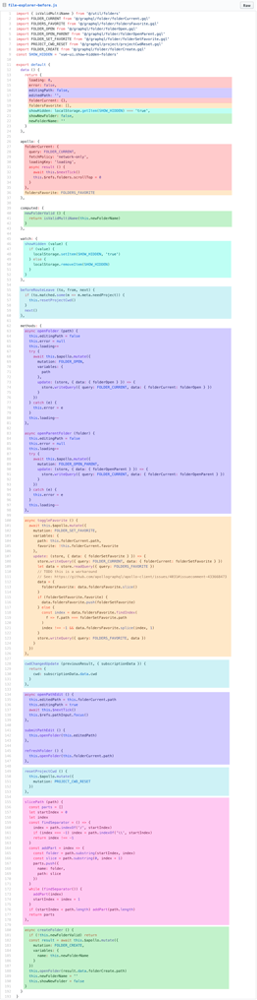
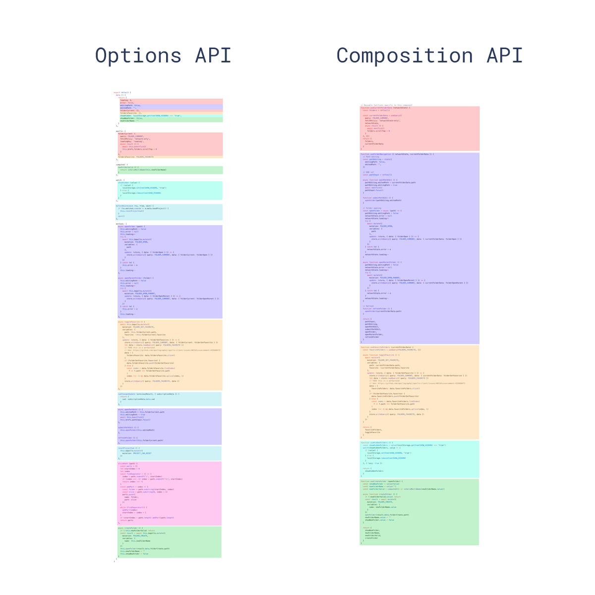
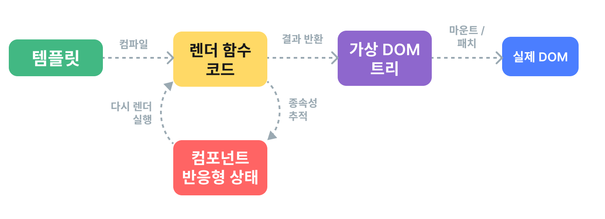

# Vue 3 반응성과 렌더링 심화

앞에서 사용한 반응성과 렌더링 기능을 내부 동작까지 내려가 살펴봅니다. 의존성 추적과 DOM 업데이트가 어떻게 연결되는지 이해한 뒤, 렌더 함수와 웹 컴포넌트 등으로 적용 범위를 넓힙니다.

## 목차

- [컴포지션 API FAQ](#guide-extras-composition-api-faq)
- [반응성 심층 분석](#guide-extras-reactivity-in-depth)
- [렌더링(rendering) 메커니즘](#guide-extras-rendering-mechanism)
- [렌더 함수 & JSX](#guide-extras-render-function)
- [Vue와 웹 컴포넌트](#guide-extras-web-components)
- [반응성 변환](#guide-extras-reactivity-transform)

---

<a id="guide-extras-composition-api-faq"></a>

<a id="guide-extras-composition-api-faq-composition-api-faq"></a>

## 컴포지션 API FAQ

> 원문: https://github.com/vuejs/docs/blob/40aa88af0094f7bab4aaf786e55c748a6a251d88/src/guide/extras/composition-api-faq.md
> 한국어 번역 기반: https://github.com/vuejs-translations/docs-ko/blob/6e646acb5687510feda533281faa546b26ea243c/src/guide/extras/composition-api-faq.md

**참고**
이 FAQ는 Vue에 대한 사전 경험, 특히 옵션 API를 주로 사용한 Vue 2 경험이 있다고 가정합니다.


<a id="guide-extras-composition-api-faq-what-is-composition-api"></a>

### 컴포지션 API란?

참고 강의: https://vueschool.io/lessons/introduction-to-the-vue-js-3-composition-api


컴포지션 API는 옵션을 선언하는 대신 임포트한 함수를 사용하여 Vue 컴포넌트(component)를 작성할 수 있게 해주는 API 집합입니다. 다음과 같은 API를 포괄하는 상위 개념입니다:

- [반응성(reactivity) API](07_composition_and_reactivity_apis.md#api-reactivity-core): 예를 들어 `ref()`와 `reactive()`가 있으며, 이를 사용해 반응형 상태, 계산된 상태, 감시자(watchers)를 직접 생성할 수 있습니다.

- [라이프사이클(lifecycle) 훅(hook)](07_composition_and_reactivity_apis.md#api-composition-api-lifecycle): 예를 들어 `onMounted()`와 `onUnmounted()`가 있으며, 컴포넌트 라이프사이클에 프로그래밍 방식으로 연결할 수 있습니다.

- [의존성 주입(dependency injection)](07_composition_and_reactivity_apis.md#api-composition-api-dependency-injection): 즉 `provide()`와 `inject()`로, 반응성 API를 사용하면서 Vue의 의존성 주입 시스템을 활용할 수 있습니다.

컴포지션 API는 Vue 3와 [Vue 2.7](https://blog.vuejs.org/posts/vue-2-7-naruto.html)의 내장 기능입니다. 이전 Vue 2 버전에서는 공식적으로 관리되는 [`@vue/composition-api`](https://github.com/vuejs/composition-api) 플러그인(plugin)을 사용하세요. Vue 3에서는 주로 Single-File Component에서 [`<script setup>`](08_component_and_advanced_apis.md#api-sfc-script-setup) 문법과 함께 사용됩니다. 다음은 컴포지션 API를 사용하는 컴포넌트의 기본 예시입니다:

```vue
<script setup>
import { ref, onMounted } from 'vue'

// 반응형 상태
const count = ref(0)

// 상태를 변경하고 업데이트를 트리거하는 함수
function increment() {
  count.value++
}

// 생명주기 훅
onMounted(() => {
  console.log(`초기 카운트는 ${count.value}입니다.`)
})
</script>

<template>
  <button @click="increment">Count is: {{ count }}</button>
</template>
```

함수 조합에 기반한 API 스타일임에도 불구하고, **컴포지션 API는 함수형 프로그래밍이 아닙니다**. 컴포지션 API는 Vue의 변경 가능하고 세밀한 반응성 패러다임을 바탕으로 하며, 함수형 프로그래밍은 불변성을 강조합니다.

컴포지션 API로 Vue를 사용하는 방법을 배우고 싶다면, 왼쪽 사이드바 상단의 토글을 사용해 사이트 전체 API 선호도를 컴포지션 API로 설정한 후, 가이드의 처음부터 따라가 보세요.

<a id="guide-extras-composition-api-faq-why-composition-api"></a>

### 왜 컴포지션 API인가?
<a id="guide-extras-composition-api-faq-better-logic-reuse"></a>

#### 더 나은 로직 재사용
컴포지션 API의 가장 큰 장점은 [컴포저블(composable) 함수](03_components_and_reusability.md#guide-reusability-composables) 형태로 깔끔하고 효율적인 로직 재사용이 가능하다는 점입니다. 이는 옵션 API의 주요 로직 재사용 메커니즘인 [믹스인(mixin)](03_components_and_reusability.md#guide-reusability-composables-vs-mixins)의 모든 단점을 해결합니다.

컴포지션 API의 로직 재사용 기능 덕분에 [VueUse](https://vueuse.org/)와 같은 인상적인 커뮤니티 프로젝트가 탄생했습니다. VueUse는 계속 성장하고 있는 컴포저블 유틸리티 모음집입니다. 또한 [불변 데이터](06_reactivity_and_rendering_in_depth.md#guide-extras-reactivity-in-depth-immutable-data), [상태 머신](06_reactivity_and_rendering_in_depth.md#guide-extras-reactivity-in-depth-state-machines), [RxJS](06_reactivity_and_rendering_in_depth.md#guide-extras-reactivity-in-depth-rxjs) 등 상태를 가지는 서드파티 서비스나 라이브러리를 Vue의 반응성 시스템에 쉽게 통합할 수 있는 깔끔한 메커니즘을 제공합니다.

<a id="guide-extras-composition-api-faq-more-flexible-code-organization"></a>

#### 더 유연한 코드 구성
많은 사용자는 옵션 API로 기본적으로 정리된 코드를 작성할 수 있다는 점을 좋아합니다. 모든 것이 해당 옵션에 따라 제자리에 위치합니다. 하지만 옵션 API는 단일 컴포넌트의 로직이 일정 복잡성 임계값을 넘어서면 심각한 한계를 드러냅니다. 이 한계는 여러 **논리적 관심사**를 다루어야 하는 컴포넌트에서 특히 두드러지며, 실제로 많은 프로덕션 Vue 2 앱에서 직접 목격해 온 현상입니다.

Vue CLI의 GUI에 있는 폴더 탐색기 컴포넌트를 예로 들어보겠습니다. 이 컴포넌트는 다음과 같은 논리적 관심사를 담당합니다:

- 현재 폴더 상태를 추적하고 내용을 표시
- 폴더 탐색 처리(열기, 닫기, 새로고침 등)
- 새 폴더 생성 처리
- 즐겨찾기 폴더만 표시 토글
- 숨김 폴더 표시 토글
- 현재 작업 디렉터리 변경 처리

이 컴포넌트의 [원본 버전](https://github.com/vuejs/vue-cli/blob/a09407dd5b9f18ace7501ddb603b95e31d6d93c0/packages/@vue/cli-ui/src/components/folder/FolderExplorer.vue#L198-L404)은 옵션 API로 작성되었습니다. 각 코드 줄에 해당 논리적 관심사에 따라 색을 입히면 다음과 같이 보입니다:



같은 기능을 다루는 코드가 서로 다른 옵션에 나뉘어 있습니다. 수백 줄짜리 컴포넌트에서 폴더 탐색처럼 한 가지 기능을 이해하려면 파일을 위아래로 오가며 관련 코드를 찾아야 합니다. 그 기능을 재사용 가능한 유틸리티로 추출할 때도 흩어진 코드를 먼저 모아야 합니다.

다음은 동일한 컴포넌트를 [컴포지션 API로 리팩터링](https://gist.github.com/yyx990803/8854f8f6a97631576c14b63c8acd8f2e)하기 전과 후의 모습입니다:



컴포지션 API로 옮기면 같은 기능의 코드를 한곳에 모을 수 있습니다. 기능을 수정할 때 여러 옵션 블록을 오갈 필요가 없고, 재사용할 때는 모아둔 코드를 그대로 외부 파일로 옮기면 됩니다. 코드를 추출하기 위한 재배치가 줄어들어 대규모 코드베이스를 장기적으로 유지보수하기도 수월해집니다.

<a id="guide-extras-composition-api-faq-better-type-inference"></a>

#### 더 나은 타입 추론
최근 몇 년간, 더 많은 프론트엔드 개발자들이 [TypeScript](https://www.typescriptlang.org/)를 채택하고 있습니다. TypeScript를 사용하면 더 견고한 코드를 작성하고 더 자신 있게 변경할 수 있으며, IDE 지원 덕분에 훌륭한 개발 경험도 누릴 수 있습니다. 하지만 옵션 API는 2013년에 고안될 당시 타입 추론을 염두에 두지 않았습니다. 우리는 옵션 API에서 타입 추론이 동작하도록 [매우 복잡한 타입 체조](https://github.com/vuejs/core/blob/44b95276f5c086e1d88fa3c686a5f39eb5bb7821/packages/runtime-core/src/componentPublicInstance.ts#L132-L165)를 구현해야 했습니다. 그럼에도 불구하고, 믹스인과 의존성 주입에서는 옵션 API의 타입 추론이 여전히 깨질 수 있습니다.

이로 인해 Vue를 TS와 함께 사용하고자 하는 많은 개발자들이 `vue-class-component` 기반의 Class API로 기울었습니다. 하지만 클래스 기반 API는 ES 데코레이터에 크게 의존하는데, 이는 Vue 3가 개발되던 2019년 당시에는 아직 2단계 제안에 불과한 언어 기능이었습니다. 우리는 공식 API를 불안정한 제안에 기반하는 것이 너무 위험하다고 느꼈습니다. 이후 데코레이터 제안은 또 한 번 완전히 개편되었고, 2022년에야 3단계에 도달했습니다. 또한 클래스 기반 API는 옵션 API와 유사한 로직 재사용 및 코드 구성의 한계를 겪습니다.

이에 비해 컴포지션 API는 대부분 평범한 변수와 함수를 활용하므로 자연스럽게 타입 친화적입니다. 컴포지션 API로 작성된 코드는 수동 타입 힌트가 거의 없어도 완전한 타입 추론을 누릴 수 있습니다. 대부분의 경우, 컴포지션 API 코드는 TypeScript와 일반 JavaScript에서 거의 동일하게 보입니다. 이는 일반 JavaScript 사용자도 부분적인 타입 추론의 이점을 누릴 수 있게 해줍니다.

<a id="guide-extras-composition-api-faq-smaller-production-bundle-and-less-overhead"></a>

#### 더 작은 프로덕션 번들 및 오버헤드 감소
컴포지션 API와 `<script setup>`으로 작성된 코드는 옵션 API에 비해 더 효율적이고, 난독화(최소화)에 더 적합합니다. 이는 `<script setup>` 컴포넌트의 템플릿(template)이 `<script setup>` 코드와 동일한 스코프에 인라인된 함수로 컴파일되기 때문입니다. `this`에서 프로퍼티(property)에 접근하는 것과 달리, 컴파일된 템플릿 코드는 인스턴스(instance) 프록시(proxy) 없이 `<script setup>` 내부에 선언된 변수에 직접 접근할 수 있습니다. 또한 모든 변수명이 안전하게 짧아질 수 있으므로 난독화 효과도 더 좋습니다.

<a id="guide-extras-composition-api-faq-relationship-with-options-api"></a>

### Options API와의 관계
<a id="guide-extras-composition-api-faq-trade-offs"></a>

#### 트레이드오프
옵션 API에서 옮겨온 일부 사용자는 컴포지션 API 코드가 덜 정돈되어 있다고 느끼고, 코드 구성 측면에서 컴포지션 API가 "더 나쁘다"고 결론짓기도 합니다. 이런 의견을 가진 사용자라면, 그 문제를 다른 관점에서 바라보길 권장합니다.

컴포지션 API는 더 이상 코드를 각 버킷에 넣도록 안내하는 "가드레일"을 제공하지 않는 것이 사실입니다. 대신, 일반 JavaScript를 작성하듯이 컴포넌트 코드를 작성할 수 있습니다. 즉, **일반 JavaScript를 작성할 때 적용하는 모든 코드 구성 모범 사례를 컴포지션 API 코드에도 적용할 수 있고, 그래야 합니다**. 잘 정돈된 JavaScript를 작성할 수 있다면, 잘 정돈된 컴포지션 API 코드도 작성할 수 있습니다.

옵션 API는 컴포넌트 코드를 작성할 때 "덜 생각하게" 해주므로 많은 사용자가 이를 좋아합니다. 하지만 정신적 부담을 줄이는 대신, 탈출구 없는 정해진 코드 구성 패턴에 갇히게 되어, 대규모 프로젝트에서 리팩터링이나 코드 품질 개선이 어려워질 수 있습니다. 이런 점에서 컴포지션 API는 장기적으로 더 나은 확장성을 제공합니다.

<a id="guide-extras-composition-api-faq-does-composition-api-cover-all-use-cases"></a>

#### 컴포지션 API가 모든 사용 사례를 포괄하나요?
상태를 가진 로직 측면에서는 그렇습니다. 컴포지션 API를 사용할 때 여전히 필요한 옵션은 `props`, `emits`, `name`, `inheritAttrs` 정도입니다.

**참고**

3.3부터는 `<script setup>`에서 `defineOptions`를 직접 사용해 컴포넌트 이름이나 `inheritAttrs` 속성을 설정할 수 있습니다.


컴포지션 API(위에 나열된 옵션과 함께)만 사용하려는 경우, [컴파일 타임 플래그](08_component_and_advanced_apis.md#api-compile-time-flags)를 통해 Vue에서 옵션 API 관련 코드를 제거하여 프로덕션 번들 크기를 몇 KB 줄일 수 있습니다. 이 설정은 의존성에 있는 Vue 컴포넌트에도 영향을 미칩니다.

<a id="guide-extras-composition-api-faq-can-i-use-both-apis-in-the-same-component"></a>

#### 두 API를 같은 컴포넌트에서 함께 사용할 수 있나요?
네. 옵션 API 컴포넌트에서 [`setup()`](07_composition_and_reactivity_apis.md#api-composition-api-setup) 옵션을 통해 컴포지션 API를 사용할 수 있습니다.

하지만 기존 옵션 API 코드베이스에 컴포지션 API로 작성된 새로운 기능/외부 라이브러리를 통합해야 할 때만 이를 권장합니다.

<a id="guide-extras-composition-api-faq-will-options-api-be-deprecated"></a>

#### Options API가 폐지될 예정인가요?
아니요, 그럴 계획이 전혀 없습니다. 옵션 API는 Vue의 핵심적인 부분이며, 많은 개발자가 이를 사랑하는 이유이기도 합니다. 또한 컴포지션 API의 많은 이점은 대규모 프로젝트에서만 두드러지므로, 옵션 API는 여전히 저~중간 복잡도 시나리오에서 훌륭한 선택지로 남아 있습니다.

<a id="guide-extras-composition-api-faq-relationship-with-class-api"></a>

### Class API와의 관계
컴포지션 API가 TypeScript 통합, 추가적인 로직 재사용 및 코드 구성의 이점을 제공하므로, Vue 3에서는 더 이상 Class API 사용을 권장하지 않습니다.

<a id="guide-extras-composition-api-faq-comparison-with-react-hooks"></a>

### React Hooks와의 비교
컴포지션 API는 React Hooks와 동일한 수준의 로직 조합 기능을 제공하지만, 몇 가지 중요한 차이점이 있습니다.

React Hooks는 컴포넌트가 업데이트될 때마다 반복적으로 호출됩니다. 이 때문에 숙련된 React 개발자조차 혼란을 겪을 수 있는 여러 주의사항이 생깁니다. 또한 개발 경험에 심각한 영향을 줄 수 있는 성능 최적화 문제로 이어집니다. 예시는 다음과 같습니다:

- 훅은 호출 순서에 민감하며 조건부로 사용할 수 없습니다.

- React 컴포넌트에서 선언된 변수는 훅 클로저에 캡처되어, 개발자가 올바른 의존성 배열을 전달하지 않으면 "오래된(stale)" 값이 될 수 있습니다. 이로 인해 React 개발자는 올바른 의존성이 전달되었는지 확인하기 위해 ESLint 규칙에 의존하게 됩니다. 하지만 이 규칙은 종종 충분히 똑똑하지 않아, 정확성을 과도하게 보장하려다 불필요한 무효화와 예외 상황에서의 골칫거리를 유발합니다.

- 비용이 많이 드는 계산에는 `useMemo`를 사용해야 하며, 이 역시 올바른 의존성 배열을 수동으로 전달해야 합니다.

- 자식 컴포넌트에 전달되는 이벤트 핸들러는 기본적으로 불필요한 자식 업데이트를 유발하며, 최적화를 위해 명시적으로 `useCallback`을 사용해야 합니다. 이는 거의 항상 필요하며, 역시 올바른 의존성 배열이 필요합니다. 이를 소홀히 하면 앱이 과도하게 렌더링(rendering)되어 성능 문제가 발생할 수 있습니다.

- 오래된 클로저 문제와 Concurrent 기능이 결합되면, 훅 코드가 언제 실행되는지 추론하기 어려워지고, 렌더 간에 유지되어야 하는 변경 가능한 상태(`useRef` 사용)를 다루기가 번거로워집니다.

> 참고: 위의 메모이제이션(memoization) 관련 문제 중 일부는 곧 출시될 [React Compiler](https://react.dev/learn/react-compiler)로 해결될 수 있습니다.

이에 비해 Vue 컴포지션 API는:

- `setup()` 또는 `<script setup>` 코드를 한 번만 호출합니다. 이로 인해 오래된 클로저를 걱정할 필요가 없으므로, 코드가 관용적인 JavaScript 사용 방식에 대한 직관과 더 잘 맞습니다. 컴포지션 API 호출은 호출 순서에 민감하지 않으며, 조건부로 사용할 수 있습니다.

- Vue의 런타임 반응성 시스템은 계산된 속성(computed property)과 감시자에서 사용된 반응형 의존성을 자동으로 수집하므로, 수동으로 의존성을 선언할 필요가 없습니다.

- 불필요한 자식 업데이트를 방지하기 위해 콜백(callback) 함수를 수동으로 캐시할 필요가 없습니다. 일반적으로 Vue의 세밀한 반응성 시스템은 자식 컴포넌트가 필요할 때만 업데이트되도록 보장합니다. 자식 업데이트를 수동으로 최적화하는 일은 Vue 개발자에게 거의 걱정거리가 되지 않습니다.

우리는 React Hooks의 창의성을 인정하며, 이는 컴포지션 API의 주요 영감 중 하나입니다. 하지만 위에서 언급한 문제들은 실제로 존재하며, Vue의 반응성 모델이 이를 우회할 방법을 제공한다는 점을 발견했습니다.

---

<a id="guide-extras-reactivity-in-depth"></a>

**문서 데모 설정 코드**

```vue
<script setup>
import SpreadSheet from './demos/SpreadSheet.vue'
</script>
```


<a id="guide-extras-reactivity-in-depth-reactivity-in-depth"></a>

## 반응성 심층 분석

> 원문: https://github.com/vuejs/docs/blob/40aa88af0094f7bab4aaf786e55c748a6a251d88/src/guide/extras/reactivity-in-depth.md
> 한국어 번역 기반: https://github.com/vuejs-translations/docs-ko/blob/6e646acb5687510feda533281faa546b26ea243c/src/guide/extras/reactivity-in-depth.md

Vue에서는 컴포넌트(component)의 반응형 JavaScript 객체를 수정하면 뷰가 업데이트됩니다. 반응성(reactivity) 시스템이 상태 변경과 화면 갱신을 연결해주기 때문입니다. 객체를 어떻게 읽고 수정하느냐에 따라 이 연결이 달라질 수 있으므로, 의존성을 추적하는 내부 동작부터 살펴보겠습니다.

<a id="guide-extras-reactivity-in-depth-what-is-reactivity"></a>

### 반응성이란?
반응성은 선언한 관계에 따라 값의 변화를 반영하는 프로그래밍 패러다임입니다. 엑셀 스프레드시트의 수식을 떠올리면 이해하기 쉽습니다.


[데모 소스](assets/guide/extras/demos/SpreadSheet.vue)


데모에서 셀 A2는 `= A0 + A1`이라는 수식으로 정의되어 있으며, 계산 결과인 3을 보여줍니다(A2를 클릭하면 수식을 보고 수정할 수 있습니다). A0나 A1을 바꾸면 수식을 다시 입력하지 않아도 A2가 자동으로 업데이트됩니다.

JavaScript는 보통 이렇게 동작하지 않습니다. 만약 JavaScript로 비슷한 것을 작성한다면:

```js
let A0 = 1
let A1 = 2
let A2 = A0 + A1

console.log(A2) // 3

A0 = 2
console.log(A2) // 여전히 3
```

`A0`를 변경해도 `A2`는 자동으로 바뀌지 않습니다.

그렇다면 JavaScript에서는 어떻게 해야 할까요? 먼저, `A2`를 업데이트하는 코드를 다시 실행할 수 있도록 함수로 감싸봅시다:

```js
let A2

function update() {
  A2 = A0 + A1
}
```

그리고 몇 가지 용어를 정의해야 합니다:

- `update()` 함수는 프로그램의 상태를 변경하므로 **부수 효과** 또는 줄여서 **이펙트**를 발생시킵니다.

- `A0`와 `A1`은 이 이펙트의 **의존성**입니다. 이 값들이 이펙트를 수행하는 데 사용되기 때문입니다. 이펙트는 자신의 의존성에 대한 **구독자**가 되었다고 할 수 있습니다.

우리에게 필요한 것은 `A0`이나 `A1`(즉, **의존성**)이 변경될 때마다 `update()`(**이펙트**)를 호출해주는 마법 같은 함수입니다:

```js
whenDepsChange(update)
```

이 `whenDepsChange()` 함수는 다음과 같은 작업을 해야 합니다:

1. 변수가 읽힐 때를 추적합니다. 예를 들어, `A0 + A1` 표현식을 평가할 때 `A0`와 `A1`이 모두 읽힙니다.

2. 현재 실행 중인 이펙트가 있을 때 변수가 읽히면, 그 이펙트를 해당 변수의 구독자로 만듭니다. 예를 들어, `update()`가 실행될 때 `A0`와 `A1`이 읽히므로, 첫 호출 이후 `update()`는 `A0`와 `A1` 모두의 구독자가 됩니다.

3. 변수가 변경될 때를 감지합니다. 예를 들어, `A0`에 새 값이 할당되면, 모든 구독자 이펙트에 다시 실행하라고 알립니다.

<a id="guide-extras-reactivity-in-depth-how-reactivity-works-in-vue"></a>

### Vue에서의 반응성 동작 방식
예제처럼 지역 변수의 읽기와 쓰기를 실제로 추적할 수는 없습니다. 순수 JavaScript에는 이를 위한 메커니즘이 없습니다. 하지만 **객체 속성**의 읽기와 쓰기를 가로챌 수는 있습니다.

JavaScript에서 속성 접근을 가로채는 방법은 두 가지가 있습니다: [getter](https://developer.mozilla.org/ko/docs/Web/JavaScript/Reference/Functions/get#description) / [setter](https://developer.mozilla.org/ko/docs/Web/JavaScript/Reference/Functions/set#description)와 [Proxy](https://developer.mozilla.org/ko/docs/Web/JavaScript/Reference/Global_Objects/Proxy)입니다. Vue 2는 브라우저 지원 제한 때문에 getter / setter만 사용했습니다. Vue 3에서는 Proxy가 반응형 객체에 사용되고, getter / setter는 ref에 사용됩니다. 아래는 그 동작 방식을 보여주는 의사 코드입니다:

```js{4,9,17,22}
function reactive(obj) {
  return new Proxy(obj, {
    get(target, key) {
      track(target, key)
      return target[key]
    },
    set(target, key, value) {
      target[key] = value
      trigger(target, key)
    }
  })
}

function ref(value) {
  const refObject = {
    get value() {
      track(refObject, 'value')
      return value
    },
    set value(newValue) {
      value = newValue
      trigger(refObject, 'value')
    }
  }
  return refObject
}
```

**참고**
여기와 아래의 코드 스니펫은 핵심 개념을 최대한 단순하게 설명하기 위한 것이므로, 많은 세부 사항이 생략되어 있고, 예외적인 경우도 무시되어 있습니다.


이것은 우리가 기본 섹션에서 논의했던 [반응형 객체의 몇 가지 제한 사항](02_essentials.md#guide-essentials-reactivity-fundamentals-limitations-of-reactive)을 설명해줍니다:

- 반응형 객체의 속성을 지역 변수에 할당하거나 구조 분해 할당하면 반응성이 사라집니다. 그 변수에 접근하거나 값을 할당해도 더 이상 원본 객체의 get / set 프록시(proxy) 트랩을 트리거하지 않기 때문입니다. 이 "연결 해제"는 변수 바인딩(binding)에만 영향을 미치며, 만약 변수가 객체와 같은 비원시 값을 가리킨다면, 그 객체를 변경하는 것은 여전히 반응형입니다.

- `reactive()`에서 반환된 프록시는 원본과 거의 동일하게 동작하지만, `===` 연산자로 비교하면 원본과는 다른 정체성을 가집니다.

`track()` 내부에서는 현재 실행 중인 이펙트가 있는지 확인합니다. 있다면, 추적 중인 속성의 구독자 이펙트들(집합에 저장됨)을 찾아서, 현재 실행 중인 이펙트를 그 집합에 추가합니다:

```js
// 이 값은 이펙트가 실행되기 직전에 설정됩니다.
// 이에 대해서는 나중에 다루겠습니다.
let activeEffect

function track(target, key) {
  if (activeEffect) {
    const effects = getSubscribersForProperty(target, key)
    effects.add(activeEffect)
  }
}
```

이펙트 구독은 전역 `WeakMap<target, Map<key, Set<effect>>>` 데이터 구조에 저장됩니다. 속성에 대한 구독자 이펙트 집합이 없다면(처음 추적되는 경우), 새로 생성됩니다. 이것이 `getSubscribersForProperty()` 함수가 하는 일입니다. 단순화를 위해 세부 구현은 생략합니다.

`trigger()` 내부에서는 다시 한 번 해당 속성의 구독자 이펙트를 찾습니다. 하지만 이번에는 그것들을 호출합니다:

```js
function trigger(target, key) {
  const effects = getSubscribersForProperty(target, key)
  effects.forEach((effect) => effect())
}
```

이제 다시 `whenDepsChange()` 함수로 돌아가 봅시다:

```js
function whenDepsChange(update) {
  const effect = () => {
    activeEffect = effect
    update()
    activeEffect = null
  }
  effect()
}
```

이 함수는 실제 `update` 함수를 이펙트로 감싸서, 실행 전에 자신을 현재 활성 이펙트로 설정합니다. 이렇게 하면 업데이트 중에 `track()` 호출이 현재 활성 이펙트를 찾을 수 있습니다.

이제 이펙트가 의존성을 스스로 추적하고, 의존성이 바뀔 때마다 다시 실행됩니다. 이렇게 동작하는 이펙트를 **반응형 이펙트**라고 부릅니다.

Vue는 반응형 이펙트를 생성할 수 있는 API를 제공합니다: [`watchEffect()`](07_composition_and_reactivity_apis.md#api-reactivity-core-watcheffect). 사실, 이것이 예제의 마법 같은 `whenDepsChange()`와 매우 비슷하게 동작한다는 것을 눈치챘을 수도 있습니다. 이제 실제 Vue API를 사용하여 원래 예제를 다시 작성해볼 수 있습니다:

```js
import { ref, watchEffect } from 'vue'

const A0 = ref(0)
const A1 = ref(1)
const A2 = ref()

watchEffect(() => {
  // A0와 A1을 추적합니다
  A2.value = A0.value + A1.value
})

// 이펙트를 트리거합니다
A0.value = 2
```

반응형 이펙트를 사용해 ref를 변경하는 것은 그다지 흥미로운 사용 사례는 아닙니다. 사실, 계산된 속성(computed property)을 사용하는 것이 더 선언적입니다:

```js
import { ref, computed } from 'vue'

const A0 = ref(0)
const A1 = ref(1)
const A2 = computed(() => A0.value + A1.value)

A0.value = 2
```

내부적으로, `computed`는 반응형 이펙트를 사용해 무효화와 재계산을 관리합니다.

그렇다면 일반적이고 유용한 반응형 이펙트의 예시는 무엇일까요? 바로 DOM 업데이트입니다! 다음과 같이 간단한 "반응형 렌더링(rendering)"을 구현할 수 있습니다:

```js
import { ref, watchEffect } from 'vue'

const count = ref(0)

watchEffect(() => {
  document.body.innerHTML = `Count is: ${count.value}`
})

// DOM을 업데이트합니다
count.value++
```

실제로, 이것은 Vue 컴포넌트가 상태와 DOM을 동기화하는 방식과 매우 유사합니다. 각 컴포넌트 인스턴스(instance)는 렌더링과 DOM 업데이트를 위해 반응형 이펙트를 생성합니다. 물론, Vue 컴포넌트는 `innerHTML`보다 훨씬 효율적인 방법으로 DOM을 업데이트합니다. 이에 대해서는 [렌더링 메커니즘](06_reactivity_and_rendering_in_depth.md#guide-extras-rendering-mechanism)에서 다룹니다.


**옵션 API**


`ref()`, `computed()`, `watchEffect()` API는 모두 컴포지션 API의 일부입니다. 지금까지 Vue에서 옵션 API만 사용해왔다면, 컴포지션 API가 Vue의 반응성 시스템이 내부적으로 동작하는 방식에 더 가깝다는 것을 알 수 있습니다. 실제로 Vue 3에서는 옵션 API가 컴포지션 API 위에 구현되어 있습니다. 컴포넌트 인스턴스(`this`)의 모든 속성 접근은 반응성 추적을 위한 getter / setter를 트리거하며, `watch`와 `computed` 같은 옵션도 내부적으로 컴포지션 API의 동등한 기능을 호출합니다.


<a id="guide-extras-reactivity-in-depth-runtime-vs-compile-time-reactivity"></a>

### 런타임 vs. 컴파일타임 반응성
Vue의 반응성 시스템은 주로 런타임 기반입니다: 추적과 트리거링이 모두 브라우저에서 코드가 실행되는 동안 수행됩니다. 런타임 반응성의 장점은 빌드 단계 없이도 동작할 수 있고, 예외적인 경우가 적다는 점입니다. 반면, 런타임 반응성은 JavaScript의 문법적 한계에 제약을 받기 때문에, Vue ref와 같은 값 컨테이너가 필요해집니다.

[Svelte](https://svelte.dev/)와 같은 일부 프레임워크는 컴파일 시점에 반응성을 구현하여 이러한 한계를 극복합니다. 코드를 분석하고 변환하여 반응성을 시뮬레이션합니다. 컴파일 단계에서는 프레임워크가 JavaScript 자체의 의미를 변경할 수 있습니다. 예를 들어, 지역 변수 접근 시 의존성 분석과 이펙트 트리거링을 수행하는 코드를 암묵적으로 삽입할 수 있습니다. 단점도 있습니다. 이러한 변환에는 빌드 단계가 필요하며, JavaScript의 의미를 변경하는 것은 본질적으로 JavaScript처럼 보이지만 실제로는 다른 것으로 컴파일되는 언어를 만드는 것과 같습니다.

Vue 팀도 [Reactivity Transform](06_reactivity_and_rendering_in_depth.md#guide-extras-reactivity-transform)이라는 실험적 기능을 통해 이 방향을 탐구했지만, [여기서 설명한 이유](https://github.com/vuejs/rfcs/discussions/369#discussioncomment-5059028)로 인해 프로젝트에 적합하지 않다고 판단했습니다.

<a id="guide-extras-reactivity-in-depth-reactivity-debugging"></a>

### 반응성 디버깅
의존성 추적은 자동으로 이루어지므로, 예상과 다르게 렌더링될 때는 어떤 값이 추적되었고 어떤 변경이 리렌더를 일으켰는지 확인해야 합니다. Vue는 이 과정을 살펴볼 디버깅 훅을 제공합니다.

<a id="guide-extras-reactivity-in-depth-component-debugging-hooks"></a>

#### 컴포넌트 디버깅 훅(hook)
렌더링 중 사용된 의존성은 `onRenderTracked`로, 업데이트를 일으킨 의존성은 `onRenderTriggered`로 확인합니다. 옵션 API에서는 각각 `renderTracked`와 `renderTriggered`에 해당합니다. 두 라이프사이클(lifecycle) 훅은 의존성 정보를 담은 디버거 이벤트를 받으므로, 콜백(callback)에 `debugger` 문을 넣어 그 내용을 살펴볼 수 있습니다.


**컴포지션 API**


```vue
<script setup>
import { onRenderTracked, onRenderTriggered } from 'vue'

onRenderTracked((event) => {
  debugger
})

onRenderTriggered((event) => {
  debugger
})
</script>
```


**옵션 API**


```js
export default {
  renderTracked(event) {
    debugger
  },
  renderTriggered(event) {
    debugger
  }
}
```


**참고**
컴포넌트 디버그 훅은 개발 모드에서만 동작합니다.


디버그 이벤트 객체는 다음과 같은 타입을 가집니다:

<span id="guide-extras-reactivity-in-depth-debugger-event"></span>

```ts
type DebuggerEvent = {
  effect: ReactiveEffect
  target: object
  type:
    | TrackOpTypes /* 'get' | 'has' | 'iterate' */
    | TriggerOpTypes /* 'set' | 'add' | 'delete' | 'clear' */
  key: any
  newValue?: any
  oldValue?: any
  oldTarget?: Map<any, any> | Set<any>
}
```

<a id="guide-extras-reactivity-in-depth-computed-debugging"></a>

#### 계산된 속성 디버깅

**컴포지션 API**


`computed()`에 두 번째 옵션 객체로 `onTrack`과 `onTrigger` 콜백을 전달하여 계산된 속성을 디버깅할 수 있습니다:

- `onTrack`은 반응형 속성이나 ref가 의존성으로 추적될 때 호출됩니다.
- `onTrigger`는 의존성의 변경으로 인해 watcher 콜백이 트리거될 때 호출됩니다.

두 콜백 모두 [컴포넌트 디버그 훅과 동일한 형식](06_reactivity_and_rendering_in_depth.md#guide-extras-reactivity-in-depth-debugger-event)의 디버거 이벤트를 받습니다:

```js
const plusOne = computed(() => count.value + 1, {
  onTrack(e) {
    // count.value가 의존성으로 추적될 때 트리거됨
    debugger
  },
  onTrigger(e) {
    // count.value가 변경될 때 트리거됨
    debugger
  }
})

// plusOne에 접근하면 onTrack이 트리거됨
console.log(plusOne.value)

// count.value를 변경하면 onTrigger가 트리거됨
count.value++
```

**참고**
`onTrack`과 `onTrigger` 계산된 속성 옵션은 개발 모드에서만 동작합니다.


**옵션 API**


계산된 속성 디버깅 옵션은 컴포지션 API의 `computed()` 함수를 통해서만 사용할 수 있습니다.


<a id="guide-extras-reactivity-in-depth-watcher-debugging"></a>

#### 감시자 디버깅

**컴포지션 API**


`computed()`와 마찬가지로, 감시자(watchers)도 `onTrack`과 `onTrigger` 옵션을 지원합니다:

```js
watch(source, callback, {
  onTrack(e) {
    debugger
  },
  onTrigger(e) {
    debugger
  }
})

watchEffect(callback, {
  onTrack(e) {
    debugger
  },
  onTrigger(e) {
    debugger
  }
})
```


**옵션 API**


객체 문법으로 선언한 감시자도 `onTrack`과 `onTrigger` 옵션을 지원합니다:

```js
export default {
  watch: {
    source: {
      handler() {
        // ...
      },
      onTrack(e) {
        debugger
      },
      onTrigger(e) {
        debugger
      }
    }
  }
}
```


**참고**
`onTrack`과 `onTrigger` 감시자 옵션은 개발 모드에서만 동작합니다.


<a id="guide-extras-reactivity-in-depth-integration-with-external-state-systems"></a>

### 외부 상태 시스템과의 통합
Vue의 반응성 시스템은 일반 JavaScript 객체를 깊게 변환하여 반응형 프록시로 만듭니다. 외부 상태 관리 시스템과 통합할 때(예: 외부 솔루션도 Proxy를 사용하는 경우), 깊은 변환이 불필요하거나 바람직하지 않을 수 있습니다.

Vue의 반응성 시스템을 외부 상태 관리 솔루션과 통합하는 일반적인 방법은 외부 상태를 [`shallowRef`](07_composition_and_reactivity_apis.md#api-reactivity-advanced-shallowref)에 보관하는 것입니다. shallow ref는 `.value` 속성에 접근할 때만 반응형이며, 내부 값은 그대로 남아 있습니다. 외부 상태가 변경되면 ref 값을 교체하여 업데이트를 트리거합니다.

<a id="guide-extras-reactivity-in-depth-immutable-data"></a>

#### 불변 데이터
실행 취소 / 다시 실행 기능을 구현하려면, 사용자가 편집할 때마다 애플리케이션의 상태 스냅샷을 저장하고 싶을 것입니다. 하지만 Vue의 변경 가능한 반응성 시스템은 상태 트리가 크면 적합하지 않습니다. 매번 전체 상태 객체를 직렬화하는 것은 CPU와 메모리 비용이 많이 들 수 있기 때문입니다.

[불변 데이터 구조](https://ko.wikipedia.org/wiki/%EC%A7%84%ED%96%89_%EB%8D%B0%EC%9D%B4%ED%84%B0_%EA%B5%AC%EC%A1%B0)는 상태 객체를 절대 변경하지 않고, 대신 변경되지 않은 부분을 이전 객체와 공유하는 새 객체를 만듭니다. JavaScript에서 불변 데이터를 다루는 방법은 여러 가지가 있지만, [Immer](https://immerjs.github.io/immer/)를 Vue와 함께 사용하는 것을 추천합니다. Immer를 이용하면 더 편리한 변경 가능한 문법을 유지하면서 불변 데이터를 다룰 수 있습니다.

Immer를 Vue와 통합하는 간단한 컴포저블(composable)은 다음과 같습니다:

```js
import { produce } from 'immer'
import { shallowRef } from 'vue'

export function useImmer(baseState) {
  const state = shallowRef(baseState)
  const update = (updater) => {
    state.value = produce(state.value, updater)
  }

  return [state, update]
}
```

[플레이그라운드에서 직접 사용해보기](https://play.vuejs.org/#eNp9VMFu2zAM/RXNl6ZAYnfoTlnSdRt66DBsQ7vtEuXg2YyjRpYEUU5TBPn3UZLtuE1RH2KLfCIfycfsk8/GpNsGkmkyw8IK4xiCa8wVV6I22jq2Zw3CbV2DZQe2srpmZ2km/PmMK8a4KrRCxxbCQY1j1pgyd3DrD0s27++OFh689z/0OOEkTBlPvkNuFfvbAE/Gra/UilzOko0Mh2A+ufcHwd9ij8KtWUjwMsAqlxgjcLU854qrVaMKJ7RiTleVDBRHQpWwO4/xB8xHoRg2v+oyh/MioJepT0ClvTsxhnSUi1LOsthN6iMdCGgkBacTY7NGhjd9ScG2k5W2c56M9rG6ceBPdbOWm1AxO0/a+uiZFjJHpFv7Fj10XhdSFBtyntTJkzaxf/ZtQnYguoFNJkUkmAWGs2xAm47onqT/jPWHxjjYuUkJhba57+yUSaFg4tZWN9X6Y9eIcC8ZJ1FQkzo36QNqRZILQXjroAqnXb+9LQzVD3vtnMFpljXKbKq00HWU3/X7i/QivcxKgS5aUglVXjxNAGvK8KnWZSNJWa0KDoGChzmk3L28jSVcQX1o1d1puwfgOpdSP97BqsfQxhCCK9gFTC+tXu7/coR7R71rxRWXBL2FpHOMOAAeYVGJhBvFL3s+kGKIkW5zSfKfd+RHA2u3gzZEpML9y9JS06YtAq5DLFmOMWXsjkM6rET1YjzUcSMk2J/G1/h8TKGOb8HmV7bdQbqzhmLziv0Bd3Govywg2O1x8Umvua3ARffN/Q/S1sDZDfMN5x2glo3nGGFfGlUS7QEusL0NcxWq+o03OwcKu6Ke/+fwhIb89Y3Sj3Qv0w+9xg7/AWfvyMs=)

<a id="guide-extras-reactivity-in-depth-state-machines"></a>

#### 상태 머신
[상태 머신](https://ko.wikipedia.org/wiki/%EC%9C%A0%ED%95%AD_%EC%83%81%ED%83%9C_%EA%B8%B0%EA%B3%84)은 애플리케이션이 가질 수 있는 모든 상태와, 한 상태에서 다른 상태로 전이할 수 있는 모든 방법을 설명하는 모델입니다. 단순한 컴포넌트에는 과할 수 있지만, 복잡한 상태 흐름을 더 견고하고 관리하기 쉽게 만들어줍니다.

JavaScript에서 가장 인기 있는 상태 머신 구현 중 하나는 [XState](https://xstate.js.org/)입니다. 다음은 XState와 통합하는 컴포저블 예시입니다:

```js
import { createMachine, interpret } from 'xstate'
import { shallowRef } from 'vue'

export function useMachine(options) {
  const machine = createMachine(options)
  const state = shallowRef(machine.initialState)
  const service = interpret(machine)
    .onTransition((newState) => (state.value = newState))
    .start()
  const send = (event) => service.send(event)

  return [state, send]
}
```

[플레이그라운드에서 직접 사용해보기](https://play.vuejs.org/#eNp1U81unDAQfpWRL7DSFqqqUiXEJumhyqVVpDa3ugcKZtcJjC1syEqId8/YBu/uIRcEM9/P/DGz71pn0yhYwUpTD1JbMMKO+o6j7LUaLMwwGvGrqk8SBSzQDqqHJMv7EMleTMIRgGOt0Fj4a2xlxZ5EsPkHhytuOjucbApIrDoeO5HsfQCllVVHUYlVbeW0xr2OKcCzHCwkKQAK3fP56fHx5w/irSyqbfFMgA+h0cKBHZYey45jmYfeqWv6sKLXHbnTF0D5f7RWITzUnaxfD5y5ztIkSCY7zjwKYJ5DyVlf2fokTMrZ5sbZDu6Bs6e25QwK94b0svgKyjwYkEyZR2e2Z2H8n/pK04wV0oL8KEjWJwxncTicnb23C3F2slabIs9H1K/HrFZ9HrIPX7Mv37LPuTC5xEacSfa+V83YEW+bBfleFkuW8QbqQZDEuso9rcOKQQ/CxosIHnQLkWJOVdept9+ijSA6NEJwFGePaUekAdFwr65EaRcxu9BbOKq1JDqnmzIi9oL0RRDu4p1u/ayH9schrhlimGTtOLGnjeJRAJnC56FCQ3SFaYriLWjA4Q7SsPOp6kYnEXMbldKDTW/ssCFgKiaB1kusBWT+rkLYjQiAKhkHvP2j3IqWd5iMQ+M=)

<a id="guide-extras-reactivity-in-depth-rxjs"></a>

#### RxJS
[RxJS](https://rxjs.dev/)는 비동기 이벤트 스트림을 다루는 라이브러리입니다. [VueUse](https://vueuse.org/) 라이브러리는 RxJS 스트림을 Vue의 반응성 시스템과 연결해주는 [`@vueuse/rxjs`](https://vueuse.org/rxjs/readme.html) 애드온을 제공합니다.

<a id="guide-extras-reactivity-in-depth-connection-to-signals"></a>

### 시그널과의 연결
다른 여러 프레임워크가 Vue 컴포지션 API의 ref와 유사한 반응성 프리미티브를 "시그널"이라는 용어로 도입했습니다:

- [Solid Signals](https://docs.solidjs.com/concepts/signals)
- [Angular Signals](https://angular.dev/guide/signals)
- [Preact Signals](https://preactjs.com/guide/v10/signals/)
- [Qwik Signals](https://qwik.builder.io/docs/components/state/#usesignal)

근본적으로, 시그널은 Vue ref와 동일한 종류의 반응성 프리미티브입니다. 값 컨테이너로서 접근 시 의존성 추적을 제공하고, 변경 시 부수 효과를 트리거합니다. 이러한 반응성 프리미티브 기반 패러다임은 프론트엔드 세계에서 특별히 새로운 개념이 아닙니다. 10년이 넘은 [Knockout observables](https://knockoutjs.com/documentation/observables.html)과 [Meteor Tracker](https://docs.meteor.com/api/tracker.html)와 같은 구현까지 거슬러 올라갑니다. Vue 옵션 API와 React 상태 관리 라이브러리 [MobX](https://mobx.js.org/)도 동일한 원리에 기반하지만, 프리미티브를 객체 속성 뒤에 숨깁니다.

시그널로 분류되기 위해 반드시 필요한 특성은 아니지만, 오늘날 이 개념은 종종 미세한 구독을 통해 업데이트가 수행되는 렌더링 모델과 함께 논의됩니다. Virtual DOM을 사용하는 Vue는 현재 [컴파일러를 통해 유사한 최적화를 달성](06_reactivity_and_rendering_in_depth.md#guide-extras-rendering-mechanism-compiler-informed-virtual-dom)합니다. 하지만 Vue는 Solid에서 영감을 받은 [Vapor Mode](https://github.com/vuejs/core-vapor)라는 새로운 컴파일 전략도 탐구하고 있습니다. Vapor Mode는 Virtual DOM에 의존하지 않고 Vue의 내장 반응성 시스템을 더 많이 활용합니다.

<a id="guide-extras-reactivity-in-depth-api-design-trade-offs"></a>

#### API 설계의 트레이드오프
Preact와 Qwik의 시그널 설계는 Vue의 [shallowRef](07_composition_and_reactivity_apis.md#api-reactivity-advanced-shallowref)와 매우 유사합니다. 세 가지 모두 `.value` 속성을 통한 변경 가능한 인터페이스를 제공합니다. 여기서는 Solid와 Angular 시그널에 초점을 맞추겠습니다.

<a id="guide-extras-reactivity-in-depth-solid-signals"></a>

##### Solid Signals
Solid의 `createSignal()` API 설계는 읽기/쓰기 분리를 강조합니다. 시그널은 읽기 전용 getter와 별도의 setter로 노출됩니다:

```js
const [count, setCount] = createSignal(0)

count() // 값에 접근
setCount(1) // 값 업데이트
```

`count` 시그널을 setter 없이 하위로 전달할 수 있다는 점에 주목하세요. 이렇게 하면 setter를 명시적으로 노출하지 않는 한 상태를 절대 변경할 수 없습니다. 이 안전성 보장이 더 장황한 문법을 정당화하는지는 프로젝트 요구사항과 개인 취향에 따라 다를 수 있습니다. 만약 이 API 스타일을 선호한다면, Vue에서도 쉽게 구현할 수 있습니다:

```js
import { shallowRef, triggerRef } from 'vue'

export function createSignal(value, options) {
  const r = shallowRef(value)
  const get = () => r.value
  const set = (v) => {
    r.value = typeof v === 'function' ? v(r.value) : v
    if (options?.equals === false) triggerRef(r)
  }
  return [get, set]
}
```

[플레이그라운드에서 직접 사용해보기](https://play.vuejs.org/#eNpdUk1TgzAQ/Ss7uQAjgr12oNXxH+ix9IAYaDQkMV/qMPx3N6G0Uy9Msu/tvn2PTORJqcI7SrakMp1myoKh1qldI9iopLYwQadpa+krG0TLYYZeyxGSojSSs/d7E8vFh0ka0YhOCmPh0EknbB4mPYfTEeqbIelD1oiqXPRQCS+WjoojAW8A1Wmzm1A39KYZzHNVYiUib85aKeCx46z7rBuySqQe6h14uINN1pDIBWACVUcqbGwtl17EqvIiR3LyzwcmcXFuTi3n8vuF9jlYzYaBajxfMsDcomv6E/m9E51luN2NV99yR3OQKkAmgykss+SkMZerxMLEZFZ4oBYJGAA600VEryAaD6CPaJwJKwnr9ldR2WMedV1Dsi6WwB58emZlsAV/zqmH9LzfvqBfruUmNvZ4QN7VearjenP4aHwmWsABt4x/+tiImcx/z27Jqw==)

<a id="guide-extras-reactivity-in-depth-angular-signals"></a>

##### Angular Signals
Angular는 더티 체킹을 포기하고 자체 반응성 프리미티브 구현을 도입하는 등 근본적인 변화를 겪고 있습니다. Angular Signal API는 다음과 같습니다:

```js
const count = signal(0)

count() // 값에 접근
count.set(1) // 새 값 설정
count.update((v) => v + 1) // 이전 값을 기반으로 업데이트
```

이 API 역시 Vue에서 쉽게 구현할 수 있습니다:

```js
import { shallowRef } from 'vue'

export function signal(initialValue) {
  const r = shallowRef(initialValue)
  const s = () => r.value
  s.set = (value) => {
    r.value = value
  }
  s.update = (updater) => {
    r.value = updater(r.value)
  }
  return s
}
```

[플레이그라운드에서 직접 사용해보기](https://play.vuejs.org/#eNp9Ul1v0zAU/SuWX9ZCSRh7m9IKGHuAB0AD8WQJZclt6s2xLX+ESlH+O9d2krbr1Df7nnPu17k9/aR11nmgt7SwleHaEQvO6w2TvNXKONITyxtZihWpVKu9g5oMZGtUS66yvJSNF6V5lyjZk71ikslKSeuQ7qUj61G+eL+cgFr5RwGITAkXiyVZb5IAn2/IB+QWeeoHO8GPg1aL0gH+CCl215u7mJ3bW9L3s3IYihyxifMlFRpJqewL1qN3TknysRK8el4zGjNlXtdYa9GFrjryllwvGY18QrisDLQgXZTnSX8pF64zzD7pDWDghbbI5/Hoip7tFL05eLErhVD/HmB75Edpyd8zc9DUaAbso3TrZeU4tjfawSV3vBR/SuFhSfrQUXLHBMvmKqe8A8siK7lmsi5gAbJhWARiIGD9hM7BIfHSgjGaHljzlDyGF2MEPQs6g5dpcAIm8Xs+2XxODTgUn0xVYdJ5RxPhKOd4gdMsA/rgLEq3vEEHlEQPYrbgaqu5APNDh6KWUTyuZC2jcWvfYswZD6spXu2gen4l/mT3Icboz3AWpgNGZ8yVBttM8P2v77DH9wy2qvYC2RfAB7BK+NBjon32ssa2j3ix26/xsrhsftv7vQNpp6FCo4E5RD6jeE93F0Y/tHuT3URd2OLwHyXleRY=)

Vue ref와 비교할 때, Solid와 Angular의 getter 기반 API 스타일은 Vue 컴포넌트에서 다음과 같은 흥미로운 트레이드오프를 제공합니다:

- `()`는 `.value`보다 약간 덜 장황하지만, 값을 업데이트하는 것은 더 장황합니다.
- ref 언래핑이 없습니다: 값에 접근할 때 항상 `()`가 필요합니다. 이는 어디서나 값 접근이 일관됨을 의미합니다. 또한, 원시 시그널을 컴포넌트 props로 그대로 전달할 수 있습니다.

이러한 API 스타일이 본인에게 맞는지는 어느 정도 주관적입니다. 여기서의 목표는 다양한 API 설계 간의 근본적인 유사성과 트레이드오프를 보여주는 것입니다. 또한 Vue가 유연하다는 점도 보여주고자 합니다. 기존 API에 얽매이지 않고, 필요하다면 더 구체적인 요구에 맞는 자체 반응성 프리미티브 API를 만들 수도 있습니다.

---

<a id="guide-extras-rendering-mechanism"></a>

<a id="guide-extras-rendering-mechanism-rendering-mechanism"></a>

## 렌더링(rendering) 메커니즘

> 원문: https://github.com/vuejs/docs/blob/40aa88af0094f7bab4aaf786e55c748a6a251d88/src/guide/extras/rendering-mechanism.md
> 한국어 번역 기반: https://github.com/vuejs-translations/docs-ko/blob/6e646acb5687510feda533281faa546b26ea243c/src/guide/extras/rendering-mechanism.md

Vue는 템플릿(template)을 실제 DOM 노드로 바꾸고, 상태가 달라지면 필요한 부분을 업데이트합니다. 이 절에서는 그 과정이 내부에서 어떻게 이루어지는지 살펴봅니다.

<a id="guide-extras-rendering-mechanism-virtual-dom"></a>

### 가상 DOM
Vue의 렌더링 시스템이 기반하고 있는 "가상 DOM"이라는 용어를 들어보셨을 것입니다.

가상 DOM(VDOM)은 UI의 이상적이거나 "가상"인 표현을 메모리에 보관하고, 이를 "실제" DOM과 동기화하는 프로그래밍 개념입니다. 이 개념은 [React](https://react.dev/)에서 처음 도입되었으며, Vue를 포함한 많은 다른 프레임워크에서 다양한 방식으로 채택되었습니다.

가상 DOM은 특정 기술이 아니라 패턴에 가깝기 때문에, 하나의 정해진 구현 방식이 있는 것은 아닙니다. 간단한 예시로 이 개념을 설명할 수 있습니다:

```js
const vnode = {
  type: 'div',
  props: {
    id: 'hello'
  },
  children: [
    /* 더 많은 vnode들 */
  ]
}
```

여기서 `vnode`는 `<div>` 요소를 나타내는 일반 JavaScript 객체(즉, "가상 노드")입니다. 실제 요소를 생성하는 데 필요한 모든 정보를 담고 있습니다. 또한 더 많은 자식 vnode들을 포함하고 있어, 가상 DOM 트리의 루트가 됩니다.

런타임 렌더러는 가상 DOM 트리를 순회하며 실제 DOM 트리를 생성할 수 있습니다. 이 과정을 **마운트(mount)**라고 합니다.

가상 DOM 트리의 복사본이 두 개 있다면, 렌더러는 두 트리를 순회하고 비교하여 차이점을 찾아 실제 DOM에 변경 사항을 적용할 수 있습니다. 이 과정을 **패치**라고 하며, "디프(diffing)" 또는 "조정(reconciliation)"이라고도 합니다.

가상 DOM의 주요 이점은 개발자가 원하는 UI 구조를 선언적인 방식으로 프로그래밍하여 생성, 검사, 조합할 수 있게 해주며, 직접적인 DOM 조작은 렌더러에 맡길 수 있다는 점입니다.

<a id="guide-extras-rendering-mechanism-render-pipeline"></a>

### 렌더 파이프라인
크게 보면, Vue 컴포넌트(component)가 마운트될 때 다음과 같은 일이 일어납니다:

1. **컴파일**: Vue 템플릿은 **렌더 함수**로 컴파일됩니다. 렌더 함수는 가상 DOM 트리를 반환하는 함수입니다. 컴파일은 빌드 단계에서 미리 수행할 수도 있고, 런타임 컴파일러를 사용해 실시간으로 수행할 수도 있습니다.

2. **마운트**: 런타임 렌더러가 렌더 함수를 호출하여 반환된 가상 DOM 트리를 순회하고, 이를 기반으로 실제 DOM 노드를 생성합니다. 이 단계는 [반응형 효과](06_reactivity_and_rendering_in_depth.md#guide-extras-reactivity-in-depth)로 수행되므로, 사용된 모든 반응형 의존성을 추적합니다.

3. **패치**: 마운트 시 사용된 의존성이 변경되면, 효과가 다시 실행됩니다. 이때 업데이트를 반영한 새 가상 DOM 트리가 생성됩니다. 런타임 렌더러는 새 트리를 순회하며 이전 트리와 비교하고, 실제 DOM에 필요한 업데이트를 적용합니다.



<!-- https://www.figma.com/file/elViLsnxGJ9lsQVsuhwqxM/Rendering-Mechanism -->

<a id="guide-extras-rendering-mechanism-templates-vs-render-functions"></a>

### 템플릿 vs. 렌더 함수
Vue 템플릿은 가상 DOM 렌더 함수로 컴파일됩니다. Vue는 또한 템플릿 컴파일 단계를 건너뛰고 직접 렌더 함수를 작성할 수 있는 API도 제공합니다. 렌더 함수는 매우 동적인 로직을 다룰 때 템플릿보다 더 유연합니다. 왜냐하면 JavaScript의 모든 기능을 사용해 vnode를 조작할 수 있기 때문입니다.

그렇다면 왜 Vue는 기본적으로 템플릿 사용을 권장할까요? 여러 가지 이유가 있습니다:

1. 템플릿은 실제 HTML과 더 가깝습니다. 이로 인해 기존 HTML 조각을 재사용하거나, 접근성 모범 사례를 적용하거나, CSS로 스타일링하거나, 디자이너가 이해하고 수정하기가 더 쉽습니다.

2. 템플릿은 더 결정적인 문법 덕분에 정적 분석이 더 쉽습니다. 이 점을 활용해 Vue의 템플릿 컴파일러는 가상 DOM의 성능을 향상시키기 위한 다양한 컴파일 타임 최적화를 적용할 수 있습니다(아래에서 자세히 설명합니다).

실제로, 템플릿은 대부분의 애플리케이션에서 충분합니다. 렌더 함수는 주로 매우 동적인 렌더링 로직이 필요한 재사용 가능한 컴포넌트에서만 사용됩니다. 렌더 함수 사용에 대해서는 [렌더 함수 & JSX](06_reactivity_and_rendering_in_depth.md#guide-extras-render-function)에서 더 자세히 다룹니다.

<a id="guide-extras-rendering-mechanism-compiler-informed-virtual-dom"></a>

### 컴파일러 기반 가상 DOM
React를 비롯한 대부분의 가상 DOM 구현은 순수 런타임 방식입니다. 조정 알고리즘은 들어오는 가상 DOM 트리에 대해 어떤 가정도 할 수 없으므로, 트리를 완전히 순회하고 모든 vnode의 props를 비교해야 정확성을 보장할 수 있습니다. 또한, 트리의 일부가 전혀 변하지 않더라도, 리렌더링할 때마다 항상 새로운 vnode가 생성되어 불필요한 메모리 사용이 발생합니다. 이것이 가상 DOM의 가장 많이 비판받는 부분 중 하나입니다. 즉, 다소 무식한 조정 과정이 선언적이고 정확한 코드를 위해 효율성을 희생한다는 점입니다.

하지만 꼭 그럴 필요는 없습니다. Vue에서는 프레임워크가 컴파일러와 런타임을 모두 제어합니다. 이를 통해 긴밀하게 결합된 렌더러만이 활용할 수 있는 다양한 컴파일 타임 최적화를 구현할 수 있습니다. 컴파일러는 템플릿을 정적으로 분석하여 생성된 코드에 힌트를 남길 수 있고, 런타임은 가능한 경우 이러한 힌트를 활용해 빠른 경로를 사용할 수 있습니다. 동시에, 사용자가 더 직접적인 제어가 필요한 경우 렌더 함수 계층으로 내려갈 수 있는 능력도 보존합니다. 이러한 하이브리드 방식을 **컴파일러 기반 가상 DOM**이라고 부릅니다.

아래에서는 Vue 템플릿 컴파일러가 가상 DOM의 런타임 성능을 향상시키기 위해 수행하는 주요 최적화 몇 가지를 살펴보겠습니다.

<a id="guide-extras-rendering-mechanism-cache-static"></a>

#### 정적 캐시
템플릿에는 동적 바인딩(binding)이 전혀 없는 부분이 자주 존재합니다:

```vue-html{2-3}
<div>
  <div>foo</div> <!-- 캐시됨 -->
  <div>bar</div> <!-- 캐시됨 -->
  <div>{{ dynamic }}</div>
</div>
```

[템플릿 탐색기에서 확인하기](https://template-explorer.vuejs.org/#eyJzcmMiOiI8ZGl2PlxuICA8ZGl2PmZvbzwvZGl2PiA8IS0tIGNhY2hlZCAtLT5cbiAgPGRpdj5iYXI8L2Rpdj4gPCEtLSBjYWNoZWQgLS0+XG4gIDxkaXY+e3sgZHluYW1pYyB9fTwvZGl2PlxuPC9kaXY+XG4iLCJvcHRpb25zIjp7ImhvaXN0U3RhdGljIjp0cnVlfX0=)

`foo`와 `bar` div는 정적입니다. 매번 리렌더링할 때 vnode를 새로 만들고 디프하는 것은 불필요합니다. 렌더러는 초기 렌더링 시 이 vnode들을 생성하여 캐시하고, 이후 리렌더링에서는 동일한 vnode를 재사용합니다. 또한, 이전 vnode와 새 vnode가 동일한 경우 디프 과정도 완전히 건너뛸 수 있습니다.

더 나아가, 연속된 정적 요소가 충분히 많을 경우, 이들은 모든 노드의 순수 HTML 문자열을 담은 하나의 "정적 vnode"로 압축됩니다([예시](https://template-explorer.vuejs.org/#eyJzcmMiOiI8ZGl2PlxuICA8ZGl2IGNsYXNzPVwiZm9vXCI+Zm9vPC9kaXY+XG4gIDxkaXYgY2xhc3M9XCJmb29cIj5mb288L2Rpdj5cbiAgPGRpdiBjbGFzcz1cImZvb1wiPmZvbzwvZGl2PlxuICA8ZGl2IGNsYXNzPVwiZm9vXCI+Zm9vPC9kaXY+XG4gIDxkaXYgY2xhc3M9XCJmb29cIj5mb288L2Rpdj5cbiAgPGRpdj57eyBkeW5hbWljIH19PC9kaXY+XG48L2Rpdj4iLCJzc3IiOmZhbHNlLCJvcHRpb25zIjp7ImhvaXN0U3RhdGljIjp0cnVlfX0=)). 이러한 정적 vnode는 `innerHTML`을 직접 설정하여 마운트됩니다.

<a id="guide-extras-rendering-mechanism-patch-flags"></a>

#### 패치 플래그
동적 바인딩이 있는 단일 요소의 경우에도, 컴파일 타임에 많은 정보를 추론할 수 있습니다:

```vue-html
<!-- class 바인딩만 있음 -->
<div :class="{ active }"></div>

<!-- id와 value 바인딩만 있음 -->
<input :id="id" :value="value">

<!-- 텍스트 자식만 있음 -->
<div>{{ dynamic }}</div>
```

[템플릿 탐색기에서 확인하기](https://template-explorer.vuejs.org/#eyJzcmMiOiI8ZGl2IDpjbGFzcz1cInsgYWN0aXZlIH1cIj48L2Rpdj5cblxuPGlucHV0IDppZD1cImlkXCIgOnZhbHVlPVwidmFsdWVcIj5cblxuPGRpdj57eyBkeW5hbWljIH19PC9kaXY+Iiwib3B0aW9ucyI6e319)

이러한 요소에 대한 렌더 함수 코드를 생성할 때, Vue는 각 요소에 어떤 업데이트가 필요한지를 vnode 생성 호출에 직접 인코딩합니다:

```js{3}
createElementVNode("div", {
  class: _normalizeClass({ active: _ctx.active })
}, null, 2 /* CLASS */)
```

마지막 인자인 `2`는 [패치 플래그](https://github.com/vuejs/core/blob/main/packages/shared/src/patchFlags.ts)입니다. 하나의 요소는 여러 패치 플래그를 가질 수 있으며, 이들은 하나의 숫자로 병합됩니다. 런타임 렌더러는 [비트 연산](https://en.wikipedia.org/wiki/Bitwise_operation)을 사용해 플래그를 확인하고, 특정 작업이 필요한지 판단할 수 있습니다:

```js
if (vnode.patchFlag & PatchFlags.CLASS /* 2 */) {
  // 요소의 class를 업데이트
}
```

비트 연산 검사는 매우 빠릅니다. 패치 플래그를 통해 Vue는 동적 바인딩이 있는 요소를 업데이트할 때 최소한의 작업만 수행할 수 있습니다.

Vue는 또한 vnode의 자식 타입도 인코딩합니다. 예를 들어, 여러 루트 노드를 가진 템플릿은 프래그먼트(fragment)로 표현됩니다. 대부분의 경우, 이러한 루트 노드의 순서는 절대 바뀌지 않는다는 것을 확실히 알 수 있으므로, 이 정보도 패치 플래그로 런타임에 제공할 수 있습니다:

```js{4}
export function render() {
  return (_openBlock(), _createElementBlock(_Fragment, null, [
    /* 자식들 */
  ], 64 /* STABLE_FRAGMENT */))
}
```

런타임은 루트 프래그먼트에 대해 자식 순서 조정 과정을 완전히 건너뛸 수 있습니다.

<a id="guide-extras-rendering-mechanism-tree-flattening"></a>

#### 트리 평탄화
이전 예시의 생성된 코드를 다시 보면, 반환된 가상 DOM 트리의 루트가 특별한 `createElementBlock()` 호출로 생성된다는 것을 알 수 있습니다:

```js{2}
export function render() {
  return (_openBlock(), _createElementBlock(_Fragment, null, [
    /* 자식들 */
  ], 64 /* STABLE_FRAGMENT */))
}
```

개념적으로, "블록"은 내부 구조가 안정적인 템플릿의 일부입니다. 이 경우, `v-if`나 `v-for`와 같은 구조적 디렉티브(directive)가 없으므로 전체 템플릿이 하나의 블록을 가집니다.

각 블록은 직접 자식뿐만 아니라, 패치 플래그가 있는 모든 하위 노드를 추적합니다. 예를 들어:

```vue-html{3,5}
<div> <!-- 루트 블록 -->
  <div>...</div>         <!-- 추적하지 않음 -->
  <div :id="id"></div>   <!-- 추적함 -->
  <div>                  <!-- 추적하지 않음 -->
    <div>{{ bar }}</div> <!-- 추적함 -->
  </div>
</div>
```

결과적으로, 동적 하위 노드만 포함하는 평탄화된 배열이 생성됩니다:

```
div (블록 루트)
- :id 바인딩이 있는 div
- {{ bar }} 바인딩이 있는 div
```

이 컴포넌트가 리렌더링되어야 할 때, 전체 트리를 순회하는 대신 평탄화된 트리만 순회하면 됩니다. 이를 **트리 평탄화(Tree Flattening)**라고 하며, 가상 DOM 조정 시 순회해야 하는 노드 수를 크게 줄여줍니다. 템플릿의 정적 부분은 사실상 건너뛰게 됩니다.

`v-if`와 `v-for` 디렉티브는 새로운 블록 노드를 생성합니다:

```vue-html
<div> <!-- 루트 블록 -->
  <div>
    <div v-if> <!-- if 블록 -->
      ...
    </div>
  </div>
</div>
```

자식 블록은 부모 블록의 동적 하위 노드 배열에서 추적됩니다. 이를 통해 부모 블록의 구조가 안정적으로 유지됩니다.

<a id="guide-extras-rendering-mechanism-impact-on-ssr-hydration"></a>

#### SSR 하이드레이션(hydration)에 미치는 영향
패치 플래그와 트리 평탄화는 Vue의 [SSR 하이드레이션](05_scaling_typescript_and_best_practices.md#guide-scaling-up-ssr-client-hydration) 성능도 크게 향상시킵니다:

- 단일 요소 하이드레이션은 해당 vnode의 패치 플래그를 기반으로 빠른 경로를 사용할 수 있습니다.

- 하이드레이션 시 블록 노드와 그 동적 하위 노드만 순회하면 되므로, 템플릿 수준에서 부분 하이드레이션을 효과적으로 달성할 수 있습니다.

---

<a id="guide-extras-render-function"></a>

<a id="guide-extras-render-function-render-functions-jsx"></a>

## 렌더 함수 & JSX

> 원문: https://github.com/vuejs/docs/blob/40aa88af0094f7bab4aaf786e55c748a6a251d88/src/guide/extras/render-function.md
> 한국어 번역 기반: https://github.com/vuejs-translations/docs-ko/blob/6e646acb5687510feda533281faa546b26ea243c/src/guide/extras/render-function.md

Vue는 대부분의 경우 애플리케이션을 빌드할 때 템플릿(template) 사용을 권장합니다. 하지만 JavaScript의 프로그래밍 능력을 온전히 활용해야 하는 상황도 있습니다. 이럴 때 **렌더 함수**를 사용할 수 있습니다.

> 가상 DOM과 렌더 함수 개념이 처음이라면, 먼저 [렌더링(rendering) 메커니즘](06_reactivity_and_rendering_in_depth.md#guide-extras-rendering-mechanism) 챕터를 읽어보세요.

<a id="guide-extras-render-function-basic-usage"></a>

### 기본 사용법
<a id="guide-extras-render-function-creating-vnodes"></a>

#### Vnode 생성하기
Vue는 vnode를 생성하기 위한 `h()` 함수를 제공합니다:

```js
import { h } from 'vue'

const vnode = h(
  'div', // 타입
  { id: 'foo', class: 'bar' }, // props
  [
    /* 자식 요소 */
  ]
)
```

`h()`는 **hyperscript**의 약자입니다. 이는 "HTML(하이퍼텍스트 마크업 언어)을 생성하는 JavaScript"를 의미합니다. 이 이름은 많은 가상 DOM 구현에서 공유되는 관례에서 유래했습니다. 더 설명적인 이름은 `createVNode()`일 수 있지만, 렌더 함수에서 이 함수를 여러 번 호출해야 하므로 짧은 이름이 도움이 됩니다.

`h()` 함수는 매우 유연하게 설계되어 있습니다:

```js
// 타입을 제외한 모든 인자는 선택 사항입니다
h('div')
h('div', { id: 'foo' })

// props에서 속성과 프로퍼티 모두 사용할 수 있습니다
// Vue가 자동으로 올바른 할당 방식을 선택합니다
h('div', { class: 'bar', innerHTML: 'hello' })

// `.prop` 및 `.attr`과 같은 props 수식어는
// 각각 `.` 및 `^` 접두사로 추가할 수 있습니다
h('div', { '.name': 'some-name', '^width': '100' })

// class와 style은 템플릿에서와 동일하게
// 객체/배열 값을 지원합니다
h('div', { class: [foo, { bar }], style: { color: 'red' } })

// 이벤트 리스너는 onXxx로 전달해야 합니다
h('div', { onClick: () => {} })

// 자식 요소는 문자열일 수 있습니다
h('div', { id: 'foo' }, 'hello')

// props가 없을 때는 props를 생략할 수 있습니다
h('div', 'hello')
h('div', [h('span', 'hello')])

// 자식 배열에는 vnode와 문자열이 혼합될 수 있습니다
h('div', ['hello', h('span', 'hello')])
```

생성된 vnode는 다음과 같은 형태를 가집니다:

```js
const vnode = h('div', { id: 'foo' }, [])

vnode.type // 'div'
vnode.props // { id: 'foo' }
vnode.children // []
vnode.key // null
```

**참고**
전체 `VNode` 인터페이스에는 이 외에도 많은 내부 속성이 있지만, 여기 나열된 속성 외에는 의존하지 않기를 강력히 권장합니다. 그래야 내부 속성이 변경되더라도 예기치 않은 오류를 피할 수 있습니다.


<a id="guide-extras-render-function-declaring-render-functions"></a>

#### 렌더 함수 선언하기

**컴포지션 API**


컴포지션 API에서 템플릿을 사용할 때는 `setup()` 훅(hook)의 반환값으로 템플릿에 데이터를 노출합니다. 하지만 렌더 함수를 쓸 때는, 렌더 함수를 직접 반환할 수 있습니다:

```js
import { ref, h } from 'vue'

export default {
  props: {
    /* ... */
  },
  setup(props) {
    const count = ref(1)

    // 렌더 함수를 반환합니다
    return () => h('div', props.msg + count.value)
  }
}
```

렌더 함수는 `setup()` 내부에서 선언되므로, 동일한 스코프에서 선언된 props와 반응형 상태에 자연스럽게 접근할 수 있습니다.

단일 vnode를 반환하는 것 외에도, 문자열이나 배열을 반환할 수도 있습니다:

```js
export default {
  setup() {
    return () => 'hello world!'
  }
}
```

```js
import { h } from 'vue'

export default {
  setup() {
    // 배열을 사용하여 여러 루트 노드를 반환합니다
    return () => [
      h('div'),
      h('div'),
      h('div')
    ]
  }
}
```

**참고**
값을 직접 반환하는 대신 반드시 함수를 반환해야 합니다! `setup()` 함수는 컴포넌트(component)당 한 번만 호출되지만, 반환된 렌더 함수는 여러 번 호출됩니다.


**옵션 API**


`render` 옵션을 사용하여 렌더 함수를 선언할 수 있습니다:

```js
import { h } from 'vue'

export default {
  data() {
    return {
      msg: 'hello'
    }
  },
  render() {
    return h('div', this.msg)
  }
}
```

`render()` 함수는 `this`를 통해 컴포넌트 인스턴스(instance)에 접근할 수 있습니다.

단일 vnode를 반환하는 것 외에도, 문자열이나 배열을 반환할 수도 있습니다:

```js
export default {
  render() {
    return 'hello world!'
  }
}
```

```js
import { h } from 'vue'

export default {
  render() {
    // 배열을 사용하여 여러 루트 노드를 반환합니다
    return [
      h('div'),
      h('div'),
      h('div')
    ]
  }
}
```


렌더 함수 컴포넌트에 인스턴스 상태가 필요 없는 경우, 간결하게 함수로 직접 선언할 수도 있습니다:

```js
function Hello() {
  return 'hello world!'
}
```

맞습니다, 이것도 유효한 Vue 컴포넌트입니다! 이 문법에 대한 자세한 내용은 [함수형 컴포넌트](06_reactivity_and_rendering_in_depth.md#guide-extras-render-function-functional-components)를 참고하세요.

<a id="guide-extras-render-function-vnodes-must-be-unique"></a>

#### Vnode는 고유해야 합니다
컴포넌트 트리의 모든 vnode는 고유해야 합니다. 즉, 다음과 같은 렌더 함수는 유효하지 않습니다:

```js
function render() {
  const p = h('p', 'hi')
  return h('div', [
    // 이런 - 중복된 vnode입니다!
    p,
    p
  ])
}
```

동일한 요소/컴포넌트를 여러 번 복제하고 싶다면, 팩토리 함수를 사용하면 됩니다. 예를 들어, 다음 렌더 함수는 동일한 단락 20개를 렌더링하는 완전히 유효한 방법입니다:

```js
function render() {
  return h(
    'div',
    Array.from({ length: 20 }).map(() => {
      return h('p', 'hi')
    })
  )
}
```

<a id="guide-extras-render-function-using-vnodes-in-template"></a>

#### `<template>`에서 Vnode 사용하기

```vue
<script setup>
import { h } from 'vue'

const vnode = h('button', ['Hello'])
</script>

<template>
  <!-- <component />를 통해 사용 -->
  <component :is="vnode">Hi</component>

  <!-- 또는 엘리먼트로 직접 사용 -->
  <vnode />
  <vnode>Hi</vnode>
</template>
```

`setup()`에서 vnode 객체를 선언했다면, 렌더링할 때 일반 컴포넌트처럼 사용할 수 있습니다.

**주의**
vnode는 컴포넌트 정의가 아니라 이미 생성된 렌더링 출력을 나타냅니다. `<template>`에서 vnode를 사용해도 새로운 컴포넌트 인스턴스가 생성되지 않으며, vnode는 있는 그대로 렌더링됩니다.

이 패턴은 신중하게 사용해야 하며, 일반 컴포넌트를 대체하는 방법이 아닙니다.


<a id="guide-extras-render-function-jsx-tsx"></a>

### JSX / TSX
[JSX](https://react.dev/learn/writing-markup-with-jsx)는 JavaScript에 XML과 유사한 확장 문법을 제공하여 다음과 같은 코드를 작성할 수 있게 해줍니다:

```jsx
const vnode = <div>hello</div>
```

JSX 표현식 내부에서는 중괄호를 사용하여 동적 값을 삽입할 수 있습니다:

```jsx
const vnode = <div id={dynamicId}>hello, {userName}</div>
```

`create-vue`와 Vue CLI 모두 사전 구성된 JSX 지원 옵션을 제공합니다. JSX를 수동으로 구성하는 경우, [`@vue/babel-plugin-jsx`](https://github.com/vuejs/jsx-next) 문서를 참고하세요.

JSX는 React에서 처음 도입되었지만, 실제로는 정의된 런타임 의미가 없으며 다양한 출력으로 컴파일될 수 있습니다. JSX를 사용해본 경험이 있다면, **Vue의 JSX 변환은 React의 JSX 변환과 다르다는 점**에 유의하세요. 따라서 React의 JSX 변환을 Vue 애플리케이션에서 사용할 수 없습니다. React JSX와의 주요 차이점은 다음과 같습니다:

- `class`와 `for`와 같은 HTML 속성을 props로 사용할 수 있습니다. `className`이나 `htmlFor`를 사용할 필요가 없습니다.
- 컴포넌트에 자식(즉, 슬롯(slot))을 전달하는 방식이 [다릅니다](06_reactivity_and_rendering_in_depth.md#guide-extras-render-function-passing-slots).

Vue의 타입 정의는 TSX 사용 시 타입 추론도 제공합니다. TSX를 사용할 때는 `tsconfig.json`에 `"jsx": "preserve"`를 지정하여 TypeScript가 JSX 문법을 그대로 남겨두고 Vue JSX 변환이 처리할 수 있도록 해야 합니다.

<a id="guide-extras-render-function-jsx-type-inference"></a>

#### JSX 타입 추론
변환과 마찬가지로, Vue의 JSX도 별도의 타입 정의가 필요합니다.

Vue 3.4부터는 더 이상 전역 `JSX` 네임스페이스를 암시적으로 등록하지 않습니다. TypeScript에 Vue의 JSX 타입 정의를 사용하도록 지시하려면, `tsconfig.json`에 다음을 포함해야 합니다:

```json
{
  "compilerOptions": {
    "jsx": "preserve",
    "jsxImportSource": "vue"
    // ...
  }
}
```

파일 단위로 적용하려면 파일 상단에 `/* @jsxImportSource vue */` 주석을 추가할 수도 있습니다.

전역 `JSX` 네임스페이스에 의존하는 코드가 있다면, 프로젝트에서 `vue/jsx`를 명시적으로 import 또는 reference하여 3.4 이전의 전역 동작을 그대로 유지할 수 있습니다.

<a id="guide-extras-render-function-render-function-recipes"></a>

### 렌더 함수 레시피
아래에서는 템플릿 기능을 렌더 함수/JSX로 구현하는 일반적인 레시피를 제공합니다.

<a id="guide-extras-render-function-v-if"></a>

#### `v-if`
템플릿:

```vue-html
<div>
  <div v-if="ok">yes</div>
  <span v-else>no</span>
</div>
```

동등한 렌더 함수/JSX:


**컴포지션 API**


```js
h('div', [ok.value ? h('div', 'yes') : h('span', 'no')])
```

```jsx
<div>{ok.value ? <div>yes</div> : <span>no</span>}</div>
```


**옵션 API**


```js
h('div', [this.ok ? h('div', 'yes') : h('span', 'no')])
```

```jsx
<div>{this.ok ? <div>yes</div> : <span>no</span>}</div>
```


<a id="guide-extras-render-function-v-for"></a>

#### `v-for`
템플릿:

```vue-html
<ul>
  <li v-for="{ id, text } in items" :key="id">
    {{ text }}
  </li>
</ul>
```

동등한 렌더 함수/JSX:


**컴포지션 API**


```js
h(
  'ul',
  // `items`가 배열 값을 가진 ref라고 가정
  items.value.map(({ id, text }) => {
    return h('li', { key: id }, text)
  })
)
```

```jsx
<ul>
  {items.value.map(({ id, text }) => {
    return <li key={id}>{text}</li>
  })}
</ul>
```


**옵션 API**


```js
h(
  'ul',
  this.items.map(({ id, text }) => {
    return h('li', { key: id }, text)
  })
)
```

```jsx
<ul>
  {this.items.map(({ id, text }) => {
    return <li key={id}>{text}</li>
  })}
</ul>
```


<a id="guide-extras-render-function-v-on"></a>

#### `v-on`
`on`으로 시작하고 그 뒤에 대문자가 오는 props 이름은 이벤트 리스너(listener)로 처리됩니다. 예를 들어, `onClick`은 템플릿의 `@click`과 동일합니다.

```js
h(
  'button',
  {
    onClick(event) {
      /* ... */
    }
  },
  'Click Me'
)
```

```jsx
<button
  onClick={(event) => {
    /* ... */
  }}
>
  Click Me
</button>
```

<a id="guide-extras-render-function-event-modifiers"></a>

##### 이벤트 수식어
`.passive`, `.capture`, `.once` 이벤트 수식어는 이벤트 이름 뒤에 camelCase로 연결할 수 있습니다.

예시:

```js
h('input', {
  onClickCapture() {
    /* 캡처 모드의 리스너 */
  },
  onKeyupOnce() {
    /* 한 번만 트리거됨 */
  },
  onMouseoverOnceCapture() {
    /* once + capture */
  }
})
```

```jsx
<input
  onClickCapture={() => {}}
  onKeyupOnce={() => {}}
  onMouseoverOnceCapture={() => {}}
/>
```

기타 이벤트 및 키 수식어의 경우, [`withModifiers`](08_component_and_advanced_apis.md#api-render-function-withmodifiers) 헬퍼를 사용할 수 있습니다:

```js
import { withModifiers } from 'vue'

h('div', {
  onClick: withModifiers(() => {}, ['self'])
})
```

```jsx
<div onClick={withModifiers(() => {}, ['self'])} />
```

<a id="guide-extras-render-function-components"></a>

#### 컴포넌트
컴포넌트의 vnode를 생성하려면, `h()`의 첫 번째 인자로 컴포넌트 정의를 전달해야 합니다. 즉, 렌더 함수를 쓸 때는 컴포넌트를 등록할 필요 없이, import한 컴포넌트를 바로 사용할 수 있습니다:

```js
import Foo from './Foo.vue'
import Bar from './Bar.jsx'

function render() {
  return h('div', [h(Foo), h(Bar)])
}
```

```jsx
function render() {
  return (
    <div>
      <Foo />
      <Bar />
    </div>
  )
}
```

보시다시피, `h`는 유효한 Vue 컴포넌트라면 어떤 파일 형식에서 import하든 사용할 수 있습니다.

동적 컴포넌트도 렌더 함수에서 간단하게 처리할 수 있습니다:

```js
import Foo from './Foo.vue'
import Bar from './Bar.jsx'

function render() {
  return ok.value ? h(Foo) : h(Bar)
}
```

```jsx
function render() {
  return ok.value ? <Foo /> : <Bar />
}
```

컴포넌트가 이름으로 등록되어 직접 import할 수 없는 경우(예: 라이브러리에서 전역 등록된 경우), [`resolveComponent()`](08_component_and_advanced_apis.md#api-render-function-resolvecomponent) 헬퍼를 사용하여 프로그래밍적으로 해결할 수 있습니다.

<a id="guide-extras-render-function-rendering-slots"></a>

#### 슬롯 렌더링

**컴포지션 API**


렌더 함수에서 슬롯은 `setup()` 컨텍스트에서 접근할 수 있습니다. `slots` 객체의 각 슬롯은 **vnode 배열을 반환하는 함수**입니다:

```js
export default {
  props: ['message'],
  setup(props, { slots }) {
    return () => [
      // 기본 슬롯:
      // <div><slot /></div>
      h('div', slots.default()),

      // 명명된 슬롯:
      // <div><slot name="footer" :text="message" /></div>
      h(
        'div',
        slots.footer({
          text: props.message
        })
      )
    ]
  }
}
```

JSX 동등 코드:

```jsx
// 기본
<div>{slots.default()}</div>

// 명명된
<div>{slots.footer({ text: props.message })}</div>
```


**옵션 API**


렌더 함수에서 슬롯은 [`this.$slots`](08_component_and_advanced_apis.md#api-component-instance-slots)에서 접근할 수 있습니다:

```js
export default {
  props: ['message'],
  render() {
    return [
      // <div><slot /></div>
      h('div', this.$slots.default()),

      // <div><slot name="footer" :text="message" /></div>
      h(
        'div',
        this.$slots.footer({
          text: this.message
        })
      )
    ]
  }
}
```

JSX 동등 코드:

```jsx
// <div><slot /></div>
<div>{this.$slots.default()}</div>

// <div><slot name="footer" :text="message" /></div>
<div>{this.$slots.footer({ text: this.message })}</div>
```


<a id="guide-extras-render-function-passing-slots"></a>

#### 슬롯 전달하기
컴포넌트에 자식을 전달하는 것은 요소에 자식을 전달하는 것과 약간 다릅니다. 배열 대신, 슬롯 함수 또는 슬롯 함수 객체를 전달해야 합니다. 슬롯 함수는 일반 렌더 함수가 반환할 수 있는 모든 것을 반환할 수 있으며, 자식 컴포넌트에서 접근할 때 항상 vnode 배열로 정규화됩니다.

```js
// 단일 기본 슬롯
h(MyComponent, () => 'hello')

// 명명된 슬롯
// `null`을 반드시 전달해야
// 슬롯 객체가 props로 처리되지 않습니다
h(MyComponent, null, {
  default: () => 'default slot',
  foo: () => h('div', 'foo'),
  bar: () => [h('span', 'one'), h('span', 'two')]
})
```

JSX 동등 코드:

```jsx
// 기본
<MyComponent>{() => 'hello'}</MyComponent>

// 명명된
<MyComponent>{{
  default: () => 'default slot',
  foo: () => <div>foo</div>,
  bar: () => [<span>one</span>, <span>two</span>]
}}</MyComponent>
```

슬롯을 함수로 전달하면 자식 컴포넌트에서 지연 호출할 수 있습니다. 그러면 슬롯의 의존성을 부모가 아닌 자식이 추적하게 되어, 더 정확하고 효율적으로 업데이트할 수 있습니다.

<a id="guide-extras-render-function-scoped-slots"></a>

#### 스코프 슬롯
부모 컴포넌트에서 스코프 슬롯(scoped slots)을 렌더링하려면, 슬롯을 자식에게 전달합니다. 이번에는 슬롯이 `text`라는 매개변수를 받는다는 점에 주목하세요. 슬롯은 자식 컴포넌트에서 호출되며, 자식 컴포넌트의 데이터가 부모 컴포넌트로 전달됩니다.

```js
// 부모 컴포넌트
export default {
  setup() {
    return () => h(MyComp, null, {
      default: ({ text }) => h('p', text)
    })
  }
}
```

슬롯이 props로 처리되지 않도록 `null`을 전달하는 것을 잊지 마세요.

```js
// 자식 컴포넌트
export default {
  setup(props, { slots }) {
    const text = ref('hi')
    return () => h('div', null, slots.default({ text: text.value }))
  }
}
```

JSX 동등 코드:

```jsx
<MyComponent>{{
  default: ({ text }) => <p>{ text }</p>  
}}</MyComponent>
```

<a id="guide-extras-render-function-built-in-components"></a>

#### 내장 컴포넌트
[내장 컴포넌트](08_component_and_advanced_apis.md#api-built-in-components)인 `<KeepAlive>`, `<Transition>`, `<TransitionGroup>`, `<Teleport>`, `<Suspense>` 등은 렌더 함수에서 사용하려면 import해야 합니다:


**컴포지션 API**


```js
import { h, KeepAlive, Teleport, Transition, TransitionGroup } from 'vue'

export default {
  setup () {
    return () => h(Transition, { mode: 'out-in' }, /* ... */)
  }
}
```


**옵션 API**


```js
import { h, KeepAlive, Teleport, Transition, TransitionGroup } from 'vue'

export default {
  render () {
    return h(Transition, { mode: 'out-in' }, /* ... */)
  }
}
```


<a id="guide-extras-render-function-v-model"></a>

#### `v-model`
`v-model` 디렉티브(directive)는 템플릿 컴파일 시 `modelValue`와 `onUpdate:modelValue` props로 확장됩니다. 따라서 이 props를 직접 제공해야 합니다:


**컴포지션 API**


```js
export default {
  props: ['modelValue'],
  emits: ['update:modelValue'],
  setup(props, { emit }) {
    return () =>
      h(SomeComponent, {
        modelValue: props.modelValue,
        'onUpdate:modelValue': (value) => emit('update:modelValue', value)
      })
  }
}
```


**옵션 API**


```js
export default {
  props: ['modelValue'],
  emits: ['update:modelValue'],
  render() {
    return h(SomeComponent, {
      modelValue: this.modelValue,
      'onUpdate:modelValue': (value) => this.$emit('update:modelValue', value)
    })
  }
}
```


<a id="guide-extras-render-function-custom-directives"></a>

#### 커스텀 디렉티브
커스텀 디렉티브는 [`withDirectives`](08_component_and_advanced_apis.md#api-render-function-withdirectives)를 사용하여 vnode에 적용할 수 있습니다:

```js
import { h, withDirectives } from 'vue'

// 커스텀 디렉티브
const pin = {
  mounted() { /* ... */ },
  updated() { /* ... */ }
}

// <div v-pin:top.animate="200"></div>
const vnode = withDirectives(h('div'), [
  [pin, 200, 'top', { animate: true }]
])
```

디렉티브가 이름으로 등록되어 직접 import할 수 없는 경우, [`resolveDirective`](08_component_and_advanced_apis.md#api-render-function-resolvedirective) 헬퍼를 사용하여 해결할 수 있습니다.

<a id="guide-extras-render-function-template-refs"></a>

#### 템플릿 ref

**컴포지션 API**


컴포지션 API에서 [`useTemplateRef()`](07_composition_and_reactivity_apis.md#api-composition-api-helpers-usetemplateref)  (3.5+)를 사용할 때, 템플릿 ref는 문자열 값을 vnode의 prop으로 전달하여 생성합니다:

```js
import { h, useTemplateRef } from 'vue'

export default {
  setup() {
    const divEl = useTemplateRef('my-div')

    // <div ref="my-div">
    return () => h('div', { ref: 'my-div' })
  }
}
```

<details>
<summary>3.5 이전 버전에서의 사용법</summary>

useTemplateRef()가 도입되지 않은 3.5 이전 버전에서는, ref() 자체를 vnode의 prop으로 전달하여 템플릿 ref를 생성합니다:

```js
import { h, ref } from 'vue'

export default {
  setup() {
    const divEl = ref()

    // <div ref="divEl">
    return () => h('div', { ref: divEl })
  }
}
```
</details>


**옵션 API**


옵션 API에서는, vnode props에 ref 이름을 문자열로 전달하여 템플릿 ref를 생성합니다:

```js
export default {
  render() {
    // <div ref="divEl">
    return h('div', { ref: 'divEl' })
  }
}
```


<a id="guide-extras-render-function-functional-components"></a>

### 함수형 컴포넌트
함수형 컴포넌트는 자체 상태가 없는 컴포넌트의 대안 형태입니다. 순수 함수처럼 동작하여, props를 입력받아 vnode를 출력합니다. 컴포넌트 인스턴스를 생성하지 않고(즉, `this`가 없음), 일반적인 컴포넌트 라이프사이클(lifecycle) 훅도 없습니다.

함수형 컴포넌트를 만들려면 옵션 객체 대신 일반 함수를 사용합니다. 이 함수는 사실상 컴포넌트의 `render` 함수입니다.


**컴포지션 API**


함수형 컴포넌트의 시그니처는 `setup()` 훅과 동일합니다:

```js
function MyComponent(props, { slots, emit, attrs }) {
  // ...
}
```


**옵션 API**


함수형 컴포넌트에는 `this` 참조가 없으므로, Vue는 첫 번째 인자로 `props`를 전달합니다:

```js
function MyComponent(props, context) {
  // ...
}
```

두 번째 인자인 `context`에는 세 가지 속성이 있습니다: `attrs`, `emit`, `slots`. 이들은 각각 인스턴스 속성인 [`$attrs`](08_component_and_advanced_apis.md#api-component-instance-attrs), [`$emit`](08_component_and_advanced_apis.md#api-component-instance-emit), [`$slots`](08_component_and_advanced_apis.md#api-component-instance-slots)와 동일합니다.


함수형 컴포넌트에는 대부분의 일반 컴포넌트 구성 옵션을 사용할 수 없습니다. 하지만 [`props`](08_component_and_advanced_apis.md#api-options-state-props)와 [`emits`](08_component_and_advanced_apis.md#api-options-state-emits)는 속성으로 추가하여 정의할 수 있습니다:

```js
MyComponent.props = ['value']
MyComponent.emits = ['click']
```

`props` 옵션이 지정되지 않은 경우, 함수에 전달되는 `props` 객체에는 모든 속성이 포함되며, 이는 `attrs`와 동일합니다. 이 경우 prop 이름은 camelCase로 정규화되지 않습니다.

명시적 `props`가 있는 함수형 컴포넌트의 경우, [속성 전달](03_components_and_reusability.md#guide-components-attrs)은 일반 컴포넌트와 거의 동일하게 동작합니다. 하지만 `props`를 명시적으로 지정하지 않은 함수형 컴포넌트에서는, 기본적으로 `class`, `style`, `onXxx` 이벤트 리스너만 `attrs`에서 상속됩니다. 두 경우 모두, `inheritAttrs`를 `false`로 설정하여 속성 상속을 비활성화할 수 있습니다:

```js
MyComponent.inheritAttrs = false
```

함수형 컴포넌트는 일반 컴포넌트처럼 등록하고 사용할 수 있습니다. `h()`의 첫 번째 인자로 함수를 전달하면, 함수형 컴포넌트로 처리됩니다.

<a id="guide-extras-render-function-typing-functional-components"></a>

#### 함수형 컴포넌트 타입 지정 (TypeScript)
함수형 컴포넌트는 명명된 컴포넌트인지 익명 컴포넌트인지에 따라 타입을 지정할 수 있습니다. [Vue - 공식 확장](https://github.com/vuejs/language-tools)도 SFC 템플릿에서 타입이 올바르게 지정된 함수형 컴포넌트의 타입 검사를 지원합니다.

**명명된 함수형 컴포넌트**

```tsx
import type { SetupContext } from 'vue'
type FComponentProps = {
  message: string
}

type Events = {
  sendMessage(message: string): void
}

function FComponent(
  props: FComponentProps,
  context: SetupContext<Events>
) {
  return (
    <button onClick={() => context.emit('sendMessage', props.message)}>
        {props.message} {' '}
    </button>
  )
}

FComponent.props = {
  message: {
    type: String,
    required: true
  }
}

FComponent.emits = {
  sendMessage: (value: unknown) => typeof value === 'string'
}
```

**익명 함수형 컴포넌트**

```tsx
import type { FunctionalComponent } from 'vue'

type FComponentProps = {
  message: string
}

type Events = {
  sendMessage(message: string): void
}

const FComponent: FunctionalComponent<FComponentProps, Events> = (
  props,
  context
) => {
  return (
    <button onClick={() => context.emit('sendMessage', props.message)}>
        {props.message} {' '}
    </button>
  )
}

FComponent.props = {
  message: {
    type: String,
    required: true
  }
}

FComponent.emits = {
  sendMessage: (value) => typeof value === 'string'
}
```

---

<a id="guide-extras-web-components"></a>

<a id="guide-extras-web-components-vue-and-web-components"></a>

## Vue와 웹 컴포넌트

> 원문: https://github.com/vuejs/docs/blob/40aa88af0094f7bab4aaf786e55c748a6a251d88/src/guide/extras/web-components.md
> 한국어 번역 기반: https://github.com/vuejs-translations/docs-ko/blob/6e646acb5687510feda533281faa546b26ea243c/src/guide/extras/web-components.md

[웹 컴포넌트](https://developer.mozilla.org/ko/docs/Web/Web_Components)는 개발자가 재사용 가능한 커스텀 엘리먼트를 만들 수 있도록 해주는 웹 네이티브 API 집합을 일컫는 용어입니다.

Vue와 웹 컴포넌트는 주로 상호 보완적인 기술로 간주됩니다. Vue는 커스텀 엘리먼트를 소비하는 것과 생성하는 것 모두를 훌륭하게 지원합니다. 기존 Vue 애플리케이션에 커스텀 엘리먼트를 통합하든, Vue를 사용해 커스텀 엘리먼트를 빌드하고 배포하든, Vue는 좋은 선택입니다.

<a id="guide-extras-web-components-using-custom-elements-in-vue"></a>

### Vue에서 커스텀 엘리먼트 사용하기
Vue는 [Custom Elements Everywhere 테스트에서 100% 만점을 기록](https://custom-elements-everywhere.com/libraries/vue/results/results.html)합니다. Vue 애플리케이션 내에서 커스텀 엘리먼트를 사용하는 것은 기본 HTML 엘리먼트를 사용하는 것과 거의 동일하게 동작하지만, 몇 가지 유의할 점이 있습니다:

<a id="guide-extras-web-components-skipping-component-resolution"></a>

#### 컴포넌트 해석 건너뛰기
기본적으로 Vue는 네이티브 HTML 태그가 아닌 태그를 등록된 Vue 컴포넌트(component)로 해석하려 시도한 후, 실패하면 커스텀 엘리먼트로 렌더링(rendering)합니다. 이로 인해 개발 중에 "컴포넌트 해석 실패" 경고가 발생할 수 있습니다. 특정 엘리먼트를 커스텀 엘리먼트로 처리하고 컴포넌트 해석을 건너뛰도록 Vue에 알리려면 [`compilerOptions.isCustomElement` 옵션](07_composition_and_reactivity_apis.md#api-application-app-config-compileroptions)을 지정하면 됩니다.

Vue를 빌드 환경에서 사용할 경우, 이 옵션은 컴파일 타임 옵션이므로 빌드 설정을 통해 전달해야 합니다.

<a id="guide-extras-web-components-example-in-browser-config"></a>

##### 브라우저 내 설정 예시

```js
// 브라우저 내 컴파일을 사용할 때만 동작합니다.
// 빌드 도구를 사용하는 경우 아래의 설정 예시를 참고하세요.
app.config.compilerOptions.isCustomElement = (tag) => tag.includes('-')
```

<a id="guide-extras-web-components-example-vite-config"></a>

##### Vite 설정 예시

```js [vite.config.js]
import vue from '@vitejs/plugin-vue'

export default {
  plugins: [
    vue({
      template: {
        compilerOptions: {
          // 대시(-)가 포함된 모든 태그를 커스텀 엘리먼트로 처리
          isCustomElement: (tag) => tag.includes('-')
        }
      }
    })
  ]
}
```

<a id="guide-extras-web-components-example-vue-cli-config"></a>

##### Vue CLI 설정 예시

```js [vue.config.js]
module.exports = {
  chainWebpack: (config) => {
    config.module
      .rule('vue')
      .use('vue-loader')
      .tap((options) => ({
        ...options,
        compilerOptions: {
          // ion-으로 시작하는 모든 태그를 커스텀 엘리먼트로 처리
          isCustomElement: (tag) => tag.startsWith('ion-')
        }
      }))
  }
}
```

<a id="guide-extras-web-components-passing-dom-properties"></a>

#### DOM 속성 전달하기
DOM 속성(attribute)은 문자열만 허용하므로, 복잡한 데이터를 커스텀 엘리먼트에 전달하려면 DOM 속성(property)으로 전달해야 합니다. 커스텀 엘리먼트에 props를 설정할 때, Vue 3는 `in` 연산자를 사용해 DOM 속성 존재 여부를 자동으로 확인하고, 키가 존재하면 값을 DOM 속성으로 우선 설정합니다. 즉, 커스텀 엘리먼트가 [권장 모범 사례](https://web.dev/custom-elements-best-practices/)를 따르면 대부분의 경우 별도로 신경 쓸 필요가 없습니다.

다만 드물게, 데이터를 DOM 속성으로 전달해야 하는데 커스텀 엘리먼트가 해당 속성을 제대로 정의/반영하지 않아(`in` 체크가 실패) 문제가 발생할 수 있습니다. 이 경우 `.prop` 수식어(modifier)를 사용해 `v-bind` 바인딩(binding)을 DOM 속성으로 강제 설정할 수 있습니다:

```vue-html
<my-element :user.prop="{ name: 'jack' }"></my-element>

<!-- 축약형 -->
<my-element .user="{ name: 'jack' }"></my-element>
```

<a id="guide-extras-web-components-building-custom-elements-with-vue"></a>

### Vue로 커스텀 엘리먼트 빌드하기
커스텀 엘리먼트의 주요 장점은 어떤 프레임워크와도, 심지어 프레임워크 없이도 사용할 수 있다는 점입니다. 이는 최종 사용자가 동일한 프론트엔드 스택을 사용하지 않을 수도 있는 상황에서 컴포넌트를 배포하거나, 최종 애플리케이션을 컴포넌트의 구현 세부사항으로부터 격리하고 싶을 때 이상적입니다.

<a id="guide-extras-web-components-definecustomelement"></a>

#### defineCustomElement
Vue는 [`defineCustomElement`](08_component_and_advanced_apis.md#api-custom-elements-definecustomelement) 메서드를 통해 기존 Vue 컴포넌트 API와 동일하게 커스텀 엘리먼트를 생성할 수 있습니다. 이 메서드는 [`defineComponent`](07_composition_and_reactivity_apis.md#api-general-definecomponent)와 동일한 인자를 받지만, 대신 `HTMLElement`를 확장하는 커스텀 엘리먼트 생성자를 반환합니다:

```vue-html
<my-vue-element></my-vue-element>
```

```js
import { defineCustomElement } from 'vue'

const MyVueElement = defineCustomElement({
  // 일반적인 Vue 컴포넌트 옵션
  props: {},
  emits: {},
  template: `...`,

  // defineCustomElement 전용: shadow root에 주입될 CSS
  styles: [`/* 인라인된 css */`]
})

// 커스텀 엘리먼트 등록
// 등록 후, 페이지의 모든 `<my-vue-element>` 태그가
// 업그레이드됩니다.
customElements.define('my-vue-element', MyVueElement)

// 프로그래밍적으로 엘리먼트를 인스턴스화할 수도 있습니다:
// (등록 후에만 가능)
document.body.appendChild(
  new MyVueElement({
    // 초기 props (선택)
  })
)
```

<a id="guide-extras-web-components-lifecycle"></a>

##### 라이프사이클(lifecycle)
- Vue 커스텀 엘리먼트는 엘리먼트의 [`connectedCallback`](https://developer.mozilla.org/ko/docs/Web/Web_Components/Using_custom_elements#using_the_lifecycle_callbacks)이 처음 호출될 때, 내부적으로 Vue 컴포넌트 인스턴스(instance)를 shadow root에 마운트(mount)합니다.

- 엘리먼트의 `disconnectedCallback`이 호출되면, Vue는 마이크로태스크 틱 이후 엘리먼트가 문서에서 분리되었는지 확인합니다.

  - 엘리먼트가 여전히 문서에 있으면 이동(move)으로 간주되어 컴포넌트 인스턴스가 유지됩니다.

  - 엘리먼트가 문서에서 분리되면 제거(removal)로 간주되어 컴포넌트 인스턴스가 언마운트(unmount)됩니다.

<a id="guide-extras-web-components-props"></a>

##### Props
- `props` 옵션으로 선언된 모든 prop은 커스텀 엘리먼트의 속성(property)으로 정의됩니다. Vue는 적절한 경우 속성(attribute)과 속성(property) 간의 반영을 자동으로 처리합니다.

  - 속성(attribute)은 항상 해당 속성(property)으로 반영됩니다.

  - 원시값(`string`, `boolean`, `number`)을 가진 속성(property)은 속성(attribute)으로 반영됩니다.

- Vue는 또한 `Boolean` 또는 `Number` 타입으로 선언된 prop이 속성(attribute)으로 설정될 때(항상 문자열임) 원하는 타입으로 자동 변환합니다. 예를 들어, 다음과 같이 props를 선언하면:

  ```js
  props: {
    selected: Boolean,
    index: Number
  }
  ```

  그리고 커스텀 엘리먼트를 다음과 같이 사용하면:

  ```vue-html
  <my-element selected index="1"></my-element>
  ```

  컴포넌트 내에서 `selected`는 `true`(boolean)로, `index`는 `1`(number)로 변환됩니다.

<a id="guide-extras-web-components-events"></a>

##### 이벤트
`this.$emit` 또는 setup의 `emit`을 통해 발생시킨 이벤트는 커스텀 엘리먼트에서 네이티브 [CustomEvent](https://developer.mozilla.org/ko/docs/Web/Events/Creating_and_triggering_events#adding_custom_data_%E2%80%93_customevent)로 디스패치됩니다. 추가 이벤트 인자(페이로드)는 CustomEvent 객체의 `detail` 속성에 배열로 노출됩니다.

<a id="guide-extras-web-components-slots"></a>

##### 슬롯(slot)
컴포넌트 내부에서는 평소처럼 `<slot/>` 엘리먼트를 사용해 슬롯을 렌더링할 수 있습니다. 하지만 이렇게 만들어진 엘리먼트를 사용할 때는 [네이티브 슬롯 문법](https://developer.mozilla.org/ko/docs/Web/Web_Components/Using_templates_and_slots)만 허용됩니다:

- [스코프 슬롯(scoped slots)](03_components_and_reusability.md#guide-components-slots-scoped-slots)은 지원되지 않습니다.

- 명명된 슬롯을 전달할 때는 `v-slot` 디렉티브(directive) 대신 `slot` 속성을 사용하세요:

  ```vue-html
  <my-element>
    <div slot="named">hello</div>
  </my-element>
  ```

<a id="guide-extras-web-components-provide-inject"></a>

##### Provide / Inject
[Provide / Inject API](03_components_and_reusability.md#guide-components-provide-inject-provide-inject)와 [컴포지션 API 버전](07_composition_and_reactivity_apis.md#api-composition-api-dependency-injection-provide)도 Vue로 정의된 커스텀 엘리먼트 간에 동작합니다. 단, **커스텀 엘리먼트 간에만** 동작한다는 점에 유의하세요. 즉, Vue로 정의된 커스텀 엘리먼트는 커스텀 엘리먼트가 아닌 Vue 컴포넌트가 제공한 속성을 주입받을 수 없습니다.

<a id="guide-extras-web-components-app-level-config"></a>

##### 앱 레벨 설정  (3.5+)
`configureApp` 옵션을 사용해 Vue 커스텀 엘리먼트의 앱 인스턴스를 설정할 수 있습니다:

```js
defineCustomElement(MyComponent, {
  configureApp(app) {
    app.config.errorHandler = (err) => {
      /* ... */
    }
  }
})
```

<a id="guide-extras-web-components-sfc-as-custom-element"></a>

#### SFC를 커스텀 엘리먼트로 사용하기
`defineCustomElement`는 Vue 싱글 파일 컴포넌트(SFC)와도 함께 동작합니다. 하지만 기본 툴링 설정에서는 SFC 내부의 `<style>`이 프로덕션 빌드 시 여전히 추출되어 하나의 CSS 파일로 병합됩니다. SFC를 커스텀 엘리먼트로 사용할 때는 `<style>` 태그를 커스텀 엘리먼트의 shadow root에 주입하는 것이 바람직할 수 있습니다.

공식 SFC 툴링은 "커스텀 엘리먼트 모드"로 SFC를 임포트하는 것을 지원합니다(`@vitejs/plugin-vue@^1.4.0` 또는 `vue-loader@^16.5.0` 필요). 커스텀 엘리먼트 모드로 로드된 SFC는 `<style>` 태그를 CSS 문자열로 인라인 처리하고, 이를 컴포넌트의 `styles` 옵션에 노출합니다. 이는 `defineCustomElement`에서 감지되어 인스턴스화 시 엘리먼트의 shadow root에 주입됩니다.

이 모드를 사용하려면 컴포넌트 파일명을 `.ce.vue`로 끝나게 하면 됩니다:

```js
import { defineCustomElement } from 'vue'
import Example from './Example.ce.vue'

console.log(Example.styles) // ["/* 인라인된 css */"]

// 커스텀 엘리먼트 생성자로 변환
const ExampleElement = defineCustomElement(Example)

// 등록
customElements.define('my-example', ExampleElement)
```

커스텀 엘리먼트 모드로 임포트할 파일을 커스터마이즈하고 싶다면(예: _모든_ SFC를 커스텀 엘리먼트로 처리), 해당 빌드 플러그인(plugin)에 `customElement` 옵션을 전달할 수 있습니다:

- [@vitejs/plugin-vue](https://github.com/vitejs/vite-plugin-vue/tree/main/packages/plugin-vue#using-vue-sfcs-as-custom-elements)
- [vue-loader](https://github.com/vuejs/vue-loader/tree/next#v16-only-options)

<a id="guide-extras-web-components-tips-for-a-vue-custom-elements-library"></a>

#### Vue 커스텀 엘리먼트 라이브러리 제작 팁
Vue로 커스텀 엘리먼트를 빌드할 때, 엘리먼트는 Vue 런타임에 의존하게 됩니다. 사용되는 기능에 따라 약 16kb의 기본 크기 비용이 발생합니다. 즉, 단일 커스텀 엘리먼트만 배포한다면 Vue를 사용하는 것이 이상적이지 않을 수 있습니다. 이 경우 바닐라 JavaScript, [petite-vue](https://github.com/vuejs/petite-vue), 또는 작은 런타임 크기에 특화된 프레임워크를 고려할 수 있습니다. 하지만 복잡한 로직을 가진 여러 커스텀 엘리먼트를 함께 배포한다면, Vue를 사용하면 각 컴포넌트를 훨씬 적은 코드로 작성할 수 있으므로 기본 크기 비용은 충분히 정당화됩니다. 더 많은 엘리먼트를 함께 배포할수록 이점이 커집니다.

Vue를 사용하는 애플리케이션에서 커스텀 엘리먼트를 사용한다면, 빌드된 번들에서 Vue를 외부화하여 엘리먼트가 호스트 애플리케이션의 Vue 복사본을 쓰도록 만들 수 있습니다.

사용자가 원하는 태그 이름으로 필요할 때마다 임포트하고 등록할 수 있도록, 개별 엘리먼트 생성자를 내보내는 것이 좋습니다. 모든 엘리먼트를 자동으로 등록하는 편의 함수도 내보낼 수 있습니다. 다음은 Vue 커스텀 엘리먼트 라이브러리의 예시 진입점입니다:

```js [elements.js]

import { defineCustomElement } from 'vue'
import Foo from './MyFoo.ce.vue'
import Bar from './MyBar.ce.vue'

const MyFoo = defineCustomElement(Foo)
const MyBar = defineCustomElement(Bar)

// 개별 엘리먼트 내보내기
export { MyFoo, MyBar }

export function register() {
  customElements.define('my-foo', MyFoo)
  customElements.define('my-bar', MyBar)
}
```

사용자는 Vue 파일에서 엘리먼트를 사용할 수 있습니다:

```vue
<script setup>
import { register } from 'path/to/elements.js'
register()
</script>

<template>
  <my-foo ...>
    <my-bar ...></my-bar>
  </my-foo>
</template>
```

또는 JSX를 사용하는 다른 프레임워크에서, 커스텀 이름으로 사용할 수도 있습니다:

```jsx
import { MyFoo, MyBar } from 'path/to/elements.js'

customElements.define('some-foo', MyFoo)
customElements.define('some-bar', MyBar)

export function MyComponent() {
  return <>
    <some-foo ... >
      <some-bar ... ></some-bar>
    </some-foo>
  </>
}
```

<a id="guide-extras-web-components-web-components-and-typescript"></a>

#### Vue 기반 웹 컴포넌트와 TypeScript
Vue SFC 템플릿(template)을 작성할 때, 커스텀 엘리먼트로 정의된 컴포넌트를 포함해 [타입 체크](05_scaling_typescript_and_best_practices.md#guide-scaling-up-tooling-typescript)를 하고 싶을 수 있습니다.

커스텀 엘리먼트는 브라우저의 내장 API를 통해 전역적으로 등록되며, 기본적으로 Vue 템플릿에서 사용할 때 타입 추론이 되지 않습니다. Vue에서 커스텀 엘리먼트로 등록된 컴포넌트에 타입 지원을 제공하려면, Vue 템플릿에서 타입 체크를 위해 [`GlobalComponents` 인터페이스](https://github.com/vuejs/language-tools/wiki/Global-Component-Types)를 보강(augment)하여 전역 컴포넌트 타입을 등록하면 됩니다(JSX 사용자는 [JSX.IntrinsicElements](https://www.typescriptlang.org/docs/handbook/jsx.html#intrinsic-elements) 타입을 보강할 수 있습니다. 여기서는 다루지 않습니다).

다음은 Vue로 만든 커스텀 엘리먼트의 타입을 정의하는 방법입니다:

```typescript
import { defineCustomElement } from 'vue'

// Vue 컴포넌트 임포트
import SomeComponent from './src/components/SomeComponent.ce.vue'

// Vue 컴포넌트를 커스텀 엘리먼트 클래스로 변환
export const SomeElement = defineCustomElement(SomeComponent)

// 브라우저에 엘리먼트 클래스를 등록
customElements.define('some-element', SomeElement)

// Vue의 GlobalComponents 타입에 새 엘리먼트 타입 추가
declare module 'vue' {
  interface GlobalComponents {
    // 여기에는 Vue 컴포넌트 타입을 전달해야 합니다
    // (SomeComponent, *SomeElement가 아님*).
    // 커스텀 엘리먼트는 이름에 하이픈이 필요하므로,
    // 하이픈이 포함된 엘리먼트 이름을 사용하세요.
    'some-element': typeof SomeComponent
  }
}
```

<a id="guide-extras-web-components-non-vue-web-components-and-typescript"></a>

### 비-Vue 웹 컴포넌트와 TypeScript
Vue로 빌드되지 않은 커스텀 엘리먼트의 SFC 템플릿에서 타입 체크를 활성화하는 권장 방법은 다음과 같습니다.

**참고**
이는 가능한 방법 중 하나일 뿐이며, 커스텀 엘리먼트를 생성하는 프레임워크에 따라 다를 수 있습니다.


JS 속성과 이벤트가 정의된 커스텀 엘리먼트가 있고, `some-lib`라는 라이브러리로 배포된다고 가정해봅시다:

```ts [some-lib/src/SomeElement.ts]
// 타입이 지정된 JS 속성을 가진 클래스를 정의
export class SomeElement extends HTMLElement {
  foo: number = 123
  bar: string = 'blah'

  lorem: boolean = false

  // 이 메서드는 템플릿 타입에 노출되지 않아야 합니다.
  someMethod() {
    /* ... */
  }

  // ... 구현 세부사항 생략 ...
  // ... "apple-fell"이라는 이벤트를 디스패치한다고 가정 ...
}

customElements.define('some-element', SomeElement)

// SomeElement의 속성 중 프레임워크 템플릿(예: Vue SFC 템플릿)에서
// 타입 체크에 사용할 속성 목록입니다.
// 다른 속성은 노출되지 않습니다.
export type SomeElementAttributes = 'foo' | 'bar'

// SomeElement가 디스패치하는 이벤트 타입 정의
export type SomeElementEvents = {
  'apple-fell': AppleFellEvent
}

export class AppleFellEvent extends Event {
  /* ... 세부사항 생략 ... */
}
```

구현 세부사항은 생략했지만, 중요한 점은 prop과 이벤트의 타입 정의가 있다는 것입니다.

Vue에서 커스텀 엘리먼트 타입 정의를 쉽게 등록할 수 있는 타입 헬퍼를 만들어봅시다:

```ts [some-lib/src/DefineCustomElement.ts]
// 각 엘리먼트마다 재사용할 수 있는 타입 헬퍼입니다.
type DefineCustomElement<
  ElementType extends HTMLElement,
  Events extends EventMap = {},
  SelectedAttributes extends keyof ElementType = keyof ElementType
> = new () => ElementType & {
  // $props를 사용해 템플릿 타입 체크에 노출할 속성을 정의합니다.
  // Vue는 $props 타입에서 prop 정의를 읽습니다.
  // 엘리먼트의 prop과 전역 HTML prop,
  // Vue의 특수 prop을 조합합니다.
  /** @deprecated 커스텀 엘리먼트 ref에서 $props 속성을 사용하지 마세요.
    이 속성은 템플릿 prop 타입용입니다. */
  $props: HTMLAttributes &
    Partial<Pick<ElementType, SelectedAttributes>> &
    PublicProps

  // $emit을 사용해 이벤트 타입을 명시적으로 정의합니다.
  // Vue는 $emit 타입에서 이벤트 타입을 읽습니다.
  // $emit은 특정 포맷을 기대하므로, Events를 매핑합니다.
  /** @deprecated 커스텀 엘리먼트 ref에서 $emit 속성을 사용하지 마세요.
    이 속성은 템플릿 prop 타입용입니다. */
  $emit: VueEmit<Events>
}

type EventMap = {
  [event: string]: Event
}

// EventMap을 Vue의 $emit 타입이 기대하는 포맷으로 매핑합니다.
type VueEmit<T extends EventMap> = EmitFn<{
  [K in keyof T]: (event: T[K]) => void
}>
```

**참고**
`$props`와 `$emit`에 deprecated를 표시한 이유는, 커스텀 엘리먼트의 ref를 사용할 때 이 속성을 실제로 사용하지 않도록 하기 위함입니다. 이 속성들은 커스텀 엘리먼트의 타입 체크 용도로만 존재하며, 실제 인스턴스에는 존재하지 않습니다.


이 타입 헬퍼를 사용해 Vue 템플릿에서 타입 체크에 노출할 JS 속성을 선택할 수 있습니다:

```ts [some-lib/src/SomeElement.vue.ts]
import {
  SomeElement,
  SomeElementAttributes,
  SomeElementEvents
} from './SomeElement.js'
import type { Component } from 'vue'
import type { DefineCustomElement } from './DefineCustomElement'

// Vue의 GlobalComponents 타입에 새 엘리먼트 타입 추가
declare module 'vue' {
  interface GlobalComponents {
    'some-element': DefineCustomElement<
      SomeElement,
      SomeElementAttributes,
      SomeElementEvents
    >
  }
}
```

`some-lib`가 소스 TypeScript 파일을 `dist/` 폴더로 빌드한다고 가정합시다. `some-lib`의 사용자는 다음과 같이 `SomeElement`를 임포트해 Vue SFC에서 사용할 수 있습니다:

```vue [SomeElementImpl.vue]
<script setup lang="ts">
// 이 코드는 엘리먼트를 생성하고 브라우저에 등록합니다.
import 'some-lib/dist/SomeElement.js'

// TypeScript와 Vue를 사용하는 사용자는 추가로
// Vue 전용 타입 정의를 임포트해야 합니다(다른 프레임워크 사용자는
// 해당 프레임워크 전용 타입 정의를 임포트할 수 있습니다).
import type {} from 'some-lib/dist/SomeElement.vue.js'

import { useTemplateRef, onMounted } from 'vue'

const el = useTemplateRef('el')

onMounted(() => {
  console.log(
    el.value!.foo,
    el.value!.bar,
    el.value!.lorem,
    el.value!.someMethod()
  )

  // 이 prop들은 사용하지 마세요. undefined입니다.
  // IDE에서 취소선으로 표시됩니다.
  el.$props
  el.$emit
})
</script>

<template>
  <!-- 이제 타입 체크와 함께 엘리먼트를 사용할 수 있습니다: -->
  <some-element
    ref="el"
    :foo="456"
    :blah="'hello'"
    @apple-fell="
      (event) => {
        // `event`의 타입이 여기서 AppleFellEvent로 추론됩니다.
      }
    "
  ></some-element>
</template>
```

엘리먼트에 타입 정의가 없는 경우, 속성과 이벤트의 타입을 직접 정의할 수 있습니다:

```vue [SomeElementImpl.vue]
<script setup lang="ts">
// `some-lib`가 타입 정의가 없는 순수 JS라서
// TypeScript가 타입을 추론할 수 없는 경우:
import { SomeElement } from 'some-lib'

// 앞서 사용한 타입 헬퍼를 그대로 사용합니다.
import { DefineCustomElement } from './DefineCustomElement'

type SomeElementProps = { foo?: number; bar?: string }
type SomeElementEvents = { 'apple-fell': AppleFellEvent }
interface AppleFellEvent extends Event {
  /* ... */
}

// Vue의 GlobalComponents 타입에 새 엘리먼트 타입 추가
declare module 'vue' {
  interface GlobalComponents {
    'some-element': DefineCustomElement<
      SomeElementProps,
      SomeElementEvents
    >
  }
}

// ... 이전과 동일하게 엘리먼트에 대한 참조를 사용 ...
</script>

<template>
  <!-- ... 이전과 동일하게 템플릿에서 엘리먼트를 사용 ... -->
</template>
```

커스텀 엘리먼트 작성자는 프레임워크 전용 커스텀 엘리먼트 타입 정의를 라이브러리에서 자동으로 내보내지 않아야 합니다. 예를 들어, 라이브러리의 나머지 부분을 내보내는 `index.ts` 파일에 포함해서는 안 되며, 그렇지 않으면 사용자가 예기치 않은 모듈 보강 오류를 겪을 수 있습니다. 사용자는 필요한 프레임워크 전용 타입 정의 파일을 직접 임포트해야 합니다.

<a id="guide-extras-web-components-web-components-vs-vue-components"></a>

### 웹 컴포넌트 vs. Vue 컴포넌트
일부 개발자는 프레임워크 고유의 컴포넌트 모델을 피하고, 오직 커스텀 엘리먼트만 사용하면 애플리케이션이 "미래 지향적"이 된다고 믿습니다. 여기서는 왜 이것이 지나치게 단순화된 시각인지 설명하고자 합니다.

실제로 커스텀 엘리먼트와 Vue 컴포넌트 사이에는 일정 수준의 기능 중복이 있습니다. 둘 다 데이터 전달, 이벤트 발생, 라이프사이클 관리가 가능한 재사용 가능한 컴포넌트를 정의할 수 있습니다. 하지만 웹 컴포넌트 API는 상대적으로 저수준이고 기본적인 기능만 제공합니다. 실제 애플리케이션을 만들려면 플랫폼에서 제공하지 않는 추가 기능이 많이 필요합니다:

- 선언적이고 효율적인 템플릿 시스템

- 컴포넌트 간 로직 추출 및 재사용을 용이하게 하는 반응형 상태 관리 시스템

- 서버에서 컴포넌트를 효율적으로 렌더링하고 클라이언트에서 하이드레이션(SSR)하는 방법(SEO 및 [LCP와 같은 Web Vitals 지표](https://web.dev/vitals/)에 중요). 네이티브 커스텀 엘리먼트 SSR은 일반적으로 Node.js에서 DOM을 시뮬레이션한 후 변경된 DOM을 직렬화하는 방식이지만, Vue SSR은 가능한 한 문자열 연결로 컴파일되어 훨씬 효율적입니다.

Vue의 컴포넌트 모델은 이러한 요구를 염두에 두고 일관된 시스템으로 설계되었습니다.

유능한 엔지니어링 팀이라면 네이티브 커스텀 엘리먼트 위에 이와 동등한 시스템을 구축할 수도 있겠지만, 이는 곧 사내 프레임워크의 장기 유지보수 부담을 떠안는 것이며, Vue와 같은 성숙한 프레임워크의 생태계 및 커뮤니티 혜택을 잃게 됩니다.

커스텀 엘리먼트를 컴포넌트 모델의 기반으로 삼는 프레임워크도 있지만, 이들 역시 위에서 언급한 문제를 해결하기 위해 고유의 솔루션을 도입할 수밖에 없습니다. 이러한 프레임워크를 사용한다는 것은, 이 문제를 어떻게 해결할지에 대한 그들의 기술적 결정을 받아들이는 것이며, 이는 홍보 문구와 달리 미래의 변화로부터 자동으로 보호받는다는 의미는 아닙니다.

또한 커스텀 엘리먼트에 한계가 있는 영역도 있습니다:

- 즉시 평가되는 슬롯은 컴포넌트 조합을 방해합니다. Vue의 [스코프 슬롯](03_components_and_reusability.md#guide-components-slots-scoped-slots)은 강력한 컴포넌트 조합 메커니즘이지만, 네이티브 슬롯의 즉시 평가 특성 때문에 커스텀 엘리먼트에서는 지원할 수 없습니다. 또한 즉시 평가 슬롯에서는, 슬롯을 받는 컴포넌트가 슬롯 콘텐츠를 언제 렌더링할지, 또는 렌더링할지 여부를 제어할 수 없습니다.

- 오늘날 shadow DOM 범위 CSS와 함께 커스텀 엘리먼트를 배포하려면 CSS를 JavaScript에 임베드해 런타임에 shadow root에 주입해야 합니다. SSR 시에는 마크업에 중복된 스타일이 발생합니다. 이 영역에서 [플랫폼 기능](https://github.com/whatwg/html/pull/4898/)이 개발 중이지만, 아직 보편적으로 지원되지 않고, 프로덕션 성능/SSR 문제도 남아 있습니다. 그전까지는 Vue SFC가 스타일을 일반 CSS 파일로 추출할 수 있는 [CSS 범위 메커니즘](08_component_and_advanced_apis.md#api-sfc-css-features)을 제공합니다.

Vue는 항상 웹 플랫폼의 최신 표준을 따라가며, 플랫폼이 우리의 작업을 더 쉽게 해준다면 기꺼이 이를 활용할 것입니다. 하지만 우리의 목표는 오늘 당장 잘 동작하는 솔루션을 제공하는 것입니다. 즉, 새로운 플랫폼 기능은 비판적인 시각으로 받아들이고, 표준이 부족한 부분은 그때까지 직접 보완해야 한다는 뜻입니다.

---

<a id="guide-extras-reactivity-transform"></a>

<a id="guide-extras-reactivity-transform-reactivity-transform"></a>

## 반응성 변환

> 원문: https://github.com/vuejs/docs/blob/40aa88af0094f7bab4aaf786e55c748a6a251d88/src/guide/extras/reactivity-transform.md
> 한국어 번역 기반: https://github.com/vuejs-translations/docs-ko/blob/6e646acb5687510feda533281faa546b26ea243c/src/guide/extras/reactivity-transform.md

**실험적 기능 제거됨**
반응성 변환(reactivity transform)은 실험적 기능이었으며, 최신 3.4 릴리스에서 제거되었습니다. [관련 논의와 이유를 여기서 확인하세요](https://github.com/vuejs/rfcs/discussions/369#discussioncomment-5059028).

그래도 계속 사용하고 싶다면, 이제는 [Vue Macros](https://vue-macros.sxzz.moe/features/reactivity-transform.html) 플러그인(plugin)을 통해 이용할 수 있습니다.


**Composition-API 전용**
반응성 변환은 컴포지션 API 전용 기능이며 빌드 단계가 필요합니다.


<a id="guide-extras-reactivity-transform-refs-vs-reactive-variables"></a>

### ref와 반응형 변수
컴포지션 API가 도입된 이후로, 해결되지 않은 주요 질문 중 하나는 ref와 반응형 객체의 사용입니다. 반응형 객체를 구조 분해 할당할 때 반응성을 잃기 쉽고, ref를 사용할 때는 `.value`를 여기저기서 써야 해서 번거롭습니다. 또한, 타입 시스템을 사용하지 않으면 `.value`를 빼먹기 쉽습니다.

[Vue 반응성 변환](https://github.com/vuejs/core/tree/main/packages/reactivity-transform)은 컴파일 타임 변환으로, 다음과 같이 코드를 작성할 수 있게 해줍니다:

```vue
<script setup>
let count = $ref(0)

console.log(count)

function increment() {
  count++
}
</script>

<template>
  <button @click="increment">{{ count }}</button>
</template>
```

여기서 `$ref()` 메서드는 **컴파일 타임 매크로**입니다. 런타임에 실제로 호출되는 메서드가 아닙니다. 대신 Vue 컴파일러가 이를 힌트로 사용하여, 선언 결과인 `count` 변수를 **반응형 변수**로 처리합니다.

반응형 변수는 일반 변수처럼 접근하고 재할당할 수 있지만, 이러한 연산들은 `.value`가 붙은 ref로 컴파일됩니다. 예를 들어, 위 컴포넌트(component)의 `<script>` 부분은 다음과 같이 컴파일됩니다:

```js{5,8}
import { ref } from 'vue'

let count = ref(0)

console.log(count.value)

function increment() {
  count.value++
}
```

ref를 반환하는 모든 반응성 API는 `$`로 시작하는 매크로 버전이 있습니다. 이 API에는 다음이 포함됩니다:

- [`ref`](07_composition_and_reactivity_apis.md#api-reactivity-core-ref) -> `$ref`
- [`computed`](07_composition_and_reactivity_apis.md#api-reactivity-core-computed) -> `$computed`
- [`shallowRef`](07_composition_and_reactivity_apis.md#api-reactivity-advanced-shallowref) -> `$shallowRef`
- [`customRef`](07_composition_and_reactivity_apis.md#api-reactivity-advanced-customref) -> `$customRef`
- [`toRef`](07_composition_and_reactivity_apis.md#api-reactivity-utilities-toref) -> `$toRef`

이 매크로들은 반응성 변환이 활성화되어 있으면 전역적으로 사용할 수 있으며, 더 명시적으로 사용하고 싶다면 `vue/macros`에서 임포트할 수도 있습니다:

```js
import { $ref } from 'vue/macros'

let count = $ref(0)
```

<a id="guide-extras-reactivity-transform-destructuring-with"></a>

### `$()`를 이용한 구조 분해 할당
컴포지션 함수가 ref 객체를 반환하고, 구조 분해 할당으로 이 ref들을 가져오는 경우가 흔합니다. 이를 위해 반응성 변환은 **`$()`** 매크로를 제공합니다:

```js
import { useMouse } from '@vueuse/core'

const { x, y } = $(useMouse())

console.log(x, y)
```

컴파일된 결과:

```js
import { toRef } from 'vue'
import { useMouse } from '@vueuse/core'

const __temp = useMouse(),
  x = toRef(__temp, 'x'),
  y = toRef(__temp, 'y')

console.log(x.value, y.value)
```

`x`가 이미 ref라면, `toRef(__temp, 'x')`는 해당 ref를 그대로 반환하며 추가 ref가 생성되지 않습니다. 구조 분해된 값이 ref가 아니어도(예: 함수) 여전히 잘 동작합니다. 그 값이 ref로 감싸져 나머지 코드가 예상대로 실행되기 때문입니다.

`$()` 구조 분해는 반응형 객체 **및** ref를 포함한 일반 객체 모두에서 동작합니다.

<a id="guide-extras-reactivity-transform-convert-existing-refs-to-reactive-variables-with"></a>

### 기존 ref를 반응형 변수로 변환하기 - `$()`
때로는 ref를 반환하는 래핑 함수가 있을 수 있습니다. 하지만 Vue 컴파일러는 함수가 ref를 반환할지 미리 알 수 없습니다. 이런 경우, `$()` 매크로를 사용해 기존 ref를 반응형 변수로 변환할 수 있습니다:

```js
function myCreateRef() {
  return ref(0)
}

let count = $(myCreateRef())
```

<a id="guide-extras-reactivity-transform-reactive-props-destructure"></a>

### 반응형 props 구조 분해
현재 `<script setup>`에서 `defineProps()`를 사용할 때 두 가지 불편함이 있습니다:

1. `.value`와 마찬가지로, 항상 props를 `props.x`로 접근해야 반응성을 유지할 수 있습니다. 즉, `defineProps`를 구조 분해 할당하면 결과 변수는 반응형이 아니어서 업데이트되지 않습니다.

2. [타입 전용 props 선언](08_component_and_advanced_apis.md#api-sfc-script-setup-type-only-props-emit-declarations)을 사용할 때, props의 기본값을 선언하는 쉬운 방법이 없습니다. 이를 위해 `withDefaults()` API를 도입했지만, 여전히 사용이 번거롭습니다.

이 문제들은 `defineProps`를 구조 분해 할당과 함께 사용할 때 컴파일 타임 변환을 적용함으로써 해결할 수 있습니다. 이는 앞서 본 `$()`와 유사합니다:

```html
<script setup lang="ts">
  interface Props {
    msg: string
    count?: number
    foo?: string
  }

  const {
    msg,
    // 기본값도 잘 동작합니다
    count = 1,
    // 지역 별칭도 잘 동작합니다
    // 여기서는 `props.foo`를 `bar`로 별칭 처리합니다
    foo: bar
  } = defineProps<Props>()

  watchEffect(() => {
    // props가 변경될 때마다 로그가 출력됩니다
    console.log(msg, count, bar)
  })
</script>
```

위 코드는 다음과 같은 런타임 선언으로 컴파일됩니다:

```js
export default {
  props: {
    msg: { type: String, required: true },
    count: { type: Number, default: 1 },
    foo: String
  },
  setup(props) {
    watchEffect(() => {
      console.log(props.msg, props.count, props.foo)
    })
  }
}
```

<a id="guide-extras-reactivity-transform-retaining-reactivity-across-function-boundaries"></a>

### 함수 경계를 넘는 반응성 유지
반응형 변수를 사용하면 `.value`를 여기저기서 쓰지 않아도 되지만, 함수 경계를 넘어 전달할 때는 "반응성 손실" 문제가 생길 수 있습니다. 이는 다음 두 가지 경우에 발생할 수 있습니다:

<a id="guide-extras-reactivity-transform-passing-into-function-as-argument"></a>

#### 인자로 함수에 전달할 때
ref를 인자로 받는 함수가 있다고 가정해봅시다. 예를 들면 다음과 같습니다:

```ts
function trackChange(x: Ref<number>) {
  watch(x, (x) => {
    console.log('x changed!')
  })
}

let count = $ref(0)
trackChange(count) // 동작하지 않음!
```

위 코드는 다음과 같이 컴파일됩니다:

```ts
let count = ref(0)
trackChange(count.value)
```

여기서 `count.value`가 숫자로 전달되지만, `trackChange`는 실제 ref를 기대합니다. 이럴 때는 전달 전에 `$$()`로 감싸주면 됩니다:

```diff
let count = $ref(0)
- trackChange(count)
+ trackChange($$(count))
```

위 코드는 다음과 같이 컴파일됩니다:

```js
import { ref } from 'vue'

let count = ref(0)
trackChange(count)
```

보시다시피, `$$()`는 **이스케이프 힌트** 역할을 하는 매크로입니다. `$$()` 안의 반응형 변수는 `.value`가 붙지 않습니다.

<a id="guide-extras-reactivity-transform-returning-inside-function-scope"></a>

#### 함수 스코프 내에서 반환할 때
반응형 변수를 반환식에 직접 사용하면 반응성이 손실될 수 있습니다:

```ts
function useMouse() {
  let x = $ref(0)
  let y = $ref(0)

  // mousemove 리스너...

  // 동작하지 않음!
  return {
    x,
    y
  }
}
```

위 반환문은 다음과 같이 컴파일됩니다:

```ts
return {
  x: x.value,
  y: y.value
}
```

반응성을 유지하려면, 반환 시점의 값이 아니라 실제 ref를 반환해야 합니다.

이럴 때도 `$$()`를 쓸 수 있습니다. 반환 객체에 직접 `$$()`를 적용하면, 내부의 반응형 변수 참조가 ref로 유지됩니다:

```ts
function useMouse() {
  let x = $ref(0)
  let y = $ref(0)

  // mousemove 리스너...

  // 수정됨
  return $$({
    x,
    y
  })
}
```

<a id="guide-extras-reactivity-transform-using-on-destructured-props"></a>

#### 구조 분해된 props에 `$$()` 사용하기
구조 분해된 props도 반응형 변수이므로 `$$()`가 동작합니다. 컴파일러는 효율성을 위해 `toRef`로 변환합니다:

```ts
const { count } = defineProps<{ count: number }>()

passAsRef($$(count))
```

컴파일 결과:

```js
setup(props) {
  const __props_count = toRef(props, 'count')
  passAsRef(__props_count)
}
```

<a id="guide-extras-reactivity-transform-typescript-integration"></a>

### TypeScript 통합  (TypeScript)
Vue는 이 매크로들에 대한 타입 정의(전역적으로 사용 가능)를 제공합니다. 모든 타입이 예상대로 동작합니다. 표준 TypeScript 의미 체계와 어긋나는 부분이 없으므로, 기존의 모든 툴링에서 이 문법이 동작합니다.

즉, 이 매크로들은 Vue SFC 내부뿐 아니라 유효한 JS/TS가 허용되는 모든 파일에서 사용할 수 있습니다.

매크로가 전역적으로 제공되므로, 타입을 명시적으로 참조해야 합니다(예: `env.d.ts` 파일에서):

```ts
/// <reference types="vue/macros-global" />
```

매크로를 `vue/macros`에서 명시적으로 임포트하면, 전역 선언 없이 타입이 동작합니다.

<a id="guide-extras-reactivity-transform-explicit-opt-in"></a>

### 명시적 옵트인
**더 이상 코어에서 지원하지 않음**
다음 내용은 Vue 3.3 이하 버전에만 해당됩니다. Vue 코어 3.4 이상, `@vitejs/plugin-vue` 5.0 이상에서는 지원이 제거되었습니다. 변환을 계속 사용하려면 [Vue Macros](https://vue-macros.sxzz.moe/features/reactivity-transform.html)로 마이그레이션하세요.


<a id="guide-extras-reactivity-transform-vite"></a>

#### Vite
- `@vitejs/plugin-vue@>=2.0.0` 필요
- SFC 및 js(x)/ts(x) 파일에 적용됩니다. 변환을 적용하기 전에 매크로 사용 여부를 빠르게 검사하므로, 매크로를 사용하지 않는 파일에는 성능 저하가 없습니다.
- `reactivityTransform`은 이제 SFC뿐 아니라 다른 파일에도 영향을 주므로, 플러그인 루트 옵션입니다(`script.refSugar` 내부가 아님).

```js [vite.config.js]
export default {
  plugins: [
    vue({
      reactivityTransform: true
    })
  ]
}
```

<a id="guide-extras-reactivity-transform-vue-cli"></a>

#### `vue-cli`
- 현재 SFC에만 적용됩니다
- `vue-loader@>=17.0.0` 필요

```js [vue.config.js]
module.exports = {
  chainWebpack: (config) => {
    config.module
      .rule('vue')
      .use('vue-loader')
      .tap((options) => {
        return {
          ...options,
          reactivityTransform: true
        }
      })
  }
}
```

<a id="guide-extras-reactivity-transform-plain-webpack-vue-loader"></a>

#### 순수 `webpack` + `vue-loader`
- 현재 SFC에만 적용됩니다
- `vue-loader@>=17.0.0` 필요

```js [webpack.config.js]
module.exports = {
  module: {
    rules: [
      {
        test: /\.vue$/,
        loader: 'vue-loader',
        options: {
          reactivityTransform: true
        }
      }
    ]
  }
}
```
